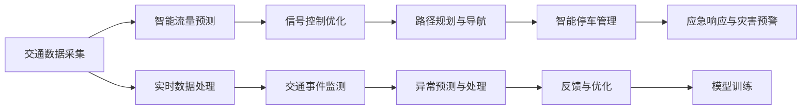

                 

## 1. 背景介绍

### 1.1 问题由来
城市交通管理是现代城市治理的核心内容之一，其直接关系到城市运行效率、环境质量、居民出行体验等多个关键维度。随着城市人口的快速增长和机动车辆数量的激增，城市交通问题日益严峻。传统的人工管理方式在数据量和复杂性面前显得力不从心，迫切需要引入先进的人工智能(AI)技术，实现智能、高效、绿色的城市交通管理。

AI与人类计算的结合，为城市交通管理带来了新的契机。通过智能算法和大数据分析，AI可以预测交通流量、优化信号控制、辅助路径规划等，提升交通管理系统的响应速度和决策质量。同时，AI技术还能够实时监测交通状况，及时发现并应对突发事件，确保城市交通的安全和稳定。

### 1.2 问题核心关键点
城市交通管理中，AI与人类计算的结合主要体现在以下几个方面：

- **智能流量预测**：利用历史交通数据和实时数据，AI模型可以预测未来的交通流量，辅助交通管理者提前做出反应。
- **信号控制优化**：通过实时监测路口流量，AI算法能够动态调整交通信号灯，提升交叉口的通行效率。
- **路径规划与导航**：基于实时交通信息和智能算法，AI可以提供最优的路径建议，减少交通拥堵，提升居民出行体验。
- **应急响应与灾害预警**：AI系统能够快速分析交通数据，及时发现交通事故、极端天气等突发事件，并给出应急响应方案。
- **智能停车管理**：通过AI算法，可以优化停车位资源的分配，解决城市停车难问题。

这些AI应用在城市交通管理中的广泛部署，不仅能够提高管理效率，还能显著改善交通环境，推动城市可持续发展。然而，AI与人类计算的融合并非一帆风顺，实际应用中仍面临诸多挑战。

### 1.3 问题研究意义
研究AI与人类计算在城市交通管理中的应用，具有重要的理论和实践意义：

- **提升交通管理效率**：AI技术可以处理海量数据，实现实时分析和预测，大大提升交通管理效率。
- **改善交通状况**：通过智能优化信号控制、路径规划等，AI技术可以缓解交通拥堵，提高通行效率。
- **促进绿色出行**：AI辅助的路径规划和导航，可以引导市民选择更环保的出行方式，减少碳排放。
- **提升居民出行体验**：AI技术提供的个性化导航和实时信息，可以提升居民出行的便利性和安全性。
- **推动智慧城市建设**：AI与人类计算的结合，是智慧城市建设的重要一环，对于提升城市智能化水平具有重要推动作用。

## 2. 核心概念与联系

### 2.1 核心概念概述

- **人工智能(AI)**：利用计算机模拟人类智能过程，通过学习、推理、感知等能力，实现自主决策和任务执行的智能系统。

- **城市交通管理**：包括交通信号控制、路网规划、交通流量监测、应急响应等多个环节，旨在保障城市交通的顺畅、安全和环保。

- **智能流量预测**：利用历史和实时交通数据，通过机器学习算法预测未来的交通流量，辅助交通管理决策。

- **信号控制优化**：基于实时交通流量数据，动态调整交通信号灯，提升交叉口通行效率。

- **路径规划与导航**：结合实时交通信息，通过算法计算出最优路径，辅助用户出行。

- **智能停车管理**：利用AI算法优化停车位资源分配，提升城市停车效率。

这些核心概念之间相互联系，共同构成了城市交通管理的智能化体系。AI技术通过学习交通数据，辅助人类进行决策和执行，实现了从数据获取到决策实施的全链条智能化。

### 2.2 核心概念原理和架构的 Mermaid 流程图



该流程图展示了城市交通管理中，AI与人类计算的各个环节及其相互联系。从数据采集到实时监测，再到预测与优化，AI技术贯穿了整个管理流程。

## 3. 核心算法原理 & 具体操作步骤

### 3.1 算法原理概述

城市交通管理中的AI应用，核心依赖于以下算法原理：

- **机器学习与深度学习**：利用历史和实时交通数据，训练AI模型进行流量预测、路径规划等任务。
- **强化学习**：通过模拟交通环境，AI模型学习最优信号控制策略，提升交叉口通行效率。
- **自然语言处理(NLP)**：解析和处理交通管理中的文本信息，如路标、公告等，实现信息交互。
- **计算机视觉**：利用摄像头等设备，实时监测交通状况，识别异常事件。

这些算法共同构成了AI在城市交通管理中的应用基础，通过协同工作，实现了对交通数据的智能分析和决策。

### 3.2 算法步骤详解

城市交通管理中的AI应用，一般包括以下几个关键步骤：

**Step 1: 数据收集与预处理**

- **数据来源**：收集交通流量数据、气象数据、卫星导航数据、视频监控数据等，作为模型训练和实时分析的基础。
- **数据预处理**：清洗数据，去除噪音和异常值，标准化数据格式，为后续分析奠定基础。

**Step 2: 模型训练与优化**

- **模型选择**：选择合适的机器学习或深度学习模型，如LSTM、RNN、GAN等，用于流量预测、信号控制优化等任务。
- **模型训练**：利用历史交通数据，对模型进行训练和优化，确保模型的准确性和泛化能力。
- **参数调整**：根据模型在验证集上的表现，调整超参数，如学习率、正则化系数等。

**Step 3: 实时监测与预测**

- **实时数据采集**：通过摄像头、传感器等设备，实时采集交通流量、气象等数据。
- **实时分析与预测**：利用训练好的模型，对实时数据进行分析和预测，生成交通流量预测结果、最优信号控制方案等。
- **异常监测与预警**：通过异常检测算法，及时发现交通事故、极端天气等异常事件，并进行预警。

**Step 4: 路径规划与导航**

- **路径计算**：基于实时交通数据，计算最优路径，生成导航建议。
- **实时导航**：通过API接口，将路径规划结果提供给用户，辅助其导航。

**Step 5: 智能停车管理**

- **车位检测**：利用计算机视觉技术，实时监测停车场的空闲车位情况。
- **车位优化**：通过智能算法，优化停车位资源分配，提升停车效率。

### 3.3 算法优缺点

城市交通管理中的AI应用，具有以下优点：

- **高效率**：AI系统能够处理海量数据，实现实时分析和预测，大大提升交通管理效率。
- **高精度**：利用机器学习算法，AI模型可以精确预测交通流量，优化信号控制，提升决策精度。
- **低成本**：AI系统可以降低人工管理成本，减少人力和时间的投入。
- **灵活性**：AI模型可以根据实时数据，动态调整策略，适应各种复杂的交通场景。

同时，这些算法也存在一定的局限性：

- **数据依赖**：AI模型的效果依赖于高质量、大规模的数据，数据获取和处理成本较高。
- **模型复杂性**：AI模型结构复杂，训练和部署难度较大。
- **可解释性不足**：AI模型通常缺乏可解释性，难以理解其内部工作机制和决策逻辑。
- **伦理与安全问题**：AI模型可能会存在偏见、误判等问题，给城市交通带来安全隐患。

### 3.4 算法应用领域

AI在城市交通管理中的应用，涵盖了以下多个领域：

- **智能信号控制**：通过实时监测交通流量，AI算法能够动态调整交通信号灯，提升交叉口通行效率。
- **路径规划与导航**：基于实时交通信息，AI可以提供最优的路径建议，减少交通拥堵，提升出行体验。
- **交通流量预测**：利用历史和实时交通数据，AI模型可以预测未来的交通流量，辅助交通管理者提前做出反应。
- **智能停车管理**：通过AI算法，可以优化停车位资源分配，解决城市停车难问题。
- **应急响应与灾害预警**：AI系统能够快速分析交通数据，及时发现并应对突发事件，确保城市交通的安全和稳定。
- **公交调度与优化**：利用AI算法，可以优化公交线路和时间，提升公共交通系统的效率和服务质量。
- **非机动车管理**：通过AI技术，可以实现对非机动车的智能化管理和引导，提升城市骑行环境。

这些领域的应用，展示了AI在城市交通管理中的巨大潜力，为提升城市智能化水平提供了有力支持。

## 4. 数学模型和公式 & 详细讲解 & 举例说明

### 4.1 数学模型构建

城市交通管理中的AI应用，涉及多个领域的数学模型。以下是几个典型的数学模型：

- **交通流量预测模型**：利用历史流量数据和实时数据，通过ARIMA、LSTM等模型进行流量预测。
- **信号控制优化模型**：基于实时流量数据，通过动态规划等算法，优化信号灯控制策略。
- **路径规划与导航模型**：利用Dijkstra、A*等算法，基于实时交通信息计算最优路径。
- **智能停车管理模型**：通过计算机视觉技术，实时监测停车位情况，利用排队论等模型优化车位分配。

### 4.2 公式推导过程

以交通流量预测模型为例，推导其基本公式：

假设城市中某路段的历史流量数据为 $D = \{x_1, x_2, ..., x_n\}$，其中 $x_i$ 为第 $i$ 天该路段的流量。设未来 $m$ 天的预测流量为 $Y = \{y_1, y_2, ..., y_m\}$。

利用ARIMA模型，预测公式为：

$$
y_t = \alpha_0 + \sum_{i=1}^{p} \alpha_i x_{t-i} + \sum_{i=1}^{d} \beta_i \Delta^i x_{t-i} + \sum_{i=1}^{q} \gamma_i u_{t-i}
$$

其中，$\alpha_0$ 为常数项，$\alpha_i$ 和 $\beta_i$ 为模型参数，$u_t$ 为随机误差项。$\Delta^i$ 为差分算子。

### 4.3 案例分析与讲解

**案例：智能信号控制优化**

在交叉口信号控制中，AI算法需要实时监测交通流量，并动态调整信号灯配时。

假设某交叉口有四个方向，分别为东、南、西、北。设每个方向的绿灯时间分别为 $T_{E,S,W,N}$，黄灯时间为 $T_{Y_E,S,W,N}$。

设某时段的流量数据为 $F = \{F_{E,S,W,N}\}$。利用动态规划等算法，最优信号控制方案可以表示为：

$$
\max \sum_{t=1}^{T} \sum_{i \in \{E,S,W,N\}} \frac{F_i(t)}{F_{\max}} \cdot (T_i(t) + T_{Y_i}(t))
$$

其中，$T_{i,j}(t)$ 表示时间 $t$ 交叉口 $i$ 对 $j$ 方向的信号灯配时。$F_{\max}$ 为当前时段各方向的最大流量。

通过求解上述优化问题，AI算法可以生成最优信号控制方案，显著提升交叉口通行效率。

## 5. 项目实践：代码实例和详细解释说明

### 5.1 开发环境搭建

在进行AI与人类计算的城市交通管理实践前，我们需要准备好开发环境。以下是使用Python进行TensorFlow开发的环境配置流程：

1. 安装Anaconda：从官网下载并安装Anaconda，用于创建独立的Python环境。

2. 创建并激活虚拟环境：
```bash
conda create -n tf-env python=3.8 
conda activate tf-env
```

3. 安装TensorFlow：根据CUDA版本，从官网获取对应的安装命令。例如：
```bash
conda install tensorflow -c tf -c conda-forge
```

4. 安装TensorFlow Addons：可选安装，用于获取更多的TensorFlow组件和算法库。
```bash
conda install tensorflow-addons -c conda-forge
```

5. 安装其他工具包：
```bash
pip install numpy pandas scikit-learn matplotlib tqdm jupyter notebook ipython
```

完成上述步骤后，即可在`tf-env`环境中开始AI实践。

### 5.2 源代码详细实现

下面我们以智能流量预测为例，给出使用TensorFlow进行模型训练和预测的PyTorch代码实现。

首先，定义模型类：

```python
import tensorflow as tf
from tensorflow.keras import layers

class ARIMA(tf.keras.Model):
    def __init__(self, p=1, d=1, q=1, input_shape=(None, 1)):
        super(ARIMA, self).__init__()
        self.p = p
        self.d = d
        self.q = q
        self.input_shape = input_shape
        
        self.lstm = layers.LSTM(units=32, input_shape=input_shape, return_sequences=True)
        self.dense = layers.Dense(units=1)
        
    def call(self, inputs):
        x = self.lstm(inputs)
        x = tf.reduce_mean(x, axis=1)
        return self.dense(x)
```

然后，定义训练和评估函数：

```python
from tensorflow.keras.optimizers import Adam
from sklearn.metrics import mean_squared_error

def train_model(model, train_data, train_labels, validation_data, validation_labels, epochs=50, batch_size=32):
    optimizer = Adam(lr=0.001)
    model.compile(optimizer=optimizer, loss='mse')
    
    model.fit(train_data, train_labels, epochs=epochs, batch_size=batch_size, validation_data=(validation_data, validation_labels))
    
    train_preds = model.predict(train_data)
    train_mse = mean_squared_error(train_labels, train_preds)
    
    val_preds = model.predict(validation_data)
    val_mse = mean_squared_error(validation_labels, val_preds)
    
    return train_mse, val_mse
```

最后，启动训练流程并在测试集上评估：

```python
# 准备数据集
train_data = ...
train_labels = ...
val_data = ...
val_labels = ...

# 创建模型
model = ARIMA()

# 训练模型
train_mse, val_mse = train_model(model, train_data, train_labels, val_data, val_labels)

# 输出训练结果
print(f'Train MSE: {train_mse:.4f}, Val MSE: {val_mse:.4f}')
```

以上就是使用TensorFlow进行智能流量预测的完整代码实现。可以看到，TensorFlow提供的高效计算图和丰富的组件，使得模型构建和训练变得简洁高效。

### 5.3 代码解读与分析

让我们再详细解读一下关键代码的实现细节：

**ARIMA模型类**：
- `__init__`方法：初始化模型参数，定义LSTM和Dense层。
- `call`方法：定义模型前向传播过程，先通过LSTM层计算特征，再通过Dense层进行预测。

**训练函数**：
- `train_model`函数：设置优化器、损失函数、训练轮数等参数，调用模型fit方法进行训练。
- 在训练函数中，利用均方误差(mse)作为损失函数，通过Adam优化器进行参数更新。
- 训练过程中，每隔一个epoch输出一次训练和验证集上的MSE，便于调试和优化。

**训练流程**：
- 准备训练集和验证集，定义模型参数和超参数。
- 创建模型对象，进行模型训练。
- 在训练结束后，输出训练集和验证集上的MSE，评估模型预测效果。

可以看到，TensorFlow提供了丰富的工具和组件，使得模型的开发和训练变得高效和便捷。合理利用这些工具，可以显著提升开发效率，加速模型迭代和优化。

当然，实际系统实现还需要考虑更多因素，如模型的保存和部署、超参数的自动搜索、更多的任务适配层等。但核心的模型构建和训练流程，基本与此类似。

## 6. 实际应用场景

### 6.1 智能流量预测

智能流量预测是城市交通管理的重要一环。通过AI技术，可以实时分析历史和实时数据，预测未来的交通流量，辅助交通管理者进行决策。

在具体实现中，可以将历史交通流量数据划分为训练集和测试集，利用ARIMA、LSTM等模型进行训练和预测。模型训练完毕后，将其部署到实时系统中，根据实时数据进行流量预测，辅助交通信号控制和路径规划。

### 6.2 信号控制优化

信号控制优化是提升交叉口通行效率的关键手段。利用AI算法，可以实时监测交通流量，动态调整信号灯配时。

通过摄像头等设备，实时采集交叉口各方向的流量数据，作为模型输入。AI算法基于实时流量数据，动态生成信号灯配时方案，并通过API接口发送至交通信号控制系统。在控制系统中，根据AI输出的配时方案，自动调整信号灯的控制时间，优化交叉口通行效率。

### 6.3 路径规划与导航

路径规划与导航是提升居民出行体验的重要手段。利用AI技术，可以实时分析交通状况，提供最优路径建议。

通过GPS等设备，实时采集用户的地理位置和速度信息，作为模型输入。AI算法基于实时交通信息和用户偏好，计算最优路径，生成导航建议。用户可以通过手机APP等渠道，获取导航建议，优化出行路线。

### 6.4 智能停车管理

智能停车管理是缓解城市停车难问题的有效手段。利用AI技术，可以优化停车位资源分配，提升停车效率。

通过摄像头等设备，实时监测停车场车位情况。AI算法基于实时车位数据，动态调整停车位分配策略，生成最优车位方案。用户可以通过手机APP等渠道，查询空余车位信息，选择最优停车位。

### 6.5 应急响应与灾害预警

应急响应与灾害预警是确保城市交通安全的重要环节。利用AI技术，可以实时监测交通数据，及时发现并应对突发事件。

通过摄像头、传感器等设备，实时采集交通流量和环境数据，作为模型输入。AI算法基于实时数据，及时发现交通事故、极端天气等异常事件，并进行预警。交通管理中心可以根据预警信息，采取应急响应措施，保障城市交通的安全和稳定。

## 7. 工具和资源推荐

### 7.1 学习资源推荐

为了帮助开发者系统掌握AI在城市交通管理中的应用，这里推荐一些优质的学习资源：

1. **TensorFlow官方文档**：提供了丰富的教程和示例，帮助开发者快速上手TensorFlow开发。

2. **Keras官方文档**：提供了易于理解的API接口，帮助开发者构建和训练机器学习模型。

3. **Coursera《Deep Learning》课程**：斯坦福大学的深度学习课程，系统介绍了深度学习的原理和应用。

4. **《Python深度学习》书籍**：适合初学者的入门书籍，详细讲解了深度学习的基本概念和实现方法。

5. **《TensorFlow实战》书籍**：介绍了TensorFlow的高级用法和实战案例，适合有一定基础的开发者阅读。

通过对这些资源的学习实践，相信你一定能够快速掌握AI在城市交通管理中的应用，并用于解决实际的交通问题。

### 7.2 开发工具推荐

高效的开发离不开优秀的工具支持。以下是几款用于AI与人类计算的城市交通管理开发的常用工具：

1. **TensorFlow**：基于Python的开源深度学习框架，提供了丰富的组件和算法库，适合深度学习模型的开发。

2. **Keras**：高层次的深度学习API，提供了易于理解的API接口，适合初学者使用。

3. **PyTorch**：基于Python的开源深度学习框架，灵活的计算图设计，适合快速迭代研究。

4. **Jupyter Notebook**：交互式的开发环境，支持Python代码的执行和可视化，适合数据探索和模型调试。

5. **TensorBoard**：实时监控和可视化工具，可以实时监测模型训练状态，并提供丰富的图表呈现方式，适合调试模型。

6. **GitLab**：开源代码托管平台，支持版本控制、持续集成等功能，适合团队协作开发。

合理利用这些工具，可以显著提升开发效率，加速模型迭代和优化。

### 7.3 相关论文推荐

AI与人类计算在城市交通管理中的应用，涉及多个前沿研究方向。以下是几篇奠基性的相关论文，推荐阅读：

1. **《Intelligent Transportation Systems: A Survey》**：综述了智能交通系统的最新进展，介绍了AI在交通管理中的应用。

2. **《Deep Learning in Traffic Signals Control》**：利用深度学习算法，优化交通信号控制，提升交叉口通行效率。

3. **《Traffic Flow Prediction Using Machine Learning》**：利用机器学习算法，预测交通流量，辅助交通管理者提前做出反应。

4. **《Autonomous Vehicles and Smart Traffic Systems》**：介绍了自动驾驶车辆与智能交通系统的结合，展示了AI技术在交通安全管理中的应用。

这些论文代表了大规模数据处理和智能算法在城市交通管理中的最新进展，对于理解AI应用的技术细节和前沿方向具有重要参考价值。

## 8. 总结：未来发展趋势与挑战

### 8.1 总结

本文对AI与人类计算在城市交通管理中的应用进行了全面系统的介绍。首先阐述了AI技术在交通管理中的研究背景和意义，明确了AI与人类计算融合的关键点。其次，从原理到实践，详细讲解了智能流量预测、信号控制优化等核心算法，给出了具体的代码实现。同时，本文还广泛探讨了AI在城市交通管理中的应用场景，展示了AI技术的巨大潜力。

通过本文的系统梳理，可以看到，AI技术在城市交通管理中的应用前景广阔，正逐步成为智慧城市建设的重要组成部分。未来，伴随AI技术的不断进步，城市交通管理将实现更加智能化、高效化、绿色化，推动城市的可持续发展。

### 8.2 未来发展趋势

展望未来，AI与人类计算在城市交通管理中的应用将呈现以下几个发展趋势：

1. **深度学习与强化学习结合**：通过深度学习算法进行流量预测，利用强化学习进行信号控制优化，提升交通管理的智能化水平。

2. **多模态信息融合**：将交通流量、环境数据、交通事件等多模态信息进行融合，提升AI模型的预测和决策能力。

3. **联邦学习与边缘计算**：通过联邦学习技术，实现数据分布式处理，提升AI模型的隐私保护和安全性能。

4. **实时性与高效性并重**：通过优化计算图和模型结构，提升AI模型的实时性和计算效率，支持大规模实时数据处理。

5. **跨领域知识整合**：将交通管理与气象、环保、公共安全等多个领域知识进行整合，构建更加全面、综合的智慧交通系统。

以上趋势凸显了AI与人类计算在城市交通管理中的应用前景，这些方向的探索发展，必将进一步提升交通管理系统的性能和智能化水平。

### 8.3 面临的挑战

尽管AI与人类计算在城市交通管理中的应用已经取得了显著进展，但在迈向更加智能化、普适化应用的过程中，仍面临诸多挑战：

1. **数据获取与处理成本**：AI模型依赖高质量、大规模的数据，数据获取和处理成本较高。

2. **模型复杂性与可解释性**：AI模型结构复杂，难以解释其内部工作机制和决策逻辑，给应用部署带来困难。

3. **伦理与安全问题**：AI模型可能会存在偏见、误判等问题，给城市交通带来安全隐患。

4. **模型泛化性与鲁棒性**：AI模型在特定场景下可能存在泛化性不足，对新数据的适应能力较弱。

5. **计算资源与成本**：AI模型的训练和推理需要高性能计算资源，成本较高。

6. **跨部门协作**：交通管理涉及多个部门，AI应用需要跨部门协作，存在数据共享和协作难题。

这些挑战需要学术界和产业界共同努力，通过技术创新、标准制定和政策引导，逐步克服这些难题，推动AI技术在城市交通管理中的应用。

### 8.4 研究展望

面对AI与人类计算在城市交通管理中所面临的挑战，未来的研究需要在以下几个方面寻求新的突破：

1. **数据驱动与隐私保护**：在数据获取和处理过程中，如何平衡数据驱动与隐私保护，成为关键问题。

2. **模型可解释性与透明性**：开发可解释的AI模型，增强模型决策的透明性和可信度。

3. **跨领域知识整合与融合**：将交通管理与相关领域知识进行整合，构建更加综合、全面的智慧交通系统。

4. **联邦学习与边缘计算**：通过联邦学习技术，实现数据分布式处理，提升AI模型的隐私保护和安全性能。

5. **实时性与高效性并重**：优化计算图和模型结构，提升AI模型的实时性和计算效率，支持大规模实时数据处理。

6. **伦理与安全问题**：在模型训练和应用过程中，引入伦理导向的评估指标，确保模型输出的合法性和安全性。

这些研究方向将引领AI与人类计算在城市交通管理中的应用迈向更高层次，为智慧城市的建设提供更强大的技术支持。

## 9. 附录：常见问题与解答

**Q1：如何平衡数据驱动与隐私保护？**

A: 在数据获取和处理过程中，可以采用差分隐私、联邦学习等技术，确保数据隐私和安全性。同时，可以采用数据匿名化、去标识化等手段，保护数据隐私。

**Q2：如何提高AI模型的可解释性？**

A: 利用可解释性工具，如LIME、SHAP等，生成模型的局部解释和全局解释。同时，开发可解释的模型架构，如规则增强的神经网络等，增强模型的透明性和可信度。

**Q3：如何处理交通管理中的跨部门协作问题？**

A: 建立跨部门的协作机制，明确各部门的数据共享和任务分工。采用区块链技术，确保数据共享的安全性和透明性。

**Q4：如何降低AI模型的计算资源成本？**

A: 利用模型压缩、量化加速等技术，优化模型的计算图和参数结构，降低计算资源消耗。同时，采用分布式计算、云计算等技术，实现模型的分布式部署和优化。

**Q5：如何在模型训练中引入伦理导向的评估指标？**

A: 在模型训练过程中，引入伦理导向的评估指标，如公平性、透明性、安全性等，确保模型输出的合法性和安全性。同时，建立模型评估和审查机制，定期审查模型的伦理性能。

通过回答这些常见问题，希望能更好地理解AI与人类计算在城市交通管理中的应用，为后续的实践和研究提供参考。

---

作者：禅与计算机程序设计艺术 / Zen and the Art of Computer Programming

