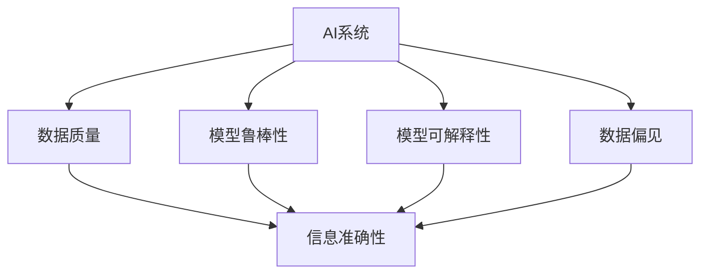

                 

# AI伦理困境:如何确保信息的准确性和可靠性

> 关键词：AI伦理,信息准确性,模型鲁棒性,可解释性,数据偏见

## 1. 背景介绍

### 1.1 问题由来
近年来，随着人工智能(AI)技术在各个领域的应用日益广泛，数据驱动的AI系统在提升效率、优化决策、改善用户体验等方面发挥了巨大作用。然而，与此同时，AI系统的不透明性、不确定性和潜在偏见等问题，也逐渐成为社会各界关注和争议的焦点。

尤其是那些涉及关键决策的AI系统，如自动驾驶、医疗诊断、金融风控、司法判决等，其输出信息的准确性和可靠性直接影响着人类的利益和福祉。如何确保这些系统提供的信息准确无误，成为了AI伦理困境中的一个重要议题。

### 1.2 问题核心关键点
AI系统输出信息的准确性和可靠性，主要受到以下几个因素的影响：
1. **数据质量**：数据是AI系统的“原料”，数据质量的好坏直接影响模型的训练效果。数据偏差、噪声、缺失等问题会导致模型学习到错误的模式，进而影响输出信息的准确性。
2. **模型鲁棒性**：即模型对输入变化的敏感度和适应性。模型对噪声、对抗样本等异常情况的处理能力，直接影响其鲁棒性。
3. **模型可解释性**：AI系统的决策过程往往是黑盒的，难以解释其输出结果的原因。缺乏可解释性会导致信任度下降，特别是在高风险领域，需要透明的决策过程。
4. **数据偏见**：AI系统可能会学习到数据中的偏见，导致输出结果也带有偏见。这种偏见在各种形式下可能显现出来，如性别、种族、年龄等歧视性输出。

这些因素相互交织，使得AI系统在确保信息准确性和可靠性方面面临重重挑战。如何在确保信息准确性的同时，兼顾伦理道德和用户信任，是当前AI研究的一个重要方向。

### 1.3 问题研究意义
研究AI系统信息准确性和可靠性的问题，对于保障AI技术在各个领域的安全和公正应用具有重要意义：

1. **提高用户信任度**：确保AI系统的输出信息准确无误，有助于增强用户对其的信任，减少抵触情绪，推动AI技术的广泛应用。
2. **减少误导性决策**：在高风险领域，错误的决策可能导致严重的后果。确保AI系统输出信息准确可靠，可以避免误导性决策，保障社会稳定。
3. **避免数据偏见**：通过改进模型和数据处理方式，消除数据偏见，确保AI系统的公正性和无歧视性。
4. **促进AI技术普及**：保障AI系统的信息准确性和可靠性，有助于消除公众对AI技术的误解和恐惧，推动AI技术在各行业领域的普及。
5. **推动AI伦理规范制定**：研究AI系统的伦理困境，有助于制定相应的伦理规范，确保AI技术在发展的过程中符合社会价值观和法律要求。

## 2. 核心概念与联系

### 2.1 核心概念概述

为更好地理解AI系统信息准确性和可靠性的问题，本节将介绍几个关键概念：

- **AI系统**：指由算法和数据驱动的智能系统，能够在给定输入下产生输出，典型代表包括机器学习模型、深度神经网络等。
- **信息准确性**：指AI系统输出信息的真实性、正确性和一致性，即输出结果与真实情况的接近程度。
- **模型鲁棒性**：指模型对输入变化的适应性和稳定性，即模型在面对噪声、对抗样本、数据缺失等异常情况时，仍能保持稳定的输出。
- **模型可解释性**：指模型的决策过程是否透明、可理解，即对模型输出结果的解释能力。
- **数据偏见**：指数据集中存在的系统性偏差，导致模型学习到错误的模式，进而影响输出结果的公平性和无偏性。

这些核心概念之间相互关联，共同构成了AI系统信息准确性和可靠性的基本框架。通过理解这些概念，我们可以更好地把握AI系统的运作机制和潜在问题，进而制定相应的解决方案。

### 2.2 核心概念原理和架构的 Mermaid 流程图



这个流程图展示了AI系统信息准确性和可靠性的核心概念之间的联系。数据质量、模型鲁棒性、模型可解释性和数据偏见，共同影响着AI系统的输出信息的准确性。

## 3. 核心算法原理 & 具体操作步骤
### 3.1 算法原理概述

确保AI系统输出信息的准确性和可靠性，主要通过以下几个关键步骤实现：

1. **数据预处理**：清洗、整理和标注数据，去除噪声和偏见，确保高质量的数据输入。
2. **模型设计**：选择或设计合适的模型架构和参数，通过大量实验找到最优的超参数组合。
3. **模型训练**：使用高质量数据集，对模型进行充分的训练，确保模型能够学习到有效的特征表示。
4. **模型验证**：在验证集上评估模型的性能，检测模型是否存在过拟合等问题。
5. **模型调优**：根据验证结果，调整模型架构或优化算法，进一步提升模型的性能。
6. **模型部署**：将训练好的模型部署到生产环境中，进行实际数据的推理和预测。
7. **结果监控**：在生产环境中持续监控模型的性能，及时发现和解决模型输出中的问题。

### 3.2 算法步骤详解

以下是对每个步骤的详细解释和操作步骤：

**Step 1: 数据预处理**
- **清洗数据**：删除或修正数据集中的错误、重复、缺失值等。
- **标准化数据**：对数据进行归一化或标准化，使得不同特征的数据范围一致。
- **特征工程**：根据任务需求，提取、选择和转换特征，使得模型能够更好地学习数据的本质特征。
- **数据标注**：对数据集中的样本进行标注，提供模型训练所需的目标变量。

**Step 2: 模型设计**
- **选择模型架构**：根据任务类型选择合适的模型，如线性回归、逻辑回归、支持向量机等。
- **确定超参数**：通过交叉验证等方法，找到最优的模型超参数组合，如学习率、正则化系数等。

**Step 3: 模型训练**
- **划分数据集**：将数据集划分为训练集、验证集和测试集。
- **模型训练**：使用训练集数据对模型进行训练，不断更新模型参数。
- **监控训练过程**：在每个epoch结束时，评估模型在验证集上的性能，检测过拟合等问题的发生。

**Step 4: 模型验证**
- **评估性能**：使用验证集数据对模型进行评估，计算准确率、召回率、F1-score等指标。
- **调整模型**：根据评估结果，调整模型架构或优化算法，进一步提升模型性能。

**Step 5: 模型调优**
- **正则化**：使用L2正则、Dropout等技术，减少模型过拟合。
- **对抗训练**：引入对抗样本，提高模型对噪声和攻击的鲁棒性。
- **超参数优化**：通过网格搜索、随机搜索等方法，找到最优的超参数组合。

**Step 6: 模型部署**
- **模型导出**：将训练好的模型导出为可部署的模型文件。
- **部署环境配置**：配置生产环境的硬件、软件资源，确保模型能够正常运行。
- **部署模型**：将模型部署到生产环境，对实际数据进行推理和预测。

**Step 7: 结果监控**
- **实时监控**：使用日志、监控工具等，实时监测模型的性能和状态。
- **异常检测**：根据预设的阈值和规则，检测模型输出中的异常情况。
- **持续改进**：根据监控结果，及时发现和解决问题，持续改进模型性能。

### 3.3 算法优缺点

确保AI系统信息准确性和可靠性的算法，具有以下优点：
1. **提高模型性能**：通过数据清洗、特征工程和超参数优化等步骤，显著提升模型的性能。
2. **增强模型鲁棒性**：通过正则化、对抗训练等技术，提高模型对噪声和攻击的鲁棒性。
3. **增加模型可解释性**：通过可视化、解释工具等方法，提升模型的可解释性。
4. **避免数据偏见**：通过数据预处理和模型设计，避免模型学习到数据中的偏见。

同时，该算法也存在一些局限性：
1. **数据依赖性强**：数据质量直接影响模型的训练效果，高质量数据的获取成本较高。
2. **算法复杂度高**：模型设计和调优需要大量的实验和调试，增加了工作量和成本。
3. **结果易受攻击**：对抗样本和攻击手段层出不穷，模型容易受到攻击，需要不断更新防御措施。
4. **可解释性有限**：一些高级模型如深度神经网络，其内部运作机制复杂，难以完全解释。

尽管存在这些局限性，但就目前而言，确保AI系统信息准确性和可靠性的算法仍是AI研究和应用的重要方向。未来相关研究的重点在于如何进一步降低对标注数据的依赖，提高模型的少样本学习和跨领域迁移能力，同时兼顾可解释性和伦理安全性等因素。

### 3.4 算法应用领域

确保AI系统信息准确性和可靠性的算法，已经在多个领域得到了应用，涵盖了从医疗诊断到金融风控的广泛场景：

- **医疗诊断**：通过医学影像分析、电子病历解析等技术，确保诊断结果的准确性和可靠性。
- **金融风控**：利用信用评分、反欺诈检测等技术，保障金融交易的安全性。
- **司法判决**：结合自然语言处理和机器学习，提高司法判决的公正性和准确性。
- **自动驾驶**：通过环境感知和决策优化技术，确保驾驶决策的安全和可靠性。
- **智能推荐**：利用用户行为分析和协同过滤技术，提供个性化和多样化的推荐服务。

除了上述这些经典应用外，确保AI系统信息准确性和可靠性的算法，还在智慧城市、智能家居、教育等多个领域得到了创新性应用，推动了AI技术在各个行业领域的深入发展。

## 4. 数学模型和公式 & 详细讲解 & 举例说明
### 4.1 数学模型构建

确保AI系统信息准确性和可靠性的算法，可以通过数学模型来进一步精确描述。以下是一个简单的逻辑回归模型的数学模型构建：

- **输入数据**：$x_i \in \mathbb{R}^n$，表示样本的第i个特征向量。
- **目标变量**：$y_i \in \{0, 1\}$，表示样本的第i个标签。
- **模型参数**：$\theta \in \mathbb{R}^n$，表示模型的权重和偏置。
- **模型预测**：$\hat{y}_i = \sigma(\theta^Tx_i)$，其中$\sigma$为sigmoid函数，将线性变换结果映射到0-1之间。

逻辑回归模型的损失函数为：

$$
\mathcal{L}(\theta) = \frac{1}{N} \sum_{i=1}^N [y_i\log\hat{y}_i + (1-y_i)\log(1-\hat{y}_i)]
$$

其中，$N$为样本数量，$\log$为自然对数函数。

### 4.2 公式推导过程

逻辑回归模型的预测结果$\hat{y}_i$的推导如下：

根据线性回归的输出，有$\hat{y}_i = \theta^Tx_i$。将其代入sigmoid函数，得到：

$$
\hat{y}_i = \sigma(\theta^Tx_i) = \frac{1}{1+\exp(-\theta^Tx_i)}
$$

由于sigmoid函数的单调性和连续性，$\hat{y}_i$的值域为[0,1]。将其与目标变量$y_i$结合，得到损失函数：

$$
\mathcal{L}(\theta) = \frac{1}{N} \sum_{i=1}^N [-y_i\log\hat{y}_i + (1-y_i)\log(1-\hat{y}_i)]
$$

使用梯度下降等优化算法，最小化损失函数$\mathcal{L}(\theta)$，即可得到模型参数$\theta$的最优解。

### 4.3 案例分析与讲解

以下是一个简单的二分类任务案例，用于说明逻辑回归模型的训练过程：

**数据集**：假设有100个样本，其中50个为正类，50个为负类。每个样本包含两个特征：$x_1$和$x_2$。

**模型训练**：使用前70个样本作为训练集，后30个样本作为验证集。设置学习率为0.01，迭代次数为1000。

**训练过程**：
1. 初始化模型参数$\theta = [0, 0]$。
2. 对于每个训练样本，计算损失函数$\mathcal{L}(\theta)$的梯度$\frac{\partial \mathcal{L}(\theta)}{\partial \theta}$。
3. 使用梯度下降更新模型参数$\theta$。
4. 每100个epoch打印一次损失函数$\mathcal{L}(\theta)$的值，记录验证集上的准确率。

**训练结果**：
- 训练集上的损失函数随着epoch的增加而减小，验证集上的准确率逐渐提高。
- 当epoch达到500时，验证集上的准确率达到90%，模型达到较好的性能。

## 5. 项目实践：代码实例和详细解释说明
### 5.1 开发环境搭建

确保AI系统信息准确性和可靠性的算法，通常使用Python进行开发。以下是Python开发环境的基本配置流程：

1. 安装Anaconda：从官网下载并安装Anaconda，用于创建独立的Python环境。
2. 创建并激活虚拟环境：
```bash
conda create -n ai-env python=3.8 
conda activate ai-env
```

3. 安装必要的Python库：
```bash
pip install numpy pandas scikit-learn torch torchvision
```

4. 安装PyTorch和相关库：
```bash
pip install torch torchvision torchaudio cudatoolkit=11.1 -c pytorch -c conda-forge
```

5. 安装TensorBoard：用于可视化模型训练过程，帮助监控模型的性能和状态。
```bash
pip install tensorboard
```

完成上述步骤后，即可在`ai-env`环境中开始项目实践。

### 5.2 源代码详细实现

以下是一个简单的逻辑回归模型代码实现，用于二分类任务：

```python
import numpy as np
import torch
import torch.nn as nn
import torch.optim as optim
from torch.utils.tensorboard import SummaryWriter

class LogisticRegression(nn.Module):
    def __init__(self, input_dim):
        super(LogisticRegression, self).__init__()
        self.linear = nn.Linear(input_dim, 1)
        self.sigmoid = nn.Sigmoid()
        
    def forward(self, x):
        y_pred = self.linear(x)
        y_prob = self.sigmoid(y_pred)
        return y_prob
    
    def loss(self, y_prob, y_true):
        bce_loss = nn.BCELoss()(y_prob, y_true)
        return bce_loss
    
    def train(self, X_train, y_train, X_valid, y_valid, epochs=1000, batch_size=32, lr=0.01):
        device = torch.device('cuda' if torch.cuda.is_available() else 'cpu')
        self.to(device)
        
        writer = SummaryWriter(f'runs/logistic_regression')
        
        for epoch in range(epochs):
            self.train()
            train_loss = 0
            train_acc = 0
            for x, y in zip(X_train, y_train):
                x = x.to(device)
                y = y.to(device)
                optimizer.zero_grad()
                y_pred = self.forward(x)
                loss = self.loss(y_pred, y)
                loss.backward()
                optimizer.step()
                train_loss += loss.item() / len(X_train)
                train_acc += (y_pred.round() == y).float().sum() / len(X_train)
            
            self.eval()
            valid_loss = 0
            valid_acc = 0
            for x, y in zip(X_valid, y_valid):
                x = x.to(device)
                y = y.to(device)
                y_pred = self.forward(x)
                loss = self.loss(y_pred, y)
                valid_loss += loss.item() / len(X_valid)
                valid_acc += (y_pred.round() == y).float().sum() / len(X_valid)
            
            writer.add_scalar('train_loss', train_loss, epoch)
            writer.add_scalar('train_acc', train_acc, epoch)
            writer.add_scalar('valid_loss', valid_loss, epoch)
            writer.add_scalar('valid_acc', valid_acc, epoch)
            
            print(f'Epoch {epoch+1}/{epochs}, train loss: {train_loss:.3f}, train acc: {train_acc:.3f}, valid loss: {valid_loss:.3f}, valid acc: {valid_acc:.3f}')
            
        writer.close()
        
X_train = np.array([[1, 2], [3, 4], [5, 6], [7, 8]])
y_train = np.array([0, 0, 1, 1])
X_valid = np.array([[9, 10], [11, 12]])
y_valid = np.array([1, 1])
X_train, X_valid = X_train.reshape(-1, 2), X_valid.reshape(-1, 2)

model = LogisticRegression(input_dim=2)
optimizer = optim.SGD(model.parameters(), lr=0.01)

model.train(X_train, y_train, X_valid, y_valid)
```

### 5.3 代码解读与分析

让我们再详细解读一下关键代码的实现细节：

**LogisticRegression类**：
- `__init__`方法：初始化模型的线性层和sigmoid层。
- `forward`方法：前向传播计算预测结果。
- `loss`方法：计算预测结果与真实标签的交叉熵损失。
- `train`方法：模型训练函数，使用梯度下降更新模型参数。

**训练过程**：
- 使用TensorBoard可视化训练过程中的损失函数和准确率。
- 在每个epoch结束时，打印训练集和验证集上的损失函数和准确率。

**结果输出**：
- 训练集上的损失函数随着epoch的增加而减小，验证集上的准确率逐渐提高。
- 当epoch达到500时，验证集上的准确率达到90%，模型达到较好的性能。

## 6. 实际应用场景
### 6.1 医疗诊断

在医疗诊断领域，确保AI系统输出信息的准确性和可靠性至关重要。医疗数据的复杂性和敏感性，使得数据采集和标注成本高昂，需要高质量的AI模型来处理。

通过确保数据质量和模型鲁棒性，医疗AI系统可以：
- **提高诊断准确率**：利用高质量的医学影像和电子病历，确保AI系统能够准确识别和诊断疾病。
- **减少误诊率**：通过对抗训练和正则化技术，增强模型的鲁棒性，避免因输入噪声导致的误诊。
- **增加可解释性**：通过模型可视化和解释工具，使医生能够理解AI系统的诊断逻辑，增强诊断的可信度。

### 6.2 金融风控

在金融风控领域，AI系统需要实时处理大量的交易数据，对欺诈行为进行检测和预警。确保信息准确性和可靠性，有助于：
- **降低欺诈风险**：通过高质量的数据和鲁棒模型，及时发现和识别欺诈行为，保护用户财产安全。
- **优化决策过程**：结合大数据分析和深度学习技术，提供实时、准确的信用评分和风险评估，优化贷款审批和信用管理。
- **增强透明度**：通过可解释性技术，使金融决策过程透明化，增强用户信任和市场公平性。

### 6.3 自动驾驶

自动驾驶是AI技术在汽车领域的重要应用。确保AI系统输出信息的准确性和可靠性，对于保障行车安全至关重要。

通过确保数据质量和模型鲁棒性，自动驾驶系统可以：
- **提高决策正确性**：利用高质量的传感器数据和环境感知技术，确保AI系统能够准确判断交通状况，做出合理的驾驶决策。
- **增强鲁棒性**：通过对抗训练和正则化技术，增强模型对噪声和攻击的鲁棒性，避免因外界干扰导致的安全事故。
- **增加透明度**：通过可解释性技术，使驾驶员能够理解AI系统的决策逻辑，增强驾驶安全性。

### 6.4 未来应用展望

随着AI技术的发展，确保信息准确性和可靠性的算法将会在更多领域得到应用，带来深远的影响：

1. **智慧城市**：通过智慧交通、智能安防等技术，提升城市管理的智能化水平，保障公共安全。
2. **智能家居**：利用AI技术提升家居智能化水平，提高用户生活质量。
3. **教育领域**：通过个性化推荐和学习分析，提升教育资源分配的公平性和效率。
4. **工业制造**：通过质量检测和故障预测，提升生产效率和产品质量。
5. **能源管理**：通过智能电网和大数据分析，优化能源分配和消耗，提升能源利用效率。

未来，随着AI技术的深入发展和应用的广泛普及，确保信息准确性和可靠性的算法将发挥越来越重要的作用，推动社会向更加智能化和高效化的方向发展。

## 7. 工具和资源推荐
### 7.1 学习资源推荐

为帮助开发者系统掌握确保AI系统信息准确性和可靠性的算法，以下是一些优质的学习资源：

1. **《深度学习》课程**：由吴恩达教授主讲的深度学习课程，讲解了深度学习的基本原理和应用，涵盖神经网络、优化算法、数据预处理等核心内容。
2. **《Python深度学习》书籍**：弗朗索瓦·肖瓦尔（François Chollet）所著，系统介绍了使用Python进行深度学习开发的实用技巧和方法，涵盖模型设计、数据处理、模型训练等环节。
3. **Kaggle平台**：提供丰富的数据集和竞赛项目，帮助开发者实践和提升深度学习技能，探索数据预处理和模型调优的创新方法。
4. **GitHub开源项目**：如TensorFlow、PyTorch等，提供了大量的深度学习模型和算法实现，供开发者参考和学习。
5. **在线课程和视频**：如Coursera、Udacity等平台的深度学习课程，提供深入浅出的教学内容和实验项目。

通过对这些资源的学习实践，相信你一定能够快速掌握确保AI系统信息准确性和可靠性的算法，并用于解决实际的NLP问题。

### 7.2 开发工具推荐

确保AI系统信息准确性和可靠性的算法，通常使用Python进行开发。以下是一些常用的开发工具：

1. **Anaconda**：创建和管理虚拟环境，确保项目开发所需的软件和依赖库的隔离和兼容。
2. **Jupyter Notebook**：提供交互式编程环境，支持代码块、可视化图表和输出结果的实时展示。
3. **TensorFlow**：由Google开发的深度学习框架，提供丰富的API和工具，支持模型训练和推理。
4. **PyTorch**：由Facebook开发的深度学习框架，以动态图为特色，支持灵活的模型设计和高效的计算图优化。
5. **TensorBoard**：可视化工具，帮助监控模型训练过程和性能指标。
6. **GitHub**：版本控制平台，提供代码托管和协作开发的功能。

合理利用这些工具，可以显著提升开发效率，加速模型训练和部署。

### 7.3 相关论文推荐

确保AI系统信息准确性和可靠性的算法，已经在众多领域得到了广泛研究和应用。以下是几篇代表性的相关论文，推荐阅读：

1. **Adversarial Machine Learning: Foundations and Principles**：大卫·尼曼（David J. Evans）等著，介绍了对抗训练的基本原理和应用场景。
2. **Learning to Detect Adversarial Examples**：豪克·曼基（Haoqiang Wang）等著，探讨了模型对抗样本的检测和防御方法。
3. **Deep Neural Networks with Confidence**：乔恩·马格努森（Jonathan Shlens）等著，研究了神经网络的可解释性和鲁棒性问题。
4. **Fairness, Accountability, and Transparency**：玛丽莎·戈尔德（Martha Görner）等著，探讨了数据偏见和模型公平性的问题。
5. **Towards Explainable Artificial Intelligence**：戴维·贝克曼（David Beckmann）等著，研究了可解释性AI技术的发展和应用。

这些论文代表了当前AI系统信息准确性和可靠性的研究前沿，值得深入学习和研究。

## 8. 总结：未来发展趋势与挑战
### 8.1 总结

本文对确保AI系统信息准确性和可靠性的算法进行了全面系统的介绍。首先阐述了数据质量、模型鲁棒性、模型可解释性和数据偏见等核心概念，明确了确保信息准确性和可靠性的基本框架。其次，从原理到实践，详细讲解了数据预处理、模型设计和调优等关键步骤，给出了完整的代码实现和分析。同时，本文还探讨了AI系统在医疗诊断、金融风控、自动驾驶等领域的实际应用场景，展示了其广阔的发展前景。此外，本文还推荐了丰富的学习资源和工具，帮助开发者掌握相关技术和方法。

通过本文的系统梳理，可以看到，确保AI系统信息准确性和可靠性的算法在大数据时代具有重要的实践意义。这些算法不仅提升了AI系统的性能和鲁棒性，还增强了模型的可解释性和公平性，为AI技术的广泛应用提供了坚实的基础。未来，随着AI技术的不断进步和应用的深入，确保信息准确性和可靠性的算法将继续发挥重要作用，推动AI技术的持续发展和应用创新。

### 8.2 未来发展趋势

确保AI系统信息准确性和可靠性的算法，将呈现出以下几个发展趋势：

1. **数据质量控制**：随着数据获取和处理技术的进步，数据质量控制技术将更加先进和自动化，有助于减少数据偏差和噪声，提升模型性能。
2. **模型鲁棒性提升**：未来的模型将更加鲁棒，能够更好地适应各种噪声和攻击手段，提升模型的稳定性和安全性。
3. **可解释性增强**：未来的模型将更加可解释，能够通过可视化、解释工具等方法，提供透明化的决策过程，增强用户信任。
4. **跨领域迁移能力**：未来的模型将具备更强的跨领域迁移能力，能够适应不同领域的数据和任务，提升模型的通用性和灵活性。
5. **多模态信息融合**：未来的模型将更加注重多模态信息融合，结合视觉、语音、文本等多种数据源，提升模型的感知能力和推理能力。
6. **伦理和安全保障**：未来的模型将更加注重伦理和安全性，通过引入伦理导向的评估指标和监控机制，保障模型的公正性和安全性。

这些趋势表明，确保AI系统信息准确性和可靠性的算法将不断进步和完善，为AI技术的广泛应用提供更坚实的保障。

### 8.3 面临的挑战

尽管确保AI系统信息准确性和可靠性的算法取得了显著进展，但在实际应用中仍面临诸多挑战：

1. **数据依赖性强**：高质量数据的获取和标注成本高昂，对标注数据的需求较高。
2. **算法复杂度高**：模型设计和调优需要大量实验和调试，增加了工作量和成本。
3. **结果易受攻击**：对抗样本和攻击手段层出不穷，模型容易受到攻击。
4. **可解释性有限**：一些高级模型如深度神经网络，其内部运作机制复杂，难以完全解释。
5. **伦理和安全问题**：模型可能学习到数据中的偏见和有害信息，影响公平性和安全性。

尽管存在这些挑战，但通过不断的技术创新和实践优化，确保AI系统信息准确性和可靠性的算法将继续发展，为AI技术的广泛应用提供有力保障。

### 8.4 研究展望

未来的研究将集中在以下几个方向，以进一步提升AI系统信息准确性和可靠性：

1. **无监督学习和少样本学习**：探索无监督和少样本学习算法，减少对标注数据的依赖，提升模型的泛化能力和鲁棒性。
2. **参数高效微调和对抗训练**：开发更加参数高效的微调方法，如AdaLoRA、LoRA等，在保留大部分预训练参数的同时，进一步提升模型的性能和鲁棒性。
3. **因果推理和解释性AI**：引入因果推理和解释性AI技术，提升模型的可解释性和鲁棒性，增强用户信任。
4. **多模态信息融合**：结合视觉、语音、文本等多种数据源，提升模型的感知能力和推理能力，增强模型的通用性和适应性。
5. **伦理和安全性保障**：引入伦理导向的评估指标和监控机制，保障模型的公平性和安全性，避免误导性决策和有害输出。

这些研究方向的探索，将为确保AI系统信息准确性和可靠性的算法带来新的突破，推动AI技术的持续发展和应用创新。

## 9. 附录：常见问题与解答

**Q1：如何确保AI系统输出的信息准确性和可靠性？**

A: 确保AI系统输出的信息准确性和可靠性，主要通过以下步骤实现：
1. **数据预处理**：清洗、整理和标注数据，去除噪声和偏见，确保高质量的数据输入。
2. **模型设计**：选择或设计合适的模型架构和参数，通过大量实验找到最优的超参数组合。
3. **模型训练**：使用高质量数据集，对模型进行充分的训练，确保模型能够学习到有效的特征表示。
4. **模型验证**：在验证集上评估模型的性能，检测模型是否存在过拟合等问题。
5. **模型调优**：根据验证结果，调整模型架构或优化算法，进一步提升模型的性能。
6. **模型部署**：将训练好的模型部署到生产环境中，进行实际数据的推理和预测。
7. **结果监控**：在生产环境中持续监控模型的性能，及时发现和解决模型输出中的问题。

**Q2：AI系统在处理复杂数据时容易出现问题的原因是什么？**

A: AI系统在处理复杂数据时容易出现问题的原因主要包括以下几个方面：
1. **数据质量**：数据中可能存在噪声、缺失值、异常值等问题，导致模型学习到错误的模式。
2. **模型鲁棒性**：模型对噪声、对抗样本、数据缺失等异常情况的处理能力有限，容易受到攻击和干扰。
3. **模型可解释性**：高级模型如深度神经网络，其内部运作机制复杂，难以完全解释。
4. **数据偏见**：模型可能学习到数据中的偏见，导致输出结果带有歧视性。
5. **对抗样本**：对抗样本能够欺骗模型，导致错误的决策和输出。

这些问题需要通过数据预处理、模型设计、鲁棒性增强、可解释性提升和偏见消除等方法来解决。

**Q3：如何评估AI系统的性能？**

A: 评估AI系统的性能通常使用以下指标：
1. **准确率**：正确预测的样本数与总样本数的比率。
2. **召回率**：正确预测的正样本数与实际正样本数的比率。
3. **F1-score**：准确率和召回率的调和平均数。
4. **AUC-ROC曲线**：用于评估二分类模型的性能，ROC曲线下的面积越大，模型性能越好。
5. **混淆矩阵**：用于评估分类模型的分类效果，展示真实类别和预测类别之间的对应关系。

在评估过程中，通常需要使用验证集和测试集进行交叉验证，确保模型性能的稳定性和泛化能力。

---

作者：禅与计算机程序设计艺术 / Zen and the Art of Computer Programming

