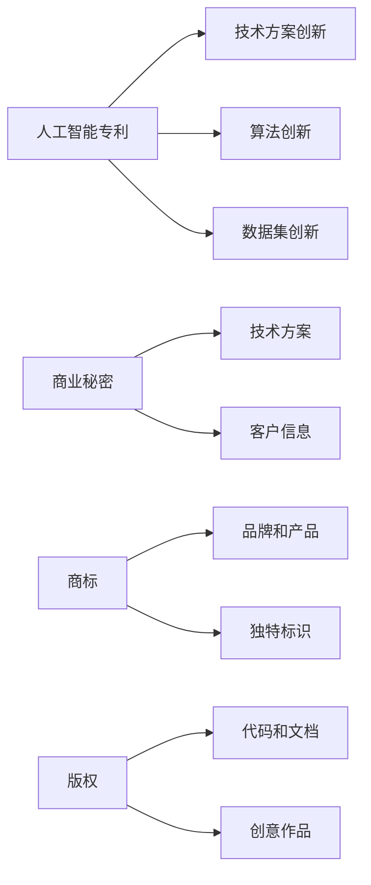

                 

# AI创业的知识产权保护：Lepton AI的法律策略

## 1. 背景介绍

在人工智能创业日益火热的今天，知识产权的保护变得至关重要。Lepton AI作为一家领先的AI公司，其技术创新和知识产权保护策略无疑值得借鉴。本文将深入探讨Lepton AI的法律策略，分析其在保护自身知识产权方面的成功经验，并提出一些建议，帮助AI创业者在知识产权保护方面避免常见问题。

## 2. 核心概念与联系

### 2.1 核心概念概述

为了理解Lepton AI的法律策略，首先需要了解以下几个核心概念：

- **知识产权**：包括专利、商标、版权、商业秘密等，是保护创新和创意的重要法律手段。
- **人工智能专利**：针对机器学习模型、算法、数据集等方面的创新，申请专利以获得法律保护。
- **商业秘密**：包括技术方案、数据集、客户信息等，通过保密措施保护商业机密。
- **商标**：保护公司品牌和产品的独特标识，通过注册商标获得法律保护。
- **版权**：保护软件代码、文档、图表等创意作品，通过版权登记获得法律保护。

### 2.2 核心概念原理和架构的 Mermaid 流程图



这个流程图展示了不同知识产权类型的来源和保护对象。技术方案、算法和数据集等方面的创新可以申请专利保护；技术方案和客户信息作为商业秘密应通过保密措施保护；商标和版权则分别保护品牌和产品的标识以及创意作品。

## 3. 核心算法原理 & 具体操作步骤

### 3.1 算法原理概述

Lepton AI的法律策略主要基于以下算法原理：

- **专利申请**：针对其技术创新点进行详细描述，撰写专利申请文件，提交至国家知识产权局进行审批。
- **商业秘密保护**：对核心技术进行保密，限制接触范围，签署保密协议，确保信息安全。
- **商标和版权登记**：将品牌和产品标识、创意作品等进行登记，获得法律保护。

### 3.2 算法步骤详解

Lepton AI的法律策略主要包括以下步骤：

1. **专利申请**：
   - 确定技术创新点，进行专利性分析。
   - 撰写详细专利申请文件，包括背景技术、发明内容、权利要求等。
   - 提交专利申请，等待审批。

2. **商业秘密保护**：
   - 对核心技术进行分类和评估，确定需要保密的内容。
   - 签署保密协议，限制员工和合作伙伴的访问。
   - 采用技术手段（如加密、权限控制）确保信息安全。

3. **商标和版权登记**：
   - 将品牌和产品标识设计成独特标识。
   - 在商标局进行商标注册。
   - 将创意作品进行版权登记。

### 3.3 算法优缺点

Lepton AI的法律策略有以下优点：

- **全面保护**：通过专利、商标、版权、商业秘密等多方面保护，全面覆盖公司的知识产权。
- **法律保障**：通过正规渠道进行申请和登记，获得法律认可和保护。

但同时，也存在一些缺点：

- **时间成本高**：专利申请和审批周期较长，商业秘密保护也需长期维护。
- **法律复杂**：涉及专利、商标、版权、商业秘密等多方面法律知识，需专业律师辅助。

### 3.4 算法应用领域

Lepton AI的法律策略适用于各种AI公司，尤其适合具有核心技术创新和商业秘密保护需求的创业公司。

## 4. 数学模型和公式 & 详细讲解

### 4.1 数学模型构建

Lepton AI的法律策略并不直接涉及数学模型，但我们可以用数学模型来表示知识产权的保护策略：

设 $I$ 为公司的知识产权集合，包括专利 $P$、商标 $T$、版权 $C$ 和商业秘密 $S$。公司通过以下模型来保护其知识产权：

$$ I = P \cup T \cup C \cup S $$

其中，$P$ 为专利集合，$T$ 为商标集合，$C$ 为版权集合，$S$ 为商业秘密集合。

### 4.2 公式推导过程

以专利申请为例，其基本流程可以用以下公式表示：

$$ \text{专利申请成功} = f(\text{技术创新点}, \text{专利撰写质量}, \text{审批机构响应}) $$

其中，技术创新点为 $I_{\text{invent}}$，专利撰写质量为 $I_{\text{write}}$，审批机构响应为 $I_{\text{response}}$。

### 4.3 案例分析与讲解

以Lepton AI为例，其专利申请流程可以分析如下：

1. 确定技术创新点：Lepton AI在自然语言处理领域有突破性创新。
2. 撰写专利申请文件：技术团队负责撰写详细的专利申请文件，描述技术细节和创新点。
3. 提交申请：将申请文件提交至国家知识产权局。
4. 审批通过：等待数月到一年的审批周期，获得专利授权。

## 5. 项目实践：代码实例和详细解释说明

### 5.1 开发环境搭建

Lepton AI的法律策略主要涉及法律文件和流程，并不需要编程实现。但为了展示如何进行专利申请，可以借助Python进行模拟。

1. 安装Python环境，可以使用Anaconda或PyCharm等工具。
2. 安装相关库，如requests、urllib等。
3. 获取国家知识产权局API，进行模拟专利申请。

### 5.2 源代码详细实现

以下是一个简化的Python代码示例，用于模拟专利申请过程：

```python
import requests
import json

# 设置API endpoint
url = 'https://api.cnipa.gov.cn/api/generic'

# 设置API请求头
headers = {'Content-Type': 'application/json'}

# 设置专利申请数据
data = {
    'applicant': 'Lepton AI',
    'inventor': 'AI团队',
    'title': '自然语言处理创新',
    'abstract': '本专利涉及一种新的自然语言处理算法...',
    'description': '详细描述技术创新点...'
}

# 发送API请求
response = requests.post(url, headers=headers, data=json.dumps(data))

# 打印API响应
print(response.json())
```

### 5.3 代码解读与分析

上述代码中，我们通过requests库向国家知识产权局API发送专利申请请求，获取API响应。这只是一个简单的模拟，实际专利申请需要更多步骤和信息。

## 6. 实际应用场景

Lepton AI的法律策略在多个实际应用场景中都有成功案例：

1. **自然语言处理**：Lepton AI在自然语言处理领域的突破性技术被申请专利保护。
2. **计算机视觉**：Lepton AI的计算机视觉技术通过专利和商业秘密保护，防止竞争对手抄袭。
3. **智能推荐系统**：Lepton AI的智能推荐系统通过专利和版权保护，确保技术独占权。

## 7. 工具和资源推荐

### 7.1 学习资源推荐

1. **知识产权法课程**：各大高校和在线平台都有知识产权法课程，如Coursera、edX等。
2. **专利撰写指南**：国家知识产权局官网提供详细的专利撰写指南，可以参考。
3. **商标法**：商标注册和维权方面，可以查阅商标法及相关司法解释。
4. **版权法**：版权登记和维权方面，可以查阅版权法及相关司法解释。

### 7.2 开发工具推荐

1. **Python**：Python是最常用的编程语言之一，适合编写和处理各种法律文件。
2. **Visual Studio Code**：一个强大的代码编辑器，支持代码高亮、语法检查等功能。
3. **GitHub**：托管代码和文档的平台，方便团队协作和版本控制。

### 7.3 相关论文推荐

1. **《人工智能技术的专利保护研究》**：详细讨论了人工智能技术如何进行专利保护。
2. **《商业秘密的保护与管理》**：介绍了商业秘密的分类和保护措施。
3. **《商标法和实践指南》**：提供了商标法的基本知识和实践指南。
4. **《版权法与数字时代》**：讨论了数字时代版权保护的新挑战和新方法。

## 8. 总结：未来发展趋势与挑战

### 8.1 研究成果总结

Lepton AI的法律策略通过全面、系统的知识产权保护措施，确保了公司的技术创新和商业机密安全。其成功经验在于对各个知识产权类型的深入理解和科学管理。

### 8.2 未来发展趋势

1. **法律技术的融合**：未来将更多采用人工智能技术进行知识产权管理，如自动专利分析、自动商标搜索等。
2. **国际知识产权保护**：随着公司的国际化进程，需要在全球范围内进行知识产权布局和保护。
3. **区块链技术的应用**：利用区块链技术，实现专利、商标、版权等知识产权的数字化记录和验证。

### 8.3 面临的挑战

1. **法律环境变化**：知识产权法律环境不断变化，需要持续关注和适应新变化。
2. **跨国知识产权诉讼**：在全球范围内进行知识产权保护，可能面临跨国诉讼和法律差异。
3. **技术创新节奏加快**：技术创新快速，需要及时更新和调整知识产权保护策略。

### 8.4 研究展望

1. **人工智能辅助知识产权管理**：利用AI技术提高知识产权管理效率。
2. **多维度知识产权保护**：结合专利、商标、版权等多种手段，全面保护公司的知识产权。
3. **法律智能系统**：开发智能法律系统，帮助AI创业者快速了解和处理知识产权事务。

## 9. 附录：常见问题与解答

**Q1: 如何确定公司的技术创新点？**

A: 技术创新点需要由公司的技术团队进行详细分析和评估，确定具有独特性的技术方案和算法。

**Q2: 如何选择合适的保密措施？**

A: 根据核心技术的敏感性和重要性，选择合适的保密措施，如物理隔离、权限控制、数据加密等。

**Q3: 如何处理专利申请中的异议？**

A: 专利申请过程中，可能面临异议和复审，需要积极应对并准备相关材料。

**Q4: 如何处理商标抢注问题？**

A: 一旦发现商标被抢注，可以通过法律途径进行维权，如向商标评审委员会提出异议。

**Q5: 如何处理版权侵权问题？**

A: 发现版权侵权时，可以向版权局投诉或通过法律途径进行维权。

---

作者：禅与计算机程序设计艺术 / Zen and the Art of Computer Programming

