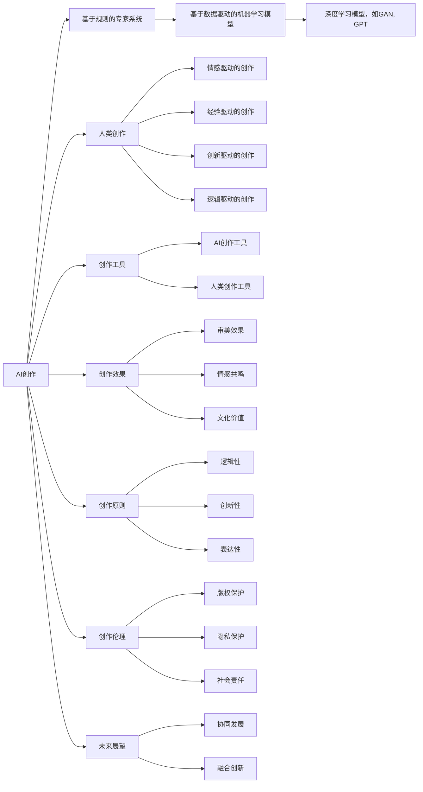

                 

# AI创作vs人类创作：界限与融合

在人工智能(AI)快速发展的今天，AI创作逐渐走入人们的视野，它不仅在艺术、文学、音乐等领域中展现出了卓越的才华，还在新闻报道、科学论文、法律文书等多个实际应用场景中发挥着重要作用。与此同时，人类创作的独特性和无可替代性依旧显著。本文将深入探讨AI创作与人类创作的界限和融合，分析它们各自的优势与局限，并展望未来的发展趋势。

## 1. 背景介绍

### 1.1 问题的由来

人工智能技术的进步让机器具备了模仿和生成人类创作作品的能力。从最早的基于规则的专家系统，到后来基于数据驱动的机器学习模型，AI创作的能力日益强大。尤其是在自然语言处理(NLP)、计算机视觉等领域，AI创作已经成为现实。这些AI创作的产品，比如基于GPT-3的文章、图像生成技术生成的图片、AI作曲的音乐等，都在不同程度上挑战了人类创作的权威性。

然而，人类创作与AI创作之间并非简单的竞争关系。AI创作在保持逻辑严密、表达清晰等优势的同时，也保留了一定的艺术性和创新性。在很多时候，AI创作可以作为一种工具，增强人类创作的效果，提升创作效率。但如何界定AI创作与人类创作的界限，如何将二者有效融合，仍然是一个亟待解决的问题。

### 1.2 问题核心关键点

为了更好地理解和探讨AI创作与人类创作的界限与融合，本文将从以下几个核心关键点出发：

1. **创作原则**：AI创作遵循何种创作原则，与人类创作有何不同？
2. **创作效果**：AI创作与人类创作在创作效果上存在哪些差异，各自的优势和局限性是什么？
3. **创作工具**：AI创作在人类创作中扮演怎样的角色，如何作为工具提升创作效率？
4. **创作伦理**：AI创作在伦理上存在哪些问题，如何保障创作的安全性和道德性？
5. **未来展望**：AI创作与人类创作如何协同发展，未来将呈现出怎样的趋势？

## 2. 核心概念与联系

### 2.1 核心概念概述

要深入理解AI创作与人类创作的界限与融合，需要明确以下几个核心概念：

1. **AI创作**：指使用人工智能技术，通过算法和模型生成具有一定创作性的作品，如文本、图像、音乐等。
2. **人类创作**：指人类基于情感、思想、经验等主观因素进行的创作活动，包括文学、艺术、科学等领域的作品。
3. **创作原则**：指指导创作活动的规则和方法，包括逻辑性、创新性、表达性等。
4. **创作效果**：指创作作品的质量和影响力，包括审美、情感共鸣、文化价值等。
5. **创作工具**：指辅助创作的技术和工具，如文本编辑器、图像处理软件、AI创作工具等。
6. **创作伦理**：指创作过程中应遵守的道德规范，包括版权、隐私、社会责任等。
7. **未来展望**：指AI创作与人类创作协同发展的趋势和可能性。

### 2.2 核心概念原理和架构的 Mermaid 流程图(Mermaid 流程节点中不要有括号、逗号等特殊字符)



## 3. 核心算法原理 & 具体操作步骤

### 3.1 算法原理概述

AI创作的原理基于计算机科学和数据科学，通过算法和模型生成作品。其核心算法包括：

1. **深度学习模型**：如卷积神经网络(CNN)、循环神经网络(RNN)、变分自编码器(VAE)等，通过大量数据训练，学习到数据中的模式和结构，生成具有一定艺术性和创新性的作品。
2. **生成对抗网络(GAN)**：通过两个神经网络相互对抗训练，生成逼真的作品，如图像、音频等。
3. **预训练模型**：如BERT、GPT等，在大量无标签数据上进行预训练，学习到语言和文本的结构，通过微调生成特定领域的文本作品。
4. **自然语言处理(NLP)**：通过文本清洗、词性标注、情感分析等技术，对文本数据进行处理，生成具有逻辑性和表达性的作品。

### 3.2 算法步骤详解

AI创作通常包括以下几个关键步骤：

1. **数据准备**：收集和处理创作所需的数据，如文本、图片、音频等。
2. **模型训练**：使用深度学习模型或生成对抗网络等，在数据上进行训练，学习到创作模式。
3. **生成作品**：将训练好的模型应用于新的数据，生成具有一定创作性的作品。
4. **评估与优化**：对生成的作品进行评估，优化模型参数，提高创作效果。
5. **应用与反馈**：将生成的作品应用于实际场景，收集用户反馈，进一步优化模型。

### 3.3 算法优缺点

AI创作具有以下优点：

1. **高效性**：能够快速生成大量作品，缩短创作周期。
2. **逻辑性**：生成的作品具有较高的逻辑性和一致性。
3. **多样性**：可以生成多种类型和风格的作品，满足不同需求。

但同时，AI创作也存在一些缺点：

1. **缺乏情感**：生成的作品缺乏人类情感和个性，难以产生深层次的共鸣。
2. **创新性不足**：作品往往缺乏原创性，依赖于训练数据的质量和数量。
3. **伦理风险**：可能生成有害或侵权的作品，缺乏伦理约束。

### 3.4 算法应用领域

AI创作在多个领域中得到了广泛应用，包括：

1. **艺术创作**：使用GAN等模型生成绘画、雕塑等艺术作品。
2. **文学创作**：使用预训练模型生成小说、诗歌等文学作品。
3. **音乐创作**：使用深度学习模型生成歌曲、音乐等。
4. **新闻报道**：使用NLP技术自动生成新闻报道。
5. **科学论文**：使用预训练模型生成研究报告和论文。
6. **法律文书**：使用AI生成合同、法律意见书等。

## 4. 数学模型和公式 & 详细讲解 & 举例说明

### 4.1 数学模型构建

以文本生成为例，使用预训练模型生成文章的步骤如下：

1. **数据预处理**：对原始文本进行清洗、分词、词性标注等预处理。
2. **特征提取**：使用嵌入层将文本转换为向量表示。
3. **预训练模型**：使用预训练模型BERT、GPT等，在大量数据上预训练，学习到语言结构。
4. **微调**：在特定领域的少量标注数据上微调模型，使其适应特定任务。
5. **生成文章**：使用微调后的模型生成新文章。

数学公式如下：

$$
\text{文章} = \text{模型}(\text{输入文本})
$$

### 4.2 公式推导过程

以生成对抗网络(GAN)为例，其基本框架如下：

1. **生成器**：通过训练学习生成与真实数据分布接近的伪造数据。
2. **判别器**：通过训练学习区分真实数据和伪造数据。
3. **对抗训练**：生成器和判别器互相竞争，生成器不断改进，生成逼真的数据。

数学公式如下：

$$
G(x) = \text{生成器}(x)
$$
$$
D(x) = \text{判别器}(x)
$$
$$
\min_{G} \max_{D} V(D, G) = \mathbb{E}_{x \sim p_{data}}[\log D(x)] + \mathbb{E}_{z \sim p_{z}}[\log(1-D(G(z)))]
$$

其中，$x$为真实数据，$z$为随机噪声向量，$G$为生成器，$D$为判别器，$V(D,G)$为对抗损失函数。

### 4.3 案例分析与讲解

以使用GAN生成艺术作品为例，其步骤如下：

1. **数据准备**：收集艺术作品的数据集，如绘画、雕塑等。
2. **生成器训练**：使用GAN模型，在数据集上训练生成器，学习生成与真实作品相似的伪造作品。
3. **判别器训练**：使用判别器模型，在数据集上训练判别器，学习区分真实作品和伪造作品。
4. **对抗训练**：在训练过程中，生成器和判别器互相竞争，生成器不断改进，生成逼真的作品。
5. **作品生成**：使用训练好的生成器，生成新的艺术作品。

## 5. 项目实践：代码实例和详细解释说明

### 5.1 开发环境搭建

为了进行AI创作实践，需要搭建好Python开发环境，具体步骤如下：

1. **安装Python**：从官网下载安装Python，建议安装最新版本。
2. **安装PyTorch**：使用pip安装PyTorch，便于使用深度学习框架。
3. **安装TensorFlow**：使用pip安装TensorFlow，便于使用TensorFlow进行模型训练。
4. **安装OpenAI Gym**：使用pip安装OpenAI Gym，便于进行强化学习实验。
5. **安装相关库**：安装其他必要的库，如Numpy、Pandas、Matplotlib等。

### 5.2 源代码详细实现

以下是一个使用PyTorch进行文本生成的Python代码示例：

```python
import torch
from transformers import BertTokenizer, BertForSequenceClassification
from transformers import AdamW

# 加载模型和tokenizer
model = BertForSequenceClassification.from_pretrained('bert-base-cased')
tokenizer = BertTokenizer.from_pretrained('bert-base-cased')

# 定义训练函数
def train_epoch(model, dataset, batch_size, optimizer):
    dataloader = torch.utils.data.DataLoader(dataset, batch_size=batch_size, shuffle=True)
    model.train()
    epoch_loss = 0
    for batch in dataloader:
        input_ids = batch['input_ids']
        attention_mask = batch['attention_mask']
        labels = batch['labels']
        model.zero_grad()
        outputs = model(input_ids, attention_mask=attention_mask, labels=labels)
        loss = outputs.loss
        epoch_loss += loss.item()
        loss.backward()
        optimizer.step()
    return epoch_loss / len(dataloader)

# 定义测试函数
def evaluate(model, dataset, batch_size):
    dataloader = torch.utils.data.DataLoader(dataset, batch_size=batch_size)
    model.eval()
    preds, labels = [], []
    with torch.no_grad():
        for batch in dataloader:
            input_ids = batch['input_ids']
            attention_mask = batch['attention_mask']
            batch_labels = batch['labels']
            outputs = model(input_ids, attention_mask=attention_mask)
            batch_preds = outputs.logits.argmax(dim=2).to('cpu').tolist()
            batch_labels = batch_labels.to('cpu').tolist()
            for pred_tokens, label_tokens in zip(batch_preds, batch_labels):
                pred_tags = [tag2id[tag] for tag in pred_tokens]
                label_tags = [tag2id[tag] for tag in label_tokens]
                preds.append(pred_tags[:len(label_tags)])
                labels.append(label_tags)
    return preds, labels

# 加载数据集
train_dataset = ...
dev_dataset = ...
test_dataset = ...

# 定义模型和优化器
model = BertForSequenceClassification.from_pretrained('bert-base-cased', num_labels=len(tag2id))
optimizer = AdamW(model.parameters(), lr=2e-5)

# 训练模型
epochs = 5
batch_size = 16
for epoch in range(epochs):
    loss = train_epoch(model, train_dataset, batch_size, optimizer)
    print(f"Epoch {epoch+1}, train loss: {loss:.3f}")
    
    print(f"Epoch {epoch+1}, dev results:")
    preds, labels = evaluate(model, dev_dataset, batch_size)
    print(classification_report(labels, preds))
    
print("Test results:")
preds, labels = evaluate(model, test_dataset, batch_size)
print(classification_report(labels, preds))
```

### 5.3 代码解读与分析

以上代码实现了一个使用BERT模型进行文本分类的过程。主要步骤如下：

1. **加载模型和tokenizer**：使用PyTorch和Transformers库加载BERT模型和tokenizer。
2. **定义训练函数**：对数据集进行迭代训练，计算损失并更新模型参数。
3. **定义测试函数**：对数据集进行迭代测试，计算分类结果。
4. **加载数据集**：加载训练集、验证集和测试集。
5. **定义模型和优化器**：使用AdamW优化器训练模型。
6. **训练模型**：循环多次训练，每次训练一批数据。
7. **测试模型**：在测试集上评估模型性能。

## 6. 实际应用场景

### 6.1 新闻报道

在新闻报道中，AI可以自动生成简短的新闻摘要，帮助记者节省时间，提高报道效率。例如，使用预训练模型BERT，将长篇文章作为输入，生成相应的摘要。

### 6.2 文学创作

AI可以生成诗歌、小说等文学作品，为作家提供灵感和素材。例如，使用GPT模型，通过输入指定的主题或关键词，生成符合风格的作品。

### 6.3 科学论文

AI可以生成科学论文的初稿，辅助研究人员进行撰写。例如，使用BERT模型，将研究数据和结果作为输入，生成论文的结构和部分内容。

### 6.4 未来应用展望

随着AI技术的不断进步，未来AI创作将在更多领域得到应用，为人类创作带来新的变革：

1. **艺术创作**：使用GAN等模型，生成更逼真的绘画、雕塑等艺术作品。
2. **音乐创作**：使用深度学习模型，生成更具有创新性的音乐作品。
3. **法律文书**：使用AI生成合同、法律意见书等，提高法律工作的效率。
4. **医疗诊断**：使用AI生成医疗报告和诊断结果，辅助医生进行诊断和治疗。

## 7. 工具和资源推荐

### 7.1 学习资源推荐

为了帮助开发者系统掌握AI创作的理论基础和实践技巧，以下是一些优质的学习资源：

1. **《Deep Learning》书籍**：Ian Goodfellow等人所著，系统介绍了深度学习的基本原理和算法。
2. **《Neural Networks and Deep Learning》书籍**：Michael Nielsen所著，深入浅出地介绍了神经网络的基础知识和应用。
3. **OpenAI GPT-3文档**：官方文档提供了详细的模型介绍和使用指南。
4. **Google Colab平台**：免费的在线Jupyter Notebook环境，便于进行AI创作实验。
5. **Kaggle平台**：数据科学和机器学习竞赛平台，提供大量数据集和模型资源。

### 7.2 开发工具推荐

以下是几款用于AI创作开发的常用工具：

1. **PyTorch**：基于Python的开源深度学习框架，灵活易用，支持GPU加速。
2. **TensorFlow**：由Google主导的开源深度学习框架，具有强大的分布式计算能力。
3. **Jupyter Notebook**：交互式编程环境，便于进行实验和分享代码。
4. **TensorBoard**：TensorFlow的可视化工具，实时监测模型训练状态。
5. **Weights & Biases**：模型训练的实验跟踪工具，记录和可视化模型训练过程中的各项指标。

### 7.3 相关论文推荐

以下是几篇奠基性的相关论文，推荐阅读：

1. **Attention is All You Need**：Transformer模型的原论文，提出了自注意力机制，推动了NLP领域的进步。
2. **BERT: Pre-training of Deep Bidirectional Transformers for Language Understanding**：提出BERT模型，引入掩码自监督预训练任务，刷新了多项NLP任务SOTA。
3. **Generative Adversarial Nets**：提出GAN模型，通过生成器和判别器对抗训练，生成逼真的图像和音频作品。
4. **Artificial Intelligence and Human Creativity**：探讨AI创作和人类创作之间的关系，提供了理论基础和实践指导。

## 8. 总结：未来发展趋势与挑战

### 8.1 总结

本文对AI创作与人类创作的界限与融合进行了全面系统的探讨。首先阐述了AI创作和人类创作的优势与局限，明确了二者在创作原则、创作效果、创作工具、创作伦理等方面的区别。其次，从理论到实践，详细讲解了AI创作的算法原理和具体操作步骤，并给出了完整的代码实现。同时，本文还广泛探讨了AI创作在多个领域的实际应用，展示了其广泛的应用前景。

通过本文的系统梳理，可以看到，AI创作与人类创作并非简单的竞争关系，而是可以互补的合作关系。AI创作在保持逻辑性和高效性的同时，也保留了一定的艺术性和创新性。在创作过程中，AI可以作为工具，提升创作效率和效果，而人类则可以提供更多的情感和思想。

### 8.2 未来发展趋势

展望未来，AI创作与人类创作的融合将呈现出以下趋势：

1. **创作过程协同**：AI创作将更多地作为人类创作过程的一部分，增强创作效果。
2. **创作工具丰富**：AI创作工具将更加智能和高效，帮助人类更好地进行创作。
3. **创作伦理保障**：将AI创作纳入伦理和法律的监管范畴，确保创作的安全性和道德性。
4. **跨领域融合**：AI创作将在更多领域得到应用，推动跨领域的创新和融合。

### 8.3 面临的挑战

尽管AI创作在多个领域中取得了显著进展，但在迈向更加智能化、普适化应用的过程中，仍面临诸多挑战：

1. **伦理问题**：AI创作可能生成有害或侵权的作品，缺乏伦理约束。
2. **版权问题**：生成的作品可能侵犯原创作者的版权，需要制定相关法律法规。
3. **技术瓶颈**：AI创作模型仍需进一步优化，以提高创作效果和鲁棒性。
4. **安全问题**：生成的作品可能包含虚假信息或有害内容，需要加强安全防护。

### 8.4 研究展望

面对AI创作面临的挑战，未来的研究需要在以下几个方面寻求新的突破：

1. **伦理与法律**：制定相关法律法规，确保AI创作的伦理和安全。
2. **技术优化**：优化AI创作模型，提升创作效果和鲁棒性。
3. **跨领域融合**：推动AI创作与人类创作在更多领域的融合，实现协同创新。
4. **跨模态创作**：融合视觉、音频等多种模态，实现更加丰富和多样化的创作。

这些研究方向的探索，必将引领AI创作技术的进步，为人类创作带来新的变革和可能性。

## 9. 附录：常见问题与解答

**Q1：AI创作是否会取代人类创作？**

A: AI创作可以辅助人类创作，提升创作效率和效果，但无法完全取代人类创作。人类创作的情感、思想和独特性是AI无法替代的。

**Q2：AI创作在创作过程中如何保持创新性？**

A: AI创作可以通过引入更多的训练数据和创作工具，提升创新性和多样性。同时，结合人类创作的经验和指导，可以进一步提升作品的创新性。

**Q3：AI创作在创作过程中如何保持伦理性和安全性？**

A: AI创作需要制定相关的伦理和法律规范，确保创作的安全性和道德性。同时，引入人工干预和审核机制，防止有害内容生成。

**Q4：AI创作在创作过程中如何保持高效性？**

A: AI创作可以通过优化算法和模型结构，提高创作效率。同时，引入自动化工具和系统，进一步提升创作效率。

**Q5：AI创作在创作过程中如何保持逻辑性？**

A: AI创作可以通过引入逻辑推理和规则，保持创作内容的逻辑性和一致性。同时，结合人类创作的指导和修正，进一步提升逻辑性。

---

作者：禅与计算机程序设计艺术 / Zen and the Art of Computer Programming

