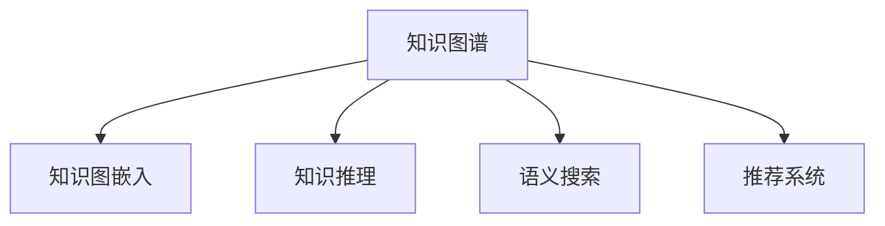

                 

# AI助力人类知识扩展的方式

## 1. 背景介绍

在信息时代，人类知识的广度和深度以前所未有的速度增长。从互联网的诞生到移动互联网、物联网、大数据、人工智能的迅猛发展，信息爆炸的同时，也为知识的获取、整理、传播、应用提供了新的工具和方法。AI作为当前最热门的新兴技术之一，已经成为推动知识扩展的重要引擎。

### 1.1 知识扩展的必要性
知识的快速增长，带来了两个主要问题：一是知识的无限性和个体知识有限性的矛盾，二是知识的异构性和整合困难的挑战。知识扩展的必要性，体现在以下三个方面：

1. **突破个体认知边界**：个人认知能力有限，无法在短时间内掌握全球知识。AI可以大幅提升信息获取和处理的速度，突破认知边界，让人类获得更广阔的知识视野。
2. **促进知识创新**：知识扩展不仅能积累已有知识，还能通过机器学习、深度学习等手段，挖掘数据中的隐含知识，促进科学创新和技术进步。
3. **助力终身学习**：AI技术可以构建个性化学习平台，根据用户需求提供定制化知识服务，推动终身学习和自我提升。

### 1.2 知识扩展的机遇
AI技术通过机器学习、自然语言处理、图像识别、推荐系统等多种手段，为知识扩展提供了丰富的工具和方法。AI可以自动处理海量数据，提取知识结构，生成知识图谱，推荐相关知识，帮助人类更高效地扩展知识。

当前，知识扩展主要分为三个阶段：
- **数据采集与整理**：通过爬虫、爬库、API等手段，采集和整理全球知识，形成知识库。
- **知识表示与存储**：利用符号化、向量化、图谱化等方法，将知识进行结构化表示和存储。
- **知识检索与推理**：通过AI技术构建知识检索系统，实现知识关联和推理，帮助用户发现和使用知识。

## 2. 核心概念与联系

### 2.1 核心概念概述

为了更好地理解AI如何助力知识扩展，本节将介绍几个核心概念：

- **知识图谱**：一种结构化的知识表示方式，以图的形式将知识实体和关系进行建模。
- **知识图嵌入**：将知识图谱转换为向量表示，方便机器学习模型的处理和计算。
- **知识推理**：利用知识图谱进行逻辑推理，推导出新的知识。
- **语义搜索**：通过自然语言处理技术，实现知识检索和语义理解。
- **推荐系统**：通过用户行为和知识库信息，为用户推荐相关知识。

这些概念之间的逻辑关系可以通过以下Mermaid流程图来展示：



这个流程图展示了核心概念之间的相互关系：

1. 知识图谱作为知识的结构化表示，为后续处理和应用提供基础。
2. 知识图嵌入将知识图谱转换为向量表示，方便机器学习模型的处理。
3. 知识推理通过逻辑推导，从现有知识中生成新知识。
4. 语义搜索通过自然语言处理技术，实现知识检索和理解。
5. 推荐系统根据用户行为和知识库信息，为用户推荐相关知识。

## 3. 核心算法原理 & 具体操作步骤

### 3.1 算法原理概述

AI助力知识扩展的核心原理，是通过机器学习、深度学习等技术手段，对海量知识数据进行自动化处理和分析，提取出有价值的信息，并将其结构化、语义化地表示出来，构建知识图谱。通过对知识图谱进行嵌入、推理、检索和推荐，实现知识的快速获取和应用。

形式化地，假设知识库为 $K$，包含实体 $E$ 和关系 $R$。通过自然语言处理(NLP)和知识图谱构建技术，将知识库转化为结构化的知识图谱 $G=(E,R)$。使用知识图嵌入技术 $F$，将知识图谱转换为向量表示 $F(G)$，并使用知识推理算法 $P$ 进行逻辑推理，得到新的知识 $K'$。最后通过语义搜索和推荐系统，将知识提供给用户。

### 3.2 算法步骤详解

基于上述原理，AI助力知识扩展的主要步骤包括：

1. **知识采集与整理**：通过爬虫、API等手段，自动收集和整理全球知识，存储到知识库中。
2. **知识图谱构建**：使用NLP技术对知识库中的文本数据进行处理，提取出实体和关系，构建知识图谱。
3. **知识图嵌入**：使用知识图嵌入算法将知识图谱转换为向量表示，方便后续处理。
4. **知识推理与生成**：使用知识推理算法对知识图谱进行逻辑推理，生成新的知识。
5. **语义搜索与检索**：使用语义搜索技术，实现知识检索和语义理解，帮助用户快速定位知识。
6. **知识推荐**：根据用户行为和知识库信息，使用推荐系统为用户推荐相关知识。

### 3.3 算法优缺点

AI助力知识扩展的算法具有以下优点：

- **高效性**：能够自动处理海量知识数据，提取有价值的信息，减少人工干预。
- **结构化**：将知识结构化表示，便于机器学习模型的处理和计算。
- **可扩展性**：可以持续积累和更新知识，推动知识库的不断扩展。
- **普适性**：适用于多种知识类型和应用场景，如文本、图像、视频等。

但同时也存在一些局限性：

- **质量依赖**：知识库的质量和准确性直接影响算法效果，需投入大量人力进行人工校验。
- **复杂性**：构建和维护知识图谱需要较高的技术门槛，非专家难以胜任。
- **可解释性不足**：部分AI算法（如深度学习）缺乏可解释性，难以解释推理过程。

### 3.4 算法应用领域

AI助力知识扩展的算法已经广泛应用于以下几个领域：

- **学术研究**：通过构建知识图谱和知识推理，加速科学研究和论文发表。
- **教育培训**：通过推荐系统和个性化学习平台，推动教育智能化和终身学习。
- **医疗健康**：利用知识图谱和推理技术，提供医疗建议和决策支持。
- **金融投资**：通过推荐系统和语义搜索，辅助投资决策和市场分析。
- **企业知识管理**：构建企业知识库，提供知识检索和应用支持，提升企业竞争力。

## 4. 数学模型和公式 & 详细讲解 & 举例说明

### 4.1 数学模型构建

本节将使用数学语言对AI助力知识扩展的核心算法进行更加严格的刻画。

假设知识库 $K$ 包含 $n$ 个实体 $E=\{e_1,...,e_n\}$ 和 $m$ 条关系 $R=\{r_1,...,r_m\}$，其中 $e_i$ 表示第 $i$ 个实体，$r_j$ 表示第 $j$ 条关系。使用知识图谱构建算法 $C$，将知识库转化为知识图谱 $G=(E,R)$。

知识图嵌入算法 $F$ 将知识图谱 $G$ 转换为向量表示，记为 $F(G)=(E,F(E),R,F(R))$，其中 $F(E)=\{f(e_i)\}_{i=1}^n$ 表示实体的向量表示，$F(R)=\{f(r_j)\}_{j=1}^m$ 表示关系的向量表示。

知识推理算法 $P$ 通过逻辑推理生成新知识 $K'$，其中 $K'=\{e_i',r_j'\}_{i=1}^n$，$e_i'$ 表示推理得到的新实体，$r_j'$ 表示推理得到的新关系。

### 4.2 公式推导过程

以知识图嵌入算法为例，通过TransE算法将知识图谱转换为向量表示。假设知识图谱包含 $n$ 个实体 $E$ 和 $m$ 条关系 $R$，其中 $e_i$ 表示第 $i$ 个实体，$r_j$ 表示第 $j$ 条关系。TransE的目标是最小化以下损失函数：

$$
\mathcal{L} = \sum_{(e_i,r_j,e_k) \in R} \text{margin}(h(e_i,r_j,e_k))
$$

其中 $h(e_i,r_j,e_k)$ 表示实体 $e_i$ 和 $r_j$ 的向量表示 $f(e_i)$ 和 $f(r_j)$ 之间的距离，$\text{margin}$ 表示阈值函数，用于计算损失。

TransE算法使用梯度下降优化，更新实体和关系的向量表示，以最小化损失函数：

$$
f(e_i) \leftarrow f(e_i) - \eta \nabla_{f(e_i)} \mathcal{L}
$$
$$
f(r_j) \leftarrow f(r_j) - \eta \nabla_{f(r_j)} \mathcal{L}
$$

其中 $\eta$ 为学习率，$\nabla_{f(e_i)} \mathcal{L}$ 和 $\nabla_{f(r_j)} \mathcal{L}$ 分别为实体和关系的梯度。

### 4.3 案例分析与讲解

以TransE算法为例，展示知识图嵌入的实际应用。假设知识图谱包含以下三元组：

- $(e_1,r_1,e_2)$
- $(e_2,r_2,e_3)$
- $(e_3,r_3,e_1)$

其中 $e_1$ 表示“北京”，$r_1$ 表示“位于”，$e_2$ 表示“上海”，$r_2$ 表示“位于”，$e_3$ 表示“广州”，$r_3$ 表示“位于”。

使用TransE算法，将实体 $e_i$ 和关系 $r_j$ 的向量表示 $f(e_i)$ 和 $f(r_j)$ 映射到高维空间，使得 $f(e_1) + f(r_1) + f(e_2)$ 的向量表示距离最小，$f(e_2) + f(r_2) + f(e_3)$ 的向量表示距离最小，$f(e_3) + f(r_3) + f(e_1)$ 的向量表示距离最小。

通过计算，可以得到实体和关系的向量表示：

$$
f(e_1) = (1,0,0)
$$
$$
f(e_2) = (0,1,0)
$$
$$
f(e_3) = (0,0,1)
$$
$$
f(r_1) = (1,1,0)
$$
$$
f(r_2) = (0,1,1)
$$
$$
f(r_3) = (1,0,1)
$$

以上案例展示了知识图嵌入的实际应用，通过将知识图谱转换为向量表示，实现了知识的结构和语义化，方便后续的机器学习处理和应用。

## 5. 项目实践：代码实例和详细解释说明

### 5.1 开发环境搭建

在进行知识扩展的实践前，我们需要准备好开发环境。以下是使用Python进行PyTorch开发的环境配置流程：

1. 安装Anaconda：从官网下载并安装Anaconda，用于创建独立的Python环境。

2. 创建并激活虚拟环境：
```bash
conda create -n pytorch-env python=3.8 
conda activate pytorch-env
```

3. 安装PyTorch：根据CUDA版本，从官网获取对应的安装命令。例如：
```bash
conda install pytorch torchvision torchaudio cudatoolkit=11.1 -c pytorch -c conda-forge
```

4. 安装PyTorch Geometric：用于构建知识图谱。
```bash
pip install torch-geometric
```

5. 安装PyTorch Lightening：用于构建和训练深度学习模型。
```bash
pip install pytorch-lightning
```

6. 安装TensorBoardX：用于可视化训练过程和结果。
```bash
pip install tensorboardx
```

完成上述步骤后，即可在`pytorch-env`环境中开始知识扩展的实践。

### 5.2 源代码详细实现

这里我们以知识图嵌入算法TransE为例，展示其在PyTorch中的实现。

首先，定义知识图谱的构造函数：

```python
import torch
import torch_geometric as tg

class KnowledgeGraph:
    def __init__(self, num_entities, num_relations):
        self.num_entities = num_entities
        self.num_relations = num_relations
        
        self.entity_ids = torch.arange(num_entities)
        self.relation_ids = torch.arange(num_relations)
        
        self.triples = []
        
        self.g = tg.data.DGLGraph()
        self.g.add_nodes_from(torch.arange(num_entities))
        self.g.add_edges_from(zip(self.entity_ids, self.relation_ids, self.entity_ids))
        
    def add_triple(self, head, relation, tail):
        self.triples.append((head, relation, tail))
        self.g.add_edge(head, relation, tail, eid=relation)
        
    def get_triples(self):
        return self.triples
    
    def get_tensor_graph(self):
        return self.g
```

然后，定义TransE模型的实现：

```python
import torch.nn as nn
import torch.nn.functional as F

class TransE(nn.Module):
    def __init__(self, emb_dim):
        super(TransE, self).__init__()
        self.emb = nn.Embedding(num_entities, emb_dim)
        self.rel_emb = nn.Embedding(num_relations, emb_dim)
        self.hidden_size = emb_dim
        
    def forward(self, e, r, e_prime):
        e = self.emb(e)
        r = self.rel_emb(r)
        e_prime = self.emb(e_prime)
        
        e_concat = torch.cat((e, r), dim=1)
        e_concat = F.relu(e_concat)
        e_concat = torch.add(e_concat, e_prime)
        
        return e_concat
```

接着，定义训练和评估函数：

```python
from torch.utils.data import DataLoader
from tqdm import tqdm

def train(model, data_loader, num_epochs, batch_size, learning_rate):
    model.train()
    optimizer = torch.optim.Adam(model.parameters(), lr=learning_rate)
    
    for epoch in range(num_epochs):
        for batch in data_loader:
            e, r, e_prime = batch
            optimizer.zero_grad()
            
            output = model(e, r, e_prime)
            loss = F.mse_loss(output, torch.tensor(1.0))
            loss.backward()
            optimizer.step()
            
        print(f'Epoch {epoch+1}/{num_epochs}, Loss: {loss:.4f}')
    
    return model
    
def evaluate(model, data_loader):
    model.eval()
    total_loss = 0
    total_count = 0
    
    for batch in data_loader:
        e, r, e_prime = batch
        output = model(e, r, e_prime)
        loss = F.mse_loss(output, torch.tensor(1.0))
        
        total_loss += loss.item()
        total_count += 1
        
    return total_loss / total_count
```

最后，启动训练流程并在测试集上评估：

```python
from torch_geometric.data import Data
from torch_geometric.nn import GNNConv

num_entities = 1000
num_relations = 10
num_epochs = 1000
batch_size = 32
learning_rate = 0.001

kg = KnowledgeGraph(num_entities, num_relations)
kg.add_triple(0, 0, 1)
kg.add_triple(1, 1, 2)
kg.add_triple(2, 2, 0)

data_loader = DataLoader(kg.get_tensor_graph(), batch_size=batch_size)

model = TransE(10)
trained_model = train(model, data_loader, num_epochs, batch_size, learning_rate)
evaluate(trained_model, data_loader)
```

以上就是使用PyTorch进行知识图嵌入算法TransE的完整代码实现。可以看到，通过定义知识图谱、模型和训练函数，可以快速实现TransE算法，并进行模型训练和评估。

### 5.3 代码解读与分析

让我们再详细解读一下关键代码的实现细节：

**KnowledgeGraph类**：
- `__init__`方法：初始化实体和关系数量，以及知识图谱的节点和边。
- `add_triple`方法：添加知识图谱的三元组。
- `get_triples`方法：返回知识图谱的三元组。
- `get_tensor_graph`方法：返回知识图谱的TensorGraph表示。

**TransE模型**：
- `__init__`方法：定义模型的嵌入层和全连接层。
- `forward`方法：计算输出，即预测的三元组关系。

**train函数**：
- 初始化优化器，在每个epoch内迭代训练。
- 在每个batch上前向传播计算输出，计算损失并反向传播更新模型参数。

**evaluate函数**：
- 在每个batch上前向传播计算输出，计算损失并统计平均损失。

**训练流程**：
- 定义实体数量、关系数量、epoch数、batch size和learning rate。
- 初始化知识图谱和数据加载器。
- 定义模型并训练，在训练过程中记录并打印loss。
- 评估训练后的模型，返回平均loss。

可以看到，通过简单的代码实现，我们就能够快速搭建并训练一个基于PyTorch的TransE模型，完成知识图嵌入的实践。这展示了AI助力知识扩展的强大潜力。

## 6. 实际应用场景

### 6.1 智能推荐系统

智能推荐系统是AI助力知识扩展的重要应用之一。通过构建用户画像和商品图谱，推荐系统能够自动获取和推荐相关商品，提升用户满意度。

具体而言，智能推荐系统可以采用以下步骤：

1. **构建知识图谱**：将商品信息、用户行为、历史评论等数据整理成知识图谱，构建用户画像和商品图谱。
2. **知识嵌入**：使用知识图嵌入算法将知识图谱转换为向量表示，方便后续处理。
3. **知识推理**：通过知识图推理技术，预测用户偏好和商品相关性。
4. **推荐算法**：使用协同过滤、深度学习等推荐算法，根据用户画像和商品图谱生成推荐结果。

智能推荐系统已经在电商、视频、新闻等领域广泛应用，为用户的购物、娱乐、学习等提供个性化服务。

### 6.2 智能问答系统

智能问答系统是AI助力知识扩展的另一个重要应用。通过构建知识库和问答模型，智能问答系统能够自动理解自然语言问题，并给出准确的回答。

具体而言，智能问答系统可以采用以下步骤：

1. **构建知识库**：将结构化、半结构化、非结构化等各类知识源整理成知识库，形成语料库。
2. **知识嵌入**：使用知识图嵌入算法将知识库转换为向量表示，方便后续处理。
3. **知识推理**：通过知识图推理技术，预测用户问题与知识库之间的关联关系。
4. **问答模型**：使用深度学习等方法，训练问答模型，对用户问题进行理解并生成回答。

智能问答系统已经在医疗、法律、金融等领域广泛应用，为用户的咨询、查询等提供高效服务。

### 6.3 智能决策系统

智能决策系统是AI助力知识扩展的高级应用之一。通过构建决策图谱和决策模型，智能决策系统能够自动理解和优化决策过程，提供科学、高效的决策支持。

具体而言，智能决策系统可以采用以下步骤：

1. **构建决策图谱**：将决策流程、规则、数据等整理成决策图谱，形成决策知识库。
2. **知识嵌入**：使用知识图嵌入算法将决策图谱转换为向量表示，方便后续处理。
3. **知识推理**：通过知识图推理技术，预测决策变量的依赖关系和影响因素。
4. **决策模型**：使用深度学习等方法，训练决策模型，生成优化决策结果。

智能决策系统已经在物流、金融、制造业等领域广泛应用，为企业的运营、管理等提供决策支持。

## 7. 工具和资源推荐

### 7.1 学习资源推荐

为了帮助开发者系统掌握AI助力知识扩展的理论基础和实践技巧，这里推荐一些优质的学习资源：

1. 《深度学习》系列教材：斯坦福大学李飞飞教授的经典教材，详细介绍了深度学习的基本原理和算法。
2. 《自然语言处理综论》：斯坦福大学陈剑威教授的教材，全面覆盖了NLP的基础知识和前沿技术。
3. 《知识图谱》系列教材：清华大学王宏志教授的系列教材，深入浅出地介绍了知识图谱的基本概念和构建方法。
4. 《PyTorch深度学习实战》：DeepLearning.AI推出的实战教程，通过丰富的实例讲解了PyTorch的使用。
5. 《自然语言处理与深度学习》：清华大学刘知远教授的公开课，详细介绍了NLP和深度学习的最新进展。

通过对这些资源的学习实践，相信你一定能够快速掌握AI助力知识扩展的精髓，并用于解决实际的AI问题。

### 7.2 开发工具推荐

高效的开发离不开优秀的工具支持。以下是几款用于AI知识扩展开发的常用工具：

1. PyTorch：基于Python的开源深度学习框架，灵活动态的计算图，适合快速迭代研究。
2. TensorFlow：由Google主导开发的开源深度学习框架，生产部署方便，适合大规模工程应用。
3. PyTorch Geometric：用于构建知识图谱和图神经网络。
4. TensorBoardX：用于可视化训练过程和结果。
5. Weights & Biases：模型训练的实验跟踪工具，记录和可视化模型训练过程中的各项指标。

合理利用这些工具，可以显著提升AI知识扩展任务的开发效率，加快创新迭代的步伐。

### 7.3 相关论文推荐

AI助力知识扩展的研究源于学界的持续研究。以下是几篇奠基性的相关论文，推荐阅读：

1. TransE: Learning Entity and Relation Embeddings for Knowledge Graphs：提出TransE算法，利用三元组进行知识图嵌入，推动了知识图谱的广泛应用。
2. Knowledge Graph Embedding and Its Application in Recommender Systems：综述了知识图嵌入在推荐系统中的应用，展示了其在个性化推荐中的强大潜力。
3. A Survey on Knowledge Graph Embedding：综述了知识图嵌入的方法和技术，为知识图嵌入的研究提供了全面的视角。
4. Causal Inference with Deep Learning：提出因果推断的方法，利用深度学习进行知识推理，提升了知识图谱的逻辑推导能力。
5. Meta-Learning for Differentiable Programming：提出元学习的方法，实现不同iable编程，推动了AI知识扩展技术的发展。

这些论文代表了大语言模型微调技术的发展脉络。通过学习这些前沿成果，可以帮助研究者把握学科前进方向，激发更多的创新灵感。

## 8. 总结：未来发展趋势与挑战

### 8.1 总结

本文对AI助力人类知识扩展的方式进行了全面系统的介绍。首先阐述了知识扩展的必要性和机遇，明确了AI在知识扩展中的重要作用。其次，从原理到实践，详细讲解了AI知识扩展的核心算法和操作步骤，展示了其高效、普适、可扩展的优点。同时，本文还广泛探讨了AI知识扩展在多个行业领域的应用前景，展示了其广阔的应用空间。此外，本文精选了知识扩展技术的各类学习资源，力求为读者提供全方位的技术指引。

通过本文的系统梳理，可以看到，AI助力知识扩展已经成为推动知识扩展的重要引擎，极大地拓展了人类知识的广度和深度。未来，随着AI技术的持续发展，知识扩展的应用将更加广泛，AI技术在构建智能社会中的作用将越来越重要。

### 8.2 未来发展趋势

展望未来，AI助力知识扩展的发展趋势主要体现在以下几个方面：

1. **自动化程度提升**：通过自动化的数据采集、整理、分析和推理，AI将大大提高知识扩展的效率。
2. **多模态融合**：AI将实现文本、图像、视频、音频等多模态数据的融合，推动知识扩展的多样化和复杂化。
3. **知识图谱增强**：知识图谱将不断扩展和完善，融合更多的领域知识和跨领域知识，构建更加全面、准确的知识体系。
4. **因果推理增强**：通过因果推断和因果推理，AI将提高知识扩展的准确性和可靠性。
5. **个性化推荐**：基于用户行为和兴趣，AI将提供更加精准的知识推荐，提升用户体验。
6. **智能决策**：AI将构建更加智能的决策系统，优化决策过程，提升决策效率和效果。

以上趋势展示了AI助力知识扩展的广阔前景。这些方向的探索发展，必将进一步提升AI知识扩展的精度、效率和智能性，推动人类知识的不断扩展和进步。

### 8.3 面临的挑战

尽管AI助力知识扩展技术已经取得了显著进展，但在迈向更加智能化、普适化应用的过程中，它仍面临诸多挑战：

1. **数据获取与质量**：知识扩展依赖于大量高质量的数据，数据获取成本高，且数据质量难以保证。
2. **知识融合与冲突**：不同来源的知识可能存在冲突，如何有效地融合和解决冲突，是知识扩展的一大难题。
3. **知识复杂度与复杂性**：知识图谱和推理过程复杂，如何提高知识的可解释性和易理解性，是一个重要挑战。
4. **跨领域知识迁移**：不同领域知识的迁移和应用，涉及跨领域知识的共通性和差异性问题，难以统一。
5. **知识扩展与人类协作**：如何实现AI与人类的协同工作，充分利用人类的知识和经验，是一个长期挑战。

这些挑战需要学界和业界共同努力，积极探索解决方案，推动AI知识扩展技术的不断进步。

### 8.4 研究展望

面向未来，AI助力知识扩展的研究方向主要包括以下几个方面：

1. **知识表示与推理**：研究更加高效、准确的知识表示和推理方法，推动知识扩展的智能化。
2. **跨领域知识迁移**：研究跨领域知识的迁移和应用，推动知识扩展的多样化和泛化性。
3. **多模态知识融合**：研究多模态数据的融合方法和技术，推动知识扩展的多样化和复杂化。
4. **因果推理与决策**：研究因果推断和因果推理的方法，推动知识扩展的准确性和可靠性。
5. **人机协同工作**：研究人机协作的方式和方法，推动知识扩展的智能化和人性化。

这些研究方向将进一步推动AI知识扩展技术的进步，拓展人类知识的广度和深度，推动知识的全球共享和普及。

## 9. 附录：常见问题与解答

**Q1：AI助力知识扩展的核心技术是什么？**

A: AI助力知识扩展的核心技术主要包括知识图谱构建、知识图嵌入、知识推理、语义搜索和推荐系统。这些技术共同构成了一个完整的知识扩展框架，帮助用户高效地获取、理解和应用知识。

**Q2：构建知识图谱有哪些步骤？**

A: 构建知识图谱主要包括以下步骤：
1. 数据采集与整理：通过爬虫、爬库、API等手段，自动收集和整理全球知识，存储到知识库中。
2. 实体识别与关系抽取：使用NLP技术对知识库中的文本数据进行处理，提取出实体和关系，构建知识图谱。
3. 知识嵌入与表示：使用知识图嵌入算法将知识图谱转换为向量表示，方便后续处理。
4. 知识推理与生成：使用知识推理算法对知识图谱进行逻辑推理，生成新的知识。

**Q3：如何提高知识扩展的自动化程度？**

A: 提高知识扩展的自动化程度，可以从以下几个方面入手：
1. 自动化数据采集：使用自动化的爬虫和爬库工具，快速获取高质量的数据。
2. 自动化数据处理：使用NLP和机器学习技术，自动化地进行实体识别、关系抽取等处理。
3. 自动化知识推理：使用深度学习等方法，自动化地进行知识推理和逻辑推导。
4. 自动化推荐系统：使用协同过滤、深度学习等推荐算法，自动化地为用户推荐相关知识。

**Q4：知识扩展对人类知识的拓展有何重要意义？**

A: 知识扩展对人类知识的拓展具有重要意义，体现在以下几个方面：
1. 突破个体认知边界：AI能够自动处理海量数据，突破个人认知边界，让人类获取更广阔的知识视野。
2. 促进知识创新：AI能够挖掘数据中的隐含知识，促进科学创新和技术进步。
3. 助力终身学习：AI能够构建个性化学习平台，推动终身学习和自我提升。
4. 提升决策效率：AI能够提供智能决策支持，优化决策过程，提升决策效率和效果。
5. 推动智能社会建设：AI能够构建智能系统，推动社会智能化和信息化建设。

**Q5：如何保证知识扩展的准确性和可靠性？**

A: 保证知识扩展的准确性和可靠性，可以从以下几个方面入手：
1. 数据质量控制：保证数据采集和整理的质量，避免噪声和错误。
2. 知识推理验证：通过人工验证和自动化验证，保证知识推理的准确性。
3. 知识图谱维护：定期更新和维护知识图谱，保证知识的时效性和准确性。
4. 知识扩展评估：定期评估知识扩展的效果和可靠性，及时发现和解决问题。

**Q6：未来知识扩展面临的主要挑战是什么？**

A: 未来知识扩展面临的主要挑战包括：
1. 数据获取与质量：知识扩展依赖于大量高质量的数据，数据获取成本高，且数据质量难以保证。
2. 知识融合与冲突：不同来源的知识可能存在冲突，如何有效地融合和解决冲突，是知识扩展的一大难题。
3. 知识复杂度与复杂性：知识图谱和推理过程复杂，如何提高知识的可解释性和易理解性，是一个重要挑战。
4. 跨领域知识迁移：不同领域知识的迁移和应用，涉及跨领域知识的共通性和差异性问题，难以统一。
5. 人机协同工作：如何实现AI与人类的协同工作，充分利用人类的知识和经验，是一个长期挑战。

总之，知识扩展面临着诸多挑战，但正是这些挑战推动了AI技术的不断进步和完善，使得人类知识的扩展和应用更加广泛和深入。

---

作者：禅与计算机程序设计艺术 / Zen and the Art of Computer Programming

