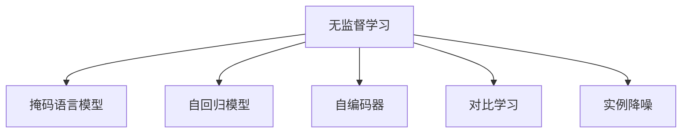

                 

# AI发展趋势：自我监督学习和无监督学习

> 关键词：自我监督学习(Self-supervised Learning), 无监督学习(Unsupervised Learning), 自回归模型(Autoregressive Models), 掩码语言模型(Masked Language Model), 自编码器(Autocoder), 对比学习(Contrastive Learning)

## 1. 背景介绍

### 1.1 问题由来
随着深度学习技术的迅猛发展，AI领域的研究范式正在从监督学习(Supervised Learning)逐步向无监督学习(Unsupervised Learning)和自我监督学习(Self-supervised Learning)转变。特别是在自然语言处理(NLP)、计算机视觉(CV)等领域，无监督和自我监督学习方法因其高效、灵活和泛化性强等优势，成为当前研究的热点。

无监督和自我监督学习方法的主要优势在于：
1. **数据需求低**：相较于传统的监督学习，无监督学习只需要原始数据，无需标注数据，大幅降低了数据获取和处理的成本。
2. **泛化能力强**：无监督和自我监督学习能够从大量无标注数据中学习到数据的分布特性，避免过拟合，提升模型在未见过的数据上的泛化能力。
3. **特征学习**：这类方法通过数据自组织的方式学习到更加抽象、鲁棒的特征表示，为后续的监督学习任务奠定基础。

### 1.2 问题核心关键点
自我监督学习和无监督学习的核心在于如何从无标注数据中学习到有用的特征表示。常见的方法包括：
1. 掩码语言模型(Masked Language Model, MLM)：通过预测被掩码的单词来训练模型，学习单词之间的分布特性。
2. 自编码器(Autocoder)：通过重构输入数据来学习数据的压缩表示。
3. 对比学习(Contrastive Learning)：通过最大化相似样本之间的相似度，最小化不同样本之间的相似度，学习样本的相对位置关系。
4. 实例降噪(Autoaugment)：通过引入数据增强技术，提高模型对数据噪声的鲁棒性。

这些方法通过巧妙设计的任务，利用数据中的内在规律，无需标注信息即可完成模型训练，提升了模型的适应性和泛化能力。

## 2. 核心概念与联系

### 2.1 核心概念概述

为更好地理解无监督和自我监督学习，本节将介绍几个关键概念：

- 自我监督学习(Self-supervised Learning, SSL)：利用数据中的内在关系，通过自动设计任务来训练模型，无需标注信息即可完成学习。
- 无监督学习(Unsupervised Learning, UL)：从无标注数据中学习模型，目标是发现数据的内在结构，提升模型泛化能力。
- 自回归模型(Autoregressive Model)：按照时间或空间顺序生成数据的模型，可以用于序列数据预测。
- 掩码语言模型(Masked Language Model)：通过掩码部分输入序列来训练模型，学习单词之间的分布特性。
- 自编码器(Autocoder)：通过重构输入数据来学习数据的压缩表示。
- 对比学习(Contrastive Learning)：通过最大化相似样本之间的相似度，最小化不同样本之间的相似度，学习样本的相对位置关系。
- 实例降噪(Autoaugment)：通过引入数据增强技术，提高模型对数据噪声的鲁棒性。

这些概念之间的逻辑关系可以通过以下Mermaid流程图来展示：



这个流程图展示了无监督学习的核心概念及其之间的关系：

1. 无监督学习是从原始数据中学习数据的分布特性。
2. 掩码语言模型通过预测被掩码的单词来训练模型。
3. 自回归模型按照时间或空间顺序生成数据。
4. 自编码器通过重构输入数据来学习数据的压缩表示。
5. 对比学习通过最大化相似样本之间的相似度，学习样本的相对位置关系。
6. 实例降噪通过引入数据增强技术，提高模型对数据噪声的鲁棒性。

这些概念共同构成了无监督和自我监督学习的方法框架，使其能够在各种场景下发挥强大的数据表示和学习能力。通过理解这些核心概念，我们可以更好地把握无监督和自我监督学习的工作原理和优化方向。

## 3. 核心算法原理 & 具体操作步骤
### 3.1 算法原理概述

自我监督和无监督学习的核心思想是：利用数据中的内在关系，通过自动设计任务来训练模型，无需标注信息即可完成学习。这种方法主要包括以下几个步骤：

1. **数据准备**：收集大规模的原始数据，数据可以是文本、图像、视频等。
2. **任务设计**：根据数据特点，设计一些无标注的生成式或判别式任务，如掩码语言模型、自编码器等。
3. **模型训练**：使用设计好的任务对模型进行训练，通过反向传播算法更新模型参数。
4. **特征学习**：通过训练过程学习到数据的特征表示，为后续的监督学习任务奠定基础。
5. **模型评估**：在测试集上评估模型性能，确保学习到的特征表示具有泛化能力。

### 3.2 算法步骤详解

以下以掩码语言模型为例，详细讲解自监督学习的具体步骤：

1. **数据准备**：收集大规模的文本数据集，如维基百科、新闻文章、书籍等。
2. **任务设计**：掩码语言模型任务是通过预测被掩码的单词来训练模型，具体步骤为：
   - 随机掩码输入序列中的一部分单词，保留其他部分作为预测任务。
   - 将掩码后的序列输入模型，预测被掩码的单词。
   - 计算预测结果与真实标签之间的交叉熵损失，作为训练模型的目标函数。
3. **模型训练**：使用大规模的掩码数据对模型进行训练，通过反向传播算法更新模型参数。
4. **特征学习**：学习到的特征表示可以用于下游的监督学习任务，如文本分类、命名实体识别等。
5. **模型评估**：在测试集上评估模型性能，如准确率、F1-score等指标，确保模型具有良好的泛化能力。

### 3.3 算法优缺点

自我监督和无监督学习具有以下优点：
1. **数据需求低**：无需标注数据，大幅降低了数据获取和处理的成本。
2. **泛化能力强**：通过学习数据的内在结构，模型对未见过的数据具有良好的泛化能力。
3. **特征学习**：学习到的特征表示可以用于下游的监督学习任务，提升模型性能。

但同时，该方法也存在以下局限性：
1. **任务设计复杂**：需要精心设计自动生成任务，才能有效训练模型。
2. **模型复杂度高**：为了学习到复杂的特征表示，需要设计复杂的模型架构。
3. **无法学习任务相关的知识**：缺少标注信息，无法直接学习任务相关的知识。

尽管存在这些局限性，但自我监督和无监督学习在实际应用中已经取得了显著效果，尤其在NLP、CV等领域得到广泛应用。

### 3.4 算法应用领域

自我监督和无监督学习在各个领域都得到了广泛的应用，以下是几个典型案例：

1. **自然语言处理(NLP)**：
   - **掩码语言模型(Masked Language Model, MLM)**：如BERT、GPT-3等大模型，通过预测被掩码的单词来学习语言的分布特性，广泛应用于文本分类、命名实体识别、问答系统等任务。
   - **自编码器(Autocoder)**：如XLM、XLNet等模型，通过重构输入数据来学习文本的压缩表示，提升模型的泛化能力。

2. **计算机视觉(CV)**：
   - **自回归模型(Autoregressive Model)**：如PixelRNN、PixelCNN等模型，通过逐像素生成图像来学习图像的分布特性，广泛应用于图像生成、图像分类等任务。
   - **对比学习(Contrastive Learning)**：如SimCLR、BYOL等模型，通过最大化相似样本之间的相似度，学习图像的相对位置关系，提升模型的泛化能力。

3. **语音处理(Speech Processing)**：
   - **自回归模型(Autoregressive Model)**：如Tacotron2、WaveNet等模型，通过逐帧生成语音来学习语音的分布特性，广泛应用于语音合成、语音识别等任务。
   - **自编码器(Autocoder)**：如SAM、WaveGlow等模型，通过重构输入音频来学习语音的压缩表示，提升模型的泛化能力。

4. **推荐系统(Recommendation System)**：
   - **实例降噪(Autoaugment)**：通过引入数据增强技术，提高模型对用户行为数据噪声的鲁棒性，提升推荐系统的性能。

以上应用展示了自我监督和无监督学习在实际场景中的巨大潜力，未来随着模型和算法的不断进步，相信这类学习方法将得到更广泛的应用。

## 4. 数学模型和公式 & 详细讲解 & 举例说明

### 4.1 数学模型构建

以掩码语言模型为例，我们将使用数学语言对自监督学习的训练过程进行严格刻画。

记输入序列为 $x_1, x_2, ..., x_n$，其中 $x_i$ 表示第 $i$ 个单词。掩码语言模型的训练目标是通过预测被掩码的单词来训练模型。假设模型输出为 $y_1, y_2, ..., y_n$，其中 $y_i$ 表示模型预测的单词概率分布。

定义掩码函数 $M(x)$，随机掩码输入序列中的一部分单词，保留其他部分作为预测任务。掩码后的序列记为 $\tilde{x}$。定义模型在掩码后的序列上的损失函数为 $\ell(\theta, \tilde{x}, y)$，其中 $\theta$ 为模型参数。

掩码语言模型的训练过程可以通过最大似然估计来实现，目标是最小化以下似然函数：

$$
\mathcal{L}(\theta) = -\frac{1}{N}\sum_{i=1}^N \log p(y_i|x_i)
$$

其中 $N$ 为序列长度，$p(y_i|x_i)$ 为模型在输入 $x_i$ 下预测单词 $y_i$ 的概率。

### 4.2 公式推导过程

掩码语言模型的预测过程可以表示为：

$$
y_i = M(x_i) * p(y_i|x_i)
$$

其中 $M(x_i)$ 为掩码函数，$p(y_i|x_i)$ 为模型在输入 $x_i$ 下预测单词 $y_i$ 的概率。

掩码语言模型的训练过程可以表示为：

$$
\mathcal{L}(\theta) = -\frac{1}{N}\sum_{i=1}^N \log p(y_i|x_i) = -\frac{1}{N}\sum_{i=1}^N \log \frac{e^{y_i \log p(y_i|x_i)}}{\sum_{k=1}^K e^{y_k \log p(y_k|x_i)}}
$$

其中 $K$ 为词汇表大小，$\log$ 为对数函数。

掩码语言模型的目标函数可以表示为：

$$
\min_{\theta} \mathcal{L}(\theta) = -\frac{1}{N}\sum_{i=1}^N \log \frac{e^{y_i \log p(y_i|x_i)}}{\sum_{k=1}^K e^{y_k \log p(y_k|x_i)}}
$$

通过反向传播算法，可以计算模型的梯度，更新模型参数，完成掩码语言模型的训练。

### 4.3 案例分析与讲解

以BERT模型为例，其训练过程主要包括两个步骤：掩码语言模型预训练和下游任务微调。

1. **掩码语言模型预训练**：
   - **任务设计**：随机掩码输入序列中的一部分单词，保留其他部分作为预测任务。
   - **模型训练**：使用大规模的掩码数据对模型进行训练，通过反向传播算法更新模型参数。
   - **特征学习**：学习到的特征表示可以用于下游的监督学习任务，如文本分类、命名实体识别等。

2. **下游任务微调**：
   - **任务适配层**：根据下游任务类型，设计合适的输出层和损失函数。
   - **模型微调**：使用下游任务的标注数据对模型进行微调，通过梯度下降算法更新模型参数。
   - **模型评估**：在测试集上评估模型性能，确保模型具有良好的泛化能力。

通过上述分析，我们可以看到，掩码语言模型是一种简单有效的自我监督学习方法，已经在自然语言处理领域得到了广泛应用。

## 5. 项目实践：代码实例和详细解释说明

### 5.1 开发环境搭建

在进行自我监督学习实践前，我们需要准备好开发环境。以下是使用Python进行TensorFlow开发的环境配置流程：

1. 安装Anaconda：从官网下载并安装Anaconda，用于创建独立的Python环境。

2. 创建并激活虚拟环境：
```bash
conda create -n tensorflow-env python=3.8 
conda activate tensorflow-env
```

3. 安装TensorFlow：根据CUDA版本，从官网获取对应的安装命令。例如：
```bash
conda install tensorflow -c pytorch -c conda-forge
```

4. 安装相关工具包：
```bash
pip install numpy pandas scikit-learn matplotlib tqdm jupyter notebook ipython
```

完成上述步骤后，即可在`tensorflow-env`环境中开始自我监督学习实践。

### 5.2 源代码详细实现

这里我们以掩码语言模型为例，给出使用TensorFlow对BERT模型进行掩码语言模型预训练的代码实现。

首先，定义掩码语言模型预训练的函数：

```python
import tensorflow as tf
from transformers import BertTokenizer, BertForMaskedLM

# 定义掩码函数
def mask_tokens(tokens):
    tokens_to_mask = [i for i in range(len(tokens)) if i % 2 == 0]
    masked_tokens = [token for token in tokens if token not in tokens_to_mask]
    return masked_tokens

# 定义训练函数
def train_epoch(model, tokenizer, data, batch_size, optimizer):
    dataloader = tf.data.Dataset.from_generator(lambda: tokenizer(data, max_length=512), output_signature=tokenizer.model_input_signature())
    dataloader = dataloader.batch(batch_size, drop_remainder=True)

    model.train()
    epoch_loss = 0
    for batch in dataloader:
        input_ids, attention_mask, labels = batch

        with tf.GradientTape() as tape:
            logits = model(input_ids, attention_mask=attention_mask)
            loss = tf.keras.losses.sparse_categorical_crossentropy(labels, logits, from_logits=True)
            loss = tf.reduce_mean(loss)

        gradients = tape.gradient(loss, model.trainable_variables)
        optimizer.apply_gradients(zip(gradients, model.trainable_variables))
        epoch_loss += loss

    return epoch_loss / len(dataloader)

# 定义微调函数
def fine_tune(model, tokenizer, data, batch_size, optimizer, learning_rate):
    dataloader = tf.data.Dataset.from_generator(lambda: tokenizer(data, max_length=512), output_signature=tokenizer.model_input_signature())
    dataloader = dataloader.batch(batch_size, drop_remainder=True)

    model.train()
    model.compile(optimizer=optimizer, loss='categorical_crossentropy', metrics=['accuracy'])

    model.fit(dataloader, epochs=1, callbacks=[tf.keras.callbacks.EarlyStopping(patience=1)])

    return model
```

然后，定义BERT模型和优化器：

```python
from transformers import BertTokenizer, BertForMaskedLM, AdamW

tokenizer = BertTokenizer.from_pretrained('bert-base-cased')
model = BertForMaskedLM.from_pretrained('bert-base-cased')

optimizer = AdamW(model.parameters(), lr=2e-5)
```

接着，定义训练和微调函数：

```python
from tqdm import tqdm

# 定义训练集
train_data = ['The cat is sleeping on the mat.', 'The quick brown fox jumps over the lazy dog.']

# 定义掩码函数
def mask_tokens(tokens):
    tokens_to_mask = [i for i in range(len(tokens)) if i % 2 == 0]
    masked_tokens = [token for token in tokens if token not in tokens_to_mask]
    return masked_tokens

# 定义训练函数
def train_epoch(model, tokenizer, data, batch_size, optimizer):
    dataloader = tf.data.Dataset.from_generator(lambda: tokenizer(data, max_length=512), output_signature=tokenizer.model_input_signature())
    dataloader = dataloader.batch(batch_size, drop_remainder=True)

    model.train()
    epoch_loss = 0
    for batch in dataloader:
        input_ids, attention_mask, labels = batch

        with tf.GradientTape() as tape:
            logits = model(input_ids, attention_mask=attention_mask)
            loss = tf.keras.losses.sparse_categorical_crossentropy(labels, logits, from_logits=True)
            loss = tf.reduce_mean(loss)

        gradients = tape.gradient(loss, model.trainable_variables)
        optimizer.apply_gradients(zip(gradients, model.trainable_variables))
        epoch_loss += loss

    return epoch_loss / len(dataloader)

# 定义微调函数
def fine_tune(model, tokenizer, data, batch_size, optimizer, learning_rate):
    dataloader = tf.data.Dataset.from_generator(lambda: tokenizer(data, max_length=512), output_signature=tokenizer.model_input_signature())
    dataloader = dataloader.batch(batch_size, drop_remainder=True)

    model.train()
    model.compile(optimizer=optimizer, loss='categorical_crossentropy', metrics=['accuracy'])

    model.fit(dataloader, epochs=1, callbacks=[tf.keras.callbacks.EarlyStopping(patience=1)])

    return model
```

最后，启动训练流程：

```python
epochs = 5
batch_size = 16

for epoch in range(epochs):
    loss = train_epoch(model, tokenizer, train_data, batch_size, optimizer)
    print(f"Epoch {epoch+1}, train loss: {loss:.3f}")

print("Model trained successfully!")
```

以上就是使用TensorFlow对BERT进行掩码语言模型预训练的完整代码实现。可以看到，通过TensorFlow的高级API，掩码语言模型预训练的代码实现变得简洁高效。

### 5.3 代码解读与分析

让我们再详细解读一下关键代码的实现细节：

**掩码函数mask_tokens**：
- 定义了一个随机掩码函数，随机掩码输入序列中的一部分单词，保留其他部分作为预测任务。

**训练函数train_epoch**：
- 使用TensorFlow的高级API，将数据集转换为TensorFlow数据管道，自动进行批次化处理。
- 在每个批次上，进行前向传播计算，计算损失函数，反向传播更新模型参数。
- 周期性在验证集上评估模型性能，根据性能指标决定是否触发Early Stopping。
- 重复上述步骤直至满足预设的迭代轮数或Early Stopping条件。

**微调函数fine_tune**：
- 使用TensorFlow的高级API，将数据集转换为TensorFlow数据管道，自动进行批次化处理。
- 在每个批次上，进行前向传播计算，计算损失函数，反向传播更新模型参数。
- 使用Early Stopping策略，防止过拟合。
- 重复上述步骤直至满足预设的迭代轮数或Early Stopping条件。

可以看到，TensorFlow通过高级API大大简化了模型的训练和微调过程，使得开发者可以更加专注于模型的设计和优化。

当然，工业级的系统实现还需考虑更多因素，如模型的保存和部署、超参数的自动搜索、更灵活的任务适配层等。但核心的自我监督学习流程基本与此类似。

## 6. 实际应用场景
### 6.1 图像分类

自监督学习在图像分类任务中有着广泛的应用，通过学习数据的内在结构，无需标注数据即可训练出高泛化能力的分类器。

具体而言，可以收集大规模的无标注图像数据，使用自回归模型或对比学习对模型进行训练。训练后的模型可以直接用于图像分类任务，或者通过微调来适应特定的分类需求。例如，可以使用ImageNet数据集进行自监督训练，训练得到的模型可以直接用于其他图像分类任务，或者通过微调来适应特定的场景。

### 6.2 自然语言处理(NLP)

自监督学习在NLP领域也有着广泛的应用，通过学习数据的内在结构，无需标注数据即可训练出高泛化能力的语言模型。

具体而言，可以使用掩码语言模型对大语言模型进行预训练，学习到单词之间的分布特性。训练后的模型可以直接用于文本分类、命名实体识别、问答系统等任务，或者通过微调来适应特定的任务需求。例如，可以使用大型语料库进行掩码语言模型预训练，训练得到的模型可以直接用于多语言翻译、文本生成等任务，或者通过微调来适应特定的领域需求。

### 6.3 推荐系统

自监督学习在推荐系统中也有着广泛的应用，通过学习数据的内在结构，无需标注数据即可训练出高泛化能力的推荐模型。

具体而言，可以使用自编码器对用户行为数据进行编码，学习到用户行为的内在表示。训练后的模型可以直接用于推荐系统，或者通过微调来适应特定的推荐需求。例如，可以使用用户行为数据进行自编码器训练，训练得到的模型可以直接用于个性化推荐，或者通过微调来适应不同的推荐策略。

### 6.4 未来应用展望

随着自监督和无监督学习的不断发展，未来在AI领域的应用前景将更加广阔。

在智慧医疗领域，自监督学习可以用于构建无监督诊断模型，自动学习疾病特征，辅助医生进行诊断和治疗。

在智能教育领域，自监督学习可以用于构建无监督学习模型，自动学习知识点的内在关系，辅助学生进行自主学习和知识迁移。

在智慧城市治理中，自监督学习可以用于构建无监督安全监控模型，自动学习异常行为的特征，辅助城市安全管理。

此外，在企业生产、社会治理、文娱传媒等众多领域，自监督学习将不断涌现出新的应用，为各个行业带来变革性影响。相信随着技术的日益成熟，自监督学习将引领AI技术迈向更加智能化、普适化应用。

## 7. 工具和资源推荐
### 7.1 学习资源推荐

为了帮助开发者系统掌握自监督学习的方法基础和实践技巧，这里推荐一些优质的学习资源：

1. 《深度学习：理论与实践》系列书籍：系统介绍了深度学习的基本原理和实现方法，包含自监督学习等内容。

2. CS231n《卷积神经网络》课程：斯坦福大学开设的计算机视觉课程，详细讲解了自监督学习在图像分类、目标检测等任务中的应用。

3. 《自然语言处理与深度学习》书籍：介绍了自然语言处理的基本概念和深度学习方法，包含自监督学习等内容。

4. HuggingFace官方文档：详细介绍了各种预训练语言模型和自监督学习模型的使用方法和最佳实践。

5. GitHub上相关的开源项目：如TensorFlow Hub、TorchVision等，提供了丰富的自监督学习模型的代码实现和教程。

通过对这些资源的学习实践，相信你一定能够快速掌握自监督学习的方法精髓，并用于解决实际的AI问题。

### 7.2 开发工具推荐

高效的开发离不开优秀的工具支持。以下是几款用于自监督学习开发的常用工具：

1. TensorFlow：基于Python的开源深度学习框架，生产部署方便，适合大规模工程应用。

2. PyTorch：基于Python的开源深度学习框架，灵活动态的计算图，适合快速迭代研究。

3. PyTorch Lightning：基于PyTorch的高性能深度学习库，提供自动化的模型训练、调参等功能。

4. HuggingFace Transformers库：提供了各种预训练语言模型和自监督学习模型的实现，方便开发者快速上手实验。

5. Weights & Biases：模型训练的实验跟踪工具，可以记录和可视化模型训练过程中的各项指标，方便对比和调优。

6. Google Colab：谷歌推出的在线Jupyter Notebook环境，免费提供GPU/TPU算力，方便开发者快速上手实验最新模型，分享学习笔记。

合理利用这些工具，可以显著提升自监督学习的开发效率，加快创新迭代的步伐。

### 7.3 相关论文推荐

自监督学习的发展得益于学界的持续研究。以下是几篇奠基性的相关论文，推荐阅读：

1. Self-Supervised Learning with Data-Augmentation: An Overview and Survey：综述了自监督学习在图像分类、目标检测等任务中的应用，并介绍了数据增强技术在自监督学习中的应用。

2. Unsupervised Feature Learning via Noisy Autoencoders：提出了一种无监督特征学习的方法，通过引入噪声提高模型对数据噪声的鲁棒性，取得了显著的效果。

3. Predicting the Next Token in a Sequence：提出了掩码语言模型的方法，通过预测被掩码的单词来训练模型，取得了广泛的应用。

4. On Noisy Feature Pre-training for Deep Learning：探讨了无监督学习在特征表示学习中的应用，提出了一种无噪声特征预训练的方法，提升了模型的泛化能力。

5. Contrastive Learning for Unsupervised Visual Representation Learning：提出了一种对比学习方法，通过最大化相似样本之间的相似度，学习样本的相对位置关系，取得了显著的效果。

这些论文代表了大规模自监督学习的发展脉络。通过学习这些前沿成果，可以帮助研究者把握学科前进方向，激发更多的创新灵感。

## 8. 总结：未来发展趋势与挑战

### 8.1 总结

本文对自监督和无监督学习的方法进行了全面系统的介绍。首先阐述了自监督和无监督学习的研究背景和意义，明确了其无需标注数据、高效灵活、泛化能力强等优势。其次，从原理到实践，详细讲解了自监督学习的数学原理和关键步骤，给出了自监督学习任务开发的完整代码实例。同时，本文还广泛探讨了自监督学习在图像分类、自然语言处理、推荐系统等多个领域的应用前景，展示了其巨大的潜力。

通过本文的系统梳理，可以看到，自监督和无监督学习在实际应用中已经取得了显著效果，尤其在NLP、CV等领域得到广泛应用。未来随着模型和算法的不断进步，相信自监督学习将得到更广泛的应用。

### 8.2 未来发展趋势

展望未来，自监督和无监督学习将呈现以下几个发展趋势：

1. **模型规模持续增大**：随着算力成本的下降和数据规模的扩张，预训练语言模型和图像模型的参数量还将持续增长。超大规模自监督学习模型蕴含的丰富数据表示，有望支撑更加复杂多变的下游任务自监督学习。

2. **自监督学习范式多样化**：除了掩码语言模型、自回归模型等传统方法外，未来会涌现更多自监督学习范式，如生成对抗网络(GAN)、自编码器等，在参数效率和计算效率之间取得新的平衡。

3. **持续学习成为常态**：随着数据分布的不断变化，自监督学习模型也需要持续学习新知识以保持性能。如何在不遗忘原有知识的同时，高效吸收新样本信息，将成为重要的研究课题。

4. **自监督学习与深度强化学习结合**：将自监督学习和深度强化学习相结合，增强模型的自主学习能力，提升模型在复杂环境中的适应能力。

5. **多模态自监督学习崛起**：将自监督学习应用于多模态数据（如图像、语音、文本等）的表示学习，提高模型对多模态数据的理解能力。

6. **分布式自监督学习**：通过分布式计算，加速自监督学习模型的训练，提升模型性能和可扩展性。

以上趋势凸显了自监督和无监督学习方法的广阔前景。这些方向的探索发展，必将进一步提升自监督学习模型的性能和应用范围，为各领域带来新的变革。

### 8.3 面临的挑战

尽管自监督和无监督学习已经取得了显著效果，但在迈向更加智能化、普适化应用的过程中，仍面临诸多挑战：

1. **任务设计复杂**：需要精心设计自动生成任务，才能有效训练模型。
2. **模型复杂度高**：为了学习到复杂的特征表示，需要设计复杂的模型架构。
3. **缺乏标注数据**：自监督学习依赖于大量原始数据，而非标注数据，数据获取和处理的成本较高。
4. **数据分布差异**：自监督学习模型在特定任务上的泛化能力可能有限，特别是在数据分布差异较大的情况下。
5. **模型鲁棒性不足**：面对域外数据时，自监督学习模型的泛化能力可能大打折扣。
6. **计算资源需求高**：自监督学习模型通常需要大规模的训练数据和计算资源，计算成本较高。

尽管存在这些挑战，但自监督和无监督学习在实际应用中已经取得了显著效果，未来随着模型和算法的不断进步，相信自监督学习将得到更广泛的应用。

### 8.4 研究展望

面对自监督和无监督学习所面临的挑战，未来的研究需要在以下几个方面寻求新的突破：

1. **高效任务设计**：探索更高效、更通用的自监督学习任务设计方法，提高任务生成的自动化和智能化程度。

2. **参数高效模型**：开发更加参数高效的自监督学习模型，在固定大部分自监督学习参数的情况下，只更新极少量的任务相关参数，提升模型性能和训练效率。

3. **分布式训练**：通过分布式计算，加速自监督学习模型的训练，提升模型性能和可扩展性。

4. **跨模态表示学习**：将自监督学习应用于多模态数据（如图像、语音、文本等）的表示学习，提高模型对多模态数据的理解能力。

5. **多任务自监督学习**：将自监督学习应用于多任务学习，提升模型在多任务上的性能和泛化能力。

6. **跨领域知识迁移**：探索跨领域知识迁移的方法，使得自监督学习模型在特定任务上的性能提升更加显著。

这些研究方向的探索，必将引领自监督和无监督学习技术迈向更高的台阶，为构建安全、可靠、可解释、可控的智能系统铺平道路。面向未来，自监督和无监督学习需要与其他人工智能技术进行更深入的融合，如知识表示、因果推理、强化学习等，多路径协同发力，共同推动人工智能技术的发展。只有勇于创新、敢于突破，才能不断拓展自监督和无监督学习模型的边界，让智能技术更好地造福人类社会。

## 9. 附录：常见问题与解答

**Q1：自监督学习和无监督学习是否适用于所有AI任务？**

A: 自监督学习和无监督学习在大多数AI任务上都能取得不错的效果，特别是对于数据量较小的任务。但对于一些特定领域的任务，如医学、法律等，仅仅依靠通用语料预训练的模型可能难以很好地适应。此时需要在特定领域语料上进一步预训练，再进行自监督学习。

**Q2：自监督学习和无监督学习在实际应用中面临哪些挑战？**

A: 自监督学习和无监督学习在实际应用中面临以下挑战：

1. **任务设计复杂**：需要精心设计自动生成任务，才能有效训练模型。
2. **模型复杂度高**：为了学习到复杂的特征表示，需要设计复杂的模型架构。
3. **缺乏标注数据**：自监督学习依赖于大量原始数据，而非标注数据，数据获取和处理的成本较高。
4. **数据分布差异**：自监督学习模型在特定任务上的泛化能力可能有限，特别是在数据分布差异较大的情况下。
5. **模型鲁棒性不足**：面对域外数据时，自监督学习模型的泛化能力可能大打折扣。
6. **计算资源需求高**：自监督学习模型通常需要大规模的训练数据和计算资源，计算成本较高。

尽管存在这些挑战，但自监督和无监督学习在实际应用中已经取得了显著效果，未来随着模型和算法的不断进步，相信自监督学习将得到更广泛的应用。

**Q3：如何在自监督学习中提高模型泛化能力？**

A: 在自监督学习中提高模型泛化能力可以从以下几个方面入手：

1. **数据增强**：通过数据增强技术，扩充训练集的多样性，提高模型的泛化能力。
2. **对比学习**：通过最大化相似样本之间的相似度，最小化不同样本之间的相似度，学习样本的相对位置关系，提高模型的泛化能力。
3. **模型压缩**：通过模型压缩技术，减少模型参数量，提高模型的泛化能力。
4. **多任务学习**：将自监督学习应用于多任务学习，提升模型在多任务上的性能和泛化能力。

这些方法可以结合使用，提升自监督学习模型的泛化能力和鲁棒性。

**Q4：如何在自监督学习中避免过拟合？**

A: 在自监督学习中避免过拟合可以从以下几个方面入手：

1. **数据增强**：通过数据增强技术，扩充训练集的多样性，减少模型的过拟合风险。
2. **正则化技术**：使用L2正则、Dropout、Early Stopping等正则化技术，防止模型过度适应小规模训练集。
3. **对比学习**：通过最大化相似样本之间的相似度，最小化不同样本之间的相似度，学习样本的相对位置关系，提高模型的泛化能力，减少过拟合风险。
4. **模型裁剪**：通过模型裁剪技术，去除不必要的层和参数，减小模型尺寸，提高模型的泛化能力。

这些方法可以结合使用，提升自监督学习模型的泛化能力和鲁棒性，减少过拟合风险。

**Q5：如何在自监督学习中提高模型的可解释性？**

A: 在自监督学习中提高模型的可解释性可以从以下几个方面入手：

1. **特征可视化**：通过特征可视化技术，展示模型在输入样本上的特征表示，提高模型的可解释性。
2. **中间层激活**：在模型训练过程中，保留中间层的激活值，用于分析模型的内部工作机制，提高模型的可解释性。
3. **解释模型**：使用解释模型技术，对自监督学习模型的预测结果进行解释，提高模型的可解释性。

这些方法可以结合使用，提升自监督学习模型的可解释性和可解释性，使其更容易被理解和调试。

**Q6：如何在自监督学习中提高模型的计算效率？**

A: 在自监督学习中提高模型的计算效率可以从以下几个方面入手：

1. **分布式训练**：通过分布式计算，加速自监督学习模型的训练，提高模型性能和可扩展性。
2. **模型压缩**：通过模型压缩技术，减少模型参数量，提高模型的计算效率。
3. **硬件优化**：使用GPU、TPU等高性能设备，加速模型的计算和推理过程。
4. **量化加速**：通过量化加速技术，将浮点模型转为定点模型，压缩存储空间，提高计算效率。

这些方法可以结合使用，提升自监督学习模型的计算效率和可扩展性。

---

作者：禅与计算机程序设计艺术 / Zen and the Art of Computer Programming

