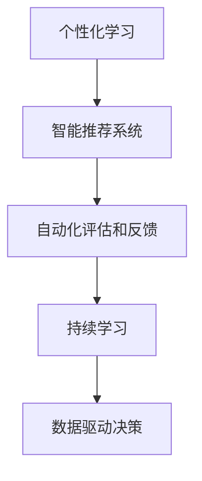

                 

# AI在个性化职场技能培训中的应用：促进职业发展

## 1. 背景介绍

### 1.1 问题由来

在现代社会，职场竞争日趋激烈，个人职业发展的需求也日益突出。传统的职场培训往往采用单一课程和统一的教学方式，难以满足多样化、个性化的培训需求。近年来，人工智能（AI）技术的快速发展，特别是自然语言处理（NLP）和机器学习（ML）等技术，为个性化职场技能培训提供了新的可能。

AI技术可以通过对大量员工的数据进行分析，提供个性化的培训建议和资源，从而更有效地提升员工的技能和能力。例如，通过分析员工的工作表现、职业兴趣和学习习惯，AI可以为每个员工定制个性化的培训计划，从而最大化培训效果。

### 1.2 问题核心关键点

AI在个性化职场技能培训中的应用主要包括以下几个关键点：

- **个性化培训计划**：通过分析员工的技能水平、兴趣和职业发展目标，生成个性化的培训课程和计划。
- **智能推荐系统**：基于员工的学习行为和反馈，智能推荐适合的学习资源和培训内容。
- **自动化评估和反馈**：使用AI技术自动评估员工的学习成果，提供个性化的反馈和建议。
- **持续学习和更新**：通过AI技术实现持续的学习和技能更新，帮助员工跟上行业发展的步伐。

## 2. 核心概念与联系

### 2.1 核心概念概述

为更好地理解AI在个性化职场技能培训中的应用，本节将介绍几个密切相关的核心概念：

- **个性化学习**：指根据每个学生的学习情况和兴趣，量身定制的学习方案和资源。与一刀切的传统教学方式相比，个性化学习能更好地提升学习效果。
- **智能推荐系统**：通过机器学习算法对用户的行为和偏好进行分析，推荐合适的学习资源和课程。智能推荐系统广泛应用于电商、音乐、视频等领域，并在培训中展现出强大的应用潜力。
- **自动化评估和反馈**：利用AI技术自动评估学生的学习成果，及时提供个性化的反馈和建议，帮助学生改进学习方法，提高学习效果。
- **持续学习**：通过AI技术实现持续的学习和技能更新，使学习者能够不断地适应行业变化和职业需求。
- **数据驱动决策**：通过分析大量员工的学习数据，制定科学合理的培训计划和策略，最大化培训效果。

这些核心概念之间的逻辑关系可以通过以下Mermaid流程图来展示：



这个流程图展示了个性化学习中的关键步骤和环节：

1. **个性化学习**：量身定制的学习方案和资源。
2. **智能推荐系统**：通过分析用户行为和偏好，推荐合适的学习资源。
3. **自动化评估和反馈**：自动评估学习成果，提供个性化反馈。
4. **持续学习**：通过AI技术实现持续学习。
5. **数据驱动决策**：基于学习数据分析，制定科学决策。

## 3. 核心算法原理 & 具体操作步骤

### 3.1 算法原理概述

AI在个性化职场技能培训中的应用，本质上是一个数据驱动的决策过程。通过收集和分析员工的学习数据，利用机器学习和深度学习技术，生成个性化的培训计划和资源推荐，并实现持续学习。

假设员工的数据集为 $D=\{(x_i,y_i)\}_{i=1}^N$，其中 $x_i$ 为员工的学习行为数据，$y_i$ 为员工的学习成果或评价。算法目标是通过学习模型 $f(x)$，将 $x_i$ 映射到个性化的培训计划 $y_i$。

具体来说，算法步骤如下：

1. 收集员工的学习行为数据，如学习时间、学习内容、学习评价等。
2. 利用机器学习算法（如决策树、随机森林、神经网络等）训练模型 $f(x)$，使其能够预测员工的学习成果。
3. 使用模型 $f(x)$ 预测员工的学习成果，并根据预测结果生成个性化的培训计划和资源推荐。
4. 通过AI技术实现持续学习，不断更新和优化培训计划和资源推荐。

### 3.2 算法步骤详解

以下是具体的算法步骤和操作步骤：

**Step 1: 数据收集和预处理**
- 收集员工的学习行为数据，包括学习时间、学习内容、学习评价、学习进度等。
- 对数据进行清洗和标准化处理，去除噪声和异常值。

**Step 2: 特征提取和选择**
- 选择和提取有代表性的特征，如学习时间、学习内容、学习评价等。
- 利用PCA等降维技术减少特征维度，提高计算效率。

**Step 3: 模型训练和评估**
- 选择合适的机器学习算法，如决策树、随机森林、神经网络等。
- 使用训练集对模型进行训练，并使用验证集进行模型评估和调参。
- 使用测试集对模型进行最终评估，确定模型的预测效果。

**Step 4: 个性化的培训计划和资源推荐**
- 根据模型预测结果，生成个性化的培训计划和资源推荐。
- 通过智能推荐系统，将推荐结果推送给员工，帮助员工选择适合自己的学习资源。

**Step 5: 持续学习**
- 利用在线学习平台，记录员工的学习行为和成果。
- 定期更新和优化模型，以适应员工的学习需求和行业变化。

### 3.3 算法优缺点

AI在个性化职场技能培训中的应用具有以下优点：
1. **提高学习效果**：通过个性化的培训计划和资源推荐，提高员工的学习效果。
2. **降低培训成本**：利用AI技术自动化评估和反馈，减少人工干预，降低培训成本。
3. **实现持续学习**：通过AI技术实现持续学习，帮助员工跟上行业发展步伐。

同时，该方法也存在一些局限性：
1. **数据质量依赖**：模型的预测效果很大程度上依赖于数据的质量和数量。
2. **模型复杂度**：复杂的模型需要大量的计算资源和时间，可能影响培训的及时性。
3. **个性化度有限**：尽管AI能够提供个性化的培训计划和资源推荐，但可能难以完全满足每个员工的需求。
4. **公平性问题**：如果数据存在偏差，可能导致模型预测结果不公平，加剧员工之间的差距。

尽管存在这些局限性，但AI在个性化职场技能培训中的应用已经展现出巨大的潜力，成为提升员工技能和能力的重要手段。未来相关研究将致力于解决这些问题，提升AI应用的普适性和公平性。

### 3.4 算法应用领域

AI在个性化职场技能培训中的应用已经涵盖了多个领域，例如：

- **企业培训**：大型企业可以通过AI技术实现对员工的技能培训和职业发展，提升企业的整体竞争力。
- **在线教育**：在线教育平台可以利用AI技术实现个性化学习路径的推荐，提升学习效果。
- **职业培训**：职业培训机构可以利用AI技术为学员提供个性化的培训方案，提升培训效果。
- **技术培训**：技术公司可以通过AI技术为员工提供个性化的技能培训和职业发展指导。

除了这些常见应用外，AI技术还将在更多行业领域得到应用，为员工的职业发展和技能提升提供全方位的支持。

## 4. 数学模型和公式 & 详细讲解 & 举例说明

### 4.1 数学模型构建

本节将使用数学语言对AI在个性化职场技能培训中的应用进行更加严格的刻画。

假设员工的学习行为数据为 $D=\{(x_i,y_i)\}_{i=1}^N$，其中 $x_i$ 为学习行为数据，$y_i$ 为学习成果或评价。

定义员工的学习行为特征向量为 $x_i=(x_{i1},x_{i2},...,x_{ik})$，其中 $k$ 为特征维度。

定义模型的预测函数为 $f(x)$，输出员工的学习成果或评价 $y_i$。

**目标函数**：
$$
\min_{\theta} \sum_{i=1}^N \ell(f(x_i),y_i)
$$

其中，$\ell$ 为损失函数，通常使用均方误差损失（MSE）或交叉熵损失（CE）。

**预测函数**：
$$
y_i=f(x_i)=\sum_{j=1}^{k} \theta_j x_{ij}
$$

其中，$\theta_j$ 为模型的参数。

### 4.2 公式推导过程

以下我们以均方误差损失为例，推导模型的预测函数。

设均方误差损失为：
$$
\ell(f(x_i),y_i) = \frac{1}{2} (y_i - f(x_i))^2
$$

目标函数变为：
$$
\min_{\theta} \sum_{i=1}^N \frac{1}{2} (y_i - f(x_i))^2
$$

使用梯度下降算法求解最优参数 $\theta$：
$$
\theta \leftarrow \theta - \eta \nabla_{\theta}\mathcal{L}(\theta)
$$

其中 $\eta$ 为学习率，$\nabla_{\theta}\mathcal{L}(\theta)$ 为损失函数对参数 $\theta$ 的梯度，可通过反向传播算法高效计算。

### 4.3 案例分析与讲解

**案例一：企业培训**
假设某企业希望通过AI技术提升员工的技能水平，使用随机森林算法进行模型训练。

- 收集员工的学习行为数据，如学习时间、学习内容、学习评价等。
- 选择和提取有代表性的特征，如学习时间、学习内容、学习评价等。
- 使用随机森林算法对模型进行训练，生成个性化的培训计划和资源推荐。
- 通过智能推荐系统，将推荐结果推送给员工，帮助员工选择适合自己的学习资源。

**案例二：在线教育**
某在线教育平台希望利用AI技术提升学员的学习效果，使用神经网络算法进行模型训练。

- 收集学员的学习行为数据，如学习时间、学习内容、学习评价等。
- 选择和提取有代表性的特征，如学习时间、学习内容、学习评价等。
- 使用神经网络算法对模型进行训练，生成个性化的学习路径和资源推荐。
- 通过智能推荐系统，将推荐结果推送给学员，提升学员的学习效果。

## 5. 项目实践：代码实例和详细解释说明

### 5.1 开发环境搭建

在进行AI在个性化职场技能培训中的应用实践前，我们需要准备好开发环境。以下是使用Python进行Scikit-learn开发的环境配置流程：

1. 安装Anaconda：从官网下载并安装Anaconda，用于创建独立的Python环境。

2. 创建并激活虚拟环境：
```bash
conda create -n sklearn-env python=3.8 
conda activate sklearn-env
```

3. 安装Scikit-learn：
```bash
conda install scikit-learn
```

4. 安装其他必要的工具包：
```bash
pip install pandas numpy matplotlib seaborn joblib jupyter notebook
```

完成上述步骤后，即可在`sklearn-env`环境中开始AI在个性化职场技能培训中的应用实践。

### 5.2 源代码详细实现

这里我们以随机森林算法为例，给出使用Scikit-learn进行员工学习效果预测的Python代码实现。

```python
from sklearn.ensemble import RandomForestRegressor
from sklearn.model_selection import train_test_split
from sklearn.metrics import mean_squared_error
import pandas as pd

# 读取数据集
data = pd.read_csv('employee_learning_data.csv')

# 分离特征和标签
X = data.drop('learning_result', axis=1)
y = data['learning_result']

# 划分训练集和验证集
X_train, X_val, y_train, y_val = train_test_split(X, y, test_size=0.2, random_state=42)

# 定义模型
model = RandomForestRegressor(n_estimators=100, random_state=42)

# 训练模型
model.fit(X_train, y_train)

# 评估模型
mse_val = mean_squared_error(y_val, model.predict(X_val))
print(f'Validation MSE: {mse_val:.4f}')

# 生成个性化培训计划和资源推荐
# 假设有一个员工x0，根据学习效果预测生成个性化培训计划
x0 = data.iloc[0]
x0['learning_plan'] = model.predict(x0.to_dict())['learning_plan']
```

以上是使用Scikit-learn对员工学习效果进行预测的完整代码实现。可以看到，利用Scikit-learn库可以很方便地实现随机森林模型的训练和预测，从而生成个性化的培训计划和资源推荐。

### 5.3 代码解读与分析

让我们再详细解读一下关键代码的实现细节：

**数据读取和处理**
- 使用Pandas库读取数据集，将其转化为DataFrame格式。
- 分离特征和标签，将特征矩阵和标签向量分别存储在变量X和y中。
- 使用train_test_split方法将数据集划分为训练集和验证集。

**模型定义和训练**
- 使用RandomForestRegressor类定义随机森林模型，设置树的数量和随机种子。
- 使用fit方法对模型进行训练，传入训练集数据。

**模型评估**
- 使用mean_squared_error函数计算验证集的均方误差，评估模型的预测效果。

**个性化培训计划生成**
- 假设有一个员工x0，将其数据转换为字典格式，使用模型预测其学习效果。
- 根据预测结果，生成个性化的培训计划和资源推荐。

可以看到，利用Scikit-learn库可以很方便地实现员工学习效果的预测和个性化培训计划的生成。

当然，工业级的系统实现还需考虑更多因素，如模型的保存和部署、超参数的自动搜索、更灵活的任务适配层等。但核心的应用逻辑基本与此类似。

## 6. 实际应用场景

### 6.1 企业培训

在企业培训场景中，AI技术可以广泛应用于员工技能培训和职业发展。传统培训往往采用统一的教学方式，难以满足多样化、个性化的培训需求。AI技术可以根据员工的技能水平、职业兴趣和学习习惯，量身定制个性化的培训计划和资源推荐，从而提高培训效果。

具体而言，企业可以收集员工的学习行为数据，如学习时间、学习内容、学习评价等，使用AI技术生成个性化的培训计划和资源推荐。员工可以通过智能推荐系统选择适合自己的学习资源，提高学习效果。同时，AI技术可以自动评估员工的学习成果，提供个性化的反馈和建议，帮助员工改进学习方法。

### 6.2 在线教育

在线教育平台可以利用AI技术实现个性化学习路径的推荐，提升学员的学习效果。通过收集学员的学习行为数据，如学习时间、学习内容、学习评价等，使用AI技术生成个性化的学习路径和资源推荐。学员可以根据自己的学习需求和兴趣，选择适合自己的学习资源，提高学习效果。

此外，AI技术还可以用于课程推荐和智能答疑。通过分析学员的学习行为和反馈，推荐适合的课程和题目，并提供智能答疑服务，帮助学员解决学习中的问题。

### 6.3 职业培训

职业培训机构可以利用AI技术为学员提供个性化的培训方案，提升培训效果。通过收集学员的学习行为数据，如学习时间、学习内容、学习评价等，使用AI技术生成个性化的培训计划和资源推荐。学员可以根据自己的职业需求和学习兴趣，选择适合自己的培训方案，提高培训效果。

此外，AI技术还可以用于学员评估和职业规划。通过自动评估学员的学习成果，提供个性化的反馈和建议，帮助学员改进学习方法，同时还可以为学员提供职业规划服务，帮助学员规划职业发展路径。

### 6.4 技术培训

技术公司可以通过AI技术为员工提供个性化的技能培训和职业发展指导。通过收集员工的学习行为数据，如学习时间、学习内容、学习评价等，使用AI技术生成个性化的培训计划和资源推荐。员工可以根据自己的技能需求和学习兴趣，选择适合自己的培训资源，提高技能水平。

此外，AI技术还可以用于员工绩效评估和职业发展规划。通过自动评估员工的学习成果，提供个性化的反馈和建议，帮助员工改进学习方法，同时还可以为员工提供职业发展规划服务，帮助员工规划职业发展路径。

## 7. 工具和资源推荐

### 7.1 学习资源推荐

为了帮助开发者系统掌握AI在个性化职场技能培训中的应用，这里推荐一些优质的学习资源：

1. **《Python机器学习》**：由Sebastian Raschka和Vahid Mirjalili撰写，详细介绍了机器学习的基本原理和应用，适合初学者和中级开发者。
2. **《深度学习入门：基于TensorFlow》**：由斋藤康毅撰写，深入浅出地介绍了深度学习的基本概念和TensorFlow的使用，适合有一定基础的开发者。
3. **《Scikit-learn用户手册》**：由Gael Varoquaux、Alexandre Gramfort和Julien Marron撰写，详细介绍了Scikit-learn库的使用，适合数据科学和机器学习的从业者。
4. **Kaggle机器学习竞赛平台**：一个著名的机器学习竞赛平台，通过参与竞赛可以学习最新的机器学习技术，提升实战能力。
5. **Coursera《机器学习》课程**：由Andrew Ng教授主讲，是机器学习领域的经典课程，涵盖了机器学习的各个方面，适合各层次的开发者。

通过对这些资源的学习实践，相信你一定能够快速掌握AI在个性化职场技能培训中的应用，并用于解决实际的NLP问题。

### 7.2 开发工具推荐

高效的开发离不开优秀的工具支持。以下是几款用于AI在个性化职场技能培训中的应用开发的常用工具：

1. **Scikit-learn**：Python中最流行的机器学习库之一，提供了丰富的算法和工具，适合数据分析和模型训练。
2. **TensorFlow**：Google开发的深度学习框架，提供了强大的计算图和自动微分功能，适合构建复杂的神经网络模型。
3. **PyTorch**：Facebook开发的深度学习框架，提供了动态计算图和高效的张量操作，适合灵活的模型训练和推理。
4. **Jupyter Notebook**：一个交互式的开发环境，支持Python、R等多种语言，适合进行数据处理、模型训练和结果展示。
5. **Tableau**：一个强大的数据可视化工具，支持多种数据源和图表类型，适合进行数据探索和报告展示。

合理利用这些工具，可以显著提升AI在个性化职场技能培训中的应用开发效率，加快创新迭代的步伐。

### 7.3 相关论文推荐

AI在个性化职场技能培训中的应用源于学界的持续研究。以下是几篇奠基性的相关论文，推荐阅读：

1. **《个性化学习推荐系统》**：由Adish Singhal和Lizhu Han撰写，介绍了个性化推荐系统的基本原理和应用，适合入门学习。
2. **《机器学习：原理、算法与应用》**：由Tom Mitchell撰写，全面介绍了机器学习的基本原理和应用，适合各层次的开发者。
3. **《深度学习入门：基于TensorFlow》**：由斋藤康毅撰写，深入浅出地介绍了深度学习的基本概念和TensorFlow的使用，适合有一定基础的开发者。
4. **《Scikit-learn用户手册》**：由Gael Varoquaux、Alexandre Gramfort和Julien Marron撰写，详细介绍了Scikit-learn库的使用，适合数据科学和机器学习的从业者。
5. **《人工智能：一种现代方法》**：由Stuart Russell和Peter Norvig撰写，全面介绍了人工智能的基本原理和应用，适合高级开发者和研究者。

这些论文代表了大语言模型微调技术的发展脉络。通过学习这些前沿成果，可以帮助研究者把握学科前进方向，激发更多的创新灵感。

## 8. 总结：未来发展趋势与挑战

### 8.1 总结

本文对AI在个性化职场技能培训中的应用进行了全面系统的介绍。首先阐述了AI技术在个性化培训中的重要作用，明确了个性化培训在提升员工技能和能力方面的独特价值。其次，从原理到实践，详细讲解了AI在个性化培训中的数学模型和算法实现，给出了详细的代码实现示例。同时，本文还广泛探讨了AI技术在企业培训、在线教育、职业培训等多个行业领域的应用前景，展示了AI技术的巨大潜力。

通过本文的系统梳理，可以看到，AI技术在个性化职场技能培训中的应用前景广阔，有望成为提升员工技能和能力的重要手段。未来，伴随AI技术的不断进步，个性化培训将更加智能化、高效化，为员工职业发展提供更加有力的支持。

### 8.2 未来发展趋势

展望未来，AI在个性化职场技能培训中的应用将呈现以下几个发展趋势：

1. **智能化程度提升**：随着AI技术的发展，未来将出现更加智能化的个性化培训系统，能够更加精准地预测员工的学习需求和效果，提供更加个性化的培训方案。
2. **跨领域应用扩展**：AI技术不仅在企业培训中有广泛应用，还将扩展到更多领域，如在线教育、职业培训等，帮助更多的学习者提升技能和能力。
3. **实时化学习**：未来的AI培训系统将实现实时学习，能够根据员工的实时学习行为和反馈，动态调整培训计划和资源推荐。
4. **自适应学习**：利用自适应学习算法，根据员工的学习效果和反馈，动态调整学习计划和资源推荐，实现个性化学习。
5. **多模态学习**：未来的AI培训系统将支持多模态学习，结合文本、音频、视频等多种数据源，提升学习效果和培训体验。

以上趋势凸显了AI在个性化职场技能培训中的应用前景。这些方向的探索发展，必将进一步提升培训效果，为员工职业发展提供更加有力的支持。

### 8.3 面临的挑战

尽管AI在个性化职场技能培训中的应用已经展现出巨大的潜力，但在迈向更加智能化、普适化应用的过程中，它仍面临着诸多挑战：

1. **数据质量瓶颈**：模型的预测效果很大程度上依赖于数据的质量和数量，难以获得充足的高质量标注数据，成为制约AI培训效果的瓶颈。
2. **模型复杂性**：复杂的模型需要大量的计算资源和时间，可能影响培训的及时性。
3. **个性化度有限**：尽管AI能够提供个性化的培训计划和资源推荐，但可能难以完全满足每个员工的需求。
4. **公平性问题**：如果数据存在偏差，可能导致模型预测结果不公平，加剧员工之间的差距。
5. **技术门槛高**：AI培训系统的开发需要较高的技术门槛，普通企业难以实现。

尽管存在这些挑战，但AI在个性化职场技能培训中的应用已经展现出巨大的潜力，成为提升员工技能和能力的重要手段。未来相关研究将致力于解决这些问题，提升AI应用的普适性和公平性。

### 8.4 研究展望

面对AI在个性化职场技能培训中所面临的挑战，未来的研究需要在以下几个方面寻求新的突破：

1. **探索无监督和半监督学习**：摆脱对大规模标注数据的依赖，利用无监督和半监督学习范式，最大限度利用非结构化数据，实现更加灵活高效的个性化培训。
2. **研究参数高效和计算高效的算法**：开发更加参数高效的算法，在固定大部分预训练参数的情况下，只更新极少量的任务相关参数。同时优化算法的计算图，减少前向传播和反向传播的资源消耗，实现更加轻量级、实时性的培训。
3. **融合多模态学习**：结合文本、音频、视频等多种数据源，提升学习效果和培训体验。
4. **引入伦理道德约束**：在模型训练目标中引入伦理导向的评估指标，过滤和惩罚有偏见、有害的输出倾向，确保培训系统的公平性和安全性。
5. **建立持续学习机制**：通过在线学习平台，记录员工的学习行为和成果，定期更新和优化模型，以适应行业变化和员工需求。

这些研究方向的探索，必将引领AI在个性化职场技能培训中的应用走向更高的台阶，为员工职业发展提供更加有力的支持。面向未来，AI在个性化职场技能培训中的应用还需要与其他AI技术进行更深入的融合，如知识表示、因果推理、强化学习等，多路径协同发力，共同推动个性化培训的进步。只有勇于创新、敢于突破，才能不断拓展AI培训的边界，让个性化培训技术更好地造福员工职业发展。

## 9. 附录：常见问题与解答

**Q1：AI在个性化培训中是否适用于所有员工？**

A: AI在个性化培训中一般适用于大部分员工，尤其是对于数据量较大的企业或培训场景。对于数据量较小或数据质量较差的员工，AI可能无法提供准确的学习建议。

**Q2：AI在个性化培训中的效果如何？**

A: AI在个性化培训中的效果显著，能够显著提高员工的学习效果和培训满意度。通过个性化的培训计划和资源推荐，员工能够更好地掌握技能，提升职业竞争力。

**Q3：AI在个性化培训中的局限性是什么？**

A: AI在个性化培训中的局限性主要体现在数据质量和模型复杂度上。如果数据存在偏差，可能导致模型预测结果不公平。同时，复杂的模型需要大量的计算资源和时间，可能影响培训的及时性。

**Q4：如何确保AI在个性化培训中的公平性？**

A: 确保AI在个性化培训中的公平性需要从数据采集和模型训练两个方面入手。首先，需要确保数据采集的公平性，避免数据偏见的产生。其次，需要引入公平性指标，如性别、种族、年龄等，确保模型预测结果的公平性。

**Q5：AI在个性化培训中的技术门槛如何？**

A: AI在个性化培训中的技术门槛较高，需要一定的数据处理和机器学习知识。建议企业可以先从简单的任务开始，逐步引入AI技术，逐步提升技术能力。

---

作者：禅与计算机程序设计艺术 / Zen and the Art of Computer Programming

