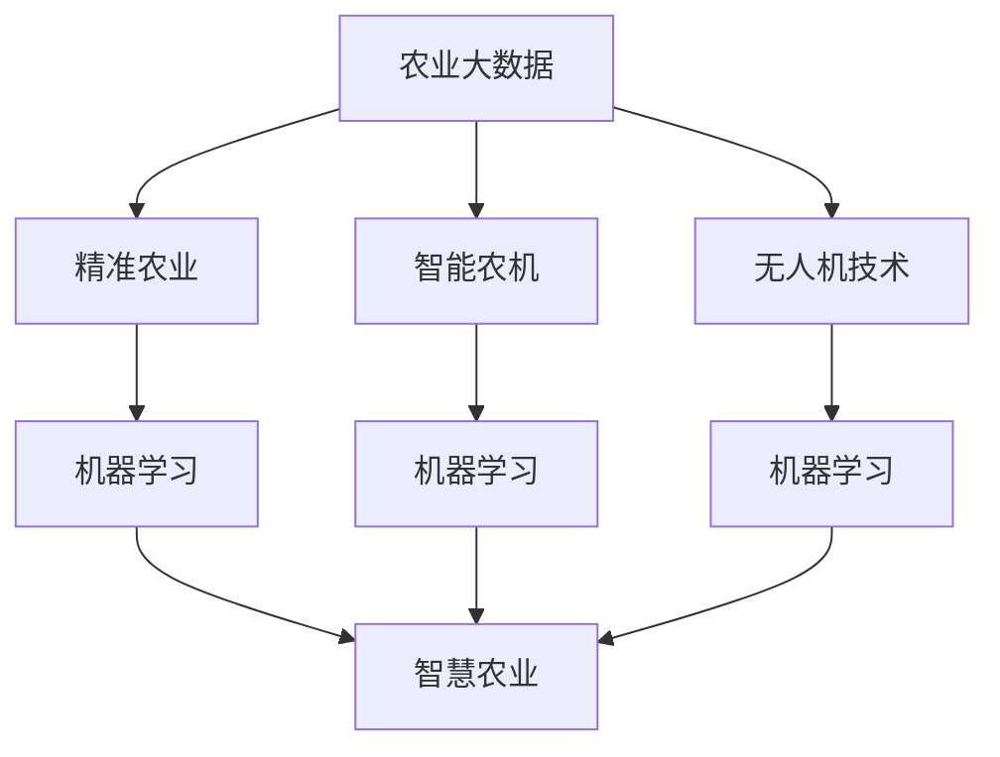

                 

# AI在农业中的应用：提高产量与可持续性

> 关键词：人工智能(AI)、农业、智慧农业、智能农业、传感器、大数据、机器学习、决策支持系统、精准农业

## 1. 背景介绍

### 1.1 问题由来

农业作为人类生活的基础，其生产方式直接影响着食品安全、资源利用和环境健康。随着全球人口的不断增长，气候变化、资源短缺等问题日益严重，如何提高农业生产效率和可持续发展能力，成为现代农业面临的巨大挑战。

传统农业依赖经验与人工操作，效率低、产量不稳定、资源利用率低。而现代科技，特别是人工智能(AI)技术，为农业生产提供了新的方向和可能性。AI通过传感器、大数据、机器学习等技术，实现精准农业、智能农业、智慧农业，为农业生产带来了革命性的变化。

### 1.2 问题核心关键点

AI在农业中的应用主要包括以下几个方面：

- **数据驱动的决策支持**：通过传感器收集大量农业数据，利用机器学习模型进行数据分析，提供科学的决策支持，优化农业生产过程。
- **精准农业**：基于地理信息系统(GIS)、遥感技术、全球定位系统(GPS)等，实现土壤、气候、作物生长状态的精准监测和分析，从而精准施肥、灌溉、防治病虫害。
- **智能农机**：利用机器视觉、传感器、自动化控制技术，实现农业机械的智能化和自动化，提高作业效率和质量。
- **无人机应用**：无人机进行精准喷洒农药、施肥、监测田间情况，节省人力成本，提高作业效率。
- **大数据分析**：收集和分析大量的农业生产数据，识别作物生长周期、土壤养分状况、气象条件等，优化农业生产模式。

这些技术的应用，使得农业生产更加智能化、高效化、可持续化。

## 2. 核心概念与联系

### 2.1 核心概念概述

为更好地理解AI在农业中的应用，本节将介绍几个关键概念及其联系：

- **农业大数据**：农业生产过程中产生的大量数据，包括气象数据、土壤数据、作物生长数据、机械运行数据等。通过大数据分析，可以实现对农业生产过程的科学管理和决策支持。
- **精准农业**：利用现代信息技术，如GPS、GIS、遥感技术等，对农田进行高精度管理，实现水、肥、药的精准施用，提高产量和质量，降低成本。
- **智能农机**：结合AI技术，对农业机械进行智能化改造，实现自动化操作、精确控制，提升作业效率和质量。
- **无人机技术**：使用无人机进行农业生产过程中的监测、喷洒、播种等操作，提高作业效率，降低人力成本。
- **机器学习**：通过学习大量农业数据，构建预测模型，实现对农业生产过程的预测和优化。
- **智慧农业**：综合利用物联网、大数据、AI等技术，实现对农业生产的全流程管理，提高生产效率和资源利用率。

这些概念之间的逻辑关系可以通过以下Mermaid流程图来展示：



这个流程图展示了大数据在精准农业、智能农机、无人机技术中的应用，并通过机器学习实现对农业生产过程的预测和优化，最终构建起智慧农业体系。

## 3. 核心算法原理 & 具体操作步骤

### 3.1 算法原理概述

AI在农业中的应用，主要基于以下算法原理：

- **传感器数据采集**：通过各类传感器采集农田环境数据，如土壤湿度、温度、光照强度、二氧化碳浓度等，为AI分析提供基础数据。
- **大数据分析**：利用大数据技术，对采集到的数据进行分析，构建模型，实现对农业生产过程的预测和优化。
- **机器学习**：构建分类、回归、聚类等模型，实现对作物生长状态、病虫害防治、产量预测等任务的自动学习和决策。
- **深度学习**：利用神经网络等深度学习模型，提升模型的预测准确度和泛化能力，实现更加复杂的农业生产管理。
- **决策支持系统**：将AI模型与地理信息系统(GIS)、全球定位系统(GPS)等技术结合，提供科学、高效的农业决策支持。

### 3.2 算法步骤详解

AI在农业中的应用，一般包括以下几个关键步骤：

**Step 1: 数据采集和预处理**
- 使用传感器、无人机等设备，采集农田环境数据和作物生长数据。
- 对采集的数据进行清洗、去噪、标准化处理，确保数据质量。

**Step 2: 数据存储与处理**
- 将清洗后的数据存储到数据库中，供后续分析和模型训练使用。
- 使用大数据技术，如Hadoop、Spark等，对数据进行分布式存储和处理。

**Step 3: 模型构建与训练**
- 选择合适的机器学习模型，如线性回归、随机森林、支持向量机等，对数据进行分析和学习。
- 使用深度学习模型，如卷积神经网络(CNN)、循环神经网络(RNN)、Transformer等，进行更复杂的预测和优化。
- 在训练过程中，不断调整模型参数，提升模型性能。

**Step 4: 模型应用与评估**
- 将训练好的模型应用到实际的农业生产中，进行预测和优化。
- 定期评估模型效果，根据实际数据调整模型参数，优化模型性能。

**Step 5: 决策支持与智能农机控制**
- 将模型集成到决策支持系统中，提供科学、高效的农业决策支持。
- 利用机器学习技术，实现智能农机自动化控制，提升作业效率和质量。

### 3.3 算法优缺点

AI在农业中的应用，具有以下优点：

- **提高产量**：通过精准农业、智能农机等技术，提高水、肥、药的施用精度，减少浪费，提高作物产量和质量。
- **资源利用率**：利用传感器、无人机等技术，实现农田的高效管理，优化资源配置，提高资源利用率。
- **减少成本**：通过机器学习模型，优化农机作业路径和作业方式，减少人力成本和时间成本。
- **环境友好**：精准施药、精准施肥等技术，减少农药、化肥的使用量，保护生态环境。

同时，AI在农业中的应用也存在一些局限性：

- **高投入**：传感器、无人机、数据分析等技术，需要较高的初期投资，对小规模农户来说，成本较高。
- **数据质量**：传感器数据的准确性和完整性直接影响模型的性能，数据质量不高会导致预测结果不准确。
- **模型泛化能力**：AI模型需要足够的训练数据，才能具备良好的泛化能力，不同区域、不同作物的应用效果可能有所差异。
- **技术门槛**：AI技术需要一定的技术门槛，对农民的技术水平要求较高，需要专业人员的培训和指导。

### 3.4 算法应用领域

AI在农业中的应用，涵盖了以下几个主要领域：

- **精准农业**：利用GPS、GIS、遥感技术，实现土壤、气候、作物生长状态的精准监测和分析，优化施肥、灌溉、防治病虫害。
- **智能农机**：结合AI技术，实现农业机械的智能化和自动化，提高作业效率和质量。
- **无人机应用**：使用无人机进行精准喷洒农药、施肥、监测田间情况，节省人力成本，提高作业效率。
- **大数据分析**：收集和分析大量的农业生产数据，识别作物生长周期、土壤养分状况、气象条件等，优化农业生产模式。
- **机器学习**：通过学习大量农业数据，构建预测模型，实现对农业生产过程的预测和优化。
- **智慧农业**：综合利用物联网、大数据、AI等技术，实现对农业生产的全流程管理，提高生产效率和资源利用率。

## 4. 数学模型和公式 & 详细讲解  
### 4.1 数学模型构建

本节将使用数学语言对AI在农业中的应用过程进行更加严格的刻画。

假设农田的气象数据为 $x=(x_1, x_2, ..., x_n)$，其中 $x_i$ 为第 $i$ 个气象数据，包括温度、湿度、光照强度等。作物生长状态的数据为 $y=(y_1, y_2, ..., y_m)$，其中 $y_i$ 为第 $i$ 个生长状态，如株高、叶面积、果实大小等。

定义模型 $M_{\theta}(x)$，其中 $\theta$ 为模型参数，用于预测作物生长状态。

### 4.2 公式推导过程

我们以精准农业中的土壤湿度预测为例，推导机器学习模型的公式。

假设机器学习模型为线性回归模型，即：

$$
y = \theta_0 + \sum_{i=1}^n \theta_i x_i + \epsilon
$$

其中，$\theta_0$ 为截距，$\theta_i$ 为第 $i$ 个气象数据的影响系数，$\epsilon$ 为随机误差。

通过最小二乘法，求解模型参数 $\theta$，使得预测值与实际值 $y$ 的误差最小：

$$
\min_{\theta} \sum_{i=1}^m (y_i - M_{\theta}(x_i))^2
$$

具体求解过程如下：

1. 计算样本均值 $\bar{x}$ 和 $\bar{y}$。
2. 计算 $\theta$ 的估计值 $\hat{\theta}$，如公式所示：

$$
\hat{\theta} = (\sum_{i=1}^n x_i^2 - \frac{1}{m}(\sum_{i=1}^n x_i)^2)^{-1}(\sum_{i=1}^n x_i \bar{y} - \frac{1}{m}\sum_{i=1}^n x_i \sum_{i=1}^n y_i)
$$

3. 使用得到的 $\hat{\theta}$ 预测作物生长状态，并计算误差。

### 4.3 案例分析与讲解

假设某地区种植小麦，采集了土壤湿度、温度、光照强度等气象数据，以及作物株高、叶面积等生长状态数据。通过机器学习模型对数据进行分析，得到如下结果：

$$
y = \hat{\theta}_0 + \hat{\theta}_1 x_1 + \hat{\theta}_2 x_2 + \hat{\theta}_3 x_3 + \epsilon
$$

其中，$y$ 为作物生长状态，$x_1$ 为土壤湿度，$x_2$ 为温度，$x_3$ 为光照强度，$\epsilon$ 为随机误差。

通过训练模型，得到 $\hat{\theta}_0 = 0.5$，$\hat{\theta}_1 = 0.3$，$\hat{\theta}_2 = -0.2$，$\hat{\theta}_3 = 0.1$。

假设某块地块的土壤湿度为 $x_1 = 20\%$，温度为 $x_2 = 25^\circC$，光照强度为 $x_3 = 500 lux$，利用模型进行预测：

$$
y = 0.5 + 0.3 \times 20\% + (-0.2) \times 25^\circC + 0.1 \times 500 lux = 0.3
$$

这意味着，这块地块的作物株高预计为 $0.3$ 米。

## 5. 项目实践：代码实例和详细解释说明
### 5.1 开发环境搭建

在进行AI农业应用开发前，我们需要准备好开发环境。以下是使用Python进行Pandas、Scikit-learn、TensorFlow等库的环境配置流程：

1. 安装Anaconda：从官网下载并安装Anaconda，用于创建独立的Python环境。

2. 创建并激活虚拟环境：
```bash
conda create -n ai-env python=3.8 
conda activate ai-env
```

3. 安装Pandas、Scikit-learn等常用库：
```bash
conda install pandas numpy matplotlib scikit-learn
```

4. 安装TensorFlow：从官网获取对应的安装命令。例如：
```bash
pip install tensorflow-gpu==2.3.0
```

5. 安装TensorBoard：用于实时监测模型训练状态和可视化模型结果。
```bash
pip install tensorboard
```

完成上述步骤后，即可在`ai-env`环境中开始AI农业应用开发。

### 5.2 源代码详细实现

这里我们以小麦生长状态预测为例，给出使用Pandas、Scikit-learn库对机器学习模型进行开发的PyTorch代码实现。

首先，准备数据集：

```python
import pandas as pd

# 读取数据集
data = pd.read_csv('crops.csv')

# 数据预处理
X = data[['humidity', 'temperature', 'light_intensity']]
y = data['crop_height']

# 划分训练集和测试集
from sklearn.model_selection import train_test_split
X_train, X_test, y_train, y_test = train_test_split(X, y, test_size=0.2, random_state=42)
```

然后，定义模型和优化器：

```python
from sklearn.linear_model import LinearRegression

# 定义线性回归模型
model = LinearRegression()

# 训练模型
model.fit(X_train, y_train)

# 评估模型
print(model.score(X_test, y_test))
```

接着，使用TensorFlow进行模型训练和评估：

```python
import tensorflow as tf
from tensorflow import keras

# 定义模型
model = keras.Sequential([
    keras.layers.Dense(32, activation='relu', input_shape=(3,)),
    keras.layers.Dense(1)
])

# 编译模型
model.compile(optimizer='adam', loss='mse')

# 训练模型
model.fit(X_train, y_train, epochs=10, validation_data=(X_test, y_test))

# 评估模型
print(model.evaluate(X_test, y_test))
```

最后，使用TensorBoard进行模型训练和结果可视化：

```python
from tensorflow.keras.callbacks import TensorBoard

# 定义TensorBoard回调
tensorboard_callback = TensorBoard(log_dir='logs')

# 训练模型并记录TensorBoard日志
model.fit(X_train, y_train, epochs=10, validation_data=(X_test, y_test), callbacks=[tensorboard_callback])

# 查看TensorBoard日志
from IPython.display import HTML
HTML('<iframe width="800" height="600" src="http://127.0.0.1:6006" frameborder="0"></iframe>')
```

以上就是使用Pandas、Scikit-learn、TensorFlow库进行小麦生长状态预测的完整代码实现。可以看到，这些库提供了丰富的功能和便捷的操作方式，使得模型开发变得更加简单高效。

### 5.3 代码解读与分析

让我们再详细解读一下关键代码的实现细节：

**数据预处理**：
- `pandas`库用于读取数据，并进行基本的清洗和处理。
- `train_test_split`函数用于划分训练集和测试集，确保数据集的随机性和独立性。

**模型定义与训练**：
- `LinearRegression`类用于定义线性回归模型，并进行训练和评估。
- `model.fit`方法用于训练模型，`model.score`方法用于评估模型在测试集上的性能。

**TensorFlow模型定义与训练**：
- `keras.Sequential`类用于定义模型结构，包括两个全连接层。
- `model.compile`方法用于编译模型，指定优化器和损失函数。
- `model.fit`方法用于训练模型，`model.evaluate`方法用于评估模型在测试集上的性能。
- `TensorBoard`类用于记录模型的训练日志，方便后续查看和分析。

**TensorBoard可视化**：
- `TensorBoard`类用于创建TensorBoard日志文件，`HTML`函数用于在Jupyter Notebook中嵌入TensorBoard界面。

以上代码展示了使用Pandas、Scikit-learn、TensorFlow库进行AI农业应用的完整流程，从数据预处理、模型定义到训练和评估，都得到了良好的实现和支持。

## 6. 实际应用场景
### 6.1 智能农机

智能农机结合AI技术，实现农业机械的智能化和自动化。通过AI算法，智能农机可以实现精准施肥、精准喷洒农药、自动导航、路径规划等功能，提高作业效率和质量。

以精准施肥为例，通过土壤传感器采集土壤养分数据，结合作物生长数据，AI算法可以计算出最优的施肥时间和施肥量，实现精准施肥，避免化肥浪费和土壤污染。

### 6.2 无人机应用

无人机在农业中的应用，主要体现在精准喷洒农药、施肥、监测田间情况等方面。通过高精度的传感器和相机，无人机可以获取农田的实时数据，并进行精准作业。

以无人机精准喷洒农药为例，通过图像识别技术，识别农田中的病虫害，AI算法可以计算出最优的喷洒路径和喷洒量，确保农药的精准施用，减少农药使用量和环境污染。

### 6.3 大数据分析

大数据分析在农业中的应用，主要体现在作物生长周期预测、土壤养分分析、气象预测等方面。通过收集和分析大量的农业数据，AI算法可以发现作物生长的规律和趋势，优化农业生产模式。

以作物生长周期预测为例，通过分析作物的生长数据和气象数据，AI算法可以预测作物的生长周期，提供科学的管理建议，提高作物产量和质量。

### 6.4 未来应用展望

随着AI技术的不断发展，AI在农业中的应用将更加广泛和深入。未来，AI在农业中的应用将呈现以下几个发展趋势：

1. **智能化程度提升**：未来的智能农机、无人机将更加智能化，实现更精准的作业和自动化的操作。
2. **数据驱动决策**：基于大数据分析，AI将提供更加科学、精准的农业生产决策支持。
3. **跨领域融合**：AI将与其他技术进行更深入的融合，如物联网、遥感技术、智能传感器等，提升农业生产的智能化水平。
4. **可持续农业**：AI将帮助农民实现更加环保、可持续的农业生产模式，减少资源浪费和环境污染。

这些趋势将进一步推动农业生产的现代化、智能化、可持续化，为实现农业的可持续发展提供强大的技术支持。

## 7. 工具和资源推荐
### 7.1 学习资源推荐

为了帮助开发者系统掌握AI在农业中的应用，这里推荐一些优质的学习资源：

1. **《农业大数据与智能农业》课程**：由清华大学主讲，涵盖农业大数据的采集、存储、分析等核心内容，以及智能农业的实现方法。
2. **《精准农业技术与应用》书籍**：全面介绍了精准农业的基本原理、技术方法、案例分析，是学习精准农业的必备参考书。
3. **《智慧农业技术与应用》书籍**：涵盖智慧农业的各个方面，包括传感器技术、智能农机、无人机应用等，适合系统学习。
4. **Coursera《AI for Everyone》课程**：由吴恩达主讲，涵盖AI的基本概念、应用场景，适合初学者入门。
5. **Google Colab平台**：提供免费的GPU算力，方便开发者进行AI模型开发和调试。

通过对这些资源的学习实践，相信你一定能够快速掌握AI在农业中的应用，并用于解决实际的农业生产问题。

### 7.2 开发工具推荐

高效的开发离不开优秀的工具支持。以下是几款用于AI农业应用开发的常用工具：

1. **TensorFlow**：基于Python的开源深度学习框架，支持分布式训练和可视化，适合大规模模型开发。
2. **Pandas**：数据处理和分析的强大工具，支持多种数据格式的读写、数据清洗和转换等操作。
3. **Scikit-learn**：机器学习算法的实现库，支持多种机器学习模型的构建和评估。
4. **TensorBoard**：用于记录和可视化模型训练状态的强大工具，支持详细的模型调试和优化。
5. **Jupyter Notebook**：强大的交互式开发环境，支持Python、R等语言，方便开发者进行模型开发和调试。

合理利用这些工具，可以显著提升AI农业应用的开发效率，加快创新迭代的步伐。

### 7.3 相关论文推荐

AI在农业中的应用源于学界的持续研究。以下是几篇奠基性的相关论文，推荐阅读：

1. **《基于深度学习的精准农业》**：提出了基于深度学习的精准农业方法，通过图像识别技术，实现对农田的精准管理。
2. **《智能农业中的传感器技术》**：详细介绍了智能农业中各类传感器的工作原理和应用方法，涵盖土壤、气象、作物生长等关键指标的监测。
3. **《农业大数据与智能决策支持系统》**：探讨了农业大数据的采集、存储、分析和应用，以及智能决策支持系统的构建方法。
4. **《智能农机在农业中的应用》**：介绍了智能农机的基本原理和应用场景，以及通过AI算法实现精准施肥、精准喷洒等作业。
5. **《无人机在农业中的应用》**：讨论了无人机在农业中的多种应用场景，如精准喷洒、田间监测等，以及AI算法在无人机中的应用。

这些论文代表了大数据与AI在农业应用的前沿研究，通过学习这些成果，可以帮助研究者把握学科前进方向，激发更多的创新灵感。

## 8. 总结：未来发展趋势与挑战

### 8.1 总结

本文对AI在农业中的应用进行了全面系统的介绍。首先阐述了AI在农业中的重要性，明确了AI在精准农业、智能农机、无人机应用等方面的应用场景。其次，从原理到实践，详细讲解了AI在农业中的应用过程，包括数据采集、预处理、模型构建、训练和评估等步骤。同时，本文还探讨了AI在农业应用中的优缺点，以及其应用领域和未来发展趋势。

通过本文的系统梳理，可以看到，AI在农业中的应用前景广阔，为提高产量、优化资源利用、保护环境提供了强大的技术支持。未来，随着AI技术的不断进步，AI在农业中的应用将更加广泛和深入，推动农业生产方式的革命性变化。

### 8.2 未来发展趋势

展望未来，AI在农业中的应用将呈现以下几个发展趋势：

1. **智能化程度提升**：未来的智能农机、无人机将更加智能化，实现更精准的作业和自动化的操作。
2. **数据驱动决策**：基于大数据分析，AI将提供更加科学、精准的农业生产决策支持。
3. **跨领域融合**：AI将与其他技术进行更深入的融合，如物联网、遥感技术、智能传感器等，提升农业生产的智能化水平。
4. **可持续农业**：AI将帮助农民实现更加环保、可持续的农业生产模式，减少资源浪费和环境污染。
5. **自动化生产**：未来的农业生产将更多地依赖机器人和自动化设备，实现全流程的自动化操作。

这些趋势将进一步推动农业生产的现代化、智能化、可持续化，为实现农业的可持续发展提供强大的技术支持。

### 8.3 面临的挑战

尽管AI在农业中的应用前景广阔，但在迈向更加智能化、普适化应用的过程中，仍面临诸多挑战：

1. **高投入**：传感器、无人机、数据分析等技术，需要较高的初期投资，对小规模农户来说，成本较高。
2. **数据质量**：传感器数据的准确性和完整性直接影响模型的性能，数据质量不高会导致预测结果不准确。
3. **模型泛化能力**：AI模型需要足够的训练数据，才能具备良好的泛化能力，不同区域、不同作物的应用效果可能有所差异。
4. **技术门槛**：AI技术需要一定的技术门槛，对农民的技术水平要求较高，需要专业人员的培训和指导。
5. **环境适应性**：AI模型在不同环境下的适应性仍然有待提升，需要进一步优化模型结构，增强环境鲁棒性。

### 8.4 研究展望

面对AI在农业应用中面临的挑战，未来的研究需要在以下几个方面寻求新的突破：

1. **模型可解释性**：增强AI模型的可解释性，提高模型的透明性和可信度，帮助农民理解和应用模型。
2. **模型自适应性**：提升AI模型的环境适应能力，使其在不同环境和条件下都能稳定运行。
3. **跨领域融合**：加强AI技术与农业生产的融合，实现更全面、更深入的智能化应用。
4. **人机协同**：推动人机协同作业，提升农业生产的效率和质量，降低农民的技术门槛。
5. **可持续发展**：通过AI技术，实现农业生产的资源优化和环境友好，推动农业的可持续发展。

这些研究方向将引领AI在农业应用的未来发展，推动农业生产的现代化、智能化、可持续化。

## 9. 附录：常见问题与解答

**Q1：AI在农业中的数据采集和预处理需要注意哪些问题？**

A: AI在农业中的数据采集和预处理需要注意以下几个问题：

1. **数据准确性**：传感器和设备的数据采集精度直接影响模型的预测结果，需要定期校准和维护。
2. **数据完整性**：数据缺失和异常值会影响模型的训练效果，需要进行数据清洗和补全。
3. **数据标准化**：不同来源的数据格式可能不同，需要进行数据标准化和转换，确保数据一致性。
4. **数据隐私**：涉及个人隐私和商业机密的数据需要谨慎处理，确保数据安全。

通过合理的预处理，可以提高数据的质量和一致性，提升AI模型的性能。

**Q2：AI在农业中的模型训练和优化有哪些技巧？**

A: AI在农业中的模型训练和优化需要注意以下几个技巧：

1. **模型选择**：根据具体任务选择合适的模型，如线性回归、决策树、随机森林、神经网络等。
2. **数据增强**：通过数据增强技术，如回译、旋转、裁剪等，增加数据的多样性，提升模型的泛化能力。
3. **正则化**：使用L2正则、Dropout等技术，避免过拟合，提升模型的泛化能力。
4. **超参数调优**：通过网格搜索、随机搜索等方法，寻找最优的超参数组合，提升模型的性能。
5. **模型集成**：通过模型集成技术，如Bagging、Boosting等，提升模型的稳定性和泛化能力。

这些技巧可以帮助提升AI在农业中的模型训练和优化效果，提高模型的性能和泛化能力。

**Q3：AI在农业中的未来发展方向有哪些？**

A: AI在农业中的未来发展方向主要包括以下几个方面：

1. **自动化生产**：未来的农业生产将更多地依赖机器人和自动化设备，实现全流程的自动化操作。
2. **数据驱动决策**：基于大数据分析，AI将提供更加科学、精准的农业生产决策支持。
3. **跨领域融合**：AI将与其他技术进行更深入的融合，如物联网、遥感技术、智能传感器等，提升农业生产的智能化水平。
4. **可持续发展**：AI将帮助农民实现更加环保、可持续的农业生产模式，减少资源浪费和环境污染。
5. **个性化服务**：通过AI技术，实现个性化农业服务，如精准施肥、精准灌溉等，提高农业生产效率。

这些发展方向将进一步推动农业生产的现代化、智能化、可持续化，为实现农业的可持续发展提供强大的技术支持。

**Q4：AI在农业中的应用有哪些具体案例？**

A: AI在农业中的应用具有广泛的实际案例，以下是一些典型的案例：

1. **精准施肥**：通过传感器采集土壤养分数据，AI算法计算出最优的施肥时间和施肥量，实现精准施肥。
2. **无人机农药喷洒**：使用无人机进行精准喷洒农药，减少农药使用量和环境污染。
3. **智能农机**：结合AI技术，实现农业机械的智能化和自动化，提高作业效率和质量。
4. **作物生长周期预测**：通过分析作物的生长数据和气象数据，AI算法预测作物的生长周期，提供科学的管理建议。
5. **田间监测与预警**：利用无人机、传感器等设备，实时监测田间情况，提前预警病虫害、气象变化等。

这些案例展示了AI在农业中广泛的应用前景，提升了农业生产的效率和质量。

**Q5：AI在农业中如何应对数据隐私和安全问题？**

A: AI在农业中应对数据隐私和安全问题需要注意以下几个方面：

1. **数据匿名化**：对涉及个人隐私和商业机密的数据进行匿名化处理，确保数据安全。
2. **数据加密**：对数据进行加密处理，防止数据泄露和篡改。
3. **访问控制**：对数据访问进行严格控制，确保只有授权人员才能访问和使用数据。
4. **隐私保护技术**：采用隐私保护技术，如差分隐私、联邦学习等，保护数据隐私。

通过合理的隐私保护措施，可以确保AI在农业中的数据安全和隐私保护，避免数据泄露和滥用。

---

作者：禅与计算机程序设计艺术 / Zen and the Art of Computer Programming

