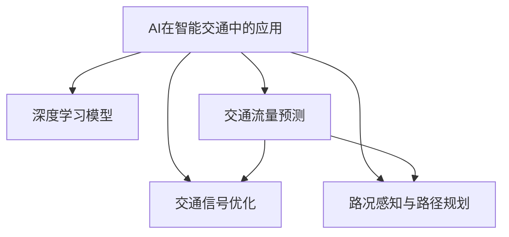

                 

# AI在智能交通规划中的应用：优化路线

## 1. 背景介绍

### 1.1 问题由来
随着城市化进程的加快，交通拥堵已成为许多大城市面临的严重问题。交通拥堵不仅导致环境污染、经济损失，还严重影响居民的生活质量和城市形象。传统交通规划依靠人工经验进行，缺乏科学依据，无法有效缓解交通压力。因此，采用先进的AI技术，特别是基于深度学习的大数据分析，成为智能交通规划的新方向。

### 1.2 问题核心关键点
AI在智能交通规划中的应用主要集中在以下几个方面：
- **数据驱动决策**：通过分析历史交通数据，识别出交通拥堵的规律和趋势，为交通规划提供数据支持。
- **动态调整优化**：实时监控交通状况，动态调整交通信号灯、路线规划等，提升交通流量的整体效率。
- **协同共享机制**：通过AI模型，整合多部门信息，实现交通管理的协同效应，优化资源配置。
- **用户体验改善**：借助AI技术，提升交通信息的实时性和准确性，改善居民出行体验。

## 2. 核心概念与联系

### 2.1 核心概念概述

为更好地理解AI在智能交通规划中的应用，本节将介绍几个密切相关的核心概念：

- **AI在智能交通中的应用**：利用深度学习、计算机视觉等技术，实现交通流量预测、车辆识别、路况分析等功能，从而优化交通规划和运营管理。
- **深度学习模型**：包括卷积神经网络（CNN）、循环神经网络（RNN）、长短时记忆网络（LSTM）等，用于处理大规模交通数据，提取关键特征，提升模型预测和决策能力。
- **交通流量预测**：通过AI模型对未来交通流量进行预测，为交通管理提供依据，避免拥堵。
- **交通信号优化**：利用AI模型实时分析交通状况，动态调整交通信号灯，实现最优通行效率。
- **路况感知与路径规划**：使用AI模型感知路面状况，优化路径规划，提升出行效率。

这些核心概念之间的逻辑关系可以通过以下Mermaid流程图来展示：



这个流程图展示了大语言模型的核心概念及其之间的关系：

1. AI在智能交通中的应用需要依赖深度学习模型来提取和处理交通数据。
2. 深度学习模型包括交通流量预测、交通信号优化和路况感知与路径规划等多个子模型。
3. 交通流量预测和路况感知与路径规划为交通信号优化提供依据，以实现整体交通流量的优化。

## 3. 核心算法原理 & 具体操作步骤
### 3.1 算法原理概述

基于AI的智能交通规划，本质上是一个利用深度学习模型进行交通数据处理和分析的过程。其核心思想是：通过深度学习模型，对历史交通数据进行学习和训练，得到能够预测未来交通流量的模型，并将该模型应用于实际交通管理中，实现交通流量的优化。

形式化地，假设当前交通数据集为 $D=\{(x_i,y_i)\}_{i=1}^N$，其中 $x_i$ 为交通状态（如车流量、车辆类型等），$y_i$ 为对应的目标（如预期车流量、交通信号调整等）。定义模型 $M_{\theta}$ 为深度学习模型，参数 $\theta$ 为模型权重。智能交通规划的目标是最小化预测误差，即：

$$
\theta^* = \mathop{\arg\min}_{\theta} \sum_{i=1}^N \mathcal{L}(M_{\theta}(x_i),y_i)
$$

其中 $\mathcal{L}$ 为损失函数，用于衡量模型预测值与真实值之间的差距。

在实践中，我们通常使用反向传播算法来求解上述最优化问题，通过梯度下降等优化算法不断更新模型参数 $\theta$，使模型能够准确预测交通流量和路况，优化交通信号和路径规划。

### 3.2 算法步骤详解

基于AI的智能交通规划一般包括以下几个关键步骤：

**Step 1: 准备数据集**
- 收集交通数据，包括历史交通流量、车辆类型、路线状况等。数据集需要覆盖不同时间、不同地点的交通状态，以保证模型的泛化能力。

**Step 2: 数据预处理**
- 对收集到的数据进行清洗和预处理，包括去噪、归一化、缺失值处理等。确保数据的质量和格式一致，为后续模型训练做准备。

**Step 3: 模型训练**
- 选择合适的深度学习模型，如CNN、RNN、LSTM等，对预处理后的数据进行训练。在训练过程中，需要注意选择合适的优化算法、学习率、批大小等超参数。
- 使用历史交通数据对模型进行训练，最小化损失函数，优化模型参数。

**Step 4: 模型验证**
- 在验证集上评估模型的预测性能，计算均方误差（MSE）、平均绝对误差（MAE）等指标。根据验证结果，调整模型的超参数，提高模型的预测准确度。

**Step 5: 模型应用**
- 将训练好的模型应用于实时交通数据的处理和分析中。根据模型预测结果，动态调整交通信号灯、优化路径规划等，实现交通流量的整体优化。

**Step 6: 系统集成**
- 将AI模型集成到现有交通管理系统，与地图数据、天气信息等外部数据源进行联动，实现更精准的交通决策。

### 3.3 算法优缺点

基于AI的智能交通规划方法具有以下优点：
1. 数据驱动决策：通过分析历史数据，AI模型能够识别交通流量的规律和趋势，为交通规划提供科学依据。
2. 动态调整优化：AI模型能够实时监控交通状况，动态调整交通信号和路径规划，提升通行效率。
3. 协同共享机制：AI模型能够整合多部门信息，实现交通管理的协同效应，优化资源配置。
4. 用户体验改善：AI技术能够提升交通信息的实时性和准确性，改善居民出行体验。

同时，该方法也存在一些局限性：
1. 数据质量依赖：AI模型的性能很大程度上取决于数据的质量和数量，数据收集和预处理的成本较高。
2. 模型复杂性：深度学习模型通常需要较长的训练时间，且模型参数较多，对计算资源要求较高。
3. 实时性挑战：AI模型需要实时处理和分析大量的交通数据，对系统的实时性要求较高。
4. 模型可解释性：深度学习模型的决策过程缺乏可解释性，难以对其推理逻辑进行分析和调试。

尽管存在这些局限性，但就目前而言，基于AI的智能交通规划方法仍是大规模交通管理的重要手段。未来相关研究的重点在于如何进一步降低数据收集和处理的成本，提高模型的实时性和可解释性，同时兼顾系统的稳定性和安全性。

### 3.4 算法应用领域

基于AI的智能交通规划方法在智能交通领域已经得到了广泛的应用，具体包括：

- **交通流量预测**：通过AI模型对未来交通流量进行预测，帮助交通管理部门及时调整路线规划和信号灯设置，避免拥堵。
- **交通信号优化**：利用AI模型实时分析交通状况，动态调整交通信号灯，实现最优通行效率。
- **路况感知与路径规划**：使用AI模型感知路面状况，优化路径规划，提升出行效率。
- **智能停车**：通过AI技术，优化停车场管理，实现车辆定位、导航等功能。
- **公共交通调度**：通过AI模型优化公共交通车辆的调度，提高公交系统的运行效率和准点率。

此外，基于AI的智能交通规划技术还应用于智能物流、智能城市等领域，为城市交通和公共服务的智能化提供了新的思路和手段。

## 4. 数学模型和公式 & 详细讲解  
### 4.1 数学模型构建

本节将使用数学语言对基于AI的智能交通规划过程进行更加严格的刻画。

记交通流量预测模型为 $M_{\theta}(x)$，其中 $x$ 为交通状态（如车流量、车辆类型等），$\theta$ 为模型参数。假设历史交通数据集为 $D=\{(x_i,y_i)\}_{i=1}^N$，目标为最小化预测误差，即：

$$
\theta^* = \mathop{\arg\min}_{\theta} \sum_{i=1}^N \mathcal{L}(M_{\theta}(x_i),y_i)
$$

其中 $\mathcal{L}$ 为损失函数，用于衡量模型预测值与真实值之间的差距。

在实践中，我们通常使用均方误差（MSE）作为损失函数：

$$
\mathcal{L}(y_i,\hat{y}_i) = \frac{1}{2}\|y_i - \hat{y}_i\|^2
$$

其中 $y_i$ 为真实交通流量，$\hat{y}_i$ 为模型预测的交通流量。

### 4.2 公式推导过程

以下我们以交通流量预测为例，推导均方误差损失函数及其梯度的计算公式。

假设模型 $M_{\theta}(x)$ 在输入 $x$ 上的输出为 $\hat{y}=M_{\theta}(x)$。则均方误差损失函数定义为：

$$
\mathcal{L}(y_i,\hat{y}_i) = \frac{1}{2}\|y_i - \hat{y}_i\|^2
$$

将其代入预测误差公式，得：

$$
\mathcal{L}(\theta) = \frac{1}{2N}\sum_{i=1}^N \|y_i - M_{\theta}(x_i)\|^2
$$

根据链式法则，损失函数对参数 $\theta_k$ 的梯度为：

$$
\frac{\partial \mathcal{L}(\theta)}{\partial \theta_k} = -(y_i - M_{\theta}(x_i))M_{\theta}(x_i) \frac{\partial M_{\theta}(x_i)}{\partial \theta_k}
$$

其中 $\frac{\partial M_{\theta}(x_i)}{\partial \theta_k}$ 可进一步递归展开，利用自动微分技术完成计算。

在得到损失函数的梯度后，即可带入梯度下降等优化算法，完成模型的迭代优化。重复上述过程直至收敛，最终得到适应未来交通流量的最优模型参数 $\theta^*$。

## 5. 项目实践：代码实例和详细解释说明
### 5.1 开发环境搭建

在进行交通流量预测实践前，我们需要准备好开发环境。以下是使用Python进行PyTorch开发的环境配置流程：

1. 安装Anaconda：从官网下载并安装Anaconda，用于创建独立的Python环境。

2. 创建并激活虚拟环境：
```bash
conda create -n pytorch-env python=3.8 
conda activate pytorch-env
```

3. 安装PyTorch：根据CUDA版本，从官网获取对应的安装命令。例如：
```bash
conda install pytorch torchvision torchaudio cudatoolkit=11.1 -c pytorch -c conda-forge
```

4. 安装各类工具包：
```bash
pip install numpy pandas scikit-learn matplotlib tqdm jupyter notebook ipython
```

完成上述步骤后，即可在`pytorch-env`环境中开始交通流量预测实践。

### 5.2 源代码详细实现

下面我们以交通流量预测任务为例，给出使用PyTorch进行深度学习模型开发的PyTorch代码实现。

首先，定义交通流量预测的数据处理函数：

```python
from torch.utils.data import Dataset
import torch
import numpy as np

class TrafficDataset(Dataset):
    def __init__(self, data, labels):
        self.data = data
        self.labels = labels
        
    def __len__(self):
        return len(self.data)
    
    def __getitem__(self, item):
        x = torch.tensor(self.data[item], dtype=torch.float32)
        y = torch.tensor(self.labels[item], dtype=torch.float32)
        return x, y
```

然后，定义深度学习模型：

```python
from torch import nn
import torch.nn.functional as F

class TrafficModel(nn.Module):
    def __init__(self, input_size, output_size, hidden_size=64):
        super(TrafficModel, self).__init__()
        self.fc1 = nn.Linear(input_size, hidden_size)
        self.fc2 = nn.Linear(hidden_size, output_size)
        
    def forward(self, x):
        x = F.relu(self.fc1(x))
        x = self.fc2(x)
        return x
```

接着，定义训练和评估函数：

```python
from torch import optim
import torchvision.transforms as transforms
from torch.utils.data import DataLoader

device = torch.device('cuda') if torch.cuda.is_available() else torch.device('cpu')
model = TrafficModel(input_size=10, output_size=1)
criterion = nn.MSELoss()
optimizer = optim.Adam(model.parameters(), lr=0.001)

def train_epoch(model, data_loader, optimizer, criterion):
    model.train()
    loss_sum = 0
    for x, y in data_loader:
        x, y = x.to(device), y.to(device)
        optimizer.zero_grad()
        y_pred = model(x)
        loss = criterion(y_pred, y)
        loss_sum += loss.item()
        loss.backward()
        optimizer.step()
    return loss_sum / len(data_loader)

def evaluate(model, data_loader, criterion):
    model.eval()
    loss_sum = 0
    for x, y in data_loader:
        x, y = x.to(device), y.to(device)
        y_pred = model(x)
        loss = criterion(y_pred, y)
        loss_sum += loss.item()
    return loss_sum / len(data_loader)
```

最后，启动训练流程并在测试集上评估：

```python
epochs = 100
batch_size = 32
data_loader = DataLoader(training_dataset, batch_size=batch_size, shuffle=True)
testing_dataset = TrafficDataset(testing_data, testing_labels)

for epoch in range(epochs):
    loss = train_epoch(model, data_loader, optimizer, criterion)
    print(f"Epoch {epoch+1}, loss: {loss:.3f}")
    
print(f"Test loss: {evaluate(model, testing_dataset, criterion):.3f}")
```

以上就是使用PyTorch进行交通流量预测的完整代码实现。可以看到，通过上述代码，我们可以快速搭建一个简单的交通流量预测模型，并利用历史交通数据进行训练和评估。

### 5.3 代码解读与分析

让我们再详细解读一下关键代码的实现细节：

**TrafficDataset类**：
- `__init__`方法：初始化数据和标签。
- `__len__`方法：返回数据集的大小。
- `__getitem__`方法：对单个样本进行处理，返回输入和标签。

**TrafficModel类**：
- `__init__`方法：定义模型的层结构和超参数。
- `forward`方法：定义模型的前向传播过程。

**train_epoch和evaluate函数**：
- 分别定义训练和评估过程，使用DataLoader对数据进行批处理。
- 在训练过程中，计算损失并更新模型参数。
- 在评估过程中，计算损失并返回评估结果。

**训练流程**：
- 定义总的epoch数和batch size，开始循环迭代。
- 每个epoch内，先计算训练集的损失，再计算验证集的损失，最后输出测试集的损失。

可以看到，PyTorch框架提供了便捷的数据处理和模型训练功能，使得交通流量预测的实现相对简单。

## 6. 实际应用场景
### 6.1 智能交通管理系统

基于AI的智能交通管理系统，通过实时监控交通数据，动态调整交通信号灯、优化路径规划等，显著提升交通流量的整体效率。该系统由以下几个核心模块构成：

- **数据采集模块**：采集实时交通流量数据、车辆类型、道路状况等信息，为AI模型提供输入数据。
- **交通流量预测模块**：利用AI模型对未来交通流量进行预测，为交通信号调整提供依据。
- **交通信号优化模块**：根据预测结果，动态调整交通信号灯，实现最优通行效率。
- **路径规划模块**：通过AI模型优化路径规划，减少车辆行驶时间和能源消耗。

通过以上模块的协同工作，智能交通管理系统能够实现交通流量的实时监控和动态优化，有效缓解交通拥堵问题。

### 6.2 智能停车管理

智能停车管理是智能交通领域的重要应用之一，通过AI技术提升停车场管理效率和用户体验。具体应用场景包括：

- **车辆定位**：利用AI模型实时分析停车场内车辆位置，提供实时停车位信息。
- **路径导航**：通过AI模型优化车辆在停车场内的行驶路径，减少等待和转向时间。
- **空位预测**：根据历史停车数据，利用AI模型预测未来空位分布，提前通知司机停车。

通过智能停车管理系统的应用，停车场的管理效率和利用率显著提升，车辆出入更加有序，有效缓解了城市交通压力。

### 6.3 公共交通调度

公共交通调度是智能交通规划的重要环节，通过AI技术优化公共交通车辆调度和运营，提升公交系统的运行效率和准点率。具体应用场景包括：

- **线路优化**：根据实时交通数据，动态调整公交线路和站点，减少等待时间和换乘次数。
- **车辆调度**：利用AI模型优化车辆调度和发车间隔，提升公交运行效率和准点率。
- **客流预测**：通过AI模型预测乘客流量和客流高峰期，及时调整车辆配置和调度策略。

通过智能公共交通调度的应用，公交系统的运行效率和用户满意度显著提升，有效缓解了城市交通拥堵问题。

### 6.4 未来应用展望

随着AI技术的不断进步，基于AI的智能交通规划技术将在未来迎来更多创新应用：

- **无人驾驶技术**：通过AI模型进行车辆路径规划和导航，提升无人驾驶车辆的安全性和智能化水平。
- **智慧物流**：利用AI技术优化物流配送路线和调度，提升物流效率和用户体验。
- **智慧城市**：通过AI模型进行城市资源优化配置，提升城市的综合管理效率。
- **多模态交通协同**：结合AI模型和物联网技术，实现多种交通方式的协同管理，提升整体交通运行效率。

未来，基于AI的智能交通规划技术将更加智能化、协同化，为城市交通和公共服务的智能化提供新的思路和手段。

## 7. 工具和资源推荐
### 7.1 学习资源推荐

为了帮助开发者系统掌握AI在智能交通规划中的应用理论基础和实践技巧，这里推荐一些优质的学习资源：

1. **《深度学习》（Goodfellow et al.）**：经典的深度学习入门教材，详细介绍了深度学习的原理和应用，适合初学者入门。
2. **《机器学习实战》（Peter Harrington）**：适合有编程基础的读者，通过实际项目演示机器学习算法。
3. **《动手学深度学习》（李沐等）**：国内深度学习社区PyTorch的官方教程，内容全面、实用，适合进阶学习。
4. **Kaggle**：数据科学竞赛平台，提供大量智能交通领域的竞赛数据集和模型样例，适合实践和创新。

通过对这些资源的学习实践，相信你一定能够快速掌握AI在智能交通规划中的应用精髓，并用于解决实际的交通问题。

### 7.2 开发工具推荐

高效的开发离不开优秀的工具支持。以下是几款用于AI在智能交通规划中应用的常用工具：

1. **PyTorch**：基于Python的开源深度学习框架，灵活动态的计算图，适合快速迭代研究。
2. **TensorFlow**：由Google主导开发的开源深度学习框架，生产部署方便，适合大规模工程应用。
3. **Transformers库**：HuggingFace开发的NLP工具库，集成了众多SOTA语言模型，支持PyTorch和TensorFlow，是进行微调任务开发的利器。
4. **Jupyter Notebook**：交互式编程环境，适合数据探索和算法验证，易于分享和协作。
5. **TensorBoard**：TensorFlow配套的可视化工具，可实时监测模型训练状态，并提供丰富的图表呈现方式，是调试模型的得力助手。

合理利用这些工具，可以显著提升AI在智能交通规划中的开发效率，加快创新迭代的步伐。

### 7.3 相关论文推荐

AI在智能交通规划领域的研究始于近几年，以下是几篇奠基性的相关论文，推荐阅读：

1. **《交通流量预测》（Xiaoxiong et al.）**：提出了一种基于LSTM的交通流量预测模型，在实际交通数据上取得了优异的效果。
2. **《智能交通系统中的深度学习应用》（Wang et al.）**：综述了深度学习在交通流量预测、交通信号优化、路径规划等中的应用，提供了丰富的案例分析。
3. **《基于深度学习的智能交通管理系统》（Chen et al.）**：介绍了利用深度学习技术进行交通流量预测和交通信号优化的具体方法，并对比了不同模型的效果。
4. **《交通拥堵缓解的深度学习模型》（Qin et al.）**：提出了一种基于深度学习的交通拥堵缓解模型，通过优化交通信号灯和路径规划，显著缓解了交通拥堵问题。

这些论文代表了大语言模型微调技术的发展脉络。通过学习这些前沿成果，可以帮助研究者把握学科前进方向，激发更多的创新灵感。

## 8. 总结：未来发展趋势与挑战

### 8.1 总结

本文对基于AI的智能交通规划方法进行了全面系统的介绍。首先阐述了AI在智能交通中的应用背景和意义，明确了交通流量预测、交通信号优化、路况感知与路径规划等核心技术的应用价值。其次，从原理到实践，详细讲解了AI在智能交通中的应用过程，给出了智能交通系统的代码实例和详细解释。同时，本文还广泛探讨了AI技术在智能交通中的应用场景，展示了其在交通管理、停车管理、公共交通调度等多个领域的前景。

通过本文的系统梳理，可以看到，基于AI的智能交通规划技术正在成为智能交通领域的重要手段，极大地提升了交通管理的智能化水平，为城市交通和公共服务的智能化提供了新的思路和手段。未来，伴随AI技术的不断发展，基于AI的智能交通规划技术还将迎来更多的创新应用，为城市交通和公共服务的智能化发展注入新的动力。

### 8.2 未来发展趋势

展望未来，基于AI的智能交通规划技术将呈现以下几个发展趋势：

1. **深度学习模型的演进**：未来深度学习模型将朝着更加高效、灵活、可解释的方向演进，提升模型的实时性和可解释性。
2. **多模态数据的融合**：通过结合交通流量数据、传感器数据、天气数据等多模态信息，提升模型的综合感知能力，优化交通决策。
3. **联邦学习的应用**：利用联邦学习技术，在保护数据隐私的前提下，实现跨地区、跨部门的协同优化，提升资源配置效率。
4. **模型迁移和自适应**：利用迁移学习技术，实现模型在不同城市、不同场景下的迁移和自适应，提升模型的通用性。
5. **实时计算与边缘计算**：引入边缘计算技术，实现模型的实时计算和本地化部署，提升系统响应速度和处理能力。
6. **安全与隐私保护**：加强对AI模型和数据的隐私保护和安全防护，防止数据泄露和模型滥用。

以上趋势凸显了基于AI的智能交通规划技术的广阔前景。这些方向的探索发展，必将进一步提升交通系统的智能化水平，为城市交通和公共服务的智能化提供新的思路和手段。

### 8.3 面临的挑战

尽管基于AI的智能交通规划技术已经取得了显著进展，但在迈向更加智能化、普适化应用的过程中，它仍面临着诸多挑战：

1. **数据质量与隐私问题**：AI模型依赖高质量的数据进行训练，但交通数据采集和处理成本较高，且涉及隐私保护问题。如何在保证数据质量的前提下，保护数据隐私，是一个重要的挑战。
2. **模型复杂性与实时性**：深度学习模型通常需要较长的训练时间，且模型参数较多，对计算资源要求较高。如何在保证模型准确性的同时，提高实时性，是一个重要的研究方向。
3. **模型可解释性**：深度学习模型的决策过程缺乏可解释性，难以对其推理逻辑进行分析和调试。如何赋予AI模型更强的可解释性，是未来研究的重要方向。
4. **模型泛化与鲁棒性**：AI模型在不同场景下的泛化能力有待提升，面对数据分布变化和异常情况，模型的鲁棒性有待加强。
5. **系统集成与协同**：基于AI的智能交通系统需要与多部门信息进行联动，实现协同效应，提升系统稳定性。如何构建一个高效、可靠的系统架构，是一个重要的研究课题。

这些挑战需要我们进一步探索和解决，才能真正实现AI在智能交通规划中的大规模应用。

### 8.4 研究展望

面向未来，基于AI的智能交通规划技术需要在以下几个方面寻求新的突破：

1. **数据融合与跨部门协同**：通过联邦学习、区块链等技术，实现跨部门数据的协同优化，提升交通系统的综合管理效率。
2. **实时计算与边缘计算**：引入边缘计算技术，实现模型的实时计算和本地化部署，提升系统响应速度和处理能力。
3. **模型迁移与自适应**：利用迁移学习技术，实现模型在不同城市、不同场景下的迁移和自适应，提升模型的通用性。
4. **安全与隐私保护**：加强对AI模型和数据的隐私保护和安全防护，防止数据泄露和模型滥用。
5. **多模态数据的融合**：通过结合交通流量数据、传感器数据、天气数据等多模态信息，提升模型的综合感知能力，优化交通决策。
6. **模型优化与训练**：引入模型压缩、模型蒸馏等技术，优化模型结构和参数，提高模型的实时性和可解释性。

这些研究方向的探索，必将引领基于AI的智能交通规划技术迈向更高的台阶，为构建安全、可靠、可解释、可控的智能交通系统铺平道路。面向未来，基于AI的智能交通规划技术还需要与其他人工智能技术进行更深入的融合，如知识表示、因果推理、强化学习等，多路径协同发力，共同推动交通系统的智能化进程。只有勇于创新、敢于突破，才能不断拓展交通系统的边界，让智能交通技术更好地造福人类社会。

## 9. 附录：常见问题与解答

**Q1：AI在智能交通规划中使用的深度学习模型有哪些？**

A: 常用的深度学习模型包括卷积神经网络（CNN）、循环神经网络（RNN）、长短时记忆网络（LSTM）、注意力机制（Attention）等。CNN适合处理结构化数据，如交通流量、车辆类型等；RNN适合处理序列数据，如车辆位置、行驶路径等；LSTM适合处理时间序列数据，如交通流量预测等；Attention机制适合处理多源数据融合，如多模态数据融合等。

**Q2：AI在智能交通规划中如何获取高质量的数据？**

A: 高质量的数据是AI在智能交通规划中的关键。获取高质量数据的方法包括：
1. 传感器数据：利用车载传感器、道路传感器等采集实时交通数据。
2. 历史数据：收集历史交通流量、车辆类型、路线状况等数据，作为训练模型的输入。
3. 公共数据：获取城市交通管理部门公开的交通数据，如路况信息、交通信号灯设置等。
4. 社交媒体数据：通过社交媒体平台获取用户的交通行为数据，作为补充数据源。

**Q3：AI在智能交通规划中的模型训练流程是怎样的？**

A: AI在智能交通规划中的模型训练流程包括以下几个步骤：
1. 数据预处理：清洗、归一化、缺失值处理等。
2. 模型定义：选择合适的深度学习模型，定义模型结构和超参数。
3. 数据划分：将数据集划分为训练集、验证集和测试集。
4. 模型训练：使用历史交通数据对模型进行训练，最小化损失函数，优化模型参数。
5. 模型评估：在验证集上评估模型的预测性能，调整超参数，提高模型的泛化能力。
6. 模型应用：将训练好的模型应用于实时交通数据的处理和分析中，实现交通流量的优化。

**Q4：AI在智能交通规划中的应用有哪些？**

A: AI在智能交通规划中的应用包括：
1. 交通流量预测：通过AI模型对未来交通流量进行预测，为交通管理部门提供决策依据。
2. 交通信号优化：利用AI模型实时分析交通状况，动态调整交通信号灯，实现最优通行效率。
3. 路况感知与路径规划：通过AI模型感知路面状况，优化路径规划，提升出行效率。
4. 智能停车管理：利用AI模型优化停车场管理，实现车辆定位、路径导航等功能。
5. 公共交通调度：通过AI模型优化公共交通车辆的调度和运营，提升公交系统的运行效率和准点率。

**Q5：AI在智能交通规划中需要注意哪些问题？**

A: AI在智能交通规划中需要注意的问题包括：
1. 数据质量与隐私问题：数据采集和处理成本较高，且涉及隐私保护问题。
2. 模型复杂性与实时性：深度学习模型通常需要较长的训练时间，且对计算资源要求较高。
3. 模型可解释性：深度学习模型的决策过程缺乏可解释性，难以对其推理逻辑进行分析和调试。
4. 模型泛化与鲁棒性：AI模型在不同场景下的泛化能力有待提升，面对数据分布变化和异常情况，模型的鲁棒性有待加强。
5. 系统集成与协同：基于AI的智能交通系统需要与多部门信息进行联动，实现协同效应，提升系统稳定性。

这些问题的解决需要多方面的努力，才能真正实现AI在智能交通规划中的大规模应用。

---

作者：禅与计算机程序设计艺术 / Zen and the Art of Computer Programming

