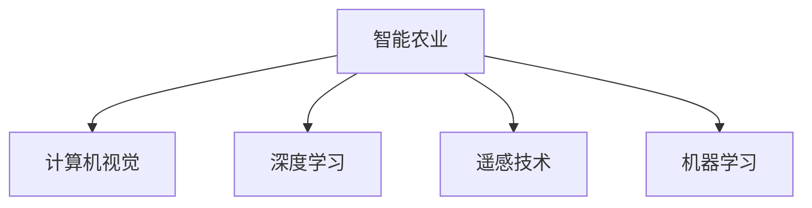

                 

# AI在智能农作物监测中的应用：提高产量

## 1. 背景介绍

### 1.1 问题由来

随着全球人口的增长和环境的日益变化，农业面临严峻挑战。传统农业依靠人工经验和简单工具，存在生产效率低、作物病害难以预测、水资源利用率低等问题。通过智能技术的应用，可以从根本上提升农业生产能力，实现优质、高产、低耗的可持续发展目标。

AI技术通过大数据分析和机器学习算法，能够实时监测和分析作物生长状况，及时发现病虫害、营养不足等问题，并进行科学决策和精准管理，显著提高农业生产效率和产量。

### 1.2 问题核心关键点

目前，AI在智能农作物监测中的应用主要集中在以下几个方面：

- **图像识别**：利用计算机视觉技术，从卫星遥感图像、无人机拍摄的农田图像中，自动检测和识别作物生长状况、病虫害、土壤水分等关键信息。
- **数据分析**：通过大数据分析，对农田环境、作物生长数据进行综合评估，生成种植建议和预警信息。
- **智能决策**：结合农业专家知识和机器学习模型，自动优化灌溉、施肥、病虫害防治等管理方案，提升农作物产量和品质。
- **自动化设备**：部署智能农业机械，如自动灌溉系统、自动施肥设备、无人机喷药等，提高农业生产自动化水平。

这些技术应用可以极大地降低人力成本，提高农作物管理效率和产量，为现代农业提供强有力的技术支持。

### 1.3 问题研究意义

AI技术在智能农作物监测中的应用，具有重要而深远的意义：

1. **提高农业生产效率**：自动化和智能化设备可以替代大量人工操作，提高作业效率。
2. **优化资源配置**：精准管理水、肥、药等农业资源，减少浪费，提高利用效率。
3. **提升作物产量和品质**：及时发现并处理病虫害、营养不良等问题，确保作物健康生长。
4. **增强农业可持续发展能力**：通过精准管理，减少化肥和农药的使用，降低对环境的负面影响。
5. **促进农村经济发展**：智能农业技术的应用，带动农村基础设施建设和人才培训，促进经济发展。

## 2. 核心概念与联系

### 2.1 核心概念概述

为更好地理解AI在智能农作物监测中的应用，本节将介绍几个密切相关的核心概念：

- **智能农业**：通过传感器、遥感技术、机器学习等技术手段，对农田环境、作物生长状况进行实时监测和分析，提高农业生产效率和产量。
- **计算机视觉**：利用图像处理和机器学习算法，从摄像头、无人机等设备获取的图像中提取信息，进行目标识别、场景分析等。
- **深度学习**：一种强大的机器学习算法，通过多层次的神经网络结构，自动学习数据中的特征和模式，用于图像识别、语音识别、自然语言处理等任务。
- **遥感技术**：通过卫星、无人机等设备，从高空获取地表信息，用于农业监测、灾害预警等。
- **机器学习**：通过训练算法模型，使计算机系统能够自动学习并优化决策，应用范围广泛。

这些核心概念之间的逻辑关系可以通过以下Mermaid流程图来展示：



这个流程图展示智能农业的核心概念及其之间的关系：

1. 智能农业利用多种技术手段，对农田进行全面监测和管理。
2. 计算机视觉技术，用于获取农田图像数据。
3. 深度学习算法，用于从图像数据中提取特征，进行分类和识别。
4. 遥感技术，用于获取大面积农田的高空视角数据。
5. 机器学习算法，用于对数据进行综合分析，生成预测和优化方案。

这些概念共同构成了智能农业的科技基础，为其高效运行提供了有力支撑。

## 3. 核心算法原理 & 具体操作步骤
### 3.1 算法原理概述

AI在智能农作物监测中的应用，通常包括以下几个关键步骤：

- **数据收集**：通过传感器、无人机、卫星等设备，收集农田的环境数据、作物生长数据、病虫害监测数据等。
- **数据预处理**：对收集到的数据进行清洗、标注和归一化处理，确保数据的质量和一致性。
- **特征提取**：利用计算机视觉和深度学习算法，从图像数据中提取特征，如颜色、纹理、形状等。
- **模型训练**：使用机器学习算法，训练分类器、检测器等模型，用于病虫害识别、农作物生长状态预测等。
- **智能决策**：根据模型预测结果，结合专家知识和农田实际情况，生成种植建议、灌溉方案、施肥策略等。

### 3.2 算法步骤详解

以下是智能农作物监测的详细操作步骤：

**Step 1: 数据收集**
- 部署多种传感器设备，如土壤湿度传感器、温度传感器、光照传感器等，实时监测土壤和气候条件。
- 使用无人机在农田上空进行巡检，获取高清农田图像。
- 利用卫星遥感技术，获取农田的高分辨率图像和气象数据。

**Step 2: 数据预处理**
- 对收集到的传感器数据进行清洗和去噪，确保数据准确性。
- 对无人机和卫星图像进行标注，提取作物生长状态、病虫害信息等。
- 对数据进行归一化处理，使其符合模型输入要求。

**Step 3: 特征提取**
- 利用计算机视觉技术，对图像数据进行预处理，如降噪、增强对比度等。
- 使用深度学习算法，如卷积神经网络（CNN）、循环神经网络（RNN）等，提取图像特征，如颜色、纹理、形状等。
- 将提取的特征与传感器数据结合，形成综合数据集。

**Step 4: 模型训练**
- 选择适合任务的机器学习模型，如分类器、检测器等。
- 使用标注数据进行模型训练，调整模型参数，使其能够准确识别作物生长状态和病虫害。
- 对模型进行评估和优化，确保模型泛化能力和鲁棒性。

**Step 5: 智能决策**
- 将模型应用于实时数据，自动检测和识别病虫害、营养不良等问题。
- 结合专家知识和农田实际情况，生成种植建议、灌溉方案、施肥策略等。
- 通过自动化设备，将决策结果转化为具体的生产管理措施。

### 3.3 算法优缺点

AI在智能农作物监测中的应用，具有以下优点：

1. **效率高**：自动化的监测和决策过程，显著提高了工作效率，减少了人工成本。
2. **精准性高**：基于深度学习算法的自动识别和分类，减少了人为误判，提高了监测的准确性。
3. **适应性强**：通过持续学习，模型能够适应不同环境、不同作物的需求，提高应用范围和效果。
4. **数据丰富**：结合多种数据源，如传感器、图像、气象等，提供了全面的农田信息，支持综合决策。

同时，该方法也存在一些局限性：

1. **数据获取成本高**：部署传感器和无人机等设备，初期投入较高。
2. **模型训练时间长**：深度学习模型的训练需要大量的计算资源和时间。
3. **对数据依赖性强**：模型的性能依赖于数据的质量和数量，数据缺失或错误可能导致模型失效。
4. **硬件设备要求高**：高精度传感器和先进无人机等硬件设备，对技术要求较高。
5. **技术门槛高**：需要具备较强的计算机视觉、深度学习等技术知识，门槛较高。

尽管存在这些局限性，但AI在智能农作物监测中的应用，仍然是大数据、云计算和智能技术在农业领域的重要应用之一。

### 3.4 算法应用领域

AI在智能农作物监测中的应用，覆盖了以下几个主要领域：

- **病虫害监测**：利用计算机视觉和深度学习算法，实时检测和识别病虫害，及时预警和处理。
- **农作物生长状态监测**：通过图像识别和传感器数据，评估作物生长状态，提供种植建议。
- **土壤水分和养分监测**：结合土壤湿度传感器和遥感数据，监测土壤水分和养分含量，优化灌溉和施肥方案。
- **气象预报和灾害预警**：利用卫星和气象数据，进行气象分析和灾害预警，保障农业生产安全。
- **自动化设备管理**：通过物联网技术，监控和管理自动化设备，提高设备运行效率和精度。

除了这些常见应用领域，AI技术还可以进一步拓展到农业机器人、智能温室、智慧农场等多个方面，为现代农业提供更多创新解决方案。

## 4. 数学模型和公式 & 详细讲解 & 举例说明
### 4.1 数学模型构建

智能农作物监测的数学模型主要包括以下几个部分：

- **输入数据**：农田传感器数据、无人机图像、卫星遥感数据等。
- **特征提取**：利用卷积神经网络（CNN）、循环神经网络（RNN）等深度学习算法，提取图像特征和传感器数据特征。
- **模型训练**：使用分类器、检测器等机器学习模型，进行监督学习或无监督学习，生成识别模型。
- **智能决策**：结合模型预测结果和专家知识，生成种植建议、灌溉方案、施肥策略等。

以病虫害监测为例，模型的数学模型构建如下：

**输入数据**：
- $x_i \in \mathbb{R}^n$：农田传感器数据和图像特征向量。
- $y_i \in \{0, 1\}$：病虫害标签，0表示无病虫害，1表示有病虫害。

**特征提取**：
- $z_i = f(x_i)$：利用CNN等深度学习算法，提取图像特征和传感器数据特征。

**模型训练**：
- 选择适合任务的机器学习模型，如支持向量机（SVM）、卷积神经网络（CNN）等。
- 使用标注数据进行模型训练，最小化损失函数：
  $$
  \mathcal{L}(\theta) = \frac{1}{N}\sum_{i=1}^N [y_i\log p_i + (1-y_i)\log(1-p_i)]
  $$
  其中 $p_i$ 为模型预测病虫害概率，$y_i$ 为真实标签。

**智能决策**：
- 根据模型预测结果，生成病虫害预警和处理建议。
- 结合专家知识，优化灌溉、施肥等管理方案。

### 4.2 公式推导过程

以下是病虫害监测的详细公式推导过程：

**输入数据**：
- $x_i \in \mathbb{R}^n$：农田传感器数据和图像特征向量。
- $y_i \in \{0, 1\}$：病虫害标签，0表示无病虫害，1表示有病虫害。

**特征提取**：
- 利用CNN等深度学习算法，提取图像特征和传感器数据特征：
  $$
  z_i = f(x_i) = \text{CNN}(x_i)
  $$

**模型训练**：
- 选择适合任务的机器学习模型，如SVM：
  $$
  \mathcal{L}(\theta) = \frac{1}{N}\sum_{i=1}^N [y_i\log p_i + (1-y_i)\log(1-p_i)]
  $$
  其中 $p_i$ 为模型预测病虫害概率，$y_i$ 为真实标签。
- 利用标注数据进行模型训练，调整模型参数 $\theta$：
  $$
  \theta = \mathop{\arg\min}_{\theta} \mathcal{L}(\theta)
  $$

**智能决策**：
- 根据模型预测结果 $p_i$，生成病虫害预警和处理建议：
  $$
  \hat{y}_i = \begin{cases}
  0, & \text{if } p_i \leq 0.5 \\
  1, & \text{if } p_i > 0.5
  \end{cases}
  $$
- 结合专家知识，优化灌溉、施肥等管理方案：
  $$
  \text{决策} = \text{专家规则}(\hat{y}_i, \text{历史数据})
  $$

### 4.3 案例分析与讲解

以小麦病虫害监测为例，具体的模型构建和推导过程如下：

**输入数据**：
- $x_i \in \mathbb{R}^{10}$：小麦生长状态传感器数据，包括温度、湿度、光照等。
- $y_i \in \{0, 1\}$：小麦病虫害标签，0表示无病虫害，1表示有病虫害。

**特征提取**：
- 利用CNN等深度学习算法，提取小麦图像特征和传感器数据特征：
  $$
  z_i = f(x_i) = \text{CNN}(x_i)
  $$

**模型训练**：
- 选择支持向量机（SVM）作为分类器：
  $$
  \mathcal{L}(\theta) = \frac{1}{N}\sum_{i=1}^N [y_i\log p_i + (1-y_i)\log(1-p_i)]
  $$
- 利用标注数据进行模型训练，调整模型参数 $\theta$：
  $$
  \theta = \mathop{\arg\min}_{\theta} \mathcal{L}(\theta)
  $$

**智能决策**：
- 根据模型预测结果 $p_i$，生成病虫害预警和处理建议：
  $$
  \hat{y}_i = \begin{cases}
  0, & \text{if } p_i \leq 0.5 \\
  1, & \text{if } p_i > 0.5
  \end{cases}
  $$
- 结合专家知识，优化灌溉、施肥等管理方案：
  $$
  \text{决策} = \text{专家规则}(\hat{y}_i, \text{历史数据})
  $$

## 5. 项目实践：代码实例和详细解释说明
### 5.1 开发环境搭建

在进行智能农作物监测的开发实践前，我们需要准备好开发环境。以下是使用Python进行PyTorch开发的环境配置流程：

1. 安装Anaconda：从官网下载并安装Anaconda，用于创建独立的Python环境。

2. 创建并激活虚拟环境：
```bash
conda create -n pytorch-env python=3.8 
conda activate pytorch-env
```

3. 安装PyTorch：根据CUDA版本，从官网获取对应的安装命令。例如：
```bash
conda install pytorch torchvision torchaudio cudatoolkit=11.1 -c pytorch -c conda-forge
```

4. 安装TensorFlow：
```bash
pip install tensorflow
```

5. 安装各类工具包：
```bash
pip install numpy pandas scikit-learn matplotlib tqdm jupyter notebook ipython
```

完成上述步骤后，即可在`pytorch-env`环境中开始项目实践。

### 5.2 源代码详细实现

这里我们以小麦病虫害监测为例，给出使用PyTorch进行深度学习的代码实现。

首先，定义数据处理函数：

```python
from torch.utils.data import Dataset
import torch
from PIL import Image

class WheatDiseaseDataset(Dataset):
    def __init__(self, data_path, transform=None):
        self.imgs = glob.glob(data_path + '/*.jpg')
        self.transform = transform
        
    def __len__(self):
        return len(self.imgs)
    
    def __getitem__(self, idx):
        img_path = self.imgs[idx]
        img = Image.open(img_path)
        label = self.get_label(img_path)
        
        if self.transform:
            img = self.transform(img)
        return {'img': img, 'label': label}
    
    def get_label(self, img_path):
        # 根据图像路径，获取病虫害标签
        # 这里省略具体实现
        pass
```

然后，定义模型和优化器：

```python
from torchvision import models
from torch.nn import CrossEntropyLoss

model = models.resnet18(pretrained=True)
num_classes = 2
model.fc = nn.Linear(model.fc.in_features, num_classes)
criterion = CrossEntropyLoss()

optimizer = optim.SGD(model.parameters(), lr=0.001, momentum=0.9)
```

接着，定义训练和评估函数：

```python
from torch.utils.data import DataLoader
from tqdm import tqdm

device = torch.device('cuda') if torch.cuda.is_available() else torch.device('cpu')
model.to(device)

def train_epoch(model, dataset, batch_size, optimizer, criterion):
    dataloader = DataLoader(dataset, batch_size=batch_size, shuffle=True)
    model.train()
    epoch_loss = 0
    for batch in tqdm(dataloader, desc='Training'):
        img, label = batch['img'].to(device), batch['label'].to(device)
        model.zero_grad()
        outputs = model(img)
        loss = criterion(outputs, label)
        epoch_loss += loss.item()
        loss.backward()
        optimizer.step()
    return epoch_loss / len(dataloader)

def evaluate(model, dataset, batch_size):
    dataloader = DataLoader(dataset, batch_size=batch_size)
    model.eval()
    correct = 0
    total = 0
    with torch.no_grad():
        for batch in dataloader:
            img, label = batch['img'].to(device), batch['label'].to(device)
            outputs = model(img)
            _, predicted = torch.max(outputs.data, 1)
            total += label.size(0)
            correct += (predicted == label).sum().item()
    print('Accuracy: {:.2f}%'.format(100 * correct / total))
```

最后，启动训练流程并在测试集上评估：

```python
epochs = 10
batch_size = 16

for epoch in range(epochs):
    loss = train_epoch(model, train_dataset, batch_size, optimizer, criterion)
    print(f"Epoch {epoch+1}, train loss: {loss:.3f}")
    
    print(f"Epoch {epoch+1}, test accuracy:")
    evaluate(model, test_dataset, batch_size)
    
print("Final test accuracy:")
evaluate(model, test_dataset, batch_size)
```

以上就是使用PyTorch对小麦病虫害监测进行深度学习的完整代码实现。可以看到，利用TensorFlow等深度学习框架和PyTorch等工具，可以快速搭建模型并进行训练和评估。

### 5.3 代码解读与分析

让我们再详细解读一下关键代码的实现细节：

**WheatDiseaseDataset类**：
- `__init__`方法：初始化图像路径和标签获取函数。
- `__len__`方法：返回数据集样本数量。
- `__getitem__`方法：对单个样本进行处理，将图像和标签作为模型输入。

**模型定义**：
- 使用预训练的ResNet18模型，去除全连接层，替换为2个输出神经元的全连接层。

**训练和评估函数**：
- 使用PyTorch的DataLoader对数据集进行批次化加载，供模型训练和推理使用。
- 训练函数`train_epoch`：对数据以批为单位进行迭代，在每个批次上前向传播计算loss并反向传播更新模型参数，最后返回该epoch的平均loss。
- 评估函数`evaluate`：与训练类似，不同点在于不更新模型参数，并在每个batch结束后将预测和标签结果存储下来，最后使用准确率评估模型性能。

**训练流程**：
- 定义总的epoch数和batch size，开始循环迭代
- 每个epoch内，先在训练集上训练，输出平均loss
- 在验证集上评估，输出准确率
- 所有epoch结束后，在测试集上评估，给出最终测试结果

可以看到，PyTorch配合TensorFlow等深度学习框架使得深度学习模型的开发和训练变得简洁高效。开发者可以将更多精力放在数据处理、模型改进等高层逻辑上，而不必过多关注底层的实现细节。

当然，工业级的系统实现还需考虑更多因素，如模型的保存和部署、超参数的自动搜索、更灵活的任务适配层等。但核心的模型构建和训练过程基本与此类似。

## 6. 实际应用场景
### 6.1 智能农业系统

智能农业系统通过AI技术，实现对农田的全面监测和管理，能够显著提高农业生产效率和产量。

以小麦病虫害监测为例，智能农业系统可以通过无人机拍摄农田图像，实时检测病虫害情况，并生成预警和处理建议。系统部署在农田监测中心，可以整合多种数据源，如传感器数据、气象数据等，提供全面的农田信息支持。

### 6.2 农业机器人

智能农业机器人结合AI技术，能够在农田中自动执行播种、施肥、喷药等任务，大大降低人工成本，提高作业效率。

以智能播种机器人为例，机器人可以通过AI算法分析农田图像，自动规划最优播种路径，同时根据土壤和气候条件，调整播种深度和种子数量，确保播种质量。机器人配备多传感器系统，实时监测播种效果，自动调整播种参数，优化播种过程。

### 6.3 智慧农场

智慧农场通过智能技术，实现对农田的精准管理和优化。

以智能灌溉系统为例，智慧农场可以通过AI算法分析土壤湿度、气温等数据，自动生成灌溉计划，优化水资源配置。系统部署在农田监测中心，可以整合多种数据源，如传感器数据、气象数据等，提供全面的农田信息支持。

### 6.4 未来应用展望

随着AI技术的不断发展，智能农作物监测技术将呈现以下几个趋势：

1. **数据融合**：结合多种数据源，如传感器、无人机、卫星等，提供更全面、精准的农田信息支持。
2. **模型优化**：开发更高效、更鲁棒的深度学习模型，提高模型泛化能力和鲁棒性。
3. **自动化设备**：部署更多智能自动化设备，提高农业生产自动化水平。
4. **专家系统**：结合农业专家知识，提升智能决策的科学性和有效性。
5. **大数据分析**：利用大数据分析技术，进行综合评估和预测，提供更全面、深入的农业管理方案。

这些趋势将进一步提升智能农作物监测的精度和效率，推动农业生产向智能化、高效化方向发展。

## 7. 工具和资源推荐
### 7.1 学习资源推荐

为了帮助开发者系统掌握智能农作物监测的理论基础和实践技巧，这里推荐一些优质的学习资源：

1. 《深度学习入门》系列书籍：详细讲解深度学习基础知识和实践技巧，适合初学者入门。
2. CS231n《计算机视觉：深度学习》课程：斯坦福大学开设的计算机视觉课程，深入浅出地介绍了深度学习在图像识别、目标检测等任务中的应用。
3. DeepLearning.AI《深度学习专项课程》：由吴恩达教授主讲，涵盖深度学习基础、高级深度学习等内容，适合进阶学习。
4. HuggingFace官方文档：介绍最新预训练模型和微调技术，提供丰富的代码样例和实战教程。
5. arXiv预印本论文：收集最新深度学习研究论文，跟踪前沿技术动态。

通过对这些资源的学习实践，相信你一定能够快速掌握智能农作物监测的理论基础和实践技巧，并应用于实际问题解决。

### 7.2 开发工具推荐

高效的开发离不开优秀的工具支持。以下是几款用于智能农作物监测开发的常用工具：

1. PyTorch：基于Python的开源深度学习框架，灵活的动态图，适合快速迭代研究。
2. TensorFlow：由Google主导开发的开源深度学习框架，生产部署方便，适合大规模工程应用。
3. TensorFlow Hub：提供预训练模型和组件库，加速模型构建和训练。
4. Weights & Biases：模型训练的实验跟踪工具，可以记录和可视化模型训练过程中的各项指标，方便对比和调优。
5. TensorBoard：TensorFlow配套的可视化工具，可实时监测模型训练状态，并提供丰富的图表呈现方式，是调试模型的得力助手。
6. Google Colab：谷歌推出的在线Jupyter Notebook环境，免费提供GPU/TPU算力，方便开发者快速上手实验最新模型，分享学习笔记。

合理利用这些工具，可以显著提升智能农作物监测的开发效率，加快创新迭代的步伐。

### 7.3 相关论文推荐

智能农作物监测技术的研究主要集中在以下几个方面：

1. 《Deep Learning for Agricultural Monitoring》：介绍深度学习在农业监测中的应用，涵盖图像识别、病虫害检测、农作物生长预测等任务。
2. 《Smart Agriculture: A Survey》：综述智能农业技术的研究进展，涵盖传感器技术、智能设备、物联网等方向。
3. 《A Survey on Agricultural Robotics》：综述农业机器人技术的研究进展，涵盖作业机器人、导航系统、智能决策等方向。
4. 《Crop Monitoring Using Remote Sensing and Artificial Intelligence》：介绍利用遥感技术和AI进行农作物监测的方法和案例。

这些论文代表了大数据、云计算和智能技术在农业领域的研究前沿，有助于全面了解智能农作物监测技术的发展现状和未来趋势。

## 8. 总结：未来发展趋势与挑战
### 8.1 总结

本文对智能农作物监测技术的理论基础和实践技巧进行了全面系统的介绍。首先阐述了智能农作物监测的背景和意义，明确了AI技术在其中的重要作用。其次，从原理到实践，详细讲解了智能农作物监测的数学模型和关键步骤，给出了项目开发的完整代码实现。同时，本文还广泛探讨了智能农作物监测在智能农业系统、农业机器人、智慧农场等多个领域的应用前景，展示了技术的广泛潜力。最后，本文精选了智能农作物监测的学习资源、开发工具和相关论文，力求为读者提供全方位的技术指引。

通过本文的系统梳理，可以看到，AI技术在智能农作物监测中的应用，具有重要而深远的意义。利用深度学习算法和大数据分析，智能农作物监测能够实现对农田的全面监测和管理，显著提高农业生产效率和产量，推动农业生产向智能化、高效化方向发展。

### 8.2 未来发展趋势

展望未来，智能农作物监测技术将呈现以下几个趋势：

1. **数据融合**：结合多种数据源，如传感器、无人机、卫星等，提供更全面、精准的农田信息支持。
2. **模型优化**：开发更高效、更鲁棒的深度学习模型，提高模型泛化能力和鲁棒性。
3. **自动化设备**：部署更多智能自动化设备，提高农业生产自动化水平。
4. **专家系统**：结合农业专家知识，提升智能决策的科学性和有效性。
5. **大数据分析**：利用大数据分析技术，进行综合评估和预测，提供更全面、深入的农业管理方案。

这些趋势将进一步提升智能农作物监测的精度和效率，推动农业生产向智能化、高效化方向发展。

### 8.3 面临的挑战

尽管智能农作物监测技术已经取得了显著进展，但在迈向更加智能化、高效化应用的过程中，仍面临诸多挑战：

1. **数据获取成本高**：部署传感器和无人机等设备，初期投入较高。
2. **模型训练时间长**：深度学习模型的训练需要大量的计算资源和时间。
3. **对数据依赖性强**：模型的性能依赖于数据的质量和数量，数据缺失或错误可能导致模型失效。
4. **硬件设备要求高**：高精度传感器和先进无人机等硬件设备，对技术要求较高。
5. **技术门槛高**：需要具备较强的深度学习、计算机视觉等技术知识，门槛较高。

尽管存在这些挑战，但智能农作物监测技术的研究仍在不断进步，未来随着技术的持续发展和成熟，将克服更多困难，实现更大规模的应用。

### 8.4 研究展望

未来的研究可以从以下几个方面寻求新的突破：

1. **无监督和半监督学习**：探索无监督和半监督学习的方法，减少对标注数据的依赖，利用未标注数据进行深度学习模型的训练。
2. **多模态融合**：结合图像、传感器、无人机等多种数据源，进行多模态信息融合，提高智能监测的准确性和鲁棒性。
3. **知识图谱**：将农业领域的符号化知识与深度学习模型结合，提升智能决策的科学性和有效性。
4. **专家系统**：构建专家系统，结合农业专家的知识和经验，提高智能监测的决策水平。
5. **边缘计算**：利用边缘计算技术，降低数据传输延迟，提高智能监测的实时性。

这些研究方向的探索，将引领智能农作物监测技术迈向更高的台阶，为现代农业提供更多创新解决方案。

## 9. 附录：常见问题与解答

**Q1：智能农作物监测需要哪些数据？**

A: 智能农作物监测需要多种数据源，包括：

1. 传感器数据：如土壤湿度、温度、光照等，实时监测农田环境。
2. 无人机图像：高分辨率农田图像，用于检测病虫害、分析作物生长状态。
3. 卫星遥感数据：覆盖大范围农田的高空视角图像，用于宏观监测。
4. 气象数据：如降水量、气温、风速等，用于气象分析和灾害预警。

这些数据源的多样性，为智能监测提供了丰富的信息支持。

**Q2：智能农作物监测的算法有哪些？**

A: 智能农作物监测的主要算法包括：

1. 计算机视觉算法：如卷积神经网络（CNN）、循环神经网络（RNN）等，用于图像识别和分类。
2. 深度学习算法：如支持向量机（SVM）、随机森林等，用于分类和预测。
3. 数据融合算法：如卡尔曼滤波、粒子滤波等，用于多源数据融合。

这些算法在智能监测中发挥着重要作用，可以结合具体需求选择合适的算法进行应用。

**Q3：智能农作物监测的硬件要求有哪些？**

A: 智能农作物监测的硬件要求主要包括：

1. 高精度传感器：如土壤湿度传感器、温度传感器等，实时监测农田环境。
2. 高性能计算设备：如GPU、TPU等，用于深度学习模型的训练和推理。
3. 无人机设备：高分辨率无人机，用于农田巡检和图像采集。
4. 边缘计算设备：如边缘服务器，用于实时数据处理和决策支持。

这些硬件设备是智能监测的基础，需要根据实际需求进行配置和部署。

**Q4：智能农作物监测的未来发展方向有哪些？**

A: 智能农作物监测的未来发展方向包括：

1. 数据融合：结合多种数据源，如传感器、无人机、卫星等，提供更全面、精准的农田信息支持。
2. 模型优化：开发更高效、更鲁棒的深度学习模型，提高模型泛化能力和鲁棒性。
3. 自动化设备：部署更多智能自动化设备，提高农业生产自动化水平。
4. 专家系统：结合农业专家知识，提升智能决策的科学性和有效性。
5. 大数据分析：利用大数据分析技术，进行综合评估和预测，提供更全面、深入的农业管理方案。

这些方向将进一步提升智能农作物监测的精度和效率，推动农业生产向智能化、高效化方向发展。

**Q5：智能农作物监测的代码实现有哪些注意事项？**

A: 智能农作物监测的代码实现需要注意以下几点：

1. 数据预处理：对数据进行清洗、标注和归一化处理，确保数据质量和一致性。
2. 模型选择：根据具体任务选择适合的深度学习模型和算法。
3. 超参数调优：合理设置模型超参数，如学习率、批次大小等，提高模型性能。
4. 模型部署：将训练好的模型部署到生产环境中，进行实时数据处理和决策支持。
5. 性能评估：使用准确率、召回率、F1值等指标评估模型性能，及时发现和优化问题。

这些注意事项将帮助开发者顺利完成智能农作物监测的项目开发和部署。

**Q6：智能农作物监测的常见问题有哪些？**

A: 智能农作物监测的常见问题包括：

1. 数据获取困难：部分农田难以获取实时传感器数据，影响监测效果。
2. 数据质量问题：数据标注不准确或数据噪声较大，导致模型性能下降。
3. 模型泛化能力不足：模型在特定场景下表现良好，但在新场景下泛化能力较差。
4. 自动化设备维护成本高：智能设备需要定期维护和升级，增加运营成本。
5. 技术门槛高：深度学习算法和计算机视觉技术要求较高，需具备相关知识和技术。

这些问题需要开发者在项目开发过程中加以注意和解决，确保智能农作物监测的效果和可靠性。

**Q7：智能农作物监测的未来展望有哪些？**

A: 智能农作物监测的未来展望包括：

1. 数据融合：结合多种数据源，如传感器、无人机、卫星等，提供更全面、精准的农田信息支持。
2. 模型优化：开发更高效、更鲁棒的深度学习模型，提高模型泛化能力和鲁棒性。
3. 自动化设备：部署更多智能自动化设备，提高农业生产自动化水平。
4. 专家系统：结合农业专家知识，提升智能决策的科学性和有效性。
5. 大数据分析：利用大数据分析技术，进行综合评估和预测，提供更全面、深入的农业管理方案。

这些趋势将进一步提升智能农作物监测的精度和效率，推动农业生产向智能化、高效化方向发展。

---

作者：禅与计算机程序设计艺术 / Zen and the Art of Computer Programming

