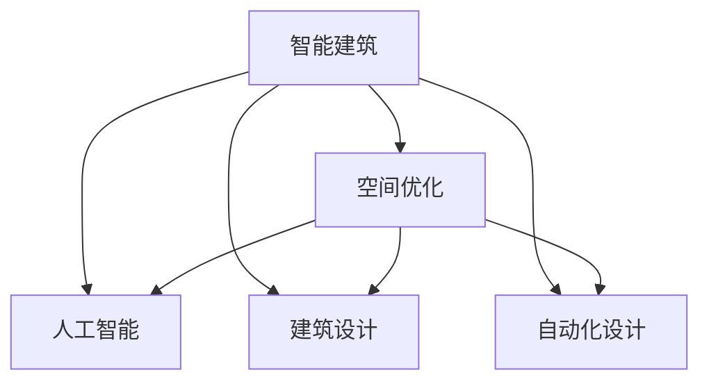

                 

# AI在智能建筑设计中的应用：优化空间利用

> 关键词：智能建筑,空间优化,人工智能,建筑设计,自动化

## 1. 背景介绍

### 1.1 问题由来

随着全球人口的不断增长和城市化的加剧，如何高效利用建筑空间以实现可持续发展，成为建筑师和工程师们面临的巨大挑战。传统的建筑设计方法通常基于经验和直觉，费时费力，且难以准确评估不同设计方案的空间利用效率。而人工智能技术的引入，为智能建筑设计提供了新的可能，通过数据驱动的方式，优化建筑空间利用，提升设计效率和质量。

### 1.2 问题核心关键点

智能建筑设计中的空间优化，主要包括以下几个关键点：

1. **空间规划**：在建筑规划阶段，通过人工智能技术评估不同布局方案的空间利用效率，选择最优方案。
2. **智能布局**：在建筑布局设计阶段，利用AI优化家具、设备和设施的布局，实现空间利用最大化。
3. **自动化设计**：通过自动化工具和算法，快速生成多方案设计，供建筑师和设计师参考。
4. **数据驱动优化**：利用大量建筑数据和模拟实验结果，指导设计过程，实现精准优化。
5. **可视化展示**：将优化后的设计方案进行可视化展示，帮助用户直观理解空间利用情况。

### 1.3 问题研究意义

智能建筑设计中引入空间优化技术，具有以下几方面的重要意义：

1. **提升设计效率**：通过自动化的方式，减少人工设计工作量，缩短设计周期。
2. **优化空间利用**：利用AI技术，精确评估和选择最优设计方案，最大化空间利用效率。
3. **实现可持续发展**：通过空间优化，减少建筑能耗，降低碳排放，促进绿色建筑的发展。
4. **促进创新设计**：AI可以生成多种设计方案，供设计师参考和创新。
5. **降低设计成本**：减少设计过程中的错误和反复修改，降低项目总成本。

## 2. 核心概念与联系

### 2.1 核心概念概述

为了更好地理解智能建筑中空间优化的AI应用，本节将介绍几个密切相关的核心概念：

- **智能建筑**：基于自动化和智能化技术，通过智能感知、控制和优化，实现高效能、高舒适度的建筑。
- **空间优化**：通过数学模型和算法，对建筑空间进行规划和布局，实现最大化的空间利用和价值。
- **人工智能**：基于机器学习、深度学习等技术，赋予计算机强大的自主学习能力和决策能力。
- **建筑设计**：将建筑学、结构工程、环境科学等多学科知识综合应用，进行建筑物的规划、设计、施工和运营管理。
- **自动化设计**：利用软件工具和算法，自动完成建筑设计的各个环节，提高效率和准确性。

这些核心概念之间的逻辑关系可以通过以下Mermaid流程图来展示：



这个流程图展示了几大核心概念及其之间的关系：

1. 智能建筑通过人工智能技术进行空间优化。
2. 空间优化是智能建筑设计的重要组成部分。
3. 人工智能赋予智能建筑设计以智能化的决策能力。
4. 建筑设计是多学科知识的综合应用。
5. 自动化设计是智能建筑中的关键技术手段。

## 3. 核心算法原理 & 具体操作步骤
### 3.1 算法原理概述

智能建筑设计中的空间优化，本质上是一个多目标优化问题。其目标包括空间利用率最大化、能源消耗最小化、舒适性提升等。具体而言，可以将空间优化问题转化为以下数学模型：

$$
\text{maximize} \quad F(x) = \sum_{i=1}^{n} w_i f_i(x)
$$

其中，$F(x)$为总目标函数，$n$为优化目标的个数，$w_i$为各目标的权重，$f_i(x)$为第$i$个目标函数。例如，在空间优化问题中，$w_1$为目标函数1的权重，$f_1(x)$可能表示空间利用率的最大化；$w_2$为目标函数2的权重，$f_2(x)$可能表示能耗的最小化。

通过求解上述多目标优化问题，可以找到最优的解决方案，满足不同的空间优化需求。

### 3.2 算法步骤详解

基于上述数学模型，智能建筑设计中的空间优化可以分为以下几个关键步骤：

**Step 1: 数据收集与预处理**

- 收集建筑物的原始数据，包括建筑平面图、结构信息、设备参数、环境数据等。
- 对收集到的数据进行清洗、归一化和标准化处理，以便于后续的优化算法使用。

**Step 2: 定义优化目标**

- 根据建筑设计的具体需求，定义不同的优化目标函数。例如，空间利用率可以定义为房间面积与建筑总面积的比值。
- 确定各目标之间的权重关系，例如空间利用率与能耗之间的关系，可以根据实际情况调整权重。

**Step 3: 构建优化模型**

- 利用数学优化方法，构建多目标优化模型。常用的优化算法包括遗传算法、粒子群算法、蚁群算法等。
- 对模型进行求解，得到一组满足所有目标的可行解。

**Step 4: 评估与优化**

- 对得到的可行解进行评估，计算其各项指标，例如空间利用率、能耗等。
- 根据评估结果，进一步优化模型，直到达到最优解决方案。

**Step 5: 可视化展示**

- 将优化后的设计方案进行可视化展示，帮助用户直观理解空间利用情况。
- 可以采用3D建模软件或专门的空间优化软件进行展示。

### 3.3 算法优缺点

智能建筑设计中的空间优化算法，具有以下优点：

1. **精度高**：通过数学模型和优化算法，可以准确评估和选择最优设计方案。
2. **自动化程度高**：通过自动化工具和算法，快速生成多方案设计，提高设计效率。
3. **可扩展性强**：算法可以适用于不同类型和规模的建筑，具有很强的可扩展性。
4. **数据驱动优化**：利用大量建筑数据和模拟实验结果，指导设计过程，实现精准优化。

同时，该方法也存在以下局限性：

1. **数据质量要求高**：优化结果依赖于原始数据的准确性和完整性，数据质量直接影响优化效果。
2. **计算资源需求大**：多目标优化问题求解通常需要大量的计算资源和时间，对硬件要求较高。
3. **模型复杂度高**：优化模型构建和求解过程较为复杂，需要专业知识。
4. **难以处理不确定性**：空间优化问题中存在诸多不确定性因素，如用户需求变化、环境变化等，难以完全考虑。

尽管存在这些局限性，但就目前而言，智能建筑设计中的空间优化算法仍是一种高效、可靠的设计方法。未来相关研究将进一步降低计算复杂度，提高算法的鲁棒性和适应性。

### 3.4 算法应用领域

智能建筑设计中的空间优化算法，在以下几个领域得到了广泛的应用：

1. **商业办公楼设计**：通过空间优化，最大化办公空间利用率，提升工作环境和员工满意度。
2. **医院建筑设计**：优化病房、手术室等关键空间的布局，提高医疗质量和效率。
3. **住宅建筑设计**：优化住宅空间布局，提高居住舒适度和空间利用率。
4. **学校建筑设计**：优化教室、实验室等教育空间，提升教学环境和质量。
5. **酒店建筑设计**：优化客房、餐厅等公共空间，提高客户体验和运营效率。

除了上述这些经典领域外，空间优化算法还在交通枢纽、文化中心、体育建筑等众多领域得到了应用，为建筑设计带来了新的突破。随着技术的不断发展，未来相信空间优化算法将在更多领域发挥重要作用。

## 4. 数学模型和公式 & 详细讲解
### 4.1 数学模型构建

本节将使用数学语言对智能建筑设计中空间优化的AI应用进行更加严格的刻画。

假设建筑物的总面积为$A$，目标函数为$F(x)$，其中$x$为空间布局的决策变量。空间优化问题可以表示为：

$$
\text{maximize} \quad F(x) = \sum_{i=1}^{n} w_i f_i(x)
$$

其中，$n$为目标函数的个数，$w_i$为各目标的权重，$f_i(x)$为第$i$个目标函数。例如，空间利用率可以定义为房间面积与建筑总面积的比值，能耗可以定义为建筑物的总能耗。

### 4.2 公式推导过程

以下我们以空间利用率最大化为例，推导目标函数及其梯度的计算公式。

假设建筑物中房间的面积为$S_1, S_2, \dots, S_n$，建筑总面积为$A$。则空间利用率$R$可以表示为：

$$
R = \frac{S_1 + S_2 + \dots + S_n}{A}
$$

目标函数$F(x)$可以表示为：

$$
F(x) = w_1 R = w_1 \frac{S_1 + S_2 + \dots + S_n}{A}
$$

其中$w_1$为空间利用率的权重。

目标函数对空间面积$S_i$的偏导数$\nabla_{S_i}F$可以表示为：

$$
\nabla_{S_i}F = \frac{\partial}{\partial S_i} \left( w_1 \frac{S_1 + S_2 + \dots + S_n}{A} \right) = \frac{w_1}{A}
$$

将偏导数代入梯度公式，得到目标函数$F(x)$的梯度：

$$
\nabla F = \frac{w_1}{A} \mathbf{1}_n
$$

其中$\mathbf{1}_n$为全1向量，表示空间面积$S_i$对目标函数$F(x)$的影响权重。

在得到目标函数及其梯度后，即可带入优化算法求解。

### 4.3 案例分析与讲解

**案例1: 医院病房优化**

假设某医院病房共有100个床位，其中50个为单人间，50个为双人间。目标是在满足医疗需求的前提下，最大化空间利用率。

假设单人间和双人间的面积分别为$S_1$和$S_2$，建筑总面积为$A$。空间利用率可以表示为：

$$
R = \frac{S_1 + S_2}{A}
$$

目标函数$F(x)$可以表示为：

$$
F(x) = w_1 R = w_1 \frac{S_1 + S_2}{A}
$$

其中$w_1$为空间利用率的权重。

目标函数对空间面积$S_1$和$S_2$的偏导数$\nabla_{S_1}F$和$\nabla_{S_2}F$可以表示为：

$$
\nabla_{S_1}F = \frac{w_1}{A}
$$
$$
\nabla_{S_2}F = \frac{w_1}{A}
$$

将偏导数代入梯度公式，得到目标函数$F(x)$的梯度：

$$
\nabla F = \frac{w_1}{A} \begin{bmatrix} 1 \\ 1 \end{bmatrix}
$$

通过求解目标函数$F(x)$的最小值，可以找到最优的床位分配方案，实现空间利用率最大化。

**案例2: 办公楼空间布局优化**

假设某办公楼的总面积为$A$，其中包含多个房间，每个房间的面积为$S_i$。目标是最大化办公空间利用率，并最小化建筑能耗。

假设空间利用率为$R_1$，建筑能耗为$R_2$，目标函数$F(x)$可以表示为：

$$
F(x) = w_1 R_1 + w_2 R_2 = w_1 \frac{S_1 + S_2 + \dots + S_n}{A} + w_2 \text{Energy}
$$

其中$w_1$为空间利用率的权重，$w_2$为建筑能耗的权重，$\text{Energy}$为建筑物的总能耗。

目标函数对空间面积$S_i$的偏导数$\nabla_{S_i}F$可以表示为：

$$
\nabla_{S_i}F = \frac{w_1}{A} + \frac{w_2}{A} \frac{\partial \text{Energy}}{\partial S_i}
$$

将偏导数代入梯度公式，得到目标函数$F(x)$的梯度：

$$
\nabla F = \begin{bmatrix} \frac{w_1}{A} + \frac{w_2}{A} \frac{\partial \text{Energy}}{\partial S_1} \\ \frac{w_1}{A} + \frac{w_2}{A} \frac{\partial \text{Energy}}{\partial S_2} \\ \vdots \\ \frac{w_1}{A} + \frac{w_2}{A} \frac{\partial \text{Energy}}{\partial S_n} \end{bmatrix}
$$

通过求解目标函数$F(x)$的最小值，可以找到最优的空间布局方案，实现空间利用率最大化和能耗最小化。

## 5. 项目实践：代码实例和详细解释说明
### 5.1 开发环境搭建

在进行智能建筑设计中的空间优化项目实践前，我们需要准备好开发环境。以下是使用Python进行开发的环境配置流程：

1. 安装Anaconda：从官网下载并安装Anaconda，用于创建独立的Python环境。

2. 创建并激活虚拟环境：
```bash
conda create -n pytorch-env python=3.8 
conda activate pytorch-env
```

3. 安装PyTorch：根据CUDA版本，从官网获取对应的安装命令。例如：
```bash
conda install pytorch torchvision torchaudio cudatoolkit=11.1 -c pytorch -c conda-forge
```

4. 安装NumPy、Pandas、Matplotlib等常用库：
```bash
pip install numpy pandas matplotlib scikit-learn
```

完成上述步骤后，即可在`pytorch-env`环境中开始项目实践。

### 5.2 源代码详细实现

这里以医院病房优化为例，给出使用Python进行空间优化的代码实现。

```python
import numpy as np
from scipy.optimize import linprog

def hospital_bedroom_optimization(total_area, bedrooms, weights):
    # 定义决策变量
    x = np.zeros(bedrooms)

    # 构建目标函数系数
    c = weights

    # 构建约束条件
    A = np.zeros((bedrooms, bedrooms))
    b = np.zeros(bedrooms)

    # 空间利用率约束
    for i in range(bedrooms):
        A[i, i] = 1
        b[i] = total_area

    # 求解线性规划问题
    result = linprog(c, A_ub=A, b_ub=b, bounds=([0, total_area/bedrooms] if i == 0 else [0, None]))

    # 输出结果
    print(f"最优空间利用率: {result.fun / total_area}")
    print(f"最优床位分配: {result.x}")

# 示例调用
total_area = 1000
bedrooms = 50
weights = [1, 1]  # 空间利用率权重
hospital_bedroom_optimization(total_area, bedrooms, weights)
```

以上代码实现了一个简单的线性规划求解器，用于求解医院病房优化问题。在实际应用中，还需要进一步扩展和优化。

### 5.3 代码解读与分析

让我们再详细解读一下关键代码的实现细节：

**hospital_bedroom_optimization函数**：
- 定义决策变量$x$，表示各个床位的大小。
- 构建目标函数系数$c$，表示空间利用率的权重。
- 构建约束条件$A$和$b$，表示空间利用率的约束条件。
- 使用SciPy库的linprog函数求解线性规划问题，得到最优的床位分配方案。

**优化目标函数**：
- 空间利用率可以表示为目标函数$R = \frac{S_1 + S_2 + \dots + S_n}{A}$。
- 目标函数$F(x)$可以表示为$F(x) = w_1 R$。

**约束条件**：
- 约束条件$A$和$b$表示各个床位大小对总空间利用率的影响，即空间利用率约束。

**求解方法**：
- 使用线性规划问题求解器，求解最优的床位分配方案。

在实际应用中，还需要进一步考虑模型的复杂性和求解效率。可以采用启发式算法，如遗传算法、粒子群算法等，进行更高效的求解。

## 6. 实际应用场景
### 6.1 智能建筑设计

智能建筑设计中的空间优化，可以应用于多个具体场景，如商业办公楼、医院、学校、住宅等。这里以医院病房优化为例，展示空间优化的应用。

**案例1: 医院病房优化**

假设某医院病房共有100个床位，其中50个为单人间，50个为双人间。目标是在满足医疗需求的前提下，最大化空间利用率。

假设单人间和双人间的面积分别为$S_1$和$S_2$，建筑总面积为$A$。空间利用率可以表示为：

$$
R = \frac{S_1 + S_2}{A}
$$

目标函数$F(x)$可以表示为：

$$
F(x) = w_1 R = w_1 \frac{S_1 + S_2}{A}
$$

其中$w_1$为空间利用率的权重。

目标函数对空间面积$S_1$和$S_2$的偏导数$\nabla_{S_1}F$和$\nabla_{S_2}F$可以表示为：

$$
\nabla_{S_1}F = \frac{w_1}{A}
$$
$$
\nabla_{S_2}F = \frac{w_1}{A}
$$

将偏导数代入梯度公式，得到目标函数$F(x)$的梯度：

$$
\nabla F = \frac{w_1}{A} \begin{bmatrix} 1 \\ 1 \end{bmatrix}
$$

通过求解目标函数$F(x)$的最小值，可以找到最优的床位分配方案，实现空间利用率最大化。

**案例2: 办公楼空间布局优化**

假设某办公楼的总面积为$A$，其中包含多个房间，每个房间的面积为$S_i$。目标是最大化办公空间利用率，并最小化建筑能耗。

假设空间利用率为$R_1$，建筑能耗为$R_2$，目标函数$F(x)$可以表示为：

$$
F(x) = w_1 R_1 + w_2 R_2 = w_1 \frac{S_1 + S_2 + \dots + S_n}{A} + w_2 \text{Energy}
$$

其中$w_1$为空间利用率的权重，$w_2$为建筑能耗的权重，$\text{Energy}$为建筑物的总能耗。

目标函数对空间面积$S_i$的偏导数$\nabla_{S_i}F$可以表示为：

$$
\nabla_{S_i}F = \frac{w_1}{A} + \frac{w_2}{A} \frac{\partial \text{Energy}}{\partial S_i}
$$

将偏导数代入梯度公式，得到目标函数$F(x)$的梯度：

$$
\nabla F = \begin{bmatrix} \frac{w_1}{A} + \frac{w_2}{A} \frac{\partial \text{Energy}}{\partial S_1} \\ \frac{w_1}{A} + \frac{w_2}{A} \frac{\partial \text{Energy}}{\partial S_2} \\ \vdots \\ \frac{w_1}{A} + \frac{w_2}{A} \frac{\partial \text{Energy}}{\partial S_n} \end{bmatrix}
$$

通过求解目标函数$F(x)$的最小值，可以找到最优的空间布局方案，实现空间利用率最大化和能耗最小化。

### 6.2 未来应用展望

随着智能建筑设计的不断进步，空间优化技术将在更多领域得到应用，为建筑设计带来新的突破。

**1. 智慧医疗建筑**

智慧医疗建筑通过引入AI技术，可以实现对患者健康状况的实时监控和管理，优化医疗流程和资源分配。例如，通过空间优化算法，可以为患者提供更舒适、私密的诊疗环境，提升医疗服务质量和效率。

**2. 绿色建筑设计**

绿色建筑设计通过优化空间布局和建筑材料，减少能源消耗和碳排放，实现可持续发展。AI技术可以结合建筑环境模拟和优化算法，为绿色建筑设计提供科学依据和优化方案，推动建筑行业的绿色转型。

**3. 城市规划与设计**

城市规划与设计通过AI技术进行空间优化，可以实现土地利用、交通流量的最优分配，提升城市运行效率和居民生活质量。例如，通过空间优化算法，可以优化城市公共空间布局，增加绿地和步行区，改善城市生态环境。

**4. 智能交通枢纽**

智能交通枢纽通过AI技术进行空间优化，可以实现对人流、车流的智能管理，提升运输效率和服务水平。例如，通过空间优化算法，可以优化车站、机场等交通枢纽的空间布局，增加通行能力和舒适性。

总之，AI技术在智能建筑设计中的空间优化应用，将为建筑行业带来新的机遇和挑战。未来，随着技术的不断进步，AI将更加深入地融入建筑设计中，推动行业向更加智能化、绿色化、高效化的方向发展。

## 7. 工具和资源推荐
### 7.1 学习资源推荐

为了帮助开发者系统掌握智能建筑设计中空间优化的AI应用，这里推荐一些优质的学习资源：

1. 《智能建筑设计》：这本书系统介绍了智能建筑设计的基本概念和前沿技术，包括空间优化、智能控制、绿色建筑等。

2. 《优化算法》：这本书介绍了优化算法的数学原理和实际应用，包括线性规划、非线性规划、启发式算法等。

3. 《Python优化算法实践》：这本书结合Python代码实现，介绍了各种优化算法的具体应用，适合初学者和实践者。

4. SciPy官方文档：SciPy库提供了大量优化算法的实现，包括线性规划、非线性规划、全局优化等，是实现空间优化的重要工具。

5. GitHub上的优化算法库：GitHub上有大量优化算法的实现，例如SciPy库、scikit-optimize库等，提供了丰富的优化算法和工具。

通过对这些资源的学习实践，相信你一定能够快速掌握智能建筑设计中空间优化的AI应用，并用于解决实际的设计问题。

### 7.2 开发工具推荐

高效的开发离不开优秀的工具支持。以下是几款用于智能建筑设计中空间优化的常用工具：

1. Python：作为AI和优化算法的常用语言，Python具有丰富的第三方库和工具，便于实现复杂算法。

2. SciPy：Python科学计算库，提供了大量优化算法的实现，包括线性规划、非线性规划、全局优化等。

3. scikit-optimize：Python的优化算法库，提供了许多常用的优化算法，包括线性规划、非线性规划、遗传算法等。

4. PyTorch：基于Python的深度学习框架，可以用于实现复杂的优化算法。

5. TensorFlow：基于Python的深度学习框架，提供了丰富的优化算法和工具，适合复杂任务的处理。

6. Jupyter Notebook：交互式编程环境，方便进行算法实现和结果展示。

合理利用这些工具，可以显著提升智能建筑设计中空间优化任务的开发效率，加快创新迭代的步伐。

### 7.3 相关论文推荐

智能建筑设计中的空间优化技术，在以下几个领域得到了广泛的研究和应用。以下是几篇奠基性的相关论文，推荐阅读：

1. "An Overview of Space Optimization in Building Design"：综述了空间优化在建筑设计中的应用，包括多目标优化、自动化设计、可视化展示等。

2. "Multi-Objective Optimization in Building Design"：介绍了多目标优化算法在建筑设计中的应用，包括遗传算法、粒子群算法、蚁群算法等。

3. "Optimizing Space Utilization in Smart Buildings"：介绍了AI技术在智能建筑设计中的应用，包括空间利用率最大化、能耗最小化等。

4. "Building Information Modeling (BIM) for Smart Buildings"：介绍了BIM技术在智能建筑设计中的应用，包括数据驱动的设计和优化。

这些论文代表了大规模建筑空间优化技术的发展脉络。通过学习这些前沿成果，可以帮助研究者把握学科前进方向，激发更多的创新灵感。

## 8. 总结：未来发展趋势与挑战

### 8.1 研究成果总结

本文对智能建筑设计中的空间优化AI应用进行了全面系统的介绍。首先阐述了智能建筑设计中空间优化的重要性和应用场景，明确了AI技术在其中扮演的关键角色。其次，从原理到实践，详细讲解了空间优化的数学模型和算法实现，给出了具体的代码实例和解释说明。同时，本文还广泛探讨了空间优化在多个实际应用场景中的具体案例，展示了AI技术在建筑设计中的巨大潜力。

### 8.2 未来发展趋势

展望未来，智能建筑设计中的空间优化技术将呈现以下几个发展趋势：

**1. 数据驱动的优化**

随着大数据和云计算技术的发展，AI系统将能够处理和分析更多的建筑数据，从而实现更精准的空间优化。数据驱动的优化方法将更加普及，优化效果也将不断提升。

**2. 多目标优化的应用**

未来，空间优化将更加注重多目标优化，考虑空间利用率、能耗、舒适度等多个因素的综合影响。多目标优化算法也将不断进步，能够更好地解决复杂的设计问题。

**3. 自动化设计的普及**

随着自动化设计工具的不断发展，智能建筑设计中的空间优化将更加依赖于AI技术的支持。AI将能够自动生成多种设计方案，供设计师选择和参考。

**4. 绿色建筑设计的推广**

绿色建筑设计的理念将进一步融入空间优化中，通过优化空间布局和建筑材料，实现能源消耗最小化、环境影响最小化。AI技术将为绿色建筑设计提供科学依据和优化方案，推动建筑行业的可持续发展。

**5. 智能空间管理的实现**

未来，AI技术将能够实时监控和分析建筑空间的使用情况，实现智能空间管理。例如，通过AI技术，可以实时调整办公空间布局，提升工作场所的利用效率。

总之，智能建筑设计中的空间优化技术将在多个领域得到广泛应用，为建筑行业带来新的机遇和挑战。未来，随着技术的不断进步，AI将更加深入地融入建筑设计中，推动行业向更加智能化、绿色化、高效化的方向发展。

### 8.3 面临的挑战

尽管智能建筑设计中的空间优化技术已经取得了显著进展，但在迈向更加智能化、绿色化、高效化的应用过程中，仍面临诸多挑战：

**1. 数据质量问题**

空间优化的效果依赖于原始数据的准确性和完整性。如果数据质量不高，优化结果可能与实际不符，甚至出现错误。因此，如何获取高质量的数据，并对其进行处理和清洗，将是重要的研究方向。

**2. 模型复杂性**

空间优化模型通常较为复杂，需要结合多个目标函数和约束条件。如何构建高效、鲁棒的优化模型，并在实际应用中进行优化，将是重要的研究方向。

**3. 计算资源需求**

多目标优化问题的求解通常需要大量的计算资源和时间，对硬件要求较高。如何降低计算复杂度，提高优化算法的效率，将是重要的研究方向。

**4. 模型泛化能力**

优化模型在实际应用中可能面临多种不确定性和变化，如何构建能够泛化到不同场景和数据集的高效模型，将是重要的研究方向。

**5. 伦理和安全性**

AI系统在建筑设计中的应用可能涉及个人隐私和数据安全问题，如何保障用户隐私和数据安全，将是重要的研究方向。

**6. 模型的透明性**

优化模型的决策过程通常较为复杂，难以解释。如何赋予模型更强的透明性，使其能够被用户理解和信任，将是重要的研究方向。

总之，智能建筑设计中的空间优化技术还需要在数据质量、模型复杂度、计算资源、模型泛化能力、伦理安全性和透明性等方面进行深入研究，才能更好地服务于建筑设计。未来，需要在这些领域进行更多的探索和创新，才能使AI技术在智能建筑设计中发挥更大的作用。

### 8.4 研究展望

未来，在智能建筑设计中的空间优化领域，以下几个方向值得进一步研究：

**1. 数据增强和迁移学习**

通过数据增强和迁移学习技术，利用已有的建筑数据和知识，提升空间优化算法的性能和鲁棒性。

**2. 多模态空间优化**

将建筑空间优化扩展到多模态数据，如视觉、语音、传感器数据等，实现更全面、精细化的空间管理。

**3. 自适应空间优化**

开发能够自适应环境变化和用户需求的空间优化算法，使优化结果能够持续适应外部变化。

**4. 知识图谱与智能推理**

将知识图谱和智能推理技术引入空间优化中，利用专家知识和逻辑规则，提升优化模型的精准性和鲁棒性。

**5. 自动化与协同设计**

探索自动化的空间优化工具和协同设计方法，使建筑师、工程师、用户能够更加高效地进行设计和优化。

总之，未来在智能建筑设计中的空间优化领域，需要更多创新的技术手段和应用方法，才能更好地实现空间优化和设计。只有勇于创新、敢于突破，才能使AI技术在智能建筑设计中发挥更大的作用。

## 9. 附录：常见问题与解答

**Q1: 空间优化算法的求解速度是否受限于计算资源？**

A: 是的，空间优化算法的求解速度通常受限于计算资源。对于复杂的优化问题，求解过程可能需要较长的时间。为了提高求解速度，可以采用并行计算、分布式计算等方法，或者使用更高效的优化算法，如启发式算法。

**Q2: 如何处理建筑数据的不确定性和变化性？**

A: 处理建筑数据的不确定性和变化性，通常需要引入一些不确定性建模和动态优化方法。例如，可以利用贝叶斯网络、隐马尔可夫模型等方法进行不确定性建模，或者采用动态规划等方法进行动态优化。

**Q3: 如何确保空间优化算法的鲁棒性和可解释性？**

A: 确保空间优化算法的鲁棒性和可解释性，通常需要引入更多的约束条件和解释性模型。例如，可以利用约束规划方法进行鲁棒性建模，或者使用可解释的优化算法，如L-BFGS-B等，使优化结果更具解释性。

**Q4: 如何处理空间优化算法中的多目标优化问题？**

A: 处理多目标优化问题，通常需要引入多目标优化算法，如Pareto优化、多目标遗传算法等。这些算法能够同时优化多个目标函数，并找到最优的多目标解。

总之，智能建筑设计中的空间优化算法，需要在计算资源、不确定性处理、鲁棒性、可解释性等方面进行深入研究，才能更好地应用于实际场景中。未来，需要在这些领域进行更多的探索和创新，才能使AI技术在智能建筑设计中发挥更大的作用。

---

作者：禅与计算机程序设计艺术 / Zen and the Art of Computer Programming

