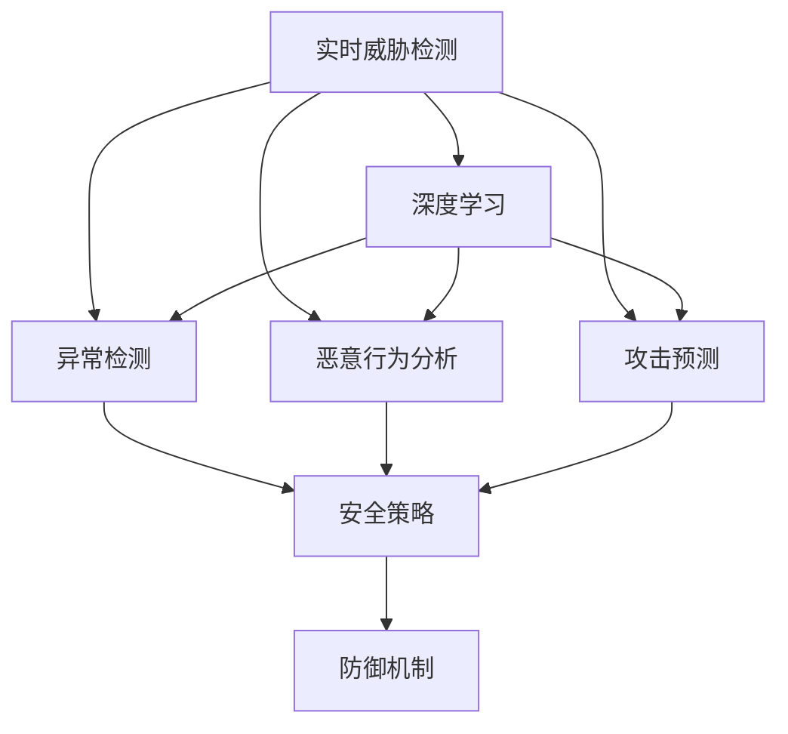

                 

# AI在网络安全中的应用：实时威胁检测

> 关键词：网络安全, 实时威胁检测, 深度学习, 模型优化, 异常检测, 恶意行为分析, 攻击预测, 安全策略, 防御机制

## 1. 背景介绍

### 1.1 问题由来
随着互联网的普及和数字化转型，网络安全威胁日益多样化、复杂化。黑客攻击、数据泄露、恶意软件等安全事件频繁发生，给企业和个人带来了巨大损失。传统的基于规则和签名的安全检测方法难以应对日益变化的威胁形势，亟需引入更智能、主动的检测手段。

### 1.2 问题核心关键点
实时威胁检测作为网络安全的重要环节，旨在对网络流量进行实时监控和分析，及时识别和应对潜在的安全威胁。随着人工智能技术的发展，深度学习等模型被引入到实时威胁检测中，构建了多维度的智能安全防护体系。

## 2. 核心概念与联系

### 2.1 核心概念概述

为更好地理解实时威胁检测的原理和技术路线，本节将介绍几个关键概念：

- **实时威胁检测**：指对网络流量进行实时监控，使用人工智能技术分析和识别潜在安全威胁的过程。能够快速响应新型的攻击行为，减少安全事件的影响和损失。
- **深度学习**：一类通过多层神经网络结构进行特征学习的方法，具有强大的表示能力和泛化能力。在网络安全领域，深度学习可用于行为分析和异常检测等任务。
- **异常检测**：基于统计模型或机器学习模型，通过训练正常数据分布，对新数据进行离群值检测，识别出异常或异常行为。
- **恶意行为分析**：通过对网络流量、系统日志、应用行为等数据进行分析，识别和预测恶意行为，包括但不限于钓鱼、勒索软件、DDoS攻击等。
- **攻击预测**：使用时间序列、图网络等模型，预测未来一段时间内的攻击行为，帮助提前预防和应对潜在的安全威胁。
- **安全策略和防御机制**：基于威胁检测和预测结果，制定和调整安全策略，采用防火墙、入侵检测系统(IDS)、入侵防御系统(IPS)等防御机制，提升网络安全防护能力。

这些概念之间的逻辑关系可以通过以下Mermaid流程图来展示：



这个流程图展示了实时威胁检测的核心概念及其之间的关系：

1. 实时威胁检测是应用深度学习模型的基础环节。
2. 深度学习模型提供数据表示和特征学习的能力，支持异常检测和恶意行为分析。
3. 异常检测和恶意行为分析通过建模正常和异常行为，辅助识别安全威胁。
4. 攻击预测基于时间序列和图网络模型，提供未来攻击行为的预测。
5. 安全策略和防御机制根据检测和预测结果，调整和优化网络安全防御措施。

## 3. 核心算法原理 & 具体操作步骤
### 3.1 算法原理概述

实时威胁检测的核心算法原理可以概括为：**基于深度学习的多维度安全行为分析与异常检测**。其核心思想是：使用深度学习模型对网络流量进行特征提取和表示，通过异常检测和行为分析，实时识别潜在的安全威胁，并生成防御策略。

具体步骤如下：

1. **数据采集**：从网络流量、系统日志、应用日志等数据源采集数据，进行预处理和清洗。
2. **特征提取**：使用深度学习模型对数据进行特征提取，将原始数据转换为高维度的特征向量。
3. **行为建模**：基于特征向量，构建正常的行为模式，使用深度学习模型训练异常检测模型。
4. **威胁识别**：实时输入新数据，通过异常检测模型判断是否为异常行为。
5. **攻击预测**：对异常行为进行进一步分析，使用图网络等模型预测攻击类型和未来行为。
6. **策略调整**：根据威胁识别和攻击预测结果，自动调整和优化安全策略和防御机制。

### 3.2 算法步骤详解

#### 3.2.1 数据采集和预处理

数据采集是实时威胁检测的第一步。需要从网络流量、系统日志、应用日志、防火墙日志等数据源中采集数据，并进行预处理和清洗。具体步骤如下：

1. **数据源选择**：根据网络架构和业务需求，选择合适的数据源进行监控。
2. **数据采集**：使用网络探针、日志分析工具等手段采集数据。
3. **数据清洗**：去除噪音数据，处理缺失值和异常值，确保数据的质量。
4. **特征提取**：使用向量空间映射等方法，将数据转换为高维度的特征向量。

#### 3.2.2 特征提取与行为建模

特征提取是实时威胁检测的关键步骤。使用深度学习模型对数据进行特征提取，可以发现难以用传统方法捕捉的复杂模式和关联。具体步骤如下：

1. **模型选择**：根据数据类型和任务需求，选择合适的深度学习模型，如卷积神经网络(CNN)、循环神经网络(RNN)、Transformer等。
2. **特征提取**：使用模型对数据进行特征提取，生成高维度的特征向量。
3. **行为建模**：基于特征向量，构建正常的行为模式，使用深度学习模型训练异常检测模型。

#### 3.2.3 异常检测和攻击预测

异常检测和攻击预测是实时威胁检测的核心环节。通过对正常和异常行为进行建模，实时识别潜在的安全威胁，并进行攻击预测。具体步骤如下：

1. **异常检测**：使用训练好的异常检测模型，对新输入的数据进行分类，判断是否为异常行为。
2. **攻击预测**：对异常行为进行进一步分析，使用时间序列、图网络等模型预测攻击类型和未来行为。

#### 3.2.4 策略调整和防御机制

策略调整和防御机制是实时威胁检测的目标。根据威胁识别和攻击预测结果，自动调整和优化安全策略和防御机制，提升网络安全防护能力。具体步骤如下：

1. **威胁识别**：根据异常检测和攻击预测结果，识别出潜在的安全威胁。
2. **策略调整**：根据威胁类型和严重程度，调整和优化安全策略，如防火墙规则、IDS/IPS规则等。
3. **防御机制**：启动相应的防御机制，如流量清洗、异常隔离、应急响应等。

### 3.3 算法优缺点

基于深度学习的实时威胁检测方法具有以下优点：

1. **高精度**：深度学习模型能够捕捉数据中的复杂模式和关联，识别出传统方法难以发现的潜在威胁。
2. **自适应**：模型能够适应不断变化的攻击行为和环境，具有较好的泛化能力。
3. **实时性**：基于模型对数据的实时处理能力，能够实现对威胁的实时响应和防御。
4. **扩展性**：模型可以轻松扩展到多维度和多源数据，适应不同规模的网络环境。

同时，该方法也存在一定的局限性：

1. **计算资源消耗大**：深度学习模型需要较大的计算资源和存储空间，对硬件设备要求较高。
2. **模型复杂性高**：深度学习模型需要大量的训练数据和超参数调整，模型复杂度较高。
3. **对抗样本脆弱**：模型容易受到对抗样本的攻击，需要进行防御机制的设计和优化。
4. **数据依赖性强**：模型依赖于正常数据的分布，对标注数据的数量和质量要求较高。

尽管存在这些局限性，但就目前而言，基于深度学习的实时威胁检测方法仍然是网络安全领域的主流范式。未来相关研究的重点在于如何进一步降低计算资源消耗，提高模型的自适应性和鲁棒性，同时兼顾可解释性和伦理安全性等因素。

### 3.4 算法应用领域

实时威胁检测作为网络安全的重要组成部分，已经被广泛应用于多个领域：

- **企业网络安全**：对企业内网和外网的流量进行实时监控和分析，及时识别和应对潜在的安全威胁。
- **金融网络安全**：对金融机构的交易数据、日志等进行实时分析，防范金融诈骗、数据泄露等风险。
- **政府网络安全**：对政府机构的重要网络数据进行监控和分析，防止敏感数据泄露和网络攻击。
- **云平台安全**：对云平台的用户数据、应用行为等进行实时检测，提升云服务的安全防护能力。
- **物联网安全**：对物联网设备的流量进行实时检测，防范设备被攻击和数据泄露。

除了上述这些经典应用外，实时威胁检测还被创新性地应用于更多的场景中，如车联网安全、工业物联网安全、智能家居安全等，为网络安全技术带来了新的突破。随着深度学习模型和实时威胁检测方法的不断进步，相信网络安全技术将在更广阔的应用领域大放异彩。

## 4. 数学模型和公式 & 详细讲解  
### 4.1 数学模型构建

本节将使用数学语言对实时威胁检测的深度学习模型进行更加严格的刻画。

设网络流量数据为 $x=\{x_1, x_2, ..., x_n\}$，其中 $x_i$ 为第 $i$ 个数据样本。定义正常行为的数据分布为 $p(x)$，异常行为的数据分布为 $q(x)$。实时威胁检测的目标是使用深度学习模型 $M$，对新输入的数据进行异常检测和攻击预测。

### 4.2 公式推导过程

假设模型 $M$ 对数据 $x$ 的表示为 $\hat{p}(x)$。为了进行异常检测，我们需要计算数据 $x$ 在正常和异常分布下的概率，并定义阈值 $\theta$ 进行区分。具体步骤如下：

1. **数据表示**：使用深度学习模型 $M$ 对数据 $x$ 进行特征提取，得到高维度的表示 $\hat{p}(x)$。
2. **异常检测**：计算 $\hat{p}(x)$ 在正常和异常分布下的概率，定义阈值 $\theta$ 进行区分，判断是否为异常行为。
3. **攻击预测**：对异常行为进行进一步分析，使用时间序列、图网络等模型预测攻击类型和未来行为。

### 4.3 案例分析与讲解

以基于深度学习的DDoS攻击检测为例，演示实时威胁检测的过程：

1. **数据采集**：从网络流量数据中采集DDoS攻击的数据样本，并进行预处理和清洗。
2. **特征提取**：使用CNN模型对数据进行特征提取，生成高维度的特征向量。
3. **行为建模**：基于特征向量，构建正常的DDoS攻击行为模式，使用深度学习模型训练异常检测模型。
4. **威胁识别**：实时输入新数据，通过异常检测模型判断是否为异常行为。
5. **攻击预测**：对异常行为进行进一步分析，使用时间序列模型预测攻击类型和未来行为。
6. **策略调整**：根据威胁识别和攻击预测结果，调整和优化安全策略，如防火墙规则、IDS/IPS规则等。

## 5. 项目实践：代码实例和详细解释说明
### 5.1 开发环境搭建

在进行实时威胁检测的开发实践前，我们需要准备好开发环境。以下是使用Python进行TensorFlow开发的环境配置流程：

1. 安装Anaconda：从官网下载并安装Anaconda，用于创建独立的Python环境。

2. 创建并激活虚拟环境：
```bash
conda create -n tf-env python=3.8 
conda activate tf-env
```

3. 安装TensorFlow：根据CUDA版本，从官网获取对应的安装命令。例如：
```bash
conda install tensorflow-gpu -c pytorch -c conda-forge
```

4. 安装各类工具包：
```bash
pip install numpy pandas scikit-learn matplotlib tqdm jupyter notebook ipython
```

完成上述步骤后，即可在`tf-env`环境中开始实时威胁检测的开发。

### 5.2 源代码详细实现

下面我们以DDoS攻击检测为例，给出使用TensorFlow进行实时威胁检测的代码实现。

首先，定义DDoS攻击的数据处理函数：

```python
import tensorflow as tf
import numpy as np

class DDoSDataset(tf.data.Dataset):
    def __init__(self, features, labels):
        self.features = features
        self.labels = labels
    
    def __len__(self):
        return len(self.labels)
    
    def __getitem__(self, item):
        return self.features[item], self.labels[item]
```

然后，定义模型和优化器：

```python
from tensorflow.keras.layers import Dense, Input, Flatten, Conv2D, MaxPooling2D
from tensorflow.keras.models import Model

input_shape = (32, 32, 3)
input_layer = Input(shape=input_shape)
x = Conv2D(32, kernel_size=(3, 3), activation='relu')(input_layer)
x = MaxPooling2D(pool_size=(2, 2))(x)
x = Flatten()(x)
x = Dense(64, activation='relu')(x)
output_layer = Dense(1, activation='sigmoid')(x)
model = Model(inputs=input_layer, outputs=output_layer)

optimizer = tf.keras.optimizers.Adam(learning_rate=0.001)
```

接着，定义训练和评估函数：

```python
from tensorflow.keras.callbacks import EarlyStopping

def train_epoch(model, dataset, batch_size, optimizer):
    dataloader = tf.data.Dataset.from_tensor_slices((dataset.features, dataset.labels)).shuffle(buffer_size=10000).batch(batch_size)
    model.compile(optimizer=optimizer, loss='binary_crossentropy', metrics=['accuracy'])
    model.fit(dataloader, epochs=10, callbacks=[EarlyStopping(patience=3)])

def evaluate(model, dataset, batch_size):
    dataloader = tf.data.Dataset.from_tensor_slices((dataset.features, dataset.labels)).batch(batch_size)
    return model.evaluate(dataloader)
```

最后，启动训练流程并在测试集上评估：

```python
epochs = 10
batch_size = 32

train_dataset = DDoSDataset(train_features, train_labels)
test_dataset = DDoSDataset(test_features, test_labels)

train_epoch(model, train_dataset, batch_size, optimizer)
print("Test loss:", evaluate(model, test_dataset, batch_size))
```

以上就是使用TensorFlow进行DDoS攻击检测的完整代码实现。可以看到，TensorFlow提供了强大的深度学习框架和组件，可以快速构建和训练实时威胁检测模型。

### 5.3 代码解读与分析

让我们再详细解读一下关键代码的实现细节：

**DDoSDataset类**：
- `__init__`方法：初始化特征和标签数据。
- `__len__`方法：返回数据集长度。
- `__getitem__`方法：返回单个数据样本。

**模型定义**：
- 使用Keras构建卷积神经网络(CNN)模型，包含卷积层、池化层、全连接层等组件。
- 使用sigmoid激活函数进行二分类任务。

**训练和评估函数**：
- 使用Keras的EarlyStopping回调函数，避免过拟合。
- 使用Keras的compile和fit方法，进行模型训练和评估。

**训练流程**：
- 定义总的epoch数和batch size，开始循环迭代。
- 每个epoch内，在训练集上训练模型，输出loss和accuracy。
- 在测试集上评估模型性能，打印测试结果。

可以看到，TensorFlow配合Keras框架使得实时威胁检测的代码实现变得简洁高效。开发者可以将更多精力放在数据处理、模型改进等高层逻辑上，而不必过多关注底层的实现细节。

当然，工业级的系统实现还需考虑更多因素，如模型的保存和部署、超参数的自动搜索、更灵活的任务适配层等。但核心的实时威胁检测范式基本与此类似。

## 6. 实际应用场景
### 6.1 企业网络安全

实时威胁检测在企业网络安全中具有广泛应用。企业内网和外网的数据流量量巨大，需要实时监控和分析，及时发现和应对潜在的安全威胁。通过实时威胁检测，企业可以有效防范内部泄密、外部攻击等安全事件，保障网络安全和数据安全。

在技术实现上，可以收集企业内网和外网的网络流量数据，提取特征向量，输入到实时威胁检测模型中进行分析和检测。检测到异常流量后，可以立即启动安全策略，如封锁恶意IP、禁止访问等，减少安全事件的影响和损失。

### 6.2 金融网络安全

金融行业对数据安全和交易安全的要求极高。实时威胁检测在金融网络安全中具有重要应用，能够实时监控和分析交易数据、系统日志等，防范金融诈骗、数据泄露等风险。

具体而言，可以收集金融机构的交易数据、系统日志等，使用实时威胁检测模型进行分析和检测。检测到异常行为后，可以立即启动应急响应机制，如冻结账户、报告异常交易等，及时防范金融风险。

### 6.3 政府网络安全

政府机构的重要数据和业务系统对网络安全要求极高。实时威胁检测在政府网络安全中具有重要应用，能够实时监控和分析网络数据，防止敏感数据泄露和网络攻击。

具体而言，可以收集政府机构的重要网络数据，使用实时威胁检测模型进行分析和检测。检测到异常行为后，可以立即启动安全策略，如隔离受感染设备、清除恶意软件等，保障网络安全和数据安全。

### 6.4 云平台安全

云平台的用户数据和应用行为量巨大，需要实时监控和分析，及时发现和应对潜在的安全威胁。通过实时威胁检测，云平台可以有效防范DDoS攻击、数据泄露等安全事件，保障云服务的安全性和稳定性。

具体而言，可以收集云平台的用户数据和应用行为数据，使用实时威胁检测模型进行分析和检测。检测到异常行为后，可以立即启动安全策略，如流量清洗、异常隔离等，保障云服务的安全性和稳定性。

### 6.5 物联网安全

物联网设备的数据流量量巨大，需要实时监控和分析，及时发现和应对潜在的安全威胁。通过实时威胁检测，物联网系统可以有效防范设备被攻击和数据泄露等安全事件，保障物联网系统的安全性和可靠性。

具体而言，可以收集物联网设备的网络流量数据，使用实时威胁检测模型进行分析和检测。检测到异常行为后，可以立即启动安全策略，如设备隔离、异常封锁等，保障物联网系统的安全性和可靠性。

### 6.6 车联网安全

车联网系统对数据安全和网络安全的要求极高。实时威胁检测在车联网安全中具有重要应用，能够实时监控和分析车联网数据，防范黑客攻击、数据泄露等安全事件。

具体而言，可以收集车联网系统的数据流量，使用实时威胁检测模型进行分析和检测。检测到异常行为后，可以立即启动安全策略，如设备隔离、异常封锁等，保障车联网系统的安全性和可靠性。

### 6.7 工业物联网安全

工业物联网系统对数据安全和网络安全的要求极高。实时威胁检测在工业物联网安全中具有重要应用，能够实时监控和分析工业物联网数据，防范黑客攻击、数据泄露等安全事件。

具体而言，可以收集工业物联网系统的数据流量，使用实时威胁检测模型进行分析和检测。检测到异常行为后，可以立即启动安全策略，如设备隔离、异常封锁等，保障工业物联网系统的安全性和可靠性。

### 6.8 智能家居安全

智能家居系统的数据流量量巨大，需要实时监控和分析，及时发现和应对潜在的安全威胁。通过实时威胁检测，智能家居系统可以有效防范黑客攻击、数据泄露等安全事件，保障智能家居系统的安全性和可靠性。

具体而言，可以收集智能家居系统的数据流量，使用实时威胁检测模型进行分析和检测。检测到异常行为后，可以立即启动安全策略，如设备隔离、异常封锁等，保障智能家居系统的安全性和可靠性。

## 7. 工具和资源推荐
### 7.1 学习资源推荐

为了帮助开发者系统掌握实时威胁检测的理论基础和实践技巧，这里推荐一些优质的学习资源：

1. TensorFlow官方文档：提供了详尽的API文档和示例代码，是TensorFlow的官方学习资源。
2. Keras官方文档：提供了Keras框架的API文档和示例代码，是Keras的官方学习资源。
3. Udacity《深度学习网络安全》课程：由知名专家授课，涵盖深度学习在网络安全中的应用，包括实时威胁检测、攻击预测等。
4. Coursera《机器学习与人工智能安全》课程：由斯坦福大学教授授课，涵盖机器学习在人工智能安全中的应用，包括异常检测、攻击预测等。
5. IEEE《深度学习与网络安全》会议论文集：收录了大量关于深度学习在网络安全中的研究论文，是深入研究的重要参考。

通过对这些资源的学习实践，相信你一定能够快速掌握实时威胁检测的理论基础和实践技巧，并用于解决实际的NLP问题。

### 7.2 开发工具推荐

高效的开发离不开优秀的工具支持。以下是几款用于实时威胁检测开发的常用工具：

1. TensorFlow：基于Python的开源深度学习框架，灵活动态的计算图，适合快速迭代研究。
2. Keras：深度学习框架Keras的高级API，可以快速搭建和训练深度学习模型。
3. Weights & Biases：模型训练的实验跟踪工具，可以记录和可视化模型训练过程中的各项指标，方便对比和调优。
4. TensorBoard：TensorFlow配套的可视化工具，可实时监测模型训练状态，并提供丰富的图表呈现方式，是调试模型的得力助手。
5. Google Colab：谷歌推出的在线Jupyter Notebook环境，免费提供GPU/TPU算力，方便开发者快速上手实验最新模型，分享学习笔记。

合理利用这些工具，可以显著提升实时威胁检测的开发效率，加快创新迭代的步伐。

### 7.3 相关论文推荐

实时威胁检测作为网络安全的重要研究方向，已被广泛关注和研究。以下是几篇奠基性的相关论文，推荐阅读：

1. Fawaz et al.《Deep Anomaly Detection with Autoencoder Neural Networks》：提出了基于自编码器的深度异常检测模型，展示了其在网络安全中的应用。
2. Ashton et al.《Practical Deep Learning for Cyber Threat Detection》：介绍了深度学习在网络安全中的实践应用，包括异常检测、攻击预测等。
3. Miao et al.《Cyber Threat Detection in IoT through Deep Learning》：展示了深度学习在物联网安全中的检测和预测能力。
4. Alrifai et al.《AI for Cybersecurity: Overview and Future Directions》：综述了深度学习在网络安全中的最新进展和未来趋势。
5. McLean et al.《Deep Learning for Threat Detection in Cloud Networks》：展示了深度学习在云平台安全中的应用，包括实时威胁检测等。

这些论文代表了大语言模型微调技术的发展脉络。通过学习这些前沿成果，可以帮助研究者把握学科前进方向，激发更多的创新灵感。

## 8. 总结：未来发展趋势与挑战
### 8.1 总结

本文对实时威胁检测的深度学习模型进行了全面系统的介绍。首先阐述了实时威胁检测的背景和意义，明确了深度学习在实时威胁检测中的核心地位。其次，从原理到实践，详细讲解了深度学习模型在实时威胁检测中的应用步骤和实现细节，给出了代码实例和详细解释。同时，本文还广泛探讨了实时威胁检测在多个行业领域的应用前景，展示了深度学习模型的强大潜力和广泛应用。

通过本文的系统梳理，可以看到，基于深度学习的实时威胁检测方法正在成为网络安全领域的重要范式，极大地拓展了网络安全模型的应用边界，提升了网络安全防护能力。未来，伴随深度学习模型和实时威胁检测方法的持续演进，相信网络安全技术将在更广阔的应用领域大放异彩，为网络安全事业的发展注入新的动力。

### 8.2 未来发展趋势

展望未来，实时威胁检测技术将呈现以下几个发展趋势：

1. **模型规模持续增大**：随着算力成本的下降和数据规模的扩张，深度学习模型的参数量还将持续增长。超大规模深度学习模型能够学习更丰富的网络行为特征，提高检测的准确性和鲁棒性。
2. **实时性要求更高**：深度学习模型在实时威胁检测中的应用，需要更高的实时性要求。未来的模型将更加注重推理速度和资源利用效率，确保快速响应和实时监控。
3. **多源数据融合**：未来的实时威胁检测模型将更加注重多源数据融合，将网络流量、系统日志、应用行为等多维度的数据进行联合分析，提高检测的全面性和准确性。
4. **跨领域应用拓展**：实时威胁检测技术将逐步拓展到更多领域，如工业物联网、车联网、智能家居等，为不同场景的网络安全防护提供有力支持。
5. **模型解释性增强**：未来的实时威胁检测模型将更加注重模型的可解释性，使用户能够理解模型的决策过程，提升系统的可信度和透明度。
6. **对抗样本防御**：随着深度学习模型的广泛应用，对抗样本攻击成为一大挑战。未来的模型将更加注重对抗样本防御，提升系统的鲁棒性和安全性。

以上趋势凸显了深度学习在实时威胁检测中的广阔前景。这些方向的探索发展，必将进一步提升深度学习模型在网络安全中的应用效果，为构建更加安全、可靠的网络环境提供有力保障。

### 8.3 面临的挑战

尽管实时威胁检测技术已经取得了显著进展，但在迈向更加智能化、普适化应用的过程中，它仍面临诸多挑战：

1. **计算资源消耗大**：深度学习模型需要较大的计算资源和存储空间，对硬件设备要求较高。如何降低计算资源消耗，提高模型的实时性，仍是一个重要问题。
2. **模型复杂性高**：深度学习模型需要大量的训练数据和超参数调整，模型复杂度较高。如何降低模型复杂度，提高模型的可解释性和鲁棒性，是一个重要研究方向。
3. **数据依赖性强**：模型依赖于正常数据的分布，对标注数据的数量和质量要求较高。如何获取高质量标注数据，降低数据依赖性，是一个重要挑战。
4. **对抗样本脆弱**：模型容易受到对抗样本的攻击，需要进行防御机制的设计和优化。如何提升模型的鲁棒性，减少对抗样本的影响，是一个重要问题。
5. **可解释性不足**：深度学习模型通常难以解释其内部工作机制和决策逻辑，难以满足高风险应用场景的透明性和可解释性要求。如何提高模型的可解释性，是一个重要研究方向。

尽管存在这些挑战，但实时威胁检测技术的不断进步和演进，必将使得深度学习模型在网络安全中的应用更加广泛和深入，为构建更加安全、可靠的网络环境提供有力保障。

### 8.4 研究展望

面对实时威胁检测技术所面临的种种挑战，未来的研究需要在以下几个方面寻求新的突破：

1. **多源数据融合**：开发更加高效的多源数据融合算法，将网络流量、系统日志、应用行为等多维度的数据进行联合分析，提高检测的全面性和准确性。
2. **对抗样本防御**：开发更加鲁棒的深度学习模型，使用对抗样本训练和防御策略，提升模型的鲁棒性和安全性。
3. **模型可解释性**：引入可解释性技术，如LIME、SHAP等，提高模型的可解释性和透明度，满足高风险应用场景的透明性和可解释性要求。
4. **小样本学习**：开发更加高效的小样本学习算法，减少对标注数据的依赖，提高模型的泛化能力和适应性。
5. **跨领域应用**：拓展实时威胁检测技术在更多领域的应用，如工业物联网、车联网、智能家居等，为不同场景的网络安全防护提供有力支持。
6. **持续学习**：开发更加持续学习的方法，使得模型能够不断学习新数据和新威胁，保持模型的时效性和适应性。

这些研究方向的探索，必将引领实时威胁检测技术迈向更高的台阶，为构建安全、可靠、可解释、可控的智能系统铺平道路。面向未来，实时威胁检测技术还需要与其他人工智能技术进行更深入的融合，如知识表示、因果推理、强化学习等，多路径协同发力，共同推动网络安全技术的进步。只有勇于创新、敢于突破，才能不断拓展网络安全模型的边界，让智能技术更好地造福网络安全事业。

## 9. 附录：常见问题与解答

**Q1：实时威胁检测的深度学习模型如何评估性能？**

A: 实时威胁检测的深度学习模型性能评估通常使用以下指标：
1. **准确率(accuracy)**：模型正确识别异常行为的比例。
2. **召回率(recall)**：实际异常行为中被模型识别出的比例。
3. **F1分数(f1-score)**：准确率和召回率的调和平均数，综合评估模型的检测性能。
4. **ROC曲线和AUC值**：通过绘制ROC曲线，评估模型在不同阈值下的检测性能，AUC值越高表示模型性能越好。

通过这些指标，可以全面评估深度学习模型在实时威胁检测中的性能表现。

**Q2：实时威胁检测的深度学习模型如何进行优化？**

A: 实时威胁检测的深度学习模型优化通常包括以下几个方面：
1. **数据增强**：通过数据增强技术，扩充训练集，提升模型的泛化能力。
2. **正则化**：使用L2正则、Dropout等正则化技术，避免过拟合，提升模型的鲁棒性。
3. **超参数调优**：通过网格搜索、贝叶斯优化等方法，优化模型的超参数，提升模型的性能。
4. **模型压缩**：通过剪枝、量化等方法，压缩模型规模，提升推理速度和资源利用效率。
5. **对抗训练**：使用对抗样本训练模型，提升模型的鲁棒性和安全性。

通过这些优化策略，可以显著提升实时威胁检测的深度学习模型的性能和鲁棒性。

**Q3：实时威胁检测的深度学习模型如何部署？**

A: 实时威胁检测的深度学习模型部署通常包括以下几个步骤：
1. **模型训练**：在训练集上训练深度学习模型，生成模型参数。
2. **模型保存**：将训练好的模型参数保存到本地或云存储中。
3. **模型部署**：将模型加载到服务器或云平台中，进行实时监控和分析。
4. **应用集成**：将模型集成到网络安全系统或应用程序中，实现实时威胁检测。

通过这些部署步骤，可以将深度学习模型应用到实际的网络安全场景中，提升网络安全防护能力。

**Q4：实时威胁检测的深度学习模型如何进行持续学习？**

A: 实时威胁检测的深度学习模型持续学习通常包括以下几个步骤：
1. **在线学习**：使用在线学习算法，不断更新模型参数，学习新数据和新威胁。
2. **知识融合**：将外部知识库、规则库等专家知识与深度学习模型结合，提升模型的知识和推理能力。
3. **定期更新**：定期对模型进行重新训练和优化，保持模型的时效性和适应性。

通过这些持续学习策略，可以使得深度学习模型不断学习新数据和新威胁，保持模型的时效性和适应性，提升模型的性能和鲁棒性。

**Q5：实时威胁检测的深度学习模型如何进行对抗样本防御？**

A: 实时威胁检测的深度学习模型对抗样本防御通常包括以下几个方面：
1. **对抗样本检测**：使用对抗样本检测技术，检测输入数据中的对抗样本。
2. **对抗样本清洗**：使用对抗样本清洗技术，去除输入数据中的对抗样本。
3. **对抗样本生成**：使用对抗样本生成技术，生成对抗样本进行模型训练，提升模型的鲁棒性。

通过这些对抗样本防御策略，可以使得深度学习模型在面对对抗样本攻击时，仍能保持较高的检测性能和鲁棒性。

---

作者：禅与计算机程序设计艺术 / Zen and the Art of Computer Programming

