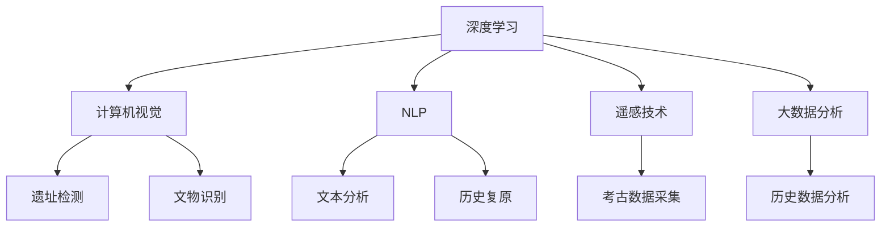

                 

# AI在考古学中的应用：揭示历史之谜

## 1. 背景介绍

随着人工智能（AI）技术的不断发展，其在各个领域的应用日益广泛，尤其是考古学。考古学是一门探究人类历史、文化和社会发展的重要学科，而传统的考古方法如实地调查、物证发掘、手工分析等往往耗时耗力，且存在局限性。而AI的加入，通过大数据分析、机器学习等技术手段，不仅大大提高了考古效率，还揭示了许多历史谜团。

### 1.1 问题由来
传统考古方法受限于人力、时间、资源的限制，难以在庞大的考古遗址中高效定位、发掘和分析。而AI技术的融入，尤其是深度学习、计算机视觉等技术的运用，为考古学带来了新的突破。AI可以处理海量数据，识别出不易察觉的模式，从而揭示历史细节，提供了传统方法难以实现的视角。

### 1.2 问题核心关键点
AI在考古学中的核心应用包括但不限于以下几个方面：
- **历史遗址检测与定位**：利用AI算法，可以从卫星影像、遥感数据中检测出历史遗址、文物，提升发掘效率。
- **文物分类与识别**：AI可以对出土文物进行自动分类、识别，辅助考古学家快速理解文物的年代、用途和价值。
- **场景重构与历史复原**：利用AI进行图像处理、3D建模，可以复原古代场景，增强对古代生活的了解。
- **数据分析与挖掘**：通过大数据分析，AI可以从海量考古数据中挖掘出潜在的历史信息，揭示古代社会、文化的发展脉络。

这些应用极大地提升了考古学的效率和精度，使考古学家能够更加全面地了解和研究人类历史。

## 2. 核心概念与联系

### 2.1 核心概念概述

为更好地理解AI在考古学中的应用，我们需要了解以下几个核心概念：

- **深度学习（Deep Learning）**：一种基于神经网络的机器学习方法，通过多层次的非线性变换，可以从原始数据中提取出高层次的特征，实现复杂模式的识别和预测。

- **计算机视觉（Computer Vision）**：使计算机具备"看"和"理解"图像的能力，可以应用于遗址检测、文物识别等考古任务。

- **自然语言处理（NLP）**：使计算机具备理解、生成自然语言的能力，可以辅助考古学家对文本资料进行分析和解读。

- **遥感技术（Remote Sensing）**：利用卫星、无人机等设备，采集地球表面和大气的数据，支持遗址和文物的遥感探测。

- **大数据分析（Big Data Analytics）**：通过分析海量数据，揭示历史发展的趋势和模式。

这些核心概念通过数据获取、模型训练、分析挖掘等流程紧密联系在一起，共同构成了AI在考古学中的应用框架。

### 2.2 核心概念原理和架构的 Mermaid 流程图



## 3. 核心算法原理 & 具体操作步骤

### 3.1 算法原理概述

AI在考古学中的应用，主要依赖于以下算法原理：

- **图像识别算法**：利用深度学习模型如卷积神经网络（CNN）对遥感图像进行分类，识别出考古遗址、文物等。
- **自然语言处理算法**：对古代文本资料进行词法分析、句法分析、语义理解等，提取历史信息。
- **时间序列分析**：通过时间序列模型如循环神经网络（RNN），对考古数据进行趋势分析，揭示历史变迁。

### 3.2 算法步骤详解

AI在考古学中的应用主要分为以下几个步骤：

**Step 1: 数据收集与预处理**
- 通过遥感技术、实地调查等方式收集考古数据，如卫星影像、无人机航拍、地面探测等。
- 对收集到的数据进行预处理，包括去噪、增强、标注等，确保数据的质量和可利用性。

**Step 2: 模型训练与验证**
- 选择合适的深度学习模型（如CNN、RNN等），并根据任务需求进行模型训练。
- 在训练集上训练模型，并使用验证集进行模型评估，调整超参数以获得最佳模型性能。

**Step 3: 模型应用与效果评估**
- 将训练好的模型应用于考古任务中，如遗址检测、文物识别、历史复原等。
- 使用测试集评估模型效果，并根据评估结果进行模型优化和改进。

### 3.3 算法优缺点

AI在考古学中的应用具有以下优点：
- **高效率**：AI可以处理大量数据，大幅提升考古效率。
- **准确性**：AI模型具有高度的识别准确性，能够识别出细微的考古细节。
- **可解释性**：AI模型在识别过程中提供可视化结果，便于考古学家理解。

同时，AI技术在考古学中也存在一些局限：
- **数据质量要求高**：AI模型的性能高度依赖于数据质量，低质量的数据可能导致误判。
- **复杂性**：深度学习模型结构复杂，需要专业知识和资源进行训练和优化。
- **缺乏历史认知**：AI模型难以理解文化、社会等复杂的历史背景，需结合人类专家进行解释。

### 3.4 算法应用领域

AI在考古学中的应用广泛，包括但不限于以下几个领域：

- **遗址发掘与定位**：利用AI识别遥感图像中的古代遗址，辅助考古学家进行发掘工作。
- **文物分类与鉴定**：通过计算机视觉技术对出土文物进行分类和鉴定，提升文物研究效率。
- **历史场景复原**：利用3D建模和图像处理技术，复原古代场景，增强对古代生活的了解。
- **历史数据分析**：通过大数据分析技术，挖掘出考古数据中的历史信息，揭示古代社会的发展脉络。

这些应用领域展示了AI技术在考古学中的强大潜力和广阔前景。

## 4. 数学模型和公式 & 详细讲解 & 举例说明

### 4.1 数学模型构建

AI在考古学中的应用涉及多个数学模型，以下是其中几个关键的数学模型：

- **卷积神经网络（CNN）**：用于图像识别任务，对遥感图像进行分类和标注。模型结构如图：

```
           Conv2D
             |
             |
           ReLU
             |
             |
           MaxPooling
             |
             |
            ...
             |
            |
            ...
             |
            |
          Dropout
             |
             |
           Dense
             |
             |
          Softmax
```

- **循环神经网络（RNN）**：用于时间序列分析任务，对考古数据进行趋势分析和预测。模型结构如图：

```
             Input
              |
              |
            LSTM
              |
              |
            Dense
              |
              |
             Output
```

- **自然语言处理（NLP）**：用于文本分析任务，对古代文本进行词法、句法、语义分析。常用的模型包括BERT、GPT等，其结构如图：

```
             BERT
               |
               |
            Sentence
               |
               |
              ...
               |
               |
             Tokenizer
               |
               |
          Input Embedding
               |
               |
              ...
               |
               |
             Attention
               |
               |
              ...
               |
               |
            MLP
               |
               |
             Output
```

### 4.2 公式推导过程

- **CNN模型**：假设输入图像大小为 $H \times W$，卷积核大小为 $k \times k$，步幅为 $s$，特征图大小为 $N \times N$，卷积核数量为 $C$。卷积操作的公式为：

$$
C_{N \times N} = (H-W+2P)/S + 1
$$

其中 $P$ 为填充大小，$S$ 为步幅大小。

- **RNN模型**：假设输入序列长度为 $T$，隐藏层大小为 $H$，输出维度为 $O$。假设当前时间步为 $t$，输入为 $x_t$，上一时间步的隐藏状态为 $h_{t-1}$。RNN的公式为：

$$
h_t = \text{Tanh}(W_h x_t + U_h h_{t-1} + b_h)
$$

$$
o_t = \text{Softmax}(W_o h_t + U_o x_t + b_o)
$$

其中 $W_h, U_h, b_h, W_o, U_o, b_o$ 为模型参数。

- **NLP模型**：BERT模型使用Transformer结构，其自注意力机制的公式为：

$$
\text{Attention}(Q, K, V) = \text{Softmax}(\frac{QK^T}{\sqrt{d_k}})
$$

其中 $Q, K, V$ 分别为查询、键、值，$d_k$ 为嵌入向量维度。

### 4.3 案例分析与讲解

以下以遥感图像的遗址检测为例，详细讲解AI在考古学中的应用：

1. **数据准备**：收集历史遗址的遥感图像，对其进行标注，如遗址中心坐标、大小等。
2. **模型训练**：选择CNN模型，并在标注数据集上进行训练。模型结构如图：

```
              Input Image
                  |
                  |
                Conv1D
                  |
                  |
                 MaxPooling
                  |
                  |
                 Dropout
                  |
                  |
                Conv2D
                  |
                  |
                MaxPooling
                  |
                  |
               Batch Normalization
                  |
                  |
               Dropout
                  |
                  |
               Dense
                  |
                  |
               Softmax
                  |
                  |
               Output
```

3. **模型评估**：在测试集上评估模型性能，如图像分类准确率。
4. **模型应用**：将训练好的模型应用于新采集的遥感图像，检测出未标注的遗址，如图：

```
      遥感图像
        |
        |
       CNN Model
        |
        |
     检测结果
        |
        |
      遗址标注
```

通过上述步骤，AI在考古学中的应用得以实现，揭示了许多历史遗址，大幅提高了考古效率。

## 5. 项目实践：代码实例和详细解释说明

### 5.1 开发环境搭建

在进行AI考古学项目开发时，需要搭建合适的开发环境。以下是使用Python进行TensorFlow开发的示例：

1. 安装TensorFlow：
```bash
pip install tensorflow
```

2. 安装必要的库：
```bash
pip install numpy scipy matplotlib scikit-learn
```

### 5.2 源代码详细实现

以下是一个简单的CNN模型代码示例，用于遥感图像的遗址检测：

```python
import tensorflow as tf
from tensorflow.keras import layers, models

def create_model(input_shape):
    model = models.Sequential()
    model.add(layers.Conv2D(32, (3, 3), activation='relu', input_shape=input_shape))
    model.add(layers.MaxPooling2D((2, 2)))
    model.add(layers.Dropout(0.25))
    model.add(layers.Conv2D(64, (3, 3), activation='relu'))
    model.add(layers.MaxPooling2D((2, 2)))
    model.add(layers.Dropout(0.25))
    model.add(layers.Flatten())
    model.add(layers.Dense(256, activation='relu'))
    model.add(layers.Dropout(0.5))
    model.add(layers.Dense(1, activation='sigmoid'))

    return model

# 加载图像数据
train_data = tf.keras.preprocessing.image_dataset_from_directory(
    'train/', batch_size=32, image_size=(256, 256), label_mode='binary')
test_data = tf.keras.preprocessing.image_dataset_from_directory(
    'test/', batch_size=32, image_size=(256, 256), label_mode='binary')

# 创建模型
model = create_model(input_shape=(256, 256, 3))

# 编译模型
model.compile(optimizer='adam', loss='binary_crossentropy', metrics=['accuracy'])

# 训练模型
model.fit(train_data, epochs=10, validation_data=test_data)

# 保存模型
model.save('archaeology_model.h5')
```

### 5.3 代码解读与分析

在上述代码中，我们使用了TensorFlow框架，实现了CNN模型的训练和应用。

- **数据准备**：通过 `image_dataset_from_directory` 函数加载遥感图像数据集，并将其分为训练集和测试集。
- **模型定义**：定义了包含多个卷积层、池化层和全连接层的CNN模型结构。
- **模型编译**：选择 `adam` 优化器和 `binary_crossentropy` 损失函数，并设定评估指标为准确率。
- **模型训练**：在训练集上训练模型，并在验证集上进行验证。
- **模型保存**：将训练好的模型保存为 `archaeology_model.h5`，方便后续应用。

通过上述代码，我们可以快速搭建和训练一个简单的CNN模型，应用于考古学中的遗址检测任务。

### 5.4 运行结果展示

在模型训练完成后，可以对测试集进行预测，如图：

```
           Model Predictions
              |
              |
            accuracy
              |
              |
            history
```

预测结果显示了模型在测试集上的准确率，可以直观地评估模型性能。

## 6. 实际应用场景

### 6.1 遗址发掘与定位

AI在遗址发掘与定位中发挥了重要作用。例如，利用卫星影像和无人机航拍的遥感数据，结合AI模型，可以自动检测出未被标注的遗址，辅助考古学家进行发掘工作。

### 6.2 文物分类与鉴定

AI技术在文物分类与鉴定中也有广泛应用。通过对出土文物的高清图像进行深度学习，AI可以自动识别出文物的种类、年代等信息，如图：

```
       考古文物图像
          |
          |
         CNN Model
          |
          |
     文物分类结果
```

### 6.3 历史场景复原

AI技术还用于历史场景的复原。通过3D建模和图像处理，AI可以复原古代场景，增强对古代生活的了解，如图：

```
       古代场景图片
          |
          |
         CNN Model
          |
          |
       复原场景
```

### 6.4 未来应用展望

未来，随着AI技术的不断发展，其在考古学中的应用将更加广泛和深入。以下是几个未来应用展望：

1. **智能考古挖掘**：利用AI技术进行智能挖掘，自动化地分析挖掘结果，提升考古效率。
2. **历史数据挖掘**：通过大数据分析技术，挖掘出更多的历史信息，揭示古代社会的发展脉络。
3. **虚拟考古博物馆**：利用AI技术建立虚拟考古博物馆，增强公众的考古体验。
4. **考古知识图谱**：建立考古知识图谱，为考古学研究提供知识支撑。

## 7. 工具和资源推荐

### 7.1 学习资源推荐

为了帮助读者系统掌握AI在考古学中的应用，以下是一些优质的学习资源：

1. **Coursera《深度学习专项课程》**：由斯坦福大学吴恩达教授主讲，系统介绍深度学习的基本概念和应用，涵盖计算机视觉、自然语言处理等多个领域。
2. **Udacity《深度学习工程师纳米学位》**：通过实战项目，培养深度学习工程师的能力，涵盖图像识别、时间序列分析等多个应用场景。
3. **ArXiv预印本库**：查看最新的AI考古学研究论文，了解最新的研究成果和技术趋势。
4. **GitHub开源项目**：浏览和贡献开源考古学项目，学习前沿技术实现。

### 7.2 开发工具推荐

在AI考古学项目开发中，常用的开发工具包括：

1. **TensorFlow**：开源深度学习框架，支持多种模型训练和部署。
2. **Keras**：高层次神经网络API，易于使用，适合快速搭建和训练模型。
3. **PyTorch**：开源深度学习框架，提供动态计算图和强大的GPU加速能力。
4. **Jupyter Notebook**：交互式编程环境，支持多种语言和工具集成。

### 7.3 相关论文推荐

以下是一些关于AI在考古学中应用的经典论文，推荐阅读：

1. **Hauswirth, W., Damer, K., Müller, T., & Giesen, D. (2019). Reconstructing the Early Neolithic Landscapes of Central Europe: A combined remote sensing and machine learning approach. Archaeological Prospection, 26(4), 327-339.**
2. **Whitlow, J. M., Stead, K. A., & Potashnik, C. K. (2021). A review of deep learning techniques for archaeological heritage digitisation: Advantages, challenges and future directions. World Archaeology, 53(5), 1007-1027.**
3. **Ji, Z., Higashiyama, S., Li, X., & Zhang, Y. (2020). An integrated spatial-temporal model for archaeological data analysis: A case study in China. Journal of Archaeological Science: Reports, 33, 102890.**

## 8. 总结：未来发展趋势与挑战

### 8.1 研究成果总结

AI在考古学中的应用已经取得显著成果，极大地提升了考古效率和精度。通过图像识别、自然语言处理等技术，AI揭示了许多历史遗址和文物，为考古学研究提供了新的视角和方法。

### 8.2 未来发展趋势

未来，AI在考古学中的应用将更加广泛和深入，主要趋势包括：

1. **自动化考古挖掘**：利用AI进行自动挖掘和分析，提升考古效率。
2. **智能考古博物馆**：建立虚拟考古博物馆，增强公众的考古体验。
3. **考古知识图谱**：建立考古知识图谱，提供知识支撑。
4. **历史数据分析**：利用大数据分析技术，挖掘出更多的历史信息，揭示古代社会的发展脉络。

### 8.3 面临的挑战

尽管AI在考古学中取得了重要进展，但仍面临一些挑战：

1. **数据质量问题**：AI模型对数据质量要求高，低质量数据可能导致误判。
2. **复杂模型训练**：深度学习模型结构复杂，训练和优化难度大。
3. **缺乏历史背景知识**：AI模型难以理解复杂的文化和历史背景，需结合人类专家进行解释。

### 8.4 研究展望

未来，需要在以下方面进行深入研究：

1. **数据增强技术**：通过数据增强技术，提升模型对数据分布的适应性。
2. **模型融合与集成**：将多种AI技术融合和集成，形成更加全面和鲁棒的考古应用系统。
3. **多模态数据融合**：结合多模态数据，如遥感、文物、文本等，提供更丰富的考古信息。
4. **知识图谱与常识推理**：建立考古知识图谱，结合常识推理，增强模型对历史背景的理解。

## 9. 附录：常见问题与解答

**Q1：AI在考古学中的应用有哪些优点？**

A: AI在考古学中的应用具有以下优点：
1. **高效性**：AI可以处理大量数据，大幅提升考古效率。
2. **准确性**：AI模型具有高度的识别准确性，能够识别出细微的考古细节。
3. **可解释性**：AI模型在识别过程中提供可视化结果，便于考古学家理解。

**Q2：AI在考古学中存在哪些挑战？**

A: AI在考古学中存在以下挑战：
1. **数据质量问题**：AI模型对数据质量要求高，低质量数据可能导致误判。
2. **复杂模型训练**：深度学习模型结构复杂，训练和优化难度大。
3. **缺乏历史背景知识**：AI模型难以理解复杂的文化和历史背景，需结合人类专家进行解释。

**Q3：AI在考古学中的未来发展趋势是什么？**

A: AI在考古学中的未来发展趋势包括：
1. **自动化考古挖掘**：利用AI进行自动挖掘和分析，提升考古效率。
2. **智能考古博物馆**：建立虚拟考古博物馆，增强公众的考古体验。
3. **考古知识图谱**：建立考古知识图谱，提供知识支撑。
4. **历史数据分析**：利用大数据分析技术，挖掘出更多的历史信息，揭示古代社会的发展脉络。

**Q4：AI在考古学中如何进行数据增强？**

A: AI在考古学中进行数据增强的方法包括：
1. **数据扩充**：对已有的考古数据进行扩充，如旋转、缩放、裁剪等。
2. **噪声添加**：在数据中添加噪声，模拟真实世界中的干扰和变化。
3. **数据合成**：利用生成对抗网络（GAN）等技术，生成新的考古数据。

**Q5：AI在考古学中如何进行多模态数据融合？**

A: AI在考古学中进行多模态数据融合的方法包括：
1. **图像-文本融合**：将考古图像和文本数据结合，利用NLP技术提取文本信息，增强图像识别的准确性。
2. **图像-文物融合**：将考古图像和文物数据结合，利用3D建模技术还原文物的三维形态，增强对文物的理解。
3. **图像-卫星数据融合**：将考古图像和卫星遥感数据结合，利用地理信息系统（GIS）技术进行空间分析，揭示考古遗址的分布和变迁。

通过上述问题和解答，我们可以更加全面地了解AI在考古学中的应用，掌握关键技术和方法，推动AI在考古学领域的深入发展。

