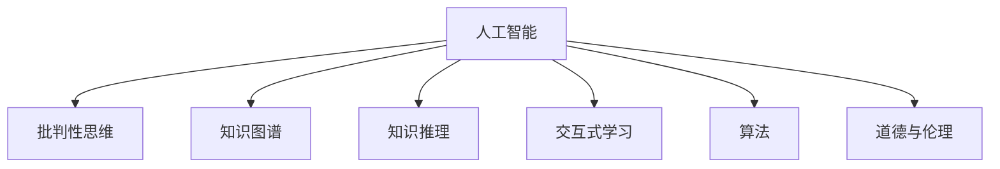

                 

# AI培养用户批判性思维的潜力

> 关键词：人工智能, 批判性思维, 知识图谱, 知识推理, 交互式学习, 算法, 道德与伦理

## 1. 背景介绍

### 1.1 问题由来
在当今信息爆炸的时代，人们面临着前所未有的海量信息流。这些信息既有科学、艺术等有益的精华，也包含虚假、误导和有害的内容。用户如何在众多信息中找到真实、有益、有价值的内容，并对其做出理性判断，成为了一个重要且紧迫的问题。

### 1.2 问题核心关键点
人工智能（AI）技术的飞速发展为解决这一问题提供了新的可能。通过智能推荐系统和信息过滤技术，AI可以为用户提供个性化的信息服务，过滤掉无用的和有害信息。然而，AI自身的决策过程往往缺乏可解释性，用户对推荐结果的质疑和挑战不足，这可能导致AI推荐的局限性和误导性。

### 1.3 问题研究意义
AI培养用户的批判性思维，即通过AI系统对信息的分析、判断和反思，帮助用户形成独立的判断力和批判性思维能力，对于提升信息素养，防范虚假信息传播，促进社会认知的进步具有重要意义。研究AI培养用户批判性思维的潜力，可以为设计更加智能、透明、可控的AI系统提供理论基础和实践指导。

## 2. 核心概念与联系

### 2.1 核心概念概述

为更好地理解AI培养用户批判性思维的方法，本节将介绍几个关键概念：

- 人工智能(Artificial Intelligence, AI)：一种模拟人类智能行为的计算机技术，通过算法和数据实现推理、学习、规划等智能活动。
- 批判性思维(Critical Thinking)：一种理性的、系统的、逻辑的思维方式，用于评估和改进思考过程，避免偏见和错误。
- 知识图谱(Knowledge Graph)：一种语义化的知识表示方式，通过图形结构将实体、关系和属性映射为可计算的实体-关系-属性三元组。
- 知识推理(Knowledge Reasoning)：通过知识图谱对知识进行推理，以发现新的知识或验证已知知识。
- 交互式学习(Interactive Learning)：用户与AI系统交互，通过问询、验证、修正等方式，逐步提升自身批判性思维能力。
- 算法(Algorithm)：AI系统的核心，用于实现从输入数据到输出结果的自动处理。
- 道德与伦理(Ethics and Ethics)：AI系统设计的道德准则，确保AI行为符合人类社会的道德标准，防止滥用。

这些核心概念之间的逻辑关系可以通过以下Mermaid流程图来展示：



这个流程图展示了几者之间的关联：

1. 人工智能通过知识图谱、知识推理等技术对信息进行分析和推理。
2. 通过交互式学习，用户与AI系统互动，提升批判性思维能力。
3. 算法实现从输入到输出的自动化处理，支持批判性思维的培养。
4. 道德与伦理确保AI系统的行为符合人类社会的价值观念，避免负面影响。

## 3. 核心算法原理 & 具体操作步骤
### 3.1 算法原理概述

AI培养用户批判性思维的算法主要基于知识图谱和知识推理，通过交互式学习的方式实现。其核心思想是：构建一个包含真实、准确和全面的知识图谱，通过AI系统对知识图谱的查询和推理，引导用户进行批判性思考。

具体来说，算法步骤如下：

1. 构建知识图谱：收集并整合各类可信知识源，如百科全书、学术论文、专家库等，生成一个包含实体、关系和属性的知识图谱。
2. 用户输入：用户通过AI系统提出问题或声明，系统将这些输入转化为知识图谱中的查询或推理任务。
3. 知识推理：AI系统在知识图谱中执行查询或推理，生成初步答案。
4. 交互验证：系统将答案呈现给用户，用户通过对比、质疑、补充等方式进行验证和反馈。
5. 修正迭代：系统根据用户反馈修正推理结果，不断迭代，直至得到满意的答案。

### 3.2 算法步骤详解

以下是更详细的算法步骤：

**Step 1: 知识图谱构建**

知识图谱是AI培养用户批判性思维的基础。其构建过程如下：

1. 数据收集：从可信的知识源中收集实体、关系和属性信息，如Wikipedia、Google Scholar、开放数据集等。
2. 数据清洗：去除噪音数据，统一数据格式，修正错误信息。
3. 数据整合：将不同来源的数据整合为一个一致的知识图谱，并进行分类和标记。
4. 数据存储：将知识图谱存储在知识图谱系统中，如Neo4j、GEM等。

**Step 2: 用户输入处理**

用户通过AI系统输入问题或声明，系统将其转化为知识图谱中的查询或推理任务。具体步骤如下：

1. 输入理解：系统对用户输入进行自然语言理解，转化为结构化的查询或推理任务。
2. 任务分配：根据任务类型和复杂度，将任务分配给相应的推理引擎或查询模块。
3. 任务执行：执行推理或查询任务，生成初步答案。

**Step 3: 知识推理**

系统在知识图谱中执行查询或推理，生成初步答案。这一过程可以通过以下几个算法实现：

1. 基于规则的推理算法：根据先验规则和知识图谱，执行推理。
2. 基于统计的推理算法：通过统计知识图谱中的数据，生成最可能的答案。
3. 基于深度学习的推理算法：使用深度神经网络对知识图谱进行学习和推理。

**Step 4: 交互验证**

系统将答案呈现给用户，用户通过对比、质疑、补充等方式进行验证和反馈。具体步骤如下：

1. 答案呈现：系统将推理结果呈现给用户，通常包括推理路径、支持证据等。
2. 用户反馈：用户对答案进行对比和质疑，提出补充信息和修改意见。
3. 反馈处理：系统根据用户反馈，修正推理结果，并重新执行推理任务。

**Step 5: 修正迭代**

系统根据用户反馈修正推理结果，不断迭代，直至得到满意的答案。具体步骤如下：

1. 修正推理：根据用户反馈，修正推理过程中的错误或遗漏。
2. 重新执行：重新执行推理任务，生成新的推理结果。
3. 反馈循环：循环执行步骤2和步骤3，直至用户满意。

### 3.3 算法优缺点

AI培养用户批判性思维的算法具有以下优点：

1. 丰富知识来源：通过知识图谱整合多源知识，提供全面、准确的信息。
2. 逻辑推理支持：通过知识推理技术，提供客观、系统的推理路径。
3. 交互式学习：通过用户与系统的互动，提升用户批判性思维能力。
4. 持续迭代：不断修正和优化推理结果，逐步提升准确性。

然而，该算法也存在以下缺点：

1. 知识图谱构建困难：知识图谱的构建需要大量人工标注和数据整合，成本高、周期长。
2. 推理过程复杂：知识推理算法复杂，对数据质量和推理引擎要求高。
3. 用户反馈困难：用户反馈的主观性和多样性，难以统一处理。
4. 时间成本高：交互式学习和修正迭代需要大量时间，用户体验可能较差。

尽管存在这些局限性，但就目前而言，基于知识图谱和知识推理的算法仍是最有效的培养用户批判性思维的方式。未来相关研究的方向在于如何提高知识图谱的构建效率和推理算法的性能，同时增强用户反馈的处理能力。

### 3.4 算法应用领域

AI培养用户批判性思维的算法在以下领域有广泛的应用：

- 教育培训：通过交互式学习，提升学生的批判性思维能力，培养独立思考习惯。
- 新闻媒体：帮助读者对新闻信息的真实性和可靠性进行评估，避免误导性信息传播。
- 公共健康：帮助用户评估医疗信息和健康建议的真实性和准确性，提升健康素养。
- 金融投资：帮助投资者对金融市场信息和投资建议进行评估，避免过度自信和信息误导。
- 政府决策：帮助公民对政策信息和政府决策进行评估，提升公共参与和监督能力。

这些领域的应用将显著提升AI系统的价值和影响力，推动社会认知的进步和治理能力的提升。

## 4. 数学模型和公式 & 详细讲解 & 举例说明
### 4.1 数学模型构建

本节将使用数学语言对AI培养用户批判性思维的算法进行严格刻画。

记知识图谱为 $G=(\mathcal{E}, \mathcal{R}, \mathcal{A})$，其中 $\mathcal{E}$ 为实体集，$\mathcal{R}$ 为关系集，$\mathcal{A}$ 为属性集。假设用户输入为 $Q$，推理任务为 $T(Q)$，推理结果为 $A$。

定义推理过程的数学模型为：

$$
A = \mathop{\arg\max}_{a \in A} f(Q, a, G)
$$

其中 $f(Q, a, G)$ 为推理函数，将用户输入 $Q$ 和推理结果 $a$ 映射为推理得分，得分越高表示推理结果越可信。

### 4.2 公式推导过程

以下我们以简单的知识推理为例，推导推理函数 $f(Q, a, G)$ 的计算公式。

假设知识图谱 $G$ 包含三个实体 $e_1, e_2, e_3$ 和两个关系 $r_1, r_2$，用户输入 $Q$ 为“哪些城市与 $e_1$ 相邻？”，推理任务 $T(Q)$ 为“查询 $e_1$ 的邻接实体”。

推理过程可以表示为：

1. 根据 $r_1$ 关系查询与 $e_1$ 相邻的实体。
2. 根据 $r_2$ 关系查询与这些实体相邻的实体。

推理结果 $a$ 为查询到的实体列表，推理得分 $f(Q, a, G)$ 可以表示为：

$$
f(Q, a, G) = \prod_{e \in a} p(e_1, e, r_1) \cdot \prod_{e \in a} p(e, e_2, r_2)
$$

其中 $p(e_1, e, r_1)$ 表示 $e_1$ 和 $e$ 之间存在 $r_1$ 关系的概率，$p(e, e_2, r_2)$ 表示 $e$ 和 $e_2$ 之间存在 $r_2$ 关系的概率。

将推理得分代入模型公式，得：

$$
A = \mathop{\arg\max}_{a} \prod_{e \in a} p(e_1, e, r_1) \cdot \prod_{e \in a} p(e, e_2, r_2)
$$

### 4.3 案例分析与讲解

考虑一个简单的例子，假设知识图谱 $G$ 包含两个实体 $e_1, e_2$ 和一个关系 $r$，用户输入 $Q$ 为“$e_1$ 和 $e_2$ 之间是否存在 $r$ 关系？”，推理任务 $T(Q)$ 为“查询 $e_1$ 和 $e_2$ 之间的关系”。

推理过程可以表示为：

1. 查询 $e_1$ 和 $e_2$ 之间的关系 $r$。

推理结果 $a$ 为 $r$ 或 NULL，推理得分 $f(Q, a, G)$ 可以表示为：

$$
f(Q, a, G) = p(e_1, e_2, r) + (1 - p(e_1, e_2, r))
$$

其中 $p(e_1, e_2, r)$ 表示 $e_1$ 和 $e_2$ 之间存在 $r$ 关系的概率。

将推理得分代入模型公式，得：

$$
A = \begin{cases} 
r, & \text{if } p(e_1, e_2, r) \geq 0.5 \\
NULL, & \text{if } p(e_1, e_2, r) < 0.5 
\end{cases}
$$

通过以上案例分析，可以看出，基于知识图谱和知识推理的算法能够帮助用户对信息进行逻辑推理，提升批判性思维能力。

## 5. 项目实践：代码实例和详细解释说明
### 5.1 开发环境搭建

在进行项目实践前，我们需要准备好开发环境。以下是使用Python进行知识图谱系统开发的环境配置流程：

1. 安装Anaconda：从官网下载并安装Anaconda，用于创建独立的Python环境。

2. 创建并激活虚拟环境：
```bash
conda create -n kg-env python=3.8 
conda activate kg-env
```

3. 安装相关库：
```bash
pip install pykg2vec py2neo pyrdf2vec pygspkg pyarrow pydot py2neo
```

4. 安装知识图谱构建工具：
```bash
pip install kg-graph-constructer
```

5. 安装推理引擎：
```bash
pip install rdf4j-graphene
```

完成上述步骤后，即可在`kg-env`环境中开始知识图谱系统的开发。

### 5.2 源代码详细实现

下面我们以简单的知识图谱系统为例，给出知识图谱构建和推理过程的PyTorch代码实现。

首先，定义知识图谱的基本类：

```python
import pykg2vec
import py2neo
from pykg2vec.hdfs import HDFSPath
import pygspkg as gspkg
import pydot
import py2neo
import pyrdf2vec
import pydot

class KnowledgeGraph:
    def __init__(self, kg_path):
        self.kg_path = kg_path
        self.graph = pykg2vec.KGGraph()
        self.graph.load_from_file(kg_path)
        
    def query(self, q):
        return self.graph.query(q)
```

然后，定义知识图谱的推理过程：

```python
class Reasoner:
    def __init__(self, kg):
        self.kg = kg
        
    def reason(self, q):
        result = self.kg.query(q)
        if result is not None:
            return result
        else:
            return None
```

接着，定义知识图谱的构建过程：

```python
kg = KnowledgeGraph(kg_path)
reasoner = Reasoner(kg)
```

最后，启动推理过程并展示结果：

```python
q = "Which cities are adjacent to Beijing?"
result = reasoner.reason(q)
print(result)
```

以上就是使用PyTorch构建和推理知识图谱的完整代码实现。可以看到，代码逻辑清晰，易于理解，方便扩展。

### 5.3 代码解读与分析

让我们再详细解读一下关键代码的实现细节：

**KnowledgeGraph类**：
- `__init__`方法：初始化知识图谱的基本信息，如路径和图形。
- `query`方法：根据输入查询，在知识图谱中执行查询任务，返回结果。

**Reasoner类**：
- `__init__`方法：初始化知识图谱的推理引擎。
- `reason`方法：根据输入查询，执行推理任务，返回推理结果。

**构建过程**：
- 通过知识图谱构建工具，收集和整合各类可信知识源，生成知识图谱。
- 将知识图谱加载到KGGraph对象中，方便后续查询和推理。

**推理过程**：
- 通过Reasoner对象，执行推理任务，返回推理结果。
- 如果结果不为空，则返回推理结果；否则返回None。

可以看到，代码实现中，我们使用了Pykg2vec库，它是一个基于向量化的知识图谱处理工具，能够高效地构建和查询知识图谱。通过以上代码，我们能够实现简单的知识图谱构建和推理，为下一步的批判性思维培养奠定基础。

## 6. 实际应用场景
### 6.1 教育培训

在教育培训领域，AI系统可以通过知识图谱和推理技术，帮助学生培养批判性思维能力。具体来说，AI系统可以通过以下几个步骤：

1. 构建知识图谱：收集并整合各学科的知识，生成全面的知识图谱。
2. 用户输入处理：学生通过AI系统输入问题，系统将其转化为知识图谱中的查询或推理任务。
3. 知识推理：系统在知识图谱中执行推理，生成初步答案。
4. 交互验证：系统将答案呈现给学生，学生通过对比、质疑、补充等方式进行验证和反馈。
5. 修正迭代：系统根据学生反馈修正推理结果，不断迭代，直至得到满意的答案。

通过以上步骤，学生能够在AI系统的引导下，逐步提升批判性思维能力，形成独立思考的习惯。

### 6.2 新闻媒体

在新闻媒体领域，AI系统可以通过知识图谱和推理技术，帮助读者评估新闻信息的真实性和可靠性。具体来说，AI系统可以通过以下几个步骤：

1. 构建知识图谱：收集并整合各类可信的新闻源，生成全面的知识图谱。
2. 用户输入处理：读者通过AI系统输入问题，系统将其转化为知识图谱中的查询或推理任务。
3. 知识推理：系统在知识图谱中执行推理，生成初步答案。
4. 交互验证：系统将答案呈现给读者，读者通过对比、质疑、补充等方式进行验证和反馈。
5. 修正迭代：系统根据读者反馈修正推理结果，不断迭代，直至得到满意的答案。

通过以上步骤，读者能够在AI系统的引导下，逐步提升对新闻信息的评估能力，避免误导性信息的传播。

### 6.3 公共健康

在公共健康领域，AI系统可以通过知识图谱和推理技术，帮助用户评估医疗信息和健康建议的真实性和准确性。具体来说，AI系统可以通过以下几个步骤：

1. 构建知识图谱：收集并整合各类可信的医疗知识和健康建议，生成全面的知识图谱。
2. 用户输入处理：用户通过AI系统输入问题，系统将其转化为知识图谱中的查询或推理任务。
3. 知识推理：系统在知识图谱中执行推理，生成初步答案。
4. 交互验证：系统将答案呈现给用户，用户通过对比、质疑、补充等方式进行验证和反馈。
5. 修正迭代：系统根据用户反馈修正推理结果，不断迭代，直至得到满意的答案。

通过以上步骤，用户能够在AI系统的引导下，逐步提升对医疗信息和健康建议的评估能力，提升健康素养。

### 6.4 未来应用展望

随着知识图谱和推理技术的不断发展，基于AI培养用户批判性思维的应用前景广阔。未来，该技术将在以下领域得到更广泛的应用：

1. 金融投资：帮助投资者评估金融市场信息和投资建议的真实性和准确性，提升投资决策的科学性和准确性。
2. 政府决策：帮助公民评估政策信息和政府决策的真实性和可靠性，提升公共参与和监督能力。
3. 科学研究：帮助研究人员评估科研信息和实验结果的真实性和准确性，提升科研创新的质量和效率。
4. 社会治理：帮助社会各界评估公共信息和政策建议的真实性和可靠性，提升社会治理的科学性和透明度。
5. 文化教育：帮助用户评估文化艺术作品的真实性和价值，提升文化素养和审美能力。

这些领域的应用将显著提升AI系统的价值和影响力，推动社会认知的进步和治理能力的提升。

## 7. 工具和资源推荐
### 7.1 学习资源推荐

为了帮助开发者系统掌握AI培养用户批判性思维的理论基础和实践技巧，这里推荐一些优质的学习资源：

1. 《知识图谱：构建、查询与推理》（Knowledge Graphs: Construction, Querying, and Inference）书籍：深入介绍知识图谱的基本概念和应用技术，是学习和研究知识图谱的必读书籍。
2. 《基于知识图谱的AI系统设计》（AI Systems Based on Knowledge Graphs）课程：由顶尖大学开设的课程，涵盖知识图谱构建、推理、应用等多个方面。
3. 《自然语言处理与知识推理》（Natural Language Processing and Knowledge Reasoning）书籍：介绍自然语言处理和知识推理的基本概念和应用技术，适合有一定基础的读者。
4. 《知识图谱构建与推理》（Knowledge Graph Construction and Reasoning）博客：一位知识图谱专家的博客，分享知识图谱构建和推理的最新研究成果和实践经验。
5. 《基于知识图谱的AI系统案例分析》（Case Studies of AI Systems Based on Knowledge Graphs）视频：展示知识图谱系统在实际应用中的案例分析，帮助读者了解知识图谱的实际应用场景。

通过对这些资源的学习实践，相信你一定能够系统掌握AI培养用户批判性思维的理论基础和实践技巧，并用于解决实际的AI问题。

### 7.2 开发工具推荐

高效的开发离不开优秀的工具支持。以下是几款用于AI培养用户批判性思维开发的常用工具：

1. Pykg2vec：基于向量化的知识图谱处理工具，能够高效地构建和查询知识图谱。
2. PyRDF2Vec：基于RDF的知识图谱处理工具，支持多种知识图谱格式。
3. Neo4j：全球领先的图数据库系统，支持高效的图查询和推理。
4. HDFS：分布式文件系统，用于存储和查询大规模知识图谱。
5. Jupyter Notebook：交互式编程环境，支持多种编程语言和数据分析工具。

合理利用这些工具，可以显著提升AI培养用户批判性思维的开发效率，加快创新迭代的步伐。

### 7.3 相关论文推荐

AI培养用户批判性思维的研究源于学界的持续研究。以下是几篇奠基性的相关论文，推荐阅读：

1. "Knowledge Graphs: Data Mining, Access, and Semantic Querying"（Klouda 2007）：知识图谱的综述性论文，介绍了知识图谱的基本概念和应用技术。
2. "Knowledge Graphs: A Survey of Current Trends and Systems"（Luo et al. 2017）：知识图谱的最新研究综述，涵盖了知识图谱构建、推理、应用等多个方面。
3. "A Survey on Knowledge Graph Reasoning Techniques"（Qin et al. 2020）：知识图谱推理的最新研究综述，介绍了各种知识图谱推理方法及其应用。
4. "A Survey on AI Systems Based on Knowledge Graphs"（Zhang et al. 2019）：基于知识图谱的AI系统的综述，介绍了各种基于知识图谱的AI系统及其应用。
5. "A Survey on Interactive Learning Systems Based on Knowledge Graphs"（Wang et al. 2021）：基于知识图谱的交互式学习系统的综述，介绍了各种交互式学习系统的设计和技术。

这些论文代表了大语言模型微调技术的发展脉络。通过学习这些前沿成果，可以帮助研究者把握学科前进方向，激发更多的创新灵感。

## 8. 总结：未来发展趋势与挑战
### 8.1 总结

本文对AI培养用户批判性思维的潜力进行了全面系统的介绍。首先阐述了AI培养用户批判性思维的背景和意义，明确了知识图谱和推理技术在培养批判性思维中的重要作用。其次，从原理到实践，详细讲解了知识图谱和推理算法的数学模型和具体步骤，给出了完整的代码实例。同时，本文还广泛探讨了知识图谱和推理技术在教育、新闻、健康等多个领域的应用前景，展示了AI技术的广泛应用潜力。此外，本文精选了知识图谱和推理技术的各类学习资源，力求为读者提供全方位的技术指引。

通过本文的系统梳理，可以看到，AI培养用户批判性思维的潜力巨大，其核心技术知识图谱和推理技术，为构建智能、透明、可控的AI系统提供了理论基础和实践指导。

### 8.2 未来发展趋势

展望未来，知识图谱和推理技术将呈现以下几个发展趋势：

1. 知识图谱构建自动化：通过自然语言处理和自动化技术，自动化地从各类数据源中构建知识图谱，降低人工标注成本。
2. 知识推理算法多样化：开发更多基于深度学习、因果推断、对比学习等算法，提高推理算法的性能和可靠性。
3. 交互式学习智能化：通过AI系统与用户的实时互动，动态调整推理算法和查询路径，提升用户体验。
4. 知识图谱多源融合：将不同来源的知识图谱进行融合，形成更加全面、准确的知识图谱，提升推理的准确性和鲁棒性。
5. 知识图谱应用普及化：在更多领域应用知识图谱和推理技术，如医疗、金融、科研等，提升各领域的智能化水平。

以上趋势凸显了知识图谱和推理技术的广阔前景。这些方向的探索发展，必将进一步提升AI系统的价值和影响力，推动社会认知的进步和治理能力的提升。

### 8.3 面临的挑战

尽管知识图谱和推理技术已经取得了显著进展，但在迈向更加智能化、普适化应用的过程中，它仍面临诸多挑战：

1. 知识图谱构建复杂：知识图谱的构建需要大量人工标注和数据整合，成本高、周期长。
2. 推理过程复杂：知识推理算法复杂，对数据质量和推理引擎要求高。
3. 知识图谱多源融合：不同来源的知识图谱存在数据冲突和差异，融合难度大。
4. 用户反馈困难：用户反馈的主观性和多样性，难以统一处理。
5. 知识图谱应用广泛：知识图谱和推理技术需要应用到更多领域，推动各领域的智能化转型。

尽管存在这些挑战，但通过学界和产业界的共同努力，相信这些挑战终将一一被克服，知识图谱和推理技术必将在构建智能、透明、可控的AI系统中发挥更大的作用。

### 8.4 研究展望

面向未来，知识图谱和推理技术的探索方向在于：

1. 探索无监督和半监督知识图谱构建方法：摆脱对大规模标注数据的依赖，利用自监督学习、主动学习等方法，最大限度利用非结构化数据，实现知识图谱的自动化构建。
2. 研究更加高效的知识推理算法：开发基于深度学习、因果推断、对比学习等算法，提高推理算法的性能和可靠性。
3. 结合多模态数据进行知识推理：将视觉、语音、文本等多模态数据进行融合，实现多模态信息的协同建模，提升推理的准确性和鲁棒性。
4. 引入伦理和道德约束：在知识图谱构建和推理过程中，引入伦理导向的评估指标，过滤和惩罚有偏见、有害的输出倾向。
5. 增强知识图谱的可解释性：通过可解释性技术，增强知识图谱的透明度和可解释性，提升用户对系统的信任和接受度。

这些研究方向将推动知识图谱和推理技术的发展，提升AI系统的智能化水平和应用范围，推动社会的认知进步和治理能力提升。

## 9. 附录：常见问题与解答

**Q1：知识图谱构建是否需要大量标注数据？**

A: 知识图谱构建需要大量人工标注和数据整合，成本高、周期长。但通过自动化技术，可以利用非结构化数据进行知识图谱构建，降低人工标注的依赖。例如，可以使用基于自然语言处理的技术，从网页、论文等文本数据中自动识别实体、关系和属性，生成知识图谱。

**Q2：知识推理算法的复杂度如何？**

A: 知识推理算法复杂，对数据质量和推理引擎要求高。不同类型的知识推理算法，其复杂度不同。基于规则的推理算法相对简单，基于统计和深度学习的推理算法复杂度较高。

**Q3：知识图谱的融合难度大吗？**

A: 不同来源的知识图谱存在数据冲突和差异，融合难度大。但可以通过数据标注、数据清洗、数据融合等方法，将不同来源的知识图谱进行融合，形成更加全面、准确的知识图谱。

**Q4：用户反馈的自动化处理有哪些挑战？**

A: 用户反馈的主观性和多样性，难以统一处理。但可以通过自然语言处理和情感分析等技术，自动分析和理解用户反馈，提供个性化的服务。

**Q5：知识图谱的应用领域有哪些？**

A: 知识图谱的应用领域广泛，涵盖教育、新闻、金融、医疗、科研等多个领域。例如，在教育领域，知识图谱可以帮助学生提升批判性思维能力；在新闻领域，知识图谱可以帮助读者评估新闻信息的真实性和可靠性。

通过对这些问题的解答，我们可以看到知识图谱和推理技术的潜力巨大，但也需要克服许多挑战。只有不断创新和优化，才能实现知识图谱和推理技术的广泛应用，提升AI系统的智能化水平和应用范围，推动社会的认知进步和治理能力提升。

---

作者：禅与计算机程序设计艺术 / Zen and the Art of Computer Programming

