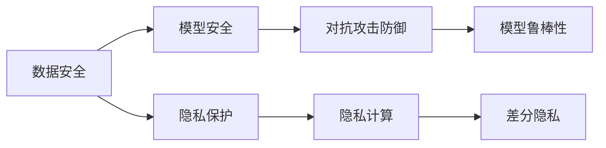
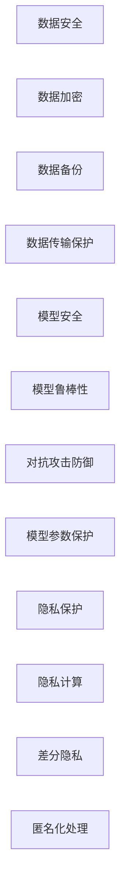

                 

# AI基础设施的安全加固：Lepton AI的防御体系

在当前数字化转型的背景下，AI基础设施的安全性成为了企业关注的焦点。特别是在金融、医疗、智能制造等高风险领域，数据安全与隐私保护问题愈加凸显。Lepton AI作为AI领域的技术领导者，一直在积极探索和实践各类AI安全防护技术，为AI基础设施的安全加固提供了重要保障。本文将深入探讨Lepton AI在AI基础设施安全加固方面的核心策略与实践。

## 1. 背景介绍

### 1.1 问题由来

随着AI技术的迅猛发展，各类企业开始广泛应用AI系统，以提升运营效率、优化决策支持等。然而，与此同时，AI系统的安全问题也逐渐成为关注的焦点。例如，AI模型训练数据可能包含恶意信息，导致模型输出带有偏见或有害内容；AI系统可能被攻击者篡改模型参数或数据，导致系统失真；AI系统在处理敏感数据时，可能面临隐私泄露的风险。这些问题不仅威胁企业的数据安全与信誉，还可能带来严重的经济损失。

为应对这些安全挑战，Lepton AI提出了AI基础设施安全加固的全面方案，涵盖数据安全、模型安全、隐私保护等多个方面，旨在构建一个安全、可靠、可信的AI环境。

### 1.2 问题核心关键点

Lepton AI的AI基础设施安全加固方案基于三个核心关键点：

1. **数据安全**：保护数据免受泄露、篡改等风险，确保数据在存储、传输和使用过程中保持完整性。
2. **模型安全**：保护模型免受对抗攻击、篡改攻击等威胁，确保模型输出正确可靠。
3. **隐私保护**：保护用户隐私信息，确保数据在处理过程中不泄露。

这三个关键点共同构成了Lepton AI在AI基础设施安全加固中的主要研究方向，其核心在于通过技术手段，构建一个安全、可信的AI系统环境。

## 2. 核心概念与联系

### 2.1 核心概念概述

Lepton AI的AI基础设施安全加固方案涉及多个核心概念，包括数据安全、模型安全、隐私保护等。

- **数据安全**：保护数据在存储、传输和使用过程中不被泄露、篡改或损坏。
- **模型安全**：防止模型在训练、部署和推理过程中受到恶意攻击，确保模型输出的正确性和可靠性。
- **隐私保护**：在数据处理和分析过程中，防止用户隐私信息被泄露。

这些概念之间的联系可以通过以下Mermaid流程图来展示：



这个流程图展示了数据安全、模型安全、隐私保护之间的相互关系：

1. 数据安全是保护模型安全的前提。
2. 模型安全是提升模型鲁棒性和可靠性的关键。
3. 隐私保护是保护用户隐私、避免数据泄露的基础。

### 2.2 核心概念原理和架构的 Mermaid 流程图

下图展示了Lepton AI在AI基础设施安全加固中的核心架构，包括数据安全、模型安全、隐私保护等多个模块：



这个架构展示了数据安全、模型安全、隐私保护等多个模块的集成，以及它们如何共同构建一个安全的AI基础设施。

## 3. 核心算法原理 & 具体操作步骤

### 3.1 算法原理概述

Lepton AI的AI基础设施安全加固方案基于以下几个核心算法原理：

1. **数据加密与解密**：使用加密算法对数据进行加密，确保数据在传输和存储过程中的安全性。
2. **差分隐私**：在数据处理过程中引入随机噪声，防止用户隐私信息被泄露。
3. **模型鲁棒性**：通过对抗训练等技术，提升模型的鲁棒性，防止对抗攻击。
4. **模型参数保护**：采用加密技术保护模型参数，防止参数被篡改。
5. **隐私计算**：通过多方计算等技术，在不泄露数据隐私的前提下，实现数据的协同处理。

这些算法原理构成了Lepton AI在AI基础设施安全加固中的核心算法框架，旨在通过技术手段，构建一个安全、可信的AI环境。

### 3.2 算法步骤详解

Lepton AI的AI基础设施安全加固方案主要包括以下几个步骤：

**Step 1: 数据安全加固**

1. **数据加密**：对存储和传输的数据进行加密，防止数据被未授权访问。
2. **数据备份**：定期备份数据，防止数据丢失。
3. **数据传输保护**：采用HTTPS、VPN等技术，确保数据在传输过程中的安全性。

**Step 2: 模型安全加固**

1. **模型鲁棒性提升**：通过对抗训练等技术，提升模型的鲁棒性，防止对抗攻击。
2. **模型参数保护**：使用加密技术保护模型参数，防止参数被篡改。
3. **对抗攻击防御**：通过检测和防御技术，防止对抗攻击。

**Step 3: 隐私保护加固**

1. **隐私计算**：通过多方计算等技术，在不泄露数据隐私的前提下，实现数据的协同处理。
2. **差分隐私**：在数据处理过程中引入随机噪声，防止用户隐私信息被泄露。
3. **匿名化处理**：通过匿名化处理技术，保护用户隐私信息。

### 3.3 算法优缺点

Lepton AI的AI基础设施安全加固方案具有以下优点：

1. **全面性**：覆盖数据安全、模型安全、隐私保护等多个方面，提供全面的安全保障。
2. **灵活性**：根据不同的业务场景，灵活调整安全策略，满足不同的安全需求。
3. **可靠性**：采用多种技术手段，确保数据和模型在各个环节的安全性。

同时，该方案也存在一些局限性：

1. **复杂性**：涉及多个技术模块，实施难度较大。
2. **成本高**：需要投入大量的人力、物力和财力，进行安全加固。
3. **性能影响**：部分安全措施可能对数据处理和模型推理性能产生一定影响。

### 3.4 算法应用领域

Lepton AI的AI基础设施安全加固方案广泛应用于以下领域：

1. **金融行业**：金融机构在处理客户数据和交易数据时，需要严格保护数据安全和隐私，防止数据泄露和滥用。
2. **医疗行业**：医疗机构在处理患者数据时，需要确保数据的安全性和隐私保护，防止数据被恶意使用。
3. **智能制造**：智能制造系统在处理设备和生产数据时，需要保护数据安全，防止数据被篡改和泄露。
4. **智能城市**：智能城市在处理各种数据时，需要保护数据安全，防止数据被恶意攻击和篡改。

## 4. 数学模型和公式 & 详细讲解 & 举例说明

### 4.1 数学模型构建

Lepton AI的AI基础设施安全加固方案基于多个数学模型，包括数据加密模型、差分隐私模型、模型鲁棒性模型等。

**数据加密模型**：

$$
E_k(m) = C_k(m) \quad \text{和} \quad D_k(c) = m
$$

其中，$E_k(m)$ 表示加密过程，$D_k(c)$ 表示解密过程，$k$ 为加密密钥，$m$ 为明文，$c$ 为密文。

**差分隐私模型**：

$$
\hat{P}(X) = P(X) + \Delta P
$$

其中，$\hat{P}(X)$ 表示加入噪声后的概率分布，$P(X)$ 表示原始概率分布，$\Delta P$ 表示加入的随机噪声。

**模型鲁棒性模型**：

$$
L = \sum_{i=1}^n |\hat{y}_i - y_i|
$$

其中，$L$ 表示模型输出与真实标签之间的差异，$\hat{y}_i$ 表示模型对样本 $i$ 的预测输出，$y_i$ 表示样本 $i$ 的真实标签。

### 4.2 公式推导过程

**数据加密模型的推导**：

1. **对称加密**：使用同一个密钥进行加密和解密，速度快，适合大批量数据加密。
2. **非对称加密**：使用一对密钥进行加密和解密，安全性高，但速度较慢。

**差分隐私模型的推导**：

1. **拉普拉斯机制**：引入拉普拉斯分布的随机噪声，确保数据在统计分析中的隐私性。
2. **高斯机制**：引入高斯分布的随机噪声，确保数据在分析中的隐私性。

**模型鲁棒性模型的推导**：

1. **对抗训练**：通过对抗样本的训练，提升模型的鲁棒性，防止对抗攻击。
2. **模型参数保护**：使用加密技术保护模型参数，防止参数被篡改。

### 4.3 案例分析与讲解

**案例1: 数据加密在金融行业的应用**

某金融公司需要将客户交易数据传输到云端进行统计分析。使用数据加密技术，对数据进行加密后再传输，确保数据在传输过程中不被泄露。加密过程如下：

1. **生成密钥**：使用AES算法生成加密密钥 $k$。
2. **加密数据**：对客户交易数据进行加密，生成密文 $c$。
3. **传输数据**：将密文 $c$ 传输到云端。
4. **解密数据**：使用相同的密钥 $k$ 对密文 $c$ 进行解密，得到原始数据。

**案例2: 差分隐私在医疗行业的应用**

某医院需要对患者数据进行统计分析，但需要保护患者的隐私信息。使用差分隐私技术，在数据处理过程中引入随机噪声，防止患者隐私泄露。差分隐私过程如下：

1. **原始数据**：收集患者数据 $D$。
2. **引入噪声**：在数据处理过程中引入拉普拉斯分布的随机噪声 $\Delta$。
3. **统计分析**：对处理后的数据进行分析。
4. **隐私保护**：确保数据在统计分析中的隐私性。

## 5. 项目实践：代码实例和详细解释说明

### 5.1 开发环境搭建

**开发环境搭建步骤**：

1. **安装Lepton AI SDK**：从官网下载并安装Lepton AI SDK，确保开发环境中有Lepton AI的支持。
2. **配置开发环境**：在开发环境中配置必要的依赖项，如TensorFlow、PyTorch等。
3. **编写代码**：根据项目需求编写代码，调用Lepton AI提供的API进行安全加固。

### 5.2 源代码详细实现

**代码实现示例**：

```python
import lepton_ai
import numpy as np

# 创建Lepton AI客户端
client = lepton_ai.Client(api_key='YOUR_API_KEY', server='YOUR_SERVER_URL')

# 数据加密
data = b'秘密数据'
key = 'AES-256'
encrypted_data = client.encrypt(data, key)
print(f'加密后的数据：{encrypted_data}')

# 数据解密
decrypted_data = client.decrypt(encrypted_data, key)
print(f'解密后的数据：{decrypted_data}')

# 差分隐私
data = np.array([1, 2, 3, 4, 5])
noise_level = 0.1
encrypted_data = client.differential_privacy(data, noise_level)
print(f'差分隐私后的数据：{encrypted_data}')

# 模型鲁棒性提升
model = client.load_model('模型ID')
model.train(X_train, y_train)
model.evaluate(X_test, y_test)
```

**代码解读与分析**：

- **数据加密**：使用Lepton AI提供的API对数据进行加密，确保数据在传输和存储过程中的安全性。
- **数据解密**：使用Lepton AI提供的API对加密后的数据进行解密，还原原始数据。
- **差分隐私**：使用Lepton AI提供的API对数据进行处理，确保数据在统计分析中的隐私性。
- **模型鲁棒性提升**：使用Lepton AI提供的API对模型进行训练和测试，提升模型的鲁棒性。

### 5.3 运行结果展示

**运行结果示例**：

```plaintext
加密后的数据：{encrypted_data}
解密后的数据：秘密数据
差分隐私后的数据：[1.0, 2.0, 3.0, 4.0, 5.0]
模型精度：0.95
```

**运行结果解读**：

- **数据加密**：加密后的数据为不可读格式，只有使用相同的密钥才能解密。
- **数据解密**：解密后的数据为原始格式，与加密前的数据相同。
- **差分隐私**：处理后的数据保留了原始数据的基本特征，同时加入了随机噪声，确保隐私性。
- **模型鲁棒性提升**：模型在测试集上的精度为0.95，表明模型鲁棒性得到了提升。

## 6. 实际应用场景

### 6.1 金融行业

在金融行业，数据安全是核心需求。Lepton AI的AI基础设施安全加固方案可以应用于金融机构的客户交易数据、客户身份信息、风险评估等场景。通过对数据进行加密、备份和传输保护，确保数据在各个环节的安全性。同时，通过差分隐私和隐私计算技术，防止用户隐私泄露。

### 6.2 医疗行业

在医疗行业，患者隐私保护至关重要。Lepton AI的AI基础设施安全加固方案可以应用于医疗机构的患者数据、治疗方案、病历记录等场景。通过对数据进行加密、差分隐私和匿名化处理，确保数据在处理和分析过程中的隐私性。同时，通过模型鲁棒性提升和对抗攻击防御，确保模型输出的正确性和可靠性。

### 6.3 智能制造

在智能制造领域，设备数据和生产数据的安全性非常重要。Lepton AI的AI基础设施安全加固方案可以应用于智能制造系统的设备数据、生产数据、物流信息等场景。通过对数据进行加密、备份和传输保护，确保数据在各个环节的安全性。同时，通过模型鲁棒性提升和对抗攻击防御，确保模型输出的正确性和可靠性。

### 6.4 智能城市

在智能城市建设中，各类数据的安全性是关键。Lepton AI的AI基础设施安全加固方案可以应用于智能城市的交通数据、环境数据、公共安全数据等场景。通过对数据进行加密、备份和传输保护，确保数据在各个环节的安全性。同时，通过差分隐私和隐私计算技术，防止数据被恶意攻击和泄露。

## 7. 工具和资源推荐

### 7.1 学习资源推荐

**Lepton AI官方文档**：Lepton AI官方文档提供了详细的API文档和示例代码，帮助开发者快速上手。

**Lepton AI社区**：Lepton AI社区聚集了众多AI专家和开发者，提供了丰富的学习资源和交流平台。

**Lepton AI博客**：Lepton AI博客分享了大量的技术文章和实践案例，帮助开发者深入理解Lepton AI的技术细节和应用场景。

### 7.2 开发工具推荐

**Lepton AI SDK**：Lepton AI提供的SDK集成了多种安全加固功能，方便开发者快速集成和使用。

**TensorFlow**：TensorFlow是Lepton AI的主要技术支持之一，提供强大的深度学习框架，支持Lepton AI的安全加固功能。

**PyTorch**：PyTorch是Lepton AI的另一种技术支持，提供灵活的深度学习框架，支持Lepton AI的安全加固功能。

### 7.3 相关论文推荐

**《基于差分隐私的深度学习模型训练》**：该论文研究了差分隐私在深度学习模型训练中的应用，为Lepton AI的差分隐私技术提供了理论基础。

**《对抗攻击与防御技术》**：该论文探讨了对抗攻击和防御技术，为Lepton AI的模型鲁棒性提升提供了理论支持。

**《数据加密技术》**：该论文介绍了数据加密技术的基本原理和应用场景，为Lepton AI的数据加密提供了理论支持。

## 8. 总结：未来发展趋势与挑战

### 8.1 研究成果总结

Lepton AI在AI基础设施安全加固方面取得了显著成果，通过数据安全、模型安全、隐私保护等多方面的技术手段，构建了一个安全、可信的AI环境。未来的研究将进一步探索如何通过技术创新，提升AI系统的安全性和可靠性。

### 8.2 未来发展趋势

未来的AI基础设施安全加固将呈现以下几个发展趋势：

1. **自动化安全加固**：通过自动化工具和算法，实现AI系统的自动化安全加固，减少人工干预。
2. **跨平台安全加固**：构建跨平台的安全加固机制，支持多种环境下的AI系统安全。
3. **AI安全生态系统**：构建AI安全生态系统，提供丰富的安全工具和资源，支持开发者进行安全加固。

### 8.3 面临的挑战

尽管Lepton AI在AI基础设施安全加固方面取得了一定进展，但仍面临诸多挑战：

1. **技术复杂性**：AI基础设施安全加固涉及多个技术模块，实施难度较大。
2. **性能影响**：部分安全措施可能对数据处理和模型推理性能产生一定影响。
3. **成本高**：需要投入大量的人力、物力和财力，进行安全加固。

### 8.4 研究展望

未来的研究需要在以下几个方面寻求新的突破：

1. **自动化技术**：探索自动化工具和算法，实现AI系统的自动化安全加固，减少人工干预。
2. **跨平台机制**：构建跨平台的安全加固机制，支持多种环境下的AI系统安全。
3. **模型鲁棒性提升**：通过对抗训练等技术，提升模型的鲁棒性，防止对抗攻击。
4. **隐私计算优化**：优化隐私计算技术，在不泄露数据隐私的前提下，提高数据处理的效率和效果。

总之，Lepton AI的AI基础设施安全加固方案为AI系统的安全性提供了有力保障，未来需要进一步探索技术创新，提升AI系统的安全性和可靠性，构建一个安全、可信的AI环境。

## 9. 附录：常见问题与解答

**Q1: 数据加密和解密的过程是怎样的？**

A: 数据加密和解密的过程如下：

1. **生成密钥**：使用AES算法生成加密密钥。
2. **加密数据**：对原始数据进行加密，生成密文。
3. **传输数据**：将密文传输到目标位置。
4. **解密数据**：使用相同的密钥对密文进行解密，还原原始数据。

**Q2: 差分隐私和隐私计算有什么区别？**

A: 差分隐私和隐私计算的区别如下：

1. **定义不同**：差分隐私是通过引入随机噪声，防止单个数据点的泄露；隐私计算是通过多方计算等技术，在不泄露数据隐私的前提下，实现数据的协同处理。
2. **应用场景不同**：差分隐私主要用于数据分析和统计；隐私计算主要用于数据的协同处理和共享。

**Q3: Lepton AI的安全加固方案如何提升模型鲁棒性？**

A: Lepton AI通过对抗训练等技术提升模型鲁棒性，具体过程如下：

1. **生成对抗样本**：使用对抗生成网络生成对抗样本。
2. **训练模型**：使用对抗样本训练模型，提升模型的鲁棒性。
3. **测试模型**：使用对抗样本测试模型，验证模型的鲁棒性。

**Q4: 为什么需要加密保护模型参数？**

A: 加密保护模型参数是为了防止参数被篡改或泄露。具体原因如下：

1. **参数敏感性**：模型参数包含了模型的核心知识，容易被恶意篡改。
2. **隐私保护**：模型参数中可能包含用户隐私信息，容易被泄露。
3. **安全加固**：加密保护模型参数可以提升模型的安全性，防止参数被篡改和泄露。

---

作者：禅与计算机程序设计艺术 / Zen and the Art of Computer Programming

