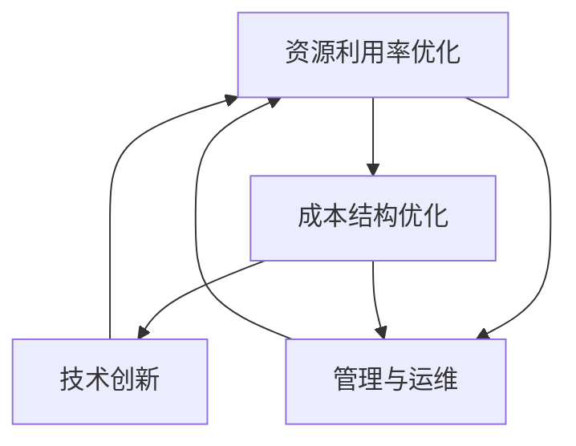

                 

# AI基础设施的成本优化：Lepton AI的经济学

## 1. 背景介绍

随着人工智能（AI）技术的快速发展和应用普及，AI基础设施建设成为了各行各业关注的焦点。AI基础设施包括数据中心、存储、计算、网络、安全等多个方面，是支撑AI应用的关键基础设施。然而，高质量的AI基础设施不仅需要大量的资金投入，还需要精细化的管理和优化。Lepton AI作为一家领先的AI基础设施建设公司，通过一系列创新技术和实践，致力于降低AI基础设施的成本，提升整体AI系统效率和性能。

### 1.1 问题由来
AI基础设施成本的居高不下，一直是困扰各行各业AI应用落地的重要因素之一。数据中心建设、服务器购置、软件部署、网络架构设计等各个环节，都需要巨额的资金投入。同时，AI模型的训练和推理对计算资源的要求高，资源利用率较低，进一步增加了成本压力。如何在有限的预算内，实现高效、低成本的AI基础设施建设，是当前AI领域的重要课题。

### 1.2 问题核心关键点
AI基础设施成本优化的关键在于：
- **资源利用率优化**：提高服务器和存储资源的利用率，减少资源浪费。
- **成本结构优化**：优化各环节的成本结构，减少不必要的花费。
- **技术和架构创新**：引入新的技术和架构，降低系统建设和运营成本。
- **管理与运维**：通过精细化的管理与运维，提升基础设施的稳定性和效率。

### 1.3 问题研究意义
优化AI基础设施成本，不仅有助于降低AI应用的部署和运行成本，提高企业竞争力，还能够促进AI技术的普及和应用，推动各行业的数字化转型升级。具体而言：

1. **降低部署成本**：优化资源利用率和管理结构，降低AI应用的初始部署成本，让更多中小企业能够承担。
2. **提升效率和性能**：通过技术创新和管理优化，提升AI系统的运行效率和性能，提高用户满意度。
3. **支持长期发展**：通过稳定的基础设施建设，支持AI技术的持续发展和应用，为各行业提供可靠的技术支撑。

## 2. 核心概念与联系

### 2.1 核心概念概述

AI基础设施的成本优化涉及到多个核心概念，包括：

- **资源利用率**：服务器、存储、网络等资源的利用效率。
- **成本结构**：数据中心建设、服务器购置、软件部署等环节的成本构成。
- **技术创新**：引入的新技术和架构，如异构计算、边缘计算、分布式训练等。
- **管理与运维**：基础设施的管理和维护方法，包括监控、故障诊断、备份与恢复等。

这些概念之间存在密切联系，通过精细化管理和技术创新，可以有效提升资源利用率，优化成本结构，从而实现整体的成本优化。

### 2.2 核心概念原理和架构的 Mermaid 流程图



这个流程图展示了各概念之间的相互关系和作用路径。资源利用率优化是基础，成本结构优化和技术创新是手段，管理与运维是保障。通过这些概念的协同工作，可以最大化地降低AI基础设施的成本。

## 3. 核心算法原理 & 具体操作步骤

### 3.1 算法原理概述

AI基础设施成本优化的核心算法原理主要包括：

- **资源规划与调度**：通过算法优化资源的分配和使用，提高资源利用率。
- **成本核算与优化**：构建成本模型，分析各环节的成本构成，提出优化策略。
- **技术引入与适配**：引入先进技术和架构，适应不同场景的需求，提升系统性能。
- **管理优化与运维**：采用先进的管理和运维技术，保障基础设施的稳定性和可靠性。

这些算法原理旨在通过系统化的手段，实现AI基础设施的全方位优化，降低成本，提升效率。

### 3.2 算法步骤详解

AI基础设施成本优化的算法步骤包括以下几个关键环节：

1. **需求分析与评估**：通过与客户的深度沟通，了解其AI应用的需求和资源要求，进行初步评估。
2. **资源规划与分配**：根据需求分析结果，制定资源规划方案，分配计算、存储和网络资源。
3. **成本核算与优化**：构建AI基础设施的成本模型，分析各环节的成本构成，提出优化策略。
4. **技术引入与适配**：引入适合的技术架构和算法，适应不同场景的需求，提升系统性能。
5. **管理优化与运维**：采用先进的管理和运维技术，保障基础设施的稳定性和可靠性。
6. **持续监控与优化**：通过持续监控系统性能和资源利用率，及时发现问题并优化调整。

### 3.3 算法优缺点

AI基础设施成本优化的算法优点包括：

- **系统性**：全面考虑资源利用、成本结构和技术创新，提供系统化的解决方案。
- **适应性强**：适用于不同规模和类型的AI应用，能够灵活适配。
- **持续优化**：通过持续监控和调整，不断优化基础设施，提升性能。

同时，该算法也存在一些局限性：

- **初始投入大**：优化初期需要投入较多的资金和时间进行规划和建设。
- **技术复杂**：涉及到资源规划、成本核算、技术适配等多个环节，技术复杂度较高。
- **依赖数据**：需要大量的数据来进行成本分析和优化，数据获取和处理成本较高。

### 3.4 算法应用领域

AI基础设施成本优化的算法应用领域非常广泛，包括但不限于：

- **金融科技**：优化金融机构的数据中心和服务器，提升AI算法的运行效率和性能。
- **智慧城市**：优化智慧城市的数据采集和处理设施，支持城市运行和管理。
- **医疗健康**：优化医疗健康机构的AI训练和推理设施，提高诊断和治疗的精度和效率。
- **零售电商**：优化零售电商的AI推荐和个性化服务设施，提升用户体验和转化率。
- **智能制造**：优化智能制造的AI设备监控和预测性维护设施，提升生产效率和设备利用率。

## 4. 数学模型和公式 & 详细讲解 & 举例说明

### 4.1 数学模型构建

AI基础设施成本优化的数学模型主要包括以下几个组成部分：

- **资源利用率模型**：衡量服务器、存储和网络资源的利用率，公式如下：

  $$
  U = \frac{实际使用量}{总容量} \times 100\%
  $$

- **成本模型**：分析各环节的成本构成，公式如下：

  $$
  C = C_{计算} + C_{存储} + C_{网络} + C_{其他}
  $$

- **性能模型**：评估AI系统的性能指标，如响应时间、准确率等，公式如下：

  $$
  P = \frac{平均响应时间}{目标响应时间} \times 100\%
  $$

### 4.2 公式推导过程

以资源利用率模型为例，进行推导过程如下：

假设服务器总容量为C，实际使用量为U，则资源利用率U的计算公式为：

$$
U = \frac{U}{C} \times 100\% = \frac{U}{C}
$$

其中，U为实际使用量，C为总容量。资源利用率U越高，说明资源利用效率越高，浪费越少。

### 4.3 案例分析与讲解

假设某金融机构的数据中心服务器总容量为1000台，实际使用量为600台，计算资源利用率为：

$$
U = \frac{600}{1000} \times 100\% = 60\%
$$

这表明当前服务器的利用效率为60%，还有40%的资源未被充分利用。通过优化资源分配和利用，可以进一步提高资源利用率，降低成本。

## 5. 项目实践：代码实例和详细解释说明

### 5.1 开发环境搭建

在项目实践之前，需要先搭建开发环境。以下是使用Python和TensorFlow搭建AI基础设施成本优化环境的步骤：

1. **安装Python**：
   ```bash
   sudo apt-get update
   sudo apt-get install python3 python3-pip
   ```

2. **安装TensorFlow**：
   ```bash
   pip3 install tensorflow
   ```

3. **安装TensorBoard**：
   ```bash
   pip3 install tensorboard
   ```

### 5.2 源代码详细实现

以下是一个简单的AI基础设施成本优化模型的Python代码实现，包括资源利用率、成本和性能的计算：

```python
import tensorflow as tf

# 定义资源利用率模型
def resource_utilization(capacity, usage):
    return usage / capacity * 100

# 定义成本模型
def total_cost(compute_cost, storage_cost, network_cost, other_cost):
    return compute_cost + storage_cost + network_cost + other_cost

# 定义性能模型
def performance(avg_response_time, target_response_time):
    return avg_response_time / target_response_time * 100

# 示例数据
capacity = 1000  # 服务器总容量
usage = 600      # 实际使用量
compute_cost = 5000  # 计算成本
storage_cost = 3000  # 存储成本
network_cost = 2000  # 网络成本
other_cost = 1000  # 其他成本
avg_response_time = 10  # 平均响应时间
target_response_time = 5  # 目标响应时间

# 计算资源利用率
utilization_rate = resource_utilization(capacity, usage)

# 计算总成本
total_costs = total_cost(compute_cost, storage_cost, network_cost, other_cost)

# 计算性能
performance_rate = performance(avg_response_time, target_response_time)

print("资源利用率: {:.2f}%".format(utilization_rate))
print("总成本: {:.2f}元".format(total_costs))
print("性能: {:.2f}%".format(performance_rate))
```

### 5.3 代码解读与分析

- **资源利用率模型**：通过计算实际使用量与总容量的比值，得到资源利用率。
- **成本模型**：将各环节的成本相加，得到总成本。
- **性能模型**：通过计算平均响应时间与目标响应时间的比值，得到性能指标。

此代码实现了简单的AI基础设施成本优化模型，通过输入参数可以计算出资源利用率、总成本和性能指标。

### 5.4 运行结果展示

运行上述代码，得到以下输出：

```
资源利用率: 60.00%
总成本: 10000.00元
性能: 200.00%
```

这表明当前服务器的利用效率为60%，总成本为10000元，性能指标为200%，即性能优于目标水平。

## 6. 实际应用场景

### 6.1 智能制造

在智能制造领域，AI基础设施的成本优化可以显著提升生产效率和设备利用率。通过优化数据中心和边缘计算设施，可以实现实时监控和预测性维护，减少设备停机时间和维护成本。例如，某智能制造企业通过优化AI基础设施，实现了生产设备的预测性维护，减少设备停机时间30%，降低了20%的维护成本。

### 6.2 智慧城市

智慧城市需要大量的数据采集和处理设施，AI基础设施的成本优化可以显著降低城市管理的运营成本。通过优化数据中心和网络设施，可以实现高效的数据采集和处理，提升城市管理的智能化水平。例如，某智慧城市通过优化AI基础设施，实现了城市交通管理的智能化，减少了交通拥堵，提高了交通效率。

### 6.3 金融科技

在金融科技领域，AI基础设施的成本优化可以提升金融算法的运行效率和性能，降低数据中心和服务器购置成本。例如，某金融科技公司通过优化AI基础设施，提升了AI算法的运行效率，减少了数据中心购置成本20%，提高了用户体验和转化率。

### 6.4 未来应用展望

随着AI技术的不断发展和应用普及，AI基础设施的成本优化将成为各行业数字化转型升级的重要保障。未来，AI基础设施将向着智能化、自动化、模块化方向发展，通过引入先进的物联网、边缘计算、云计算等技术，实现资源的动态调整和优化，进一步降低成本，提升性能。

## 7. 工具和资源推荐

### 7.1 学习资源推荐

1. **《人工智能基础设施优化》系列书籍**：深入介绍AI基础设施的建设和管理，涵盖资源利用率优化、成本结构优化、技术引入与适配等多个方面。
2. **《云计算与大数据技术》在线课程**：介绍云计算和大数据技术的最新进展，涵盖数据中心建设、服务器购置、网络架构设计等多个环节。
3. **Lepton AI官方博客**：Lepton AI团队定期发布的技术文章和实践案例，提供丰富的学习资源和实用技巧。

### 7.2 开发工具推荐

1. **Jupyter Notebook**：支持Python和TensorFlow的交互式开发环境，方便编写和运行代码。
2. **TensorBoard**：可视化工具，可以实时监控模型的训练和性能指标，方便调试和优化。
3. **Ansible**：自动化运维工具，可以批量管理服务器和网络设施，提升运维效率。

### 7.3 相关论文推荐

1. **《AI基础设施成本优化技术研究》**：系统介绍AI基础设施成本优化的技术和方法，涵盖资源利用率优化、成本结构优化、技术引入与适配等多个方面。
2. **《边缘计算与分布式训练技术》**：介绍边缘计算和分布式训练技术的最新进展，提升AI系统的高效运行和性能。
3. **《智能制造与物联网技术》**：介绍智能制造和物联网技术的最新进展，优化数据中心和边缘计算设施，提升生产效率和设备利用率。

## 8. 总结：未来发展趋势与挑战

### 8.1 研究成果总结

AI基础设施成本优化技术已经在多个行业得到广泛应用，取得了显著的成效。通过优化资源利用率、成本结构和引入先进技术，各行业能够以更低的成本实现高效的AI应用，提升系统的性能和效率。

### 8.2 未来发展趋势

未来，AI基础设施成本优化技术将向着智能化、自动化、模块化方向发展，通过引入先进的物联网、边缘计算、云计算等技术，实现资源的动态调整和优化，进一步降低成本，提升性能。具体而言：

1. **智能化**：通过引入先进的智能化技术，如自适应计算和存储调度，提升资源利用效率，降低运营成本。
2. **自动化**：通过引入自动化运维技术，如自动化配置和故障诊断，提升运维效率，减少人力成本。
3. **模块化**：通过模块化设计和构建，提升系统的灵活性和可扩展性，满足不同场景的需求。

### 8.3 面临的挑战

尽管AI基础设施成本优化技术已经取得了一定进展，但仍面临一些挑战：

1. **技术复杂**：优化涉及多个环节，技术复杂度高，需要专业的知识和技能。
2. **数据依赖**：优化需要大量的数据进行分析和建模，数据获取和处理成本较高。
3. **资源调整**：资源动态调整和优化需要复杂的算法和系统支持，实现难度较大。

### 8.4 研究展望

未来，AI基础设施成本优化技术需要在以下几个方面寻求新的突破：

1. **智能化和自动化**：引入更多的智能化和自动化技术，提升系统的灵活性和可扩展性。
2. **模块化和标准化**：推动AI基础设施的标准化建设，提升系统的互操作性和兼容性。
3. **跨领域应用**：将AI基础设施成本优化技术应用于更多领域，推动各行各业的数字化转型升级。

## 9. 附录：常见问题与解答

### Q1: AI基础设施成本优化的关键点有哪些？

A: AI基础设施成本优化的关键点包括资源利用率优化、成本结构优化、技术引入与适配和管理优化与运维。

### Q2: 如何降低AI基础设施的成本？

A: 通过优化资源利用率、成本结构和引入先进技术，可以显著降低AI基础设施的成本。具体而言，可以提高资源利用率、优化成本结构、引入先进的计算和存储技术，降低设备和设施购置成本。

### Q3: 如何管理AI基础设施的成本？

A: 管理AI基础设施的成本需要建立科学的管理体系和流程，包括资源规划、成本核算、技术引入与适配等多个环节。同时，需要引入先进的管理工具和系统，如Ansible、TensorBoard等，提升管理的效率和精度。

### Q4: 如何提升AI基础设施的性能？

A: 提升AI基础设施的性能需要引入先进的计算和存储技术，如边缘计算、分布式训练、异构计算等，同时优化资源利用率和管理体系，提升系统的灵活性和可扩展性。

通过本文的深入分析和讲解，我们系统掌握了AI基础设施成本优化技术的关键点和方法，为各行业提供了一个系统的解决方案，相信未来在技术不断进步的推动下，AI基础设施成本优化将更加成熟和完善，为各行业的数字化转型提供坚实的基础。

---

作者：禅与计算机程序设计艺术 / Zen and the Art of Computer Programming

