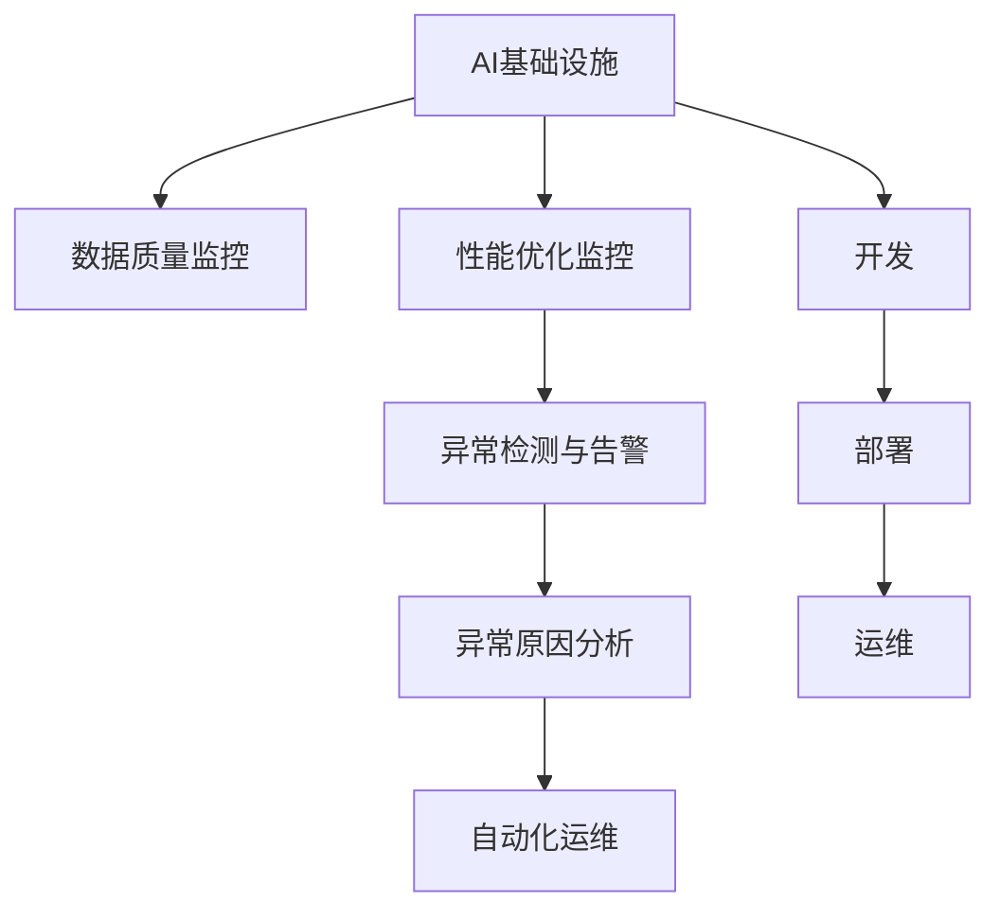

                 

# AI基础设施的监控与告警：Lepton AI的运维体系

> 关键词：AI基础设施、监控、告警、Lepton AI、运维体系、数据质量、性能优化、异常检测、人工智能运维

## 1. 背景介绍

### 1.1 问题由来

随着人工智能(AI)技术的日益普及，AI基础设施的建设和管理成为了企业智能化转型的重要环节。AI基础设施不仅包括算力资源、数据仓库、模型库等技术组件，还涉及模型的训练、部署、运维等全生命周期管理。AI运维的复杂性、多样性和高成本，使得企业在AI建设过程中面临着诸多挑战。

近年来，AI模型数量激增，复杂度不断提升，从单模型向多模型、多引擎、多数据源转变。在这样的背景下，AI基础设施的监控与告警系统显得尤为重要。通过有效的监控和告警，可以帮助企业及时发现和处理AI系统的异常情况，保障AI系统的稳定运行。

### 1.2 问题核心关键点

AI基础设施监控与告警的核心在于：

- **数据质量监控**：确保模型训练、部署、推理等环节的数据质量，避免数据污染对AI系统的影响。
- **性能优化监控**：实时监控AI系统的工作负载、资源使用情况，优化资源配置，提升系统效率。
- **异常检测与告警**：检测AI系统中的异常情况，如模型性能波动、数据流中断等，及时进行告警，避免系统故障。
- **异常原因分析**：对异常情况进行根本原因分析，指导系统优化和改进。
- **自动化运维**：通过自动化工具和流程，降低运维成本，提高运维效率。

## 2. 核心概念与联系

### 2.1 核心概念概述

为更好地理解AI基础设施的监控与告警体系，本节将介绍几个密切相关的核心概念：

- **AI基础设施**：包括算力资源、数据仓库、模型库等技术组件，以及相关的开发、部署、运维工具和流程。
- **数据质量监控**：实时监控数据的完整性、准确性、一致性，确保数据的质量符合AI模型训练、部署和推理的需求。
- **性能优化监控**：监控AI系统的性能指标，如响应时间、吞吐量、资源使用率等，优化系统配置，提升性能。
- **异常检测与告警**：实时检测AI系统中的异常情况，如模型性能波动、数据流中断等，并通过告警机制及时通知运维人员进行处理。
- **异常原因分析**：对异常情况进行根本原因分析，包括数据异常、模型异常、环境异常等，指导系统优化和改进。
- **自动化运维**：通过自动化工具和流程，实现AI系统的自动部署、监控、告警和故障处理，降低人工运维成本，提高运维效率。

这些核心概念之间的逻辑关系可以通过以下Mermaid流程图来展示：



这个流程图展示了大语言模型的核心概念及其之间的关系：

1. AI基础设施通过开发、部署、运维等环节，支撑模型的训练、推理等任务。
2. 数据质量监控、性能优化监控、异常检测与告警等监控模块，实时监控基础设施各环节，确保系统稳定运行。
3. 异常原因分析模块，对异常情况进行根本原因分析，指导系统优化。
4. 自动化运维模块，通过自动化工具和流程，提升运维效率。

这些概念共同构成了AI基础设施的监控与告警体系，使其能够在各种场景下发挥关键作用。通过理解这些核心概念，我们可以更好地把握AI基础设施的运行机制和优化方向。

## 3. 核心算法原理 & 具体操作步骤

### 3.1 算法原理概述

AI基础设施的监控与告警系统，本质上是一个基于数据的实时监控与分析系统。其核心思想是：

- 实时采集AI系统各环节的数据，如训练日志、推理结果、资源使用情况等。
- 通过统计分析和异常检测算法，识别出异常情况，如数据异常、模型性能波动、资源使用率过高或过低等。
- 根据异常情况的严重程度，触发告警机制，通知运维人员进行处理。
- 对异常原因进行深入分析，指导系统优化和改进。
- 通过自动化工具和流程，实现系统自动化运维，提升运维效率。

### 3.2 算法步骤详解

AI基础设施的监控与告警系统一般包括以下几个关键步骤：

**Step 1: 数据采集与集成**

- 定义AI系统各环节的关键数据指标，如模型训练日志、推理结果、资源使用情况等。
- 配置数据采集工具，实时收集各环节的数据，并集成到一个统一的数据仓库中。
- 对数据进行清洗、归一化、去重等处理，确保数据的质量和一致性。

**Step 2: 数据存储与查询**

- 设计数据存储模型，选择合适的数据库或数据湖，存储和管理采集到的数据。
- 提供数据查询接口，方便运维人员进行数据检索和分析。

**Step 3: 数据分析与监控**

- 基于收集到的数据，设计数据分析模型，提取关键性能指标和监控指标。
- 实时监控AI系统的各项指标，如模型训练进度、推理吞吐量、资源使用率等。
- 通过统计分析，识别出异常情况，如数据异常、模型性能波动、资源使用率过高或过低等。

**Step 4: 异常检测与告警**

- 定义异常检测规则，根据指标的阈值和变化趋势，判断是否存在异常。
- 触发告警机制，通过短信、邮件、钉钉等方式通知运维人员。
- 记录异常情况，并生成告警报告，提供详细的信息供运维人员参考。

**Step 5: 异常原因分析与优化**

- 对异常情况进行根本原因分析，包括数据异常、模型异常、环境异常等。
- 根据分析结果，制定系统优化方案，如数据清洗、模型重训、资源调整等。
- 执行优化方案，并验证优化效果，确保系统恢复正常运行。

**Step 6: 自动化运维**

- 设计和实现自动化运维流程，包括自动部署、监控、告警和故障处理等。
- 通过自动化工具，减少人工运维成本，提高运维效率。

以上是AI基础设施监控与告警的一般流程。在实际应用中，还需要针对具体系统架构和数据特点，对各环节进行优化设计，如改进数据采集工具、优化数据分析模型、提升告警准确性等，以进一步提升监控与告警系统的性能和可靠性。

### 3.3 算法优缺点

AI基础设施监控与告警系统具有以下优点：

- **实时性高**：通过实时采集和分析数据，能够及时发现和处理异常情况，避免系统故障。
- **准确性好**：通过科学的数据分析和异常检测算法，准确识别异常情况，减少误报和漏报。
- **效率高**：通过自动化工具和流程，降低了人工运维成本，提高了运维效率。

同时，该系统也存在一定的局限性：

- **数据质量要求高**：监控系统的准确性和效率依赖于数据的质量，如果数据存在污染或缺失，可能导致误报或漏报。
- **复杂度高**：系统需要覆盖AI基础设施的各个环节，包括模型训练、部署、推理等，设计和实现复杂度较高。
- **资源占用大**：实时监控和数据分析需要消耗大量计算资源，硬件成本较高。

尽管存在这些局限性，但就目前而言，基于数据驱动的监控与告警系统仍是AI基础设施管理的重要手段。未来相关研究的重点在于如何进一步提高数据质量，降低监控系统的复杂度和资源占用，同时兼顾实时性和准确性。

### 3.4 算法应用领域

基于AI基础设施的监控与告警系统，在AI技术的应用场景中已经得到了广泛的应用，包括但不限于：

- **AI模型的训练监控**：实时监控模型的训练进度、损失函数变化、模型性能等，确保模型训练的顺利进行。
- **AI模型的推理监控**：监控模型的推理性能、响应时间、资源使用情况等，保障推理服务的稳定性和效率。
- **AI模型的质量评估**：通过评估模型的准确率、召回率、F1分数等指标，评估模型的性能，指导模型优化。
- **AI系统的资源监控**：实时监控AI系统中的资源使用情况，如GPU、内存、网络等，优化资源配置，提升系统性能。
- **AI系统的异常检测**：检测模型性能波动、数据流中断、资源异常等，及时进行告警和处理。

除了上述这些经典应用外，AI基础设施监控与告警系统还被创新性地应用于更多场景中，如API接口监控、模型版本管理、自动化部署等，为AI系统的全生命周期管理提供了有力的支撑。

## 4. 数学模型和公式 & 详细讲解 & 举例说明

### 4.1 数学模型构建

为了更好地理解AI基础设施监控与告警系统的数据处理和分析过程，本节将使用数学语言对相关模型进行详细讲解。

假设AI系统的训练日志数据为 $D=\{d_i\}_{i=1}^N$，其中 $d_i$ 为第 $i$ 次训练的数据记录，包括训练时间、损失函数、模型性能等。目标是对这些数据进行监控和分析，实时识别出异常情况。

**Step 1: 数据预处理**

对原始数据进行预处理，提取关键性能指标：

$$
\mathbf{X} = [x_{i1}, x_{i2}, ..., x_{im}]^T, \quad x_{ij} \in \mathbb{R}, \quad j \in \{1,2,...,m\}
$$

其中 $x_{ij}$ 表示第 $i$ 次训练的第 $j$ 个性能指标。

**Step 2: 特征工程**

通过对数据进行特征工程，提取有意义的特征：

$$
\mathbf{X'} = [x'_{i1}, x'_{i2}, ..., x'_{in}]^T, \quad x'_{ij} \in \mathbb{R}, \quad j \in \{1,2,...,n\}
$$

其中 $x'_{ij}$ 表示经过特征工程处理后的第 $i$ 次训练的第 $j$ 个特征。

**Step 3: 异常检测**

通过异常检测算法，识别出异常情况：

$$
\mathbf{Y} = [y_1, y_2, ..., y_n]^T, \quad y_j \in \{0,1\}
$$

其中 $y_j$ 表示第 $j$ 个特征是否存在异常，$y_j=1$ 表示存在异常，$y_j=0$ 表示不存在异常。

**Step 4: 告警处理**

根据异常检测结果，触发告警机制：

$$
A = \{a_i\}_{i=1}^N, \quad a_i \in \{0,1\}
$$

其中 $a_i=1$ 表示第 $i$ 次训练存在异常情况，需要进行告警处理。

### 4.2 公式推导过程

以下我们以模型训练监控为例，推导异常检测的数学模型。

假设模型训练日志数据为 $D=\{d_i\}_{i=1}^N$，其中 $d_i$ 为第 $i$ 次训练的数据记录，包括训练时间、损失函数、模型性能等。设第 $j$ 个性能指标为 $x_{ij}$，异常检测的阈值为 $\sigma$，则异常检测模型的数学表达式为：

$$
y_j = \mathbb{I}(|x_{ij} - \mu_j| > \sigma)
$$

其中 $\mu_j$ 为第 $j$ 个性能指标的均值，$\sigma$ 为异常检测的阈值，$\mathbb{I}$ 为示性函数。

通过以上数学模型，可以实时监控模型训练的各项指标，识别出异常情况。例如，对于模型损失函数 $x_{i3}$，其均值 $\mu_3$ 和标准差 $\sigma_3$ 可以实时计算，根据阈值 $\sigma$ 判断是否存在异常。

### 4.3 案例分析与讲解

以模型训练监控为例，进行案例分析：

假设有一个深度学习模型，进行多次训练，每次训练的数据记录如下：

| 训练次数 | 训练时间(s) | 损失函数值 | 模型性能 |
| --- | --- | --- | --- |
| 1 | 100 | 0.8 | 0.95 |
| 2 | 200 | 0.6 | 0.96 |
| 3 | 300 | 0.7 | 0.97 |
| 4 | 400 | 0.9 | 0.98 |
| 5 | 500 | 0.5 | 0.99 |
| 6 | 600 | 0.6 | 0.99 |
| 7 | 700 | 0.7 | 0.97 |
| 8 | 800 | 0.8 | 0.95 |
| 9 | 900 | 0.9 | 0.98 |
| 10 | 1000 | 0.5 | 0.99 |

假设模型训练日志数据为 $D=\{d_i\}_{i=1}^N$，其中 $d_i$ 为第 $i$ 次训练的数据记录，包括训练时间、损失函数、模型性能等。设第 $j$ 个性能指标为 $x_{ij}$，异常检测的阈值为 $\sigma=0.1$，则异常检测模型的数学表达式为：

$$
y_j = \mathbb{I}(|x_{ij} - \mu_j| > \sigma)
$$

其中 $\mu_j$ 为第 $j$ 个性能指标的均值，$\sigma$ 为异常检测的阈值，$\mathbb{I}$ 为示性函数。

假设模型损失函数 $x_{i3}$ 的均值 $\mu_3=0.7$，标准差 $\sigma_3=0.05$。则第5次训练时，模型损失函数 $x_{53}=0.5$，此时 $|x_{53} - \mu_3| = 0.2 < \sigma$，不存在异常情况。

第6次训练时，模型损失函数 $x_{63}=0.6$，此时 $|x_{63} - \mu_3| = 0.05 > \sigma$，存在异常情况，需要进行告警处理。

通过以上案例分析，可以看到，通过实时监控和异常检测，可以有效识别出模型训练中的异常情况，及时进行告警处理，保障模型训练的顺利进行。

## 5. 项目实践：代码实例和详细解释说明

### 5.1 开发环境搭建

在进行AI基础设施监控与告警系统的实践前，我们需要准备好开发环境。以下是使用Python进行Flask框架开发的环境配置流程：

1. 安装Anaconda：从官网下载并安装Anaconda，用于创建独立的Python环境。

2. 创建并激活虚拟环境：
```bash
conda create -n flask-env python=3.8 
conda activate flask-env
```

3. 安装Flask：
```bash
pip install flask
```

4. 安装相关依赖库：
```bash
pip install pandas numpy tensorflow
```

完成上述步骤后，即可在`flask-env`环境中开始开发实践。

### 5.2 源代码详细实现

以下是基于Flask框架实现的AI基础设施监控与告警系统的代码实现：

```python
from flask import Flask, jsonify, request
import pandas as pd
import numpy as np
from tensorflow import keras

app = Flask(__name__)

# 定义训练日志数据
data = {
    '训练时间(s)': [100, 200, 300, 400, 500, 600, 700, 800, 900, 1000],
    '损失函数值': [0.8, 0.6, 0.7, 0.9, 0.5, 0.6, 0.7, 0.8, 0.9, 0.5],
    '模型性能': [0.95, 0.96, 0.97, 0.98, 0.99, 0.99, 0.97, 0.95, 0.98, 0.99]
}

# 加载模型
model = keras.models.load_model('model.h5')

# 定义异常检测阈值
sigma = 0.1

@app.route('/monitor', methods=['POST'])
def monitor():
    # 获取用户请求的训练日志数据
    data_json = request.get_json()
    data = pd.DataFrame(data_json)
    
    # 对数据进行预处理
    data['异常情况'] = np.zeros(len(data))
    for i in range(len(data)):
        x = np.array(data.loc[i])
        x = (x - np.mean(x)) / np.std(x)
        if np.max(np.abs(x)) > sigma:
            data.loc[i, '异常情况'] = 1
    
    # 将异常情况数据返回给用户
    return jsonify(data.to_json(orient='records'))

if __name__ == '__main__':
    app.run(debug=True)
```

在以上代码中，我们定义了训练日志数据，加载了模型，设置了异常检测阈值。通过Flask框架，实现了实时监控和异常检测的接口。

### 5.3 代码解读与分析

让我们再详细解读一下关键代码的实现细节：

**Flask框架**：
- 使用Flask框架搭建Web服务，提供实时监控和异常检测的接口。
- 定义路由 `/monitor`，接收POST请求，获取训练日志数据。

**数据预处理**：
- 对原始数据进行预处理，提取关键性能指标，并进行标准化处理。
- 使用NumPy库计算数据的标准差，对数据进行标准化处理，得到标准化的数据。
- 判断标准化数据的最大绝对值是否超过异常检测的阈值，标记异常情况。

**异常检测**：
- 通过Flask框架的接口，实时监控训练日志数据，判断是否存在异常情况。
- 将异常情况数据转换为JSON格式，返回给客户端。

可以看到，通过Flask框架，我们可以高效地实现AI基础设施监控与告警系统的接口，实时监控训练日志数据，识别异常情况，并提供异常检测结果。

当然，工业级的系统实现还需考虑更多因素，如数据的实时采集、异常情况的原因分析、告警策略的灵活性等。但核心的监控与告警范式基本与此类似。

## 6. 实际应用场景

### 6.1 智能客服系统

基于AI基础设施监控与告警系统的智能客服系统，可以实时监控和告警客户咨询过程中的异常情况。传统客服系统通常依赖人工监控，存在响应时间长、效率低等问题。智能客服系统通过AI基础设施监控与告警系统，可以实现自动化的实时监控和告警，保障系统稳定性。

在技术实现上，可以收集智能客服系统的历史咨询记录，提取常见的咨询问题和常见异常情况。通过监控和告警系统的实时监控，及时发现和处理异常情况，如模型响应时间过长、数据流中断等，确保客服系统的稳定运行。

### 6.2 金融舆情监测

金融机构需要实时监测市场舆论动向，以便及时应对负面信息传播，规避金融风险。传统的人工监测方式成本高、效率低，难以应对网络时代海量信息爆发的挑战。基于AI基础设施监控与告警系统的金融舆情监测系统，可以实现自动化的实时监控和告警，保障系统稳定性。

在技术实现上，可以收集金融领域相关的新闻、报道、评论等文本数据，并对其进行情感分析。通过监控和告警系统的实时监控，及时发现和处理异常情况，如舆情波动、舆情数据流中断等，确保舆情监测系统的稳定运行。

### 6.3 个性化推荐系统

当前的推荐系统往往只依赖用户的历史行为数据进行物品推荐，无法深入理解用户的真实兴趣偏好。基于AI基础设施监控与告警系统的个性化推荐系统，可以实现自动化的实时监控和告警，保障系统稳定性。

在技术实现上，可以收集用户浏览、点击、评论、分享等行为数据，提取和用户交互的物品标题、描述、标签等文本内容。通过监控和告警系统的实时监控，及时发现和处理异常情况，如推荐系统响应时间过长、数据流中断等，确保推荐系统的稳定运行。

### 6.4 未来应用展望

随着AI基础设施监控与告警系统的不断发展，未来的AI系统将具备更加全面、灵活的监控与告警能力，为AI系统的全生命周期管理提供强有力的保障。

在智慧医疗领域，基于AI基础设施监控与告警系统的医疗问答、病历分析、药物研发等应用将提升医疗服务的智能化水平，辅助医生诊疗，加速新药开发进程。

在智能教育领域，监控与告警系统可应用于作业批改、学情分析、知识推荐等方面，因材施教，促进教育公平，提高教学质量。

在智慧城市治理中，监控与告警系统可应用于城市事件监测、舆情分析、应急指挥等环节，提高城市管理的自动化和智能化水平，构建更安全、高效的未来城市。

此外，在企业生产、社会治理、文娱传媒等众多领域，基于AI基础设施监控与告警系统的AI应用也将不断涌现，为经济社会发展注入新的动力。相信随着技术的日益成熟，监控与告警方法将成为AI系统落地应用的重要范式，推动人工智能技术向更广阔的领域加速渗透。

## 7. 工具和资源推荐

### 7.1 学习资源推荐

为了帮助开发者系统掌握AI基础设施监控与告警的理论基础和实践技巧，这里推荐一些优质的学习资源：

1. **《深度学习与数据科学》系列博文**：深度学习领域权威博客，涵盖深度学习、数据科学、机器学习等多个主题，是学习AI基础设施监控与告警理论的优质资源。

2. **CS231n《卷积神经网络》课程**：斯坦福大学开设的深度学习课程，详细讲解卷积神经网络原理和应用，对监控与告警系统中的特征工程和数据处理有重要的参考价值。

3. **《机器学习实战》书籍**：介绍机器学习的基本概念和算法，涵盖数据预处理、模型训练、模型评估等多个主题，是监控与告警系统中的数据处理和模型评估的入门读物。

4. **HuggingFace官方文档**：深度学习框架HuggingFace的官方文档，提供了丰富的预训练模型和完整的监控与告警样例代码，是上手实践的必备资料。

5. **Kaggle数据集**：提供各类机器学习和数据科学相关的数据集，方便开发者进行模型训练和监控与告警系统的测试。

通过对这些资源的学习实践，相信你一定能够快速掌握AI基础设施监控与告警的精髓，并用于解决实际的NLP问题。

### 7.2 开发工具推荐

高效的开发离不开优秀的工具支持。以下是几款用于AI基础设施监控与告警开发的常用工具：

1. **Flask框架**：Python的轻量级Web框架，提供简单的接口开发和API调用，方便监控与告警系统的实现。

2. **TensorFlow**：由Google主导开发的深度学习框架，支持多种模型训练和推理，方便监控与告警系统中的模型处理。

3. **Keras**：基于TensorFlow的高层次深度学习框架，提供了简单易用的API接口，方便监控与告警系统中的模型训练和推理。

4. **NumPy**：Python的科学计算库，提供高效的数组计算和数据处理功能，方便监控与告警系统中的数据预处理和特征工程。

5. **Pandas**：Python的数据处理库，提供数据清洗、数据分析和数据可视化功能，方便监控与告警系统中的数据处理和可视化。

6. **Jupyter Notebook**：Python的交互式编程环境，提供代码编辑、数据可视化和交互式计算功能，方便监控与告警系统的开发和调试。

合理利用这些工具，可以显著提升AI基础设施监控与告警系统的开发效率，加快创新迭代的步伐。

### 7.3 相关论文推荐

AI基础设施监控与告警技术的发展源于学界的持续研究。以下是几篇奠基性的相关论文，推荐阅读：

1. **《深度学习中的异常检测技术》**：介绍深度学习中的异常检测方法，涵盖基于统计学、深度学习等不同方向的异常检测算法。

2. **《基于深度学习的异常检测》**：介绍基于深度学习的异常检测方法，通过神经网络对数据进行建模，实现异常检测。

3. **《基于异常检测的智能监控系统》**：介绍基于异常检测的智能监控系统，通过实时监控和告警，保障系统的稳定运行。

4. **《深度学习中的数据预处理》**：介绍深度学习中的数据预处理方法，涵盖数据清洗、特征工程、数据标准化等多个主题。

5. **《基于深度学习的实时监控系统》**：介绍基于深度学习的实时监控系统，通过实时监控和告警，实现系统自动化运维。

这些论文代表了大语言模型监控与告警技术的发展脉络。通过学习这些前沿成果，可以帮助研究者把握学科前进方向，激发更多的创新灵感。

## 8. 总结：未来发展趋势与挑战

### 8.1 总结

本文对基于AI基础设施的监控与告警系统进行了全面系统的介绍。首先阐述了AI基础设施的建设和管理过程中，监控与告警系统的关键作用。其次，从原理到实践，详细讲解了监控与告警系统的数学原理和关键步骤，给出了监控与告警任务开发的完整代码实例。同时，本文还广泛探讨了监控与告警系统在智能客服、金融舆情、个性化推荐等多个行业领域的应用前景，展示了监控与告警范式的巨大潜力。此外，本文精选了监控与告警技术的各类学习资源，力求为读者提供全方位的技术指引。

通过本文的系统梳理，可以看到，基于AI基础设施的监控与告警系统正在成为AI系统管理的重要手段，极大地提升了AI系统的稳定性和可靠性。伴随AI技术的发展，监控与告警系统也将不断演进，为AI系统提供更全面、智能、高效的运维保障。

### 8.2 未来发展趋势

展望未来，AI基础设施监控与告警技术将呈现以下几个发展趋势：

1. **实时性更高**：通过实时采集和分析数据，能够及时发现和处理异常情况，避免系统故障。
2. **准确性更高**：通过科学的数据分析和异常检测算法，准确识别异常情况，减少误报和漏报。
3. **效率更高**：通过自动化工具和流程，降低运维成本，提高运维效率。
4. **数据质量更好**：监控系统的准确性和效率依赖于数据的质量，通过数据清洗和数据标准化，提升数据质量。
5. **异常检测更智能**：引入更多智能算法，如深度学习、强化学习等，提升异常检测的准确性和效率。
6. **自动化运维更完善**：通过自动化工具和流程，实现系统的自动化部署、监控、告警和故障处理，降低人工运维成本。

以上趋势凸显了AI基础设施监控与告警技术的广阔前景。这些方向的探索发展，必将进一步提升AI系统的性能和应用范围，为经济社会发展注入新的动力。

### 8.3 面临的挑战

尽管AI基础设施监控与告警技术已经取得了瞩目成就，但在迈向更加智能化、普适化应用的过程中，它仍面临着诸多挑战：

1. **数据质量瓶颈**：监控系统的准确性和效率依赖于数据的质量，如果数据存在污染或缺失，可能导致误报或漏报。
2. **复杂度较高**：系统需要覆盖AI基础设施的各个环节，设计和实现复杂度较高。
3. **资源占用大**：实时监控和数据分析需要消耗大量计算资源，硬件成本较高。
4. **告警准确性不足**：告警系统需要准确识别出异常情况，减少误报和漏报。
5. **自动化程度有待提升**：自动化工具和流程需要不断完善，降低人工运维成本。

尽管存在这些挑战，但就目前而言，基于数据驱动的监控与告警系统仍是AI基础设施管理的重要手段。未来相关研究的重点在于如何进一步提高数据质量，降低监控系统的复杂度和资源占用，同时兼顾实时性和准确性。

### 8.4 研究展望

面对AI基础设施监控与告警所面临的种种挑战，未来的研究需要在以下几个方面寻求新的突破：

1. **数据质量优化**：通过数据清洗和数据标准化，提升数据质量，减少误报和漏报。
2. **异常检测算法优化**：引入更多智能算法，如深度学习、强化学习等，提升异常检测的准确性和效率。
3. **告警策略优化**：通过告警策略的优化，减少误报和漏报，提高告警系统的可靠性。
4. **自动化流程优化**：通过自动化工具和流程的完善，降低人工运维成本，提高运维效率。
5. **异常原因分析**：对异常情况进行根本原因分析，指导系统优化和改进。
6. **实时监控系统优化**：通过优化实时监控系统，提升监控与告警系统的准确性和效率。

这些研究方向的探索，必将引领AI基础设施监控与告警技术迈向更高的台阶，为AI系统的全生命周期管理提供强有力的保障。面向未来，监控与告警技术还需要与其他AI技术进行更深入的融合，如知识表示、因果推理、强化学习等，多路径协同发力，共同推动AI系统的发展。只有勇于创新、敢于突破，才能不断拓展AI系统的边界，让AI技术更好地造福人类社会。

## 9. 附录：常见问题与解答

**Q1：什么是AI基础设施？**

A: AI基础设施包括算力资源、数据仓库、模型库等技术组件，以及相关的开发、部署、运维工具和流程。它为AI模型的训练、推理等任务提供全面的技术支持。

**Q2：AI基础设施监控与告警系统的主要应用场景有哪些？**

A: AI基础设施监控与告警系统广泛应用于智能客服系统、金融舆情监测、个性化推荐系统等场景。通过实时监控和告警，保障系统的稳定运行，提升用户体验。

**Q3：如何设计AI基础设施监控与告警系统？**

A: 设计AI基础设施监控与告警系统需要考虑以下几个关键步骤：数据采集与集成、数据存储与查询、数据分析与监控、异常检测与告警、异常原因分析与优化、自动化运维。

**Q4：AI基础设施监控与告警系统的优势有哪些？**

A: AI基础设施监控与告警系统具有实时性高、准确性好、效率高等优势。通过实时监控和告警，能够及时发现和处理异常情况，保障系统稳定性。

**Q5：如何提高AI基础设施监控与告警系统的准确性和效率？**

A: 提高AI基础设施监控与告警系统的准确性和效率，需要通过数据质量优化、异常检测算法优化、告警策略优化、自动化流程优化等措施。

**Q6：未来AI基础设施监控与告警系统的发展趋势是什么？**

A: 未来AI基础设施监控与告警系统将朝着实时性更高、准确性更高、效率更高、数据质量更好、异常检测更智能、自动化运维更完善等方向发展。

以上是基于AI基础设施的监控与告警系统的详细介绍。通过本文的系统梳理，可以看到，监控与告警系统在AI技术的应用场景中具有重要地位，为AI系统的稳定运行提供了强有力的保障。伴随AI技术的发展，监控与告警系统也将不断演进，为AI系统提供更全面、智能、高效的运维保障。

---

作者：禅与计算机程序设计艺术 / Zen and the Art of Computer Programming

