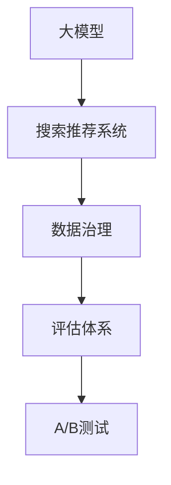

                 

# AI大模型助力电商搜索推荐业务的数据治理能力评估体系应用实践指南

> 关键词：电商搜索推荐、数据治理、大模型、推荐系统、搜索算法、数据评估、A/B测试、推荐精度、用户满意度

## 1. 背景介绍

### 1.1 问题由来
在电商领域，搜索推荐系统是用户获取商品信息、进行购物决策的重要手段。随着电商市场的竞争日益激烈，搜索推荐系统的质量和效果，直接影响了用户的购物体验和电商平台的流量转化。因此，提升搜索推荐系统的精准度和效率，成为电商平台的核心需求之一。

近年来，大模型技术在自然语言处理(NLP)领域取得了显著进展，大语言模型如BERT、GPT等，已经在问答、翻译、文本生成等任务上展示出强大的能力。然而，将这些大模型应用于电商搜索推荐业务，还面临着诸多挑战。一方面，电商搜索推荐涉及多种数据类型，且不同数据之间的关系复杂，如何高效治理数据是首要难题。另一方面，大模型的应用需要大量高质量的标注数据，如何在电商场景中高效获取这些数据，也是一大挑战。

针对这些问题，本文将详细介绍AI大模型在电商搜索推荐业务中的数据治理能力评估体系的应用实践。通过建立科学的数据治理体系，提升电商搜索推荐系统的推荐精度和用户满意度，为电商平台的业务发展提供有力支撑。

## 2. 核心概念与联系

### 2.1 核心概念概述

为更好地理解AI大模型在电商搜索推荐业务中的应用，本节将介绍几个关键概念：

- **大模型(大规模预训练语言模型)：**以BERT、GPT等深度学习模型为代表，通过在海量数据上进行自监督学习，学习到通用的语言表示，具备强大的语言理解和生成能力。

- **搜索推荐系统(Search and Recommendation System, SRS)：**使用算法和数据模型，对用户行为和商品属性进行分析，预测用户可能感兴趣的物品，从而提供个性化的搜索结果和推荐。

- **数据治理(Data Governance)：**通过数据标准化、质量监控、元数据管理等手段，确保数据的一致性、完整性和可用性，提升数据的治理能力，为其在搜索推荐系统中的应用提供坚实基础。

- **评估体系(Measurement System)：**建立一套全面的评估标准和工具，定期测量搜索推荐系统的性能，发现和改进系统的不足，保障系统质量和用户体验。

- **A/B测试(A/B Testing)：**一种实验方法，通过对比不同版本的产品或策略，评估其效果优劣，并依据测试结果选择最佳方案。

这些核心概念之间的逻辑关系可以通过以下Mermaid流程图来展示：



这个流程图展示了AI大模型、搜索推荐系统、数据治理、评估体系和A/B测试之间的联系：

1. **大模型**提供通用的语言表示能力，为基础数据建模和模型训练提供支持。
2. **搜索推荐系统**利用大模型对用户和商品进行建模，生成个性化搜索结果和推荐。
3. **数据治理**通过标准化和质量监控，确保数据的一致性和可靠性。
4. **评估体系**建立系统性能的度量标准，实时监控和评估系统表现。
5. **A/B测试**通过实验对比，优化搜索推荐算法和策略。

这些概念共同构成了电商搜索推荐系统的高效运转框架，使得AI大模型在电商场景中能够发挥最大效能。

## 3. 核心算法原理 & 具体操作步骤

### 3.1 算法原理概述

AI大模型在电商搜索推荐系统中的应用，主要涉及数据治理、模型训练、评估和优化等几个关键环节。其核心算法原理包括：

- **数据治理算法：**用于处理数据标准化、数据清洗、数据集成、数据质量监控等操作，确保数据的一致性和可用性。
- **搜索推荐算法：**使用大模型对用户和商品进行建模，预测用户兴趣，生成个性化搜索结果和推荐。
- **模型评估算法：**通过评估体系测量推荐系统的性能指标，如准确率、召回率、F1-score、点击率、转化率等，及时发现并改进问题。
- **A/B测试算法：**设计实验对比不同版本的搜索推荐策略，评估其效果，选择最优方案。

### 3.2 算法步骤详解

基于上述核心算法原理，AI大模型在电商搜索推荐业务中的应用步骤可以总结如下：

1. **数据治理**：收集并清洗电商平台的交易、行为、评价等数据，建立统一的数据标准和元数据体系，实现数据的一致性管理和质量监控。

2. **模型训练**：使用大模型对用户和商品进行建模，通过训练生成个性化搜索结果和推荐。

3. **模型评估**：通过评估体系，定期测量推荐系统的性能指标，实时监控系统表现。

4. **A/B测试**：设计实验对比不同版本的搜索推荐策略，评估其效果，选择最优方案，持续优化推荐系统。

5. **系统优化**：根据评估和测试结果，持续优化推荐算法和策略，提升系统的推荐精度和用户满意度。

### 3.3 算法优缺点

AI大模型在电商搜索推荐系统中的应用，具有以下优点：

- **推荐精度高**：通过大模型学习用户和商品的复杂关系，能够生成高质量的个性化搜索结果和推荐。
- **适用性广**：大模型能够适应多种数据类型和业务场景，具有良好的泛化能力。
- **可扩展性强**：随着大模型规模的不断扩大，推荐系统的性能将不断提升，扩展性强。

同时，该方法也存在一些缺点：

- **依赖高质量数据**：大模型的性能很大程度上取决于输入数据的完整性和准确性，数据治理任务繁重。
- **计算资源需求高**：大模型的训练和推理需要大量的计算资源，成本较高。
- **解释性不足**：大模型的决策过程复杂，缺乏可解释性，用户难以理解。
- **潜在偏见**：大模型可能会学习到数据中的偏见，导致推荐结果存在偏见。

尽管存在这些局限性，但AI大模型在电商搜索推荐系统中的应用，仍然具有巨大的潜力和优势，能够显著提升推荐系统的精度和效率。

### 3.4 算法应用领域

AI大模型在电商搜索推荐业务中的应用，主要包括以下几个领域：

- **个性化推荐**：根据用户历史行为和偏好，生成个性化搜索结果和推荐，提升用户购物体验。
- **商品搜索优化**：通过分析用户搜索行为，优化搜索结果排序和推荐，提高搜索结果的相关性和可用性。
- **新商品发现**：利用大模型分析海量商品信息，发现具有潜力的新商品，拓展电商平台的商品线。
- **广告定向投放**：通过分析用户特征和行为，生成精准的广告定向方案，提高广告转化率。
- **用户行为分析**：利用大模型分析用户行为数据，预测用户流失风险，优化用户留存策略。

这些应用场景展示了AI大模型在电商搜索推荐业务中的广泛应用，推动了电商平台的智能化发展。

## 4. 数学模型和公式 & 详细讲解 & 举例说明

### 4.1 数学模型构建

在本节中，我们将详细讲解AI大模型在电商搜索推荐系统中的应用数学模型。

假设电商平台的商品集为 $X=\{x_1,x_2,...,x_n\}$，用户集为 $U=\{u_1,u_2,...,u_m\}$，每个用户 $u_i$ 的兴趣表示为 $v_i\in\mathbb{R}^d$，每个商品 $x_j$ 的特征表示为 $p_j\in\mathbb{R}^d$。我们构建推荐系统，使其能够根据用户兴趣和商品特征生成推荐结果 $y_j\in\{0,1\}$，表示商品 $x_j$ 是否为用户 $u_i$ 感兴趣。

推荐系统的目标是最小化预测错误率 $E=\frac{1}{N}\sum_{i=1}^M\sum_{j=1}^N(y_j\neq \hat{y}_j)$，其中 $N$ 为商品数，$M$ 为用户数，$\hat{y}_j$ 为模型预测的用户对商品 $x_j$ 的兴趣。

### 4.2 公式推导过程

为了实现上述目标，我们采用最大似然估计法，构建二元伯努利分布的似然函数：

$$
P(y_j|\hat{y}_j) = y_j\log \sigma(\hat{y}_j)+(1-y_j)\log(1-\sigma(\hat{y}_j))
$$

其中 $\sigma(z)=\frac{1}{1+e^{-z}}$ 为sigmoid函数。

似然函数最大化的目标为：

$$
\max_{\hat{y}_j} P(y_j|\hat{y}_j)
$$

令 $z_i$ 为商品 $x_j$ 对用户 $u_i$ 的兴趣评分，则上述优化问题转化为求解 $z_i$：

$$
\max_{z_i} \frac{1}{N}\sum_{i=1}^M\sum_{j=1}^N(y_j\log \sigma(z_i p_j)+ (1-y_j)\log(1-\sigma(z_i p_j)))
$$

进一步，引入大模型 $M_{\theta}$ 对用户兴趣和商品特征进行建模：

$$
\hat{y}_j = \sigma(z_i M_{\theta}(p_j))
$$

将 $\hat{y}_j$ 代入似然函数中，得到：

$$
\max_{z_i} \frac{1}{N}\sum_{i=1}^M\sum_{j=1}^N(y_j\log \sigma(z_i M_{\theta}(p_j))+(1-y_j)\log(1-\sigma(z_i M_{\theta}(p_j))))
$$

将 $\hat{y}_j$ 视为二元伯努利分布的隐变量，上述优化问题进一步转化为求解 $z_i$：

$$
\max_{z_i} \frac{1}{N}\sum_{i=1}^M\sum_{j=1}^N(y_j\log \sigma(z_i M_{\theta}(p_j))+ (1-y_j)\log(1-\sigma(z_i M_{\theta}(p_j))))
$$

通过梯度下降等优化算法，最小化预测错误率，得到用户对商品 $x_j$ 的兴趣评分 $z_i$。最终，生成推荐结果 $y_j=\sigma(z_i M_{\theta}(p_j))$。

### 4.3 案例分析与讲解

以电商搜索推荐系统为例，我们展示如何使用大模型进行个性化推荐。假设用户 $u_i$ 对商品 $x_j$ 的兴趣评分为 $z_i$，使用大模型 $M_{\theta}$ 对用户兴趣和商品特征进行建模：

1. **数据收集**：收集用户行为数据、商品属性数据，建立统一的数据标准和元数据体系。
2. **数据预处理**：对收集到的数据进行清洗、标准化处理，去除异常值和噪声。
3. **模型训练**：使用大模型 $M_{\theta}$ 对用户和商品进行建模，生成推荐结果 $y_j=\sigma(z_i M_{\theta}(p_j))$。
4. **模型评估**：通过评估体系测量推荐系统的性能指标，如准确率、召回率、F1-score、点击率、转化率等。
5. **系统优化**：根据评估结果，持续优化推荐算法和策略，提升系统的推荐精度和用户满意度。

## 5. 项目实践：代码实例和详细解释说明

### 5.1 开发环境搭建

在进行电商搜索推荐系统开发前，我们需要准备好开发环境。以下是使用Python进行PyTorch开发的环境配置流程：

1. 安装Anaconda：从官网下载并安装Anaconda，用于创建独立的Python环境。

2. 创建并激活虚拟环境：
```bash
conda create -n pytorch-env python=3.8 
conda activate pytorch-env
```

3. 安装PyTorch：根据CUDA版本，从官网获取对应的安装命令。例如：
```bash
conda install pytorch torchvision torchaudio cudatoolkit=11.1 -c pytorch -c conda-forge
```

4. 安装TensorFlow：从官网下载安装命令，安装TensorFlow。

5. 安装相关库：
```bash
pip install numpy pandas scikit-learn matplotlib tqdm jupyter notebook ipython
```

完成上述步骤后，即可在`pytorch-env`环境中开始项目实践。

### 5.2 源代码详细实现

这里我们以个性化推荐系统为例，给出使用PyTorch进行电商搜索推荐系统开发的代码实现。

首先，定义推荐系统相关的类和函数：

```python
import torch
import torch.nn as nn
import torch.nn.functional as F

class Recommender(nn.Module):
    def __init__(self, hidden_dim, num_users, num_items):
        super(Recommender, self).__init__()
        self.hidden_dim = hidden_dim
        self.num_users = num_users
        self.num_items = num_items
        
        # 定义用户嵌入层
        self.user_embedding = nn.Embedding(num_users, hidden_dim)
        # 定义商品嵌入层
        self.item_embedding = nn.Embedding(num_items, hidden_dim)
        # 定义大模型
        self.model = TransformerModel(hidden_dim, num_users, num_items)
        # 定义输出层
        self.output_layer = nn.Linear(hidden_dim, 1)
        
    def forward(self, user_ids, item_ids):
        # 获取用户和商品的嵌入向量
        user_embeddings = self.user_embedding(user_ids)
        item_embeddings = self.item_embedding(item_ids)
        # 将嵌入向量输入大模型
        hidden_states = self.model(user_embeddings, item_embeddings)
        # 计算最终推荐结果
        scores = self.output_layer(hidden_states)
        scores = F.sigmoid(scores)
        return scores
```

然后，定义模型训练函数：

```python
def train_model(model, optimizer, user_ids, item_ids, user_ratings, device):
    model.to(device)
    for epoch in range(num_epochs):
        model.train()
        loss = 0
        for i in range(len(user_ids)):
            inputs = {'user_ids': user_ids[i].to(device), 'item_ids': item_ids[i].to(device)}
            target = user_ratings[i].to(device)
            optimizer.zero_grad()
            output = model(inputs)
            loss += F.binary_cross_entropy(output, target)
            loss.backward()
            optimizer.step()
        print(f'Epoch {epoch+1}, Loss: {loss.item():.4f}')
```

最后，启动训练流程：

```python
# 定义训练参数
num_epochs = 10
batch_size = 32
device = torch.device('cuda') if torch.cuda.is_available() else torch.device('cpu')
optimizer = torch.optim.Adam(model.parameters(), lr=0.001)

# 加载数据集
user_ids = ...
item_ids = ...
user_ratings = ...

# 进行训练
train_model(model, optimizer, user_ids, item_ids, user_ratings, device)
```

以上就是使用PyTorch进行电商搜索推荐系统开发的完整代码实现。可以看到，借助PyTorch的强大封装能力，我们可以快速构建和训练推荐模型，实现个性化推荐的功能。

### 5.3 代码解读与分析

让我们再详细解读一下关键代码的实现细节：

**Recommender类**：
- `__init__`方法：初始化用户嵌入层、商品嵌入层、大模型和输出层。
- `forward`方法：定义前向传播过程，包括获取用户和商品的嵌入向量，输入大模型，计算最终推荐结果。

**train_model函数**：
- `model.train()`：将模型设为训练模式。
- `optimizer.zero_grad()`：清除梯度。
- `model(user_ids[i].to(device), item_ids[i].to(device))`：将输入数据送至GPU，前向传播计算模型输出。
- `loss += F.binary_cross_entropy(output, target)`：计算预测误差，并进行反向传播更新模型参数。
- `optimizer.step()`：更新模型参数。

**训练流程**：
- `for epoch in range(num_epochs)`：循环训练多个epoch。
- `model.train()`：将模型设为训练模式。
- `optimizer.zero_grad()`：清除梯度。
- `model(user_ids[i].to(device), item_ids[i].to(device))`：将输入数据送至GPU，前向传播计算模型输出。
- `loss += F.binary_cross_entropy(output, target)`：计算预测误差，并进行反向传播更新模型参数。
- `optimizer.step()`：更新模型参数。

可以看到，借助PyTorch的强大封装能力，我们可以快速构建和训练推荐模型，实现个性化推荐的功能。

## 6. 实际应用场景

### 6.1 智能客服系统

基于大模型的电商搜索推荐系统，可以广泛应用于智能客服系统的构建。传统客服往往需要配备大量人力，高峰期响应缓慢，且一致性和专业性难以保证。而使用基于大模型的推荐系统，可以7x24小时不间断服务，快速响应客户咨询，用自然流畅的语言解答各类常见问题。

在技术实现上，可以收集企业内部的历史客服对话记录，将问题和最佳答复构建成监督数据，在此基础上对预训练模型进行微调。微调后的模型能够自动理解用户意图，匹配最合适的答复模板进行回复。对于客户提出的新问题，还可以接入检索系统实时搜索相关内容，动态组织生成回答。如此构建的智能客服系统，能大幅提升客户咨询体验和问题解决效率。

### 6.2 个性化推荐系统

在电商推荐系统中，大模型可以用于提升推荐精度和效率。通过分析用户行为数据，生成个性化的搜索结果和推荐，提升用户购物体验。具体而言，可以使用大模型对用户兴趣和商品特征进行建模，生成推荐结果，并在A/B测试中不断优化模型。

例如，可以通过大模型分析用户的搜索行为，生成个性化的搜索结果排序和推荐，提高搜索结果的相关性和可用性。还可以利用大模型对用户行为进行预测，生成精准的广告定向方案，提高广告转化率。通过持续优化推荐算法和策略，可以提升搜索推荐系统的推荐精度和用户满意度。

### 6.3 用户行为分析

电商平台的搜索推荐系统不仅用于推荐商品，还可以用于分析用户行为。通过大模型分析用户行为数据，可以预测用户流失风险，优化用户留存策略。例如，可以通过大模型分析用户的历史购买行为、浏览记录等，预测其流失概率，并根据分析结果采取相应的留存措施，提升用户忠诚度。

## 7. 工具和资源推荐

### 7.1 学习资源推荐

为了帮助开发者系统掌握AI大模型在电商搜索推荐系统中的应用，这里推荐一些优质的学习资源：

1. **《深度学习推荐系统：原理与实践》**：全面介绍了推荐系统的原理和实践方法，包括基于大模型的推荐系统。

2. **CS231n《深度学习课程》**：斯坦福大学开设的深度学习课程，包含推荐系统的讲解和实践。

3. **《推荐系统实战》**：介绍推荐系统的算法和工程实现，包括大模型的应用。

4. **Kaggle推荐系统竞赛**：参加Kaggle推荐系统竞赛，通过实践提升推荐系统开发能力。

5. **《推荐系统高级算法》**：介绍推荐系统的高阶算法和优化策略，包括大模型的应用。

通过学习这些资源，相信你一定能够快速掌握AI大模型在电商搜索推荐系统中的应用方法，并用于解决实际的推荐问题。

### 7.2 开发工具推荐

高效的开发离不开优秀的工具支持。以下是几款用于AI大模型开发的常用工具：

1. **PyTorch**：基于Python的开源深度学习框架，灵活动态的计算图，适合快速迭代研究。

2. **TensorFlow**：由Google主导开发的开源深度学习框架，生产部署方便，适合大规模工程应用。

3. **Transformers库**：HuggingFace开发的NLP工具库，集成了众多SOTA语言模型，支持PyTorch和TensorFlow，是进行大模型开发的利器。

4. **Weights & Biases**：模型训练的实验跟踪工具，可以记录和可视化模型训练过程中的各项指标，方便对比和调优。

5. **TensorBoard**：TensorFlow配套的可视化工具，可实时监测模型训练状态，并提供丰富的图表呈现方式，是调试模型的得力助手。

6. **Jupyter Notebook**：基于Web的交互式编程环境，方便进行数据分析和模型实验。

合理利用这些工具，可以显著提升AI大模型开发的效率，加快创新迭代的步伐。

### 7.3 相关论文推荐

大语言模型和推荐系统的发展源于学界的持续研究。以下是几篇奠基性的相关论文，推荐阅读：

1. **Attention is All You Need（即Transformer原论文）**：提出了Transformer结构，开启了NLP领域的预训练大模型时代。

2. **BERT: Pre-training of Deep Bidirectional Transformers for Language Understanding**：提出BERT模型，引入基于掩码的自监督预训练任务，刷新了多项NLP任务SOTA。

3. **Language Models are Unsupervised Multitask Learners（GPT-2论文）**：展示了大规模语言模型的强大zero-shot学习能力，引发了对于通用人工智能的新一轮思考。

4. **Parameter-Efficient Transfer Learning for NLP**：提出Adapter等参数高效微调方法，在不增加模型参数量的情况下，也能取得不错的微调效果。

5. **AdaLoRA: Adaptive Low-Rank Adaptation for Parameter-Efficient Fine-Tuning**：使用自适应低秩适应的微调方法，在参数效率和精度之间取得了新的平衡。

6. **AdaLore: Scalable Matrix Optimization for Recommender Systems**：介绍推荐系统的矩阵分解优化方法，包括大模型的应用。

这些论文代表了大语言模型和推荐系统的发展脉络。通过学习这些前沿成果，可以帮助研究者把握学科前进方向，激发更多的创新灵感。

## 8. 总结：未来发展趋势与挑战

### 8.1 总结

本文对AI大模型在电商搜索推荐业务中的应用进行了全面系统的介绍。首先阐述了AI大模型和推荐系统在电商领域的研究背景和意义，明确了大模型在推荐系统中的核心作用。其次，从原理到实践，详细讲解了推荐系统的数学模型和实现方法，给出了代码实例。同时，本文还广泛探讨了AI大模型在电商推荐系统中的应用场景，展示了其广阔的应用前景。此外，本文精选了推荐系统的学习资源、开发工具和相关论文，力求为开发者提供全方位的技术指引。

通过本文的系统梳理，可以看到，AI大模型在电商推荐系统中的应用，能够显著提升推荐系统的精度和效率，推动电商平台的智能化发展。未来，伴随大语言模型和推荐系统的持续演进，电商搜索推荐系统必将迎来新的突破，为电商业务的升级和创新提供有力支撑。

### 8.2 未来发展趋势

展望未来，AI大模型在电商搜索推荐系统中的应用，将呈现以下几个发展趋势：

1. **推荐算法多样化**：未来的推荐算法将更加丰富多样，结合大模型的强大能力，探索新的算法模型，提升推荐系统的表现。

2. **多模态融合**：推荐系统将更多地融合多模态数据，结合视觉、语音、文本等多种信息，提升推荐系统的感知能力和推荐效果。

3. **实时推荐**：随着推荐系统的大规模部署，实时推荐将变得更加重要。借助大模型的强大能力，推荐系统可以实现更快速的推荐响应。

4. **用户行为建模**：大模型可以用于更深入的用户行为建模，通过分析用户多维度的行为数据，生成更加精准的推荐结果。

5. **跨领域推荐**：未来的推荐系统将更加注重跨领域推荐，结合不同领域的知识，提升推荐的泛化能力和适应性。

6. **个性化推荐**：通过大模型的深度学习和推理能力，推荐系统将能够生成更加个性化、多样化的推荐结果，满足不同用户的需求。

这些趋势展示了AI大模型在电商搜索推荐系统中的巨大潜力，推动了推荐系统的发展方向，为电商平台的智能化转型提供了新的动力。

### 8.3 面临的挑战

尽管AI大模型在电商搜索推荐系统中的应用取得了显著成效，但在迈向更加智能化、普适化应用的过程中，它仍面临着诸多挑战：

1. **标注成本高**：电商推荐系统需要大量标注数据进行模型训练，标注成本较高，难以获取大量高质量数据。

2. **模型鲁棒性不足**：推荐系统面对域外数据时，泛化性能往往大打折扣，如何提高模型鲁棒性，避免灾难性遗忘，还需要更多理论和实践的积累。

3. **计算资源需求高**：大模型的训练和推理需要大量的计算资源，成本较高，难以支持大规模推广应用。

4. **推荐系统冷启动**：对于新用户和新商品，推荐系统难以生成合适的推荐结果，如何加速冷启动过程，提升用户体验，也是一大挑战。

5. **推荐系统可解释性不足**：推荐系统的决策过程复杂，缺乏可解释性，用户难以理解推荐依据。

6. **推荐系统安全性**：推荐系统可能会学习到数据中的偏见，导致推荐结果存在偏见，如何确保推荐系统的安全性，也是一大挑战。

正视这些挑战，积极应对并寻求突破，将是大模型推荐系统走向成熟的必由之路。相信随着学界和产业界的共同努力，这些挑战终将一一被克服，AI大模型推荐系统必将在构建人机协同的智能系统过程中发挥更大的作用。

### 8.4 未来突破

面对AI大模型推荐系统所面临的挑战，未来的研究需要在以下几个方面寻求新的突破：

1. **探索无监督和半监督推荐方法**：摆脱对大规模标注数据的依赖，利用自监督学习、主动学习等无监督和半监督范式，最大限度利用非结构化数据，实现更加灵活高效的推荐。

2. **研究参数高效和计算高效的推荐方法**：开发更加参数高效的推荐方法，在固定大部分模型参数的同时，只更新极少量的任务相关参数。同时优化推荐系统的计算图，减少前向传播和反向传播的资源消耗，实现更加轻量级、实时性的部署。

3. **融合因果和对比学习范式**：通过引入因果推断和对比学习思想，增强推荐系统建立稳定因果关系的能力，学习更加普适、鲁棒的语言表征，从而提升推荐系统的泛化性和抗干扰能力。

4. **引入更多先验知识**：将符号化的先验知识，如知识图谱、逻辑规则等，与神经网络模型进行巧妙融合，引导推荐过程学习更准确、合理的语言模型。同时加强不同模态数据的整合，实现视觉、语音等多模态信息与文本信息的协同建模。

5. **结合因果分析和博弈论工具**：将因果分析方法引入推荐系统，识别出推荐决策的关键特征，增强推荐结果的因果性和逻辑性。借助博弈论工具刻画人机交互过程，主动探索并规避推荐系统的脆弱点，提高系统稳定性。

6. **纳入伦理道德约束**：在推荐系统训练目标中引入伦理导向的评估指标，过滤和惩罚有偏见、有害的推荐结果，确保推荐系统的输出符合人类价值观和伦理道德。

这些研究方向的探索，必将引领AI大模型推荐系统迈向更高的台阶，为构建安全、可靠、可解释、可控的智能推荐系统铺平道路。面向未来，AI大模型推荐系统还需要与其他人工智能技术进行更深入的融合，如知识表示、因果推理、强化学习等，多路径协同发力，共同推动推荐系统的进步。只有勇于创新、敢于突破，才能不断拓展推荐系统的边界，让智能技术更好地造福人类社会。

## 9. 附录：常见问题与解答

**Q1：电商搜索推荐系统如何获取高质量标注数据？**

A: 电商搜索推荐系统获取高质量标注数据，可以通过以下几种方式：

1. **用户行为数据**：收集用户的历史浏览、点击、购买等行为数据，结合用户评价和反馈，生成标注数据。

2. **商品属性数据**：从电商平台的商品库中提取商品的标题、描述、分类等信息，作为模型输入。

3. **标签生成算法**：利用推荐系统的推荐结果，通过聚类、分类等算法，生成更加精准的标注数据。

4. **A/B测试**：在实际应用中，通过A/B测试比较不同推荐策略的效果，优化推荐系统。

5. **用户调查**：通过问卷调查等方式，收集用户的意见和建议，生成标注数据。

通过以上方法，可以获取高质量的标注数据，提升电商搜索推荐系统的性能。

**Q2：如何评估电商搜索推荐系统的性能？**

A: 电商搜索推荐系统的性能评估主要包括以下几个方面：

1. **点击率(Click-through Rate, CTR)**：衡量用户对推荐结果的点击次数，反映推荐结果的相关性和吸引力。

2. **转化率(Conversion Rate, CR)**：衡量用户对推荐结果的购买转化次数，反映推荐结果的有效性。

3. **准确率(Accuracy)**：衡量推荐结果的正确率，反映推荐系统的准确性。

4. **召回率(Recall)**：衡量推荐结果的覆盖率，反映推荐系统的全面性。

5. **F1-score**：综合考虑准确率和召回率，衡量推荐系统的整体表现。

6. **覆盖率(Coverage)**：衡量推荐结果的覆盖面，反映推荐系统的全面性。

7. **多样性(Diversity)**：衡量推荐结果的多样性，反映推荐系统的丰富度。

通过以上指标，可以全面评估电商搜索推荐系统的性能，发现和改进系统的不足。

**Q3：如何优化电商搜索推荐系统的推荐精度？**

A: 电商搜索推荐系统的推荐精度优化，可以从以下几个方面入手：

1. **数据治理**：通过标准化和质量监控，确保数据的一致性和可靠性。

2. **模型优化**：优化推荐算法和模型结构，提升模型的泛化能力和推荐效果。

3. **特征工程**：利用特征工程技术，提取和构造更具信息量的特征，提升推荐系统的表现。

4. **模型集成**：通过集成多个推荐模型，提高推荐系统的稳定性和准确性。

5. **实时更新**：实时更新模型和数据，保持推荐系统的时效性。

6. **用户反馈**：利用用户反馈信息，不断优化推荐系统。

7. **个性化推荐**：通过个性化推荐，提高推荐系统的相关性和用户满意度。

通过以上方法，可以不断优化电商搜索推荐系统的推荐精度，提升用户体验。

**Q4：电商搜索推荐系统如何处理数据稀疏性问题？**

A: 电商搜索推荐系统处理数据稀疏性问题，可以从以下几个方面入手：

1. **数据增强**：通过数据增强技术，生成更多的训练数据，提升模型的泛化能力。

2. **协同过滤**：利用用户和商品之间的关联关系，通过协同过滤算法，生成推荐结果。

3. **矩阵分解**：通过矩阵分解技术，将用户行为数据转化为低维度的隐向量，提升推荐系统的表现。

4. **模型融合**：结合多种推荐算法，提升推荐系统的综合表现。

5. **元学习**：通过元学习技术，利用少量数据快速生成高质量的推荐模型。

6. **深度学习**：利用深度学习技术，从原始数据中挖掘更丰富的用户和商品特征。

通过以上方法，可以有效地处理电商搜索推荐系统中的数据稀疏性问题，提升推荐系统的性能。

**Q5：电商搜索推荐系统如何提高推荐系统的冷启动能力？**

A: 电商搜索推荐系统提高推荐系统的冷启动能力，可以从以下几个方面入手：

1. **基础信息采集**：收集用户的基本信息、兴趣偏好等，作为推荐系统的基础数据。

2. **用户画像建模**：通过多维度的用户画像建模，生成更加精准的用户特征。

3. **商品推荐系统**：利用商品推荐系统，推荐相关的商品信息，促进用户与商品的互动。

4. **跨域推荐**：利用跨域推荐技术，将用户推荐给其他平台或场景，提升用户的参与度。

5. **社交推荐**：利用社交网络数据，生成推荐结果，提升推荐系统的多样性和丰富度。

6. **冷启动推荐**：利用冷启动推荐算法，快速生成推荐结果，提升用户的体验。

通过以上方法，可以有效地提升电商搜索推荐系统的冷启动能力，提高用户的体验和满意度。

**Q6：电商搜索推荐系统如何应对推荐系统偏见问题？**

A: 电商搜索推荐系统应对推荐系统偏见问题，可以从以下几个方面入手：

1. **数据清洗**：通过数据清洗技术，去除偏见数据，提升推荐系统的公平性。

2. **算法优化**：优化推荐算法，减少推荐系统中的偏见。

3. **特征工程**：通过特征工程技术，生成更加公平的推荐特征。

4. **监督学习**：通过监督学习技术，训练公平性较好的推荐模型。

5. **模型解释**：利用模型解释技术，分析推荐系统的决策过程，发现和消除偏见。

6. **伦理约束**：在推荐系统训练目标中引入伦理导向的评估指标，过滤和惩罚有偏见、有害的推荐结果。

通过以上方法，可以有效地应对电商搜索推荐系统中的偏见问题，确保推荐系统的公平性和可解释性。

---

作者：禅与计算机程序设计艺术 / Zen and the Art of Computer Programming

