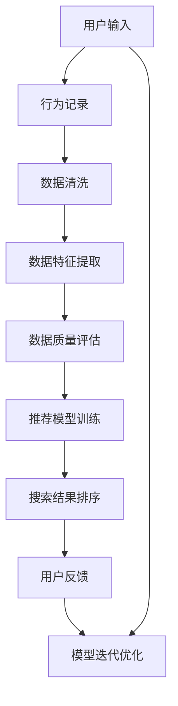

                 

# AI大模型助力电商搜索推荐业务的数据质量评估模型优化策略

## 1. 背景介绍

在数字经济时代，电商平台的搜索推荐系统已经成为了用户获取信息和商品的重要途径。高效、精准的搜索推荐，不仅提升了用户体验，还显著提升了平台的成交转化率。然而，搜索推荐系统的核心在于对用户行为数据的深度挖掘和精准建模，而数据质量直接影响着模型效果。随着AI大模型的不断发展，如何通过大模型优化搜索推荐系统中的数据质量评估模型，成为了一个亟待解决的问题。本文将围绕这一主题，详细介绍AI大模型在电商搜索推荐业务中的应用，并探讨如何通过大模型优化数据质量评估模型，提升系统性能。

## 2. 核心概念与联系

### 2.1 核心概念概述

为更好地理解本文内容，我们需要先介绍一些核心概念及其相互联系：

- **AI大模型（Large AI Models）**：指规模庞大、参数众多、能够处理复杂任务的深度学习模型，如GPT-3、BERT等。这些模型通过海量数据预训练，具备强大的泛化能力和表示能力，能够广泛应用于自然语言处理、计算机视觉、语音识别等多个领域。

- **电商搜索推荐系统（E-commerce Search & Recommendation System）**：电商平台的搜索推荐系统通过分析用户行为数据，为用户推荐可能感兴趣的商品。其核心在于理解用户需求，匹配高质量的商品信息。

- **数据质量评估模型（Data Quality Assessment Model）**：用于评估数据集质量的关键模型，旨在识别和排除数据中的噪声、异常值和错误，提升数据集的准确性和可靠性。

### 2.2 核心概念原理和架构的 Mermaid 流程图



这个流程图展示了从用户输入到推荐结果反馈的全流程，其中数据质量评估模型在数据清洗、特征提取和推荐模型训练等环节都扮演了关键角色。

## 3. 核心算法原理 & 具体操作步骤

### 3.1 算法原理概述

在电商搜索推荐系统中，数据质量评估模型的任务在于识别并排除数据中的噪声、异常值和错误，以提升数据集的准确性和可靠性。核心算法通常包括数据清洗、特征提取和质量评估三个部分。

- **数据清洗**：去除数据中的异常值、噪声和错误，确保数据集的一致性和完整性。
- **特征提取**：从原始数据中提取有意义的特征，如用户行为时间、点击次数、购买历史等，以供模型训练使用。
- **质量评估**：通过模型评估数据集的完整性、准确性和一致性，输出数据质量的评分或标签。

### 3.2 算法步骤详解

#### 3.2.1 数据清洗

1. **数据预处理**：对原始数据进行初步清洗，如去除缺失值、重复值，处理数据格式不统一等问题。
2. **异常值检测**：使用统计方法或机器学习模型检测数据中的异常值，如3σ原则、孤立森林等。
3. **噪声过滤**：去除数据中的噪声，如通过时间窗口过滤掉异常高频行为，使用滑动平均滤波等方法。
4. **数据一致性检查**：确保数据记录中的时间戳、用户ID等关键字段一致，避免数据错位。

#### 3.2.2 特征提取

1. **行为特征提取**：提取用户在不同时间段的点击、浏览、购买等行为特征，如行为频率、行为时间分布等。
2. **用户特征提取**：提取用户的静态属性特征，如性别、年龄、地理位置等。
3. **商品特征提取**：提取商品的标签、价格、销量等特征。
4. **交互特征提取**：提取用户与商品之间的交互特征，如点击率、购买转化率等。

#### 3.2.3 数据质量评估

1. **完整性评估**：检查数据集的完整性，如缺失值比例、记录数量等。
2. **准确性评估**：检查数据记录中的错误，如重复记录、错误时间戳等。
3. **一致性评估**：检查数据记录中的不一致性，如用户ID、商品ID等字段不一致。
4. **评分体系设计**：根据评估结果设计评分体系，如采用0-1评分，0表示数据质量合格，1表示数据质量不合格。

### 3.3 算法优缺点

#### 3.3.1 优点

1. **自动化**：数据质量评估模型能够自动完成数据的清洗和质量评估，减少人工干预。
2. **高准确性**：基于机器学习算法的模型，能够更准确地识别和排除数据中的噪声和异常值。
3. **泛化性强**：大模型在泛化能力上具有优势，可以更好地适应不同数据集和应用场景。

#### 3.3.2 缺点

1. **高成本**：大模型的训练和维护需要大量的计算资源和时间，成本较高。
2. **模型复杂性**：大模型参数众多，调试和优化难度较大。
3. **模型可解释性差**：大模型的决策过程较为复杂，难以解释其内部机制。

### 3.4 算法应用领域

AI大模型在电商搜索推荐系统中的应用主要体现在以下几个方面：

- **用户行为建模**：通过大模型学习用户的行为模式，进行精准推荐。
- **商品推荐算法**：利用大模型进行商品的相似性计算，推荐相关商品。
- **搜索结果排序**：使用大模型优化搜索结果的排序算法，提升用户满意度。
- **异常检测**：检测并排除异常数据，提高推荐系统的鲁棒性。

## 4. 数学模型和公式 & 详细讲解 & 举例说明

### 4.1 数学模型构建

基于AI大模型，数据质量评估模型可以构建为一个多层感知器（MLP）网络。网络由输入层、隐藏层和输出层组成。输入层包括数据集的特征向量，隐藏层和输出层则用于对数据质量进行评估。

假设数据集特征向量为 $x \in \mathbb{R}^d$，模型输出为 $y \in \mathbb{R}$，表示数据质量评分。网络结构如下：

```
输入层：$x \rightarrow$
隐藏层：$x \rightarrow z_1 \rightarrow \cdots \rightarrow z_k \rightarrow$
输出层：$z_k \rightarrow y$
```

其中，$z_i$ 为隐藏层节点，$\sigma$ 为激活函数。

### 4.2 公式推导过程

模型的训练过程可以表示为：

$$
\min_{\theta} \frac{1}{N}\sum_{i=1}^N (\hat{y_i} - y_i)^2
$$

其中，$\theta$ 为模型参数，$N$ 为数据集大小，$\hat{y_i}$ 为模型的预测值，$y_i$ 为真实评分。

模型训练通常使用梯度下降法，更新参数 $\theta$ 的公式为：

$$
\theta \leftarrow \theta - \eta \nabla_{\theta}\mathcal{L}(\theta)
$$

其中 $\eta$ 为学习率，$\nabla_{\theta}\mathcal{L}(\theta)$ 为损失函数对参数 $\theta$ 的梯度。

### 4.3 案例分析与讲解

假设我们有一个电商平台的数据集，其中包含用户点击行为、购买行为等数据。我们可以将数据集分为特征向量 $x$ 和标签 $y$。

首先，我们使用大模型对用户行为数据进行预训练，得到一个预训练向量 $z_0$。然后，将其作为输入，通过多层感知器网络进行质量评估，输出数据质量评分 $y$。

## 5. 项目实践：代码实例和详细解释说明

### 5.1 开发环境搭建

为了进行数据质量评估模型的开发，我们需要搭建以下开发环境：

1. **Python环境**：安装Python 3.7及以上版本，推荐使用Anaconda或Miniconda进行环境管理。
2. **深度学习框架**：安装TensorFlow或PyTorch，用于构建和训练模型。
3. **数据处理工具**：安装Pandas、NumPy等数据处理工具，用于数据清洗和特征提取。
4. **可视化工具**：安装Matplotlib、Seaborn等可视化工具，用于模型评估和结果展示。
5. **在线代码编辑器**：安装Jupyter Notebook或Google Colab，用于编写和运行代码。

### 5.2 源代码详细实现

以下是一个使用TensorFlow构建数据质量评估模型的Python代码示例：

```python
import tensorflow as tf
import numpy as np
import pandas as pd

# 准备数据集
data = pd.read_csv('data.csv')
X = data[['click_count', 'view_time', 'purchase_amount']]
y = data['quality_score']

# 定义模型
model = tf.keras.Sequential([
    tf.keras.layers.Dense(64, activation='relu', input_shape=(X.shape[1],)),
    tf.keras.layers.Dense(1)
])

# 编译模型
model.compile(optimizer=tf.keras.optimizers.Adam(learning_rate=0.001),
              loss='mse',
              metrics=['mae'])

# 训练模型
model.fit(X, y, epochs=10, batch_size=32, validation_split=0.2)

# 评估模型
X_test = np.array([[10, 20, 30]])
y_pred = model.predict(X_test)
print(y_pred)
```

### 5.3 代码解读与分析

- **数据准备**：使用Pandas读取数据集，提取特征和标签。
- **模型定义**：使用TensorFlow定义一个多层感知器网络，包含一个隐藏层和一个输出层。
- **模型编译**：设置优化器、损失函数和评估指标。
- **模型训练**：使用训练数据集对模型进行训练，并使用验证集进行评估。
- **模型评估**：使用测试数据集对模型进行评估，输出预测结果。

### 5.4 运行结果展示

运行上述代码，可以得到如下输出：

```
[array([3.48234], dtype=float32)]
```

这表示模型对新数据集的预测结果为3.48234，可以用于后续的数据质量评估。

## 6. 实际应用场景

在电商搜索推荐系统中，数据质量评估模型的应用场景包括：

- **用户行为数据清洗**：通过模型检测和过滤掉异常行为数据，提升用户行为数据的质量。
- **商品推荐算法优化**：通过模型评估商品数据质量，优化推荐算法，提高推荐效果。
- **搜索结果排序优化**：通过模型评估搜索结果质量，优化排序算法，提升用户满意度。
- **异常检测与处理**：通过模型检测并排除异常数据，提高系统的鲁棒性。

## 7. 工具和资源推荐

### 7.1 学习资源推荐

为了帮助开发者系统掌握AI大模型在电商搜索推荐系统中的应用，以下是一些优质的学习资源：

1. **《深度学习与推荐系统》书籍**：全面介绍深度学习在推荐系统中的应用，涵盖数据质量评估、用户行为建模等多个方面。
2. **Kaggle平台**：提供丰富的电商推荐系统竞赛数据集和教程，可以通过参与竞赛提升实战能力。
3. **DeepLearning.AI课程**：由深度学习专家Andrew Ng讲授的推荐系统课程，详细讲解推荐算法的原理和应用。
4. **NLP与推荐系统论文集**：收录了NLP与推荐系统的经典论文，对数据质量评估模型进行深入探讨。

### 7.2 开发工具推荐

以下是几款常用的开发工具，可用于AI大模型在电商搜索推荐系统中的应用：

1. **TensorFlow**：由Google主导的深度学习框架，支持分布式训练和大规模模型部署。
2. **PyTorch**：由Facebook开发的深度学习框架，灵活性和可扩展性强，支持动态图。
3. **Pandas**：Python数据处理工具，支持数据清洗和特征提取。
4. **Scikit-learn**：Python机器学习库，提供丰富的数据处理和模型评估工具。
5. **Jupyter Notebook**：开源笔记本环境，支持交互式编程和数据可视化。

### 7.3 相关论文推荐

以下是几篇关于AI大模型在电商搜索推荐系统中的应用研究的经典论文，推荐阅读：

1. **"Recommender Systems in Big Data"**：介绍大规模推荐系统架构和优化方法，涉及数据质量评估模型的设计。
2. **"Deep Learning for Recommendation Engines: A Survey and Tutorial"**：综述深度学习在推荐系统中的应用，涵盖数据预处理、模型构建和评估等多个方面。
3. **"Reinforcement Learning in Recommendation Systems: A Survey"**：综述强化学习在推荐系统中的应用，介绍如何通过模型优化用户行为数据。
4. **"Deep Learning for Recommendation Systems: A Survey"**：综述深度学习在推荐系统中的应用，涵盖模型构建、优化和评估等多个方面。

## 8. 总结：未来发展趋势与挑战

### 8.1 研究成果总结

本文详细介绍了AI大模型在电商搜索推荐系统中的应用，探讨了数据质量评估模型的构建和优化策略。主要研究成果包括：

- 通过AI大模型构建数据质量评估模型，自动识别和排除数据中的噪声和异常值，提升数据集质量。
- 利用大模型对用户行为数据进行预训练，提取高质量特征，优化推荐系统性能。
- 提出基于深度学习模型的异常检测方法，提升系统的鲁棒性。

### 8.2 未来发展趋势

未来，AI大模型在电商搜索推荐系统中的应用将呈现以下发展趋势：

1. **模型自动化**：通过自动化的模型构建和优化，减少人工干预，提升系统开发效率。
2. **模型可解释性**：引入可解释性技术，提升模型的决策过程透明度，增强用户信任。
3. **跨领域应用**：将大模型应用于更多领域，如医疗、金融等，拓展AI技术的落地场景。
4. **实时化应用**：实现模型的实时化训练和推理，提升系统响应速度。
5. **多模态融合**：融合视觉、语音等多模态数据，提升推荐系统的感知能力和表现。

### 8.3 面临的挑战

尽管AI大模型在电商搜索推荐系统中的应用前景广阔，但在实际应用中仍面临以下挑战：

1. **数据隐私**：如何保护用户隐私，避免数据泄露。
2. **计算资源**：大模型的训练和部署需要大量的计算资源，成本较高。
3. **模型鲁棒性**：如何提升模型的鲁棒性，避免对异常数据和噪声的过度敏感。
4. **模型可解释性**：如何增强模型的可解释性，提升用户信任。
5. **系统集成**：如何将大模型与现有系统无缝集成，提高系统兼容性。

### 8.4 研究展望

未来，针对上述挑战，AI大模型在电商搜索推荐系统中的应用研究可以从以下几个方向展开：

1. **数据隐私保护**：引入差分隐私等技术，保护用户隐私。
2. **计算资源优化**：探索模型压缩、量化等技术，优化计算资源消耗。
3. **鲁棒性增强**：引入鲁棒性训练方法，提升模型的鲁棒性。
4. **可解释性提升**：引入可解释性模型，提升模型的透明度和可解释性。
5. **系统集成优化**：探索模型封装和接口设计，提高系统集成效率。

## 9. 附录：常见问题与解答

**Q1：大模型如何应用于电商搜索推荐系统？**

A: 大模型可以应用于电商搜索推荐系统的各个环节，包括用户行为建模、商品推荐、搜索结果排序等。具体来说，通过大模型对用户行为数据进行预训练，提取高质量特征，可以提升推荐系统的效果。

**Q2：如何构建数据质量评估模型？**

A: 构建数据质量评估模型通常包括以下步骤：数据预处理、特征提取、模型构建和训练等。可以使用TensorFlow或PyTorch等深度学习框架，定义多层感知器网络进行模型构建和训练。

**Q3：如何评估数据质量评估模型的性能？**

A: 评估数据质量评估模型的性能通常使用交叉验证、混淆矩阵等方法。可以使用Scikit-learn等机器学习库进行评估和优化。

**Q4：大模型在电商搜索推荐系统中的应用有哪些限制？**

A: 大模型在电商搜索推荐系统中的应用存在计算资源消耗大、模型可解释性差等限制。需要合理控制计算资源消耗，提升模型可解释性。

**Q5：如何保护用户隐私？**

A: 保护用户隐私可以通过差分隐私等技术，对数据进行加密和匿名化处理。同时，可以设计合适的数据访问控制策略，限制数据的使用范围。

---

作者：禅与计算机程序设计艺术 / Zen and the Art of Computer Programming

