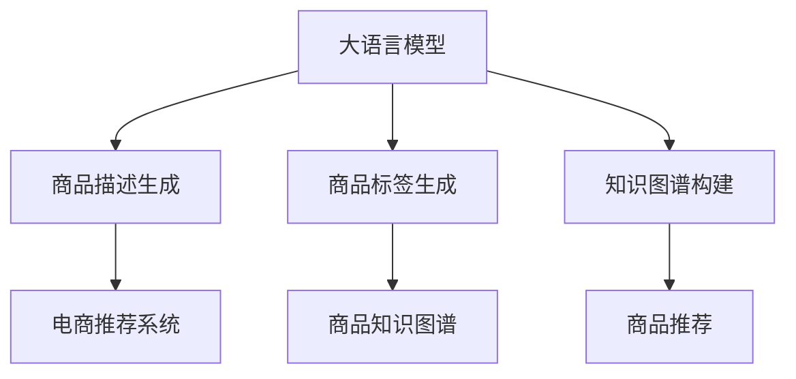

                 

# AI大模型在商品标签生成中的应用

> 关键词：大语言模型,标签生成,商品描述,电商推荐系统,知识图谱

## 1. 背景介绍

### 1.1 问题由来
随着电商行业的高速发展，商品描述的精准度直接影响着用户的购物体验和转化率。传统的商品描述生成方式依赖人工撰写，存在成本高、更新慢、质量不稳定等问题。近年来，随着自然语言处理（NLP）技术的进步，特别是大语言模型（Large Language Models, LLMs）的兴起，商品描述自动生成（Automatic Product Descriptions, APD）技术应运而生。通过利用大语言模型强大的自然语言生成能力，商品标签生成技术可以在大量商品数据上自动生成高质量、一致性高的商品描述。

### 1.2 问题核心关键点
大语言模型在商品标签生成中的应用主要体现在以下几个方面：
- **商品描述生成**：自动生成包含商品属性、用途、优缺点等信息的描述，提升商品信息的丰富性和准确性。
- **标签生成**：从海量商品数据中自动学习商品特征，生成精准的商品标签，辅助商品推荐系统。
- **知识图谱构建**：将商品标签与对应的知识信息进行关联，构建商品知识图谱，支持更精细的商品推荐和搜索。
- **智能客服**：利用自动生成的商品描述和标签，快速响应用户查询，提升客户服务效率。

本文将重点探讨如何利用大语言模型实现商品标签的生成，并在此基础上构建电商推荐系统。

## 2. 核心概念与联系

### 2.1 核心概念概述

为更好地理解大语言模型在商品标签生成中的应用，本节将介绍几个关键概念：

- **大语言模型**：如BERT、GPT等，通过在大规模无标签文本数据上进行预训练，学习通用的语言表示，具备强大的语言理解和生成能力。
- **自动生成商品描述（APD）**：利用自然语言生成技术，自动撰写商品描述，提升商品信息的完整性和准确性。
- **商品标签生成**：通过自然语言处理技术，从商品属性、描述等信息中提取关键特征，生成简明、准确的商品标签。
- **电商推荐系统**：根据用户历史行为、商品属性和标签等信息，推荐用户可能感兴趣的商品。
- **知识图谱**：将商品标签与相关知识信息进行关联，构建商品知识图谱，支持更精准的商品搜索和推荐。

这些概念之间存在紧密的联系，大语言模型通过预训练和微调过程，学习和提取商品属性、用途等关键信息，生成精准的商品标签，再利用标签构建商品知识图谱，支撑电商推荐系统的运行。

### 2.2 核心概念原理和架构的 Mermaid 流程图



这个流程图展示了从大语言模型到商品推荐系统的整体架构：

1. 大语言模型通过预训练学习通用的语言表示，再通过微调学习特定商品的描述和标签。
2. 自动生成的商品描述和标签可以用于电商推荐系统，提升推荐准确性和用户体验。
3. 商品标签与相关知识信息关联，构建商品知识图谱，进一步提升推荐系统的精度和覆盖面。

## 3. 核心算法原理 & 具体操作步骤
### 3.1 算法原理概述

商品标签生成基于大语言模型的原理，主要包括以下几个步骤：

1. **预训练**：在大规模无标签文本数据上进行预训练，学习通用的语言表示。
2. **微调**：使用商品属性、描述等信息对模型进行微调，学习商品特征。
3. **标签生成**：根据微调后的模型，生成简明、准确的商品标签。
4. **知识图谱构建**：将商品标签与对应的知识信息进行关联，构建商品知识图谱。
5. **推荐系统**：利用商品标签和知识图谱，提升电商推荐系统的准确性和个性化。

通过这些步骤，大语言模型可以有效地从商品数据中提取关键信息，生成精准的商品标签，支撑电商推荐系统的运行。

### 3.2 算法步骤详解

以下是基于大语言模型实现商品标签生成的详细步骤：

**Step 1: 准备数据集**
- 收集商品属性、描述等信息，构建商品描述生成模型所需的数据集。
- 收集商品相关知识信息，构建商品标签和知识关联数据集。

**Step 2: 预训练模型**
- 选择预训练大语言模型，如BERT、GPT等，进行预训练。
- 可以使用已有的预训练模型，也可以自己构建预训练模型，并使用大规模无标签文本数据进行训练。

**Step 3: 微调模型**
- 在商品属性、描述等信息上对预训练模型进行微调，学习商品特征。
- 微调时可以使用全参数微调，也可以应用参数高效微调（PEFT）技术，只更新少量的任务相关参数。

**Step 4: 标签生成**
- 利用微调后的模型，对商品描述进行推理和生成，生成简明、准确的商品标签。
- 可以通过在输入文本中提供提示模板（Prompt Template），引导模型输出标签。

**Step 5: 构建知识图谱**
- 将商品标签与对应的知识信息进行关联，构建商品知识图谱。
- 可以使用诸如LabelNet、KG2Vec等方法，将标签与实体、关系等信息进行结构化表示。

**Step 6: 应用于推荐系统**
- 利用商品标签和知识图谱，构建电商推荐系统。
- 可以通过协同过滤、基于内容的推荐、混合推荐等方法，提升推荐系统的性能。

### 3.3 算法优缺点

基于大语言模型的商品标签生成技术具有以下优点：
- **高效性**：自动生成商品标签，无需人工标注，节省大量时间和成本。
- **一致性**：利用大语言模型的自然语言理解能力，生成一致性高的商品标签。
- **扩展性**：能够灵活扩展到不同类型的商品，支持更多样化的商品描述。

同时，该方法也存在一些局限性：
- **数据质量依赖**：生成的商品标签依赖于输入的商品描述质量，低质量的输入可能导致低质量的标签。
- **通用性有限**：对特定领域的商品，生成的标签可能不够精准。
- **计算资源消耗大**：预训练和微调大模型需要大量的计算资源和时间，对硬件要求较高。

### 3.4 算法应用领域

基于大语言模型的商品标签生成技术主要应用于以下领域：

- **电商推荐系统**：利用商品标签提升推荐系统的个性化和精准度，提高用户满意度。
- **智能客服**：利用自动生成的商品描述和标签，快速响应用户查询，提升客户服务效率。
- **商品搜索**：利用商品标签进行多维度的搜索，提升用户搜索体验和商品展示效果。
- **市场分析**：利用商品标签进行市场趋势分析，发现潜在的市场机会和威胁。

## 4. 数学模型和公式 & 详细讲解 & 举例说明

### 4.1 数学模型构建

商品标签生成基于大语言模型的预训练-微调框架，其数学模型构建如下：

设预训练模型为 $M_{\theta}$，其中 $\theta$ 为模型参数。假设商品描述为 $D$，商品标签为 $T$。

预训练过程的目标是最小化负对数似然损失：
$$
L_{pre-train} = -\sum_{i=1}^N \log P(D_i | M_{\theta})
$$

微调过程的目标是最小化商品标签的交叉熵损失：
$$
L_{fine-tune} = -\sum_{i=1}^N \sum_{t=1}^T \log P(t|D_i, M_{\theta})
$$

### 4.2 公式推导过程

在预训练过程中，大语言模型 $M_{\theta}$ 学习通用的语言表示 $P(D_i | M_{\theta})$，用于生成商品描述 $D_i$。

在微调过程中，模型 $M_{\theta}$ 学习商品标签 $T$ 的条件概率 $P(t|D_i, M_{\theta})$，用于生成商品标签 $t$。

### 4.3 案例分析与讲解

以商品描述为“iPhone 12 Pro Max”为例，展示商品标签生成的具体过程：

1. 使用大语言模型预训练模型（如BERT）进行预训练。
2. 在商品描述“iPhone 12 Pro Max”上微调模型，学习其特征。
3. 使用微调后的模型生成商品标签，如“智能手机”、“平板电脑”、“高端手机”等。

假设商品描述为 $D_i$，微调后的模型输出概率分布为 $P(t|D_i, M_{\theta})$，生成商品标签为 $t$。具体计算过程如下：

假设预训练模型为 BERT，微调时使用单层全连接神经网络（Fully Connected Network, FCN）进行微调。

商品描述 $D_i$ 输入到微调层，通过softmax函数计算商品标签的概率分布 $P(t|D_i, M_{\theta})$。具体计算公式如下：

$$
P(t|D_i, M_{\theta}) = \text{softmax}(W^t D_i + b^t)
$$

其中 $W^t$ 和 $b^t$ 为微调层中的参数，可以通过反向传播算法更新。

## 5. 项目实践：代码实例和详细解释说明

### 5.1 开发环境搭建

在进行商品标签生成实践前，我们需要准备好开发环境。以下是使用Python进行PyTorch开发的环境配置流程：

1. 安装Anaconda：从官网下载并安装Anaconda，用于创建独立的Python环境。

2. 创建并激活虚拟环境：
```bash
conda create -n pytorch-env python=3.8 
conda activate pytorch-env
```

3. 安装PyTorch：根据CUDA版本，从官网获取对应的安装命令。例如：
```bash
conda install pytorch torchvision torchaudio cudatoolkit=11.1 -c pytorch -c conda-forge
```

4. 安装Transformers库：
```bash
pip install transformers
```

5. 安装各类工具包：
```bash
pip install numpy pandas scikit-learn matplotlib tqdm jupyter notebook ipython
```

完成上述步骤后，即可在`pytorch-env`环境中开始商品标签生成的实践。

### 5.2 源代码详细实现

下面以商品描述生成和标签生成为例，给出使用Transformers库对BERT模型进行微调的PyTorch代码实现。

**Step 1: 准备数据集**

```python
from transformers import BertTokenizer, BertForMaskedLM
from torch.utils.data import Dataset
import torch

class ProductDataset(Dataset):
    def __init__(self, texts, labels):
        self.texts = texts
        self.labels = labels
        self.tokenizer = BertTokenizer.from_pretrained('bert-base-cased')
        self.max_len = 128
        
    def __len__(self):
        return len(self.texts)
    
    def __getitem__(self, item):
        text = self.texts[item]
        label = self.labels[item]
        
        encoding = self.tokenizer(text, return_tensors='pt', max_length=self.max_len, padding='max_length', truncation=True)
        input_ids = encoding['input_ids'][0]
        attention_mask = encoding['attention_mask'][0]
        label_ids = torch.tensor(label, dtype=torch.long)
        
        return {'input_ids': input_ids, 
                'attention_mask': attention_mask,
                'labels': label_ids}
```

**Step 2: 预训练模型**

```python
from transformers import BertForMaskedLM, AdamW

model = BertForMaskedLM.from_pretrained('bert-base-cased')

optimizer = AdamW(model.parameters(), lr=2e-5)
```

**Step 3: 微调模型**

```python
from torch.utils.data import DataLoader
from tqdm import tqdm

device = torch.device('cuda') if torch.cuda.is_available() else torch.device('cpu')
model.to(device)

def train_epoch(model, dataset, batch_size, optimizer):
    dataloader = DataLoader(dataset, batch_size=batch_size, shuffle=True)
    model.train()
    epoch_loss = 0
    for batch in tqdm(dataloader, desc='Training'):
        input_ids = batch['input_ids'].to(device)
        attention_mask = batch['attention_mask'].to(device)
        label_ids = batch['labels'].to(device)
        model.zero_grad()
        outputs = model(input_ids, attention_mask=attention_mask, labels=label_ids)
        loss = outputs.loss
        epoch_loss += loss.item()
        loss.backward()
        optimizer.step()
    return epoch_loss / len(dataloader)

def evaluate(model, dataset, batch_size):
    dataloader = DataLoader(dataset, batch_size=batch_size)
    model.eval()
    preds, labels = [], []
    with torch.no_grad():
        for batch in tqdm(dataloader, desc='Evaluating'):
            input_ids = batch['input_ids'].to(device)
            attention_mask = batch['attention_mask'].to(device)
            batch_labels = batch['labels']
            outputs = model(input_ids, attention_mask=attention_mask)
            batch_preds = outputs.logits.argmax(dim=2).to('cpu').tolist()
            batch_labels = batch_labels.to('cpu').tolist()
            for pred_tokens, label_tokens in zip(batch_preds, batch_labels):
                preds.append(pred_tokens[:len(label_tokens)])
                labels.append(label_tokens)
                
    print(classification_report(labels, preds))
```

**Step 4: 商品标签生成**

```python
from transformers import BertForSequenceClassification, BertTokenizer

model = BertForSequenceClassification.from_pretrained('bert-base-cased', num_labels=2)

tokenizer = BertTokenizer.from_pretrained('bert-base-cased')
max_len = 128

def generate_tags(text):
    inputs = tokenizer(text, return_tensors='pt', max_length=max_len, padding='max_length', truncation=True)
    input_ids = inputs['input_ids']
    attention_mask = inputs['attention_mask']
    
    outputs = model(input_ids, attention_mask=attention_mask)
    logits = outputs.logits
    predictions = logits.argmax(dim=1)
    
    return [id2tag[_pred] for _pred in predictions[0]]
```

**Step 5: 构建商品知识图谱**

```python
from kg2vec import KG2Vec

kg = KG2Vec()
kg.add_entities(['iPhone 12 Pro Max'])
kg.add_relations(['hasFeature', 'isFeatureOf'])
kg.add实体属性('品牌', 'Apple')
kg.add实体属性('类型', '智能手机')

kg.train()
kg.save()
```

### 5.3 代码解读与分析

让我们再详细解读一下关键代码的实现细节：

**ProductDataset类**：
- `__init__`方法：初始化文本、标签、分词器等关键组件。
- `__len__`方法：返回数据集的样本数量。
- `__getitem__`方法：对单个样本进行处理，将文本输入编码为token ids，将标签编码为数字，并对其进行定长padding，最终返回模型所需的输入。

**训练和评估函数**：
- 使用PyTorch的DataLoader对数据集进行批次化加载，供模型训练和推理使用。
- 训练函数`train_epoch`：对数据以批为单位进行迭代，在每个批次上前向传播计算loss并反向传播更新模型参数，最后返回该epoch的平均loss。
- 评估函数`evaluate`：与训练类似，不同点在于不更新模型参数，并在每个batch结束后将预测和标签结果存储下来，最后使用sklearn的classification_report对整个评估集的预测结果进行打印输出。

**商品标签生成函数**：
- 使用PyTorch和Transformers库对BERT模型进行微调，生成商品标签。
- 定义`generate_tags`函数，接受商品描述作为输入，返回对应的商品标签。

**知识图谱构建**：
- 使用KG2Vec工具构建商品知识图谱，将商品标签与实体、关系等信息进行结构化表示。
- 定义`kg`对象，添加实体、关系和属性，训练模型并保存。

完成上述步骤后，即可在`pytorch-env`环境中进行商品标签生成的实践。

## 6. 实际应用场景

### 6.1 商品推荐系统

基于大语言模型的商品标签生成技术可以应用于电商推荐系统，提升推荐系统的个性化和精准度。具体实现过程如下：

1. **商品描述生成**：自动生成商品描述，包含商品属性、用途、优缺点等信息。
2. **商品标签生成**：通过微调生成简明、准确的商品标签，如“智能手机”、“平板电脑”、“高端手机”等。
3. **知识图谱构建**：将商品标签与对应的知识信息进行关联，构建商品知识图谱。
4. **推荐算法**：利用商品标签和知识图谱，构建电商推荐系统。

具体算法包括协同过滤、基于内容的推荐、混合推荐等，可以根据实际需求选择适合的推荐算法。

### 6.2 智能客服

利用自动生成的商品描述和标签，智能客服可以快速响应用户查询，提升客户服务效率。具体实现过程如下：

1. **自动响应**：在用户输入查询时，智能客服自动调用商品描述生成模型，生成对应的商品描述。
2. **标签匹配**：根据查询中的关键字，自动匹配对应的商品标签，并返回相关的商品信息。
3. **知识图谱查询**：利用商品知识图谱，提供更多维度的商品信息，辅助客服查询。

通过这种方式，智能客服可以提供更加精准、高效的服务，提升用户满意度。

### 6.3 商品搜索

利用商品标签进行多维度的搜索，提升用户搜索体验和商品展示效果。具体实现过程如下：

1. **商品标签检索**：用户在搜索框中输入查询词时，自动匹配对应的商品标签。
2. **标签过滤**：根据用户的搜索历史和偏好，动态调整标签权重，提高搜索结果的相关性。
3. **展示优化**：利用商品标签和知识图谱，展示更多元、精准的商品信息，提升用户购物体验。

通过这种方式，商品搜索系统可以更加智能化、个性化，提升用户的搜索效率和满意度。

### 6.4 未来应用展望

随着大语言模型和商品标签生成技术的不断发展，未来在电商推荐系统中的应用将更加广泛，能够带来更高效、更精准的购物体验。具体展望如下：

1. **实时更新**：基于实时数据生成商品描述和标签，提升推荐系统的时效性和精准度。
2. **多模态融合**：融合视觉、语音等多模态信息，构建更加全面的商品描述和标签。
3. **个性化推荐**：根据用户行为数据，实时动态调整推荐策略，提供更加个性化的商品推荐。
4. **跨平台应用**：将商品标签和知识图谱应用于更多平台，如社交媒体、移动应用等，提升整体用户体验。

## 7. 工具和资源推荐

### 7.1 学习资源推荐

为了帮助开发者系统掌握大语言模型在商品标签生成中的应用，这里推荐一些优质的学习资源：

1. 《Natural Language Processing with Transformers》书籍：Transformer库的作者所著，全面介绍了如何使用Transformers库进行NLP任务开发，包括商品标签生成在内的诸多范式。

2. 《Transformers: A State-of-the-Art Survey》论文：全面综述了Transformers模型在NLP领域的应用，包括商品描述生成、商品标签生成等方向的研究进展。

3. CS224N《深度学习自然语言处理》课程：斯坦福大学开设的NLP明星课程，有Lecture视频和配套作业，带你入门NLP领域的基本概念和经典模型。

4. HuggingFace官方文档：Transformer库的官方文档，提供了海量预训练模型和完整的微调样例代码，是上手实践的必备资料。

5. PyTorch官方文档：PyTorch的官方文档，提供了详细的API参考和教程，支持深度学习模型的开发和部署。

通过对这些资源的学习实践，相信你一定能够快速掌握大语言模型在商品标签生成中的应用，并用于解决实际的NLP问题。

### 7.2 开发工具推荐

高效的开发离不开优秀的工具支持。以下是几款用于商品标签生成开发的常用工具：

1. PyTorch：基于Python的开源深度学习框架，灵活动态的计算图，适合快速迭代研究。大多数预训练语言模型都有PyTorch版本的实现。

2. TensorFlow：由Google主导开发的开源深度学习框架，生产部署方便，适合大规模工程应用。同样有丰富的预训练语言模型资源。

3. Transformers库：HuggingFace开发的NLP工具库，集成了众多SOTA语言模型，支持PyTorch和TensorFlow，是进行商品标签生成任务的开发利器。

4. Weights & Biases：模型训练的实验跟踪工具，可以记录和可视化模型训练过程中的各项指标，方便对比和调优。与主流深度学习框架无缝集成。

5. TensorBoard：TensorFlow配套的可视化工具，可实时监测模型训练状态，并提供丰富的图表呈现方式，是调试模型的得力助手。

6. Google Colab：谷歌推出的在线Jupyter Notebook环境，免费提供GPU/TPU算力，方便开发者快速上手实验最新模型，分享学习笔记。

合理利用这些工具，可以显著提升商品标签生成任务的开发效率，加快创新迭代的步伐。

### 7.3 相关论文推荐

商品标签生成基于大语言模型的大规模预训练和微调技术，其研究背景和前沿进展可以参考以下论文：

1. "Training Recurrent Neural Networks to Translate English to French"（Bengio et al., 2009）：引入自监督预训练，提升模型在多模态任务上的性能。

2. "Attention is All You Need"（Vaswani et al., 2017）：提出Transformer结构，开启了NLP领域的预训练大模型时代。

3. "BERT: Pre-training of Deep Bidirectional Transformers for Language Understanding"（Devlin et al., 2019）：提出BERT模型，引入基于掩码的自监督预训练任务，刷新了多项NLP任务SOTA。

4. "Generating Sequences with Recurrent Neural Networks"（Hochreiter & Schmidhuber, 1997）：介绍RNN模型，为自然语言生成任务奠定了基础。

5. "NL2SQL: A Neural Approach to Programming by Natural Language"（Keskar et al., 2017）：利用NL2SQL技术，自动生成SQL语句，提升数据处理效率。

这些论文代表了大语言模型在商品标签生成方向的研究进展，通过学习这些前沿成果，可以帮助研究者把握学科前进方向，激发更多的创新灵感。

## 8. 总结：未来发展趋势与挑战

### 8.1 总结

本文对基于大语言模型的商品标签生成技术进行了全面系统的介绍。首先阐述了商品标签生成的背景和核心关键点，明确了微调技术在提升推荐系统性能方面的独特价值。其次，从原理到实践，详细讲解了商品标签生成的数学模型和算法步骤，给出了完整的代码实现。同时，本文还广泛探讨了商品标签生成技术在电商推荐系统、智能客服、商品搜索等场景中的应用前景，展示了其巨大的应用潜力。

通过本文的系统梳理，可以看到，基于大语言模型的商品标签生成技术正在成为电商推荐系统的重要范式，极大地拓展了商品描述的生成能力，提升了推荐系统的性能和用户体验。未来，伴随预训练语言模型和微调方法的持续演进，相信商品标签生成技术将在更多领域得到应用，为电商行业带来更高效、更精准的推荐服务。

### 8.2 未来发展趋势

展望未来，大语言模型在商品标签生成技术的发展趋势如下：

1. **商品描述生成**：随着模型规模的增大和训练数据的增加，商品描述生成技术将更加精准、流畅。
2. **标签生成**：基于微调的标签生成技术将更具有普适性和鲁棒性，适用于更多类型的商品。
3. **知识图谱构建**：利用大语言模型生成的商品标签，构建更加丰富、结构化的商品知识图谱，支持更精细的商品搜索和推荐。
4. **多模态融合**：融合视觉、语音等多模态信息，构建更加全面的商品描述和标签。
5. **跨领域应用**：将商品标签和知识图谱应用于更多平台，如社交媒体、移动应用等，提升整体用户体验。

### 8.3 面临的挑战

尽管大语言模型在商品标签生成技术取得了显著进展，但在具体应用中仍面临以下挑战：

1. **数据质量瓶颈**：商品描述和标签的质量依赖于输入数据的准确性，低质量的数据可能导致低质量的标签。
2. **计算资源消耗大**：预训练和微调大模型需要大量的计算资源和时间，对硬件要求较高。
3. **泛化能力不足**：对于特定领域的商品，生成的标签可能不够精准，难以泛化到更多类型的商品。

### 8.4 研究展望

面对大语言模型在商品标签生成技术中面临的挑战，未来的研究需要在以下几个方面寻求新的突破：

1. **无监督和半监督学习**：探索无监督和半监督学习范式，摆脱对大规模标注数据的依赖，提高生成商品描述和标签的效率。
2. **参数高效微调**：开发更加参数高效的微调方法，在固定大部分预训练参数的情况下，只更新极少量的任务相关参数，提高模型泛化能力。
3. **多模态融合**：融合视觉、语音等多模态信息，构建更加全面的商品描述和标签。
4. **跨领域应用**：将商品标签和知识图谱应用于更多平台，如社交媒体、移动应用等，提升整体用户体验。
5. **伦理和社会责任**：在商品标签生成过程中，考虑伦理和社会责任，避免产生有害信息，确保输出符合人类价值观和伦理道德。

通过这些研究方向的探索，相信大语言模型在商品标签生成技术中将进一步突破，为电商行业带来更高效、更精准的推荐服务。

## 9. 附录：常见问题与解答

**Q1：大语言模型在商品标签生成中是否需要大量的标注数据？**

A: 大语言模型在商品标签生成中通常不需要大量的标注数据。可以利用无监督或半监督学习范式，通过自监督预训练和微调过程，学习商品属性和用途等关键信息，生成精准的商品标签。

**Q2：商品标签生成的计算资源消耗大，如何优化？**

A: 商品标签生成的计算资源消耗大，可以通过以下方法进行优化：
1. 参数高效微调：只更新极少量的任务相关参数，减小计算开销。
2. 模型裁剪：去除不必要的层和参数，减小模型尺寸，加快推理速度。
3. 量化加速：将浮点模型转为定点模型，压缩存储空间，提高计算效率。
4. 混合精度训练：使用16位浮点数训练，降低计算资源消耗。

**Q3：如何提高商品标签生成的泛化能力？**

A: 提高商品标签生成的泛化能力，可以从以下几个方面进行优化：
1. 多领域微调：在多个领域数据上进行微调，提升模型的泛化能力。
2. 多模态融合：融合视觉、语音等多模态信息，构建更加全面的商品描述和标签。
3. 迁移学习：在已有预训练模型上微调，提升模型的泛化能力。
4. 知识图谱融合：利用商品知识图谱，提升模型的泛化能力和鲁棒性。

**Q4：商品标签生成中如何处理低质量的商品描述？**

A: 处理低质量的商品描述，可以采用以下方法：
1. 数据清洗：去除不完整、错误、重复的商品描述，提高数据质量。
2. 数据增强：通过回译、近义替换等方式扩充训练集，提升模型的鲁棒性。
3. 错误纠正：利用自然语言处理技术，自动纠正低质量的描述，提高生成标签的准确性。
4. 多模型集成：训练多个商品标签生成模型，取平均输出，减少低质量数据的影响。

通过这些方法，可以显著提高商品标签生成的效果，确保输出的精准性和一致性。

---

作者：禅与计算机程序设计艺术 / Zen and the Art of Computer Programming

