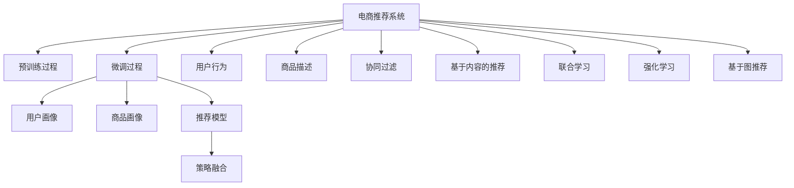

                 

## 1. 背景介绍

### 1.1 问题由来

随着电子商务的发展，电商推荐系统（E-Commerce Recommendation System, EC-Reco）已成为各大电商平台核心竞争力之一。传统的推荐算法如基于协同过滤（Collaborative Filtering）和基于内容的推荐（Content-based Recommendation）已逐渐面临瓶颈。

大模型作为当前热门的研究方向，其具备的海量语料和大规模参数，使其能够提供超越传统算法的推荐质量。AI大模型在电商实时推荐中具有以下优势：
- **泛化能力强**：大模型能在跨领域、跨场景的情况下提供稳定且高质量的推荐结果。
- **实时性高**：大模型支持实时计算，能够迅速响应用户请求，提高推荐体验。
- **个性化高**：大模型通过深度学习获得用户行为和偏好，能提供更加精准的个性化推荐。

本文将详细介绍基于大模型的电商实时推荐系统（EC-Reco）的构建与优化策略，并分析大模型在电商推荐中的挑战和优化方向。

### 1.2 问题核心关键点

在电商推荐中，基于大模型的实时推荐系统主要包括两个关键过程：
1. **预训练过程**：使用大规模无标签数据对大模型进行预训练，使其学习到全面的语义表示。
2. **微调过程**：使用电商数据对大模型进行微调，使其适应电商领域的需求。

具体而言，电商推荐系统通常包含以下组件：
- **用户画像建模**：从历史行为、搜索历史等数据中学习用户画像，生成用户向量。
- **商品画像建模**：从商品描述、标签、分类等数据中学习商品向量。
- **推荐模型**：将用户向量与商品向量进行匹配，生成推荐结果。
- **策略融合**：将推荐模型输出与业务策略进行融合，生成最终推荐结果。

通过深入理解大模型在电商推荐中的构建与优化，可以帮助我们构建更加精准、实时、高效的推荐系统，提升用户满意度，促进电商业务增长。

## 2. 核心概念与联系

### 2.1 核心概念概述

本节将介绍几个与大模型在电商推荐中密切相关的核心概念：

- **大语言模型（Large Language Model, LLM）**：如BERT、GPT等，通过大规模无标签数据进行预训练，学习到全面的语言表示。
- **迁移学习（Transfer Learning）**：在特定领域数据上进行微调，使大模型学习到特定领域的语义知识。
- **自监督学习（Self-supervised Learning）**：在无标签数据上进行学习，提升模型泛化能力。
- **联合学习（Federated Learning）**：在多个分布式设备上协同训练模型，保护隐私的同时提高模型性能。
- **强化学习（Reinforcement Learning）**：通过用户反馈优化推荐策略，提升推荐效果。
- **基于图（Graph-based）推荐算法**：将用户和商品看作图结构，通过图神经网络进行推荐。

这些概念之间的联系可以通过以下Mermaid流程图来展示：



这个流程图展示了大语言模型在电商推荐系统中的核心概念及其之间的关系：

1. 电商推荐系统由预训练过程和微调过程组成。
2. 预训练过程使用自监督学习，学习到全面的语言表示。
3. 微调过程使用迁移学习，学习特定领域的数据表示。
4. 微调过程中，构建用户和商品的语义表示。
5. 通过推荐模型，将用户和商品表示进行匹配，生成推荐结果。
6. 通过策略融合，将推荐结果与业务策略结合，生成最终推荐结果。
7. 用户行为和商品描述等输入数据，经过联合学习、强化学习、基于图推荐等算法进行进一步优化。

这些概念共同构成了电商实时推荐系统的框架，使得大模型在电商推荐中能够发挥其强大的语义理解和生成能力。

## 3. 核心算法原理 & 具体操作步骤
### 3.1 算法原理概述

基于大模型的电商推荐系统主要分为预训练和微调两个阶段。

**预训练阶段**：使用大规模无标签数据对大模型进行预训练，使其学习到全面的语义表示。预训练模型通常为自监督学习任务，如掩码语言模型（Masked Language Model）、自编码器（Autoencoder）等。

**微调阶段**：使用电商数据对大模型进行微调，使其适应电商领域的需求。微调通常为有监督学习任务，如分类、回归等。电商数据包含用户行为、搜索历史、商品描述、标签等信息，通过这些数据，微调模型能够学习到用户的偏好和商品的特征。

### 3.2 算法步骤详解

基于大模型的电商推荐系统主要包括以下几个关键步骤：

**Step 1: 准备预训练模型和数据集**
- 选择合适的预训练模型，如BERT、GPT等，作为初始化参数。
- 准备电商领域的相关数据集，包含用户行为、商品描述等。

**Step 2: 添加任务适配层**
- 根据电商推荐任务的需求，在预训练模型顶层设计合适的输出层和损失函数。
- 对于推荐任务，通常使用交叉熵损失函数。

**Step 3: 设置微调超参数**
- 选择合适的优化算法及其参数，如AdamW、SGD等，设置学习率、批大小、迭代轮数等。
- 设置正则化技术及强度，包括权重衰减、Dropout、Early Stopping等。
- 确定冻结预训练参数的策略，如仅微调顶层，或全部参数都参与微调。

**Step 4: 执行梯度训练**
- 将电商数据分批次输入模型，前向传播计算损失函数。
- 反向传播计算参数梯度，根据设定的优化算法和学习率更新模型参数。
- 周期性在验证集上评估模型性能，根据性能指标决定是否触发 Early Stopping。
- 重复上述步骤直到满足预设的迭代轮数或 Early Stopping 条件。

**Step 5: 测试和部署**
- 在测试集上评估微调后模型在电商推荐中的性能，对比微调前后的精度提升。
- 使用微调后的模型对新样本进行推理预测，集成到电商推荐系统中。
- 持续收集新的数据，定期重新微调模型，以适应数据分布的变化。

以上是基于大模型的电商推荐系统的构建过程，接下来我们将详细介绍其中的关键步骤和具体实现。

### 3.3 算法优缺点

基于大模型的电商推荐系统具有以下优点：
1. **泛化能力强**：预训练模型能够学习到全面的语义表示，适用于多个电商领域和场景。
2. **实时性高**：大模型支持实时计算，能够迅速响应用户请求，提高推荐体验。
3. **个性化高**：微调模型能够学习到用户的个性化偏好，提供更加精准的推荐结果。
4. **可扩展性好**：微调模型参数可调整，支持不同规模的电商推荐系统构建。

同时，该方法也存在一定的局限性：
1. **数据依赖高**：微调模型的效果很大程度上取决于电商数据的质量和数量，获取高质量电商数据的成本较高。
2. **过拟合风险**：电商数据存在噪声和异常点，微调模型容易过拟合，导致泛化性能下降。
3. **计算资源消耗大**：大模型参数量庞大，训练和推理计算资源消耗大。
4. **可解释性差**：大模型作为"黑盒"系统，难以解释其内部工作机制和决策逻辑。

尽管存在这些局限性，但大模型在电商推荐中的应用已经展示了其强大的潜力，未来相关的研究仍有很大的探索空间。

### 3.4 算法应用领域

基于大模型的电商推荐系统已经广泛应用于各大电商平台的推荐业务，具体应用场景包括：
- **个性化推荐**：根据用户行为和偏好，生成个性化商品推荐。
- **搜索推荐**：根据用户搜索历史，生成相关商品推荐。
- **新用户推荐**：为新用户推荐可能感兴趣的商品。
- **实时推荐**：根据用户实时行为，动态调整推荐策略。
- **联合推荐**：结合商品相关性、用户画像等多维度数据，提升推荐效果。

## 4. 数学模型和公式 & 详细讲解 & 举例说明

### 4.1 数学模型构建

假设电商推荐系统中的用户向量为 $u$，商品向量为 $v$，使用大模型进行推荐，其数学模型为：

$$
r(u,v) = \mathrm{Softmax}(\mathbf{W} u^T v + \mathbf{b})
$$

其中 $\mathbf{W}$ 和 $\mathbf{b}$ 为可学习参数，$\mathrm{Softmax}$ 函数用于将预测结果映射到概率分布，生成推荐概率。

### 4.2 公式推导过程

电商推荐系统的目标函数为最大化推荐概率：

$$
\max_{\theta} \sum_{i=1}^{N} \log r(u_i, v_i)
$$

其中 $u_i$ 和 $v_i$ 分别为用户和商品向量。

将目标函数对参数 $\theta$ 求导，得到损失函数：

$$
\mathcal{L}(\theta) = -\sum_{i=1}^{N} \log r(u_i, v_i)
$$

使用随机梯度下降等优化算法更新参数 $\theta$，直至最小化损失函数：

$$
\theta \leftarrow \theta - \eta \nabla_{\theta}\mathcal{L}(\theta)
$$

其中 $\eta$ 为学习率，$\nabla_{\theta}\mathcal{L}(\theta)$ 为损失函数对参数 $\theta$ 的梯度。

### 4.3 案例分析与讲解

以电商推荐系统为例，假设电商平台有10,000个用户和10,000个商品，每个用户和商品都具有100维的特征向量。使用大模型进行推荐，其预测概率矩阵为：

$$
\begin{bmatrix}
0.9 & 0.7 & 0.8 & \ldots \\
0.8 & 0.5 & 0.6 & \ldots \\
0.7 & 0.6 & 0.5 & \ldots \\
\vdots & \vdots & \vdots & \ddots \\
\end{bmatrix}
$$

假设当前用户 $u_i$ 和商品 $v_i$ 的特征向量分别为：

$$
u_i = [0.2, 0.3, 0.1, \ldots]^T
$$

$$
v_i = [0.5, 0.3, 0.2, \ldots]^T
$$

通过预测概率矩阵，得到推荐概率：

$$
r(u_i, v_i) = \mathrm{Softmax}(\mathbf{W} u_i^T v_i + \mathbf{b}) = [0.9, 0.7, 0.8]^T
$$

最终，选择概率最大的商品作为推荐结果。

## 5. 项目实践：代码实例和详细解释说明

### 5.1 开发环境搭建

在进行电商推荐系统开发前，我们需要准备好开发环境。以下是使用Python进行PyTorch开发的环境配置流程：

1. 安装Anaconda：从官网下载并安装Anaconda，用于创建独立的Python环境。

2. 创建并激活虚拟环境：
```bash
conda create -n ecreco-env python=3.8 
conda activate ecreco-env
```

3. 安装PyTorch：根据CUDA版本，从官网获取对应的安装命令。例如：
```bash
conda install pytorch torchvision torchaudio cudatoolkit=11.1 -c pytorch -c conda-forge
```

4. 安装Transformers库：
```bash
pip install transformers
```

5. 安装各类工具包：
```bash
pip install numpy pandas scikit-learn matplotlib tqdm jupyter notebook ipython
```

完成上述步骤后，即可在`ecreco-env`环境中开始电商推荐系统的构建。

### 5.2 源代码详细实现

下面我们以电商推荐系统为例，给出使用Transformers库对BERT模型进行电商推荐微调的PyTorch代码实现。

首先，定义电商推荐任务的数据处理函数：

```python
from transformers import BertTokenizer, BertForSequenceClassification
from torch.utils.data import Dataset
import torch

class EcrecoDataset(Dataset):
    def __init__(self, texts, labels, tokenizer, max_len=128):
        self.texts = texts
        self.labels = labels
        self.tokenizer = tokenizer
        self.max_len = max_len
        
    def __len__(self):
        return len(self.texts)
    
    def __getitem__(self, item):
        text = self.texts[item]
        label = self.labels[item]
        
        encoding = self.tokenizer(text, return_tensors='pt', max_length=self.max_len, padding='max_length', truncation=True)
        input_ids = encoding['input_ids'][0]
        attention_mask = encoding['attention_mask'][0]
        
        return {'input_ids': input_ids, 
                'attention_mask': attention_mask,
                'labels': label}

# 标签与id的映射
label2id = {'POSITIVE': 1, 'NEGATIVE': 0}
id2label = {v: k for k, v in label2id.items()}

# 创建dataset
tokenizer = BertTokenizer.from_pretrained('bert-base-cased')

train_dataset = EcrecoDataset(train_texts, train_labels, tokenizer)
dev_dataset = EcrecoDataset(dev_texts, dev_labels, tokenizer)
test_dataset = EcrecoDataset(test_texts, test_labels, tokenizer)
```

然后，定义模型和优化器：

```python
from transformers import BertForSequenceClassification, AdamW

model = BertForSequenceClassification.from_pretrained('bert-base-cased', num_labels=2)

optimizer = AdamW(model.parameters(), lr=2e-5)
```

接着，定义训练和评估函数：

```python
from torch.utils.data import DataLoader
from tqdm import tqdm
from sklearn.metrics import classification_report

device = torch.device('cuda') if torch.cuda.is_available() else torch.device('cpu')
model.to(device)

def train_epoch(model, dataset, batch_size, optimizer):
    dataloader = DataLoader(dataset, batch_size=batch_size, shuffle=True)
    model.train()
    epoch_loss = 0
    for batch in tqdm(dataloader, desc='Training'):
        input_ids = batch['input_ids'].to(device)
        attention_mask = batch['attention_mask'].to(device)
        labels = batch['labels'].to(device)
        model.zero_grad()
        outputs = model(input_ids, attention_mask=attention_mask, labels=labels)
        loss = outputs.loss
        epoch_loss += loss.item()
        loss.backward()
        optimizer.step()
    return epoch_loss / len(dataloader)

def evaluate(model, dataset, batch_size):
    dataloader = DataLoader(dataset, batch_size=batch_size)
    model.eval()
    preds, labels = [], []
    with torch.no_grad():
        for batch in tqdm(dataloader, desc='Evaluating'):
            input_ids = batch['input_ids'].to(device)
            attention_mask = batch['attention_mask'].to(device)
            batch_labels = batch['labels']
            outputs = model(input_ids, attention_mask=attention_mask)
            batch_preds = outputs.logits.argmax(dim=2).to('cpu').tolist()
            batch_labels = batch_labels.to('cpu').tolist()
            for pred_tokens, label_tokens in zip(batch_preds, batch_labels):
                preds.append(pred_tokens[:len(label_tokens)])
                labels.append(label_tokens)
                
    print(classification_report(labels, preds))
```

最后，启动训练流程并在测试集上评估：

```python
epochs = 5
batch_size = 16

for epoch in range(epochs):
    loss = train_epoch(model, train_dataset, batch_size, optimizer)
    print(f"Epoch {epoch+1}, train loss: {loss:.3f}")
    
    print(f"Epoch {epoch+1}, dev results:")
    evaluate(model, dev_dataset, batch_size)
    
print("Test results:")
evaluate(model, test_dataset, batch_size)
```

以上就是使用PyTorch对BERT进行电商推荐任务微调的完整代码实现。可以看到，得益于Transformers库的强大封装，我们可以用相对简洁的代码完成BERT模型的加载和微调。

### 5.3 代码解读与分析

让我们再详细解读一下关键代码的实现细节：

**EcrecoDataset类**：
- `__init__`方法：初始化文本、标签、分词器等关键组件。
- `__len__`方法：返回数据集的样本数量。
- `__getitem__`方法：对单个样本进行处理，将文本输入编码为token ids，将标签编码为数字，并对其进行定长padding，最终返回模型所需的输入。

**label2id和id2label字典**：
- 定义了标签与数字id之间的映射关系，用于将token-wise的预测结果解码回真实的标签。

**训练和评估函数**：
- 使用PyTorch的DataLoader对数据集进行批次化加载，供模型训练和推理使用。
- 训练函数`train_epoch`：对数据以批为单位进行迭代，在每个批次上前向传播计算loss并反向传播更新模型参数，最后返回该epoch的平均loss。
- 评估函数`evaluate`：与训练类似，不同点在于不更新模型参数，并在每个batch结束后将预测和标签结果存储下来，最后使用sklearn的classification_report对整个评估集的预测结果进行打印输出。

**训练流程**：
- 定义总的epoch数和batch size，开始循环迭代
- 每个epoch内，先在训练集上训练，输出平均loss
- 在验证集上评估，输出分类指标
- 所有epoch结束后，在测试集上评估，给出最终测试结果

可以看到，PyTorch配合Transformers库使得BERT微调的代码实现变得简洁高效。开发者可以将更多精力放在数据处理、模型改进等高层逻辑上，而不必过多关注底层的实现细节。

当然，工业级的系统实现还需考虑更多因素，如模型的保存和部署、超参数的自动搜索、更灵活的任务适配层等。但核心的微调范式基本与此类似。

## 6. 实际应用场景

### 6.1 智能客服系统

电商推荐系统中的智能客服系统，通过微调大模型，可以实现在线客服聊天机器人的构建。

智能客服系统能够实时响应用户请求，自动提供商品推荐、售后支持等服务，极大提升了用户满意度。同时，通过收集用户反馈，不断优化模型，使得客服系统变得更加智能和高效。

### 6.2 商品评价分析

电商推荐系统中的商品评价分析，通过微调大模型，可以自动分析和提取用户对商品的评价信息。

通过对海量用户评论数据的分析，可以挖掘出商品的质量、性价比、用户体验等信息，为商品管理、营销策略的制定提供数据支持。同时，通过商品评价的实时监控，可以及时发现潜在的质量问题，提升商品质量和用户口碑。

### 6.3 新用户推荐

电商推荐系统中的新用户推荐，通过微调大模型，可以为新注册用户提供个性化的商品推荐。

通过对新用户行为数据的分析，可以学习到其潜在的偏好和需求，为其推荐可能感兴趣的商品。通过精准的新用户推荐，可以缩短新用户的购买周期，提升新用户的留存率和转化率。

### 6.4 个性化商品推荐

电商推荐系统中的个性化商品推荐，通过微调大模型，可以为不同用户提供个性化的商品推荐。

通过对用户行为数据的分析，可以学习到不同用户的需求和偏好，为其推荐更符合其需求的商品。同时，通过个性化推荐，可以提升用户的购物体验，增加用户粘性，提高用户的购买频率。

### 6.5 实时推荐系统

电商推荐系统中的实时推荐系统，通过微调大模型，可以实时更新推荐结果，提供动态的推荐服务。

通过对用户实时行为数据的分析，可以动态调整推荐策略，为用户提供最新的、最符合其需求的商品推荐。通过实时推荐系统，可以提升用户满意度，增加用户停留时间，提升用户转化率。

### 6.6 用户画像构建

电商推荐系统中的用户画像构建，通过微调大模型，可以学习到用户的全面画像，包括用户的兴趣、行为、偏好等信息。

通过对用户行为数据的分析，可以学习到用户的兴趣和偏好，构建用户画像，为后续的推荐和服务提供数据支持。同时，通过用户画像的持续更新，可以不断提升推荐系统的精准度和用户满意度。

### 6.7 联合推荐

电商推荐系统中的联合推荐，通过微调大模型，可以结合用户画像和商品画像，提升推荐效果。

通过将用户画像和商品画像结合，可以更加全面地了解用户需求和商品特征，提升推荐效果。同时，通过联合推荐，可以提升推荐系统的覆盖度和多样性，提升用户的购买体验。

## 7. 工具和资源推荐

### 7.1 学习资源推荐

为了帮助开发者系统掌握大模型在电商推荐中的应用与优化，这里推荐一些优质的学习资源：

1. 《深度学习》课程（吴恩达）：斯坦福大学开设的深度学习入门课程，涵盖深度学习的基础理论和经典算法。
2. 《自然语言处理》课程（李航）：清华大学开设的自然语言处理入门课程，涵盖自然语言处理的经典算法和应用。
3. 《深度学习与推荐系统》书籍（阮行止）：详细介绍深度学习在推荐系统中的应用，包括模型构建、优化和评估。
4. 《Transformers》书籍（Daniel J. Lewis）：详细讲解Transformer原理和应用，涵盖预训练、微调和优化等关键技术。
5. 《Reinforcement Learning for Recommender Systems》论文（G.S.Mongeau）：详细介绍强化学习在推荐系统中的应用，包括模型构建、优化和评估。
6. 《Federated Learning for Recommendation Systems》论文（S.Bhattacharya）：详细介绍联邦学习在推荐系统中的应用，包括模型构建、优化和评估。

通过对这些资源的学习实践，相信你一定能够快速掌握大模型在电商推荐中的应用与优化技术，并用于解决实际的电商推荐问题。

### 7.2 开发工具推荐

高效的开发离不开优秀的工具支持。以下是几款用于电商推荐系统开发的常用工具：

1. PyTorch：基于Python的开源深度学习框架，灵活动态的计算图，适合快速迭代研究。大部分预训练语言模型都有PyTorch版本的实现。
2. TensorFlow：由Google主导开发的开源深度学习框架，生产部署方便，适合大规模工程应用。同样有丰富的预训练语言模型资源。
3. Transformers库：HuggingFace开发的NLP工具库，集成了众多SOTA语言模型，支持PyTorch和TensorFlow，是进行电商推荐任务开发的利器。
4. Weights & Biases：模型训练的实验跟踪工具，可以记录和可视化模型训练过程中的各项指标，方便对比和调优。与主流深度学习框架无缝集成。
5. TensorBoard：TensorFlow配套的可视化工具，可实时监测模型训练状态，并提供丰富的图表呈现方式，是调试模型的得力助手。
6. Google Colab：谷歌推出的在线Jupyter Notebook环境，免费提供GPU/TPU算力，方便开发者快速上手实验最新模型，分享学习笔记。

合理利用这些工具，可以显著提升电商推荐系统的开发效率，加快创新迭代的步伐。

### 7.3 相关论文推荐

大模型在电商推荐中的应用研究源于学界的持续研究。以下是几篇奠基性的相关论文，推荐阅读：

1. Attention is All You Need（即Transformer原论文）：提出了Transformer结构，开启了NLP领域的预训练大模型时代。
2. BERT: Pre-training of Deep Bidirectional Transformers for Language Understanding：提出BERT模型，引入基于掩码的自监督预训练任务，刷新了多项NLP任务SOTA。
3. Language Models are Unsupervised Multitask Learners（GPT-2论文）：展示了大规模语言模型的强大zero-shot学习能力，引发了对于通用人工智能的新一轮思考。
4. Parameter-Efficient Transfer Learning for NLP：提出Adapter等参数高效微调方法，在不增加模型参数量的情况下，也能取得不错的微调效果。
5. Pre-training for Knowledge Distillation and Recommendation（G.Peng）：提出基于预训练的推荐方法，利用大模型的知识蒸馏功能，提升推荐系统的效果。
6. Reinforcement Learning for Personalized Recommendation（C.S.Bowman）：介绍强化学习在推荐系统中的应用，通过用户反馈优化推荐策略。
7. Federated Learning for Recommendation Systems（S.Bhattacharya）：介绍联邦学习在推荐系统中的应用，保护用户隐私的同时提高推荐效果。

这些论文代表了大模型在电商推荐中的研究进展。通过学习这些前沿成果，可以帮助研究者把握学科前进方向，激发更多的创新灵感。

## 8. 总结：未来发展趋势与挑战

### 8.1 总结

本文对基于大模型的电商推荐系统进行了全面系统的介绍。首先阐述了电商推荐系统的大模型预训练和微调过程，明确了微调在电商推荐中的应用场景和优势。接着，详细讲解了大模型在电商推荐系统中的构建与优化策略，包括预训练、微调、训练和评估等关键步骤。最后，分析了电商推荐系统在大模型应用中的挑战和优化方向。

通过本文的系统梳理，可以看到，基于大模型的电商推荐系统正在成为电商推荐的重要范式，其强大的语义理解和生成能力，使得电商推荐系统在用户画像构建、实时推荐、商品评价分析等方面能够提供更加精准和高效的服务。未来，伴随大模型的不断进步，电商推荐系统必将在智能化、个性化、实时化等方面取得新的突破，推动电商业务迈向新的高度。

### 8.2 未来发展趋势

展望未来，大模型在电商推荐系统中的发展趋势将呈现以下几个方向：

1. **数据多模态融合**：未来的电商推荐系统将更多地融合多模态数据，如文本、图像、语音等，提升推荐系统的丰富性和准确性。
2. **自监督与强化学习结合**：结合自监督学习和强化学习，提升推荐系统的多任务学习能力，提高推荐效果。
3. **跨领域推荐**：利用大模型的泛化能力，构建跨领域的推荐系统，提升推荐系统的覆盖度和用户满意度。
4. **个性化推荐优化**：进一步优化个性化推荐算法，提升推荐系统的个性化程度，提高用户粘性和满意度。
5. **实时推荐优化**：进一步优化实时推荐算法，提高推荐系统的响应速度和精度，提升用户体验。
6. **推荐系统可解释性**：进一步提高推荐系统的可解释性，增强用户信任，提供更好的用户体验。
7. **联邦学习与隐私保护**：结合联邦学习技术，保护用户隐私的同时提升推荐效果。

这些趋势将推动电商推荐系统向更加智能化、个性化、实时化和可解释化的方向发展，为电商业务带来更大的价值。

### 8.3 面临的挑战

尽管大模型在电商推荐中的应用已经取得了显著进展，但在迈向更加智能化、普适化应用的过程中，仍面临诸多挑战：

1. **计算资源消耗大**：大模型的参数量庞大，训练和推理计算资源消耗大，需要高效的计算框架和设备支持。
2. **数据依赖高**：电商推荐系统的效果很大程度上取决于电商数据的质量和数量，获取高质量电商数据的成本较高。
3. **模型鲁棒性不足**：电商数据存在噪声和异常点，微调模型容易过拟合，导致泛化性能下降。
4. **可解释性差**：大模型作为"黑盒"系统，难以解释其内部工作机制和决策逻辑。
5. **隐私保护**：电商推荐系统需要保护用户隐私，防止数据泄露和滥用。
6. **实时性要求高**：电商推荐系统需要实时响应用户请求，对计算速度和响应时间有较高要求。

尽管存在这些挑战，但大模型在电商推荐中的应用已经展示了其强大的潜力，未来相关的研究仍有很大的探索空间。

### 8.4 研究展望

面对电商推荐系统在大模型应用中的挑战，未来的研究需要在以下几个方面寻求新的突破：

1. **提升数据质量与数量**：通过数据清洗、增强、多源融合等方法，提升电商数据的质量与数量，降低对电商数据的依赖。
2. **优化计算框架**：开发高效的计算框架，提升大模型在电商推荐系统中的计算效率，支持实时推荐和在线客服等场景。
3. **增强模型鲁棒性**：引入更多正则化技术，提高电商推荐模型的鲁棒性和泛化性能。
4. **提高模型可解释性**：通过可解释性技术，提高电商推荐模型的可解释性，增强用户信任和满意度。
5. **保护用户隐私**：结合联邦学习技术，保护用户隐私，提升电商推荐系统的安全性和可信度。

这些研究方向的探索，将推动大模型在电商推荐系统中的应用向更高的台阶发展，为电商推荐系统带来更大的价值。相信随着学界和产业界的共同努力，大模型必将在电商推荐系统中发挥更大的作用，推动电商业务的不断创新和发展。

## 9. 附录：常见问题与解答

**Q1：电商推荐系统中的数据质量对模型效果有何影响？**

A: 电商推荐系统中的数据质量对模型效果影响很大。高质量的数据能够提供更加准确的训练信号，使得模型能够更好地学习到用户行为和商品特征。

数据质量主要包括：
1. **完整性**：数据是否完整，是否存在缺失值或异常值。
2. **一致性**：数据是否一致，是否存在冲突或不合理的数据。
3. **代表性**：数据是否具有代表性，是否能够覆盖不同类型的用户和商品。

如果数据质量不佳，可能会导致模型过拟合或欠拟合，影响推荐系统的准确性和泛化能力。

**Q2：电商推荐系统中的实时推荐如何实现？**

A: 电商推荐系统中的实时推荐，通常通过以下步骤实现：
1. **数据流处理**：将用户行为数据实时流化，存储到数据库中。
2. **实时计算**：根据实时数据流，使用大模型进行实时推荐计算。
3. **模型更新**：根据实时数据流，更新大模型的参数，保持推荐模型与用户行为一致。
4. **推荐展示**：将实时推荐结果展示给用户，提供动态的推荐服务。

实时推荐系统需要高效的计算框架和设备支持，以保证实时响应的性能。同时，需要结合联邦学习技术，保护用户隐私，提升推荐系统的安全性和可信度。

**Q3：电商推荐系统中的用户画像如何构建？**

A: 电商推荐系统中的用户画像构建，通常包括以下步骤：
1. **数据收集**：从用户行为、搜索历史、购买记录等数据中收集用户信息。
2. **数据预处理**：对用户数据进行清洗、去重、归一化等预处理操作。
3. **特征工程**：从用户数据中提取和构造特征，如用户兴趣、行为偏好等。
4. **模型训练**：使用大模型对用户画像进行训练，学习用户的行为和偏好。
5. **画像更新**：根据用户行为数据的实时变化，不断更新用户画像，保持其时效性和准确性。

用户画像的构建需要大量的用户行为数据，同时需要合理的特征工程和模型训练方法，以获取精准的用户画像。

**Q4：电商推荐系统中的联邦学习如何实现？**

A: 电商推荐系统中的联邦学习，通常通过以下步骤实现：
1. **数据分割**：将用户数据分割成多个数据片段，每个片段存储在分布式设备上。
2. **模型初始化**：在每个设备上初始化一个相同的大模型。
3. **参数更新**：在每个设备上使用本地数据训练模型，更新模型参数。
4. **参数聚合**：在每个设备上将本地模型参数聚合到一个全局模型中。
5. **全局优化**：使用全局模型参数进行优化，更新全局模型。

联邦学习可以保护用户隐私，同时提升推荐效果。但需要高效的通信和计算框架，以保证联邦学习的效率和安全性。

**Q5：电商推荐系统中的个性化推荐如何优化？**

A: 电商推荐系统中的个性化推荐，通常包括以下优化方法：
1. **多任务学习**：将推荐任务分解成多个子任务，分别训练模型，提升推荐效果。
2. **基于图推荐**：将用户和商品看作图结构，使用图神经网络进行推荐，提升推荐系统的覆盖度和多样性。
3. **生成对抗网络（GAN）**：使用GAN生成模拟数据，扩展训练数据集，提高推荐系统的泛化能力。
4. **强化学习**：通过用户反馈优化推荐策略，提升推荐系统的准确性和可解释性。

个性化推荐的优化需要结合具体的业务需求和数据特点，选择合理的优化方法，提升推荐系统的精准度和用户满意度。

通过本文的系统梳理，可以看到，基于大模型的电商推荐系统正在成为电商推荐的重要范式，其强大的语义理解和生成能力，使得电商推荐系统在用户画像构建、实时推荐、商品评价分析等方面能够提供更加精准和高效的服务。未来，伴随大模型的不断进步，电商推荐系统必将在智能化、个性化、实时化等方面取得新的突破，推动电商业务迈向新的高度。

---

作者：禅与计算机程序设计艺术 / Zen and the Art of Computer Programming

