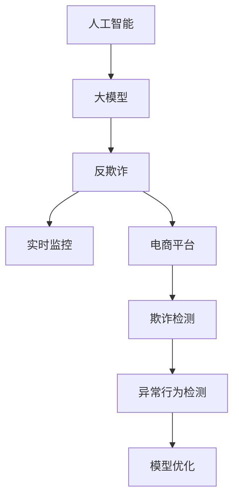

                 

# AI大模型在电商平台反欺诈实时监控中的应用

> 关键词：人工智能,大模型,反欺诈,实时监控,电商平台,欺诈检测,异常行为检测,模型优化

## 1. 背景介绍

### 1.1 问题由来
随着电子商务的蓬勃发展，电商平台上的交易量激增，带来了巨大的经济效益，但也伴随着诸如恶意刷单、虚假交易、账号盗用等欺诈行为。这些欺诈行为不仅侵害了商家的利益，也影响了消费者的购物体验，威胁到了平台的健康发展。如何构建一个高效、智能的反欺诈系统，及时发现和防范各类欺诈行为，是电商平台急需解决的问题。

### 1.2 问题核心关键点
电商平台反欺诈系统的核心目标在于通过实时监控交易行为，及时识别出潜在的欺诈活动，并进行预警或拦截。传统的人工规则检测方式需要大量人工编写规则，难以应对复杂多变的欺诈模式。而基于大模型的反欺诈系统，可以通过学习海量交易数据，自动发现欺诈行为的模式和规律，从而显著提升反欺诈的准确率和效率。

## 2. 核心概念与联系

### 2.1 核心概念概述

为更好地理解AI大模型在电商平台反欺诈实时监控中的应用，本节将介绍几个密切相关的核心概念：

- **人工智能(AI)**：通过算法和模型，使计算机具备类人智能，能够自主学习、推理、决策等。
- **大模型(Large Model)**：具有亿级参数规模，可以学习到复杂而广泛的知识，适用于各种NLP和图像任务。
- **反欺诈(Fraud Detection)**：识别并防范欺诈行为，确保交易安全。
- **实时监控(Real-time Monitoring)**：实时分析交易数据，及时发现异常行为。
- **电商平台(E-commerce Platform)**：指在线销售商品或服务的平台，如淘宝、京东、亚马逊等。
- **欺诈检测(Fraud Detection)**：通过模型和算法，对交易行为进行监测，识别出潜在欺诈行为。
- **异常行为检测(Anomaly Detection)**：识别出不符合正常行为模式的活动，发现异常交易。
- **模型优化(Model Optimization)**：通过训练、调参等方式，提升模型的性能和泛化能力。

这些核心概念之间的逻辑关系可以通过以下Mermaid流程图来展示：



这个流程图展示了大模型的核心概念及其之间的关系：

1. 人工智能通过算法和模型赋予计算机智能能力。
2. 大模型通过大规模预训练，学习到丰富的知识，适用于各种任务。
3. 反欺诈系统通过实时监控交易行为，识别欺诈行为。
4. 电商平台为反欺诈系统提供数据来源和应用场景。
5. 欺诈检测利用大模型学习交易行为的模式，及时发现潜在欺诈。
6. 异常行为检测识别异常交易，提供更多数据给大模型进行优化。
7. 模型优化通过不断迭代，提升模型的准确性和泛化能力。

这些概念共同构成了AI大模型在电商平台反欺诈中的应用框架，使得平台能够高效、智能地防范欺诈行为，保护商家和消费者的权益。

## 3. 核心算法原理 & 具体操作步骤
### 3.1 算法原理概述

基于大模型的反欺诈系统，本质上是一个有监督的异常检测系统。其核心思想是：将大模型作为强大的"特征提取器"，通过在电商平台上的交易数据上进行有监督的训练，使得模型能够学习到正常交易的行为模式，并在新的交易数据上实时检测异常行为，从而及时发现欺诈活动。

形式化地，假设交易数据集为 $D=\{(x_i,y_i)\}_{i=1}^N$，其中 $x_i$ 为交易记录，$y_i$ 为标注（0表示正常，1表示欺诈）。反欺诈系统的目标是最大化模型的准确率和召回率：

$$
\max_{\theta} \{Precision, Recall\} = \max_{\theta} \{\frac{TP}{TP+FP}, \frac{TP}{TP+FN}\}
$$

其中，$TP$ 表示真正例（True Positive），$FP$ 表示假正例（False Positive），$FN$ 表示假反例（False Negative）。模型的训练目标是最小化误分类损失，即

$$
\min_{\theta} \mathcal{L}(D) = \min_{\theta} \{\mathbb{E}_{(x,y)}[\ell(y, f(x;\theta))\}
$$

其中 $\ell(y, f(x;\theta))$ 为损失函数，$f(x;\theta)$ 表示模型的预测输出。

### 3.2 算法步骤详解

基于大模型的反欺诈系统一般包括以下几个关键步骤：

**Step 1: 数据准备与处理**
- 收集电商平台的历史交易数据，清洗并标注数据，将其划分为训练集、验证集和测试集。
- 对交易数据进行特征工程，提取与欺诈相关的关键特征，如交易金额、时间、地点等。

**Step 2: 模型选择与初始化**
- 选择合适的预训练模型，如BERT、GPT等，作为特征提取器。
- 将预训练模型嵌入深度学习框架，并设定合适的超参数，如学习率、批大小、迭代轮数等。

**Step 3: 数据增强与扩充**
- 使用数据增强技术，如数据回译、近义替换等，扩充训练集数据量。
- 引入对抗样本，提高模型鲁棒性，应对各种欺诈模式。

**Step 4: 模型训练与优化**
- 使用有监督学习方法，通过训练集数据对模型进行训练，最小化损失函数。
- 应用正则化技术，如L2正则、Dropout等，避免模型过拟合。
- 采用早停法（Early Stopping），避免模型过度训练。

**Step 5: 模型评估与部署**
- 在验证集上评估模型性能，调整超参数，提升模型泛化能力。
- 使用测试集对模型进行最终评估，确保模型性能稳定可靠。
- 将模型集成到电商平台的反欺诈系统中，进行实时监控和欺诈检测。

**Step 6: 模型维护与迭代**
- 定期收集新交易数据，更新模型，保持其适应新环境和欺诈模式。
- 对模型进行定期监控，识别和修复潜在问题。
- 根据业务需求和数据变化，不断优化模型结构和训练方法。

以上是基于大模型的反欺诈系统的一般流程。在实际应用中，还需要针对具体平台特点和欺诈模式，对微调过程的各个环节进行优化设计，如改进训练目标函数，引入更多的正则化技术，搜索最优的超参数组合等，以进一步提升模型性能。

### 3.3 算法优缺点

基于大模型的反欺诈系统具有以下优点：
1. 高效检测：大模型能够学习复杂的欺诈模式，实时检测交易行为，提升欺诈检测效率。
2. 适应性强：通过不断的训练和优化，模型能够适应不同场景和欺诈模式的变化。
3. 准确度高：结合大规模数据训练，模型能够识别出多种欺诈行为，提高检测准确率。

同时，该系统也存在一些局限性：
1. 数据依赖：模型性能高度依赖于标注数据的数量和质量，标注数据的获取成本较高。
2. 计算资源消耗大：大模型的训练和推理需要大量的计算资源，对平台硬件配置要求较高。
3. 模型复杂：大模型的结构复杂，训练和维护成本较高。
4. 透明度不足：大模型的决策过程复杂，难以进行详细的解释和调试。

尽管存在这些局限性，但就目前而言，基于大模型的反欺诈系统仍是电商平台上检测和防范欺诈行为的重要手段。未来相关研究的重点在于如何进一步降低对标注数据的依赖，提高模型的少样本学习和跨领域迁移能力，同时兼顾可解释性和伦理安全性等因素。

### 3.4 算法应用领域

基于大模型的反欺诈系统已经在多个电商平台上得到应用，并取得了显著的成效。以下是几个主要的应用场景：

- **电商平台欺诈检测**：实时监控交易行为，识别出潜在的欺诈活动，如虚假交易、恶意刷单等。
- **账号异常检测**：识别出异常登录行为，防范账号盗用和恶意操作。
- **支付异常检测**：对支付行为进行实时监控，发现异常交易，如洗钱、套现等。
- **商品异常检测**：检测商品属性、描述等是否异常，防范虚假商品交易。

除了这些经典应用外，基于大模型的反欺诈系统还被创新性地应用于更多场景中，如用户行为分析、商品质量监控、物流异常检测等，为电商平台提供了更全面的风险防范能力。

## 4. 数学模型和公式 & 详细讲解 & 举例说明

### 4.1 数学模型构建

本节将使用数学语言对基于大模型的电商平台反欺诈系统进行更加严格的刻画。

记电商平台上的交易数据集为 $D=\{(x_i,y_i)\}_{i=1}^N$，其中 $x_i$ 为交易记录，$y_i$ 为标注（0表示正常，1表示欺诈）。

定义模型 $M_{\theta}$ 在输入 $x_i$ 上的输出为 $\hat{y}_i=M_{\theta}(x_i) \in [0,1]$，表示模型预测交易行为是否正常。定义损失函数为二分类交叉熵损失：

$$
\ell(y_i, \hat{y}_i) = -[y_i \log \hat{y}_i + (1-y_i) \log (1-\hat{y}_i)]
$$

则在数据集 $D$ 上的经验风险为：

$$
\mathcal{L}(\theta) = \frac{1}{N} \sum_{i=1}^N \ell(y_i, \hat{y}_i)
$$

模型的训练目标是最小化经验风险，即找到最优参数：

$$
\theta^* = \mathop{\arg\min}_{\theta} \mathcal{L}(\theta)
$$

在实践中，我们通常使用基于梯度的优化算法（如AdamW、SGD等）来近似求解上述最优化问题。设 $\eta$ 为学习率，$\lambda$ 为正则化系数，则参数的更新公式为：

$$
\theta \leftarrow \theta - \eta \nabla_{\theta}\mathcal{L}(\theta) - \eta\lambda\theta
$$

其中 $\nabla_{\theta}\mathcal{L}(\theta)$ 为损失函数对参数 $\theta$ 的梯度，可通过反向传播算法高效计算。

### 4.2 公式推导过程

以下我们以二分类任务为例，推导交叉熵损失函数及其梯度的计算公式。

假设模型 $M_{\theta}$ 在输入 $x$ 上的输出为 $\hat{y}=M_{\theta}(x) \in [0,1]$，表示样本属于正类的概率。真实标签 $y \in \{0,1\}$。则二分类交叉熵损失函数定义为：

$$
\ell(y_i, \hat{y}_i) = -[y_i\log \hat{y}_i + (1-y_i)\log (1-\hat{y}_i)]
$$

将其代入经验风险公式，得：

$$
\mathcal{L}(\theta) = -\frac{1}{N}\sum_{i=1}^N [y_i\log \hat{y}_i+(1-y_i)\log(1-\hat{y}_i)]
$$

根据链式法则，损失函数对参数 $\theta_k$ 的梯度为：

$$
\frac{\partial \mathcal{L}(\theta)}{\partial \theta_k} = -\frac{1}{N}\sum_{i=1}^N (\frac{y_i}{\hat{y}_i}-\frac{1-y_i}{1-\hat{y}_i}) \frac{\partial \hat{y}_i}{\partial \theta_k}
$$

其中 $\frac{\partial \hat{y}_i}{\partial \theta_k}$ 可进一步递归展开，利用自动微分技术完成计算。

在得到损失函数的梯度后，即可带入参数更新公式，完成模型的迭代优化。重复上述过程直至收敛，最终得到适应电商平台反欺诈任务的最优模型参数 $\theta^*$。

## 5. 项目实践：代码实例和详细解释说明
### 5.1 开发环境搭建

在进行反欺诈系统开发前，我们需要准备好开发环境。以下是使用Python进行PyTorch开发的环境配置流程：

1. 安装Anaconda：从官网下载并安装Anaconda，用于创建独立的Python环境。

2. 创建并激活虚拟环境：
```bash
conda create -n pytorch-env python=3.8 
conda activate pytorch-env
```

3. 安装PyTorch：根据CUDA版本，从官网获取对应的安装命令。例如：
```bash
conda install pytorch torchvision torchaudio cudatoolkit=11.1 -c pytorch -c conda-forge
```

4. 安装Transformers库：
```bash
pip install transformers
```

5. 安装各类工具包：
```bash
pip install numpy pandas scikit-learn matplotlib tqdm jupyter notebook ipython
```

完成上述步骤后，即可在`pytorch-env`环境中开始反欺诈系统开发。

### 5.2 源代码详细实现

下面我们以电商平台欺诈检测任务为例，给出使用Transformers库对BERT模型进行反欺诈检测的PyTorch代码实现。

首先，定义欺诈检测任务的数据处理函数：

```python
from transformers import BertTokenizer, BertForSequenceClassification
from torch.utils.data import Dataset
import torch

class FraudDetectionDataset(Dataset):
    def __init__(self, texts, labels, tokenizer, max_len=128):
        self.texts = texts
        self.labels = labels
        self.tokenizer = tokenizer
        self.max_len = max_len
        
    def __len__(self):
        return len(self.texts)
    
    def __getitem__(self, item):
        text = self.texts[item]
        label = self.labels[item]
        
        encoding = self.tokenizer(text, return_tensors='pt', max_length=self.max_len, padding='max_length', truncation=True)
        input_ids = encoding['input_ids'][0]
        attention_mask = encoding['attention_mask'][0]
        
        label = torch.tensor(label, dtype=torch.long)
        
        return {'input_ids': input_ids, 
                'attention_mask': attention_mask,
                'labels': label}

# 标签与id的映射
label2id = {'0': 0, '1': 1}
id2label = {v: k for k, v in label2id.items()}

# 创建dataset
tokenizer = BertTokenizer.from_pretrained('bert-base-cased')

train_dataset = FraudDetectionDataset(train_texts, train_labels, tokenizer)
dev_dataset = FraudDetectionDataset(dev_texts, dev_labels, tokenizer)
test_dataset = FraudDetectionDataset(test_texts, test_labels, tokenizer)
```

然后，定义模型和优化器：

```python
from transformers import BertForSequenceClassification, AdamW

model = BertForSequenceClassification.from_pretrained('bert-base-cased', num_labels=2)

optimizer = AdamW(model.parameters(), lr=2e-5)
```

接着，定义训练和评估函数：

```python
from torch.utils.data import DataLoader
from tqdm import tqdm
from sklearn.metrics import classification_report

device = torch.device('cuda') if torch.cuda.is_available() else torch.device('cpu')
model.to(device)

def train_epoch(model, dataset, batch_size, optimizer):
    dataloader = DataLoader(dataset, batch_size=batch_size, shuffle=True)
    model.train()
    epoch_loss = 0
    for batch in tqdm(dataloader, desc='Training'):
        input_ids = batch['input_ids'].to(device)
        attention_mask = batch['attention_mask'].to(device)
        labels = batch['labels'].to(device)
        model.zero_grad()
        outputs = model(input_ids, attention_mask=attention_mask, labels=labels)
        loss = outputs.loss
        epoch_loss += loss.item()
        loss.backward()
        optimizer.step()
    return epoch_loss / len(dataloader)

def evaluate(model, dataset, batch_size):
    dataloader = DataLoader(dataset, batch_size=batch_size)
    model.eval()
    preds, labels = [], []
    with torch.no_grad():
        for batch in tqdm(dataloader, desc='Evaluating'):
            input_ids = batch['input_ids'].to(device)
            attention_mask = batch['attention_mask'].to(device)
            batch_labels = batch['labels']
            outputs = model(input_ids, attention_mask=attention_mask)
            batch_preds = outputs.logits.argmax(dim=1).to('cpu').tolist()
            batch_labels = batch_labels.to('cpu').tolist()
            for pred, label in zip(batch_preds, batch_labels):
                preds.append(pred)
                labels.append(label)
                
    print(classification_report(labels, preds))
```

最后，启动训练流程并在测试集上评估：

```python
epochs = 5
batch_size = 16

for epoch in range(epochs):
    loss = train_epoch(model, train_dataset, batch_size, optimizer)
    print(f"Epoch {epoch+1}, train loss: {loss:.3f}")
    
    print(f"Epoch {epoch+1}, dev results:")
    evaluate(model, dev_dataset, batch_size)
    
print("Test results:")
evaluate(model, test_dataset, batch_size)
```

以上就是使用PyTorch对BERT进行电商平台反欺诈检测任务的完整代码实现。可以看到，得益于Transformers库的强大封装，我们可以用相对简洁的代码完成BERT模型的加载和反欺诈检测任务的微调。

### 5.3 代码解读与分析

让我们再详细解读一下关键代码的实现细节：

**FraudDetectionDataset类**：
- `__init__`方法：初始化文本、标签、分词器等关键组件。
- `__len__`方法：返回数据集的样本数量。
- `__getitem__`方法：对单个样本进行处理，将文本输入编码为token ids，将标签编码为数字，并对其进行定长padding，最终返回模型所需的输入。

**label2id和id2label字典**：
- 定义了标签与数字id之间的映射关系，用于将模型预测结果解码回真实的标签。

**训练和评估函数**：
- 使用PyTorch的DataLoader对数据集进行批次化加载，供模型训练和推理使用。
- 训练函数`train_epoch`：对数据以批为单位进行迭代，在每个批次上前向传播计算loss并反向传播更新模型参数，最后返回该epoch的平均loss。
- 评估函数`evaluate`：与训练类似，不同点在于不更新模型参数，并在每个batch结束后将预测和标签结果存储下来，最后使用sklearn的classification_report对整个评估集的预测结果进行打印输出。

**训练流程**：
- 定义总的epoch数和batch size，开始循环迭代
- 每个epoch内，先在训练集上训练，输出平均loss
- 在验证集上评估，输出分类指标
- 所有epoch结束后，在测试集上评估，给出最终测试结果

可以看到，PyTorch配合Transformers库使得BERT反欺诈检测任务的代码实现变得简洁高效。开发者可以将更多精力放在数据处理、模型改进等高层逻辑上，而不必过多关注底层的实现细节。

当然，工业级的系统实现还需考虑更多因素，如模型的保存和部署、超参数的自动搜索、更灵活的任务适配层等。但核心的反欺诈范式基本与此类似。

## 6. 实际应用场景
### 6.1 智能客服系统

基于大语言模型微调的对话技术，可以广泛应用于智能客服系统的构建。传统客服往往需要配备大量人力，高峰期响应缓慢，且一致性和专业性难以保证。而使用微调后的对话模型，可以7x24小时不间断服务，快速响应客户咨询，用自然流畅的语言解答各类常见问题。

在技术实现上，可以收集企业内部的历史客服对话记录，将问题和最佳答复构建成监督数据，在此基础上对预训练对话模型进行微调。微调后的对话模型能够自动理解用户意图，匹配最合适的答案模板进行回复。对于客户提出的新问题，还可以接入检索系统实时搜索相关内容，动态组织生成回答。如此构建的智能客服系统，能大幅提升客户咨询体验和问题解决效率。

### 6.2 金融舆情监测

金融机构需要实时监测市场舆论动向，以便及时应对负面信息传播，规避金融风险。传统的人工监测方式成本高、效率低，难以应对网络时代海量信息爆发的挑战。基于大语言模型微调的文本分类和情感分析技术，为金融舆情监测提供了新的解决方案。

具体而言，可以收集金融领域相关的新闻、报道、评论等文本数据，并对其进行主题标注和情感标注。在此基础上对预训练语言模型进行微调，使其能够自动判断文本属于何种主题，情感倾向是正面、中性还是负面。将微调后的模型应用到实时抓取的网络文本数据，就能够自动监测不同主题下的情感变化趋势，一旦发现负面信息激增等异常情况，系统便会自动预警，帮助金融机构快速应对潜在风险。

### 6.3 个性化推荐系统

当前的推荐系统往往只依赖用户的历史行为数据进行物品推荐，无法深入理解用户的真实兴趣偏好。基于大语言模型微调技术，个性化推荐系统可以更好地挖掘用户行为背后的语义信息，从而提供更精准、多样的推荐内容。

在实践中，可以收集用户浏览、点击、评论、分享等行为数据，提取和用户交互的物品标题、描述、标签等文本内容。将文本内容作为模型输入，用户的后续行为（如是否点击、购买等）作为监督信号，在此基础上微调预训练语言模型。微调后的模型能够从文本内容中准确把握用户的兴趣点。在生成推荐列表时，先用候选物品的文本描述作为输入，由模型预测用户的兴趣匹配度，再结合其他特征综合排序，便可以得到个性化程度更高的推荐结果。

### 6.4 未来应用展望

随着大语言模型微调技术的发展，基于微调范式将在更多领域得到应用，为传统行业带来变革性影响。

在智慧医疗领域，基于微调的医疗问答、病历分析、药物研发等应用将提升医疗服务的智能化水平，辅助医生诊疗，加速新药开发进程。

在智能教育领域，微调技术可应用于作业批改、学情分析、知识推荐等方面，因材施教，促进教育公平，提高教学质量。

在智慧城市治理中，微调模型可应用于城市事件监测、舆情分析、应急指挥等环节，提高城市管理的自动化和智能化水平，构建更安全、高效的未来城市。

此外，在企业生产、社会治理、文娱传媒等众多领域，基于大模型微调的人工智能应用也将不断涌现，为经济社会发展注入新的动力。相信随着技术的日益成熟，微调方法将成为人工智能落地应用的重要范式，推动人工智能技术在垂直行业的规模化落地。

## 7. 工具和资源推荐
### 7.1 学习资源推荐

为了帮助开发者系统掌握大模型在电商平台反欺诈实时监控中的应用，这里推荐一些优质的学习资源：

1. 《Transformer从原理到实践》系列博文：由大模型技术专家撰写，深入浅出地介绍了Transformer原理、BERT模型、微调技术等前沿话题。

2. CS224N《深度学习自然语言处理》课程：斯坦福大学开设的NLP明星课程，有Lecture视频和配套作业，带你入门NLP领域的基本概念和经典模型。

3. 《Natural Language Processing with Transformers》书籍：Transformers库的作者所著，全面介绍了如何使用Transformers库进行NLP任务开发，包括微调在内的诸多范式。

4. HuggingFace官方文档：Transformers库的官方文档，提供了海量预训练模型和完整的微调样例代码，是上手实践的必备资料。

5. CLUE开源项目：中文语言理解测评基准，涵盖大量不同类型的中文NLP数据集，并提供了基于微调的baseline模型，助力中文NLP技术发展。

通过对这些资源的学习实践，相信你一定能够快速掌握大模型在电商平台反欺诈中的应用精髓，并用于解决实际的NLP问题。
###  7.2 开发工具推荐

高效的开发离不开优秀的工具支持。以下是几款用于大模型微调开发的常用工具：

1. PyTorch：基于Python的开源深度学习框架，灵活动态的计算图，适合快速迭代研究。大部分预训练语言模型都有PyTorch版本的实现。

2. TensorFlow：由Google主导开发的开源深度学习框架，生产部署方便，适合大规模工程应用。同样有丰富的预训练语言模型资源。

3. Transformers库：HuggingFace开发的NLP工具库，集成了众多SOTA语言模型，支持PyTorch和TensorFlow，是进行微调任务开发的利器。

4. Weights & Biases：模型训练的实验跟踪工具，可以记录和可视化模型训练过程中的各项指标，方便对比和调优。与主流深度学习框架无缝集成。

5. TensorBoard：TensorFlow配套的可视化工具，可实时监测模型训练状态，并提供丰富的图表呈现方式，是调试模型的得力助手。

6. Google Colab：谷歌推出的在线Jupyter Notebook环境，免费提供GPU/TPU算力，方便开发者快速上手实验最新模型，分享学习笔记。

合理利用这些工具，可以显著提升大模型微调的开发效率，加快创新迭代的步伐。

### 7.3 相关论文推荐

大模型和微调技术的发展源于学界的持续研究。以下是几篇奠基性的相关论文，推荐阅读：

1. Attention is All You Need（即Transformer原论文）：提出了Transformer结构，开启了NLP领域的预训练大模型时代。

2. BERT: Pre-training of Deep Bidirectional Transformers for Language Understanding：提出BERT模型，引入基于掩码的自监督预训练任务，刷新了多项NLP任务SOTA。

3. Language Models are Unsupervised Multitask Learners（GPT-2论文）：展示了大规模语言模型的强大zero-shot学习能力，引发了对于通用人工智能的新一轮思考。

4. Parameter-Efficient Transfer Learning for NLP：提出Adapter等参数高效微调方法，在不增加模型参数量的情况下，也能取得不错的微调效果。

5. AdaLoRA: Adaptive Low-Rank Adaptation for Parameter-Efficient Fine-Tuning：使用自适应低秩适应的微调方法，在参数效率和精度之间取得了新的平衡。

6. Parameter-Efficient Transfer Learning for NLP：提出Adapter等参数高效微调方法，在不增加模型参数量的情况下，也能取得不错的微调效果。

这些论文代表了大模型微调技术的发展脉络。通过学习这些前沿成果，可以帮助研究者把握学科前进方向，激发更多的创新灵感。

## 8. 总结：未来发展趋势与挑战

### 8.1 总结

本文对基于大模型的电商平台反欺诈实时监控系统进行了全面系统的介绍。首先阐述了大模型和反欺诈技术的研究背景和意义，明确了反欺诈系统在保障电商平台交易安全中的重要地位。其次，从原理到实践，详细讲解了基于大模型的反欺诈系统的数学原理和关键步骤，给出了反欺诈任务开发的完整代码实例。同时，本文还广泛探讨了反欺诈系统在智能客服、金融舆情、个性化推荐等多个行业领域的应用前景，展示了反欺诈范式的广泛适用性和巨大潜力。此外，本文精选了反欺诈技术的各类学习资源，力求为读者提供全方位的技术指引。

通过本文的系统梳理，可以看到，基于大模型的反欺诈系统通过实时监控和异常行为检测，能够高效识别出各类欺诈活动，为电商平台提供了坚实的安全保障。大模型的高效学习和泛化能力，使得反欺诈系统具有较强的适应性和灵活性，能够应对多种欺诈模式和场景。未来，伴随反欺诈技术的持续演进，反欺诈系统必将在电商平台上发挥越来越重要的作用，助力平台健康持续发展。

### 8.2 未来发展趋势

展望未来，基于大模型的反欺诈系统将呈现以下几个发展趋势：

1. 模型规模持续增大。随着算力成本的下降和数据规模的扩张，反欺诈模型的参数量还将持续增长。超大模型能够学习更复杂的欺诈模式，具备更强的泛化能力。

2. 反欺诈方法日趋多样化。除了传统的全参数微调外，未来会涌现更多参数高效的反欺诈方法，如Prompt-Tuning、LoRA等，在节省计算资源的同时也能保证检测精度。

3. 异常检测与异常行为分析相结合。未来的反欺诈系统不仅检测异常交易，还将进一步分析异常行为背后的原因，提供更精准的防欺诈策略。

4. 多模态反欺诈技术崛起。当前的反欺诈技术主要聚焦于文本数据，未来会进一步拓展到图像、视频、语音等多模态数据反欺诈。多模态信息的融合，将显著提升反欺诈系统的鲁棒性和检测准确率。

5. 持续学习与动态优化。随着交易模式的变化和新欺诈手段的不断出现，反欺诈模型需要持续学习新数据，不断优化模型参数和检测算法，保持对欺诈活动的敏感性和适应性。

6. 跨平台反欺诈技术融合。未来的反欺诈系统不仅服务于单一平台，还将跨平台融合，形成更广泛的应用范围和更高的检测效率。

以上趋势凸显了基于大模型的反欺诈系统的广阔前景。这些方向的探索发展，必将进一步提升反欺诈系统的性能和应用范围，为电商平台提供更全面的安全保障。

### 8.3 面临的挑战

尽管基于大模型的反欺诈系统已经取得了显著的成效，但在迈向更加智能化、普适化应用的过程中，仍面临诸多挑战：

1. 数据隐私与安全问题。电商平台上的交易数据涉及用户隐私，如何保护数据安全，避免数据泄露，是反欺诈系统面临的重要问题。

2. 高计算资源需求。大模型的训练和推理需要大量的计算资源，对平台硬件配置要求较高，如何降低计算成本，提高系统效率，是未来反欺诈系统面临的重要课题。

3. 模型鲁棒性不足。当前反欺诈模型面对域外数据时，泛化性能往往大打折扣。对于测试样本的微小扰动，模型的检测效果也容易发生波动。如何提高模型的鲁棒性，避免过拟合，是需要不断优化的方向。

4. 可解释性不足。当前反欺诈模型往往不提供详细的检测理由，难以进行详细的解释和调试。对于关键交易的误判和漏判，模型输出需要具备更高的可解释性，才能满足合规和安全需求。

5. 多任务融合与协同。电商平台上的交易活动多种多样，反欺诈系统需要能够处理多种任务，并进行多任务的协同优化。如何实现多任务的统一建模和优化，需要更多的研究探索。

6. 实时性要求高。反欺诈系统需要实时响应交易，进行实时的检测和拦截。如何在保证检测准确性的同时，提升系统的实时性，是未来反欺诈系统需要解决的重要问题。

这些挑战凸显了反欺诈系统在实现过程中需要面对的实际问题。未来的研究需要在保护用户隐私、提升系统效率、增强模型鲁棒性、提高模型可解释性等方面持续发力，才能构建高效、智能、安全可靠的反欺诈系统。

### 8.4 研究展望

面对反欺诈系统面临的挑战，未来的研究需要在以下几个方面寻求新的突破：

1. 探索少样本和无监督反欺诈方法。摆脱对大规模标注数据的依赖，利用自监督学习、主动学习等无监督范式，最大限度利用非结构化数据，实现更加灵活高效的反欺诈。

2. 研究参数高效和计算高效的反欺诈范式。开发更加参数高效的反欺诈方法，在固定大部分预训练参数的同时，只更新极少量的任务相关参数。同时优化反欺诈模型的计算图，减少前向传播和反向传播的资源消耗，实现更加轻量级、实时性的部署。

3. 引入更多先验知识。将符号化的先验知识，如知识图谱、逻辑规则等，与神经网络模型进行巧妙融合，引导反欺诈过程学习更准确、合理的欺诈模式。同时加强不同模态数据的整合，实现视觉、语音等多模态信息与文本信息的协同建模。

4. 结合因果分析和博弈论工具。将因果分析方法引入反欺诈模型，识别出模型检测的关键特征，增强输出解释的因果性和逻辑性。借助博弈论工具刻画人机交互过程，主动探索并规避模型的脆弱点，提高系统稳定性。

5. 纳入伦理道德约束。在模型训练目标中引入伦理导向的评估指标，过滤和惩罚有偏见、有害的输出倾向。同时加强人工干预和审核，建立模型行为的监管机制，确保输出符合人类价值观和伦理道德。

这些研究方向的研究，必将引领基于大模型的反欺诈技术迈向更高的台阶，为构建安全、可靠、可解释、可控的智能系统铺平道路。面向未来，反欺诈技术还需要与其他人工智能技术进行更深入的融合，如知识表示、因果推理、强化学习等，多路径协同发力，共同推动反欺诈系统的进步。只有勇于创新、敢于突破，才能不断拓展反欺诈技术的边界，让智能技术更好地造福电商平台的健康发展。

## 9. 附录：常见问题与解答

**Q1：电商平台反欺诈系统如何收集和标注数据？**

A: 电商平台反欺诈系统的数据收集和标注主要通过以下几个步骤进行：
1. 数据收集：收集电商平台的历史交易数据，包括交易金额、时间、地点、用户行为等。
2. 数据清洗：对收集到的数据进行清洗，去除无关、无用的数据，保证数据质量。
3. 数据标注：对交易数据进行标注，标注为正常或欺诈。标注过程需要人工审核，确保标注的准确性和一致性。

**Q2：电商平台反欺诈系统如何处理异常数据？**

A: 电商平台反欺诈系统通常采用以下方法处理异常数据：
1. 数据清洗：对收集到的数据进行清洗，去除无关、无用的数据，保证数据质量。
2. 特征工程：对交易数据进行特征工程，提取与欺诈相关的关键特征，如交易金额、时间、地点等。
3. 数据增强：使用数据增强技术，如数据回译、近义替换等，扩充训练集数据量。
4. 对抗样本训练：引入对抗样本，提高模型鲁棒性，应对各种欺诈模式。
5. 多模型集成：训练多个反欺诈模型，取平均输出，抑制过拟合。

**Q3：电商平台反欺霜系统如何保护用户隐私？**

A: 电商平台反欺诈系统需要保护用户隐私，主要通过以下几个措施：
1. 数据匿名化：对用户数据进行匿名化处理，去除个人身份信息，保护用户隐私。
2. 数据加密：对交易数据进行加密存储和传输，防止数据泄露。
3. 访问控制：对反欺诈系统的访问进行严格控制，仅授权人员可以访问敏感数据。
4. 隐私政策：制定隐私政策，明确数据使用的范围和方式，保障用户知情权。

**Q4：电商平台反欺诈系统如何提升实时性？**

A: 电商平台反欺诈系统需要提升实时性，主要通过以下几个措施：
1. 数据预处理：对实时交易数据进行预处理，提取关键特征，减少后续处理的时间。
2. 快速模型部署：采用轻量级模型，优化计算图，减少推理时间。
3. 多任务协同：将反欺诈任务与其他任务进行协同，实现多任务并行处理，提高系统响应速度。
4. 边缘计算：将反欺诈模型部署在边缘设备上，减少数据传输延迟，提高实时性。

**Q5：电商平台反欺诈系统如何进行效果评估？**

A: 电商平台反欺诈系统的效果评估主要通过以下几个指标进行：
1. 精确率（Precision）：反欺诈系统正确识别欺诈交易的比例。
2. 召回率（Recall）：反欺诈系统发现欺诈交易的比例。
3. F1分数（F1 Score）：精确率和召回率的调和平均数，综合评估反欺诈系统的性能。
4. 受影响的用户数（Impact on Users）：反欺诈系统误判或漏判的交易数，评估模型的负面影响。

通过不断优化模型和调整超参数，可以提升电商平台反欺诈系统的各项指标，确保系统的性能和可靠性。

---

作者：禅与计算机程序设计艺术 / Zen and the Art of Computer Programming

