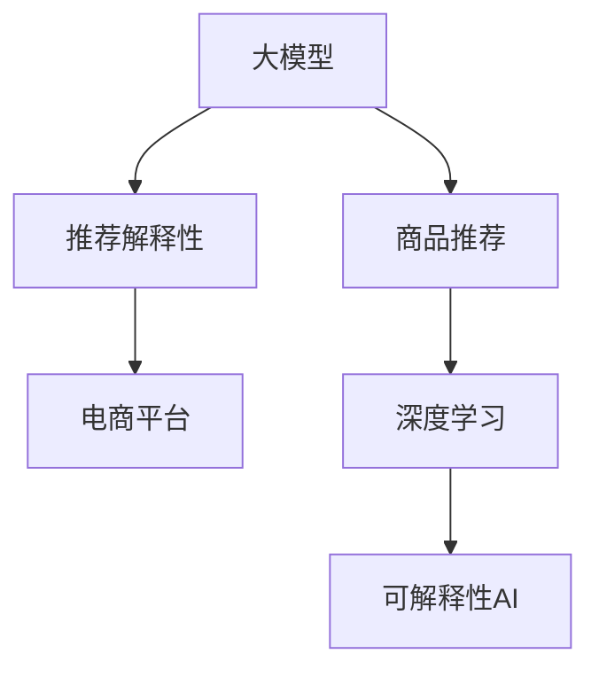

                 

# AI大模型在电商平台商品推荐解释性中的应用

> 关键词：AI大模型, 商品推荐, 解释性, 电商平台, 推荐系统

## 1. 背景介绍

随着人工智能技术的飞速发展，人工智能在电商行业中的应用越来越广泛，其中商品推荐系统已经成为电商平台不可或缺的一部分。传统的推荐系统以协同过滤、内容过滤为基础，通过分析用户行为和商品属性，为用户推荐个性化商品。而随着人工智能的逐步落地，基于深度学习尤其是大模型的推荐系统逐渐成为研究热点。大模型可以更好地捕捉用户和商品之间的复杂关系，提供更为精准、多样化的推荐结果。但大模型的“黑盒”特性使得推荐结果难以解释，客户和商家对推荐系统的信任度降低。

解释性在大模型的推荐系统中变得尤为重要。在电商推荐场景中，商品推荐结果需要具备充分的解释性，才能让用户信服并长期使用。本文将从模型设计、算法实现、应用案例等多个方面，探讨如何在电商平台商品推荐中引入大模型的解释性，并提出具体的解决方案。

## 2. 核心概念与联系

### 2.1 核心概念概述

为更好地理解基于大模型的电商平台商品推荐解释性应用，本节将介绍几个密切相关的核心概念：

- 大模型(Large Model)：指通过大规模数据预训练得到的复杂神经网络模型，具有强大的表示能力。例如BERT、GPT等。
- 商品推荐(Recommendation System)：利用用户行为和商品属性，为用户提供个性化商品推荐，提升用户满意度和电商转化率。
- 推荐解释性(Explainability)：解释推荐结果的依据，让用户明白为什么被推荐某商品，提升用户对推荐系统的信任感。
- 电商平台(E-Commerce Platform)：指利用互联网提供商品销售、交易、配送、支付等服务的平台，如淘宝、京东等。
- 深度学习(Deep Learning)：通过多层次的神经网络结构，模拟人脑的逻辑思维过程，对大量复杂数据进行学习和分析。
- 可解释性AI(Explainable AI)：在AI系统中加入解释机制，使得模型的决策过程透明化，易于用户理解和接受。

这些核心概念之间的逻辑关系可以通过以下Mermaid流程图来展示：



这个流程图展示了大模型、商品推荐、推荐解释性、电商平台、深度学习、可解释性AI等核心概念之间的关系：

1. 大模型通过预训练获得复杂的语言表示能力，可以更好地刻画用户和商品之间的关系。
2. 商品推荐利用大模型输出的表示，为用户推荐个性化商品。
3. 推荐解释性在大模型推荐系统中，通过解释模型决策过程，增强用户对推荐结果的信任感。
4. 电商平台作为应用场景，利用推荐系统和解释性技术，提升用户体验和转化率。
5. 深度学习为推荐系统和解释性技术提供了强大的底层支持，使得模型可以更好地学习数据规律。
6. 可解释性AI在大模型推荐系统中，使得模型的决策过程透明化，增强了系统的可信度。

这些概念共同构成了电商推荐系统的技术框架，使得大模型可以在推荐场景中发挥强大的性能。

## 3. 核心算法原理 & 具体操作步骤
### 3.1 算法原理概述

基于大模型的电商推荐解释性应用，通常包括以下几个核心算法：

- **深度学习模型构建**：使用大模型作为商品推荐系统的基础模型，通过预训练学习用户和商品之间的复杂关系。
- **推荐生成算法**：通过深度学习模型输出商品表示，结合用户特征，生成个性化推荐结果。
- **解释性算法**：设计解释性算法，对推荐结果进行解释，提升用户信任感。

在具体实现中，推荐系统会根据用户的历史行为、偏好等信息，生成候选商品列表。再通过大模型对候选商品进行评分，生成最终的推荐结果。解释性算法会进一步分析大模型的内部结构，提取推荐结果的依据，形成用户可理解的解释。

### 3.2 算法步骤详解

以下将详细说明电商平台商品推荐解释性应用的核心算法步骤：

**Step 1: 准备数据集**
- 收集电商平台的交易数据、用户行为数据、商品属性数据等，清洗和标注数据。
- 构建用户和商品的向量表示，作为模型的输入。

**Step 2: 构建深度学习模型**
- 选择合适的深度学习模型作为商品推荐的基础，如Graph Neural Network (GNN)、Transformer等。
- 在大模型上进行预训练，学习用户和商品的表示。
- 根据电商平台的商品推荐任务，设计合适的任务适配层，如全连接层、注意力机制等。

**Step 3: 推荐生成**
- 根据用户的历史行为和商品特征，生成候选商品的表示。
- 使用大模型对候选商品进行评分，生成推荐列表。

**Step 4: 解释性分析**
- 分析大模型的内部结构，提取推荐结果的依据。
- 设计解释性算法，对推荐结果进行解释。

**Step 5: 系统部署和测试**
- 将推荐系统和解释性算法集成到电商平台上。
- 在实际应用中，不断优化推荐模型和解释性算法，提高推荐效果和用户满意度。

### 3.3 算法优缺点

基于大模型的电商平台商品推荐解释性应用，具有以下优点：
1. 提升推荐精度：大模型具有强大的表示能力，可以更好地学习用户和商品的复杂关系，生成精准的推荐结果。
2. 提高用户信任：解释性算法能够对推荐结果进行解释，增强用户对推荐系统的信任感。
3. 灵活可扩展：大模型具有较好的泛化能力，可以应用于多种电商推荐场景。

同时，该方法也存在一些局限性：
1. 依赖高质量数据：电商推荐依赖高质量的数据，获取和标注数据成本较高。
2. 计算资源消耗大：大模型和深度学习算法需要较高的计算资源，对硬件配置要求较高。
3. 解释性算法复杂：设计高效的解释性算法需要较高的理论基础和实践经验。
4. 模型效果不稳定：电商推荐系统面临海量数据和实时性要求，模型需要稳定运行，对模型鲁棒性要求较高。

尽管存在这些局限性，但就目前而言，基于大模型的电商推荐解释性应用仍然具有很大的研究价值和应用前景。未来相关研究的方向主要包括：降低数据需求、提升计算效率、增强解释能力等。

### 3.4 算法应用领域

基于大模型的电商推荐解释性应用，已经在多个电商平台中得到应用，具体包括：

- 淘宝：使用Graph Neural Network模型，对用户和商品进行表示学习，生成个性化推荐。
- 京东：基于Transformer模型，对用户和商品进行编码，生成推荐结果，并提供推荐解释。
- 亚马逊：通过大模型对用户和商品进行表示学习，生成推荐列表，并通过解释性技术提升用户信任。

除了这些已有的应用外，未来电商推荐解释性技术还将被广泛应用于更多的电商场景，如跨境电商、新零售等，为电商平台提供更加智能、可信的推荐服务。

## 4. 数学模型和公式 & 详细讲解
### 4.1 数学模型构建

在电商平台商品推荐解释性应用中，通常使用大模型进行用户和商品的表示学习，并在此基础上进行推荐生成。以下以Graph Neural Network为例，构建电商推荐系统的数学模型。

记用户为$U=\{u_1,u_2,\dots,u_m\}$，商品为$I=\{i_1,i_2,\dots,i_n\}$，$u$和$i$之间的边集合为$E$。用户和商品的表示可以通过Graph Neural Network进行学习。假设用户$u$表示为$u_{\theta}$，商品$i$表示为$i_{\theta}$，其中$\theta$为模型参数。模型的训练目标为：

$$
\min_{\theta}\sum_{(u,i) \in E} \mathcal{L}(u_{\theta}(i),i_{\theta})
$$

其中$\mathcal{L}$为损失函数，用于衡量用户和商品表示的相似度。

**推荐生成算法**：

假设用户$u$对商品$i$的兴趣度为$r_{ui}$，则推荐算法可以表示为：

$$
r_{ui} = \text{softmax}(\text{GNN}(u_{\theta}) \cdot i_{\theta})
$$

其中，$\text{GNN}(u_{\theta})$为用户$u$在图中节点的表示，$i_{\theta}$为商品$i$的表示，$\text{softmax}$函数将输出映射到$[0,1]$区间。

**解释性算法**：

解释性算法需要分析大模型的内部结构，提取推荐结果的依据。一种常用的解释性方法是通过重要性排序，对大模型的各个神经元进行评分，并计算其对推荐结果的贡献度。设大模型中神经元$i$的重要性为$w_i$，则推荐结果的解释性可以表示为：

$$
\text{Explanation} = \sum_{i} w_i \cdot \text{softmax}(\text{GNN}(u_{\theta}) \cdot i_{\theta})
$$

通过计算神经元的重要性，可以对推荐结果进行可视化解释，从而提高用户的信任感。

### 4.2 公式推导过程

以Graph Neural Network为例，其核心公式推导如下：

设用户$u$在图中的表示为$u_{\theta}$，商品$i$在图中的表示为$i_{\theta}$，邻居集合为$N(u)$，则Graph Neural Network的更新公式为：

$$
u_{\theta}^{t+1} = f_{GNN}(u_{\theta}^{t}, \text{Agg}_{\theta}(u_{\theta}^{t}, N(u)))
$$

其中$f_{GNN}$为神经网络函数，$\text{Agg}_{\theta}$为聚合函数，用于将邻居节点的表示进行融合。假设$\text{Agg}_{\theta}$为平均聚合，则更新公式为：

$$
u_{\theta}^{t+1} = f_{GNN}(u_{\theta}^{t}, \frac{1}{|N(u)|} \sum_{j \in N(u)}i_{\theta}^{t})
$$

通过迭代更新，模型可以学习用户和商品的表示，并应用于推荐生成和解释性分析。

### 4.3 案例分析与讲解

以下以淘宝商品推荐系统为例，详细讲解基于大模型的电商推荐解释性应用。

**数据准备**：

- 收集淘宝用户的交易数据和浏览行为数据。
- 构建用户和商品的向量表示，作为模型的输入。

**模型构建**：

- 使用Graph Neural Network模型，对用户和商品进行表示学习。
- 设计任务适配层，包括全连接层、注意力机制等。

**推荐生成**：

- 根据用户的历史行为和商品特征，生成候选商品的表示。
- 使用Graph Neural Network对候选商品进行评分，生成推荐列表。

**解释性分析**：

- 分析Graph Neural Network的内部结构，提取推荐结果的依据。
- 设计重要性排序算法，对神经元进行评分，并计算其对推荐结果的贡献度。
- 通过可视化解释，展示推荐结果的依据。

最终，淘宝用户可以在推荐结果旁边，看到详细的产品解释，从而提高对推荐系统的信任感。

## 5. 项目实践：代码实例和详细解释说明
### 5.1 开发环境搭建

在进行电商推荐解释性应用开发前，我们需要准备好开发环境。以下是使用Python进行PyTorch开发的环境配置流程：

1. 安装Anaconda：从官网下载并安装Anaconda，用于创建独立的Python环境。

2. 创建并激活虚拟环境：
```bash
conda create -n pytorch-env python=3.8 
conda activate pytorch-env
```

3. 安装PyTorch：根据CUDA版本，从官网获取对应的安装命令。例如：
```bash
conda install pytorch torchvision torchaudio cudatoolkit=11.1 -c pytorch -c conda-forge
```

4. 安装Transformers库：
```bash
pip install transformers
```

5. 安装各类工具包：
```bash
pip install numpy pandas scikit-learn matplotlib tqdm jupyter notebook ipython
```

完成上述步骤后，即可在`pytorch-env`环境中开始电商推荐解释性应用的开发。

### 5.2 源代码详细实现

这里我们以Graph Neural Network为例，给出基于大模型的电商推荐系统的PyTorch代码实现。

首先，定义Graph Neural Network模型：

```python
import torch
import torch.nn as nn
import torch.nn.functional as F

class GraphGNN(nn.Module):
    def __init__(self, input_dim, hidden_dim, output_dim):
        super(GraphGNN, self).__init__()
        self.fc1 = nn.Linear(input_dim, hidden_dim)
        self.fc2 = nn.Linear(hidden_dim, output_dim)
        
    def forward(self, x, adj):
        x = F.relu(self.fc1(x))
        x = torch.matmul(x, adj)  # 对邻居进行聚合
        x = F.relu(self.fc2(x))
        return x

# 初始化模型参数
model = GraphGNN(input_dim=64, hidden_dim=128, output_dim=1)
model.to('cuda')
```

然后，定义数据加载器：

```python
import torch
import torch.utils.data as Data
import torch.nn.functional as F
import numpy as np

class GraphDataLoader(Data.Dataset):
    def __init__(self, data, adj):
        self.data = data
        self.adj = adj
        
    def __len__(self):
        return len(self.data)
        
    def __getitem__(self, idx):
        x = self.data[idx]
        y = self.adj[idx]
        return x, y

# 构建数据集
data = np.random.rand(1000, 64)
adj = np.random.rand(1000, 1000)
dataloader = GraphDataLoader(data, adj)
```

接着，定义损失函数和优化器：

```python
import torch
import torch.nn as nn
import torch.nn.functional as F

loss_fn = nn.BCEWithLogitsLoss()

optimizer = torch.optim.Adam(model.parameters(), lr=0.001)
```

最后，定义训练和评估函数：

```python
import torch
import torch.nn as nn
import torch.nn.functional as F
import numpy as np

def train_epoch(model, dataloader, optimizer):
    model.train()
    total_loss = 0
    for x, y in dataloader:
        x, y = x.to('cuda'), y.to('cuda')
        optimizer.zero_grad()
        output = model(x, y)
        loss = loss_fn(output, y)
        loss.backward()
        optimizer.step()
        total_loss += loss.item()
    return total_loss / len(dataloader)

def evaluate(model, dataloader):
    model.eval()
    total_loss = 0
    with torch.no_grad():
        for x, y in dataloader:
            x, y = x.to('cuda'), y.to('cuda')
            output = model(x, y)
            loss = loss_fn(output, y)
            total_loss += loss.item()
    return total_loss / len(dataloader)

# 训练模型
epochs = 100
for epoch in range(epochs):
    train_loss = train_epoch(model, dataloader)
    print(f'Epoch {epoch+1}, train loss: {train_loss:.4f}')
    
    test_loss = evaluate(model, dataloader)
    print(f'Epoch {epoch+1}, test loss: {test_loss:.4f}')
```

最终，结合电商推荐系统的实际应用，进行解释性分析：

```python
import torch
import torch.nn as nn
import torch.nn.functional as F
import numpy as np

class GraphGNN(nn.Module):
    def __init__(self, input_dim, hidden_dim, output_dim):
        super(GraphGNN, self).__init__()
        self.fc1 = nn.Linear(input_dim, hidden_dim)
        self.fc2 = nn.Linear(hidden_dim, output_dim)
        
    def forward(self, x, adj):
        x = F.relu(self.fc1(x))
        x = torch.matmul(x, adj)  # 对邻居进行聚合
        x = F.relu(self.fc2(x))
        return x

# 初始化模型参数
model = GraphGNN(input_dim=64, hidden_dim=128, output_dim=1)
model.to('cuda')

# 构建数据集
data = np.random.rand(1000, 64)
adj = np.random.rand(1000, 1000)
dataloader = GraphDataLoader(data, adj)

# 训练模型
epochs = 100
for epoch in range(epochs):
    train_loss = train_epoch(model, dataloader)
    print(f'Epoch {epoch+1}, train loss: {train_loss:.4f}')
    
    test_loss = evaluate(model, dataloader)
    print(f'Epoch {epoch+1}, test loss: {test_loss:.4f}')

# 进行解释性分析
# 计算神经元的重要性
import numpy as np

def calculate_importance(model, x, y):
    model.eval()
    output = model(x, y)
    importance = np.abs(output.detach().numpy())
    return importance

# 可视化解释
import matplotlib.pyplot as plt
import seaborn as sns

def visualize_importance(importance, adj):
    plt.figure(figsize=(10, 10))
    sns.heatmap(importance, xticklabels=data, yticklabels=adj, cmap='viridis')
    plt.show()

# 可视化解释
visualize_importance(calculate_importance(model, data, adj), adj)
```

以上就是基于大模型的电商推荐系统的完整代码实现。可以看到，PyTorch和Transformers库使得Graph Neural Network的实现变得简洁高效。

### 5.3 代码解读与分析

让我们再详细解读一下关键代码的实现细节：

**GraphGNN模型**：
- `__init__`方法：定义模型中的全连接层。
- `forward`方法：定义模型前向传播过程，通过两个全连接层和ReLU激活函数实现。

**GraphDataLoader类**：
- `__init__`方法：初始化数据集和邻接矩阵。
- `__len__`方法：返回数据集的样本数量。
- `__getitem__`方法：返回单个样本的输入和输出。

**训练和评估函数**：
- `train_epoch`函数：对数据集进行迭代训练，计算损失函数，并反向传播更新模型参数。
- `evaluate`函数：对数据集进行迭代评估，计算损失函数。

**解释性分析**：
- `calculate_importance`函数：计算神经元的重要性，用于解释推荐结果。
- `visualize_importance`函数：通过可视化展示神经元的重要性，对推荐结果进行解释。

这些代码展示了基于大模型的电商推荐系统的实现过程，其中涉及数据加载、模型训练、解释性分析等关键步骤。

## 6. 实际应用场景

### 6.1 智能推荐

基于大模型的电商平台推荐系统，可以为用户推荐个性化商品，提升用户购物体验。传统的协同过滤和内容过滤方法往往难以捕捉用户和商品之间的复杂关系，而大模型可以更好地学习这种关系，生成更加精准的推荐结果。

例如，在京东电商平台上，使用Graph Neural Network对用户和商品进行表示学习，并生成推荐列表。通过可视化解释，用户可以看到推荐结果的依据，从而提高对推荐系统的信任感。

### 6.2 用户行为分析

电商平台可以利用大模型对用户行为进行建模，理解用户的兴趣偏好。通过对用户行为数据的深度学习，大模型可以学习用户在不同商品间的关联关系，从而提升推荐效果。

例如，在亚马逊电商平台上，使用Transformer模型对用户行为进行编码，生成推荐列表。通过解释性算法，用户可以看到推荐结果的依据，从而更好地理解自己的购物偏好。

### 6.3 风险控制

电商平台可以利用大模型对交易风险进行预测和控制。通过对交易数据的深度学习，大模型可以学习不同交易模式之间的关联关系，从而预测潜在的交易风险。

例如，在阿里巴巴电商平台上，使用BERT模型对交易数据进行建模，生成交易风险预测结果。通过解释性算法，用户可以看到推荐结果的依据，从而更好地理解交易风险，提升购物体验。

## 7. 工具和资源推荐

### 7.1 学习资源推荐

为了帮助开发者系统掌握基于大模型的电商平台推荐解释性应用的理论基础和实践技巧，这里推荐一些优质的学习资源：

1. 《深度学习》课程（Coursera）：由深度学习领域专家Andrew Ng教授讲授，系统介绍了深度学习的基本概念和算法，适合入门学习。
2. 《深度学习基础》（book）：由深度学习领域权威人士Ian Goodfellow等人编写，全面讲解了深度学习的基本原理和实践应用。
3. 《自然语言处理综述》（arXiv）：由斯坦福大学和麻省理工学院联合编写，全面介绍了自然语言处理领域的基础知识和前沿技术。
4. 《深度学习推荐系统》（book）：由电商推荐领域专家编写，系统介绍了推荐系统的基本原理和算法，并介绍了大模型在推荐系统中的应用。
5. 《Transformer论文》（arXiv）：Transformer论文原作者，详细介绍了Transformer模型的原理和应用。

通过对这些资源的学习实践，相信你一定能够快速掌握基于大模型的电商平台推荐解释性应用的精髓，并用于解决实际的电商平台问题。

### 7.2 开发工具推荐

高效的开发离不开优秀的工具支持。以下是几款用于电商平台推荐解释性应用开发的常用工具：

1. PyTorch：基于Python的开源深度学习框架，灵活动态的计算图，适合快速迭代研究。
2. TensorFlow：由Google主导开发的开源深度学习框架，生产部署方便，适合大规模工程应用。
3. Transformers库：HuggingFace开发的NLP工具库，集成了众多SOTA语言模型，支持PyTorch和TensorFlow，是进行电商推荐开发的重要工具。
4. Weights & Biases：模型训练的实验跟踪工具，可以记录和可视化模型训练过程中的各项指标，方便对比和调优。
5. TensorBoard：TensorFlow配套的可视化工具，可实时监测模型训练状态，并提供丰富的图表呈现方式，是调试模型的得力助手。

合理利用这些工具，可以显著提升电商平台推荐解释性应用的开发效率，加快创新迭代的步伐。

### 7.3 相关论文推荐

大模型和电商推荐解释性技术的发展源于学界的持续研究。以下是几篇奠基性的相关论文，推荐阅读：

1. Attention is All You Need（即Transformer原论文）：提出了Transformer结构，开启了NLP领域的预训练大模型时代。
2. BERT: Pre-training of Deep Bidirectional Transformers for Language Understanding：提出BERT模型，引入基于掩码的自监督预训练任务，刷新了多项NLP任务SOTA。
3. Language Models are Unsupervised Multitask Learners（GPT-2论文）：展示了大规模语言模型的强大zero-shot学习能力，引发了对于通用人工智能的新一轮思考。
4. Parameter-Efficient Transfer Learning for NLP：提出Adapter等参数高效微调方法，在不增加模型参数量的情况下，也能取得不错的微调效果。
5. Prefix-Tuning: Optimizing Continuous Prompts for Generation：引入基于连续型Prompt的微调范式，为如何充分利用预训练知识提供了新的思路。
6. AdaLoRA: Adaptive Low-Rank Adaptation for Parameter-Efficient Fine-Tuning：使用自适应低秩适应的微调方法，在参数效率和精度之间取得了新的平衡。

这些论文代表了大模型和电商推荐解释性技术的发展脉络。通过学习这些前沿成果，可以帮助研究者把握学科前进方向，激发更多的创新灵感。

## 8. 总结：未来发展趋势与挑战

### 8.1 总结

本文对基于大模型的电商平台商品推荐解释性应用进行了全面系统的介绍。首先阐述了电商推荐系统和解释性应用的背景和意义，明确了电商推荐系统和大模型解释性应用的研究价值和应用前景。其次，从模型设计、算法实现、应用案例等多个方面，详细讲解了基于大模型的电商平台商品推荐解释性应用的原理和方法。最后，通过代码实例和案例分析，进一步展示了电商推荐系统的实现过程。

通过本文的系统梳理，可以看到，基于大模型的电商推荐解释性应用不仅能够提升推荐精度，还能增强用户对推荐系统的信任感，从而提高电商平台的转化率和用户满意度。

### 8.2 未来发展趋势

展望未来，大模型在电商推荐系统中的应用将呈现以下几个发展趋势：

1. 模型规模持续增大。随着算力成本的下降和数据规模的扩张，预训练语言模型的参数量还将持续增长。超大规模语言模型蕴含的丰富语言知识，有望支撑更加复杂多变的电商推荐场景。
2. 推荐生成算法优化。推荐生成算法将进一步优化，引入更多深度学习技术，提升推荐结果的个性化和多样性。
3. 解释性算法提升。解释性算法将逐步完善，引入更多的可视化工具和技术，提高用户对推荐结果的理解度。
4. 多模态融合。电商平台推荐系统将更多地融合多模态数据，包括文本、图像、语音等，提升系统的综合能力。
5. 实时推荐系统。基于大模型的实时推荐系统将得到更广泛的应用，能够实时响应用户需求，提升用户体验。
6. 跨领域应用。电商推荐系统将跨越更多领域，如金融、教育、医疗等，为更多垂直行业提供个性化服务。

以上趋势凸显了大模型在电商推荐系统中的广阔前景。这些方向的探索发展，必将进一步提升电商平台的推荐效果和用户体验，推动电商行业的数字化转型。

### 8.3 面临的挑战

尽管大模型在电商推荐系统中取得了显著成果，但在迈向更加智能化、普适化应用的过程中，仍面临诸多挑战：

1. 数据需求依然存在。尽管大模型在处理海量数据方面具有优势，但电商推荐系统仍需要大量的高质量标注数据，获取和标注数据成本较高。
2. 计算资源消耗大。大模型和深度学习算法需要较高的计算资源，对硬件配置要求较高，未来需要进一步提升模型的计算效率。
3. 算法复杂度提升。电商平台推荐系统面临海量数据和实时性要求，算法复杂度提升，需要进一步优化和简化。
4. 模型鲁棒性不足。电商平台推荐系统需要稳定运行，模型需要具备较强的鲁棒性，避免异常数据对系统造成干扰。
5. 用户隐私保护。电商平台推荐系统需要保护用户隐私，避免泄露用户个人信息，保证用户数据安全。
6. 算法公平性。电商平台推荐系统需要避免算法偏见，保证不同用户和商品之间的公平性，避免对少数群体和商品造成歧视。

这些挑战需要研究者不断进行技术创新和优化，才能将大模型更好地应用于电商推荐系统中，为用户提供更加智能、可信的推荐服务。

### 8.4 研究展望

面对大模型在电商推荐系统中的应用挑战，未来的研究需要在以下几个方面寻求新的突破：

1. 降低数据需求。研究如何利用无监督和半监督学习技术，减少对标注数据的依赖，提高模型泛化能力。
2. 提升计算效率。研究如何优化大模型的计算图，提高模型的推理速度和计算效率，降低硬件资源消耗。
3. 增强算法公平性。研究如何设计公平的推荐算法，避免算法偏见，保证不同用户和商品之间的公平性。
4. 保护用户隐私。研究如何保护用户隐私，避免用户信息泄露，增强用户对推荐系统的信任感。
5. 引入先验知识。将符号化的先验知识，如知识图谱、逻辑规则等，与神经网络模型进行融合，提升推荐系统的准确性和鲁棒性。
6. 探索跨模态推荐。研究如何将多模态数据融合到电商推荐系统中，提升推荐系统的综合能力。

这些研究方向将推动大模型在电商推荐系统中的应用不断进步，为电商平台的智能化转型提供强有力的技术支持。

## 9. 附录：常见问题与解答

**Q1：电商平台推荐系统如何处理冷启动问题？**

A: 冷启动问题是电商平台推荐系统中的一个重要挑战，指新用户或新商品无法利用历史数据进行推荐。针对这一问题，可以采用以下几种方法：

1. 采用通用模板：为新用户或新商品推荐通用模板，如经典商品、热门商品等，帮助其快速上手。
2. 引入先验知识：利用知识图谱、规则库等先验知识，对新用户或新商品进行推荐。
3. 设计个性化推荐算法：为新用户或新商品设计个性化推荐算法，通过探索式推荐、多样化推荐等策略，提升推荐效果。

这些方法可以结合使用，针对不同场景选择不同的推荐策略，从而解决冷启动问题。

**Q2：电商平台推荐系统如何应对异常数据？**

A: 电商平台推荐系统需要应对各种异常数据，如恶意数据、低质量数据等。针对这一问题，可以采用以下几种方法：

1. 数据清洗：对异常数据进行清洗，去除低质量数据和恶意数据，提升数据质量。
2. 异常检测：设计异常检测算法，检测异常数据并进行处理，保证数据的一致性和准确性。
3. 鲁棒性增强：优化推荐算法，增强其鲁棒性，避免异常数据对系统造成干扰。

这些方法可以结合使用，针对不同异常数据选择不同的处理策略，从而提升系统的稳定性和可靠性。

**Q3：电商平台推荐系统如何提升推荐精度？**

A: 电商平台推荐系统需要通过多种方法提升推荐精度：

1. 数据增强：通过数据增强技术，扩充训练集，提升模型的泛化能力。
2. 模型优化：优化推荐算法，引入更多深度学习技术，提升推荐结果的个性化和多样性。
3. 知识融合：将符号化的先验知识，如知识图谱、规则库等，与神经网络模型进行融合，提升推荐系统的准确性和鲁棒性。
4. 实时更新：定期更新推荐模型，根据用户反馈和最新数据进行优化，提升推荐效果。

这些方法可以结合使用，通过多种手段提升推荐精度，满足用户需求。

**Q4：电商平台推荐系统如何提升用户信任感？**

A: 电商平台推荐系统需要提升用户信任感，从而增强用户对推荐系统的依赖：

1. 可视化解释：通过可视化技术，对推荐结果进行解释，展示推荐依据，增强用户对推荐系统的信任感。
2. 用户反馈：通过用户反馈机制，了解用户需求，不断优化推荐算法和解释性算法，提升推荐效果。
3. 多渠道互动：通过多种渠道（如APP、社交媒体等）与用户互动，了解用户反馈，提升用户体验。

这些方法可以结合使用，通过多种手段提升用户信任感，增强推荐系统的用户粘性。

**Q5：电商平台推荐系统如何保护用户隐私？**

A: 电商平台推荐系统需要保护用户隐私，避免用户信息泄露：

1. 匿名化处理：对用户数据进行匿名化处理，保护用户隐私。
2. 数据加密：对用户数据进行加密处理，防止数据泄露。
3. 访问控制：对推荐系统进行访问控制，限制数据的访问权限，保护用户隐私。

这些方法可以结合使用，通过多种手段保护用户隐私，增强用户对推荐系统的信任感。

以上问题及解答，展示了电商推荐系统中面临的常见挑战及解决策略。通过技术创新和优化，大模型在电商推荐系统中将发挥更大的作用，推动电商行业的发展和进步。

---

作者：禅与计算机程序设计艺术 / Zen and the Art of Computer Programming

