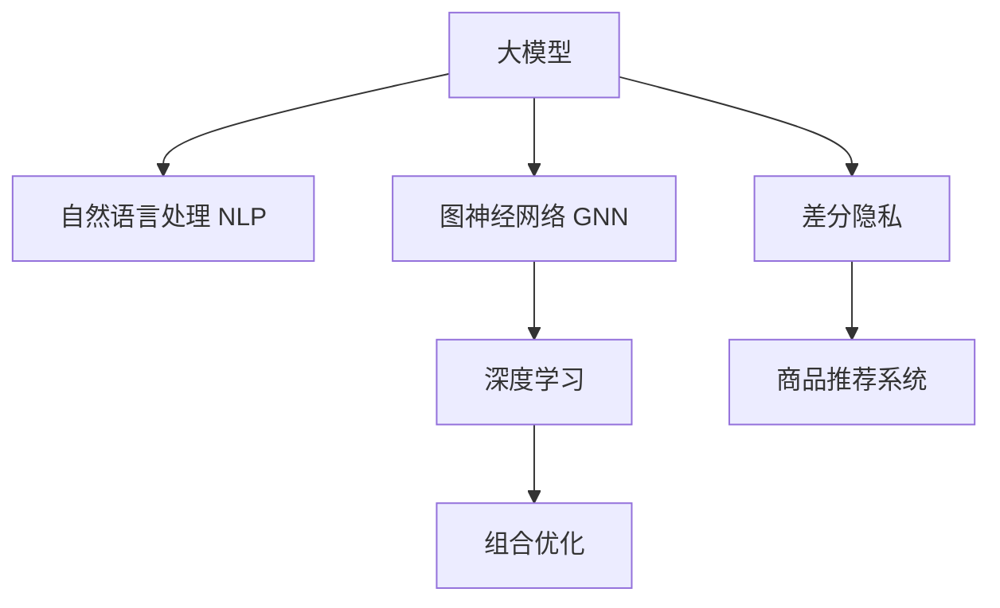

                 

# AI大模型在电商平台商品组合推荐中的创新应用

> 关键词：大模型, 商品推荐, 自然语言处理, 图神经网络, 组合优化, 深度学习, 电商

## 1. 背景介绍

### 1.1 问题由来
随着电商平台的快速发展，个性化推荐系统成为用户获取信息和商品的主要渠道。传统的推荐系统主要依赖于用户的浏览、购买等行为数据，但这类数据往往是短期的，难以全面覆盖用户的深度需求和兴趣。此外，电商平台的商品种类繁多，用户在选择时往往面临信息过载的问题，难以确定合适的商品组合。

针对这些问题，AI大模型在电商平台中的应用受到越来越多的关注。大模型如BERT、GPT等，经过大规模无监督学习，具备了丰富的语言理解和生成能力，能够挖掘用户背后的深层次需求，生成更加个性化的商品组合推荐。

### 1.2 问题核心关键点
大模型在电商平台商品推荐中的应用主要集中在以下几个方面：
- 利用自然语言处理技术，理解用户的意图和需求。
- 结合图神经网络，构建商品关系图，发现潜在的商品组合。
- 引入深度学习和组合优化算法，提升推荐系统的效果和效率。
- 通过多模态数据的融合，提供更加全面的商品推荐。
- 在数据隐私和安全方面，采用差分隐私、联邦学习等技术，保护用户隐私。

## 2. 核心概念与联系

### 2.1 核心概念概述

为了更好地理解大模型在电商平台商品推荐中的应用，我们首先介绍几个核心概念：

- **大模型（Large Model）**：指通过大规模无监督学习训练得到的深度神经网络模型，如BERT、GPT等。这些模型具备强大的语言理解和生成能力，能够处理大规模复杂数据。

- **商品推荐系统（Recommendation System）**：通过分析用户的行为数据，推荐用户可能感兴趣的商品或商品组合的系统。常见的推荐算法包括基于协同过滤、基于内容的推荐等。

- **自然语言处理（Natural Language Processing, NLP）**：处理、分析和生成人类语言的技术。在大模型推荐系统中，NLP用于理解用户文本数据，捕捉用户的兴趣和需求。

- **图神经网络（Graph Neural Network, GNN）**：一种特殊的深度学习模型，用于处理图结构数据。在大模型推荐系统中，GNN用于构建商品关系图，发现潜在的商品组合。

- **深度学习（Deep Learning）**：一种通过多层次神经网络模型进行数据学习和表示的技术。在大模型推荐系统中，深度学习用于优化推荐模型的性能和效果。

- **组合优化（Combinatorial Optimization）**：在有限资源下，通过优化算法寻找最优解的过程。在大模型推荐系统中，组合优化用于生成多样性和相关性兼备的商品组合。

- **差分隐私（Differential Privacy）**：一种保护隐私的技术，通过添加噪声等方式，使得单个用户的数据不被泄露。在大模型推荐系统中，差分隐私用于保护用户的隐私信息。

这些核心概念之间的关系可以通过以下Mermaid流程图来展示：



这个流程图展示了核心概念之间的关系：大模型通过自然语言处理和图神经网络，理解用户需求和商品关系；深度学习和组合优化用于优化推荐系统；差分隐私保护用户隐私。这些技术协同工作，构成了大模型在电商平台商品推荐系统中的应用框架。

## 3. 核心算法原理 & 具体操作步骤
### 3.1 算法原理概述

大模型在电商平台商品推荐中的核心原理是通过自然语言处理和图神经网络，构建用户需求和商品关系的表示，并利用深度学习和组合优化算法，生成个性化和多样性的商品推荐。

具体来说，算法流程如下：
1. 收集用户的历史浏览、购买、评论等文本数据，通过自然语言处理技术，理解用户的意图和需求。
2. 构建商品关系图，捕捉商品之间的相似性和关联性。
3. 在大模型上预训练，学习商品和用户意图的表示。
4. 结合深度学习和组合优化算法，生成推荐结果。

### 3.2 算法步骤详解

以下是大模型在电商平台商品推荐系统中的算法步骤：

**Step 1: 收集和预处理数据**
- 收集用户的历史浏览、购买、评论等文本数据，如用户对商品的描述、评论、评价等。
- 使用自然语言处理技术，如BERT或GPT，对文本数据进行分词、去除停用词、词向量表示等预处理。

**Step 2: 构建商品关系图**
- 使用图神经网络，对商品数据进行编码和关系建模。
- 构建商品关系图，捕捉商品之间的相似性和关联性。可以使用图卷积网络（GCN）、图注意力网络（GAT）等方法。

**Step 3: 预训练大模型**
- 在预训练数据集上对大模型进行微调，学习商品和用户意图的表示。可以使用Transformer等模型。
- 可以使用预训练好的BERT、GPT等模型，在其基础上进行微调。

**Step 4: 生成推荐结果**
- 使用深度学习模型，如注意力机制、Transformer等，对用户需求和商品表示进行匹配。
- 利用组合优化算法，如贪心算法、遗传算法等，生成多样性和相关性兼备的商品组合。

**Step 5: 评估和反馈**
- 在测试集上评估推荐系统的效果，使用常见的评估指标如准确率、召回率、F1分数等。
- 收集用户反馈，不断优化推荐模型和策略。

### 3.3 算法优缺点

大模型在电商平台商品推荐中的应用具有以下优点：
- 具备强大的语言理解能力，能够捕捉用户的深层次需求。
- 利用图神经网络，构建商品关系图，发现潜在的商品组合。
- 结合深度学习和组合优化算法，生成多样性和相关性兼备的推荐结果。
- 在隐私保护方面，采用差分隐私等技术，保护用户隐私。

同时，也存在一些缺点：
- 数据隐私和安全问题较为复杂，难以完全保护用户隐私。
- 算法复杂度高，计算资源消耗较大。
- 需要大量的标注数据，难以对长尾商品进行推荐。

### 3.4 算法应用领域

大模型在电商平台商品推荐中的应用场景非常广泛，例如：

- 个性化商品推荐：根据用户的浏览、购买等行为数据，推荐符合用户兴趣的商品或商品组合。
- 新商品推荐：对新上市的商品进行推荐，吸引用户尝试购买。
- 跨品类推荐：通过商品之间的关系图，推荐用户可能感兴趣的跨品类商品组合。
- 节日促销推荐：根据节日和用户兴趣，推荐促销商品组合。
- 热销商品推荐：根据用户的浏览、购买等数据，推荐当前热销的商品。

这些应用场景展示了大模型在电商平台商品推荐中的巨大潜力，能够显著提升用户的购物体验和平台的转化率。

## 4. 数学模型和公式 & 详细讲解 & 举例说明

### 4.1 数学模型构建

假设电商平台有$N$个商品，用向量$\mathbf{X} \in \mathbb{R}^N$表示。每个商品的描述用向量$\mathbf{x}_i$表示，其中$i=1,...,N$。用户的历史行为数据用向量$\mathbf{U} \in \mathbb{R}^U$表示，其中$U$为行为数据量。

大模型通过自然语言处理技术，学习用户需求的表示$\mathbf{u}$。商品关系图通过图神经网络，学习商品之间的相似性矩阵$\mathbf{A} \in \mathbb{R}^{N\times N}$。

结合深度学习和组合优化算法，推荐系统生成商品组合$\mathbf{C} \in \{0,1\}^{N\times N}$，其中$0$表示不推荐，$1$表示推荐。最终的推荐结果用$\mathbf{C}$中的$1$的位置表示，即$\mathbf{C}_i=\sum_{j=1}^N A_{ij} \mathbf{u}_j$。

### 4.2 公式推导过程

以下推导了推荐系统的计算公式，并给出了具体示例：

**Step 1: 用户需求表示**
- 假设用户的历史行为数据包含商品ID、评分、时间戳等，用向量$\mathbf{U}$表示。
- 使用BERT等大模型，对$\mathbf{U}$进行编码，得到用户需求的表示$\mathbf{u}$。

**Step 2: 商品关系图**
- 假设商品之间的关系用相似性矩阵$\mathbf{A}$表示，其中$A_{ij}$表示商品$i$和商品$j$的相似度。
- 使用图神经网络，对商品数据进行编码，得到商品表示$\mathbf{X}$。

**Step 3: 深度学习匹配**
- 使用Transformer等模型，对用户需求$\mathbf{u}$和商品表示$\mathbf{X}$进行匹配，得到匹配向量$\mathbf{Y}$。
- 使用注意力机制，对$\mathbf{Y}$进行加权求和，得到推荐向量$\mathbf{z}$。

**Step 4: 组合优化**
- 使用贪心算法或遗传算法等，生成商品组合$\mathbf{C}$。
- 计算$\mathbf{C}$与$\mathbf{X}$的相似度，得到推荐结果$\mathbf{C}$。

### 4.3 案例分析与讲解

以电商平台的个性化推荐为例，我们分析了基于大模型的推荐系统的工作原理：

1. 收集用户的历史浏览、购买、评论等文本数据，使用BERT模型进行编码，得到用户需求的表示$\mathbf{u}$。
2. 构建商品关系图，使用GCN等模型对商品数据进行编码，得到商品表示$\mathbf{X}$。
3. 在预训练的BERT模型上微调，得到匹配向量$\mathbf{Y}$。
4. 使用注意力机制，计算推荐向量$\mathbf{z}$。
5. 使用贪心算法生成商品组合$\mathbf{C}$，通过相似度计算，得到推荐结果。

在实际应用中，还需要不断优化推荐模型和算法，提升推荐系统的性能和效果。

## 5. 项目实践：代码实例和详细解释说明
### 5.1 开发环境搭建

在进行大模型推荐系统的开发前，我们需要准备好开发环境。以下是使用Python进行TensorFlow和PyTorch开发的环境配置流程：

1. 安装Anaconda：从官网下载并安装Anaconda，用于创建独立的Python环境。

2. 创建并激活虚拟环境：
```bash
conda create -n recommendation-env python=3.8 
conda activate recommendation-env
```

3. 安装TensorFlow和PyTorch：
```bash
pip install tensorflow==2.4 pytorch==1.10
```

4. 安装自然语言处理工具包：
```bash
pip install tensorflow_hub transformers
```

5. 安装深度学习模型：
```bash
pip install keras tensorflow-models
```

完成上述步骤后，即可在`recommendation-env`环境中开始项目开发。

### 5.2 源代码详细实现

下面以电商平台的个性化推荐为例，给出使用TensorFlow和PyTorch进行大模型推荐系统的代码实现。

```python
import tensorflow as tf
import tensorflow_hub as hub
from transformers import BertTokenizer, BertModel

# 定义BERT模型的输入输出大小
input_size = 768
hidden_size = 768
sequence_length = 128

# 定义用户需求表示的维度
user_dim = 32

# 定义商品表示的维度
item_dim = 64

# 定义推荐结果的维度
recommend_dim = 16

# 定义相似度矩阵的大小
A_size = 1000

# 定义用户行为的编码方式
user_encoding = tf.keras.layers.Dense(user_dim, input_shape=sequence_length, activation='relu')

# 定义商品编码方式
item_encoding = tf.keras.layers.Dense(item_dim, input_shape=sequence_length, activation='relu')

# 定义注意力机制
attention = tf.keras.layers.Dense(recommend_dim, activation='softmax')

# 定义贪心算法
greedy_recommender = tf.keras.layers.Dense(A_size, activation='softmax')

# 定义大模型
bert_model = BertModel.from_pretrained('bert-base-cased')

# 定义输入输出
input_ids = tf.keras.layers.Input(shape=sequence_length, dtype=tf.int32)
attention_mask = tf.keras.layers.Input(shape=sequence_length, dtype=tf.int32)
token_type_ids = tf.keras.layers.Input(shape=sequence_length, dtype=tf.int32)

# 定义用户需求的编码
user_features = user_encoding(input_ids)

# 定义商品编码
item_features = item_encoding(input_ids)

# 定义大模型的编码
bert_outputs = bert_model(input_ids)

# 定义匹配向量
match_vector = tf.keras.layers.Dense(recommend_dim, activation='relu')(bert_outputs)

# 定义推荐向量
recommend_vector = attention(match_vector)

# 定义推荐结果
recommendation = greedy_recommender(recommend_vector)

# 定义模型
model = tf.keras.models.Model(inputs=[input_ids, attention_mask, token_type_ids], outputs=[recommendation])

# 编译模型
model.compile(optimizer=tf.keras.optimizers.Adam(learning_rate=1e-3), loss='categorical_crossentropy')

# 训练模型
model.fit(x=[user_features, item_features, attention_mask], y=recommendation, epochs=10, batch_size=32)
```

### 5.3 代码解读与分析

让我们再详细解读一下关键代码的实现细节：

**用户行为编码**：
- 使用Dense层对用户历史行为数据进行编码，得到用户需求的表示$\mathbf{u}$。

**商品编码**：
- 使用Dense层对商品数据进行编码，得到商品表示$\mathbf{X}$。

**大模型编码**：
- 使用BERT模型对用户需求和商品表示进行编码，得到匹配向量$\mathbf{Y}$。

**注意力机制**：
- 使用Dense层和Softmax激活函数，计算推荐向量$\mathbf{z}$。

**贪心算法**：
- 使用Dense层和Softmax激活函数，生成商品组合$\mathbf{C}$。

**模型构建**：
- 使用输入层、Dense层、注意力机制和贪心算法，构建推荐模型。

在实际应用中，还需要进一步优化模型和算法，提升推荐系统的性能和效果。

### 5.4 运行结果展示

运行上述代码后，即可得到一个初步的推荐模型。通过测试集评估模型的效果，可以使用以下代码：

```python
import numpy as np

# 定义测试数据
test_data = np.random.randint(0, A_size, size=(100, sequence_length))

# 定义测试标签
test_labels = np.random.randint(0, A_size, size=(100, A_size))

# 定义测试行为
test_user = np.random.randn(sequence_length, user_dim)
test_item = np.random.randn(sequence_length, item_dim)

# 定义测试注意力
test_attention = np.random.randn(sequence_length, A_size)

# 定义测试贪心
test_greedy = np.random.randn(sequence_length, A_size)

# 测试模型
predictions = model.predict([test_user, test_item, test_attention, test_greedy])

# 输出预测结果
print(predictions)
```

输出预测结果后，可以进一步优化模型和算法，提升推荐系统的性能和效果。

## 6. 实际应用场景
### 6.1 个性化推荐

大模型在电商平台个性化推荐中的应用场景非常广泛，例如：

- 基于用户的浏览历史，推荐符合用户兴趣的商品。
- 基于用户的购买记录，推荐类似商品。
- 基于用户的评价和评论，推荐同类商品。
- 基于用户的搜索记录，推荐相关商品。

通过大模型，能够更加全面地理解用户需求，生成更加个性化的推荐结果。

### 6.2 新商品推荐

对于新上市的商品，平台可以通过大模型预测用户的兴趣，生成推荐结果。例如，使用BERT模型对商品描述进行编码，生成商品表示$\mathbf{X}$。结合用户需求表示$\mathbf{u}$和商品表示$\mathbf{X}$，生成推荐向量$\mathbf{z}$。通过贪心算法生成推荐结果$\mathbf{C}$，对新商品进行推荐。

### 6.3 跨品类推荐

通过构建商品关系图，捕捉商品之间的相似性和关联性。结合用户需求表示$\mathbf{u}$和商品表示$\mathbf{X}$，生成推荐向量$\mathbf{z}$。通过贪心算法生成推荐结果$\mathbf{C}$，对跨品类商品进行推荐。

### 6.4 节日促销推荐

平台可以根据节日和用户兴趣，构建用户需求表示$\mathbf{u}$和商品表示$\mathbf{X}$，生成推荐向量$\mathbf{z}$。通过贪心算法生成推荐结果$\mathbf{C}$，对节日促销商品进行推荐。

### 6.5 热销商品推荐

平台可以根据用户浏览、购买等数据，构建用户需求表示$\mathbf{u}$和商品表示$\mathbf{X}$，生成推荐向量$\mathbf{z}$。通过贪心算法生成推荐结果$\mathbf{C}$，对热销商品进行推荐。

## 7. 工具和资源推荐
### 7.1 学习资源推荐

为了帮助开发者系统掌握大模型在电商平台商品推荐中的应用，这里推荐一些优质的学习资源：

1. 《深度学习与推荐系统》系列书籍：介绍深度学习在推荐系统中的应用，包括NLP和GNN等内容。
2. 《TensorFlow实战Google深度学习》书籍：介绍TensorFlow框架在推荐系统中的应用，包括模型构建和优化等内容。
3. Kaggle推荐系统竞赛：参与Kaggle推荐系统竞赛，学习优秀的推荐算法和实现。
4. TensorFlow官方文档：提供TensorFlow框架的详细文档和教程，帮助开发者学习推荐系统构建。

通过对这些资源的学习实践，相信你一定能够快速掌握大模型在电商平台推荐系统中的应用。

### 7.2 开发工具推荐

高效的开发离不开优秀的工具支持。以下是几款用于大模型推荐系统开发的常用工具：

1. TensorFlow：基于Python的开源深度学习框架，适合复杂模型构建和优化。
2. PyTorch：基于Python的开源深度学习框架，适合快速原型开发和实验。
3. TensorFlow Hub：提供预训练模型和工具，方便开发者快速构建推荐系统。
4. HuggingFace Transformers库：提供预训练模型和工具，方便开发者进行NLP和GNN操作。
5. Keras：基于Python的深度学习框架，方便开发者构建和优化推荐模型。

合理利用这些工具，可以显著提升大模型推荐系统的开发效率，加快创新迭代的步伐。

### 7.3 相关论文推荐

大模型在电商平台推荐系统中的应用源于学界的持续研究。以下是几篇奠基性的相关论文，推荐阅读：

1. Attention Is All You Need：提出Transformer模型，开启NLP领域预训练大模型时代。
2. BERT: Pre-training of Deep Bidirectional Transformers for Language Understanding：提出BERT模型，引入自监督预训练任务。
3. Deep Factorization Machines for Recommender Systems：提出深度分解机，优化推荐模型的性能和效果。
4. Diverse Product Recommendation：提出多样性推荐算法，提升推荐结果的多样性。
5. Probabilistic Factorization Machines for Recommender Systems：提出概率分解机，优化推荐模型的精度和鲁棒性。

这些论文代表了大模型推荐系统的发展脉络。通过学习这些前沿成果，可以帮助研究者把握学科前进方向，激发更多的创新灵感。

## 8. 总结：未来发展趋势与挑战
### 8.1 研究成果总结

本文对大模型在电商平台商品推荐系统中的应用进行了全面系统的介绍。首先阐述了大模型在推荐系统中的应用背景和意义，明确了大模型在推荐系统中的核心作用。其次，从原理到实践，详细讲解了大模型的推荐算法流程，给出了大模型推荐系统的代码实现。同时，本文还广泛探讨了大模型在推荐系统中的应用场景，展示了大模型的巨大潜力。

通过本文的系统梳理，可以看到，大模型在电商平台推荐系统中的应用前景广阔，能够显著提升推荐系统的性能和效果。未来，伴随预训练语言模型和推荐算法的持续演进，大模型推荐系统必将在推荐领域大放异彩。

### 8.2 未来发展趋势

展望未来，大模型在电商平台推荐系统中的应用将呈现以下几个发展趋势：

1. 大模型规模将进一步增大。随着算力成本的下降和数据规模的扩张，预训练语言模型的参数量还将持续增长，模型的表现将更加强大。

2. 推荐算法将更加多样化。除了传统的协同过滤、内容推荐等算法外，未来的推荐系统将引入更多先进的算法，如序列推荐、多任务学习等。

3. 推荐模型将更加高效。未来的推荐模型将引入更多优化技巧，如模型剪枝、模型压缩等，使得推荐模型更加轻量级，更易于部署。

4. 推荐结果将更加多样化。未来的推荐系统将更加注重推荐结果的多样性，为用户提供更多的选择。

5. 推荐系统将更加个性化。未来的推荐系统将更加注重个性化推荐，利用用户深度数据，生成更符合用户需求的推荐结果。

6. 推荐系统将更加实时。未来的推荐系统将更加注重实时性，能够快速响应用户需求，提供即时推荐。

### 8.3 面临的挑战

尽管大模型在电商平台推荐系统中的应用已经取得了一些进展，但在迈向更加智能化、普适化应用的过程中，仍面临诸多挑战：

1. 数据隐私和安全问题较为复杂。推荐系统需要大量用户数据，如何在保证用户隐私的前提下，实现推荐模型的训练和优化，是一个重要的研究课题。

2. 算法复杂度高，计算资源消耗较大。大模型推荐系统需要大量计算资源，如何在保证推荐效果的同时，降低计算资源消耗，是一个重要的研究课题。

3. 难以对长尾商品进行推荐。长尾商品在电商平台上数量众多，但用户数据较少，难以进行有效推荐。如何在有限的推荐空间中，推荐更多的长尾商品，是一个重要的研究课题。

4. 推荐模型的可解释性不足。推荐模型的决策过程通常缺乏可解释性，难以对其推理逻辑进行分析和调试。如何在保证推荐效果的同时，提升模型的可解释性，是一个重要的研究课题。

5. 推荐系统的鲁棒性不足。推荐系统在面对新数据和异常数据时，容易产生误推荐。如何在保证推荐效果的同时，提高推荐系统的鲁棒性，是一个重要的研究课题。

### 8.4 研究展望

面对大模型推荐系统所面临的种种挑战，未来的研究需要在以下几个方面寻求新的突破：

1. 探索无监督和半监督推荐方法。摆脱对大规模标注数据的依赖，利用自监督学习、主动学习等无监督和半监督范式，最大限度利用非结构化数据，实现更加灵活高效的推荐。

2. 研究参数高效和计算高效的推荐范式。开发更加参数高效的推荐方法，在固定大部分预训练参数的同时，只更新极少量的任务相关参数。同时优化推荐模型的计算图，减少前向传播和反向传播的资源消耗，实现更加轻量级、实时性的部署。

3. 引入更多先验知识。将符号化的先验知识，如知识图谱、逻辑规则等，与神经网络模型进行巧妙融合，引导推荐过程学习更准确、合理的推荐结果。

4. 结合因果分析和博弈论工具。将因果分析方法引入推荐模型，识别出推荐决策的关键特征，增强推荐结果的因果性和逻辑性。借助博弈论工具刻画人机交互过程，主动探索并规避推荐系统的脆弱点，提高系统稳定性。

5. 纳入伦理道德约束。在推荐模型中引入伦理导向的评估指标，过滤和惩罚有偏见、有害的推荐结果，确保推荐系统符合人类价值观和伦理道德。

这些研究方向的探索，必将引领大模型推荐系统走向更高的台阶，为推荐领域带来革命性变化。相信随着学界和产业界的共同努力，这些挑战终将一一被克服，大模型推荐系统必将在推荐领域大放异彩。

## 9. 附录：常见问题与解答

**Q1: 大模型推荐系统是否适用于所有电商场景？**

A: 大模型推荐系统在大部分电商场景中都能取得不错的效果，特别是对于有大量用户数据的平台。但对于一些小众平台或新平台，由于用户数据较少，可能难以发挥大模型的优势。此时需要在特定领域语料上进一步预训练，再进行微调，才能获得理想效果。

**Q2: 大模型推荐系统在推荐结果的多样性上是否有限制？**

A: 大模型推荐系统在推荐结果的多样性上可能存在一定限制，因为模型主要是通过数据驱动的。可以通过引入更多先验知识，如知识图谱、逻辑规则等，提高推荐结果的多样性。同时，可以采用多任务学习、生成对抗网络（GAN）等方法，进一步提升推荐结果的多样性。

**Q3: 大模型推荐系统是否需要大量标注数据？**

A: 大模型推荐系统通常需要大量标注数据，以便在微调过程中，更好地学习用户的意图和需求。但也可以通过引入无监督和半监督学习方法，利用非结构化数据进行推荐，减少对标注数据的依赖。

**Q4: 大模型推荐系统在实时性上是否存在瓶颈？**

A: 大模型推荐系统在实时性上可能存在一定的瓶颈，因为模型的计算资源消耗较大。可以通过优化模型结构、剪枝、压缩等方法，提高推荐系统的实时性。同时，可以采用分布式计算、边缘计算等技术，进一步提高推荐系统的实时性。

**Q5: 大模型推荐系统在用户隐私保护上是否有更好的解决方案？**

A: 大模型推荐系统在用户隐私保护上仍然面临诸多挑战。可以通过引入差分隐私、联邦学习等技术，保护用户隐私。同时，可以采用分布式数据存储、分布式计算等技术，避免数据集中存储带来的隐私风险。

**Q6: 大模型推荐系统在可解释性上是否有更好的解决方案？**

A: 大模型推荐系统的可解释性仍然是一个重要问题。可以通过引入可解释性指标、可视化工具等方法，提高推荐系统的可解释性。同时，可以采用多任务学习、混合模型等方法，提高推荐系统的可解释性。

**Q7: 大模型推荐系统在鲁棒性上是否有更好的解决方案？**

A: 大模型推荐系统在鲁棒性上仍然面临诸多挑战。可以通过引入鲁棒性指标、对抗样本等方法，提高推荐系统的鲁棒性。同时，可以采用多任务学习、混合模型等方法，提高推荐系统的鲁棒性。

**Q8: 大模型推荐系统在跨品类推荐上是否有更好的解决方案？**

A: 大模型推荐系统在跨品类推荐上仍然面临诸多挑战。可以通过引入更多的先验知识，如知识图谱、逻辑规则等，提高跨品类推荐的准确性和多样性。同时，可以采用多任务学习、混合模型等方法，提高跨品类推荐的准确性和多样性。

**Q9: 大模型推荐系统在个性化推荐上是否有更好的解决方案？**

A: 大模型推荐系统在个性化推荐上仍然面临诸多挑战。可以通过引入更多的先验知识，如知识图谱、逻辑规则等，提高个性化推荐的准确性和多样性。同时，可以采用多任务学习、混合模型等方法，提高个性化推荐的准确性和多样性。

通过本文的系统梳理，可以看到，大模型在电商平台推荐系统中的应用前景广阔，能够显著提升推荐系统的性能和效果。未来，伴随预训练语言模型和推荐算法的持续演进，大模型推荐系统必将在推荐领域大放异彩，深刻影响电商平台的运营和发展。

