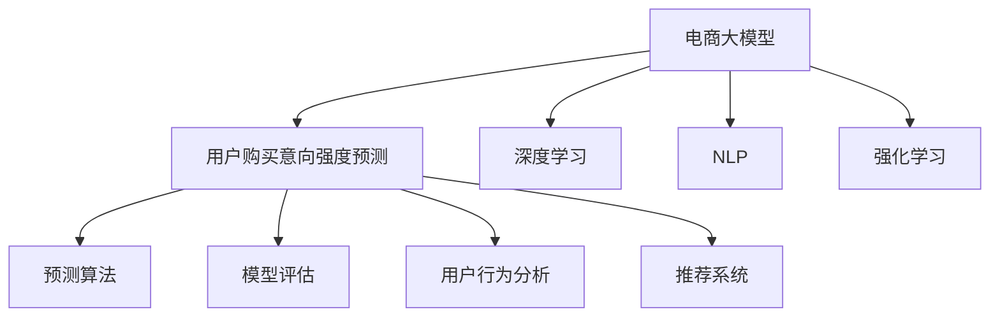

                 

# AI大模型在电商平台用户购买意向强度预测中的作用

> 关键词：大模型,电商,NLP,预测,用户意向,深度学习

## 1. 背景介绍

随着互联网的普及和电子商务的兴起，电商平台的用户行为分析变得越来越重要。对于电商平台来说，精准地预测用户购买意向强度不仅能提升用户体验，还能极大提高营销效率和业务收益。然而，传统的用户行为分析方法往往依赖于历史数据和简单特征工程，无法充分挖掘数据价值，且在复杂多变的环境下容易失效。近年来，得益于深度学习和人工智能技术的发展，使用大模型进行电商用户购买意向强度预测成为新的热门方向。

本博客将详细介绍AI大模型在电商领域用户购买意向强度预测中的应用，通过分析预测的核心算法、数据处理流程以及技术难点，探讨如何利用大模型技术构建高效、准确的电商预测系统，提升电商平台的用户转化率与广告点击率，助力电商营销的科学决策。

## 2. 核心概念与联系

为了更系统地了解大模型在电商平台中的应用，本节将介绍几个核心概念及它们之间的关系：

- **电商大模型**：指在大规模电商平台数据上预训练的大型深度学习模型，具有强大的用户行为模式识别能力。通过大规模无标签电商数据进行预训练，大模型能够学习到电商交易行为中的复杂关系和模式。

- **用户购买意向强度预测**：指预测用户在某个商品或服务上的购买意愿大小，通常以购买概率、购买概率分布等形式输出。在电商场景中，可通过分析用户的浏览记录、点击行为、搜索关键词、历史购买记录等信息，对用户的购买意向强度进行预测。

- **深度学习**：一种基于神经网络的机器学习方法，通过多层非线性变换，从数据中自动提取特征，实现复杂的分类、回归等任务。深度学习在大模型训练和用户行为分析中发挥了核心作用。

- **自然语言处理(NLP)**：涉及如何通过计算机程序理解、处理和生成自然语言的技术。在电商中，NLP技术可用于提取和分析用户评论、描述、标题等文本数据，进一步提升购买意向强度预测的准确性。

- **强化学习**：一种通过智能体与环境交互，不断优化决策策略的学习方法。在电商推荐中，通过优化推荐系统，实现用户满意度的最大化。

这些核心概念之间的关系可以通过以下Mermaid流程图来展示：



这个流程图展示了电商大模型的核心应用场景：

1. **电商大模型**通过深度学习和NLP技术，从电商数据中学习用户行为模式。
2. **预测算法**利用模型生成的特征，对用户购买意向强度进行预测。
3. **模型评估**通过指标如准确率、召回率、F1-score等，对预测效果进行评估。
4. **用户行为分析**通过对用户行为的深度理解，提升预测的准确性。
5. **推荐系统**基于预测结果，生成个性化推荐，进一步提升用户满意度。

## 3. 核心算法原理 & 具体操作步骤

### 3.1 算法原理概述

电商用户购买意向强度预测的核心算法是基于大模型的深度学习算法，其基本思想是通过学习电商用户的历史行为数据，构建出用户的购买意向强度预测模型。该模型通常包括两个部分：特征提取器和预测器。

特征提取器是一个深度神经网络，通过将用户的行为数据（如浏览记录、点击行为、搜索关键词等）作为输入，学习到与用户购买意向强度相关的高级特征。预测器则是一个简单的线性回归或分类模型，将特征提取器生成的特征输入，预测出用户购买意向强度。

### 3.2 算法步骤详解

大模型在电商领域的应用通常包含以下步骤：

**Step 1: 数据收集与预处理**

1. 数据收集：从电商平台收集用户的行为数据，如浏览记录、点击行为、搜索关键词、历史购买记录等。
2. 数据清洗：去除缺失值、异常值和重复数据，对文本数据进行分词、去停用词等预处理。
3. 数据划分：将数据划分为训练集、验证集和测试集。

**Step 2: 特征提取**

1. 特征工程：根据电商数据的特点，设计合适的特征，如点击率、浏览时间、搜索关键词等。
2. 数据增强：通过数据扩充、标签反转等方式，增加训练集的多样性，提升模型的泛化能力。

**Step 3: 模型训练**

1. 模型选择：选择适当的深度学习模型，如BERT、GPT等。
2. 模型初始化：使用预训练的大模型作为初始权重。
3. 模型微调：对模型进行有监督学习，更新权重，优化损失函数，最小化预测误差。
4. 超参数调优：调整学习率、批大小、迭代轮数等超参数，使模型在验证集上表现最优。

**Step 4: 模型评估**

1. 模型评估指标：计算模型的准确率、召回率、F1-score等指标，评估模型性能。
2. 混淆矩阵：通过混淆矩阵分析模型在不同类别上的表现，发现模型的优势和劣势。

**Step 5: 预测与优化**

1. 预测：对新用户的行为数据进行预测，输出购买意向强度。
2. 模型优化：根据预测结果，不断优化模型参数，提高预测准确率。

### 3.3 算法优缺点

**优点**：

1. 高效性：大模型可以通过端到端的学习方式，高效地从电商数据中提取用户行为特征。
2. 泛化性强：大模型具有较强的泛化能力，可以在新场景下进行迁移学习，提升预测效果。
3. 自动化程度高：通过预训练和微调，大模型可以自动化学习用户行为模式，减少了人工干预。

**缺点**：

1. 数据依赖度高：大模型的预测效果高度依赖于电商数据的丰富性和多样性。
2. 计算资源消耗大：大模型通常参数众多，计算资源消耗较大。
3. 模型可解释性不足：大模型具有较强的黑箱特性，难以解释其内部决策逻辑。

### 3.4 算法应用领域

大模型在电商领域的应用非常广泛，主要包括以下几个方面：

- **个性化推荐**：根据用户的行为数据，生成个性化推荐，提升用户购买意向强度。
- **用户分群**：通过分析用户行为，将用户分为不同群体，实现精准营销。
- **广告投放优化**：通过预测用户购买意向强度，优化广告投放策略，提升广告点击率。
- **流失预警**：预测用户流失风险，提前采取措施，减少用户流失。
- **库存管理**：预测商品销售情况，优化库存管理，降低库存成本。

此外，大模型还被广泛应用于电商领域的数据挖掘、情感分析、图像识别等多个方向，为电商业务的智能化发展提供了强有力的技术支持。

## 4. 数学模型和公式 & 详细讲解 & 举例说明

### 4.1 数学模型构建

在大模型电商用户购买意向强度预测中，通常使用深度学习模型进行特征提取和预测。我们以一个简单的深度学习模型为例，描述其数学模型构建过程。

假设电商用户的行为数据为 $x=(x_1,x_2,...,x_n)$，其中 $x_i$ 表示第 $i$ 个特征值。用户购买意向强度预测的目标是输出一个概率值 $p \in [0,1]$，表示用户购买意向强度的大小。

我们使用一个深度神经网络模型 $M_{\theta}$ 来表示特征提取器，其中 $\theta$ 为模型参数。模型的输入为电商用户的行为数据 $x$，输出为购买意向强度的概率 $p$。

### 4.2 公式推导过程

**特征提取器**：
1. 输入层：将用户的行为数据 $x$ 输入到神经网络中，进行特征提取。
2. 隐藏层：通过多层非线性变换，学习到数据的高级特征表示。
3. 输出层：输出预测结果 $p$。

假设神经网络包含 $L$ 层，每层有 $h_i$ 个神经元，使用激活函数 $f$ 进行非线性变换。则模型的前向传播过程为：

$$
z_1 = w_1 x + b_1
$$
$$
a_1 = f(z_1)
$$
$$
z_2 = w_2 a_1 + b_2
$$
$$
a_2 = f(z_2)
$$
$$
\vdots
$$
$$
z_L = w_L a_{L-1} + b_L
$$
$$
a_L = f(z_L)
$$
$$
p = a_L
$$

其中 $w_i$ 为第 $i$ 层的权重矩阵，$b_i$ 为偏置向量。

**预测器**：
1. 输入层：将特征提取器的输出 $a_L$ 作为输入。
2. 隐藏层：通过线性变换，学习到预测结果 $p$。
3. 输出层：输出购买意向强度概率 $p$。

假设预测器为线性回归模型，则输出层公式为：

$$
p = w_{\text{pred}} a_L + b_{\text{pred}}
$$

其中 $w_{\text{pred}}$ 为预测器的权重矩阵，$b_{\text{pred}}$ 为偏置向量。

**损失函数**：
模型的损失函数通常为均方误差或交叉熵损失，用于衡量预测值与真实值之间的差异。假设真实的购买意向强度为 $y$，则均方误差损失函数为：

$$
\mathcal{L} = \frac{1}{N} \sum_{i=1}^N (p_i - y_i)^2
$$

其中 $N$ 为样本数，$p_i$ 为模型对第 $i$ 个样本的预测结果，$y_i$ 为真实标签。

**优化算法**：
通过梯度下降等优化算法，最小化损失函数。假设学习率为 $\eta$，则优化算法公式为：

$$
\theta \leftarrow \theta - \eta \nabla_{\theta} \mathcal{L}
$$

其中 $\nabla_{\theta} \mathcal{L}$ 为损失函数对模型参数的梯度。

### 4.3 案例分析与讲解

以一个简单的电商用户行为分析为例，说明大模型如何应用于用户购买意向强度预测。

**案例背景**：一家电商平台希望通过大模型预测用户在某个商品上的购买意向强度，优化广告投放策略。

**数据集**：收集用户在电商平台上浏览商品、点击商品、查看详情页、加入购物车、购买商品等行为数据。将数据划分为训练集、验证集和测试集。

**模型选择**：选择BERT模型作为特征提取器，线性回归模型作为预测器。

**模型训练**：使用电商数据集对BERT模型进行预训练和微调，得到特征提取器参数 $\theta_{\text{feat}}$。将特征提取器的输出输入到线性回归模型中，使用均方误差损失函数，训练预测器参数 $\theta_{\text{pred}}$。

**模型评估**：在验证集上评估模型的预测性能，使用准确率、召回率、F1-score等指标。

**预测优化**：对新用户的行为数据进行预测，输出购买意向强度。根据预测结果，优化广告投放策略，提升广告点击率。

## 5. 项目实践：代码实例和详细解释说明

### 5.1 开发环境搭建

在使用大模型进行电商用户购买意向强度预测时，需要搭建一套完整的开发环境。以下是一些常用的开发工具和环境：

**Python 3.7+**：选择 Python 3.7 或更高版本，确保能够运行 TensorFlow、Keras、PyTorch 等深度学习框架。

**TensorFlow 2.0+**：选择 TensorFlow 2.0 或更高版本，便于使用 Keras API 进行模型构建和训练。

**GPU 或 TPU**：选择支持 GPU 或 TPU 的计算环境，提升模型训练速度。

**NLP 工具包**：安装 NLTK、spaCy、gensim 等 NLP 工具包，方便文本数据的处理和分析。

### 5.2 源代码详细实现

以下是一个简单的电商用户购买意向强度预测的代码实现，使用了 TensorFlow 和 Keras 框架。

```python
import tensorflow as tf
from tensorflow.keras import layers, models

# 数据预处理
def preprocess_data(data):
    # 对文本数据进行分词、去除停用词等处理
    # ...
    return preprocessed_data

# 特征提取器
def build_feature_extractor():
    feature_extractor = models.Sequential([
        layers.Embedding(input_dim=vocab_size, output_dim=embedding_dim),
        layers.Conv1D(128, 3, activation='relu'),
        layers.GlobalMaxPooling1D(),
        layers.Dense(128, activation='relu'),
        layers.Dense(1, activation='sigmoid')
    ])
    return feature_extractor

# 预测器
def build_predictor():
    predictor = models.Sequential([
        layers.Dense(128, activation='relu'),
        layers.Dense(1, activation='sigmoid')
    ])
    return predictor

# 构建模型
def build_model(data_train, data_test):
    feature_extractor = build_feature_extractor()
    predictor = build_predictor()
    
    model = models.Model(inputs=feature_extractor.input, outputs=predictor(feature_extractor.output))
    
    model.compile(optimizer=tf.keras.optimizers.Adam(learning_rate=0.001), loss='mse')
    
    model.fit(data_train, epochs=10, validation_data=data_test)
    
    return model

# 数据加载与预处理
train_data = ...
train_labels = ...
test_data = ...
test_labels = ...

train_data_preprocessed = preprocess_data(train_data)
test_data_preprocessed = preprocess_data(test_data)

# 构建模型
model = build_model(train_data_preprocessed, test_data_preprocessed)
```

### 5.3 代码解读与分析

**数据预处理**：
1. 数据收集：从电商平台收集用户的行为数据。
2. 数据清洗：去除缺失值、异常值和重复数据，对文本数据进行分词、去除停用词等预处理。
3. 数据划分：将数据划分为训练集、验证集和测试集。

**特征提取器**：
1. 嵌入层：将用户的行为数据 $x$ 输入到神经网络中，进行特征提取。
2. 卷积层：通过多层非线性变换，学习到数据的高级特征表示。
3. 池化层：将特征提取器的输出进行全局池化，提取重要特征。
4. 全连接层：通过线性变换，学习到预测结果 $p$。

**预测器**：
1. 全连接层：通过线性变换，学习到预测结果 $p$。
2. 输出层：输出购买意向强度概率 $p$。

**模型构建与训练**：
1. 模型选择：使用 TensorFlow 和 Keras 框架，构建特征提取器和预测器。
2. 模型初始化：使用预训练的大模型作为初始权重。
3. 模型微调：对模型进行有监督学习，更新权重，优化损失函数，最小化预测误差。
4. 超参数调优：调整学习率、批大小、迭代轮数等超参数，使模型在验证集上表现最优。

**模型评估与预测**：
1. 模型评估指标：计算模型的准确率、召回率、F1-score等指标，评估模型性能。
2. 模型优化：根据预测结果，不断优化模型参数，提高预测准确率。

## 6. 实际应用场景

### 6.1 电商个性化推荐

电商个性化推荐是电商大模型应用的一个重要场景。通过大模型对用户行为进行分析，生成个性化推荐，显著提升用户购买意向强度。

**应用流程**：
1. 收集用户的历史行为数据，如浏览记录、点击行为、搜索关键词等。
2. 使用电商大模型对用户行为数据进行特征提取和预测，得到用户的购买意向强度。
3. 根据购买意向强度，生成个性化推荐，提升用户满意度和购买转化率。

**技术实现**：
1. 构建电商大模型，使用深度学习框架进行训练和预测。
2. 设计合适的推荐算法，如协同过滤、内容推荐、混合推荐等。
3. 在推荐系统中集成电商大模型，实时生成个性化推荐。

### 6.2 广告投放优化

广告投放优化是电商大模型的另一个重要应用场景。通过大模型预测用户购买意向强度，优化广告投放策略，提升广告点击率。

**应用流程**：
1. 收集用户的浏览记录、点击行为等数据。
2. 使用电商大模型对用户行为数据进行特征提取和预测，得到用户的购买意向强度。
3. 根据购买意向强度，优化广告投放策略，提升广告点击率。

**技术实现**：
1. 构建电商大模型，使用深度学习框架进行训练和预测。
2. 设计合适的广告投放算法，如CTR预测、A/B测试、转化率优化等。
3. 在广告投放系统中集成电商大模型，实时优化广告投放策略。

## 7. 工具和资源推荐

### 7.1 学习资源推荐

为了帮助开发者系统掌握大模型在电商平台中的应用，以下是一些优质的学习资源：

1. **深度学习框架文档**：如 TensorFlow、PyTorch 官方文档，包含详细的使用指南和示例代码。
2. **电商数据分析工具**：如 Google Analytics、Tableau，用于电商数据分析和可视化。
3. **自然语言处理教程**：如 NLTK、spaCy 官方文档，包含自然语言处理的基础知识和使用技巧。
4. **在线课程**：如 Coursera、edX 上的深度学习课程和电商数据分析课程，系统学习电商大模型应用。
5. **博客和社区**：如 Medium、GitHub，关注电商大模型应用的前沿技术和案例。

### 7.2 开发工具推荐

大模型在电商领域的应用离不开高效的开发工具。以下是一些常用的工具：

1. **TensorFlow**：深度学习框架，支持分布式训练和推理，适合大规模模型训练。
2. **Keras**：高级深度学习框架，提供了高层次的 API，方便模型构建和调试。
3. **NLTK**：自然语言处理工具包，包含分词、去除停用词等预处理功能。
4. **spaCy**：自然语言处理工具包，支持高效的文本处理和分析。
5. **HuggingFace**：预训练语言模型库，包含 BERT、GPT 等大模型，方便模型下载和使用。

### 7.3 相关论文推荐

大模型在电商领域的应用得益于学术界的不断探索。以下是几篇奠基性的相关论文，推荐阅读：

1. **E-commerce Data Mining and Statistical Learning**：涉及电商数据挖掘和统计学习方法，介绍了电商数据的特点和应用。
2. **Deep Learning in E-commerce Recommendation Systems**：介绍深度学习在电商推荐系统中的应用，包含模型选择、特征工程、评估指标等内容。
3. **Natural Language Processing in E-commerce**：介绍自然语言处理在电商中的应用，包含用户评论分析、商品描述处理等内容。
4. **Online Advertising and Retargeting**：介绍在线广告和再营销技术，包含广告投放策略、效果评估等内容。

## 8. 总结：未来发展趋势与挑战

### 8.1 研究成果总结

大模型在电商平台中的应用已经取得了显著的成果，特别是在个性化推荐、广告投放优化等场景下表现优异。通过深度学习和自然语言处理技术，电商大模型能够高效地从用户行为数据中提取高级特征，进行精准预测，提升电商营销效率。

### 8.2 未来发展趋势

未来，电商大模型将继续在电商领域发挥重要作用，具体趋势如下：

1. **实时预测**：随着数据量的增加和计算资源的提升，实时预测将更加普及，能够及时响应用户行为变化。
2. **多模态融合**：结合文本、图像、语音等多模态数据，提升电商大模型的智能水平。
3. **跨领域迁移**：通过迁移学习，将电商大模型应用于金融、医疗等其他领域，拓展应用范围。
4. **个性化推荐优化**：结合推荐算法和电商大模型，实现更加精准的个性化推荐，提升用户满意度。
5. **广告投放优化**：通过电商大模型进行广告投放优化，提升广告点击率和转化率，实现精准营销。

### 8.3 面临的挑战

尽管电商大模型在电商领域表现出色，但仍面临以下挑战：

1. **数据质量**：电商数据的噪声和缺失值较多，数据质量对模型效果有较大影响。
2. **模型复杂度**：电商大模型的参数量庞大，训练和推理的复杂度高。
3. **模型解释性**：电商大模型的黑箱特性，难以解释其内部决策逻辑。
4. **跨域泛化**：电商大模型在电商领域表现较好，但在其他领域泛化能力较弱。
5. **隐私保护**：电商大模型需要处理大量用户数据，存在隐私泄露的风险。

### 8.4 研究展望

为了应对上述挑战，未来的研究可以从以下几个方面进行探索：

1. **数据增强与预处理**：通过数据增强和预处理技术，提升电商数据的质量，减少噪声和缺失值。
2. **模型压缩与加速**：采用模型压缩、加速等技术，优化电商大模型的计算资源消耗，提升实时预测能力。
3. **可解释性增强**：开发可解释性模型，提供用户行为的解释和分析，提升电商大模型的可信度。
4. **多模态融合**：结合文本、图像、语音等多模态数据，提升电商大模型的智能水平。
5. **跨领域迁移学习**：通过迁移学习，将电商大模型应用于其他领域，拓展应用范围。
6. **隐私保护技术**：采用差分隐私、联邦学习等技术，保护用户数据隐私。

通过这些研究方向，电商大模型有望在未来的电商领域中发挥更大的作用，成为电商营销决策的重要工具。

## 9. 附录：常见问题与解答

**Q1: 电商大模型的训练需要多少数据？**

A: 电商大模型的训练需要大量的电商数据，一般至少需要几十到几百万条数据。数据量越大，模型的预测效果越好。

**Q2: 电商大模型的训练需要哪些硬件资源？**

A: 电商大模型的训练需要高性能的 GPU 或 TPU，计算资源消耗较大。一般需要配备多 GPU 或分布式训练环境。

**Q3: 电商大模型的训练时间通常需要多久？**

A: 电商大模型的训练时间取决于模型参数量、数据量、计算资源等因素。一般需要几小时到几天不等。

**Q4: 电商大模型的预测结果可信度如何？**

A: 电商大模型的预测结果需要结合其他业务知识进行综合判断。模型虽然能够提供较为准确的预测，但仍然需要人工干预和验证，确保预测结果的准确性和可信度。

**Q5: 电商大模型能否进行实时预测？**

A: 电商大模型可以进行实时预测，但需要较强的计算资源支持。一般需要 GPU 或 TPU 等高性能设备。

---

作者：禅与计算机程序设计艺术 / Zen and the Art of Computer Programming

