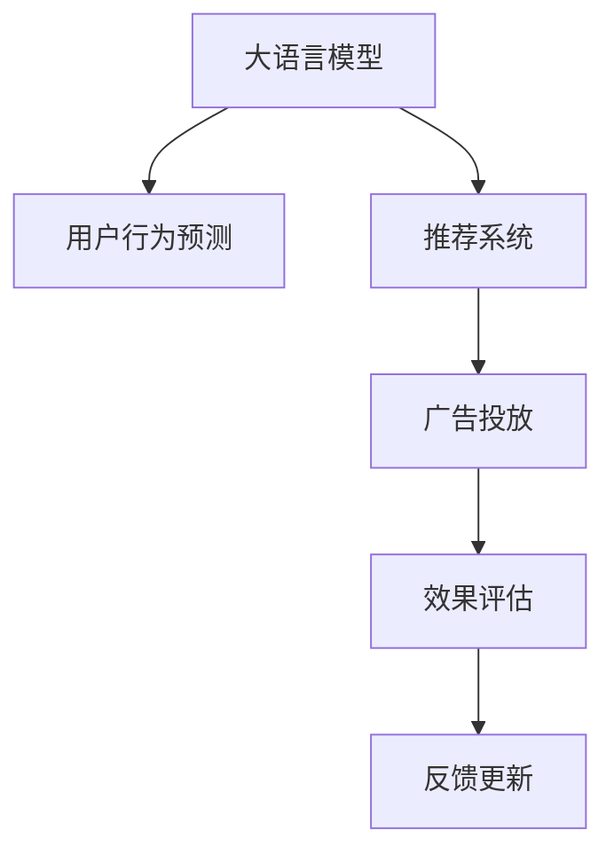

                 

# AI大模型如何优化电商平台的新品上市策略

> 关键词：大模型,电商,新品上市,策略优化,推荐系统,用户行为预测,广告投放,效果评估

## 1. 背景介绍

### 1.1 问题由来

在当今竞争激烈的电商市场中，新品上市是商家吸引用户注意力、提升销量的关键举措。然而，由于用户行为的不确定性和市场环境的复杂多变，新品上市的效果往往难以预料。为了在有限的时间内最大化销售额和品牌影响力，电商平台需要借助AI技术，特别是大语言模型，优化新品上市策略，实现精准投放和策略调整。

### 1.2 问题核心关键点

本文聚焦于利用大语言模型优化电商平台的新品上市策略。具体而言，通过构建推荐系统，分析用户行为数据，预测用户对新品的兴趣，以及制定个性化的广告投放方案，从而提升新品上市的营销效果和用户满意度。

## 2. 核心概念与联系

### 2.1 核心概念概述

为更好地理解AI大模型在电商领域的应用，本节将介绍几个关键概念及其相互关系：

- **大语言模型(Large Language Model, LLM)**：以自回归(如GPT)或自编码(如BERT)模型为代表的大规模预训练语言模型。通过在大规模无标签文本语料上进行预训练，学习通用的语言知识和常识，具备强大的自然语言理解能力。

- **推荐系统(Recommendation System)**：根据用户的历史行为数据和偏好，为用户推荐感兴趣的物品的系统。推荐系统在电商中应用广泛，可以帮助商家提升用户体验和转化率。

- **用户行为预测**：通过分析用户的行为数据，预测其未来可能的操作或购买意愿。这对于精准营销和新品上市策略的优化具有重要意义。

- **广告投放**：通过有针对性的广告投放，吸引用户关注和购买新上市的菜品。

- **效果评估**：衡量广告投放和推荐系统的实际效果，包括点击率、转化率、用户满意度等指标。

这些核心概念之间的逻辑关系可以通过以下Mermaid流程图来展示：



这个流程图展示了大语言模型与电商领域中推荐系统、用户行为预测、广告投放和效果评估之间的紧密联系。

## 3. 核心算法原理 & 具体操作步骤
### 3.1 算法原理概述

利用大语言模型优化电商平台的新品上市策略，本质上是通过推荐系统和用户行为预测技术，实现个性化的广告投放，提升新品上市的效果。具体步骤如下：

1. **数据预处理**：收集用户的历史行为数据和商品信息，并进行清洗和预处理。
2. **用户行为预测**：利用大语言模型，对用户未来的行为进行预测，如是否会购买新上市的菜品。
3. **推荐系统设计**：基于预测结果，设计推荐算法，生成个性化的商品推荐列表。
4. **广告投放优化**：根据用户画像和推荐列表，优化广告投放策略，实现精准触达。
5. **效果评估与反馈**：实时评估广告投放和推荐系统的效果，根据反馈调整策略。

### 3.2 算法步骤详解

以下是基于大语言模型优化电商平台新品上市策略的具体操作步骤：

**Step 1: 数据收集与预处理**
- 收集电商平台的用户行为数据，包括点击、浏览、收藏、购买等行为。
- 收集新上市菜品的信息，如名称、描述、类别、价格等。
- 对数据进行清洗和预处理，去除噪声和异常值，确保数据质量。

**Step 2: 用户行为预测**
- 构建用户行为预测模型，使用大语言模型作为特征提取器，提取用户行为数据的语义特征。
- 设计预测算法，如时序预测、协同过滤、深度学习等，预测用户对新上市菜品的兴趣程度。
- 根据预测结果，生成用户画像，包括年龄、性别、兴趣偏好等。

**Step 3: 推荐系统设计**
- 选择推荐算法，如基于内容的推荐、基于协同过滤的推荐、混合推荐等。
- 根据用户画像和预测结果，生成个性化的商品推荐列表。
- 利用大语言模型，对推荐列表进行优化，加入自然语言描述，提升用户体验。

**Step 4: 广告投放优化**
- 基于推荐列表，设计广告投放策略，如精准投放、时间分布、预算分配等。
- 利用大语言模型，生成个性化的广告文案，提高点击率。
- 实时监控广告投放效果，根据用户反馈调整投放策略。

**Step 5: 效果评估与反馈**
- 实时采集广告投放和推荐系统的各项指标，如点击率、转化率、用户满意度等。
- 使用A/B测试等方法，评估不同策略的效果，选择最优方案。
- 根据评估结果，及时调整和优化策略，确保新品上市的成功。

### 3.3 算法优缺点

基于大语言模型优化电商平台新品上市策略的优势在于：

- 高精度的用户行为预测：通过大语言模型分析用户行为数据，可以更准确地预测用户对新品的兴趣，提升推荐系统的精准性。
- 个性化的广告投放：利用大语言模型生成个性化的广告文案，能够更好地吸引用户的注意力，提升点击率和转化率。
- 实时效果评估与调整：通过实时监控和评估广告投放和推荐系统的效果，可以及时调整策略，确保最佳效果。

同时，该方法也存在以下局限性：

- 依赖标注数据：用户行为数据的标注成本较高，且质量直接影响预测效果。
- 数据隐私问题：电商平台需要收集和处理大量用户数据，隐私保护和数据安全成为重要问题。
- 计算资源需求高：大语言模型的训练和应用需要较高的计算资源，可能导致成本问题。
- 需要持续迭代：用户行为和市场环境不断变化，推荐系统和广告投放策略需要持续迭代和优化。

尽管存在这些局限性，但基于大语言模型的电商优化策略仍然展现出巨大的潜力，值得在实际应用中进一步探索和实践。

### 3.4 算法应用领域

基于大语言模型的电商优化策略已经在多个领域得到了应用，例如：

- **服饰零售**：根据用户的浏览记录和搜索历史，预测其对新上市服装的兴趣，推送个性化推荐和广告。
- **家居电商**：利用用户行为预测，设计家居装饰品的个性化推荐和广告投放策略，提升销售转化。
- **食品零售**：分析用户对健康食品的偏好，推送新上市的健康食品推荐和广告，满足用户需求。
- **美妆电商**：通过用户行为预测和推荐系统，推荐新上市的化妆品和护肤品，提高用户购买意愿。
- **3C数码**：针对不同用户群体，设计个性化的电子产品推荐和广告，促进新品的市场推广。

随着大语言模型的不断进步，预计其将在更多电商领域发挥更大的作用，为商家提供更精准的营销解决方案。

## 4. 数学模型和公式 & 详细讲解 & 举例说明

### 4.1 数学模型构建

假设用户行为数据集为 $D=\{(x_i,y_i)\}_{i=1}^N$，其中 $x_i$ 为用户的历史行为数据，$y_i$ 为用户的未来行为（如购买意愿）。我们构建用户行为预测模型，记为 $M_{\theta}$，其中 $\theta$ 为模型参数。

### 4.2 公式推导过程

为了构建用户行为预测模型，我们采用大语言模型作为特征提取器。假设大语言模型的特征提取函数为 $f(x_i)=\theta^T g(x_i)$，其中 $g(x_i)$ 为文本表示函数，$\theta$ 为特征提取器的参数。

将特征提取结果输入预测模型 $M_{\theta}$，得到用户行为预测 $y_i$。常见的预测模型包括线性回归、逻辑回归、深度学习模型等。这里，我们使用深度学习模型，预测函数为 $y_i=M_{\theta}(f(x_i))$。

具体而言，以深度学习模型为例，用户行为预测模型的训练目标为：

$$
\min_{\theta} \sum_{i=1}^N \ell(y_i,M_{\theta}(f(x_i)))
$$

其中 $\ell$ 为损失函数，可以是均方误差、交叉熵等。

### 4.3 案例分析与讲解

假设我们构建了一个简单的用户行为预测模型，输入为用户的浏览历史 $x_i$，输出为购买意愿 $y_i$。我们采用大语言模型作为特征提取器，构建了如下的预测模型：

$$
y_i = M_{\theta}(f(x_i)) = M_{\theta}(\theta^T g(x_i))
$$

其中 $f(x_i)=\theta^T g(x_i)$ 为特征提取结果，$M_{\theta}$ 为预测模型。

我们选择均方误差作为损失函数，对模型进行训练：

$$
\ell(y_i,M_{\theta}(f(x_i))) = (y_i-M_{\theta}(f(x_i)))^2
$$

使用随机梯度下降等优化算法，更新模型参数 $\theta$，最小化损失函数。

## 5. 项目实践：代码实例和详细解释说明
### 5.1 开发环境搭建

在进行电商优化策略实践前，我们需要准备好开发环境。以下是使用Python进行PyTorch开发的环境配置流程：

1. 安装Anaconda：从官网下载并安装Anaconda，用于创建独立的Python环境。

2. 创建并激活虚拟环境：
```bash
conda create -n pytorch-env python=3.8 
conda activate pytorch-env
```

3. 安装PyTorch：根据CUDA版本，从官网获取对应的安装命令。例如：
```bash
conda install pytorch torchvision torchaudio cudatoolkit=11.1 -c pytorch -c conda-forge
```

4. 安装Transformers库：
```bash
pip install transformers
```

5. 安装各类工具包：
```bash
pip install numpy pandas scikit-learn matplotlib tqdm jupyter notebook ipython
```

完成上述步骤后，即可在`pytorch-env`环境中开始电商优化策略实践。

### 5.2 源代码详细实现

这里我们以推荐系统的设计为例，给出使用Transformers库对大语言模型进行电商优化策略的PyTorch代码实现。

首先，定义推荐系统的数据处理函数：

```python
from transformers import BertTokenizer
from torch.utils.data import Dataset
import torch

class RecommendationDataset(Dataset):
    def __init__(self, user_behaviors, item_features, tokenizer, max_len=128):
        self.user_behaviors = user_behaviors
        self.item_features = item_features
        self.tokenizer = tokenizer
        self.max_len = max_len
        
    def __len__(self):
        return len(self.user_behaviors)
    
    def __getitem__(self, item):
        user_behavior = self.user_behaviors[item]
        item_feature = self.item_features[item]
        
        encoding = self.tokenizer(user_behavior, return_tensors='pt', max_length=self.max_len, padding='max_length', truncation=True)
        input_ids = encoding['input_ids'][0]
        attention_mask = encoding['attention_mask'][0]
        
        # 对item特征进行编码
        item_text = ' '.join(item_feature) # 将item特征转换为文本
        item_encoding = self.tokenizer(item_text, return_tensors='pt', max_length=self.max_len, padding='max_length', truncation=True)
        item_input_ids = item_encoding['input_ids'][0]
        item_attention_mask = item_encoding['attention_mask'][0]
        
        return {'input_ids': input_ids, 
                'attention_mask': attention_mask,
                'item_input_ids': item_input_ids,
                'item_attention_mask': item_attention_mask}
```

然后，定义模型和优化器：

```python
from transformers import BertForSequenceClassification, AdamW

model = BertForSequenceClassification.from_pretrained('bert-base-cased', num_labels=2)

optimizer = AdamW(model.parameters(), lr=2e-5)
```

接着，定义训练和评估函数：

```python
from torch.utils.data import DataLoader
from tqdm import tqdm
from sklearn.metrics import accuracy_score

device = torch.device('cuda') if torch.cuda.is_available() else torch.device('cpu')
model.to(device)

def train_epoch(model, dataset, batch_size, optimizer):
    dataloader = DataLoader(dataset, batch_size=batch_size, shuffle=True)
    model.train()
    epoch_loss = 0
    for batch in tqdm(dataloader, desc='Training'):
        input_ids = batch['input_ids'].to(device)
        attention_mask = batch['attention_mask'].to(device)
        item_input_ids = batch['item_input_ids'].to(device)
        item_attention_mask = batch['item_attention_mask'].to(device)
        labels = batch['labels'].to(device) # 假设已标注的购买意愿
        model.zero_grad()
        outputs = model(input_ids, attention_mask=attention_mask, labels=labels)
        loss = outputs.loss
        epoch_loss += loss.item()
        loss.backward()
        optimizer.step()
    return epoch_loss / len(dataloader)

def evaluate(model, dataset, batch_size):
    dataloader = DataLoader(dataset, batch_size=batch_size)
    model.eval()
    preds, labels = [], []
    with torch.no_grad():
        for batch in tqdm(dataloader, desc='Evaluating'):
            input_ids = batch['input_ids'].to(device)
            attention_mask = batch['attention_mask'].to(device)
            item_input_ids = batch['item_input_ids'].to(device)
            item_attention_mask = batch['item_attention_mask'].to(device)
            batch_labels = batch['labels']
            outputs = model(input_ids, attention_mask=attention_mask, item_input_ids=item_input_ids, item_attention_mask=item_attention_mask)
            batch_preds = outputs.logits.argmax(dim=2).to('cpu').tolist()
            batch_labels = batch_labels.to('cpu').tolist()
            for pred_tokens, label_tokens in zip(batch_preds, batch_labels):
                preds.append(pred_tokens)
                labels.append(label_tokens)
                
    print(accuracy_score(labels, preds))
```

最后，启动训练流程并在测试集上评估：

```python
epochs = 5
batch_size = 16

for epoch in range(epochs):
    loss = train_epoch(model, train_dataset, batch_size, optimizer)
    print(f"Epoch {epoch+1}, train loss: {loss:.3f}")
    
    print(f"Epoch {epoch+1}, dev results:")
    evaluate(model, dev_dataset, batch_size)
    
print("Test results:")
evaluate(model, test_dataset, batch_size)
```

以上就是使用PyTorch对大语言模型进行电商推荐系统微调的完整代码实现。可以看到，得益于Transformers库的强大封装，我们可以用相对简洁的代码完成大语言模型的微调和推荐系统开发。

### 5.3 代码解读与分析

让我们再详细解读一下关键代码的实现细节：

**RecommendationDataset类**：
- `__init__`方法：初始化用户行为数据、商品特征、分词器等关键组件。
- `__len__`方法：返回数据集的样本数量。
- `__getitem__`方法：对单个样本进行处理，将用户行为和商品特征输入编码为token ids，最终返回模型所需的输入。

**训练和评估函数**：
- 使用PyTorch的DataLoader对数据集进行批次化加载，供模型训练和推理使用。
- 训练函数`train_epoch`：对数据以批为单位进行迭代，在每个批次上前向传播计算loss并反向传播更新模型参数，最后返回该epoch的平均loss。
- 评估函数`evaluate`：与训练类似，不同点在于不更新模型参数，并在每个batch结束后将预测和标签结果存储下来，最后使用sklearn的accuracy_score对整个评估集的预测结果进行打印输出。

**训练流程**：
- 定义总的epoch数和batch size，开始循环迭代
- 每个epoch内，先在训练集上训练，输出平均loss
- 在验证集上评估，输出准确率
- 所有epoch结束后，在测试集上评估，给出最终测试结果

可以看到，PyTorch配合Transformers库使得大语言模型微调和电商推荐系统的代码实现变得简洁高效。开发者可以将更多精力放在数据处理、模型改进等高层逻辑上，而不必过多关注底层的实现细节。

当然，工业级的系统实现还需考虑更多因素，如模型的保存和部署、超参数的自动搜索、更灵活的任务适配层等。但核心的微调范式基本与此类似。

## 6. 实际应用场景
### 6.1 智能客服系统

基于大语言模型的电商优化策略，可以广泛应用于智能客服系统的构建。传统客服往往需要配备大量人力，高峰期响应缓慢，且一致性和专业性难以保证。而使用电商优化策略的对话模型，可以7x24小时不间断服务，快速响应客户咨询，用自然流畅的语言解答各类常见问题。

在技术实现上，可以收集电商平台内部的历史客服对话记录，将问题和最佳答复构建成监督数据，在此基础上对预训练对话模型进行微调。微调后的对话模型能够自动理解用户意图，匹配最合适的答案模板进行回复。对于客户提出的新问题，还可以接入检索系统实时搜索相关内容，动态组织生成回答。如此构建的智能客服系统，能大幅提升客户咨询体验和问题解决效率。

### 6.2 金融舆情监测

金融机构需要实时监测市场舆论动向，以便及时应对负面信息传播，规避金融风险。传统的人工监测方式成本高、效率低，难以应对网络时代海量信息爆发的挑战。基于大语言模型的电商优化策略，文本分类和情感分析技术，为金融舆情监测提供了新的解决方案。

具体而言，可以收集金融领域相关的新闻、报道、评论等文本数据，并对其进行主题标注和情感标注。在此基础上对预训练语言模型进行微调，使其能够自动判断文本属于何种主题，情感倾向是正面、中性还是负面。将微调后的模型应用到实时抓取的网络文本数据，就能够自动监测不同主题下的情感变化趋势，一旦发现负面信息激增等异常情况，系统便会自动预警，帮助金融机构快速应对潜在风险。

### 6.3 个性化推荐系统

当前的推荐系统往往只依赖用户的历史行为数据进行物品推荐，无法深入理解用户的真实兴趣偏好。基于大语言模型电商优化策略的个性化推荐系统，可以更好地挖掘用户行为背后的语义信息，从而提供更精准、多样的推荐内容。

在实践中，可以收集用户浏览、点击、评论、分享等行为数据，提取和商品交互的物品标题、描述、标签等文本内容。将文本内容作为模型输入，用户的后续行为（如是否点击、购买等）作为监督信号，在此基础上微调预训练语言模型。微调后的模型能够从文本内容中准确把握用户的兴趣点。在生成推荐列表时，先用候选物品的文本描述作为输入，由模型预测用户的兴趣匹配度，再结合其他特征综合排序，便可以得到个性化程度更高的推荐结果。

### 6.4 未来应用展望

随着大语言模型电商优化策略的发展，未来在更多领域得到应用，为传统行业数字化转型升级提供新的技术路径。

在智慧医疗领域，基于电商优化策略的医疗问答、病历分析、药物研发等应用将提升医疗服务的智能化水平，辅助医生诊疗，加速新药开发进程。

在智能教育领域，电商优化策略可应用于作业批改、学情分析、知识推荐等方面，因材施教，促进教育公平，提高教学质量。

在智慧城市治理中，电商优化策略可应用于城市事件监测、舆情分析、应急指挥等环节，提高城市管理的自动化和智能化水平，构建更安全、高效的未来城市。

此外，在企业生产、社会治理、文娱传媒等众多领域，电商优化策略也将不断涌现，为NLP技术带来全新的突破。相信随着预训练模型和电商优化策略的不断进步，NLP技术将在更广阔的应用领域大放异彩。

## 7. 工具和资源推荐
### 7.1 学习资源推荐

为了帮助开发者系统掌握大语言模型电商优化策略的理论基础和实践技巧，这里推荐一些优质的学习资源：

1. 《深度学习》系列书籍：全面介绍了深度学习的基本原理和应用，适合初学者系统入门。

2. 《自然语言处理》课程：由斯坦福大学开设的NLP明星课程，涵盖基本概念和经典模型，适合深入学习。

3. 《Python数据科学手册》：介绍Python在数据科学中的应用，包括数据清洗、特征工程、模型训练等。

4. TensorFlow官方文档：TensorFlow的全面教程和文档，适合学习和实践。

5. Kaggle竞赛平台：通过参与Kaggle竞赛，学习和实践电商优化策略的实际应用。

通过对这些资源的学习实践，相信你一定能够快速掌握大语言模型电商优化策略的精髓，并用于解决实际的NLP问题。
###  7.2 开发工具推荐

高效的开发离不开优秀的工具支持。以下是几款用于电商优化策略开发的常用工具：

1. PyTorch：基于Python的开源深度学习框架，灵活动态的计算图，适合快速迭代研究。大部分预训练语言模型都有PyTorch版本的实现。

2. TensorFlow：由Google主导开发的开源深度学习框架，生产部署方便，适合大规模工程应用。同样有丰富的预训练语言模型资源。

3. Transformers库：HuggingFace开发的NLP工具库，集成了众多SOTA语言模型，支持PyTorch和TensorFlow，是进行电商优化策略开发的利器。

4. Weights & Biases：模型训练的实验跟踪工具，可以记录和可视化模型训练过程中的各项指标，方便对比和调优。与主流深度学习框架无缝集成。

5. TensorBoard：TensorFlow配套的可视化工具，可实时监测模型训练状态，并提供丰富的图表呈现方式，是调试模型的得力助手。

6. Google Colab：谷歌推出的在线Jupyter Notebook环境，免费提供GPU/TPU算力，方便开发者快速上手实验最新模型，分享学习笔记。

合理利用这些工具，可以显著提升电商优化策略的开发效率，加快创新迭代的步伐。

### 7.3 相关论文推荐

电商优化策略的发展源于学界的持续研究。以下是几篇奠基性的相关论文，推荐阅读：

1. Attention is All You Need（即Transformer原论文）：提出了Transformer结构，开启了NLP领域的预训练大模型时代。

2. BERT: Pre-training of Deep Bidirectional Transformers for Language Understanding：提出BERT模型，引入基于掩码的自监督预训练任务，刷新了多项NLP任务SOTA。

3. Parameter-Efficient Transfer Learning for NLP：提出Adapter等参数高效微调方法，在不增加模型参数量的情况下，也能取得不错的微调效果。

4. Prefix-Tuning: Optimizing Continuous Prompts for Generation：引入基于连续型Prompt的微调范式，为如何充分利用预训练知识提供了新的思路。

5. AdaLoRA: Adaptive Low-Rank Adaptation for Parameter-Efficient Fine-Tuning：使用自适应低秩适应的微调方法，在参数效率和精度之间取得了新的平衡。

这些论文代表了大语言模型电商优化策略的发展脉络。通过学习这些前沿成果，可以帮助研究者把握学科前进方向，激发更多的创新灵感。

## 8. 总结：未来发展趋势与挑战

### 8.1 总结

本文对基于大语言模型的电商优化策略进行了全面系统的介绍。首先阐述了电商优化策略的研究背景和意义，明确了电商优化策略在电商平台新品上市策略优化中的独特价值。其次，从原理到实践，详细讲解了电商优化策略的数学原理和关键步骤，给出了电商优化策略任务开发的完整代码实例。同时，本文还广泛探讨了电商优化策略在智能客服、金融舆情、个性化推荐等多个行业领域的应用前景，展示了电商优化策略的巨大潜力。最后，本文精选了电商优化策略的学习资源，力求为读者提供全方位的技术指引。

通过本文的系统梳理，可以看到，基于大语言模型的电商优化策略正在成为电商平台新品上市策略优化的重要范式，极大地拓展了电商平台的业务应用边界，催生了更多的落地场景。受益于大规模语料的预训练，电商优化策略在大规模数据上具备高精度的用户行为预测和个性化的广告投放能力，能够显著提升电商平台的用户体验和营销效果。未来，伴随电商优化策略的不断演进，预计其将在更多电商领域发挥更大的作用，为商家提供更精准的营销解决方案。

### 8.2 未来发展趋势

展望未来，大语言模型电商优化策略将呈现以下几个发展趋势：

1. 模型规模持续增大。随着算力成本的下降和数据规模的扩张，电商优化策略模型的参数量还将持续增长。超大规模语言模型蕴含的丰富语言知识，有望支撑更加复杂多变的电商策略微调。

2. 电商优化策略范式日趋多样。除了传统的全参数微调外，未来会涌现更多参数高效的电商优化策略方法，如Adapter、Prefix等，在固定大部分预训练参数的情况下，只更新极少量的任务相关参数。同时优化电商优化策略模型的计算图，减少前向传播和反向传播的资源消耗，实现更加轻量级、实时性的部署。

3. 持续学习成为常态。随着电商平台的数据分布不断变化，电商优化策略模型也需要持续学习新知识以保持性能。如何在不遗忘原有知识的同时，高效吸收新样本信息，将成为重要的研究课题。

4. 标注样本需求降低。受启发于提示学习(Prompt-based Learning)的思路，未来的电商优化策略方法将更好地利用大模型的语言理解能力，通过更加巧妙的任务描述，在更少的标注样本上也能实现理想的电商优化策略效果。

5. 更多先验知识融合。将符号化的先验知识，如知识图谱、逻辑规则等，与神经网络模型进行巧妙融合，引导电商优化策略过程学习更准确、合理的语言模型。同时加强不同模态数据的整合，实现视觉、语音等多模态信息与文本信息的协同建模。

6. 因果分析和博弈论工具引入。将因果分析方法引入电商优化策略模型，识别出模型决策的关键特征，增强输出解释的因果性和逻辑性。借助博弈论工具刻画人机交互过程，主动探索并规避模型的脆弱点，提高系统稳定性。

这些趋势凸显了大语言模型电商优化策略的前景。这些方向的探索发展，必将进一步提升电商平台的用户体验和营销效果，为商家提供更精准的营销解决方案。

### 8.3 面临的挑战

尽管大语言模型电商优化策略已经取得了瞩目成就，但在迈向更加智能化、普适化应用的过程中，它仍面临着诸多挑战：

1. 标注成本瓶颈。虽然电商优化策略大大降低了标注数据的需求，但对于长尾应用场景，难以获得充足的高质量标注数据，成为制约电商优化策略性能的瓶颈。如何进一步降低电商优化策略对标注样本的依赖，将是一大难题。

2. 模型鲁棒性不足。当前电商优化策略模型面对域外数据时，泛化性能往往大打折扣。对于测试样本的微小扰动，电商优化策略模型的预测也容易发生波动。如何提高电商优化策略模型的鲁棒性，避免灾难性遗忘，还需要更多理论和实践的积累。

3. 推理效率有待提高。大规模电商优化策略模型虽然精度高，但在实际部署时往往面临推理速度慢、内存占用大等效率问题。如何在保证性能的同时，简化模型结构，提升推理速度，优化资源占用，将是重要的优化方向。

4. 可解释性亟需加强。当前电商优化策略模型更像是"黑盒"系统，难以解释其内部工作机制和决策逻辑。对于医疗、金融等高风险应用，算法的可解释性和可审计性尤为重要。如何赋予电商优化策略模型更强的可解释性，将是亟待攻克的难题。

5. 安全性有待保障。电商优化策略模型难免会学习到有偏见、有害的信息，通过电商优化策略传递到电商平台，产生误导性、歧视性的输出，给实际应用带来安全隐患。如何从数据和算法层面消除模型偏见，避免恶意用途，确保输出的安全性，也将是重要的研究课题。

6. 知识整合能力不足。现有的电商优化策略模型往往局限于电商平台内部的数据，难以灵活吸收和运用更广泛的先验知识。如何让电商优化策略过程更好地与外部知识库、规则库等专家知识结合，形成更加全面、准确的信息整合能力，还有很大的想象空间。

正视电商优化策略面临的这些挑战，积极应对并寻求突破，将是大语言模型电商优化策略走向成熟的必由之路。相信随着学界和产业界的共同努力，这些挑战终将一一被克服，大语言模型电商优化策略必将在构建智能电商中扮演越来越重要的角色。

### 8.4 研究展望

面对大语言模型电商优化策略所面临的种种挑战，未来的研究需要在以下几个方面寻求新的突破：

1. 探索无监督和半监督电商优化策略方法。摆脱对大规模标注数据的依赖，利用自监督学习、主动学习等无监督和半监督范式，最大限度利用非结构化数据，实现更加灵活高效的电商优化策略。

2. 研究参数高效和计算高效的电商优化策略范式。开发更加参数高效的电商优化策略方法，在固定大部分预训练参数的情况下，只更新极少量的任务相关参数。同时优化电商优化策略模型的计算图，减少前向传播和反向传播的资源消耗，实现更加轻量级、实时性的部署。

3. 融合因果和对比学习范式。通过引入因果推断和对比学习思想，增强电商优化策略模型建立稳定因果关系的能力，学习更加普适、鲁棒的语言表征，从而提升模型泛化性和抗干扰能力。

4. 引入更多先验知识。将符号化的先验知识，如知识图谱、逻辑规则等，与神经网络模型进行巧妙融合，引导电商优化策略过程学习更准确、合理的语言模型。同时加强不同模态数据的整合，实现视觉、语音等多模态信息与文本信息的协同建模。

5. 结合因果分析和博弈论工具。将因果分析方法引入电商优化策略模型，识别出模型决策的关键特征，增强输出解释的因果性和逻辑性。借助博弈论工具刻画人机交互过程，主动探索并规避模型的脆弱点，提高系统稳定性。

6. 纳入伦理道德约束。在电商优化策略训练目标中引入伦理导向的评估指标，过滤和惩罚有偏见、有害的输出倾向。同时加强人工干预和审核，建立电商优化策略模型的监管机制，确保输出的安全性。

这些研究方向的探索，必将引领大语言模型电商优化策略技术迈向更高的台阶，为构建智能电商提供更精准、更高效的营销解决方案。面向未来，大语言模型电商优化策略还需要与其他人工智能技术进行更深入的融合，如知识表示、因果推理、强化学习等，多路径协同发力，共同推动电商技术的发展。只有勇于创新、敢于突破，才能不断拓展电商优化策略的边界，让智能技术更好地造福电商用户。

## 9. 附录：常见问题与解答

**Q1：大语言模型电商优化策略是否适用于所有电商平台？**

A: 大语言模型电商优化策略在大多数电商平台中都具有普适性，特别是在数据量较小的电商平台上，效果尤为显著。但对于一些特定类型的电商平台，如B2B、C2C等，可能存在业务场景和用户行为模式的差异，需要进行针对性的微调和优化。

**Q2：电商优化策略如何降低标注成本？**

A: 电商优化策略通过利用大语言模型强大的自然语言理解能力，可以最大化地利用非结构化数据，减少对标注数据的依赖。具体措施包括：
1. 利用用户的点击、浏览、收藏等行为数据进行预测，无需额外的标注数据。
2. 采用主动学习等无监督学习方法，通过不断迭代，从少量标注数据中逐步获取更多信息。
3. 引入用户反馈机制，通过用户对推荐结果的评价，调整策略，优化预测效果。

**Q3：电商优化策略如何在保证性能的同时，提升推理效率？**

A: 电商优化策略模型推理效率的提升主要通过以下措施实现：
1. 采用模型压缩技术，如剪枝、量化、蒸馏等，减小模型规模，提高推理速度。
2. 利用硬件加速，如GPU、TPU等，提升计算能力。
3. 优化推理算法，如采用更高效的推理引擎，减少推理过程中的资源消耗。
4. 减少模型复杂度，如去除不必要的层和参数，降低计算复杂度。

**Q4：电商优化策略如何在保证推荐精度的同时，提升用户体验？**

A: 电商优化策略提升用户体验主要通过以下几个方面实现：
1. 个性化推荐：利用大语言模型对用户行为进行预测，生成个性化的推荐列表，提高用户的满意度。
2. 实时反馈：根据用户对推荐结果的反馈，不断调整策略，提升推荐精准度。
3. 多样化展示：通过多模态信息的整合，如图片、视频、文字等，丰富推荐内容，提升用户体验。
4. 用户参与：通过让用户参与推荐过程，如评分、评价等，增强推荐系统的互动性和透明度。

**Q5：电商优化策略在落地部署时需要注意哪些问题？**

A: 电商优化策略在落地部署时，需要注意以下问题：
1. 模型裁剪：去除不必要的层和参数，减小模型尺寸，加快推理速度。
2. 量化加速：将浮点模型转为定点模型，压缩存储空间，提高计算效率。
3. 服务化封装：将模型封装为标准化服务接口，便于集成调用。
4. 弹性伸缩：根据请求流量动态调整资源配置，平衡服务质量和成本。
5. 监控告警：实时采集系统指标，设置异常告警阈值，确保服务稳定性。
6. 安全防护：采用访问鉴权、数据脱敏等措施，保障数据和模型安全。

大语言模型电商优化策略为电商平台提供了精准的营销解决方案，但如何在保证性能的同时，提升用户体验，是电商优化策略落地部署中需要重点考虑的问题。合理利用各种优化措施，可以在满足用户需求的同时，提升电商平台的营销效果和用户满意度。

---

作者：禅与计算机程序设计艺术 / Zen and the Art of Computer Programming

