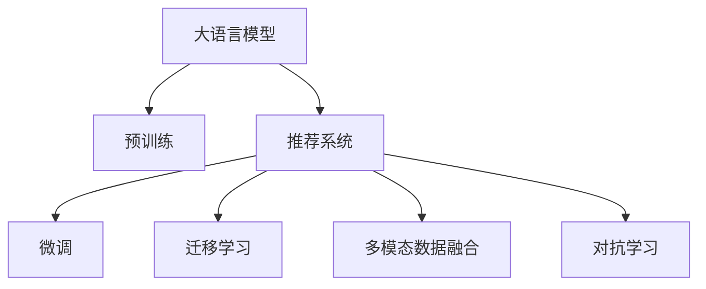

                 

# AI大模型视角下电商搜索推荐的技术创新文化建设

## 1. 背景介绍

### 1.1 问题由来
随着互联网技术的迅速发展，电商行业进入了一个高度竞争的阶段。各大电商平台不断通过科技创新来提升用户体验，争夺市场份额。在电商搜索推荐领域，如何准确高效地匹配用户需求与商品信息，提高转化率，成为平台优化服务的关键。传统的基于规则的推荐系统逐渐显露出其局限性，难以兼顾复杂性、灵活性和实时性。为了解决这些问题，基于人工智能(AI)大模型的推荐系统应运而生，并迅速成为电商搜索推荐的主流方案。

### 1.2 问题核心关键点
大模型推荐系统以自然语言处理(NLP)、计算机视觉(CV)等领域的预训练模型为基础，通过微调(Fine-Tuning)和迁移学习(Transfer Learning)等方法，对大量标注数据进行学习，从而实现个性化推荐。其主要特点包括：
- 通过大规模预训练获得通用知识，为推荐系统提供高质量的基础特征。
- 借助深度学习模型，实现高效、准确的推荐。
- 使用微调等技术，对个性化需求进行适应和调整。
- 支持多模态数据融合，提升推荐系统的多样性和相关性。

## 2. 核心概念与联系

### 2.1 核心概念概述
为更好地理解AI大模型在电商搜索推荐中的应用，本节将介绍几个关键概念：

- **大语言模型(Large Language Model, LLM)**：指通过大规模无标签文本语料进行预训练的语言模型，如GPT、BERT等，具备强大的语言理解和生成能力。
- **推荐系统(Recommender System)**：使用算法和模型，根据用户的历史行为和偏好，推荐相关商品或内容的技术系统。
- **微调(Fine-Tuning)**：指在大模型基础上，使用标注数据进行进一步优化，以适应特定任务。
- **迁移学习(Transfer Learning)**：指将一个任务中学到的知识迁移到另一个相关任务上的学习范式，可以降低训练成本，提高模型泛化能力。
- **多模态数据融合**：指将文本、图像、视频等多种类型的数据进行整合，提升推荐系统的精度和用户满意度。
- **对抗学习(Adversarial Learning)**：指通过对抗样本训练，提高模型对噪声和攻击的鲁棒性。

这些概念通过以下Mermaid流程图来展示：



## 3. 核心算法原理 & 具体操作步骤
### 3.1 算法原理概述

大模型在电商搜索推荐中的应用主要通过以下几个步骤：

1. **预训练**：在通用大模型上进行大规模无标签文本语料预训练，学习语言的通用知识。
2. **微调**：在特定任务上使用标注数据进行微调，适应电商搜索推荐的需求。
3. **迁移学习**：利用通用大模型的知识，加速在特定任务上的学习。
4. **多模态融合**：结合文本、图像、视频等多种类型的数据，提升推荐系统的精度和相关性。
5. **对抗训练**：使用对抗样本进行训练，提高模型的鲁棒性和安全性。

### 3.2 算法步骤详解

**Step 1: 准备数据和模型**

- 收集电商平台的标注数据集，包括用户行为数据、商品信息数据等。
- 选择合适的预训练语言模型，如BERT、GPT等，并进行下载和加载。

**Step 2: 数据预处理**

- 对原始数据进行清洗、归一化、向量化等处理。
- 使用分词器、编码器等工具，将文本数据转化为模型可以处理的格式。

**Step 3: 模型微调**

- 设计损失函数，将模型输出与标注数据进行对比。
- 使用优化器进行反向传播和参数更新。
- 应用正则化技术，防止过拟合。

**Step 4: 多模态数据融合**

- 收集不同类型的数据，如文本、图像、视频等。
- 使用多模态融合技术，将不同类型的数据进行融合和特征提取。
- 结合融合后的特征，进行推荐模型训练。

**Step 5: 对抗训练**

- 构造对抗样本，对模型进行攻击。
- 调整模型参数，提高对对抗样本的鲁棒性。

**Step 6: 部署和监控**

- 将训练好的模型部署到服务器上，提供推荐服务。
- 实时监控模型性能，及时进行参数更新和模型优化。

### 3.3 算法优缺点

大模型在电商搜索推荐中的应用有以下优点：

- **精度高**：利用深度学习模型的强大表征能力，能够准确地匹配用户需求与商品信息。
- **灵活性**：可以通过微调和迁移学习，对不同类型的数据进行灵活处理，适应个性化需求。
- **可扩展性**：大模型能够处理大规模数据，支持大规模的电商平台应用。
- **可解释性**：大模型能够提供详细的决策过程，便于解释和调试。

同时，也存在以下缺点：

- **计算资源消耗大**：预训练和微调过程中需要大量计算资源。
- **标注成本高**：标注数据集的质量和数量直接影响模型的性能。
- **泛化能力有限**：面对复杂多变的数据，模型的泛化能力可能不足。
- **模型复杂度高**：大模型的复杂度较高，难以解释其内部工作机制。

## 4. 数学模型和公式 & 详细讲解 & 举例说明

### 4.1 数学模型构建

假设电商推荐系统中的推荐模型为$f_{\theta}(x)$，其中$x$为输入特征向量，$\theta$为模型参数。推荐模型使用深度学习框架进行训练，如TensorFlow、PyTorch等。推荐模型通常采用点积或交叉熵损失函数，进行模型优化。

### 4.2 公式推导过程

以点积损失函数为例，假设模型预测为$\hat{y}=f_{\theta}(x)$，实际标签为$y$，则点积损失函数可以表示为：

$$
\mathcal{L}(y, \hat{y}) = -y \log \hat{y} - (1-y) \log (1-\hat{y})
$$

在训练过程中，使用梯度下降等优化算法，对模型参数$\theta$进行更新，使得模型输出与实际标签更加接近。

### 4.3 案例分析与讲解

以电商商品推荐为例，假设推荐系统输入为用户的浏览记录$x$，模型预测为推荐商品$y$。通过多模态融合，将用户的浏览记录、商品描述、图片等信息进行融合，得到融合后的特征向量$x'$。然后将$x'$输入推荐模型$f_{\theta}(x')$，输出预测的商品$y$。通过最小化点积损失函数，调整模型参数$\theta$，使得预测商品与用户兴趣更加一致。

## 5. 项目实践：代码实例和详细解释说明

### 5.1 开发环境搭建

为了搭建一个基于大模型的电商搜索推荐系统，首先需要安装Python和相关的深度学习框架，如TensorFlow、PyTorch等。同时需要安装相关的数据处理和特征工程工具，如NLTK、Scikit-learn等。

### 5.2 源代码详细实现

以下是使用PyTorch进行电商推荐系统开发的代码实现。假设推荐系统输入为用户的浏览记录$x$，模型输出为推荐商品$y$。

```python
import torch
import torch.nn as nn
import torch.optim as optim

# 定义推荐模型
class RecommenderModel(nn.Module):
    def __init__(self, input_dim, output_dim):
        super(RecommenderModel, self).__init__()
        self.fc1 = nn.Linear(input_dim, 256)
        self.fc2 = nn.Linear(256, 128)
        self.fc3 = nn.Linear(128, output_dim)
        self.relu = nn.ReLU()

    def forward(self, x):
        x = self.fc1(x)
        x = self.relu(x)
        x = self.fc2(x)
        x = self.relu(x)
        x = self.fc3(x)
        return x

# 定义优化器和学习率
model = RecommenderModel(input_dim=100, output_dim=10)
optimizer = optim.Adam(model.parameters(), lr=0.001)

# 定义损失函数
criterion = nn.CrossEntropyLoss()

# 训练模型
for epoch in range(10):
    for batch in train_data:
        x, y = batch
        y_hat = model(x)
        loss = criterion(y_hat, y)
        optimizer.zero_grad()
        loss.backward()
        optimizer.step()
```

### 5.3 代码解读与分析

**RecommenderModel类**：定义了推荐模型的架构，包括多层全连接层和ReLU激活函数。

**Adam优化器**：使用Adam优化器对模型参数进行更新，学习率为0.001。

**CrossEntropyLoss损失函数**：使用交叉熵损失函数，将模型输出与实际标签进行对比。

**训练循环**：通过循环迭代训练数据，使用反向传播更新模型参数，最小化损失函数。

### 5.4 运行结果展示

在训练过程中，可以实时监控模型的损失函数值，判断模型是否收敛。训练完成后，可以使用测试数据集对模型进行评估，判断模型是否能够准确推荐商品。

## 6. 实际应用场景

### 6.1 智能客服

大模型在电商平台的智能客服中也有广泛应用。通过对话生成模型，可以自动解答用户的常见问题，提高客服效率和用户体验。

### 6.2 个性化推荐

大模型可以结合用户的历史行为和实时反馈，动态调整推荐策略，实现个性化推荐。通过多模态数据融合，提升推荐的准确性和多样性。

### 6.3 智能广告

大模型可以帮助电商平台进行精准投放广告，通过预测用户对不同广告的兴趣，优化广告投放策略，提高广告的转化率和点击率。

### 6.4 未来应用展望

未来，大模型在电商搜索推荐中的应用将更加广泛和深入。例如，在社交电商中，可以通过对用户社交行为数据的分析，推荐更多符合用户兴趣的商品；在跨境电商中，可以通过多语言模型进行商品描述翻译和推荐。

## 7. 工具和资源推荐

### 7.1 学习资源推荐

1. 《深度学习与推荐系统》课程：由斯坦福大学提供，详细讲解了推荐系统的基本原理和最新进展。
2. 《推荐系统实战》书籍：介绍了推荐系统从理论到实践的全过程，包括模型选择、数据预处理、模型训练等。
3. TensorFlow官方文档：提供了深度学习模型的完整实现和文档支持，是学习大模型推荐系统的必备资源。

### 7.2 开发工具推荐

1. PyTorch：深度学习框架，支持动态计算图和自动微分，适合快速迭代研究。
2. TensorFlow：深度学习框架，支持分布式计算和高效的模型优化，适合大规模工程应用。
3. Transformers库：提供了多种预训练语言模型的实现，支持微调和迁移学习。

### 7.3 相关论文推荐

1. Attention is All You Need：介绍Transformer模型，奠定了大语言模型在电商推荐中的基础。
2. BERT: Pre-training of Deep Bidirectional Transformers for Language Understanding：提出了BERT模型，为电商推荐提供了强大的预训练基础。
3. Parameter-Efficient Transfer Learning for NLP：提出Adapter等参数高效微调方法，优化了电商推荐系统的资源消耗。

## 8. 总结：未来发展趋势与挑战

### 8.1 研究成果总结

基于大模型的电商搜索推荐系统已经在多个实际应用中取得了显著效果，提升了电商平台的运营效率和用户满意度。然而，仍需解决以下问题：
- 如何更好地融合多模态数据，提升推荐的准确性和多样性。
- 如何提高模型的泛化能力，适应复杂多变的电商场景。
- 如何提高模型的可解释性，让用户信任推荐结果。

### 8.2 未来发展趋势

未来，大模型在电商搜索推荐中的应用将呈现以下几个趋势：

1. 多模态融合将更加深入，结合图像、视频等多类型数据，提升推荐精度。
2. 模型将更加复杂，融合更多领域知识，提升推荐的普适性。
3. 模型的可解释性将得到更多关注，提高用户对推荐结果的信任度。

### 8.3 面临的挑战

大模型在电商推荐中仍然面临以下挑战：

1. 数据隐私和安全问题：如何保护用户数据隐私，防止模型被恶意攻击。
2. 计算资源消耗大：如何优化模型结构，降低计算资源消耗。
3. 模型可解释性不足：如何提高模型输出的可解释性，让用户更好地理解推荐结果。

### 8.4 研究展望

未来研究的方向包括：

1. 探索更多多模态融合方法，提升推荐的精度和相关性。
2. 研究模型压缩和加速技术，降低计算资源消耗。
3. 开发可解释性强的大模型，提高用户对推荐结果的信任度。

## 9. 附录：常见问题与解答

**Q1: 大模型在电商搜索推荐中的应用如何提升用户满意度？**

A: 大模型通过深度学习模型的强大表征能力，能够准确地匹配用户需求与商品信息，提供个性化的推荐服务。同时，大模型可以动态调整推荐策略，根据用户实时反馈进行优化，提升用户满意度。

**Q2: 大模型在电商推荐中如何进行多模态数据融合？**

A: 多模态数据融合通常采用特征融合和注意力机制，将不同类型的数据进行融合，提取重要特征。例如，将用户的浏览记录、商品描述、图片等信息进行融合，得到融合后的特征向量，输入推荐模型进行预测。

**Q3: 大模型在电商推荐中面临的主要挑战是什么？**

A: 大模型在电商推荐中面临的主要挑战包括数据隐私和安全问题、计算资源消耗大、模型可解释性不足等。

**Q4: 如何提高大模型的泛化能力，适应复杂多变的电商场景？**

A: 提高大模型的泛化能力可以通过增加数据量和多样性、使用对抗训练等方法来实现。例如，在推荐系统中，可以收集更多的用户行为数据和商品信息，进行数据增强和对抗训练，提高模型的泛化能力。

---

作者：禅与计算机程序设计艺术 / Zen and the Art of Computer Programming

