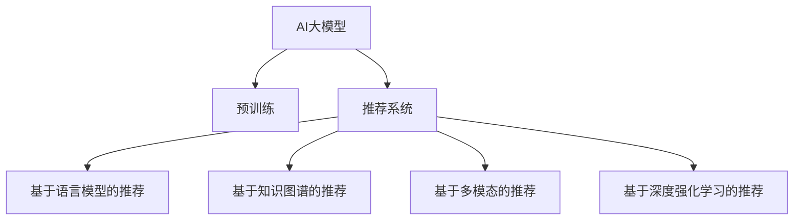

                 

# AI大模型视角下电商搜索推荐的技术创新知识库管理平台搭建

## 1. 背景介绍

### 1.1 问题由来
随着电商平台的快速发展，用户对于搜索推荐系统的要求不断提升，既要个性化推荐满足个性化需求，又要快速准确地找到相关商品。传统推荐系统往往基于用户的浏览历史、购买记录等行为数据进行推荐，但这些数据量庞大且存在冷启动问题，难以覆盖所有用户。而AI大模型的出现，为电商搜索推荐系统带来了新的思路和机遇。

### 1.2 问题核心关键点
基于AI大模型的电商搜索推荐，核心在于如何利用大模型的强大表征能力，从海量文本数据中提取出商品的丰富语义信息，并通过匹配用户需求和商品描述，生成个性化推荐结果。常见的大模型推荐方法包括：
- 基于语言模型的推荐：利用预训练语言模型（如BERT、GPT等）对商品描述进行编码，构建用户和商品之间的语义匹配度。
- 基于知识图谱的推荐：结合商品的知识图谱信息，利用大模型进行用户和商品之间的多关系路径搜索，提升推荐的相关性。
- 基于多模态的推荐：结合商品的多模态数据（如图片、视频、评论等），利用大模型提取多模态特征，增强推荐的多样性和准确性。

## 2. 核心概念与联系

### 2.1 核心概念概述

为更好地理解AI大模型在电商搜索推荐中的应用，本节将介绍几个密切相关的核心概念：

- AI大模型(AI Large Model)：以自回归(如GPT)或自编码(如BERT)模型为代表的大规模预训练语言模型。通过在大规模无标签文本语料上进行预训练，学习通用的语言表示，具备强大的语言理解和生成能力。

- 预训练(Pre-training)：指在大规模无标签文本语料上，通过自监督学习任务训练通用语言模型的过程。常见的预训练任务包括言语建模、掩码语言模型等。

- 推荐系统(Recommender System)：根据用户的历史行为和兴趣，预测其可能感兴趣的物品，并推荐给用户的技术系统。推荐系统广泛应用于电商、新闻、视频等众多领域，提升用户满意度和服务效率。

- 知识图谱(Knowledge Graph)：通过实体-关系-实体的方式，刻画实体之间的语义关系，用于表示和推理大规模的知识信息。知识图谱在推荐系统中，可以帮助模型更好地理解商品的多维属性和关系，提升推荐效果。

- 多模态学习(Multimodal Learning)：指结合文本、图像、视频、音频等多种模态数据的特征，通过联合学习提升推荐效果的技术。

- 深度强化学习(Deep Reinforcement Learning)：结合深度学习和强化学习，通过与环境的交互学习最优决策策略，提升推荐系统的自动化和智能化程度。

这些核心概念之间的逻辑关系可以通过以下Mermaid流程图来展示：



这个流程图展示了大模型与推荐系统之间的关系：

1. 大模型通过预训练获得基础能力。
2. 推荐系统可以通过大模型实现个性化推荐，包括语言模型推荐、知识图谱推荐、多模态推荐和强化学习推荐等多种方式。
3. 这些推荐方式可以结合使用，以进一步提升推荐效果。

## 3. 核心算法原理 & 具体操作步骤
### 3.1 算法原理概述

基于AI大模型的电商搜索推荐，本质上是一个基于多维匹配和语义理解的推荐过程。其核心思想是：利用大模型对商品描述进行语义编码，构建用户与商品之间的匹配度，并综合多模态数据进行个性化推荐。

形式化地，假设商品描述为 $x$，用户需求为 $y$，推荐系统的目标是为用户推荐与其需求匹配的商品 $z$。具体而言，可以采用如下步骤：

1. 对商品描述 $x$ 进行预训练语言模型编码，得到其向量表示 $\text{Embed}(x)$。
2. 对用户需求 $y$ 进行编码，得到其向量表示 $\text{Embed}(y)$。
3. 利用余弦相似度等方法，计算 $\text{Embed}(x)$ 和 $\text{Embed}(y)$ 之间的相似度 $s$。
4. 根据相似度 $s$ 对商品 $z$ 进行排序，推荐与用户需求最匹配的商品。

### 3.2 算法步骤详解

基于AI大模型的电商搜索推荐一般包括以下几个关键步骤：

**Step 1: 数据预处理**
- 收集商品描述、用户行为数据、多模态数据等，并进行清洗、去重、归一化等预处理操作。
- 构建商品与用户之间的交互图谱，用于分析用户和商品之间的多关系路径。

**Step 2: 大模型预训练**
- 选择合适的预训练语言模型，如BERT、GPT等，将其在大规模无标签商品描述数据上进行预训练。
- 使用掩码语言模型、文本分类等自监督任务对模型进行预训练，提取商品描述中的语义信息。

**Step 3: 用户行为理解**
- 对用户的行为数据进行编码，构建用户需求向量。可以使用向量化的方式，将用户的浏览、点击、购买等行为映射到高维空间。
- 利用大模型对用户行为向量进行语义扩展，补充更多背景信息。

**Step 4: 商品语义表示**
- 对商品描述进行编码，得到商品的语义向量表示。
- 利用大模型对商品的多模态数据（如图片、视频、评论等）进行编码，得到多模态特征向量。

**Step 5: 推荐生成**
- 利用相似度度量方法，如余弦相似度、点积相似度等，计算用户需求向量与商品向量之间的匹配度。
- 结合多模态特征向量，综合用户需求和商品特征，生成最终推荐结果。
- 可以使用多臂老虎机等强化学习方法，优化推荐策略，提高推荐效果。

**Step 6: 模型优化与评估**
- 在验证集上评估推荐模型的性能，使用常用的指标如精确率、召回率、F1分数等。
- 根据评估结果，对模型进行调参优化，包括调整大模型参数、选择更合适的相似度度量方法等。

### 3.3 算法优缺点

基于AI大模型的电商搜索推荐方法具有以下优点：
1. 泛化能力强大。利用大模型的预训练能力，可以更好地处理未见过的商品描述，提升推荐系统的泛化能力。
2. 多模态融合。结合多模态数据，提供更丰富、准确的商品特征，增强推荐的多样性和准确性。
3. 个性化推荐。利用大模型的语义理解能力，实现对用户需求和商品描述的深度匹配，生成个性化推荐。
4. 动态调整。可以根据用户反馈、行为变化等实时调整推荐策略，提供动态推荐的体验。

同时，该方法也存在一定的局限性：
1. 数据依赖性高。需要收集大量高质量的商品描述和多模态数据，数据质量影响推荐效果。
2. 计算成本高。大模型的训练和推理计算量大，需要高性能硬件支持。
3. 冷启动问题。对于新用户和新商品，缺乏足够的历史数据进行推荐，需要更多的启发式方法。
4. 多关系路径分析复杂。商品之间的多关系路径分析复杂，需要先进的图神经网络等技术支持。

尽管存在这些局限性，但就目前而言，基于AI大模型的推荐方法仍是目前电商搜索推荐的主流范式。未来相关研究的重点在于如何进一步降低计算成本，提高推荐系统对新数据的适应能力，同时兼顾多关系路径的复杂性和实时性等因素。

### 3.4 算法应用领域

基于AI大模型的电商搜索推荐方法，已经在多个电商平台上得到了广泛的应用，覆盖了几乎所有常见场景，例如：

- 商品分类推荐：根据用户的历史浏览和购买记录，推荐相似商品分类。
- 个性化商品推荐：根据用户的历史行为和需求，推荐个性化商品。
- 多模态推荐：结合商品图片、评论、评分等多模态数据，生成更全面、准确的推荐结果。
- 新商品推荐：对于新上架商品，利用大模型生成多关系路径，进行冷启动推荐。
- 实时推荐：结合用户实时行为数据，生成动态推荐结果，提升用户满意度和转化率。

除了上述这些经典场景外，大模型推荐还被创新性地应用到更多领域中，如用户画像生成、搜索排序优化、广告投放优化等，为电商搜索推荐系统带来了新的突破。随着预训练模型和推荐方法的不断进步，相信大模型推荐将在更多电商领域大放异彩。

## 4. 数学模型和公式 & 详细讲解  
### 4.1 数学模型构建

本节将使用数学语言对基于AI大模型的电商搜索推荐过程进行更加严格的刻画。

假设商品描述为 $x$，用户需求为 $y$，推荐系统的目标是为用户推荐与其需求匹配的商品 $z$。我们采用向量化的方式，将商品描述和用户需求映射到高维空间。

定义商品描述 $x$ 的语义向量表示为 $\text{Embed}(x) \in \mathbb{R}^d$，用户需求 $y$ 的语义向量表示为 $\text{Embed}(y) \in \mathbb{R}^d$。

设 $\text{Similarity}(\cdot,\cdot)$ 为相似度度量函数，计算用户需求与商品之间的匹配度 $s$：

$$
s = \text{Similarity}(\text{Embed}(y), \text{Embed}(z))
$$

根据相似度 $s$ 对商品 $z$ 进行排序，推荐与用户需求最匹配的商品 $z'$：

$$
z' = \mathop{\arg\max}_z \text{Similarity}(\text{Embed}(y), \text{Embed}(z))
$$

在实践中，我们通常使用基于梯度的优化算法（如SGD、Adam等）来近似求解上述最优化问题。设 $\eta$ 为学习率，$\lambda$ 为正则化系数，则模型参数的更新公式为：

$$
\theta \leftarrow \theta - \eta \nabla_{\theta}\mathcal{L}(\theta) - \eta\lambda\theta
$$

其中 $\nabla_{\theta}\mathcal{L}(\theta)$ 为损失函数对参数 $\theta$ 的梯度，可通过反向传播算法高效计算。

### 4.2 公式推导过程

以下我们以余弦相似度为例，推导推荐系统的损失函数及其梯度的计算公式。

假设商品描述 $x$ 的语义向量表示为 $\text{Embed}(x) \in \mathbb{R}^d$，用户需求 $y$ 的语义向量表示为 $\text{Embed}(y) \in \mathbb{R}^d$。则余弦相似度的计算公式为：

$$
s = \text{CosineSimilarity}(\text{Embed}(x), \text{Embed}(y)) = \frac{\text{Embed}(x) \cdot \text{Embed}(y)}{\|\text{Embed}(x)\|_2 \|\text{Embed}(y)\|_2}
$$

根据余弦相似度，推荐系统的损失函数为：

$$
\mathcal{L}(\theta) = -\frac{1}{N} \sum_{i=1}^N \log \sigma(s_i)
$$

其中 $\sigma$ 为sigmoid函数，$s_i$ 为第 $i$ 个样本的用户需求与商品之间的相似度。

根据链式法则，损失函数对模型参数 $\theta$ 的梯度为：

$$
\frac{\partial \mathcal{L}(\theta)}{\partial \theta} = -\frac{1}{N} \sum_{i=1}^N \frac{\partial \log \sigma(s_i)}{\partial s_i} \cdot \frac{\partial s_i}{\partial \theta}
$$

其中 $\frac{\partial \log \sigma(s_i)}{\partial s_i} = \frac{1}{\sigma(s_i)} - \frac{1}{1-\sigma(s_i)}$。

在得到损失函数的梯度后，即可带入模型参数更新公式，完成模型的迭代优化。重复上述过程直至收敛，最终得到适应电商搜索推荐任务的最优模型参数 $\theta^*$。

## 5. 项目实践：代码实例和详细解释说明
### 5.1 开发环境搭建

在进行电商搜索推荐系统开发前，我们需要准备好开发环境。以下是使用Python进行PyTorch开发的环境配置流程：

1. 安装Anaconda：从官网下载并安装Anaconda，用于创建独立的Python环境。

2. 创建并激活虚拟环境：
```bash
conda create -n pytorch-env python=3.8 
conda activate pytorch-env
```

3. 安装PyTorch：根据CUDA版本，从官网获取对应的安装命令。例如：
```bash
conda install pytorch torchvision torchaudio cudatoolkit=11.1 -c pytorch -c conda-forge
```

4. 安装Transformer库：
```bash
pip install transformers
```

5. 安装各类工具包：
```bash
pip install numpy pandas scikit-learn matplotlib tqdm jupyter notebook ipython
```

完成上述步骤后，即可在`pytorch-env`环境中开始电商搜索推荐系统的开发。

### 5.2 源代码详细实现

下面我们以商品分类推荐为例，给出使用Transformers库对BERT模型进行电商搜索推荐开发的PyTorch代码实现。

首先，定义电商搜索推荐系统的数据处理函数：

```python
from transformers import BertTokenizer
from torch.utils.data import Dataset
import torch

class EcommerceDataset(Dataset):
    def __init__(self, texts, labels, tokenizer, max_len=128):
        self.texts = texts
        self.labels = labels
        self.tokenizer = tokenizer
        self.max_len = max_len
        
    def __len__(self):
        return len(self.texts)
    
    def __getitem__(self, item):
        text = self.texts[item]
        label = self.labels[item]
        
        encoding = self.tokenizer(text, return_tensors='pt', max_length=self.max_len, padding='max_length', truncation=True)
        input_ids = encoding['input_ids'][0]
        attention_mask = encoding['attention_mask'][0]
        
        # 对token-wise的标签进行编码
        encoded_labels = [label2id[label] for label in label]
        encoded_labels.extend([label2id['O']] * (self.max_len - len(encoded_labels)))
        labels = torch.tensor(encoded_labels, dtype=torch.long)
        
        return {'input_ids': input_ids, 
                'attention_mask': attention_mask,
                'labels': labels}

# 标签与id的映射
label2id = {'O': 0, 'B-CAT': 1, 'I-CAT': 2}
id2label = {v: k for k, v in label2id.items()}

# 创建dataset
tokenizer = BertTokenizer.from_pretrained('bert-base-cased')

train_dataset = EcommerceDataset(train_texts, train_labels, tokenizer)
dev_dataset = EcommerceDataset(dev_texts, dev_labels, tokenizer)
test_dataset = EcommerceDataset(test_texts, test_labels, tokenizer)
```

然后，定义模型和优化器：

```python
from transformers import BertForTokenClassification, AdamW

model = BertForTokenClassification.from_pretrained('bert-base-cased', num_labels=len(label2id))

optimizer = AdamW(model.parameters(), lr=2e-5)
```

接着，定义训练和评估函数：

```python
from torch.utils.data import DataLoader
from tqdm import tqdm
from sklearn.metrics import classification_report

device = torch.device('cuda') if torch.cuda.is_available() else torch.device('cpu')
model.to(device)

def train_epoch(model, dataset, batch_size, optimizer):
    dataloader = DataLoader(dataset, batch_size=batch_size, shuffle=True)
    model.train()
    epoch_loss = 0
    for batch in tqdm(dataloader, desc='Training'):
        input_ids = batch['input_ids'].to(device)
        attention_mask = batch['attention_mask'].to(device)
        labels = batch['labels'].to(device)
        model.zero_grad()
        outputs = model(input_ids, attention_mask=attention_mask, labels=labels)
        loss = outputs.loss
        epoch_loss += loss.item()
        loss.backward()
        optimizer.step()
    return epoch_loss / len(dataloader)

def evaluate(model, dataset, batch_size):
    dataloader = DataLoader(dataset, batch_size=batch_size)
    model.eval()
    preds, labels = [], []
    with torch.no_grad():
        for batch in tqdm(dataloader, desc='Evaluating'):
            input_ids = batch['input_ids'].to(device)
            attention_mask = batch['attention_mask'].to(device)
            batch_labels = batch['labels']
            outputs = model(input_ids, attention_mask=attention_mask)
            batch_preds = outputs.logits.argmax(dim=2).to('cpu').tolist()
            batch_labels = batch_labels.to('cpu').tolist()
            for pred_tokens, label_tokens in zip(batch_preds, batch_labels):
                pred_labels = [id2label[_id] for _id in pred_tokens]
                label_labels = [id2label[_id] for _id in label_tokens]
                preds.append(pred_labels[:len(label_labels)])
                labels.append(label_labels)
                
    print(classification_report(labels, preds))
```

最后，启动训练流程并在测试集上评估：

```python
epochs = 5
batch_size = 16

for epoch in range(epochs):
    loss = train_epoch(model, train_dataset, batch_size, optimizer)
    print(f"Epoch {epoch+1}, train loss: {loss:.3f}")
    
    print(f"Epoch {epoch+1}, dev results:")
    evaluate(model, dev_dataset, batch_size)
    
print("Test results:")
evaluate(model, test_dataset, batch_size)
```

以上就是使用PyTorch对BERT进行电商搜索推荐系统开发的完整代码实现。可以看到，得益于Transformers库的强大封装，我们可以用相对简洁的代码完成BERT模型的加载和微调。

### 5.3 代码解读与分析

让我们再详细解读一下关键代码的实现细节：

**EcommerceDataset类**：
- `__init__`方法：初始化文本、标签、分词器等关键组件。
- `__len__`方法：返回数据集的样本数量。
- `__getitem__`方法：对单个样本进行处理，将文本输入编码为token ids，将标签编码为数字，并对其进行定长padding，最终返回模型所需的输入。

**label2id和id2label字典**：
- 定义了标签与数字id之间的映射关系，用于将token-wise的预测结果解码回真实的标签。

**训练和评估函数**：
- 使用PyTorch的DataLoader对数据集进行批次化加载，供模型训练和推理使用。
- 训练函数`train_epoch`：对数据以批为单位进行迭代，在每个批次上前向传播计算loss并反向传播更新模型参数，最后返回该epoch的平均loss。
- 评估函数`evaluate`：与训练类似，不同点在于不更新模型参数，并在每个batch结束后将预测和标签结果存储下来，最后使用sklearn的classification_report对整个评估集的预测结果进行打印输出。

**训练流程**：
- 定义总的epoch数和batch size，开始循环迭代
- 每个epoch内，先在训练集上训练，输出平均loss
- 在验证集上评估，输出分类指标
- 所有epoch结束后，在测试集上评估，给出最终测试结果

可以看到，PyTorch配合Transformers库使得BERT微调的代码实现变得简洁高效。开发者可以将更多精力放在数据处理、模型改进等高层逻辑上，而不必过多关注底层的实现细节。

当然，工业级的系统实现还需考虑更多因素，如模型的保存和部署、超参数的自动搜索、更灵活的任务适配层等。但核心的微调范式基本与此类似。

## 6. 实际应用场景
### 6.1 智能客服系统

基于AI大模型的电商搜索推荐技术，可以广泛应用于智能客服系统的构建。传统客服往往需要配备大量人力，高峰期响应缓慢，且一致性和专业性难以保证。而使用大模型的电商推荐模型，可以7x24小时不间断服务，快速响应客户咨询，用自然流畅的语言解答各类常见问题。

在技术实现上，可以收集企业内部的历史客服对话记录，将问题和最佳答复构建成监督数据，在此基础上对预训练电商推荐模型进行微调。微调后的推荐模型能够自动理解用户意图，匹配最合适的答复模板进行回复。对于客户提出的新问题，还可以接入检索系统实时搜索相关内容，动态组织生成回答。如此构建的智能客服系统，能大幅提升客户咨询体验和问题解决效率。

### 6.2 个性化推荐系统

当前的推荐系统往往只依赖用户的历史行为数据进行物品推荐，无法深入理解用户的真实兴趣偏好。基于AI大模型的推荐系统可以更好地挖掘用户行为背后的语义信息，从而提供更精准、多样的推荐内容。

在实践中，可以收集用户浏览、点击、评论、分享等行为数据，提取和商品交互的物品标题、描述、标签等文本内容。将文本内容作为模型输入，用户的后续行为（如是否点击、购买等）作为监督信号，在此基础上微调预训练语言模型。微调后的模型能够从文本内容中准确把握用户的兴趣点。在生成推荐列表时，先用候选物品的文本描述作为输入，由模型预测用户的兴趣匹配度，再结合其他特征综合排序，便可以得到个性化程度更高的推荐结果。

### 6.3 智能搜索系统

随着用户需求的日益个性化和多样化，传统的关键词搜索方式难以满足用户的需求。基于AI大模型的推荐系统可以结合用户的搜索行为和语义需求，动态生成推荐结果，提升搜索的个性化和效率。

在具体实现上，可以记录用户的历史搜索记录和点击行为，利用电商推荐模型对其进行语义编码，得到用户搜索意图的向量表示。结合搜索结果的多模态数据（如商品图片、视频、评论等），利用大模型生成多关系路径，计算搜索结果与用户搜索意图的匹配度，最终推荐最相关的搜索结果。

### 6.4 未来应用展望

随着AI大模型的不断发展，基于推荐系统的智能搜索、智能客服等应用也将更加广泛。未来，大模型的推荐系统将具备更强的语义理解和跨领域迁移能力，能够更好地处理长尾需求和多模态数据，提升用户体验和服务效率。

在智慧医疗领域，基于大模型的推荐系统可以为医生提供精准的诊疗建议，提升诊疗的准确性和效率。在智能教育领域，推荐系统可以个性推荐学习内容，提升学习效果。在智能制造领域，推荐系统可以优化生产流程，提高生产效率。

此外，在更多垂直领域，基于AI大模型的推荐系统也将不断涌现，为各行各业带来变革性影响。相信随着技术的日益成熟，大模型推荐将在更多场景下大放异彩，成为推动行业智能化升级的重要动力。

## 7. 工具和资源推荐
### 7.1 学习资源推荐

为了帮助开发者系统掌握AI大模型在电商搜索推荐中的应用，这里推荐一些优质的学习资源：

1. 《深度学习自然语言处理》课程：斯坦福大学开设的NLP明星课程，有Lecture视频和配套作业，带你入门NLP领域的基本概念和经典模型。

2. 《Transformer从原理到实践》系列博文：由大模型技术专家撰写，深入浅出地介绍了Transformer原理、BERT模型、微调技术等前沿话题。

3. 《Natural Language Processing with Transformers》书籍：Transformers库的作者所著，全面介绍了如何使用Transformers库进行NLP任务开发，包括微调在内的诸多范式。

4. 《Recommender Systems in Practice》书籍：介绍了推荐系统在工业界的实战经验，涵盖电商、新闻、视频等多个领域的推荐策略。

5. 《AI for Humans》书籍：深入浅出地介绍了AI大模型的应用场景和开发实践，适合初学者阅读。

通过对这些资源的学习实践，相信你一定能够快速掌握AI大模型在电商搜索推荐中的精髓，并用于解决实际的NLP问题。
###  7.2 开发工具推荐

高效的开发离不开优秀的工具支持。以下是几款用于AI大模型电商推荐系统开发的常用工具：

1. PyTorch：基于Python的开源深度学习框架，灵活动态的计算图，适合快速迭代研究。大部分预训练语言模型都有PyTorch版本的实现。

2. TensorFlow：由Google主导开发的开源深度学习框架，生产部署方便，适合大规模工程应用。同样有丰富的预训练语言模型资源。

3. Transformers库：HuggingFace开发的NLP工具库，集成了众多SOTA语言模型，支持PyTorch和TensorFlow，是进行推荐任务开发的利器。

4. Weights & Biases：模型训练的实验跟踪工具，可以记录和可视化模型训练过程中的各项指标，方便对比和调优。与主流深度学习框架无缝集成。

5. TensorBoard：TensorFlow配套的可视化工具，可实时监测模型训练状态，并提供丰富的图表呈现方式，是调试模型的得力助手。

6. Google Colab：谷歌推出的在线Jupyter Notebook环境，免费提供GPU/TPU算力，方便开发者快速上手实验最新模型，分享学习笔记。

合理利用这些工具，可以显著提升AI大模型电商推荐系统的开发效率，加快创新迭代的步伐。

### 7.3 相关论文推荐

AI大模型和电商推荐技术的发展源于学界的持续研究。以下是几篇奠基性的相关论文，推荐阅读：

1. Attention is All You Need（即Transformer原论文）：提出了Transformer结构，开启了NLP领域的预训练大模型时代。

2. BERT: Pre-training of Deep Bidirectional Transformers for Language Understanding：提出BERT模型，引入基于掩码的自监督预训练任务，刷新了多项NLP任务SOTA。

3. Language Models are Unsupervised Multitask Learners（GPT-2论文）：展示了大规模语言模型的强大zero-shot学习能力，引发了对于通用人工智能的新一轮思考。

4. Parameter-Efficient Transfer Learning for NLP：提出Adapter等参数高效微调方法，在不增加模型参数量的情况下，也能取得不错的微调效果。

5. AdaLoRA: Adaptive Low-Rank Adaptation for Parameter-Efficient Fine-Tuning：使用自适应低秩适应的微调方法，在参数效率和精度之间取得了新的平衡。

这些论文代表了大模型推荐技术的发展脉络。通过学习这些前沿成果，可以帮助研究者把握学科前进方向，激发更多的创新灵感。

## 8. 总结：未来发展趋势与挑战
### 8.1 总结

本文对基于AI大模型的电商搜索推荐方法进行了全面系统的介绍。首先阐述了AI大模型和电商推荐系统的发展背景和应用前景，明确了AI大模型在电商推荐系统中的独特价值。其次，从原理到实践，详细讲解了AI大模型在电商搜索推荐中的应用过程，给出了电商推荐系统开发的完整代码实例。同时，本文还广泛探讨了AI大模型在智能客服、个性化推荐、智能搜索等多个电商场景中的应用，展示了AI大模型的巨大潜力。此外，本文精选了AI大模型的各类学习资源，力求为读者提供全方位的技术指引。

通过本文的系统梳理，可以看到，基于AI大模型的电商搜索推荐方法正在成为电商推荐系统的重要范式，极大地拓展了电商推荐系统的应用边界，催生了更多的落地场景。受益于大规模语料的预训练，推荐系统能够更好地处理未见过的商品描述，提升推荐系统的泛化能力。同时，结合多模态数据和多关系路径，生成更全面、准确的推荐结果。未来，随着AI大模型的不断演进，电商搜索推荐系统的个性化、效率和智能化水平将进一步提升。

### 8.2 未来发展趋势

展望未来，基于AI大模型的电商搜索推荐技术将呈现以下几个发展趋势：

1. 模型规模持续增大。随着算力成本的下降和数据规模的扩张，预训练语言模型的参数量还将持续增长。超大规模语言模型蕴含的丰富语言知识，有望支撑更加复杂多变的电商推荐。

2. 推荐方法日趋多样。除了传统的基于语言模型的推荐，未来会涌现更多基于知识图谱、多模态和强化学习的推荐方法，在提供个性化推荐的同时，提升推荐效果的多样性和准确性。

3. 实时推荐成为常态。结合用户实时行为数据，利用大模型的语义理解能力，生成动态推荐结果，提供实时推荐服务，增强用户满意度和转化率。

4. 跨领域推荐崛起。利用AI大模型在不同领域之间的迁移能力，实现跨领域推荐，提升推荐系统的通用性和泛化能力。

5. 冷启动问题得到解决。利用AI大模型对长尾商品的语义编码能力，处理冷启动推荐问题，提升新商品和新用户的推荐效果。

6. 推荐效果的多元评估。结合用户行为数据和反馈数据，利用多指标评估推荐效果，提升推荐系统的公平性和可信度。

以上趋势凸显了基于AI大模型的推荐技术的广阔前景。这些方向的探索发展，必将进一步提升电商搜索推荐系统的性能和应用范围，为电商推荐系统带来更多的技术突破和应用创新。

### 8.3 面临的挑战

尽管基于AI大模型的推荐方法已经取得了瞩目成就，但在迈向更加智能化、普适化应用的过程中，它仍面临着诸多挑战：

1. 数据依赖性高。需要收集大量高质量的商品描述和多模态数据，数据质量影响推荐效果。

2. 计算成本高。大模型的训练和推理计算量大，需要高性能硬件支持。

3. 冷启动问题。对于新用户和新商品，缺乏足够的历史数据进行推荐，需要更多的启发式方法。

4. 多关系路径分析复杂。商品之间的多关系路径分析复杂，需要先进的图神经网络等技术支持。

5. 实时推荐实现难度大。结合用户实时行为数据，生成动态推荐结果，需要高效的计算和存储系统。

6. 多指标评估复杂。结合用户行为数据和反馈数据，利用多指标评估推荐效果，提升推荐系统的公平性和可信度。

尽管存在这些局限性，但就目前而言，基于AI大模型的推荐方法仍是目前电商推荐的主流范式。未来相关研究的重点在于如何进一步降低计算成本，提高推荐系统对新数据的适应能力，同时兼顾多关系路径的复杂性和实时性等因素。

### 8.4 研究展望

面对AI大模型在电商推荐系统面临的挑战，未来的研究需要在以下几个方面寻求新的突破：

1. 探索无监督和半监督推荐方法。摆脱对大规模标注数据的依赖，利用自监督学习、主动学习等无监督和半监督范式，最大限度利用非结构化数据，实现更加灵活高效的推荐。

2. 研究参数高效和计算高效的推荐范式。开发更加参数高效的推荐方法，在固定大部分预训练参数的同时，只更新极少量的任务相关参数。同时优化推荐模型的计算图，减少前向传播和反向传播的资源消耗，实现更加轻量级、实时性的部署。

3. 引入因果和对比学习范式。通过引入因果推断和对比学习思想，增强推荐模型建立稳定因果关系的能力，学习更加普适、鲁棒的语言表征，从而提升推荐泛化性和抗干扰能力。

4. 引入更多先验知识。将符号化的先验知识，如知识图谱、逻辑规则等，与神经网络模型进行巧妙融合，引导推荐过程学习更准确、合理的语言模型。同时加强不同模态数据的整合，实现视觉、语音等多模态信息与文本信息的协同建模。

5. 结合因果分析和博弈论工具。将因果分析方法引入推荐模型，识别出推荐决策的关键特征，增强推荐结果的因果性和逻辑性。借助博弈论工具刻画人机交互过程，主动探索并规避推荐模型的脆弱点，提高系统稳定性。

6. 纳入伦理道德约束。在推荐模型训练目标中引入伦理导向的评估指标，过滤和惩罚有偏见、有害的推荐结果，确保推荐系统的公平性和可信度。

这些研究方向的探索，必将引领AI大模型推荐技术迈向更高的台阶，为构建安全、可靠、可解释、可控的智能推荐系统铺平道路。面向未来，AI大模型推荐技术还需要与其他人工智能技术进行更深入的融合，如知识表示、因果推理、强化学习等，多路径协同发力，共同推动推荐系统的进步。只有勇于创新、敢于突破，才能不断拓展电商搜索推荐系统的边界，让智能技术更好地造福电商行业和广大用户。

## 9. 附录：常见问题与解答

**Q1：AI大模型推荐系统是否适用于所有电商场景？**

A: AI大模型推荐系统在大多数电商场景上都能取得不错的效果，特别是对于商品丰富、用户需求多样化的场景。但对于一些特定领域，如生鲜、医药等，推荐系统可能还需要结合领域知识，进行定制化开发。

**Q2：微调过程中如何选择合适的学习率？**

A: 微调的学习率一般要比预训练时小1-2个数量级，如果使用过大的学习率，容易破坏预训练权重，导致过拟合。一般建议从1e-5开始调参，逐步减小学习率，直至收敛。也可以使用warmup策略，在开始阶段使用较小的学习率，再逐渐过渡到预设值。

**Q3：推荐系统中如何处理冷启动问题？**

A: 对于新用户和新商品，推荐系统通常需要结合启发式方法，如基于内容推荐、基于流行度推荐、基于随机推荐等。同时，可以利用多模态数据、多关系路径分析等方法，提高新用户和新商品的推荐效果。

**Q4：推荐系统中如何引入先验知识？**

A: 将领域内的知识图谱、规则库等先验知识，与推荐模型进行融合，可以提升推荐的准确性和多样性。可以使用图神经网络等方法，提取商品之间的语义关系，结合用户需求进行推荐。

**Q5：推荐系统中如何保证推荐结果的多元性？**

A: 结合用户行为数据和反馈数据，利用多指标评估推荐效果，可以提升推荐结果的多元性和公平性。可以考虑引入多样性惩罚项，抑制同质化推荐。同时，可以利用多关系路径分析，提供多样化的推荐策略。

这些建议和方法可以帮助开发者更好地处理AI大模型在电商推荐系统中的关键问题，提升推荐系统的性能和用户体验。通过不断探索和创新，相信AI大模型推荐系统将不断进步，成为推动电商智能化升级的重要力量。

---

作者：禅与计算机程序设计艺术 / Zen and the Art of Computer Programming

