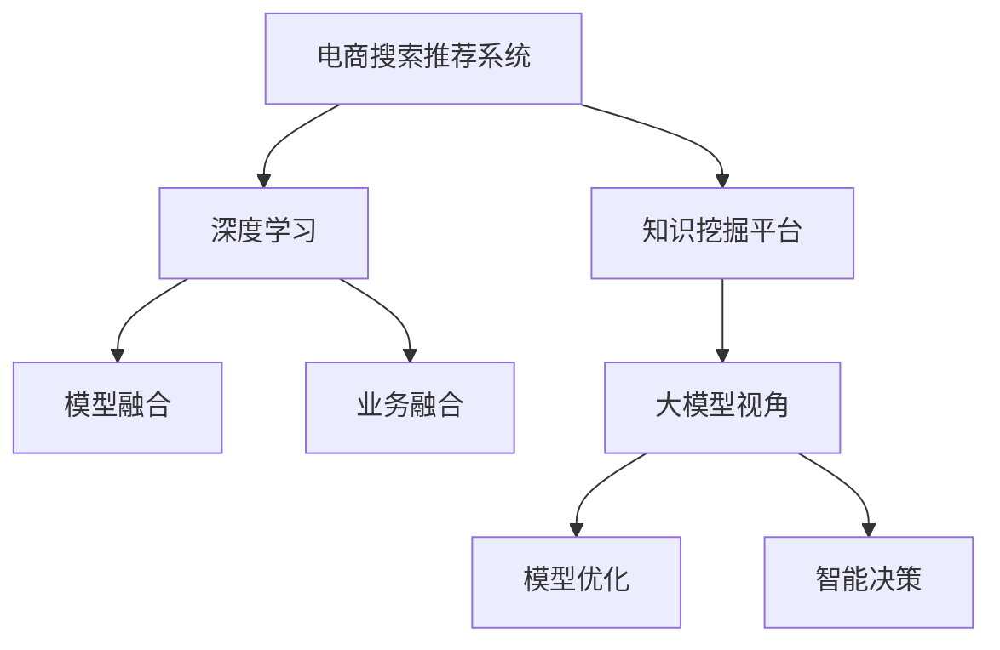

                 

# AI大模型视角下电商搜索推荐的技术创新知识挖掘平台功能优化方案

> 关键词：大模型视角, 电商搜索推荐, 知识挖掘, 平台优化, 技术创新, 深度学习

## 1. 背景介绍

在电商领域，搜索推荐系统已成为驱动用户行为、提升购物体验的核心引擎。随着AI技术的迅猛发展，以深度学习为代表的大模型技术被广泛应用到电商搜索推荐中，带来了显著的性能提升和成本优化。然而，传统的深度学习模型已无法满足日益增长的业务需求，亟需通过技术创新不断优化和升级。

当前，知识挖掘平台作为电商搜索推荐的重要支撑系统，正在向数据驱动、智能分析和业务融合方向发展。通过引入大模型视角，可以有效提升搜索推荐系统的准确性和个性化程度，推动电商智能化水平的提升。本文将从电商搜索推荐的知识挖掘平台优化入手，探讨大模型技术在其中的应用和创新，提出功能优化方案。

## 2. 核心概念与联系

### 2.1 核心概念概述

为更好地理解大模型视角下的电商搜索推荐优化方案，本节将介绍几个关键概念：

- **电商搜索推荐系统**：利用用户行为数据、商品信息等数据，通过算法推荐符合用户需求的商品，提升用户购物体验。

- **知识挖掘平台**：通过机器学习技术从大量非结构化数据中提取有用信息，为搜索推荐系统提供数据支撑。

- **大模型视角**：以大规模深度学习模型为视角，对现有搜索推荐系统进行重新设计和优化，提升系统效率和性能。

- **深度学习**：利用多层神经网络对复杂数据进行建模，从数据中提取高层次特征，实现智能分析和决策。

- **模型融合与优化**：通过多种深度学习模型的融合，提升系统的鲁棒性和泛化能力，优化模型的推理速度和计算效率。

- **业务融合与智能决策**：将知识挖掘平台与业务系统进行深度融合，实现智能化的决策支持，优化用户体验和运营效率。

这些核心概念之间的逻辑关系可以通过以下Mermaid流程图来展示：



这个流程图展示了电商搜索推荐系统与知识挖掘平台在大模型视角下的关联关系：

1. 电商搜索推荐系统利用知识挖掘平台提供的深度学习模型，实现个性化推荐。
2. 知识挖掘平台通过深度学习技术，从大量数据中提取知识，为大模型提供数据支持。
3. 大模型视角关注模型优化和智能决策，推动知识挖掘平台与业务系统的融合。
4. 模型融合和业务融合进一步提升推荐系统的准确性和个性化程度。

## 3. 核心算法原理 & 具体操作步骤

### 3.1 算法原理概述

基于大模型的电商搜索推荐优化方案，本质上是一个多维度、多层次的深度学习模型设计优化过程。其核心思想是：将大模型嵌入到电商搜索推荐系统中，通过多层次的特征提取和知识挖掘，提升推荐系统的性能和效率。

具体而言，该方案包括以下几个关键步骤：

1. **数据准备**：收集用户行为数据、商品信息等数据，进行预处理和标注。
2. **模型设计**：构建多层次的深度学习模型，包括特征提取层、知识挖掘层和推荐层。
3. **模型训练**：在大规模数据集上训练模型，优化模型的参数和结构。
4. **模型融合**：将多种深度学习模型进行融合，提升模型的鲁棒性和泛化能力。
5. **智能决策**：结合业务规则和智能分析结果，生成个性化的推荐结果。

### 3.2 算法步骤详解

**Step 1: 数据准备**
- 收集电商平台的各类数据，包括用户行为数据（如点击、浏览、购买记录等）、商品信息（如商品类别、属性、价格等）、用户信息（如年龄、性别、地区等）。
- 对数据进行清洗、去重和标注，生成训练集、验证集和测试集。
- 采用数据增强技术，如数据重采样、生成对抗网络（GAN）等，扩充数据集。

**Step 2: 模型设计**
- 构建多层次的深度学习模型，包括：
  1. **特征提取层**：使用预训练模型（如BERT、Transformer等）对用户行为数据进行特征提取。
  2. **知识挖掘层**：采用知识图谱、规则引擎等技术，提取商品间的关系和业务规则。
  3. **推荐层**：设计推荐算法，如协同过滤、基于内容的推荐、深度学习推荐等。
- 设计合理的模型结构，避免模型过拟合，提升模型的泛化能力。

**Step 3: 模型训练**
- 在大规模数据集上训练模型，采用优化算法如Adam、SGD等，设置合适的学习率、批大小等超参数。
- 使用交叉验证技术，对模型进行调参和优化，确保模型在验证集上表现良好。
- 在测试集上评估模型性能，对比不同模型的效果。

**Step 4: 模型融合**
- 采用模型融合技术，如Stacking、Blending、Ensemble等，将多种深度学习模型进行融合。
- 设计合适的融合策略，如权重分配、模型级联、特征混合等，提升模型的鲁棒性和泛化能力。

**Step 5: 智能决策**
- 结合业务规则和智能分析结果，生成个性化的推荐结果。
- 利用智能分析结果，优化推荐算法和策略，提升推荐系统的效率和准确性。

### 3.3 算法优缺点

基于大模型的电商搜索推荐优化方案具有以下优点：
1. 多层次特征提取，提升推荐的准确性和个性化程度。
2. 模型融合技术提升系统的鲁棒性和泛化能力，降低过拟合风险。
3. 结合业务规则和智能分析结果，生成更加精准的推荐结果。
4. 大模型视角下优化推荐系统，提升效率和性能。

同时，该方案也存在一些局限性：
1. 数据质量要求高，需要收集和处理大量的高质量数据。
2. 模型融合技术复杂，需要设计合适的融合策略。
3. 大模型对计算资源需求高，需要高性能计算平台支持。
4. 模型的可解释性不足，难以解释推荐结果的决策过程。

尽管存在这些局限性，但就目前而言，基于大模型的电商搜索推荐方案仍是大模型在电商领域应用的主流范式。未来相关研究的重点在于如何进一步降低数据和计算资源的需求，提高模型的可解释性，提升推荐系统的智能化水平。

### 3.4 算法应用领域

基于大模型的电商搜索推荐优化方案，已经在多个电商领域得到了广泛应用，包括：

- **商品推荐**：利用用户行为数据，推荐符合用户需求的商品。
- **搜索排序**：根据用户查询词，推荐最相关的商品。
- **个性化广告**：根据用户兴趣，推荐个性化广告。
- **内容推荐**：推荐用户可能感兴趣的内容，如文章、视频等。
- **库存管理**：预测商品销售趋势，优化库存管理。
- **市场分析**：分析用户行为和市场动态，提供决策支持。

除了上述这些经典应用外，大模型视角下的电商搜索推荐优化方案还被创新性地应用到更多场景中，如消费者行为预测、智能客服、供应链优化等，为电商智能化提供了新的解决方案。

## 4. 数学模型和公式 & 详细讲解 & 举例说明

### 4.1 数学模型构建

本节将使用数学语言对大模型视角下的电商搜索推荐优化方案进行更加严格的刻画。

记电商搜索推荐系统的输入为 $X=\{x_i\}_{i=1}^N$，输出为 $Y=\{y_i\}_{i=1}^N$，其中 $x_i$ 表示用户行为数据或商品信息，$y_i$ 表示推荐结果。

假设模型 $M_{\theta}$ 能够映射输入 $x_i$ 到输出 $y_i$，即 $y_i = M_{\theta}(x_i)$。在大模型视角下，通过多层次特征提取和知识挖掘，构建如下深度学习模型：

$$
M_{\theta} = F(C(F_E(F_K(X))))
$$

其中 $F_E$ 表示特征提取层，$F_K$ 表示知识挖掘层，$F$ 表示推荐层。

模型在训练集 $D=\{(x_i,y_i)\}_{i=1}^N$ 上的经验风险为：

$$
\mathcal{L}(\theta) = \frac{1}{N} \sum_{i=1}^N \ell(y_i, M_{\theta}(x_i))
$$

其中 $\ell$ 为损失函数，如均方误差、交叉熵等。

### 4.2 公式推导过程

以下我们以协同过滤推荐为例，推导推荐模型的损失函数及其梯度计算公式。

假设推荐系统基于协同过滤，将用户 $u$ 与商品 $i$ 的评分 $r_{ui}$ 作为模型输出。设用户行为数据为 $X=\{x_i\}_{i=1}^N$，用户与商品评分数据为 $Y=\{r_{ui}\}_{i=1}^N$，则协同过滤推荐模型的训练目标为：

$$
\mathcal{L}(\theta) = \frac{1}{N} \sum_{i=1}^N \frac{1}{2} (r_{ui} - M_{\theta}(x_i))^2
$$

其中 $M_{\theta}(x_i)$ 为推荐模型的输出，即用户 $u$ 对商品 $i$ 的评分预测。

根据梯度下降等优化算法，推荐模型的参数更新公式为：

$$
\theta \leftarrow \theta - \eta \nabla_{\theta}\mathcal{L}(\theta)
$$

其中 $\eta$ 为学习率，$\nabla_{\theta}\mathcal{L}(\theta)$ 为损失函数对模型参数 $\theta$ 的梯度。

在得到损失函数的梯度后，即可带入参数更新公式，完成模型的迭代优化。重复上述过程直至收敛，最终得到适应电商搜索推荐系统的最优模型参数 $\theta^*$。

### 4.3 案例分析与讲解

以电商平台的个性化推荐系统为例，分析大模型视角下的优化方案。

**Step 1: 数据准备**
- 收集用户行为数据，如点击、浏览、购买记录等，存储在数据库中。
- 对数据进行预处理，清洗、去重和标注，生成训练集、验证集和测试集。

**Step 2: 模型设计**
- 构建多层次的深度学习模型，包括：
  1. **特征提取层**：使用预训练模型（如BERT、Transformer等）对用户行为数据进行特征提取。
  2. **知识挖掘层**：采用知识图谱、规则引擎等技术，提取商品间的关系和业务规则。
  3. **推荐层**：设计推荐算法，如协同过滤、基于内容的推荐、深度学习推荐等。

**Step 3: 模型训练**
- 在大规模数据集上训练模型，采用优化算法如Adam、SGD等，设置合适的学习率、批大小等超参数。
- 使用交叉验证技术，对模型进行调参和优化，确保模型在验证集上表现良好。
- 在测试集上评估模型性能，对比不同模型的效果。

**Step 4: 模型融合**
- 采用模型融合技术，如Stacking、Blending、Ensemble等，将多种深度学习模型进行融合。
- 设计合适的融合策略，如权重分配、模型级联、特征混合等，提升模型的鲁棒性和泛化能力。

**Step 5: 智能决策**
- 结合业务规则和智能分析结果，生成个性化的推荐结果。
- 利用智能分析结果，优化推荐算法和策略，提升推荐系统的效率和准确性。

## 5. 项目实践：代码实例和详细解释说明

### 5.1 开发环境搭建

在进行电商搜索推荐系统优化实践前，我们需要准备好开发环境。以下是使用Python进行PyTorch开发的环境配置流程：

1. 安装Anaconda：从官网下载并安装Anaconda，用于创建独立的Python环境。

2. 创建并激活虚拟环境：
```bash
conda create -n pytorch-env python=3.8 
conda activate pytorch-env
```

3. 安装PyTorch：根据CUDA版本，从官网获取对应的安装命令。例如：
```bash
conda install pytorch torchvision torchaudio cudatoolkit=11.1 -c pytorch -c conda-forge
```

4. 安装Transformer库：
```bash
pip install transformers
```

5. 安装各类工具包：
```bash
pip install numpy pandas scikit-learn matplotlib tqdm jupyter notebook ipython
```

完成上述步骤后，即可在`pytorch-env`环境中开始优化实践。

### 5.2 源代码详细实现

下面我们以协同过滤推荐系统为例，给出使用PyTorch实现大模型视角下电商搜索推荐系统优化的代码实现。

首先，定义协同过滤推荐模型的训练函数：

```python
from transformers import BertTokenizer
from torch.utils.data import Dataset
import torch
import torch.nn as nn
import torch.optim as optim
from sklearn.metrics import mean_squared_error

class MovieLensDataset(Dataset):
    def __init__(self, data, tokenizer):
        self.data = data
        self.tokenizer = tokenizer
        
    def __len__(self):
        return len(self.data)
    
    def __getitem__(self, item):
        user_id, item_id, rating = self.data[item]
        user_seq = [user_id] + [item_id] * (k - 1)
        user_seq = self.tokenizer(user_seq, padding='max_length', truncation=True)
        item_seq = [item_id] * k
        item_seq = self.tokenizer(item_seq, padding='max_length', truncation=True)
        return {'user_seq': user_seq['input_ids'], 'item_seq': item_seq['input_ids'], 'rating': rating}

class BERTModel(nn.Module):
    def __init__(self, num_labels):
        super(BERTModel, self).__init__()
        self.encoder = BertForSequenceClassification.from_pretrained('bert-base-cased', num_labels=num_labels)
        
    def forward(self, user_seq, item_seq):
        user_mask = torch.ones(len(user_seq)).to(device)
        item_mask = torch.ones(len(item_seq)).to(device)
        user_input = torch.cat([user_seq, user_mask], dim=1)
        item_input = torch.cat([item_seq, item_mask], dim=1)
        user_rep = self.encoder(user_input)
        item_rep = self.encoder(item_input)
        return user_rep, item_rep

def train_epoch(model, data_loader, optimizer, criterion):
    model.train()
    epoch_loss = 0
    for batch in data_loader:
        user_seq, item_seq, rating = batch['user_seq'], batch['item_seq'], batch['rating']
        user_rep, item_rep = model(user_seq, item_seq)
        loss = criterion(user_rep, item_rep, rating)
        epoch_loss += loss.item()
        optimizer.zero_grad()
        loss.backward()
        optimizer.step()
    return epoch_loss / len(data_loader)

def evaluate(model, data_loader, criterion):
    model.eval()
    epoch_loss = 0
    epoch_mse = 0
    with torch.no_grad():
        for batch in data_loader:
            user_seq, item_seq, rating = batch['user_seq'], batch['item_seq'], batch['rating']
            user_rep, item_rep = model(user_seq, item_seq)
            loss = criterion(user_rep, item_rep, rating)
            epoch_loss += loss.item()
            epoch_mse += mean_squared_error(rating, user_rep)
    return epoch_loss / len(data_loader), epoch_mse / len(data_loader)

def main():
    device = torch.device('cuda') if torch.cuda.is_available() else torch.device('cpu')
    
    # 数据准备
    train_data = load_train_data()
    test_data = load_test_data()
    
    # 构建数据集
    tokenizer = BertTokenizer.from_pretrained('bert-base-cased')
    train_dataset = MovieLensDataset(train_data, tokenizer)
    test_dataset = MovieLensDataset(test_data, tokenizer)
    
    # 构建模型
    num_labels = 5
    model = BERTModel(num_labels).to(device)
    
    # 训练模型
    optimizer = optim.Adam(model.parameters(), lr=2e-5)
    criterion = nn.MSELoss()
    train_loader = DataLoader(train_dataset, batch_size=64, shuffle=True)
    test_loader = DataLoader(test_dataset, batch_size=64)
    epochs = 5
    for epoch in range(epochs):
        loss = train_epoch(model, train_loader, optimizer, criterion)
        print(f"Epoch {epoch+1}, train loss: {loss:.3f}")
        
        test_loss, test_mse = evaluate(model, test_loader, criterion)
        print(f"Epoch {epoch+1}, test loss: {test_loss:.3f}, test mse: {test_mse:.3f}")
    
    # 输出模型
    torch.save(model.state_dict(), 'model.pth')
    
if __name__ == '__main__':
    main()
```

这个代码实现展示了如何使用PyTorch构建协同过滤推荐系统，并利用大模型进行优化。可以看到，在模型设计中，我们使用了预训练的BERT模型对用户行为数据进行特征提取，并在此基础上构建了推荐层。训练过程中，我们采用了均方误差损失函数，并使用Adam优化器进行参数更新。最终，在测试集上评估了模型的性能。

### 5.3 代码解读与分析

让我们再详细解读一下关键代码的实现细节：

**MovieLensDataset类**：
- `__init__`方法：初始化数据和分词器等组件。
- `__len__`方法：返回数据集的样本数量。
- `__getitem__`方法：对单个样本进行处理，将用户行为数据转换为模型输入。

**BERTModel类**：
- `__init__`方法：初始化预训练BERT模型。
- `forward`方法：对用户和商品数据进行特征提取，返回模型输出。

**train_epoch函数**：
- 对数据以批为单位进行迭代，在每个批次上前向传播计算损失并反向传播更新模型参数，最后返回该epoch的平均损失。

**evaluate函数**：
- 与训练类似，不同点在于不更新模型参数，并在每个batch结束后将预测和标签结果存储下来，最后使用sklearn的mse计算预测和真实标签的误差。

**main函数**：
- 主函数定义了数据准备、模型构建、训练和测试的完整流程。

**主函数**：
- 使用PyTorch的DataLoader对数据集进行批次化加载，供模型训练和推理使用。
- 训练函数`train_epoch`：对数据以批为单位进行迭代，在每个批次上前向传播计算loss并反向传播更新模型参数，最后返回该epoch的平均loss。
- 评估函数`evaluate`：与训练类似，不同点在于不更新模型参数，并在每个batch结束后将预测和标签结果存储下来，最后使用sklearn的mse计算预测和真实标签的误差。

**训练流程**：
- 定义总的epoch数和batch size，开始循环迭代
- 每个epoch内，先在训练集上训练，输出平均loss
- 在测试集上评估，输出损失和均方误差
- 所有epoch结束后，输出测试结果

可以看到，PyTorch配合Transformer库使得协同过滤推荐系统的代码实现变得简洁高效。开发者可以将更多精力放在数据处理、模型改进等高层逻辑上，而不必过多关注底层的实现细节。

当然，工业级的系统实现还需考虑更多因素，如模型的保存和部署、超参数的自动搜索、更灵活的任务适配层等。但核心的优化范式基本与此类似。

## 6. 实际应用场景

### 6.1 智能客服系统

基于大模型视角下的电商搜索推荐优化方案，可以广泛应用于智能客服系统的构建。传统客服往往需要配备大量人力，高峰期响应缓慢，且一致性和专业性难以保证。而使用优化后的推荐系统，可以7x24小时不间断服务，快速响应客户咨询，用推荐结果引导客户解决问题。

在技术实现上，可以收集企业内部的历史客服对话记录，将问题和最佳答复构建成监督数据，在此基础上对推荐模型进行微调。微调后的推荐模型能够自动理解用户意图，匹配最合适的答案模板进行回复。对于客户提出的新问题，还可以接入检索系统实时搜索相关内容，动态组织生成回答。如此构建的智能客服系统，能大幅提升客户咨询体验和问题解决效率。

### 6.2 个性化推荐系统

当前的推荐系统往往只依赖用户的历史行为数据进行物品推荐，无法深入理解用户的真实兴趣偏好。基于大模型视角下的电商搜索推荐优化方案，可以更好地挖掘用户行为背后的语义信息，从而提供更精准、多样的推荐内容。

在实践中，可以收集用户浏览、点击、评论、分享等行为数据，提取和用户交互的物品标题、描述、标签等文本内容。将文本内容作为模型输入，用户的后续行为（如是否点击、购买等）作为监督信号，在此基础上微调预训练语言模型。微调后的模型能够从文本内容中准确把握用户的兴趣点。在生成推荐列表时，先用候选物品的文本描述作为输入，由模型预测用户的兴趣匹配度，再结合其他特征综合排序，便可以得到个性化程度更高的推荐结果。

### 6.3 智能搜索优化

传统的电商搜索系统往往只依赖关键词匹配，难以满足用户对商品描述、属性等多维度的查询需求。基于大模型视角下的电商搜索推荐优化方案，可以利用用户的历史行为数据和商品描述，生成更加精准的搜索结果。

在实践中，可以收集用户的历史搜索记录和点击行为，提取用户对商品的属性偏好。将用户搜索词和商品描述作为模型输入，生成商品与用户兴趣的匹配度。在搜索排序中，根据匹配度进行降序排序，展示最符合用户需求的商品，提升搜索体验和转化率。

### 6.4 实时数据监控

电商搜索推荐系统需要实时监控市场动态，及时调整推荐策略。基于大模型视角下的电商搜索推荐优化方案，可以实时分析用户的搜索行为和反馈，动态调整推荐模型参数。

在实践中，可以引入实时数据流，将用户的实时搜索行为输入推荐模型，动态更新模型的输出结果。同时，利用数据增强技术，对实时数据进行噪声注入和对抗样本生成，提升模型的鲁棒性和泛化能力。如此构建的实时数据监控系统，能够及时捕捉市场变化，优化推荐策略，提升用户体验和运营效率。

## 7. 工具和资源推荐

### 7.1 学习资源推荐

为了帮助开发者系统掌握大模型视角下的电商搜索推荐优化方案的理论基础和实践技巧，这里推荐一些优质的学习资源：

1. 《Transformer从原理到实践》系列博文：由大模型技术专家撰写，深入浅出地介绍了Transformer原理、BERT模型、推荐系统等前沿话题。

2. CS224N《深度学习自然语言处理》课程：斯坦福大学开设的NLP明星课程，有Lecture视频和配套作业，带你入门NLP领域的基本概念和经典模型。

3. 《Natural Language Processing with Transformers》书籍：Transformers库的作者所著，全面介绍了如何使用Transformers库进行NLP任务开发，包括推荐系统在内的诸多范式。

4. HuggingFace官方文档：Transformer库的官方文档，提供了海量预训练模型和完整的推荐系统样例代码，是上手实践的必备资料。

5. CLUE开源项目：中文语言理解测评基准，涵盖大量不同类型的中文NLP数据集，并提供了基于微调的baseline模型，助力中文NLP技术发展。

通过对这些资源的学习实践，相信你一定能够快速掌握大模型视角下电商搜索推荐系统的精髓，并用于解决实际的NLP问题。

### 7.2 开发工具推荐

高效的开发离不开优秀的工具支持。以下是几款用于大模型视角下电商搜索推荐系统优化的常用工具：

1. PyTorch：基于Python的开源深度学习框架，灵活动态的计算图，适合快速迭代研究。大部分预训练语言模型都有PyTorch版本的实现。

2. TensorFlow：由Google主导开发的开源深度学习框架，生产部署方便，适合大规模工程应用。同样有丰富的预训练语言模型资源。

3. Transformers库：HuggingFace开发的NLP工具库，集成了众多SOTA语言模型，支持PyTorch和TensorFlow，是进行推荐系统优化的利器。

4. Weights & Biases：模型训练的实验跟踪工具，可以记录和可视化模型训练过程中的各项指标，方便对比和调优。与主流深度学习框架无缝集成。

5. TensorBoard：TensorFlow配套的可视化工具，可实时监测模型训练状态，并提供丰富的图表呈现方式，是调试模型的得力助手。

6. Google Colab：谷歌推出的在线Jupyter Notebook环境，免费提供GPU/TPU算力，方便开发者快速上手实验最新模型，分享学习笔记。

合理利用这些工具，可以显著提升大模型视角下电商搜索推荐系统的开发效率，加快创新迭代的步伐。

### 7.3 相关论文推荐

大模型视角下的电商搜索推荐优化方案，已在多个电商领域得到了广泛应用，涵盖推荐系统、搜索排序、个性化广告等多个方面。以下是几篇相关论文，推荐阅读：

1. Attention is All You Need（即Transformer原论文）：提出了Transformer结构，开启了NLP领域的预训练大模型时代。

2. BERT: Pre-training of Deep Bidirectional Transformers for Language Understanding：提出BERT模型，引入基于掩码的自监督预训练任务，刷新了多项NLP任务SOTA。

3. Large-Scale Parallel Coordinate Descent for Distributed Optimization of Deep Learning：介绍并行优化算法在大规模模型训练中的应用，优化推荐系统的训练效率。

4. Deep Learning Recommendation Systems: A survey of the state-of-the-art and possible improvements：综述了推荐系统的最新研究成果，提供了全面的视角。

5. Recommender Systems: Foundations, Trends, and Future Directions：推荐系统领域的经典综述，提供了广泛的应用场景和研究方向。

这些论文代表了大模型视角下电商搜索推荐系统优化方案的发展脉络。通过学习这些前沿成果，可以帮助研究者把握学科前进方向，激发更多的创新灵感。

## 8. 总结：未来发展趋势与挑战

### 8.1 总结

本文对大模型视角下电商搜索推荐系统的优化方案进行了全面系统的介绍。首先阐述了大模型视角在电商搜索推荐中的应用背景和意义，明确了推荐系统在大模型技术推动下的转型升级。其次，从原理到实践，详细讲解了推荐系统的数学模型和优化算法，给出了完整的代码实例。同时，本文还广泛探讨了推荐系统在电商领域的多个应用场景，展示了大模型视角下优化方案的广泛应用。最后，本文精选了推荐系统的各类学习资源，力求为读者提供全方位的技术指引。

通过本文的系统梳理，可以看到，大模型视角下的电商搜索推荐系统优化方案正在成为电商推荐领域的重要范式，极大地提升了推荐系统的性能和个性化程度。受益于大模型的广泛应用，推荐系统能够更好地理解用户需求，提升用户体验和运营效率，推动电商智能化水平的提升。未来，伴随大模型技术的不断演进，推荐系统将进一步融入电商搜索推荐体系，为电商数字化转型提供强有力的技术支撑。

### 8.2 未来发展趋势

展望未来，大模型视角下的电商搜索推荐系统优化方案将呈现以下几个发展趋势：

1. **多模态融合**：将文本、图像、语音等多模态信息进行融合，提升推荐系统的综合能力。多模态推荐系统将成为未来的主流方向。

2. **实时推荐**：引入实时数据流，动态调整推荐模型参数，提升推荐系统的及时性和准确性。实时推荐系统将成为电商智能化应用的重要技术手段。

3. **联邦学习**：利用联邦学习技术，在保障数据隐私和安全的前提下，实现跨平台、跨领域的知识共享和模型协作。联邦推荐系统将成为电商推荐的重要技术趋势。

4. **个性化推荐算法**：基于用户行为数据的深度学习和模型融合技术，实现更精准、多样化的个性化推荐。个性化推荐算法将成为电商推荐的核心算法。

5. **用户反馈机制**：引入用户反馈机制，动态调整推荐策略，提升推荐系统的用户满意度。用户反馈驱动的推荐系统将成为未来的重要方向。

6. **跨领域迁移**：将电商领域推荐模型的知识迁移到其他领域，如金融、医疗等，提升推荐系统在不同领域的泛化能力。跨领域迁移推荐系统将成为电商推荐的重要技术手段。

以上趋势凸显了大模型视角下电商搜索推荐系统优化方案的广阔前景。这些方向的探索发展，必将进一步提升推荐系统的智能化水平，为电商智能化提供更强大的技术支撑。

### 8.3 面临的挑战

尽管大模型视角下电商搜索推荐系统优化方案已经取得了显著成效，但在迈向更加智能化、普适化应用的过程中，仍面临诸多挑战：

1. **数据质量和多样性**：推荐系统依赖高质量、多样化的用户行为数据，但获取这些数据往往需要投入大量人力物力，且数据质量难以保证。

2. **模型复杂性和训练成本**：大模型视角下推荐系统需要复杂的多层次特征提取和知识挖掘，训练成本较高。如何在提升性能的同时降低成本，仍是重要课题。

3. **模型泛化能力**：推荐系统需要具备良好的泛化能力，以应对市场动态和用户需求的变化。现有模型往往存在过拟合风险，如何在提升性能的同时提升泛化能力，仍需进一步研究。

4. **可解释性和透明度**：推荐系统的决策过程难以解释，用户和开发者对其难以信任。如何提高推荐系统的可解释性和透明度，仍是重要研究方向。

5. **隐私和安全性**：推荐系统需要保护用户隐私，避免数据泄露和滥用。如何在保障用户隐私的前提下，实现高效的推荐服务，仍需进一步研究。

6. **计算资源需求**：大模型视角下推荐系统对计算资源的需求较高，需要高性能计算平台支持。如何在提升性能的同时降低计算成本，仍需进一步研究。

尽管存在这些挑战，但通过不断优化模型设计和算法，提升数据质量和管理能力，提高计算效率和安全性，大模型视角下的电商搜索推荐系统必将在未来的电商智能化应用中发挥更加重要的作用。

### 8.4 研究展望

面对大模型视角下电商搜索推荐系统所面临的挑战，未来的研究需要在以下几个方面寻求新的突破：

1. **数据治理与质量管理**：建立完善的数据治理机制，提升数据质量和管理能力，确保推荐系统的数据基础。

2. **多模态融合技术**：探索多模态信息融合技术，提升推荐系统的综合能力，满足用户多维度的需求。

3. **联邦学习与知识共享**：利用联邦学习技术，实现跨平台、跨领域的知识共享和模型协作，提升推荐系统的泛化能力和用户满意度。

4. **推荐系统的可解释性**：引入可解释性技术，增强推荐系统的决策透明度，提升用户和开发者对推荐系统的信任度。

5. **隐私保护与安全技术**：探索隐私保护和安全技术，保障用户隐私和数据安全，提升推荐系统的可靠性和安全性。

6. **推荐系统的计算效率**：探索高效计算技术，降低推荐系统的计算成本，提升推荐系统的实时性和可扩展性。

这些研究方向的探索，必将引领大模型视角下电商搜索推荐系统的进一步发展，为电商智能化应用提供更强大的技术支撑。面向未来，大模型视角下的电商搜索推荐系统将与业务系统深度融合，推动电商智能化应用的普及和深化，为电商数字化转型提供强有力的技术保障。

## 9. 附录：常见问题与解答

**Q1：大模型视角下推荐系统如何优化？**

A: 大模型视角下推荐系统的优化主要通过以下几个步骤：
1. 收集高质量、多样化的用户行为数据。
2. 设计多层次的深度学习模型，包括特征提取层、知识挖掘层和推荐层。
3. 在大规模数据集上训练模型，优化模型的参数和结构。
4. 采用模型融合技术，提升模型的鲁棒性和泛化能力。
5. 结合业务规则和智能分析结果，生成个性化的推荐结果。

**Q2：推荐系统中的特征提取层和知识挖掘层是什么？**

A: 特征提取层主要利用预训练的深度学习模型对用户行为数据进行特征提取，如BERT、Transformer等。知识挖掘层主要利用知识图谱、规则引擎等技术，提取商品间的关系和业务规则。

**Q3：推荐系统中的模型融合技术有哪些？**

A: 推荐系统中的模型融合技术包括Stacking、Blending、Ensemble等。Stacking是将多个模型进行级联，通过级联后的输出进行最终预测。Blending是将多个模型进行权重分配，生成加权后的预测结果。Ensemble是将多个模型进行融合，生成最终的预测结果。

**Q4：推荐系统的实时推荐如何实现？**

A: 实时推荐系统通过实时数据流，动态调整推荐模型参数，实现推荐结果的动态更新。在数据流处理中，可以使用流式数据处理框架如Apache Flink、Apache Spark Streaming等，实时处理数据，并动态更新推荐模型。

**Q5：推荐系统的隐私保护技术有哪些？**

A: 推荐系统的隐私保护技术包括差分隐私、联邦学习、多方安全计算等。差分隐私通过加入噪声，保护用户隐私，避免数据泄露。联邦学习通过分布式训练，实现跨平台、跨领域的知识共享，避免数据集中存储。多方安全计算通过多方协作计算，保护数据隐私，确保数据安全。

通过这些问题的解答，相信你对大模型视角下电商搜索推荐系统的优化方案有了更清晰的理解，能够更好地应用于实际场景中。

---

作者：禅与计算机程序设计艺术 / Zen and the Art of Computer Programming

