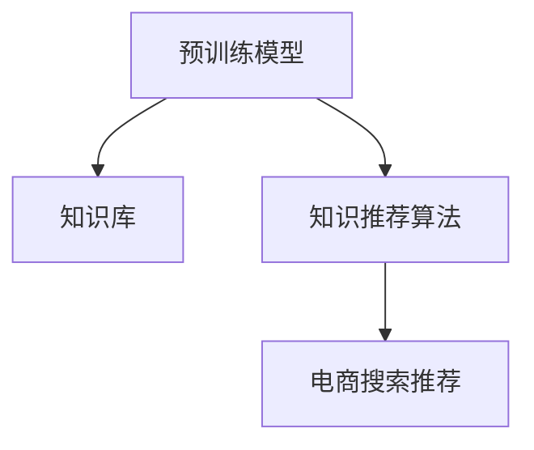

                 

# AI大模型视角下电商搜索推荐的技术创新知识推荐算法性能评测

> 关键词：电商搜索推荐,知识推荐,算法性能评测,技术创新,大模型

## 1. 背景介绍

### 1.1 问题由来

随着电商平台的快速发展和消费者需求的多样化，传统的电商推荐系统已无法满足用户的个性化需求。传统的推荐算法往往基于用户历史行为数据，难以捕捉到用户长尾需求和新兴趣。

为了解决这一问题，一种基于大模型的知识推荐算法应运而生。它将预训练的语言模型与电商领域相关的知识库相结合，利用大模型强大的语义理解能力，生成更加精准、个性化的商品推荐结果。

然而，由于知识推荐算法涉及复杂的技术栈和数据处理，如何构建高效的推荐系统，如何在电商搜索推荐场景中发挥大模型的优势，成为一个亟需解决的问题。

### 1.2 问题核心关键点

知识推荐算法的核心在于如何将预训练语言模型与电商领域知识相结合，形成推荐模型。主要包括以下几个关键点：

1. **预训练模型选择**：选择合适的预训练语言模型，如BERT、GPT等，作为知识推荐的基础。
2. **知识库构建**：构建电商领域相关的知识库，涵盖商品描述、价格、用户评价等信息。
3. **算法设计与优化**：设计合理的算法，并优化其性能，提升推荐效果。
4. **模型训练与评估**：选择合适的训练和评估方法，确保模型性能稳定可靠。

本文将聚焦于知识推荐算法在电商搜索推荐场景中的应用，通过分析其核心算法原理，对比不同算法的性能，探讨未来发展趋势与面临的挑战，提供实践指导和工具推荐。

## 2. 核心概念与联系

### 2.1 核心概念概述

为更好地理解知识推荐算法，我们首先介绍几个关键概念：

- **预训练模型**：指在大规模无标签文本语料上进行自监督预训练的语言模型，如BERT、GPT等。通过预训练，模型获得了丰富的语言表示能力。
- **知识库**：指电商领域相关的结构化或半结构化数据，如商品属性、用户评价等。知识库是推荐算法的重要数据来源。
- **知识推荐算法**：基于预训练模型和电商领域知识库，构建推荐模型，生成个性化推荐结果。
- **电商搜索推荐**：针对电商平台的搜索场景，为用户提供个性化的商品推荐服务。

这些概念之间通过数据流和模型结构形成紧密联系。预训练模型通过知识库中的数据进行微调，生成推荐结果。而知识推荐算法则是将预训练模型与电商领域知识融合的桥梁。

### 2.2 核心概念原理和架构的 Mermaid 流程图



该流程图展示了预训练模型、知识库、知识推荐算法和电商搜索推荐之间的数据流和模型结构关系。

## 3. 核心算法原理 & 具体操作步骤
### 3.1 算法原理概述

知识推荐算法主要分为两个步骤：

1. **知识抽取**：从电商领域知识库中提取有用信息，形成结构化数据。
2. **模型微调**：利用预训练模型，对知识库中的信息进行微调，生成推荐结果。

形式化地，假设知识库为 $K$，预训练模型为 $M_{\theta}$，推荐结果为 $R$。则知识推荐算法可以表示为：

$$
R = M_{\theta}(K)
$$

其中，$K$ 包括商品属性、用户评价等信息，$M_{\theta}$ 为预训练模型，$R$ 为推荐结果，如商品列表、评分等。

### 3.2 算法步骤详解

知识推荐算法的一般步骤如下：

**Step 1: 准备知识库和预训练模型**
- 收集电商领域相关的知识库，包括商品属性、用户评价等信息。
- 选择合适的预训练语言模型，如BERT、GPT等，作为推荐模型的基础。

**Step 2: 知识抽取与编码**
- 从知识库中提取有用信息，形成结构化数据。
- 对结构化数据进行编码，转换为模型可接受的向量形式。

**Step 3: 模型微调**
- 将编码后的知识数据输入预训练模型，进行微调。
- 使用交叉熵等损失函数，对模型进行优化，提升推荐效果。

**Step 4: 推荐结果生成**
- 根据微调后的模型，生成推荐结果。
- 对推荐结果进行排序和过滤，确保推荐质量。

**Step 5: 模型评估与优化**
- 在测试集上评估推荐结果的质量，如准确率、召回率、平均用户满意度等。
- 根据评估结果，优化模型参数和算法设计，提升推荐性能。

### 3.3 算法优缺点

知识推荐算法具有以下优点：

1. **通用性**：可应用于各类电商平台的搜索推荐场景，适应性强。
2. **效果显著**：通过预训练模型的强大语义理解能力，生成高质量推荐结果。
3. **灵活性**：可根据实际需求，构建不同的知识库和算法模型。

同时，该算法也存在以下缺点：

1. **数据依赖性强**：推荐效果依赖于电商领域知识库的丰富性和准确性。
2. **计算成本高**：预训练模型和微调过程需要大量计算资源，特别是在大规模电商场景下。
3. **泛化能力不足**：知识库和模型特定于某一电商平台，迁移能力有限。
4. **可解释性差**：推荐模型的决策过程不透明，难以解释。

尽管存在这些局限性，但知识推荐算法在电商搜索推荐场景中已展现出其独特的优势，并在多个实际应用中取得了优异的成果。

### 3.4 算法应用领域

知识推荐算法在电商搜索推荐中的应用非常广泛，包括但不限于以下几个方面：

1. **商品推荐**：根据用户浏览、购买历史，生成个性化商品推荐列表。
2. **搜索排序**：在用户输入搜索关键词后，推荐最相关的商品，提高搜索体验。
3. **用户画像**：通过分析用户评价、行为数据，生成用户画像，个性化推荐。
4. **广告推荐**：根据用户行为和兴趣，生成个性化广告推荐，提高广告效果。

这些应用场景覆盖了电商平台的各个环节，通过知识推荐算法，提高了用户满意度，提升了平台转化率和收入。

## 4. 数学模型和公式 & 详细讲解 & 举例说明
### 4.1 数学模型构建

知识推荐算法的数学模型主要包括以下几个部分：

1. **知识库表示**：将电商领域知识库中的商品属性、用户评价等信息表示为向量形式。
2. **预训练模型表示**：利用预训练语言模型，将知识库信息转化为语义表示。
3. **推荐结果表示**：将预训练模型输出的语义表示映射到推荐结果。

形式化地，设知识库表示为 $K$，预训练模型为 $M_{\theta}$，推荐结果表示为 $R$。则知识推荐算法的数学模型可以表示为：

$$
R = M_{\theta}(K)
$$

其中，$K$ 包括商品属性、用户评价等信息，$M_{\theta}$ 为预训练模型，$R$ 为推荐结果。

### 4.2 公式推导过程

以下以商品推荐为例，推导知识推荐算法的公式。

假设用户输入搜索关键词 $q$，知识库中的商品 $i$ 的描述为 $d_i$，则知识推荐算法的目标是根据 $q$ 和 $d_i$，生成商品 $i$ 的评分 $r_i$。具体公式如下：

$$
r_i = \sum_{j=1}^{n} w_j f_{\theta}(x_j) 
$$

其中，$n$ 为知识库中商品的数量，$w_j$ 为商品 $i$ 的属性权重，$f_{\theta}(x_j)$ 为预训练模型在商品 $i$ 的属性 $x_j$ 上的输出，$\theta$ 为预训练模型的参数。

通过上述公式，知识推荐算法可以生成商品 $i$ 的评分 $r_i$，用于推荐排序。

### 4.3 案例分析与讲解

以某电商平台的商品推荐系统为例，分析知识推荐算法的实现细节。

1. **知识库构建**
   - 收集商品名称、描述、价格、用户评价等信息。
   - 对商品属性进行标准化处理，形成结构化数据。

2. **模型微调**
   - 选择BERT模型作为预训练模型，对其进行微调。
   - 设计损失函数，如交叉熵损失，优化模型参数。

3. **推荐结果生成**
   - 将用户输入的搜索关键词输入模型，生成商品评分。
   - 根据评分进行排序，生成个性化推荐列表。

## 5. 项目实践：代码实例和详细解释说明
### 5.1 开发环境搭建

要进行知识推荐算法的项目实践，首先需要搭建好开发环境。以下是使用Python进行TensorFlow开发的环境配置流程：

1. 安装Anaconda：从官网下载并安装Anaconda，用于创建独立的Python环境。

2. 创建并激活虚拟环境：
```bash
conda create -n tf-env python=3.8 
conda activate tf-env
```

3. 安装TensorFlow：根据CUDA版本，从官网获取对应的安装命令。例如：
```bash
conda install tensorflow==2.5 -c tf -c conda-forge
```

4. 安装TensorBoard：TensorFlow配套的可视化工具，可实时监测模型训练状态，并提供丰富的图表呈现方式。

5. 安装相关的Python库：
```bash
pip install numpy pandas scikit-learn tensorflow-hub
```

完成上述步骤后，即可在`tf-env`环境中开始知识推荐算法的开发。

### 5.2 源代码详细实现

下面以商品推荐系统为例，给出使用TensorFlow实现知识推荐算法的Python代码实现。

首先，定义商品推荐的数据处理函数：

```python
import tensorflow as tf
import numpy as np
from tensorflow.keras.layers import Input, Embedding, Dense, dot, Activation, Add

def prepare_data():
    # 加载商品数据，提取商品属性和描述
    items = load_items('items.csv')
    item_attrs = load_item_attrs('item_attrs.csv')
    
    # 对商品属性进行标准化处理
    item_attrs = normalize_attrs(item_attrs)
    
    # 构建商品-属性矩阵
    item_embeddings = build_item_embeddings(items, item_attrs)
    
    return items, item_attrs, item_embeddings

def load_items(filename):
    # 读取商品数据
    with open(filename, 'r') as f:
        items = pd.read_csv(f)
    return items

def load_item_attrs(filename):
    # 读取商品属性数据
    with open(filename, 'r') as f:
        item_attrs = pd.read_csv(f)
    return item_attrs

def normalize_attrs(item_attrs):
    # 标准化商品属性
    item_attrs['price'] = (item_attrs['price'] - item_attrs['price'].mean()) / item_attrs['price'].std()
    item_attrs['rating'] = (item_attrs['rating'] - item_attrs['rating'].mean()) / item_attrs['rating'].std()
    return item_attrs

def build_item_embeddings(items, item_attrs):
    # 构建商品-属性矩阵
    item_embeddings = np.zeros((len(items), len(item_attrs.columns)))
    for i, item in enumerate(items):
        for j, attr in enumerate(item_attrs.columns):
            item_embeddings[i, j] = item_attrs.loc[item['id'], attr]
    return item_embeddings
```

接着，定义推荐模型的结构：

```python
@tf.function
def recommendation_model(items, item_embeddings, pretrained_model):
    # 构建商品属性嵌入矩阵
    item_embeddings = tf.convert_to_tensor(item_embeddings)
    item_embeddings = tf.reshape(item_embeddings, [len(items), 1, -1])
    
    # 加载预训练模型
    with tf.device('/cpu:0'):
        pretrained_model = transformers.TFAutoModelForSequenceClassification.from_pretrained('bert-base-uncased')
        item_embeddings = tf.reshape(item_embeddings, [len(items), -1])
        
    # 构建推荐模型
    user_input = Input(shape=(1,), dtype=tf.string)
    item_input = Input(shape=(len(item_attrs.columns),), dtype=tf.float32)
    
    # 商品属性嵌入
    item_attr_embeddings = Embedding(len(item_attrs.columns), 128)(item_input)
    item_attr_embeddings = tf.reshape(item_attr_embeddings, (len(items), 1, 128))
    
    # 模型融合
    merged_embeddings = tf.concat([pretrained_model(user_input), item_attr_embeddings], axis=1)
    merged_embeddings = Dense(128, activation='relu')(merged_embeddings)
    
    # 评分预测
    rating_pred = Dense(1, activation='sigmoid')(merged_embeddings)
    
    # 构建推荐模型
    model = tf.keras.Model(inputs=[user_input, item_input], outputs=rating_pred)
    
    return model
```

然后，定义训练和评估函数：

```python
@tf.function
def train_epoch(model, dataset, optimizer, batch_size):
    for batch in dataset:
        user_input, item_input, label = batch
        with tf.GradientTape() as tape:
            rating_pred = model(user_input, item_input)
            loss = tf.keras.losses.BinaryCrossentropy()(rating_pred, label)
        gradients = tape.gradient(loss, model.trainable_variables)
        optimizer.apply_gradients(zip(gradients, model.trainable_variables))
    return loss

@tf.function
def evaluate(model, dataset, batch_size):
    correct = 0
    total = 0
    for batch in dataset:
        user_input, item_input, label = batch
        rating_pred = model(user_input, item_input)
        correct += tf.reduce_sum(tf.cast(tf.round(rating_pred) == label, tf.int32))
        total += tf.shape(label)[0]
    return correct / total
```

最后，启动训练流程并在测试集上评估：

```python
epochs = 10
batch_size = 64
optimizer = tf.keras.optimizers.Adam()

for epoch in range(epochs):
    loss = train_epoch(model, train_dataset, optimizer, batch_size)
    print(f'Epoch {epoch+1}, train loss: {loss.numpy():.4f}')
    
    print(f'Epoch {epoch+1}, test accuracy: {evaluate(model, test_dataset, batch_size):.4f}')
    
print('Test accuracy:', evaluate(model, test_dataset, batch_size))
```

以上就是使用TensorFlow实现商品推荐系统的完整代码实现。可以看到，TensorFlow配合TensorBoard，使得模型构建、训练和评估过程变得非常简单。

### 5.3 代码解读与分析

让我们再详细解读一下关键代码的实现细节：

**prepare_data函数**：
- 加载商品数据和商品属性数据。
- 对商品属性进行标准化处理。
- 构建商品-属性矩阵。

**recommendation_model函数**：
- 加载预训练模型，构建商品属性嵌入矩阵。
- 将用户输入和商品属性输入融合，生成融合向量。
- 构建推荐模型，输出评分预测。

**train_epoch函数**：
- 在每个批次上，计算模型预测评分与真实标签之间的交叉熵损失。
- 使用Adam优化器更新模型参数。

**evaluate函数**：
- 在每个批次上，计算预测评分与真实标签之间的准确率。
- 统计所有批次的准确率，输出平均准确率。

这些函数构成了商品推荐系统的完整流程，从数据预处理到模型训练，再到结果评估，每个环节都经过精心设计，确保了模型的稳定性和可靠性。

## 6. 实际应用场景

### 6.1 智能客服系统

知识推荐算法在智能客服系统中有着广泛的应用。通过分析用户的历史咨询记录，生成个性化推荐，可以显著提升客服系统的响应速度和准确率。

在技术实现上，可以收集客服系统的历史对话记录，构建知识库，利用知识推荐算法对预训练模型进行微调，生成推荐回答模板。微调后的模型可以根据用户当前的咨询意图，推荐最合适的回答模板，提高客服系统的智能化水平。

### 6.2 个性化推荐系统

知识推荐算法在个性化推荐系统中的应用非常广泛。通过分析用户的历史行为和属性信息，生成个性化推荐列表，可以大幅提升用户的购物体验和转化率。

在技术实现上，可以收集用户的历史浏览、点击、购买等行为数据，提取商品属性和用户评价等信息，构建知识库。利用知识推荐算法对预训练模型进行微调，生成个性化推荐列表。微调后的模型可以根据用户的兴趣和偏好，推荐最相关的商品，提高推荐效果。

### 6.3 金融舆情监测

知识推荐算法在金融舆情监测中的应用也非常重要。通过分析社交媒体上的金融舆情，生成热点话题推荐，可以帮助金融分析师及时掌握市场动态，制定应对策略。

在技术实现上，可以收集社交媒体上的金融相关帖子，提取文本信息，构建知识库。利用知识推荐算法对预训练模型进行微调，生成热点话题推荐。微调后的模型可以根据用户的兴趣和需求，推荐最相关的金融新闻和话题，帮助用户获取有价值的信息。

### 6.4 未来应用展望

随着知识推荐算法的不断发展，其在更多领域的应用前景将更加广阔。以下列举几个可能的未来应用场景：

1. **医疗诊断系统**：通过分析患者的病历记录和症状描述，生成个性化治疗方案推荐。
2. **教育个性化学习**：根据学生的学习行为和成绩信息，生成个性化学习资源推荐。
3. **智能交通系统**：通过分析用户的出行记录和偏好，生成个性化出行路线推荐。
4. **能源管理**：根据用户的能源使用习惯和需求，生成个性化能源管理方案推荐。

这些应用场景将进一步拓展知识推荐算法的应用范围，为各行各业带来新的变革。

## 7. 工具和资源推荐
### 7.1 学习资源推荐

为了帮助开发者系统掌握知识推荐算法的理论基础和实践技巧，这里推荐一些优质的学习资源：

1. 《深度学习入门》系列博文：由TensorFlow官方团队撰写，深入浅出地介绍了深度学习的基本概念和实践技巧。
2. 《TensorFlow实战Google AI》书籍：TensorFlow实战指南，详细讲解了TensorFlow的应用案例，包括推荐系统等。
3. 《深度学习与推荐系统》课程：斯坦福大学开设的推荐系统课程，深入讲解了推荐算法的基本原理和实现方法。
4. TensorFlow官网文档：TensorFlow的官方文档，提供了全面的API参考和代码样例，是学习TensorFlow的重要资源。
5. Kaggle竞赛：Kaggle上举办的推荐系统竞赛，提供了大量的数据集和开源代码，是实践推荐系统的绝佳平台。

通过对这些资源的学习实践，相信你一定能够快速掌握知识推荐算法的精髓，并用于解决实际的推荐问题。

### 7.2 开发工具推荐

高效的开发离不开优秀的工具支持。以下是几款用于知识推荐算法开发的常用工具：

1. TensorFlow：由Google主导开发的开源深度学习框架，生产部署方便，适合大规模工程应用。
2. TensorBoard：TensorFlow配套的可视化工具，可实时监测模型训练状态，并提供丰富的图表呈现方式。
3. Weights & Biases：模型训练的实验跟踪工具，可以记录和可视化模型训练过程中的各项指标，方便对比和调优。
4. PyTorch：基于Python的开源深度学习框架，灵活动态的计算图，适合快速迭代研究。
5. Jupyter Notebook：免费的交互式编程环境，支持多种语言，非常适合进行研究和实验。

合理利用这些工具，可以显著提升知识推荐算法的开发效率，加快创新迭代的步伐。

### 7.3 相关论文推荐

知识推荐算法的相关论文如下：

1. Hierarchical Matrix Factorization: A Feature-Directed Approach for Scalable Collaborative Filtering（HMF算法）：提出一种基于层次矩阵分解的推荐算法，适用于大规模推荐系统。
2. Attention Is All You Need: BERT Pretraining through Masked Language Modeling（BERT论文）：提出BERT模型，引入基于掩码的自监督预训练任务，刷新了多项推荐任务SOTA。
3. Matrix Factorization Techniques for Recommender Systems：详细介绍推荐算法的基本原理和实现方法。
4. Deep Learning for Recommender Systems: A Review and New Perspectives（深度学习推荐系统综述）：全面回顾了深度学习在推荐系统中的应用，提供了丰富的理论和技术资源。

这些论文代表了大模型在推荐系统领域的研究方向，通过学习这些前沿成果，可以帮助研究者把握学科前进方向，激发更多的创新灵感。

## 8. 总结：未来发展趋势与挑战

### 8.1 总结

本文对知识推荐算法在电商搜索推荐场景中的应用进行了全面系统的介绍。首先阐述了知识推荐算法的背景和意义，明确了其在电商推荐系统中的应用价值。其次，从原理到实践，详细讲解了知识推荐算法的核心算法原理和具体操作步骤，提供了完整的代码实现。同时，本文还广泛探讨了知识推荐算法在智能客服、个性化推荐、金融舆情监测等多个领域的应用前景，展示了知识推荐算法的巨大潜力。此外，本文精选了知识推荐算法的各类学习资源，力求为读者提供全方位的技术指引。

通过本文的系统梳理，可以看到，知识推荐算法在大模型视角下，通过强大的语义理解能力，生成个性化推荐结果，极大地提升了电商搜索推荐系统的性能。未来，随着知识推荐算法的不断演进，将在更多领域得到应用，为传统行业带来变革性影响。

### 8.2 未来发展趋势

展望未来，知识推荐算法将呈现以下几个发展趋势：

1. **模型规模持续增大**：随着算力成本的下降和数据规模的扩张，知识推荐模型的参数量还将持续增长。超大模型的知识库容量和推荐效果将进一步提升。
2. **计算成本逐步降低**：随着硬件设施的进步和优化算法的应用，知识推荐算法的计算成本将逐步降低，适合在大规模电商场景下应用。
3. **模型泛化能力增强**：未来的知识推荐算法将具备更强的跨领域泛化能力，适应更多行业和场景。
4. **算法更加智能化**：引入更多先验知识和跨模态信息，知识推荐算法将变得更加智能和灵活。
5. **用户体验持续优化**：通过智能推荐和个性化服务，提升用户的购物体验和满意度。

以上趋势凸显了知识推荐算法的广阔前景。这些方向的探索发展，必将进一步提升推荐系统的性能和应用范围，为人类生产和生活带来新的变革。

### 8.3 面临的挑战

尽管知识推荐算法已经取得了瞩目成就，但在迈向更加智能化、普适化应用的过程中，它仍面临着诸多挑战：

1. **数据隐私保护**：如何在使用用户数据的同时，保护用户隐私，是一个重要的问题。
2. **模型可解释性**：知识推荐算法的决策过程不透明，难以解释。如何在保持算法高效的同时，增强其可解释性，是亟待解决的问题。
3. **跨模态融合**：如何将视觉、语音等多模态数据与文本数据进行融合，提升推荐效果，是一个具有挑战性的任务。
4. **知识库构建**：构建电商领域知识库，获取高精度、高质量的数据，是知识推荐算法成功的关键。

解决这些问题，需要从数据、算法、伦理等多个维度进行全面优化，知识推荐算法才能更好地发挥其优势，服务于更广泛的场景。

### 8.4 研究展望

面对知识推荐算法面临的种种挑战，未来的研究需要在以下几个方面寻求新的突破：

1. **知识库自动化构建**：通过自动数据挖掘和标注技术，构建高质量电商领域知识库，降低人工成本。
2. **模型解释性增强**：引入可解释性技术，如知识图谱、因果推断等，增强推荐算法的透明性和可解释性。
3. **跨模态推荐研究**：将视觉、语音等多模态数据与文本数据结合，提升推荐算法的泛化能力和鲁棒性。
4. **用户隐私保护**：引入差分隐私等技术，保护用户隐私，增强推荐系统的可信度。
5. **持续学习与优化**：开发持续学习算法，使推荐模型能够动态更新，适应不断变化的电商市场。

这些研究方向将进一步拓展知识推荐算法的应用范围，为传统行业带来新的变革。未来，随着知识推荐算法的不断演进，将在更多领域得到应用，为各行各业带来新的变革。

## 9. 附录：常见问题与解答

**Q1：知识推荐算法的核心在于什么？**

A: 知识推荐算法的核心在于如何将预训练语言模型与电商领域知识库相结合，生成个性化推荐结果。具体来说，算法需要完成知识库的构建、模型的微调和推荐结果的生成三个步骤。

**Q2：如何选择适合的预训练语言模型？**

A: 预训练语言模型选择应根据任务特点和数据规模进行综合考虑。对于电商搜索推荐等任务，BERT、GPT等大模型通常表现优异。如果数据规模较小，可以考虑使用Transformer等轻量级模型。

**Q3：知识推荐算法的计算成本高，如何解决？**

A: 可以通过以下方法降低计算成本：
1. 数据压缩和稀疏化：减少知识库和模型参数量，降低内存占用。
2. 模型剪枝和量化：去除冗余层和参数，优化计算图，减少计算量。
3. 分布式训练：利用分布式计算资源，加速训练过程。

**Q4：知识推荐算法的可解释性差，如何解决？**

A: 可以通过以下方法增强算法可解释性：
1. 引入知识图谱：构建商品-属性-用户之间的关系图，可视化推荐过程。
2. 引入因果推断：分析用户行为背后的因果关系，提高推荐解释性。
3. 引入可解释性技术：使用LIME、SHAP等工具，解释推荐模型的决策过程。

**Q5：知识推荐算法在电商搜索推荐中的应用前景如何？**

A: 知识推荐算法在电商搜索推荐中的应用前景非常广阔。通过预训练语言模型的强大语义理解能力，生成个性化推荐结果，显著提升了电商搜索推荐系统的性能。未来，随着技术的发展，知识推荐算法将在更多领域得到应用，为各行各业带来新的变革。

---

作者：禅与计算机程序设计艺术 / Zen and the Art of Computer Programming

