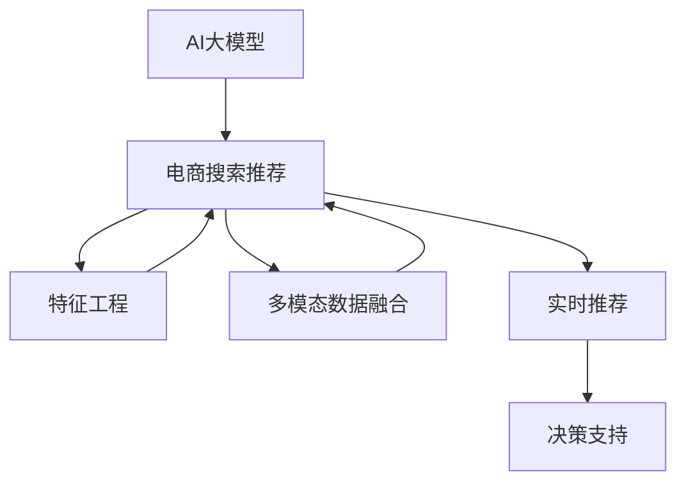

                 

# AI大模型赋能电商搜索推荐的业务创新流程优化工具选型与应用实践

> 关键词：AI大模型，电商搜索推荐，业务创新流程，工具选型，应用实践

## 1. 背景介绍

### 1.1 问题由来
随着电商市场的快速发展，消费者需求日益多样化和个性化。如何通过高效的搜索推荐系统，提升用户体验和销售额，成为电商企业面临的重要挑战。传统推荐系统往往依赖于手工设计的特征工程和规则引擎，难以满足复杂多变的用户需求。而AI大模型的兴起，为电商搜索推荐带来了新的契机。

### 1.2 问题核心关键点
利用AI大模型进行电商搜索推荐，需要综合考虑以下几个关键点：

- 数据集准备：构建大规模、高质量的用户行为数据集。
- 模型选择：选择合适的预训练模型（如BERT、GPT-3等），并结合电商数据特点进行微调。
- 特征工程：设计和优化模型的特征输入，提升模型的鲁棒性和泛化能力。
- 工具链整合：选择合适的工具和框架，搭建高效的开发和测试环境。
- 部署落地：将模型部署到实际电商系统中，实现实时推荐和效果评估。

这些关键点相互关联，共同决定了电商搜索推荐的最终效果。

### 1.3 问题研究意义
利用AI大模型进行电商搜索推荐，可以大幅提升推荐系统的精准度和个性化水平，有效满足用户的个性化需求。同时，通过将大模型应用于电商领域，还能更好地理解用户行为和市场趋势，为电商企业提供更加科学合理的决策支持。

具体来说，大模型在电商推荐中的应用可以带来以下好处：

- 精准推荐：通过学习用户行为和产品特征，实现更精准的个性化推荐。
- 实时更新：利用大模型的动态适应能力，实时捕捉市场变化和用户需求。
- 多模态融合：结合图像、视频、文字等多模态数据，提供更丰富的推荐内容。
- 用户交互：通过增强搜索和推荐系统的智能性，提升用户购物体验。
- 决策支持：利用大模型的预测能力和知识积累，为电商运营提供数据驱动的决策支持。

总之，AI大模型在电商搜索推荐中的应用，不仅可以提升用户体验，还能为企业带来更高的销售额和市场竞争力。

## 2. 核心概念与联系

### 2.1 核心概念概述

为了更好地理解基于AI大模型的电商搜索推荐，本节将介绍几个关键概念：

- AI大模型：通过在大型无标签数据上预训练得到的通用语言模型，具备强大的自然语言处理能力，可以应用于多种NLP任务。
- 电商搜索推荐：通过分析用户行为数据，预测用户的兴趣和需求，为用户推荐合适产品和信息的过程。
- 特征工程：对原始数据进行清洗、转换、组合等操作，提取有助于模型预测的特征信息。
- 多模态数据融合：将文本、图像、视频等多源数据融合，提升推荐系统的丰富性和准确性。
- 实时推荐：利用大模型的动态适应能力，在用户每次访问时即时进行推荐。
- 决策支持：通过大模型的预测结果，结合业务规则和经验，为电商运营提供决策依据。

这些核心概念之间的关系，可以通过以下Mermaid流程图来展示：



这个流程图展示了AI大模型与电商搜索推荐各环节之间的联系：

1. AI大模型提供通用的语言表示，用于搜索推荐任务。
2. 特征工程提取用户行为和产品特征，提升模型的性能。
3. 多模态数据融合丰富了推荐系统的信息来源，提升了推荐效果。
4. 实时推荐系统利用大模型的动态适应能力，即时进行推荐。
5. 决策支持系统基于大模型的预测结果，结合业务规则，为电商运营提供决策依据。

## 3. 核心算法原理 & 具体操作步骤

### 3.1 算法原理概述

基于AI大模型的电商搜索推荐，本质上是将大模型的语言处理能力，应用于用户行为分析、产品特征提取、推荐结果生成等多个环节。其核心思想是通过大规模预训练语言模型，学习通用的语言知识和用户行为模式，然后在电商数据上微调，适应特定领域的推荐需求。

具体而言，电商搜索推荐系统的构建流程如下：

1. **数据收集与处理**：收集电商用户的历史行为数据，如点击、浏览、购买、评分等，并进行数据清洗和标注。
2. **模型选择与微调**：选择合适的预训练模型，如BERT、GPT-3等，并在电商数据上微调，使其具备电商领域的推荐能力。
3. **特征工程**：设计并优化模型的特征输入，如用户ID、产品ID、搜索关键词、点击位置等，提升模型的预测准确性。
4. **推荐模型训练**：利用微调后的模型，结合用户行为和产品特征，进行推荐模型的训练。
5. **实时推荐系统部署**：将训练好的模型部署到电商平台上，实现实时推荐和效果评估。

### 3.2 算法步骤详解

#### 3.2.1 数据收集与处理

电商数据通常包括用户的点击、浏览、购买、评分等行为数据。为了构建高质量的电商推荐系统，我们需要对原始数据进行如下处理：

1. **数据清洗**：去除噪音数据，如无效点击、异常评分等。
2. **数据标注**：为每个用户行为记录打上标签，如购买意愿、收藏倾向等。
3. **数据划分**：将数据划分为训练集、验证集和测试集，用于模型训练、调参和评估。
4. **数据增强**：利用数据增强技术，如回译、近义词替换等，丰富训练集样本多样性，提升模型的泛化能力。

#### 3.2.2 模型选择与微调

选择合适的预训练模型，如BERT、GPT-3等，并在电商数据上微调。微调过程包括：

1. **模型加载与初始化**：从预训练模型库中加载模型，并进行初始化。
2. **任务适配层设计**：设计适合电商推荐任务的适配层，如加权平均池化层、注意力机制层等。
3. **模型微调**：在电商数据上微调模型，学习电商领域的推荐任务。
4. **参数更新**：使用优化算法（如AdamW、SGD等），更新模型参数，最小化推荐误差。

#### 3.2.3 特征工程

特征工程是构建电商推荐系统的重要环节。有效的特征提取和设计，能够提升模型的预测能力和泛化能力。特征工程包括：

1. **用户特征提取**：提取用户的基本信息（如年龄、性别、地域等）和行为特征（如浏览时长、购买频率等）。
2. **产品特征提取**：提取产品的基本信息（如类别、价格、品牌等）和特征（如评分、销量等）。
3. **行为特征构建**：构建用户行为特征，如点击序列、购买路径等，提升模型的动态能力。
4. **多模态数据融合**：将文本、图像、视频等多源数据融合，丰富推荐系统的信息来源。

#### 3.2.4 推荐模型训练

利用微调后的模型，结合用户行为和产品特征，进行推荐模型的训练。训练过程包括：

1. **模型输入设计**：设计适合电商推荐任务的输入特征，如用户ID、产品ID、搜索关键词、点击位置等。
2. **损失函数设计**：设计适合电商推荐任务的损失函数，如交叉熵损失、均方误差损失等。
3. **模型优化**：使用优化算法（如AdamW、SGD等），更新模型参数，最小化推荐误差。
4. **模型评估**：在验证集和测试集上评估模型性能，如准确率、召回率、F1-score等。

#### 3.2.5 实时推荐系统部署

将训练好的模型部署到电商平台上，实现实时推荐和效果评估。部署过程包括：

1. **模型加载与初始化**：在推荐系统中加载训练好的模型，并进行初始化。
2. **推荐计算**：根据用户行为和产品特征，计算推荐结果。
3. **推荐展示**：将推荐结果展示给用户，提升用户体验。
4. **效果评估**：实时监测推荐效果，如点击率、转化率、用户满意度等，持续优化推荐模型。

### 3.3 算法优缺点

基于AI大模型的电商搜索推荐方法具有以下优点：

- **通用性强**：大模型具备通用语言处理能力，适用于多种电商推荐任务，无需重新设计和优化。
- **精度高**：利用大模型的丰富知识和泛化能力，推荐结果更准确，能显著提升用户体验和销售额。
- **动态适应**：大模型的动态适应能力，使推荐系统能够实时捕捉市场变化和用户需求，保持推荐结果的时效性。
- **多模态融合**：结合多源数据，提升推荐系统的丰富性和准确性，满足用户的多样化需求。
- **可解释性强**：利用大模型的可解释性，为电商运营提供数据驱动的决策依据。

但该方法也存在一些局限性：

- **数据需求高**：构建高质量电商推荐系统，需要大规模、高质量的用户行为数据，获取难度较大。
- **计算成本高**：大模型的参数量巨大，训练和推理需要高性能算力，计算成本较高。
- **模型复杂度高**：大模型涉及复杂的模型结构和优化算法，调试和部署难度较大。
- **过拟合风险高**：电商数据的特点是长尾、稀疏，大模型容易出现过拟合，需要合理设计正则化策略。

### 3.4 算法应用领域

基于AI大模型的电商搜索推荐方法，已经在多个电商平台上得到了成功应用，如亚马逊、阿里巴巴、京东等。以下是一些主要的应用场景：

- **个性化推荐**：利用大模型的语言处理能力，为用户推荐个性化商品和内容。
- **实时推荐**：结合用户实时行为数据，动态生成推荐结果，提升用户购物体验。
- **商品召回**：通过大模型的搜索能力，召回热门商品，提升用户浏览量和购买率。
- **内容推荐**：利用大模型的多模态处理能力，推荐相关视频、图片等内容，增加用户停留时间。
- **广告投放**：结合用户兴趣和行为数据，生成精准广告投放策略，提升广告转化率。

这些应用场景展示了AI大模型在电商推荐中的广泛适用性，为电商企业提供了多种解决方案。

## 4. 数学模型和公式 & 详细讲解 & 举例说明

### 4.1 数学模型构建

假设电商推荐任务为二分类问题，即预测用户是否会购买某个商品。设用户行为数据为 $D=\{(x_i,y_i)\}_{i=1}^N$，其中 $x_i$ 为特征向量，$y_i \in \{0,1\}$ 为购买标签。设预训练模型为 $M_{\theta}$，其中 $\theta$ 为模型参数。

定义模型在数据样本 $(x,y)$ 上的损失函数为 $\ell(M_{\theta}(x),y)$，则在数据集 $D$ 上的经验风险为：

$$
\mathcal{L}(\theta) = \frac{1}{N} \sum_{i=1}^N \ell(M_{\theta}(x_i),y_i)
$$

微调的优化目标是最小化经验风险，即找到最优参数：

$$
\theta^* = \mathop{\arg\min}_{\theta} \mathcal{L}(\theta)
$$

在实践中，我们通常使用基于梯度的优化算法（如AdamW、SGD等）来近似求解上述最优化问题。设 $\eta$ 为学习率，则参数的更新公式为：

$$
\theta \leftarrow \theta - \eta \nabla_{\theta}\mathcal{L}(\theta)
$$

其中 $\nabla_{\theta}\mathcal{L}(\theta)$ 为损失函数对参数 $\theta$ 的梯度，可通过反向传播算法高效计算。

### 4.2 公式推导过程

以下我们以二分类任务为例，推导交叉熵损失函数及其梯度的计算公式。

假设模型 $M_{\theta}$ 在输入 $x$ 上的输出为 $\hat{y}=M_{\theta}(x) \in [0,1]$，表示样本属于正类的概率。真实标签 $y \in \{0,1\}$。则二分类交叉熵损失函数定义为：

$$
\ell(M_{\theta}(x),y) = -[y\log \hat{y} + (1-y)\log (1-\hat{y})]
$$

将其代入经验风险公式，得：

$$
\mathcal{L}(\theta) = -\frac{1}{N}\sum_{i=1}^N [y_i\log M_{\theta}(x_i)+(1-y_i)\log(1-M_{\theta}(x_i))]
$$

根据链式法则，损失函数对参数 $\theta_k$ 的梯度为：

$$
\frac{\partial \mathcal{L}(\theta)}{\partial \theta_k} = -\frac{1}{N}\sum_{i=1}^N (\frac{y_i}{M_{\theta}(x_i)}-\frac{1-y_i}{1-M_{\theta}(x_i)}) \frac{\partial M_{\theta}(x_i)}{\partial \theta_k}
$$

其中 $\frac{\partial M_{\theta}(x_i)}{\partial \theta_k}$ 可进一步递归展开，利用自动微分技术完成计算。

### 4.3 案例分析与讲解

#### 案例分析

假设某电商公司希望利用BERT模型进行个性化推荐。公司已收集到一定规模的用户行为数据，包含用户的浏览记录、购买记录和评分信息。

1. **数据准备**：收集并清洗用户行为数据，构建训练集、验证集和测试集。
2. **模型选择**：选择BERT作为预训练模型，并加载到电商推荐系统中。
3. **任务适配层设计**：在BERT顶层添加一个加权平均池化层，提取用户行为特征，设计交叉熵损失函数。
4. **模型微调**：在电商数据上微调BERT模型，学习电商推荐任务。
5. **特征工程**：设计用户和产品特征，构建多模态数据融合策略。
6. **推荐模型训练**：利用微调后的BERT模型，进行推荐模型的训练，评估推荐效果。
7. **实时推荐系统部署**：将训练好的模型部署到电商平台上，实现实时推荐和效果评估。

## 5. 项目实践：代码实例和详细解释说明

### 5.1 开发环境搭建

在进行电商推荐系统开发前，我们需要准备好开发环境。以下是使用Python进行PyTorch开发的环境配置流程：

1. 安装Anaconda：从官网下载并安装Anaconda，用于创建独立的Python环境。

2. 创建并激活虚拟环境：
```bash
conda create -n ecomm-env python=3.8 
conda activate ecomm-env
```

3. 安装PyTorch：根据CUDA版本，从官网获取对应的安装命令。例如：
```bash
conda install pytorch torchvision torchaudio cudatoolkit=11.1 -c pytorch -c conda-forge
```

4. 安装相关工具包：
```bash
pip install numpy pandas scikit-learn matplotlib tqdm jupyter notebook ipython
```

完成上述步骤后，即可在`ecomm-env`环境中开始电商推荐系统的开发。

### 5.2 源代码详细实现

这里我们以基于BERT模型的电商推荐系统为例，给出电商推荐系统开发的具体代码实现。

首先，定义数据处理函数：

```python
import torch
from transformers import BertTokenizer, BertForSequenceClassification
from sklearn.metrics import accuracy_score

class EcommDataset(Dataset):
    def __init__(self, texts, labels, tokenizer, max_len=128):
        self.texts = texts
        self.labels = labels
        self.tokenizer = tokenizer
        self.max_len = max_len
        
    def __len__(self):
        return len(self.texts)
    
    def __getitem__(self, item):
        text = self.texts[item]
        label = self.labels[item]
        
        encoding = self.tokenizer(text, return_tensors='pt', max_length=self.max_len, padding='max_length', truncation=True)
        input_ids = encoding['input_ids'][0]
        attention_mask = encoding['attention_mask'][0]
        
        # 将标签编码成数字
        label = label2id[label]
        
        return {'input_ids': input_ids, 
                'attention_mask': attention_mask,
                'labels': torch.tensor(label, dtype=torch.long)}
```

然后，定义模型和优化器：

```python
from transformers import AdamW

model = BertForSequenceClassification.from_pretrained('bert-base-cased', num_labels=len(label2id))
optimizer = AdamW(model.parameters(), lr=2e-5)
```

接着，定义训练和评估函数：

```python
from torch.utils.data import DataLoader

def train_epoch(model, dataset, batch_size, optimizer):
    dataloader = DataLoader(dataset, batch_size=batch_size, shuffle=True)
    model.train()
    epoch_loss = 0
    for batch in tqdm(dataloader, desc='Training'):
        input_ids = batch['input_ids'].to(device)
        attention_mask = batch['attention_mask'].to(device)
        labels = batch['labels'].to(device)
        model.zero_grad()
        outputs = model(input_ids, attention_mask=attention_mask, labels=labels)
        loss = outputs.loss
        epoch_loss += loss.item()
        loss.backward()
        optimizer.step()
    return epoch_loss / len(dataloader)

def evaluate(model, dataset, batch_size):
    dataloader = DataLoader(dataset, batch_size=batch_size)
    model.eval()
    preds, labels = [], []
    with torch.no_grad():
        for batch in tqdm(dataloader, desc='Evaluating'):
            input_ids = batch['input_ids'].to(device)
            attention_mask = batch['attention_mask'].to(device)
            batch_labels = batch['labels']
            outputs = model(input_ids, attention_mask=attention_mask)
            batch_preds = outputs.logits.argmax(dim=1).to('cpu').tolist()
            batch_labels = batch_labels.to('cpu').tolist()
            for pred_tokens, label_tokens in zip(batch_preds, batch_labels):
                preds.append(pred_tokens)
                labels.append(label_tokens)
                
    return accuracy_score(labels, preds)
```

最后，启动训练流程并在测试集上评估：

```python
epochs = 5
batch_size = 16

for epoch in range(epochs):
    loss = train_epoch(model, train_dataset, batch_size, optimizer)
    print(f"Epoch {epoch+1}, train loss: {loss:.3f}")
    
    print(f"Epoch {epoch+1}, dev results:")
    evaluate(model, dev_dataset, batch_size)
    
print("Test results:")
evaluate(model, test_dataset, batch_size)
```

以上就是使用PyTorch对BERT模型进行电商推荐系统微调的完整代码实现。可以看到，得益于Transformers库的强大封装，我们可以用相对简洁的代码完成BERT模型的加载和微调。

### 5.3 代码解读与分析

让我们再详细解读一下关键代码的实现细节：

**EcommDataset类**：
- `__init__`方法：初始化文本、标签、分词器等关键组件。
- `__len__`方法：返回数据集的样本数量。
- `__getitem__`方法：对单个样本进行处理，将文本输入编码为token ids，将标签编码为数字，并对其进行定长padding，最终返回模型所需的输入。

**label2id字典**：
- 定义了标签与数字id之间的映射关系，用于将标签转换为数字，方便模型的训练和评估。

**训练和评估函数**：
- 使用PyTorch的DataLoader对数据集进行批次化加载，供模型训练和推理使用。
- 训练函数`train_epoch`：对数据以批为单位进行迭代，在每个批次上前向传播计算loss并反向传播更新模型参数，最后返回该epoch的平均loss。
- 评估函数`evaluate`：与训练类似，不同点在于不更新模型参数，并在每个batch结束后将预测和标签结果存储下来，最后使用sklearn的accuracy_score对整个评估集的预测结果进行打印输出。

**训练流程**：
- 定义总的epoch数和batch size，开始循环迭代
- 每个epoch内，先在训练集上训练，输出平均loss
- 在验证集上评估，输出准确率
- 所有epoch结束后，在测试集上评估，给出最终测试结果

可以看到，PyTorch配合Transformers库使得BERT微调的代码实现变得简洁高效。开发者可以将更多精力放在数据处理、模型改进等高层逻辑上，而不必过多关注底层的实现细节。

当然，工业级的系统实现还需考虑更多因素，如模型的保存和部署、超参数的自动搜索、更灵活的任务适配层等。但核心的微调范式基本与此类似。

## 6. 实际应用场景

### 6.1 智能客服系统

基于AI大模型的电商搜索推荐，可以广泛应用于智能客服系统的构建。传统客服往往需要配备大量人力，高峰期响应缓慢，且一致性和专业性难以保证。而使用电商推荐系统生成的个性化推荐，可以提升用户满意度，减少客服压力。

在技术实现上，可以结合用户浏览和购买行为数据，预测用户可能感兴趣的商品，提前生成推荐信息。在客户咨询时，系统可以实时展示这些推荐信息，提高用户满意度。

### 6.2 个性化推荐

利用AI大模型的电商推荐系统，可以为用户推荐个性化商品和内容，提升用户购物体验。具体来说，可以构建多模态电商推荐系统，结合用户浏览记录、购买记录、评价信息等数据，生成个性化推荐。

在模型训练中，可以加入图像、视频等多模态数据，丰富推荐系统的信息来源，提升推荐效果。通过多模态融合，系统能够更好地理解用户需求，提供更加多样化和精准的推荐。

### 6.3 实时推荐

电商推荐系统需要实时捕捉市场变化和用户需求，动态生成推荐结果。利用大模型的动态适应能力，可以在用户每次访问时即时进行推荐。

在模型部署中，可以采用流式处理方式，对用户行为数据进行实时分析，生成个性化推荐。通过实时推荐，系统能够更好地捕捉市场变化，提高推荐效果。

### 6.4 商品召回

电商推荐系统可以通过推荐结果，召回热门商品，提升用户浏览量和购买率。在推荐过程中，可以结合用户行为数据，生成热门商品推荐，吸引用户关注。

通过商品召回，系统能够动态调整商品展示策略，提升用户浏览量和购买率。同时，通过数据分析，可以发现用户感兴趣的商品类别，为后续商品营销提供数据支持。

### 6.5 广告投放

电商推荐系统可以通过用户行为数据，生成精准广告投放策略，提升广告转化率。具体来说，可以结合用户兴趣和行为数据，生成个性化广告推荐。

在广告投放中，可以加入用户点击、购买行为等数据，动态调整广告策略，提升广告效果。通过精准投放，系统能够更好地满足用户需求，提升广告转化率。

## 7. 工具和资源推荐

### 7.1 学习资源推荐

为了帮助开发者系统掌握AI大模型在电商搜索推荐中的应用，这里推荐一些优质的学习资源：

1. 《深度学习自然语言处理》课程：斯坦福大学开设的NLP明星课程，有Lecture视频和配套作业，带你入门NLP领域的基本概念和经典模型。

2. 《Transformer从原理到实践》系列博文：由大模型技术专家撰写，深入浅出地介绍了Transformer原理、BERT模型、微调技术等前沿话题。

3. 《Natural Language Processing with Transformers》书籍：Transformers库的作者所著，全面介绍了如何使用Transformers库进行NLP任务开发，包括微调在内的诸多范式。

4. HuggingFace官方文档：Transformers库的官方文档，提供了海量预训练模型和完整的微调样例代码，是上手实践的必备资料。

5. Weights & Biases：模型训练的实验跟踪工具，可以记录和可视化模型训练过程中的各项指标，方便对比和调优。与主流深度学习框架无缝集成。

通过对这些资源的学习实践，相信你一定能够快速掌握AI大模型在电商搜索推荐中的应用，并用于解决实际的NLP问题。

### 7.2 开发工具推荐

高效的开发离不开优秀的工具支持。以下是几款用于AI大模型电商推荐开发的常用工具：

1. PyTorch：基于Python的开源深度学习框架，灵活动态的计算图，适合快速迭代研究。大部分预训练语言模型都有PyTorch版本的实现。

2. TensorFlow：由Google主导开发的开源深度学习框架，生产部署方便，适合大规模工程应用。同样有丰富的预训练语言模型资源。

3. Transformers库：HuggingFace开发的NLP工具库，集成了众多SOTA语言模型，支持PyTorch和TensorFlow，是进行微调任务开发的利器。

4. Weights & Biases：模型训练的实验跟踪工具，可以记录和可视化模型训练过程中的各项指标，方便对比和调优。与主流深度学习框架无缝集成。

5. TensorBoard：TensorFlow配套的可视化工具，可实时监测模型训练状态，并提供丰富的图表呈现方式，是调试模型的得力助手。

6. Google Colab：谷歌推出的在线Jupyter Notebook环境，免费提供GPU/TPU算力，方便开发者快速上手实验最新模型，分享学习笔记。

合理利用这些工具，可以显著提升AI大模型电商推荐任务的开发效率，加快创新迭代的步伐。

### 7.3 相关论文推荐

AI大模型在电商推荐中的应用源于学界的持续研究。以下是几篇奠基性的相关论文，推荐阅读：

1. Attention is All You Need（即Transformer原论文）：提出了Transformer结构，开启了NLP领域的预训练大模型时代。

2. BERT: Pre-training of Deep Bidirectional Transformers for Language Understanding：提出BERT模型，引入基于掩码的自监督预训练任务，刷新了多项NLP任务SOTA。

3. Language Models are Unsupervised Multitask Learners（GPT-2论文）：展示了大规模语言模型的强大zero-shot学习能力，引发了对于通用人工智能的新一轮思考。

4. Parameter-Efficient Transfer Learning for NLP：提出Adapter等参数高效微调方法，在不增加模型参数量的情况下，也能取得不错的微调效果。

5. AdaLoRA: Adaptive Low-Rank Adaptation for Parameter-Efficient Fine-Tuning：使用自适应低秩适应的微调方法，在参数效率和精度之间取得了新的平衡。

这些论文代表了大语言模型微调技术的发展脉络。通过学习这些前沿成果，可以帮助研究者把握学科前进方向，激发更多的创新灵感。

## 8. 总结：未来发展趋势与挑战

### 8.1 总结

本文对基于AI大模型的电商搜索推荐方法进行了全面系统的介绍。首先阐述了AI大模型和电商推荐的基本概念，明确了两者结合的应用价值。其次，从原理到实践，详细讲解了电商推荐系统的构建流程，包括数据准备、模型选择、特征工程、模型训练、实时推荐等多个环节。最后，探讨了AI大模型在电商搜索推荐中的广泛应用场景，展示了其强大的应用潜力。

通过本文的系统梳理，可以看到，基于AI大模型的电商推荐系统，可以通过学习用户行为和产品特征，实现精准个性化的推荐。借助大模型的动态适应能力，系统能够实时捕捉市场变化和用户需求，提升推荐效果。未来，随着技术的不断进步，基于AI大模型的电商推荐系统必将在更多电商平台上得到广泛应用，为电商企业带来更大的市场竞争优势。

### 8.2 未来发展趋势

展望未来，AI大模型在电商搜索推荐领域将呈现以下几个发展趋势：

1. 模型规模持续增大。随着算力成本的下降和数据规模的扩张，预训练语言模型的参数量还将持续增长。超大规模语言模型蕴含的丰富语言知识，有望支撑更加复杂多变的电商推荐任务。

2. 微调方法日趋多样。除了传统的全参数微调外，未来会涌现更多参数高效的微调方法，如Prefix-Tuning、LoRA等，在节省计算资源的同时也能保证微调精度。

3. 持续学习成为常态。随着数据分布的不断变化，微调模型也需要持续学习新知识以保持性能。如何在不遗忘原有知识的同时，高效吸收新样本信息，将成为重要的研究课题。

4. 标注样本需求降低。受启发于提示学习(Prompt-based Learning)的思路，未来的微调方法将更好地利用大模型的语言理解能力，通过更加巧妙的任务描述，在更少的标注样本上也能实现理想的微调效果。

5. 多模态数据融合崛起。当前的电商推荐主要聚焦于文本数据，未来会进一步拓展到图像、视频、语音等多模态数据。多模态信息的融合，将显著提升推荐系统的丰富性和准确性。

6. 模型通用性增强。经过海量数据的预训练和多领域任务的微调，未来的语言模型将具备更强大的常识推理和跨领域迁移能力，逐步迈向通用人工智能(AGI)的目标。

以上趋势凸显了AI大模型在电商推荐中的广阔前景。这些方向的探索发展，必将进一步提升电商推荐系统的性能和应用范围，为电商企业带来更大的市场竞争优势。

### 8.3 面临的挑战

尽管AI大模型在电商推荐中已经取得了显著成果，但在迈向更加智能化、普适化应用的过程中，仍面临诸多挑战：

1. 数据需求高。构建高质量电商推荐系统，需要大规模、高质量的用户行为数据，获取难度较大。

2. 计算成本高。大模型的参数量巨大，训练和推理需要高性能算力，计算成本较高。

3. 模型复杂度高。大模型涉及复杂的模型结构和优化算法，调试和部署难度较大。

4. 过拟合风险高。电商数据的特点是长尾、稀疏，大模型容易出现过拟合，需要合理设计正则化策略。

5. 可解释性差。当前推荐模型的决策过程缺乏可解释性，难以对其推理逻辑进行分析和调试。

6. 安全性问题。预训练语言模型可能学习到有害信息，通过微调传递到推荐系统，带来潜在风险。

正视这些挑战，积极应对并寻求突破，将是大语言模型微调走向成熟的必由之路。相信随着学界和产业界的共同努力，这些挑战终将一一被克服，AI大模型必将在构建人机协同的智能时代中扮演越来越重要的角色。

### 8.4 研究展望

面对AI大模型电商推荐所面临的挑战，未来的研究需要在以下几个方面寻求新的突破：

1. 探索无监督和半监督微调方法。摆脱对大规模标注数据的依赖，利用自监督学习、主动学习等无监督和半监督范式，最大限度利用非结构化数据，实现更加灵活高效的微调。

2. 研究参数高效和计算高效的微调范式。开发更加参数高效的微调方法，在固定大部分预训练参数的同时，只更新极少量的任务相关参数。同时优化微调模型的计算图，减少前向传播和反向传播的资源消耗，实现更加轻量级、实时性的部署。

3. 融合因果和对比学习范式。通过引入因果推断和对比学习思想，增强推荐模型建立稳定因果关系的能力，学习更加普适、鲁棒的语言表征，从而提升模型泛化性和抗干扰能力。

4. 引入更多先验知识。将符号化的先验知识，如知识图谱、逻辑规则等，与神经网络模型进行巧妙融合，引导微调过程学习更准确、合理的语言模型。同时加强不同模态数据的整合，实现视觉、语音等多模态信息与文本信息的协同建模。

5. 结合因果分析和博弈论工具。将因果分析方法引入推荐模型，识别出模型决策的关键特征，增强输出解释的因果性和逻辑性。借助博弈论工具刻画人机交互过程，主动探索并规避模型的脆弱点，提高系统稳定性。

6. 纳入伦理道德约束。在模型训练目标中引入伦理导向的评估指标，过滤和惩罚有偏见、有害的输出倾向。同时加强人工干预和审核，建立模型行为的监管机制，确保输出符合人类价值观和伦理道德。

这些研究方向的探索，必将引领AI大模型电商推荐系统迈向更高的台阶，为电商企业带来更大的市场竞争优势。面向未来，AI大模型电商推荐系统还需要与其他人工智能技术进行更深入的融合，如知识表示、因果推理、强化学习等，多路径协同发力，共同推动自然语言理解和智能交互系统的进步。只有勇于创新、敢于突破，才能不断拓展语言模型的边界，让智能技术更好地造福人类社会。

## 9. 附录：常见问题与解答

**Q1：AI大模型在电商推荐中的应用是否适用于所有电商场景？**

A: AI大模型在电商推荐中的应用，通常需要大规模、高质量的用户行为数据。对于一些小众电商，由于用户行为数据稀疏，可能无法构建高质量的推荐系统。此外，不同电商平台的商品种类、用户需求差异较大，模型也需要针对具体场景进行调整和优化。因此，AI大模型在电商推荐中的应用需要结合具体情况进行评估和调整。

**Q2：如何选择合适的AI大模型进行电商推荐？**

A: 选择合适的AI大模型进行电商推荐，需要综合考虑以下几个方面：

1. 模型大小：较大的模型通常具有更强的泛化能力，但需要更大的计算资源。较小的模型虽然计算成本低，但可能在某些电商推荐任务上表现不佳。

2. 预训练数据：模型的预训练数据集越大，其语言处理能力越强。对于电商推荐任务，选择与电商数据分布相似的预训练数据集，可以有效提升推荐效果。

3. 任务适配层：根据电商推荐任务的特点，设计合适的任务适配层。例如，在文本推荐任务中，可以添加注意力机制层，提升模型对关键信息的捕捉能力。

4. 参数效率：选择参数高效的微调方法，如Prefix-Tuning、LoRA等，可以在固定大部分预训练参数的情况下，只更新极少量的任务相关参数，降低计算成本。

5. 实时性：考虑模型的实时性需求，选择合适的前向传播算法和优化策略。例如，采用流式处理方式，可以实时生成推荐结果，提升用户体验。

**Q3：电商推荐系统中的数据预处理需要注意哪些方面？**

A: 电商推荐系统中的数据预处理，需要注意以下几个方面：

1. 数据清洗：去除噪音数据，如无效点击、异常评分等。

2. 数据标注：为每个用户行为记录打上标签，如购买意愿、收藏倾向等。

3. 数据划分：将数据划分为训练集、验证集和测试集，用于模型训练、调参和评估。

4. 数据增强：利用数据增强技术，如回译、近义词替换等，丰富训练集样本多样性，提升模型的泛化能力。

5. 数据归一化：对数据进行归一化处理，保证模型训练的稳定性。

6. 数据平衡：对于长尾数据，需要采取平衡采样等方法，避免模型偏向于常见类别的推荐。

7. 数据稀疏处理：对于稀疏数据，可以使用FTRL等稀疏优化方法，提升模型的训练效果。

**Q4：电商推荐系统中的特征工程需要注意哪些方面？**

A: 电商推荐系统中的特征工程，需要注意以下几个方面：

1. 用户特征提取：提取用户的基本信息（如年龄、性别、地域等）和行为特征（如浏览时长、购买频率等）。

2. 产品特征提取：提取产品的基本信息（如类别、价格、品牌等）和特征（如评分、销量等）。

3. 行为特征构建：构建用户行为特征，如点击序列、购买路径等，提升模型的动态能力。

4. 多模态数据融合：将文本、图像、视频等多源数据融合，丰富推荐系统的信息来源。

5. 特征降维：对高维特征进行降维处理，提升模型的训练速度和泛化能力。

6. 特征选择：选择对模型预测有帮助的特征，避免过拟合。

7. 特征工程自动化：利用自动化特征工程工具，如Featuretools、H2O等，提高特征工程效率。

**Q5：电商推荐系统中的模型训练需要注意哪些方面？**

A: 电商推荐系统中的模型训练，需要注意以下几个方面：

1. 损失函数设计：选择适合电商推荐任务的损失函数，如交叉熵损失、均方误差损失等。

2. 优化算法选择：选择合适的优化算法，如AdamW、SGD等，控制学习率、批量大小等超参数。

3. 正则化技术：使用L2正则、Dropout、Early Stopping等正则化技术，防止模型过拟合。

4. 模型监控：实时监测模型训练过程中的各项指标，如准确率、损失等，及时发现问题。

5. 模型验证：在验证集上评估模型性能，选择合适的超参数组合。

6. 模型调优：根据验证集评估结果，对模型进行调优，提升模型效果。

7. 模型评估：在测试集上评估模型性能，如准确率、召回率、F1-score等。

**Q6：电商推荐系统中的实时推荐需要注意哪些方面？**

A: 电商推荐系统中的实时推荐，需要注意以下几个方面：

1. 流式处理：采用流式处理方式，对用户行为数据进行实时分析，生成个性化推荐。

2. 延迟控制：控制推荐延迟时间，确保推荐结果的实时性。

3. 缓存策略：利用缓存技术，减少重复计算，提升推荐效率。

4. 系统稳定性：实时推荐系统需要具备高稳定性，确保在高峰期能够持续提供推荐服务。

5. 负载均衡：根据用户访问量，动态调整资源配置，平衡服务质量和成本。

6. 实时监控：实时监测推荐效果，如点击率、转化率、用户满意度等，持续优化推荐模型。

**Q7：电商推荐系统中的广告投放需要注意哪些方面？**

A: 电商推荐系统中的广告投放，需要注意以下几个方面：

1. 广告类型选择：选择适合电商平台的广告类型，如搜索广告、展示广告等。

2. 用户画像构建：结合用户行为数据和广告数据，构建用户画像，实现精准投放。

3. 广告创意优化：通过A/B测试等方法，优化广告创意，提升点击率和转化率。

4. 广告效果评估：实时评估广告投放效果，如点击率、转化率、ROI等，调整投放策略。

5. 反作弊机制：建立反作弊机制，防止广告作弊行为，保证广告效果。

6. 实时监控：实时监测广告投放效果，确保投放策略的有效性。

**Q8：电商推荐系统中的安全性问题需要注意哪些方面？**

A: 电商推荐系统中的安全性问题，需要注意以下几个方面：

1. 数据隐私保护：确保用户行为数据的安全性，避免数据泄露。

2. 模型鲁棒性：防止模型过拟合，避免推荐结果的偏见和有害信息。

3. 安全防护：采用访问鉴权、数据脱敏等措施，保障数据和模型安全。

4. 异常检测：建立异常检测机制，识别并处理异常行为和数据。

5. 系统加固：加固系统安全防护措施，防止恶意攻击和数据篡改。

**Q9：电商推荐系统中的推荐效果评估需要注意哪些方面？**

A: 电商推荐系统中的推荐效果评估，需要注意以下几个方面：

1. 评估指标选择：选择合适的评估指标，如准确率、召回率、F1-score等。

2. 数据划分：将数据划分为训练集、验证集和测试集，用于模型训练、调参和评估。

3. 评估方法：采用交叉验证等方法，评估推荐模型的性能。

4. 效果分析：分析推荐效果的影响因素，如用户行为、产品特征等，优化推荐模型。

5. 用户反馈：收集用户反馈，了解用户对推荐结果的满意度和意见。

6. 持续优化：根据用户反馈和推荐效果，持续优化推荐模型，提升推荐效果。

通过以上常见问题的解答，相信你能够更好地理解和应用AI大模型在电商推荐中的应用。AI大模型在电商推荐中的应用前景广阔，相信随着技术的不断进步，将为电商企业带来更大的市场竞争优势。

