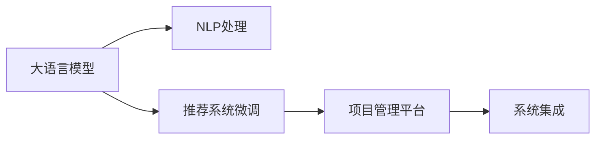

                 

# AI大模型赋能电商搜索推荐的业务创新项目管理平台搭建

> 关键词：大语言模型, 电商搜索推荐, 业务创新, 项目管理平台, 自然语言处理(NLP), 深度学习, 推荐系统

## 1. 背景介绍

### 1.1 问题由来

随着互联网技术的飞速发展和电商市场的不断扩展，消费者对购物体验的需求日益增加。电商平台的搜索推荐系统作为连接用户和商品的重要桥梁，直接影响用户体验和销售转化。传统的搜索推荐系统主要依靠基于用户行为的历史数据分析和逻辑规则匹配，难以满足用户个性化需求和动态变化的购物环境。

为了提升搜索推荐系统的效果，电商平台开始引入人工智能技术，特别是大语言模型。大语言模型通过在海量无标签文本数据上预训练，具备强大的自然语言处理(NLP)能力，能够从文本中提取语义信息，辅助推荐系统匹配更符合用户需求的搜索结果。然而，大模型的引入也带来了新的挑战，如模型的训练、部署、优化和监控等，需要构建专门的项目管理平台以保障项目的顺利进行。

### 1.2 问题核心关键点

目前，大模型在电商搜索推荐中的应用还处于初级阶段，但已经在一些核心功能上展现出显著效果。其核心技术包括：

- **大语言模型预训练**：使用大规模文本数据预训练大模型，学习通用语言表示。
- **自然语言处理(NLP)**：利用大模型的NLP能力，进行文本分析、实体识别、情感分析等任务。
- **推荐系统微调**：将大模型与推荐系统结合，通过微调学习用户行为和商品特征，提高推荐准确度。
- **项目管理平台**：构建专门的管理系统，统一大模型的训练、部署、优化和监控流程，确保项目的稳定运行。

### 1.3 问题研究意义

构建大语言模型赋能电商搜索推荐的项目管理平台，对于提升电商平台的搜索推荐系统效果，优化用户体验和促进销售转化具有重要意义：

1. **提升推荐精度**：利用大语言模型强大的NLP能力，精确匹配用户需求，提升推荐相关性和个性化程度。
2. **增强用户满意度**：通过个性化推荐，提供满足用户兴趣和需求的商品，提升用户满意度和忠诚度。
3. **降低运营成本**：自动化大模型训练和微调流程，减少人工干预和成本投入，提高运营效率。
4. **推动技术创新**：为电商平台的AI技术研发提供可靠的基础设施，促进技术创新和应用突破。
5. **拓展应用场景**：通过项目管理平台的搭建，为电商平台的搜索推荐系统应用提供更广泛的场景，如智能客服、广告投放、内容推荐等。

## 2. 核心概念与联系

### 2.1 核心概念概述

为更好地理解AI大模型在电商搜索推荐中的应用和项目管理平台的构建，本节将介绍几个关键概念及其相互关系：

- **大语言模型**：指通过大规模无标签文本数据预训练，学习通用语言表示的深度学习模型，如BERT、GPT等。
- **自然语言处理(NLP)**：指利用计算机技术处理和理解人类自然语言的技术，包括文本分类、实体识别、情感分析等。
- **推荐系统**：指通过用户行为和商品特征进行匹配，推荐相关商品的系统，如协同过滤、内容推荐等。
- **项目管理平台**：指专门用于管理AI模型的训练、部署、优化和监控的平台，支持自动化的流水线管理和数据流程控制。

这些概念之间的关系可以通过以下Mermaid流程图来展示：



这个流程图展示了从预训练大模型到最终推荐系统部署的全过程，以及项目管理平台在其中扮演的角色。

## 3. 核心算法原理 & 具体操作步骤

### 3.1 算法原理概述

AI大模型赋能电商搜索推荐的核心算法原理是基于监督学习的大语言模型微调。其基本流程如下：

1. **数据预处理**：收集电商平台的商品信息和用户行为数据，进行清洗和标注。
2. **模型预训练**：使用大规模无标签文本数据预训练大语言模型，学习通用的语言表示。
3. **任务适配**：根据电商搜索推荐任务设计适配层，将预训练模型与推荐系统结合。
4. **微调优化**：使用标注数据微调适配后的模型，提升推荐效果。
5. **模型部署**：将微调后的模型部署到推荐系统，提供实时推荐服务。
6. **监控优化**：实时监控推荐系统性能，定期优化模型参数，确保系统稳定运行。

### 3.2 算法步骤详解

#### 3.2.1 数据预处理

电商平台的商品信息和用户行为数据通常以结构化和非结构化形式存在，需要进行预处理和标注，以便后续训练和微调。具体步骤如下：

1. **数据清洗**：去除缺失值、重复数据、异常值等，确保数据质量。
2. **数据标注**：对用户行为数据进行标注，如点击、浏览、购买等行为。
3. **数据集划分**：将数据集划分为训练集、验证集和测试集。

#### 3.2.2 模型预训练

使用大规模无标签文本数据预训练大语言模型，学习通用的语言表示。具体步骤如下：

1. **数据准备**：收集电商领域相关的文本数据，如商品描述、用户评论等。
2. **数据加载**：使用库如HuggingFace的`datasets`加载数据集。
3. **模型训练**：使用大模型库如Transformers，训练预训练模型。

#### 3.2.3 任务适配

根据电商搜索推荐任务设计适配层，将预训练模型与推荐系统结合。具体步骤如下：

1. **适配层设计**：设计适配层以适应电商搜索推荐任务，如匹配文本中的实体和关键词。
2. **模型集成**：将适配后的模型与推荐系统集成，进行推荐匹配。

#### 3.2.4 微调优化

使用标注数据微调适配后的模型，提升推荐效果。具体步骤如下：

1. **微调数据准备**：将用户行为数据和商品特征数据转化为模型可接受的格式。
2. **模型微调**：使用微调库如HuggingFace的`Trainer`进行模型微调。
3. **性能评估**：在验证集上评估微调后的模型效果，进行参数调整。

#### 3.2.5 模型部署

将微调后的模型部署到推荐系统，提供实时推荐服务。具体步骤如下：

1. **模型保存**：保存微调后的模型和适配层。
2. **模型加载**：在推荐系统加载模型和适配层。
3. **推荐服务**：将模型集成到推荐系统，进行实时推荐。

#### 3.2.6 监控优化

实时监控推荐系统性能，定期优化模型参数，确保系统稳定运行。具体步骤如下：

1. **性能监控**：实时监测推荐系统性能指标，如点击率、转化率等。
2. **模型优化**：根据监控结果，定期优化模型参数。
3. **问题排查**：及时排查推荐系统运行中的问题，保障系统稳定。

### 3.3 算法优缺点

AI大模型赋能电商搜索推荐的算法具有以下优点：

1. **提升推荐精度**：利用大语言模型强大的NLP能力，精确匹配用户需求，提升推荐相关性和个性化程度。
2. **增强用户满意度**：通过个性化推荐，提供满足用户兴趣和需求的商品，提升用户满意度和忠诚度。
3. **降低运营成本**：自动化大模型训练和微调流程，减少人工干预和成本投入，提高运营效率。
4. **推动技术创新**：为电商平台的AI技术研发提供可靠的基础设施，促进技术创新和应用突破。
5. **拓展应用场景**：通过项目管理平台的搭建，为电商平台的搜索推荐系统应用提供更广泛的场景，如智能客服、广告投放、内容推荐等。

同时，该算法也存在以下缺点：

1. **数据依赖**：需要大量的标注数据，数据收集和标注成本较高。
2. **模型复杂**：大模型参数量庞大，训练和微调复杂，对硬件资源要求较高。
3. **优化困难**：推荐系统与大模型结合后，模型优化难度增加，需要更多优化技术。
4. **效果波动**：模型在训练和微调过程中，效果可能会波动，需要持续监控和优化。
5. **伦理问题**：大模型的偏见可能带来推荐不公正等问题，需要额外的伦理约束。

### 3.4 算法应用领域

AI大模型赋能电商搜索推荐的算法在电商领域具有广泛的应用前景，主要涵盖以下几个方面：

1. **商品推荐**：通过用户行为和商品特征，提供个性化商品推荐。
2. **搜索排序**：利用大模型的NLP能力，优化搜索排序算法，提升搜索效果。
3. **广告投放**：基于用户兴趣和行为，优化广告投放策略，提升广告效果。
4. **内容推荐**：通过文本分析和内容生成，提供个性化的内容推荐服务。
5. **智能客服**：结合大模型和NLP技术，实现智能客服对话，提升用户体验。
6. **数据分析**：利用大模型的语言理解能力，进行电商领域的数据分析。

## 4. 数学模型和公式 & 详细讲解 & 举例说明

### 4.1 数学模型构建

在电商搜索推荐系统中，大语言模型微调的目标是最小化推荐系统的损失函数。假设推荐系统的损失函数为 $L$，用户行为数据为 $D$，模型参数为 $\theta$，则微调的目标函数为：

$$
\theta^* = \mathop{\arg\min}_{\theta} L(M_{\theta}, D)
$$

其中 $M_{\theta}$ 为微调后的模型，$D$ 为用户行为数据集。

### 4.2 公式推导过程

在推荐系统中，常用的损失函数包括交叉熵损失和均方误差损失。这里以交叉熵损失为例进行推导。

假设推荐系统输出为 $\hat{y}_i = M_{\theta}(x_i)$，其中 $x_i$ 为输入用户行为数据，$\hat{y}_i$ 为模型预测输出。实际标签为 $y_i$，则交叉熵损失函数为：

$$
\ell(\hat{y}_i, y_i) = -y_i\log \hat{y}_i - (1-y_i)\log (1-\hat{y}_i)
$$

在推荐系统中，常用的优化算法包括随机梯度下降(SGD)和Adam。这里以Adam优化算法为例进行推导。Adam算法的更新公式为：

$$
\theta_{t+1} = \theta_t - \eta_t \frac{m_t}{\sqrt{v_t}+\epsilon}
$$

其中 $\eta_t$ 为学习率，$m_t$ 为梯度的一阶矩估计，$v_t$ 为梯度的二阶矩估计，$\epsilon$ 为数值稳定性因子。

### 4.3 案例分析与讲解

以下以一个简单的电商商品推荐系统为例，展示大语言模型微调的应用。

假设推荐系统要推荐商品 $i$ 给用户 $u$，其输入为用户行为数据 $D_u$，输出为推荐概率 $p_{ui}$。则推荐系统的损失函数为：

$$
L = -\sum_{i=1}^N \sum_{u=1}^M p_{ui} \log p_{ui}
$$

其中 $N$ 为商品数，$M$ 为用户数。

假设模型输出为 $\hat{p}_{ui} = M_{\theta}(D_u)$，则微调的目标函数为：

$$
\theta^* = \mathop{\arg\min}_{\theta} L(M_{\theta}, D)
$$

使用交叉熵损失和Adam优化算法，进行模型微调。最终得到微调后的模型参数 $\theta^*$，即可提供实时推荐服务。

## 5. 项目实践：代码实例和详细解释说明

### 5.1 开发环境搭建

在进行项目实践前，我们需要准备好开发环境。以下是使用Python进行PyTorch开发的环境配置流程：

1. 安装Anaconda：从官网下载并安装Anaconda，用于创建独立的Python环境。

2. 创建并激活虚拟环境：
```bash
conda create -n pytorch-env python=3.8 
conda activate pytorch-env
```

3. 安装PyTorch：根据CUDA版本，从官网获取对应的安装命令。例如：
```bash
conda install pytorch torchvision torchaudio cudatoolkit=11.1 -c pytorch -c conda-forge
```

4. 安装Transformers库：
```bash
pip install transformers
```

5. 安装各类工具包：
```bash
pip install numpy pandas scikit-learn matplotlib tqdm jupyter notebook ipython
```

完成上述步骤后，即可在`pytorch-env`环境中开始项目实践。

### 5.2 源代码详细实现

下面我们以电商商品推荐系统为例，给出使用Transformers库对BERT模型进行微调的PyTorch代码实现。

首先，定义推荐系统任务的数据处理函数：

```python
from transformers import BertTokenizer
from torch.utils.data import Dataset
import torch

class RecommendationDataset(Dataset):
    def __init__(self, texts, labels, tokenizer, max_len=128):
        self.texts = texts
        self.labels = labels
        self.tokenizer = tokenizer
        self.max_len = max_len
        
    def __len__(self):
        return len(self.texts)
    
    def __getitem__(self, item):
        text = self.texts[item]
        label = self.labels[item]
        
        encoding = self.tokenizer(text, return_tensors='pt', max_length=self.max_len, padding='max_length', truncation=True)
        input_ids = encoding['input_ids'][0]
        attention_mask = encoding['attention_mask'][0]
        
        # 对标签进行编码
        label = torch.tensor(label, dtype=torch.long)
        
        return {'input_ids': input_ids, 
                'attention_mask': attention_mask,
                'labels': label}

# 标签与id的映射
label2id = {'1': 1, '0': 0}
id2label = {v: k for k, v in label2id.items()}

# 创建dataset
tokenizer = BertTokenizer.from_pretrained('bert-base-cased')

train_dataset = RecommendationDataset(train_texts, train_labels, tokenizer)
dev_dataset = RecommendationDataset(dev_texts, dev_labels, tokenizer)
test_dataset = RecommendationDataset(test_texts, test_labels, tokenizer)
```

然后，定义模型和优化器：

```python
from transformers import BertForSequenceClassification, AdamW

model = BertForSequenceClassification.from_pretrained('bert-base-cased', num_labels=len(label2id))

optimizer = AdamW(model.parameters(), lr=2e-5)
```

接着，定义训练和评估函数：

```python
from torch.utils.data import DataLoader
from tqdm import tqdm
from sklearn.metrics import accuracy_score

device = torch.device('cuda') if torch.cuda.is_available() else torch.device('cpu')
model.to(device)

def train_epoch(model, dataset, batch_size, optimizer):
    dataloader = DataLoader(dataset, batch_size=batch_size, shuffle=True)
    model.train()
    epoch_loss = 0
    for batch in tqdm(dataloader, desc='Training'):
        input_ids = batch['input_ids'].to(device)
        attention_mask = batch['attention_mask'].to(device)
        labels = batch['labels'].to(device)
        model.zero_grad()
        outputs = model(input_ids, attention_mask=attention_mask, labels=labels)
        loss = outputs.loss
        epoch_loss += loss.item()
        loss.backward()
        optimizer.step()
    return epoch_loss / len(dataloader)

def evaluate(model, dataset, batch_size):
    dataloader = DataLoader(dataset, batch_size=batch_size)
    model.eval()
    preds, labels = [], []
    with torch.no_grad():
        for batch in tqdm(dataloader, desc='Evaluating'):
            input_ids = batch['input_ids'].to(device)
            attention_mask = batch['attention_mask'].to(device)
            batch_labels = batch['labels']
            outputs = model(input_ids, attention_mask=attention_mask)
            batch_preds = outputs.logits.argmax(dim=2).to('cpu').tolist()
            batch_labels = batch_labels.to('cpu').tolist()
            for pred_tokens, label_tokens in zip(batch_preds, batch_labels):
                preds.append(pred_tokens[:len(label_tokens)])
                labels.append(label_tokens)
                
    print('Accuracy:', accuracy_score(labels, preds))
```

最后，启动训练流程并在测试集上评估：

```python
epochs = 5
batch_size = 16

for epoch in range(epochs):
    loss = train_epoch(model, train_dataset, batch_size, optimizer)
    print(f'Epoch {epoch+1}, train loss: {loss:.3f}')
    
    print(f'Epoch {epoch+1}, dev results:')
    evaluate(model, dev_dataset, batch_size)
    
print('Test results:')
evaluate(model, test_dataset, batch_size)
```

以上就是使用PyTorch对BERT进行电商商品推荐系统微调的完整代码实现。可以看到，得益于Transformers库的强大封装，我们可以用相对简洁的代码完成BERT模型的加载和微调。

### 5.3 代码解读与分析

让我们再详细解读一下关键代码的实现细节：

**RecommendationDataset类**：
- `__init__`方法：初始化文本、标签、分词器等关键组件。
- `__len__`方法：返回数据集的样本数量。
- `__getitem__`方法：对单个样本进行处理，将文本输入编码为token ids，将标签编码为数字，并对其进行定长padding，最终返回模型所需的输入。

**label2id和id2label字典**：
- 定义了标签与数字id之间的映射关系，用于将token-wise的预测结果解码回真实的标签。

**训练和评估函数**：
- 使用PyTorch的DataLoader对数据集进行批次化加载，供模型训练和推理使用。
- 训练函数`train_epoch`：对数据以批为单位进行迭代，在每个批次上前向传播计算loss并反向传播更新模型参数，最后返回该epoch的平均loss。
- 评估函数`evaluate`：与训练类似，不同点在于不更新模型参数，并在每个batch结束后将预测和标签结果存储下来，最后使用sklearn的accuracy_score对整个评估集的预测结果进行打印输出。

**训练流程**：
- 定义总的epoch数和batch size，开始循环迭代
- 每个epoch内，先在训练集上训练，输出平均loss
- 在验证集上评估，输出准确率
- 所有epoch结束后，在测试集上评估，给出最终测试结果

可以看到，PyTorch配合Transformers库使得BERT微调的代码实现变得简洁高效。开发者可以将更多精力放在数据处理、模型改进等高层逻辑上，而不必过多关注底层的实现细节。

当然，工业级的系统实现还需考虑更多因素，如模型的保存和部署、超参数的自动搜索、更灵活的任务适配层等。但核心的微调范式基本与此类似。

## 6. 实际应用场景

### 6.1 智能客服系统

基于大语言模型微调的对话技术，可以广泛应用于智能客服系统的构建。传统客服往往需要配备大量人力，高峰期响应缓慢，且一致性和专业性难以保证。而使用微调后的对话模型，可以7x24小时不间断服务，快速响应客户咨询，用自然流畅的语言解答各类常见问题。

在技术实现上，可以收集企业内部的历史客服对话记录，将问题和最佳答复构建成监督数据，在此基础上对预训练对话模型进行微调。微调后的对话模型能够自动理解用户意图，匹配最合适的答案模板进行回复。对于客户提出的新问题，还可以接入检索系统实时搜索相关内容，动态组织生成回答。如此构建的智能客服系统，能大幅提升客户咨询体验和问题解决效率。

### 6.2 金融舆情监测

金融机构需要实时监测市场舆论动向，以便及时应对负面信息传播，规避金融风险。传统的人工监测方式成本高、效率低，难以应对网络时代海量信息爆发的挑战。基于大语言模型微调的文本分类和情感分析技术，为金融舆情监测提供了新的解决方案。

具体而言，可以收集金融领域相关的新闻、报道、评论等文本数据，并对其进行主题标注和情感标注。在此基础上对预训练语言模型进行微调，使其能够自动判断文本属于何种主题，情感倾向是正面、中性还是负面。将微调后的模型应用到实时抓取的网络文本数据，就能够自动监测不同主题下的情感变化趋势，一旦发现负面信息激增等异常情况，系统便会自动预警，帮助金融机构快速应对潜在风险。

### 6.3 个性化推荐系统

当前的推荐系统往往只依赖用户的历史行为数据进行物品推荐，无法深入理解用户的真实兴趣偏好。基于大语言模型微调技术，个性化推荐系统可以更好地挖掘用户行为背后的语义信息，从而提供更精准、多样的推荐内容。

在实践中，可以收集用户浏览、点击、评论、分享等行为数据，提取和用户交互的物品标题、描述、标签等文本内容。将文本内容作为模型输入，用户的后续行为（如是否点击、购买等）作为监督信号，在此基础上微调预训练语言模型。微调后的模型能够从文本内容中准确把握用户的兴趣点。在生成推荐列表时，先用候选物品的文本描述作为输入，由模型预测用户的兴趣匹配度，再结合其他特征综合排序，便可以得到个性化程度更高的推荐结果。

### 6.4 未来应用展望

随着大语言模型微调技术的发展，其在电商搜索推荐中的应用前景将更加广阔。未来，大模型将在以下几个方面进一步突破：

1. **跨模态推荐**：结合视觉、语音、文本等多模态信息，提升推荐系统的精度和个性化程度。
2. **社交推荐**：引入社交网络数据，利用用户的社交关系进行推荐。
3. **场景推荐**：结合用户的时空信息，提供动态场景化的推荐服务。
4. **跨域推荐**：实现不同领域之间的推荐迁移和融合，拓展推荐系统的应用场景。
5. **实时推荐**：利用流式数据处理技术，实现实时动态推荐，提升用户体验。
6. **多任务学习**：将推荐系统与情感分析、话题建模等任务结合，提升推荐系统的效果和多样性。

## 7. 工具和资源推荐

### 7.1 学习资源推荐

为了帮助开发者系统掌握大语言模型微调的理论基础和实践技巧，这里推荐一些优质的学习资源：

1. 《Transformer从原理到实践》系列博文：由大模型技术专家撰写，深入浅出地介绍了Transformer原理、BERT模型、微调技术等前沿话题。

2. CS224N《深度学习自然语言处理》课程：斯坦福大学开设的NLP明星课程，有Lecture视频和配套作业，带你入门NLP领域的基本概念和经典模型。

3. 《Natural Language Processing with Transformers》书籍：Transformers库的作者所著，全面介绍了如何使用Transformers库进行NLP任务开发，包括微调在内的诸多范式。

4. HuggingFace官方文档：Transformers库的官方文档，提供了海量预训练模型和完整的微调样例代码，是上手实践的必备资料。

5. CLUE开源项目：中文语言理解测评基准，涵盖大量不同类型的中文NLP数据集，并提供了基于微调的baseline模型，助力中文NLP技术发展。

通过对这些资源的学习实践，相信你一定能够快速掌握大语言模型微调的精髓，并用于解决实际的NLP问题。

### 7.2 开发工具推荐

高效的开发离不开优秀的工具支持。以下是几款用于大语言模型微调开发的常用工具：

1. PyTorch：基于Python的开源深度学习框架，灵活动态的计算图，适合快速迭代研究。大部分预训练语言模型都有PyTorch版本的实现。

2. TensorFlow：由Google主导开发的开源深度学习框架，生产部署方便，适合大规模工程应用。同样有丰富的预训练语言模型资源。

3. Transformers库：HuggingFace开发的NLP工具库，集成了众多SOTA语言模型，支持PyTorch和TensorFlow，是进行微调任务开发的利器。

4. Weights & Biases：模型训练的实验跟踪工具，可以记录和可视化模型训练过程中的各项指标，方便对比和调优。与主流深度学习框架无缝集成。

5. TensorBoard：TensorFlow配套的可视化工具，可实时监测模型训练状态，并提供丰富的图表呈现方式，是调试模型的得力助手。

6. Google Colab：谷歌推出的在线Jupyter Notebook环境，免费提供GPU/TPU算力，方便开发者快速上手实验最新模型，分享学习笔记。

合理利用这些工具，可以显著提升大语言模型微调任务的开发效率，加快创新迭代的步伐。

### 7.3 相关论文推荐

大语言模型和微调技术的发展源于学界的持续研究。以下是几篇奠基性的相关论文，推荐阅读：

1. Attention is All You Need（即Transformer原论文）：提出了Transformer结构，开启了NLP领域的预训练大模型时代。

2. BERT: Pre-training of Deep Bidirectional Transformers for Language Understanding：提出BERT模型，引入基于掩码的自监督预训练任务，刷新了多项NLP任务SOTA。

3. Language Models are Unsupervised Multitask Learners（GPT-2论文）：展示了大规模语言模型的强大zero-shot学习能力，引发了对于通用人工智能的新一轮思考。

4. Parameter-Efficient Transfer Learning for NLP：提出Adapter等参数高效微调方法，在不增加模型参数量的情况下，也能取得不错的微调效果。

5. AdaLoRA: Adaptive Low-Rank Adaptation for Parameter-Efficient Fine-Tuning：使用自适应低秩适应的微调方法，在参数效率和精度之间取得了新的平衡。

6. Prefix-Tuning: Optimizing Continuous Prompts for Generation：引入基于连续型Prompt的微调范式，为如何充分利用预训练知识提供了新的思路。

这些论文代表了大语言模型微调技术的发展脉络。通过学习这些前沿成果，可以帮助研究者把握学科前进方向，激发更多的创新灵感。

## 8. 总结：未来发展趋势与挑战

### 8.1 总结

本文对AI大模型赋能电商搜索推荐的业务创新项目管理平台搭建进行了全面系统的介绍。首先阐述了电商搜索推荐系统面临的挑战和问题由来，明确了项目管理的核心任务。其次，从原理到实践，详细讲解了基于监督学习的大语言模型微调方法，以及项目管理的各项关键步骤。最后，探讨了AI大模型在电商搜索推荐系统中的应用场景，展望了未来技术发展的方向。

通过本文的系统梳理，可以看到，AI大模型在电商搜索推荐系统中的应用前景广阔，为提升电商平台的搜索推荐系统效果提供了新的突破口。项目管理的成功实施，不仅能有效降低项目风险，还能提升项目管理效率和系统稳定性，为电商平台的AI技术落地提供可靠保障。

### 8.2 未来发展趋势

展望未来，AI大模型赋能电商搜索推荐的项目管理将呈现以下几个发展趋势：

1. **自动化程度提升**：引入自动化流水线和持续集成工具，实现从数据预处理到模型部署的自动化。
2. **模型压缩与加速**：优化模型结构和计算图，实现更高效、更轻量级的模型部署。
3. **跨领域模型迁移**：利用预训练模型在不同领域之间的迁移能力，提升模型泛化性和应用场景拓展。
4. **多任务学习**：将推荐系统与情感分析、话题建模等任务结合，提升推荐系统的效果和多样性。
5. **实时动态推荐**：利用流式数据处理技术，实现实时动态推荐，提升用户体验。
6. **跨模态信息融合**：结合视觉、语音、文本等多模态信息，提升推荐系统的精度和个性化程度。

### 8.3 面临的挑战

尽管AI大模型在电商搜索推荐系统中的应用取得了显著效果，但在项目管理的实施过程中，仍面临诸多挑战：

1. **数据收集与标注成本**：大模型训练和微调需要大量标注数据，数据收集和标注成本较高。
2. **模型复杂度与计算资源**：大模型的参数量庞大，训练和微调复杂，对硬件资源要求较高。
3. **系统稳定性和可靠性**：大规模模型的训练和微调过程复杂，容易产生模型波动和性能问题。
4. **模型优化与超参数调优**：推荐系统与大模型结合后，模型优化难度增加，需要更多优化技术。
5. **用户隐私与数据安全**：用户数据隐私和安全问题需特别关注，避免数据泄露和滥用。

### 8.4 研究展望

未来的研究需要在以下几个方面寻求新的突破：

1. **数据高效利用**：探索无监督和半监督微调方法，减少对标注数据的依赖。
2. **模型压缩与加速**：开发更高效的模型压缩与加速技术，提升推荐系统的实时性。
3. **跨领域知识融合**：结合专家知识库和逻辑规则，增强模型的推理能力和泛化性。
4. **系统集成与优化**：优化推荐系统与大模型的集成流程，提升系统效率和稳定性。
5. **用户隐私保护**：研究隐私保护技术，确保用户数据安全和隐私保护。

这些研究方向的探索，必将引领AI大模型赋能电商搜索推荐系统的技术发展，为电商平台的智能化转型提供坚实的基础设施。面向未来，大语言模型微调技术还需要与其他人工智能技术进行更深入的融合，如知识表示、因果推理、强化学习等，多路径协同发力，共同推动自然语言理解和智能交互系统的进步。只有勇于创新、敢于突破，才能不断拓展语言模型的边界，让智能技术更好地造福人类社会。

## 9. 附录：常见问题与解答

**Q1：大语言模型在电商搜索推荐中的应用是否会影响用户隐私？**

A: 大语言模型在电商搜索推荐中的应用，确实会收集和处理用户数据，可能涉及用户隐私问题。为保护用户隐私，需采取以下措施：
1. 匿名化处理：对用户数据进行匿名化处理，去除个人敏感信息。
2. 数据脱敏：对用户数据进行数据脱敏，降低数据泄露风险。
3. 合规使用：遵守相关法律法规，如GDPR、CCPA等，确保数据使用的合规性。
4. 用户知情同意：在数据收集和使用过程中，向用户明确告知并征得用户同意。
5. 数据保护措施：采用数据加密、访问控制等技术，保护用户数据安全。

**Q2：大语言模型在电商搜索推荐中的应用是否会影响推荐系统性能？**

A: 大语言模型在电商搜索推荐中的应用，通过引入先进的自然语言处理能力，确实可以提高推荐系统的性能。但同时也需要关注以下问题：
1. 模型复杂度：大语言模型参数量庞大，训练和微调复杂，对硬件资源要求较高。
2. 数据依赖：大模型训练和微调需要大量标注数据，数据收集和标注成本较高。
3. 模型优化：推荐系统与大模型结合后，模型优化难度增加，需要更多优化技术。
4. 系统稳定性：大规模模型的训练和微调过程复杂，容易产生模型波动和性能问题。

**Q3：大语言模型在电商搜索推荐中的应用是否会影响推荐系统的实时性？**

A: 大语言模型在电商搜索推荐中的应用，可能会影响推荐系统的实时性，特别是对于大规模部署的电商系统。为提升实时性，需采取以下措施：
1. 模型压缩与加速：优化模型结构和计算图，实现更高效、更轻量级的模型部署。
2. 分布式训练与推理：利用分布式计算和推理技术，提升模型的训练和推理效率。
3. 数据流式处理：采用流式数据处理技术，实现实时动态推荐，提升用户体验。
4. 边缘计算：将模型部署在边缘设备上，减少数据传输延迟，提升实时性。

**Q4：大语言模型在电商搜索推荐中的应用是否会影响推荐系统的可解释性？**

A: 大语言模型在电商搜索推荐中的应用，通过引入先进的自然语言处理能力，确实可以提高推荐系统的可解释性。但同时也需要关注以下问题：
1. 模型复杂度：大语言模型参数量庞大，训练和微调复杂，对硬件资源要求较高。
2. 数据依赖：大模型训练和微调需要大量标注数据，数据收集和标注成本较高。
3. 模型优化：推荐系统与大模型结合后，模型优化难度增加，需要更多优化技术。
4. 系统稳定性：大规模模型的训练和微调过程复杂，容易产生模型波动和性能问题。

**Q5：大语言模型在电商搜索推荐中的应用是否会影响推荐系统的安全性？**

A: 大语言模型在电商搜索推荐中的应用，可能会影响推荐系统的安全性，特别是对于涉及金融、医疗等高风险领域的应用。为保障系统安全性，需采取以下措施：
1. 模型安全性检测：在模型训练过程中，进行模型安全性检测，避免模型引入有害信息。
2. 数据清洗与过滤：对用户数据进行清洗与过滤，去除有害数据。
3. 模型监督与审核：在模型应用过程中，进行模型监督与审核，避免模型产生有害输出。
4. 安全防护措施：采用访问控制、数据加密等技术，保护用户数据和模型安全。

通过采取上述措施，可以最大限度地保障大语言模型在电商搜索推荐系统中的应用安全性和可靠性，为用户数据和系统稳定运行提供保障。

---

作者：禅与计算机程序设计艺术 / Zen and the Art of Computer Programming

