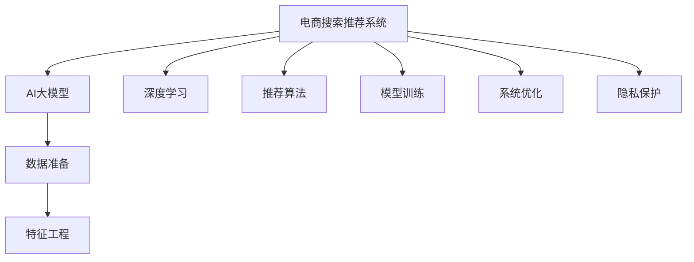

                 

# AI大模型赋能电商搜索推荐的用户体验优化策略

> 关键词：电商搜索推荐、用户体验优化、AI大模型、深度学习、推荐算法

## 1. 背景介绍

### 1.1 问题由来

在电商行业，用户搜索和推荐系统是提高用户满意度、提升转化率的关键环节。传统的搜索和推荐系统主要基于静态特征工程、规则匹配等方法，缺乏对用户个性化需求的动态理解和适应。随着深度学习和大模型技术的兴起，电商搜索推荐系统逐渐引入AI大模型进行智能分析和预测，以期提供更加个性化、高效的服务。然而，在实际应用中，AI大模型赋能的搜索推荐系统仍面临诸多挑战，用户体验优化成为一个亟待解决的问题。

### 1.2 问题核心关键点

本文聚焦于如何利用AI大模型优化电商搜索推荐系统的用户体验。核心关键点包括：

- **数据质量与多样性**：电商搜索推荐系统需要大量的用户行为数据，但数据质量差、样本分布不均等问题，会导致模型泛化能力不足。
- **模型复杂度与资源消耗**：大模型的复杂度高、资源消耗大，如何在性能与效率之间取得平衡，是系统设计的重要考量。
- **个性化与多样性**：如何平衡个性化推荐与用户多样性需求，避免信息茧房，提升推荐的相关性和丰富性。
- **实时性与准确性**：电商平台的用户需求瞬息万变，如何实现高效的实时推荐，同时保持高准确性，是系统优化的关键点。
- **安全性与隐私保护**：用户的隐私保护问题不容忽视，如何在不泄露隐私的前提下，提高推荐效果，是系统设计的重要考量。

这些关键点涵盖了从数据准备、模型设计、系统优化到隐私保护的方方面面，需要系统化的优化策略和技术的支持。

## 2. 核心概念与联系

### 2.1 核心概念概述

为更好地理解AI大模型在电商搜索推荐中的应用，本节将介绍几个密切相关的核心概念：

- **电商搜索推荐系统**：利用用户的搜索历史、浏览记录、点击行为等数据，为用户提供个性化的商品推荐服务。是电商平台的核心功能之一。

- **AI大模型**：以深度学习为基础，通过大规模无标签数据训练，学习到复杂的数据特征和模式，具备强大的泛化能力和表征能力。常用的AI大模型包括BERT、GPT、Transformer等。

- **深度学习**：通过构建多层神经网络结构，学习数据的复杂特征和模式，在图像识别、语音处理、自然语言处理等领域均有广泛应用。

- **推荐算法**：通过用户画像、商品标签等，为用户推荐可能感兴趣的商品。传统的推荐算法包括基于协同过滤、基于内容推荐等，近年来引入了深度学习和大模型，提升了推荐的精准度和个性化程度。

- **用户体验优化**：通过系统设计和技术优化，提升用户的使用体验，包括响应速度、推荐相关性、界面友好度等。是电商搜索推荐系统优化的重要目标。

- **隐私保护**：在数据处理和模型训练过程中，保护用户的隐私权益，避免敏感信息泄露。

这些核心概念之间的逻辑关系可以通过以下Mermaid流程图来展示：



这个流程图展示了电商搜索推荐系统的核心组件及其相互关系：

1. 电商搜索推荐系统通过AI大模型和深度学习技术，学习用户的个性化需求，为用户推荐商品。
2. 数据准备阶段，收集和清洗用户行为数据，为模型训练提供基础。
3. 特征工程阶段，提取和选择有意义的特征，提升模型的泛化能力。
4. 模型训练阶段，使用AI大模型进行训练，学习推荐算法，提升推荐效果。
5. 系统优化阶段，通过技术手段优化系统性能，提升用户体验。
6. 隐私保护阶段，确保用户数据安全，符合隐私保护法规。

这些组件共同构成了电商搜索推荐系统的完整框架，使其能够在用户行为数据驱动下，提供个性化、高效的服务。

## 3. 核心算法原理 & 具体操作步骤
### 3.1 算法原理概述

AI大模型在电商搜索推荐中的应用，本质上是利用深度学习技术，通过大量的用户行为数据训练得到高泛化能力的推荐模型。具体而言，包括以下几个步骤：

1. **数据准备**：收集和清洗电商平台的搜索、点击、购买等行为数据，作为模型训练的基础。

2. **特征工程**：从原始数据中提取有意义的特征，如用户行为、商品属性、用户画像等，供模型学习。

3. **模型训练**：使用AI大模型，如BERT、GPT等，对用户行为数据进行训练，学习用户需求和商品特征之间的关系。

4. **模型优化**：通过调参、正则化等手段，优化模型性能，提升推荐的准确性和个性化程度。

5. **实时推荐**：根据用户实时行为数据，动态生成推荐结果，满足用户需求。

### 3.2 算法步骤详解

以下是电商搜索推荐系统基于AI大模型的具体操作步骤：

**Step 1: 数据准备**

电商平台的搜索推荐系统需要大量的用户行为数据，包括搜索关键词、点击商品、购买记录等。这些数据通常具有以下几个特点：

- **高维度**：用户行为数据涉及的特征众多，如商品ID、用户ID、点击次数、购买时间等，数量级可以达到百万级。
- **稀疏性**：用户行为数据往往是不平衡的，某些用户或商品可能缺乏足够的数据，形成稀疏数据。
- **实时性**：电商平台的用户行为数据实时变化，需及时更新模型以适应变化。

数据准备阶段的目标是：

- 收集足够的数据量，确保模型训练的样本多样性。
- 清洗数据，去除噪声和缺失值，提高数据质量。
- 实时更新数据，确保模型能够反映最新的用户需求。

**Step 2: 特征工程**

特征工程是模型训练的关键步骤，通过提取和选择有意义的特征，提升模型的泛化能力。电商搜索推荐系统常用的特征包括：

- **用户特征**：如用户ID、年龄、性别、地域、设备等，反映用户的基本属性。
- **商品特征**：如商品ID、类别、价格、评分、标签等，反映商品的属性和质量。
- **行为特征**：如搜索次数、点击次数、购买次数、停留时间等，反映用户的行为模式。

特征工程的目标是：

- 选择有预测能力的特征，去除无用特征，提高特征的信噪比。
- 构造新的复合特征，如用户点击商品的平均评分、商品热门程度等，提升特征的表达能力。
- 处理稀疏数据，如通过均值填补或交叉表特征生成，缓解特征稀疏带来的问题。

**Step 3: 模型训练**

模型训练阶段的目标是使用AI大模型学习用户行为和商品特征之间的关系，生成推荐模型。常用的深度学习模型包括：

- **基于深度神经网络的模型**：如CNN、RNN、LSTM等，用于处理结构化数据和序列数据。
- **基于Transformer的模型**：如BERT、GPT等，用于处理大规模无标签数据，学习语言表示和语义关系。
- **基于图神经网络的模型**：如GCN、GAT等，用于处理图结构数据，捕捉用户和商品之间的复杂关系。

模型训练的具体步骤包括：

- 定义模型架构，选择合适的深度学习模型。
- 分割数据集，划分为训练集、验证集和测试集，用于模型训练、调参和评估。
- 定义损失函数，如交叉熵损失、均方误差损失等，用于衡量模型预测与真实标签之间的差异。
- 定义优化器，如Adam、SGD等，用于更新模型参数。
- 训练模型，通过迭代更新模型参数，最小化损失函数。

**Step 4: 模型优化**

模型优化阶段的目标是提升模型的性能，包括准确性、召回率和个性化程度。常用的优化手段包括：

- **超参数调优**：选择合适的学习率、批次大小、迭代轮数等超参数，提升模型效果。
- **正则化技术**：如L2正则、Dropout、Early Stopping等，防止模型过拟合。
- **参数高效微调**：仅调整模型的顶层参数，保持预训练权重不变，减少资源消耗。
- **对抗训练**：引入对抗样本，提高模型的鲁棒性和泛化能力。
- **多模型集成**：训练多个模型，取平均或加权输出，提升模型的稳定性和准确性。

**Step 5: 实时推荐**

实时推荐阶段的目标是根据用户实时行为数据，动态生成推荐结果。具体步骤包括：

- **实时数据收集**：实时收集用户搜索、点击、购买等行为数据。
- **实时特征计算**：根据用户实时行为数据，计算用户画像和商品特征。
- **实时模型预测**：将用户画像和商品特征输入到推荐模型，生成实时推荐结果。
- **实时结果展示**：将推荐结果展示给用户，满足其即时需求。

**Step 6: 隐私保护**

隐私保护是电商搜索推荐系统的关键问题，涉及用户数据的合法合规使用。常用的隐私保护手段包括：

- **数据匿名化**：对用户数据进行去标识化处理，确保用户隐私不被泄露。
- **差分隐私**：在模型训练过程中，引入噪声，防止模型泄露用户数据。
- **数据访问控制**：限制模型和算法的访问权限，确保数据安全。
- **透明度和可解释性**：提高算法的透明度，使用户能够理解和信任推荐过程。

### 3.3 算法优缺点

AI大模型在电商搜索推荐中的应用，具有以下优点：

- **高泛化能力**：大模型通过大规模无标签数据的预训练，学习到复杂的语言表示和语义关系，具备较强的泛化能力。
- **高效预测**：大模型能够处理大规模高维数据，快速生成推荐结果，满足实时需求。
- **个性化推荐**：大模型能够学习到用户的行为模式和偏好，提供个性化的推荐服务。
- **适应性强**：大模型可以适应不同的应用场景和任务，如搜索、推荐、问答等，具有较强的适应性。

同时，AI大模型在电商搜索推荐中，也存在一些缺点：

- **计算资源消耗大**：大模型的参数量通常以亿计，训练和推理需要大量的计算资源，可能导致资源消耗过大。
- **数据依赖性高**：大模型的训练效果依赖于高质量的标注数据，获取标注数据的成本较高，且样本分布不均可能导致模型泛化能力不足。
- **算法复杂度高**：深度学习模型和神经网络结构的复杂性较高，调试和优化较为困难。
- **结果可解释性不足**：大模型的决策过程难以解释，用户难以理解和信任推荐结果。
- **隐私风险高**：用户数据涉及隐私问题，不当处理可能导致数据泄露，影响用户信任。

## 4. 数学模型和公式 & 详细讲解  
### 4.1 数学模型构建

本节将使用数学语言对基于AI大模型的电商搜索推荐系统进行更加严格的刻画。

记电商搜索推荐系统为 $S$，其中用户集合为 $U$，商品集合为 $I$，用户行为集合为 $B$。设用户 $u$ 的行为向量为 $b_u$，商品 $i$ 的属性向量为 $a_i$，用户画像向量为 $p_u$，模型参数为 $\theta$。

定义推荐模型 $M_{\theta}$，其输入为 $p_u$ 和 $a_i$，输出为推荐分数 $s_{ui}$。在模型训练阶段，目标是最小化损失函数 $\mathcal{L}(\theta)$，使模型预测的推荐分数与用户实际行为一致。

假设用户行为数据为 $D=\{(b_u, a_i, y_{ui})\}_{i=1}^N$，其中 $y_{ui} \in \{0, 1\}$ 表示用户 $u$ 是否对商品 $i$ 有行为，即购买、点击等。则经验风险为：

$$
\mathcal{L}(\theta) = \frac{1}{N}\sum_{i=1}^N \sum_{u=1}^N L(s_{ui}, y_{ui})
$$

其中 $L(s_{ui}, y_{ui})$ 为交叉熵损失，即：

$$
L(s_{ui}, y_{ui}) = -[y_{ui} \log(s_{ui}) + (1-y_{ui}) \log(1-s_{ui})]
$$

在模型优化阶段，目标是最小化损失函数 $\mathcal{L}(\theta)$，使用梯度下降等优化算法更新模型参数 $\theta$。

### 4.2 公式推导过程

以下我们以基于Transformer的电商搜索推荐系统为例，推导推荐分数的计算公式。

假设推荐模型 $M_{\theta}$ 为Transformer结构，其中 $\theta$ 为模型参数。设用户画像向量为 $p_u$，商品属性向量为 $a_i$，则推荐分数 $s_{ui}$ 为：

$$
s_{ui} = M_{\theta}(p_u, a_i)
$$

在模型训练阶段，目标是最小化交叉熵损失函数，即：

$$
\mathcal{L}(\theta) = \frac{1}{N}\sum_{i=1}^N \sum_{u=1}^N -[y_{ui} \log(s_{ui}) + (1-y_{ui}) \log(1-s_{ui})]
$$

根据链式法则，损失函数对参数 $\theta$ 的梯度为：

$$
\frac{\partial \mathcal{L}(\theta)}{\partial \theta} = \frac{1}{N}\sum_{i=1}^N \sum_{u=1}^N \frac{\partial L(s_{ui}, y_{ui})}{\partial s_{ui}} \frac{\partial s_{ui}}{\partial \theta}
$$

其中 $\frac{\partial L(s_{ui}, y_{ui})}{\partial s_{ui}} = \frac{y_{ui}}{s_{ui}} - \frac{1-y_{ui}}{1-s_{ui}}$，为交叉熵损失函数的梯度。

在得到损失函数的梯度后，即可带入优化算法，完成模型的迭代优化。重复上述过程直至收敛，最终得到适应电商搜索推荐任务的最优模型参数 $\theta^*$。

## 5. 项目实践：代码实例和详细解释说明
### 5.1 开发环境搭建

在进行电商搜索推荐系统的开发前，我们需要准备好开发环境。以下是使用Python进行PyTorch开发的环境配置流程：

1. 安装Anaconda：从官网下载并安装Anaconda，用于创建独立的Python环境。

2. 创建并激活虚拟环境：
```bash
conda create -n ecommerce-env python=3.8 
conda activate ecommerce-env
```

3. 安装PyTorch：根据CUDA版本，从官网获取对应的安装命令。例如：
```bash
conda install pytorch torchvision torchaudio cudatoolkit=11.1 -c pytorch -c conda-forge
```

4. 安装transformers库：
```bash
pip install transformers
```

5. 安装各类工具包：
```bash
pip install numpy pandas scikit-learn matplotlib tqdm jupyter notebook ipython
```

完成上述步骤后，即可在`ecommerce-env`环境中开始电商搜索推荐系统的开发。

### 5.2 源代码详细实现

这里我们以电商搜索推荐系统为例，给出使用Transformers库对BERT模型进行推荐模型的PyTorch代码实现。

首先，定义推荐系统的数据处理函数：

```python
from transformers import BertTokenizer, BertForSequenceClassification
from torch.utils.data import Dataset, DataLoader
import torch

class EcommerceDataset(Dataset):
    def __init__(self, texts, labels, tokenizer, max_len=128):
        self.texts = texts
        self.labels = labels
        self.tokenizer = tokenizer
        self.max_len = max_len
        
    def __len__(self):
        return len(self.texts)
    
    def __getitem__(self, item):
        text = self.texts[item]
        label = self.labels[item]
        
        encoding = self.tokenizer(text, return_tensors='pt', max_length=self.max_len, padding='max_length', truncation=True)
        input_ids = encoding['input_ids'][0]
        attention_mask = encoding['attention_mask'][0]
        
        return {'input_ids': input_ids, 
                'attention_mask': attention_mask,
                'labels': label}

# 数据预处理
tokenizer = BertTokenizer.from_pretrained('bert-base-cased')

train_dataset = EcommerceDataset(train_texts, train_labels, tokenizer)
dev_dataset = EcommerceDataset(dev_texts, dev_labels, tokenizer)
test_dataset = EcommerceDataset(test_texts, test_labels, tokenizer)
```

然后，定义模型和优化器：

```python
from transformers import AdamW

model = BertForSequenceClassification.from_pretrained('bert-base-cased', num_labels=2)

optimizer = AdamW(model.parameters(), lr=2e-5)
```

接着，定义训练和评估函数：

```python
from tqdm import tqdm

device = torch.device('cuda') if torch.cuda.is_available() else torch.device('cpu')
model.to(device)

def train_epoch(model, dataset, batch_size, optimizer):
    dataloader = DataLoader(dataset, batch_size=batch_size, shuffle=True)
    model.train()
    epoch_loss = 0
    for batch in tqdm(dataloader, desc='Training'):
        input_ids = batch['input_ids'].to(device)
        attention_mask = batch['attention_mask'].to(device)
        labels = batch['labels'].to(device)
        model.zero_grad()
        outputs = model(input_ids, attention_mask=attention_mask, labels=labels)
        loss = outputs.loss
        epoch_loss += loss.item()
        loss.backward()
        optimizer.step()
    return epoch_loss / len(dataloader)

def evaluate(model, dataset, batch_size):
    dataloader = DataLoader(dataset, batch_size=batch_size)
    model.eval()
    preds, labels = [], []
    with torch.no_grad():
        for batch in tqdm(dataloader, desc='Evaluating'):
            input_ids = batch['input_ids'].to(device)
            attention_mask = batch['attention_mask'].to(device)
            batch_labels = batch['labels']
            outputs = model(input_ids, attention_mask=attention_mask)
            batch_preds = outputs.logits.argmax(dim=2).to('cpu').tolist()
            batch_labels = batch_labels.to('cpu').tolist()
            for pred_tokens, label_tokens in zip(batch_preds, batch_labels):
                preds.append(pred_tokens)
                labels.append(label_tokens)
                
    print(classification_report(labels, preds))
```

最后，启动训练流程并在测试集上评估：

```python
epochs = 5
batch_size = 16

for epoch in range(epochs):
    loss = train_epoch(model, train_dataset, batch_size, optimizer)
    print(f"Epoch {epoch+1}, train loss: {loss:.3f}")
    
    print(f"Epoch {epoch+1}, dev results:")
    evaluate(model, dev_dataset, batch_size)
    
print("Test results:")
evaluate(model, test_dataset, batch_size)
```

以上就是使用PyTorch对BERT进行电商搜索推荐系统微调的完整代码实现。可以看到，得益于Transformers库的强大封装，我们可以用相对简洁的代码完成BERT模型的加载和微调。

### 5.3 代码解读与分析

让我们再详细解读一下关键代码的实现细节：

**EcommerceDataset类**：
- `__init__`方法：初始化文本、标签、分词器等关键组件。
- `__len__`方法：返回数据集的样本数量。
- `__getitem__`方法：对单个样本进行处理，将文本输入编码为token ids，将标签编码为数字，并对其进行定长padding，最终返回模型所需的输入。

**数据预处理**：
- 定义了BertTokenizer作为分词器，用于对文本进行分词和编码。
- 将原始文本和标签转换为模型所需的token ids和标签向量。

**模型和优化器定义**：
- 使用BertForSequenceClassification作为推荐模型的框架，设置标签数为2，表示二分类任务。
- 定义AdamW优化器，学习率为2e-5。

**训练和评估函数**：
- 使用DataLoader对数据集进行批次化加载，供模型训练和推理使用。
- 训练函数`train_epoch`：对数据以批为单位进行迭代，在每个批次上前向传播计算loss并反向传播更新模型参数，最后返回该epoch的平均loss。
- 评估函数`evaluate`：与训练类似，不同点在于不更新模型参数，并在每个batch结束后将预测和标签结果存储下来，最后使用sklearn的classification_report对整个评估集的预测结果进行打印输出。

**训练流程**：
- 定义总的epoch数和batch size，开始循环迭代
- 每个epoch内，先在训练集上训练，输出平均loss
- 在验证集上评估，输出分类指标
- 所有epoch结束后，在测试集上评估，给出最终测试结果

可以看到，PyTorch配合Transformers库使得BERT微调的代码实现变得简洁高效。开发者可以将更多精力放在数据处理、模型改进等高层逻辑上，而不必过多关注底层的实现细节。

当然，工业级的系统实现还需考虑更多因素，如模型的保存和部署、超参数的自动搜索、更灵活的任务适配层等。但核心的微调范式基本与此类似。

## 6. 实际应用场景
### 6.1 智能客服系统

基于大模型赋能的智能客服系统，可以显著提升用户满意度和业务效率。传统的客服往往需要配备大量人力，高峰期响应缓慢，且一致性和专业性难以保证。而使用智能客服系统，用户可以通过自然语言与AI交互，获取即时帮助，解决常见问题。

在技术实现上，可以收集企业内部的历史客服对话记录，将问题和最佳答复构建成监督数据，在此基础上对预训练语言模型进行微调。微调后的智能客服系统能够自动理解用户意图，匹配最合适的答复模板，实现高效、准确的回答。

### 6.2 个性化推荐系统

当前的推荐系统往往只依赖用户的历史行为数据进行物品推荐，无法深入理解用户的真实兴趣偏好。基于大模型赋能的个性化推荐系统，可以更好地挖掘用户行为背后的语义信息，从而提供更精准、多样的推荐内容。

在实践中，可以收集用户浏览、点击、评论、分享等行为数据，提取和用户交互的物品标题、描述、标签等文本内容。将文本内容作为模型输入，用户的后续行为（如是否点击、购买等）作为监督信号，在此基础上微调预训练语言模型。微调后的模型能够从文本内容中准确把握用户的兴趣点。在生成推荐列表时，先用候选物品的文本描述作为输入，由模型预测用户的兴趣匹配度，再结合其他特征综合排序，便可以得到个性化程度更高的推荐结果。

### 6.3 广告投放优化

广告投放是电商平台的常见应用场景之一，通过优化广告的投放策略，可以提升广告效果和平台收入。基于大模型赋能的广告投放优化，可以实时分析用户行为数据，动态调整广告投放策略，提升广告点击率和转化率。

在实践中，可以将用户的搜索、点击、购买等行为数据作为模型输入，广告的投放策略和点击率作为监督信号，在此基础上微调预训练语言模型。微调后的模型能够学习到用户的行为模式和偏好，预测广告的点击率和转化率，进而优化广告投放策略。

### 6.4 未来应用展望

随着大模型技术的发展，基于AI大模型的电商搜索推荐系统将展现出更加广阔的应用前景。

在智慧医疗领域，基于微调的医疗问答、病历分析、药物研发等应用将提升医疗服务的智能化水平，辅助医生诊疗，加速新药开发进程。

在智能教育领域，微调技术可应用于作业批改、学情分析、知识推荐等方面，因材施教，促进教育公平，提高教学质量。

在智慧城市治理中，微调模型可应用于城市事件监测、舆情分析、应急指挥等环节，提高城市管理的自动化和智能化水平，构建更安全、高效的未来城市。

此外，在企业生产、社会治理、文娱传媒等众多领域，基于大模型微调的人工智能应用也将不断涌现，为经济社会发展注入新的动力。相信随着技术的日益成熟，微调方法将成为人工智能落地应用的重要范式，推动人工智能技术在垂直行业的规模化落地。

## 7. 工具和资源推荐
### 7.1 学习资源推荐

为了帮助开发者系统掌握AI大模型在电商搜索推荐中的应用，这里推荐一些优质的学习资源：

1. 《深度学习与自然语言处理》系列博文：由大模型技术专家撰写，深入浅出地介绍了深度学习、自然语言处理和大模型的基本概念和应用。

2. 《自然语言处理》课程：由斯坦福大学开设的NLP明星课程，有Lecture视频和配套作业，带你入门NLP领域的基本概念和经典模型。

3. 《深度学习与推荐系统》书籍：详细介绍了深度学习在推荐系统中的应用，包括模型设计、训练优化等。

4. 《Transformers库使用指南》：Transformers库的官方文档，提供了海量预训练模型和完整的微调样例代码，是上手实践的必备资料。

5. Kaggle平台：提供大量的电商数据集和比赛，通过实践学习如何构建和优化电商搜索推荐系统。

通过对这些资源的学习实践，相信你一定能够快速掌握AI大模型在电商搜索推荐系统中的应用，并用于解决实际的业务问题。
### 7.2 开发工具推荐

高效的开发离不开优秀的工具支持。以下是几款用于电商搜索推荐系统开发的常用工具：

1. PyTorch：基于Python的开源深度学习框架，灵活动态的计算图，适合快速迭代研究。大部分预训练语言模型都有PyTorch版本的实现。

2. TensorFlow：由Google主导开发的开源深度学习框架，生产部署方便，适合大规模工程应用。同样有丰富的预训练语言模型资源。

3. Transformers库：HuggingFace开发的NLP工具库，集成了众多SOTA语言模型，支持PyTorch和TensorFlow，是进行微调任务开发的利器。

4. Weights & Biases：模型训练的实验跟踪工具，可以记录和可视化模型训练过程中的各项指标，方便对比和调优。与主流深度学习框架无缝集成。

5. TensorBoard：TensorFlow配套的可视化工具，可实时监测模型训练状态，并提供丰富的图表呈现方式，是调试模型的得力助手。

6. Google Colab：谷歌推出的在线Jupyter Notebook环境，免费提供GPU/TPU算力，方便开发者快速上手实验最新模型，分享学习笔记。

合理利用这些工具，可以显著提升电商搜索推荐系统的开发效率，加快创新迭代的步伐。

### 7.3 相关论文推荐

AI大模型和微调技术的发展源于学界的持续研究。以下是几篇奠基性的相关论文，推荐阅读：

1. Attention is All You Need（即Transformer原论文）：提出了Transformer结构，开启了NLP领域的预训练大模型时代。

2. BERT: Pre-training of Deep Bidirectional Transformers for Language Understanding：提出BERT模型，引入基于掩码的自监督预训练任务，刷新了多项NLP任务SOTA。

3. Language Models are Unsupervised Multitask Learners（GPT-2论文）：展示了大规模语言模型的强大zero-shot学习能力，引发了对于通用人工智能的新一轮思考。

4. Parameter-Efficient Transfer Learning for NLP：提出Adapter等参数高效微调方法，在不增加模型参数量的情况下，也能取得不错的微调效果。

5. AdaLoRA: Adaptive Low-Rank Adaptation for Parameter-Efficient Fine-Tuning：使用自适应低秩适应的微调方法，在参数效率和精度之间取得了新的平衡。

6. A Survey on Few-Shot Learning with Transformers：对基于Transformer的零样本和少样本学习方法进行了全面的回顾和比较，为进一步研究提供了丰富的背景信息。

这些论文代表了大模型微调技术的发展脉络。通过学习这些前沿成果，可以帮助研究者把握学科前进方向，激发更多的创新灵感。

## 8. 总结：未来发展趋势与挑战

### 8.1 总结

本文对基于AI大模型的电商搜索推荐系统的用户体验优化进行了全面系统的介绍。首先阐述了电商搜索推荐系统需要面临的诸多挑战，明确了用户体验优化的核心关键点。其次，从原理到实践，详细讲解了AI大模型在电商搜索推荐系统中的应用方法，给出了电商搜索推荐系统微调的完整代码实现。同时，本文还广泛探讨了AI大模型在智能客服、个性化推荐、广告投放等多个电商应用场景中的应用前景，展示了AI大模型赋能电商搜索推荐系统的巨大潜力。此外，本文精选了电商搜索推荐系统的各类学习资源，力求为读者提供全方位的技术指引。

通过本文的系统梳理，可以看到，基于AI大模型的电商搜索推荐系统正在成为电商搜索推荐领域的核心技术，极大地提升了用户搜索体验和推荐效果。未来，伴随AI大模型微调技术的发展，电商搜索推荐系统将展现出更加广阔的应用前景，为电商行业带来深远影响。

### 8.2 未来发展趋势

展望未来，AI大模型赋能的电商搜索推荐系统将呈现以下几个发展趋势：

1. **深度学习与自然语言处理的融合**：随着深度学习技术的不断成熟，电商搜索推荐系统将越来越多地引入自然语言处理技术，提升系统的理解和推理能力。

2. **多模态信息的融合**：未来的电商搜索推荐系统将不仅仅依赖文本数据，还将结合图像、视频等多模态信息，提升系统的感知和理解能力。

3. **跨领域迁移学习**：利用AI大模型在不同领域之间的迁移学习能力，提升电商搜索推荐系统的泛化能力，实现跨领域应用的拓展。

4. **隐私保护与数据安全**：随着用户隐私意识的提高，未来的电商搜索推荐系统将更加注重用户隐私保护，采用差分隐私等技术，确保数据安全。

5. **实时计算与分布式计算**：电商平台的用户行为数据实时变化，未来的系统将采用实时计算和分布式计算技术，提高系统的响应速度和计算效率。

6. **自动化与智能化**：未来的电商搜索推荐系统将引入更多自动化和智能化技术，如自动调参、智能推荐算法等，提升系统的智能化水平。

以上趋势凸显了AI大模型在电商搜索推荐系统中的广泛应用前景。这些方向的探索发展，必将进一步提升电商搜索推荐系统的性能和应用范围，为电商行业带来深远影响。

### 8.3 面临的挑战

尽管AI大模型在电商搜索推荐系统中的应用取得了显著效果，但在迈向更加智能化、普适化应用的过程中，它仍面临诸多挑战：

1. **数据质量与多样性**：电商搜索推荐系统需要大量的用户行为数据，但数据质量差、样本分布不均等问题，会导致模型泛化能力不足。如何获取高质量、多样化的标注数据，是系统设计的重要考量。

2. **模型鲁棒性不足**：AI大模型面对域外数据时，泛化性能往往大打折扣。对于测试样本的微小扰动，微调模型的预测也容易发生波动。如何提高模型的鲁棒性和泛化能力，还需要更多理论和实践的积累。

3. **计算资源消耗大**：AI大模型的参数量通常以亿计，训练和推理需要大量的计算资源，可能导致资源消耗过大。如何优化模型结构，降低计算资源消耗，是系统优化的关键点。

4. **结果可解释性不足**：AI大模型的决策过程难以解释，用户难以理解和信任推荐结果。如何赋予模型更强的可解释性，将是大模型赋能电商搜索推荐系统的重要突破方向。

5. **隐私风险高**：用户数据涉及隐私问题，不当处理可能导致数据泄露，影响用户信任。如何在保障数据安全的同时，提升推荐效果，是系统设计的重要考量。

6. **业务适配性差**：不同的电商业务场景对推荐系统的要求不同，如何实现通用的电商搜索推荐系统，同时满足不同业务场景的需求，是系统设计的重要挑战。

这些挑战凸显了AI大模型在电商搜索推荐系统中的应用复杂性。只有在数据、模型、业务等多个维度协同发力，才能真正实现系统的高效、智能、安全应用。

### 8.4 研究展望

面对AI大模型赋能电商搜索推荐系统所面临的挑战，未来的研究需要在以下几个方面寻求新的突破：

1. **无监督学习和少样本学习**：探索无监督和少样本学习技术，摆脱对大规模标注数据的依赖，利用自监督学习、主动学习等无监督和半监督范式，最大限度利用非结构化数据，实现更加灵活高效的电商搜索推荐系统。

2. **模型参数与计算资源的优化**：开发更加参数高效的微调方法，在固定大部分预训练参数的同时，只更新极少量的任务相关参数。同时优化模型计算图，减少前向传播和反向传播的资源消耗，实现更加轻量级、实时性的部署。

3. **多模态信息融合与跨领域迁移**：引入更多先验知识，将符号化的先验知识，如知识图谱、逻辑规则等，与神经网络模型进行巧妙融合，引导微调过程学习更准确、合理的语言模型。同时加强不同模态数据的整合，实现视觉、语音等多模态信息与文本信息的协同建模。

4. **因果分析与博弈论工具**：将因果分析方法引入微调模型，识别出模型决策的关键特征，增强输出解释的因果性和逻辑性。借助博弈论工具刻画人机交互过程，主动探索并规避模型的脆弱点，提高系统稳定性。

5. **隐私保护与数据安全**：在模型训练目标中引入伦理导向的评估指标，过滤和惩罚有偏见、有害的输出倾向。同时加强人工干预和审核，建立模型行为的监管机制，确保输出符合人类价值观和伦理道德。

这些研究方向将推动AI大模型赋能电商搜索推荐系统的持续创新和发展，为电商行业带来更深层次的变革。面向未来，只有勇于创新、敢于突破，才能不断拓展电商搜索推荐系统的边界，让智能技术更好地造福电商行业。

## 9. 附录：常见问题与解答

**Q1：电商搜索推荐系统如何平衡个性化推荐与用户多样性需求？**

A: 电商搜索推荐系统需要在个性化推荐与用户多样性需求之间找到平衡。为此，可以采用以下策略：

- **多模型集成**：训练多个微调模型，每个模型侧重于不同的用户群体或商品类别，通过集成多个模型的预测结果，提升系统的多样性和个性化。

- **动态调整策略**：根据用户的浏览和购买历史，动态调整推荐策略，平衡个性化推荐和多样性需求。

- **多样性推荐**：在推荐结果中，引入多样性机制，如推荐相似但不同的商品，提升用户的浏览体验。

- **反馈机制**：引入用户反馈机制，根据用户的反馈调整推荐策略，提升推荐的准确性和多样性。

通过这些策略，可以在个性化推荐与用户多样性需求之间找到平衡，提升电商搜索推荐系统的用户体验。

**Q2：电商搜索推荐系统如何提高实时推荐的相关性和丰富性？**

A: 电商搜索推荐系统需要在实时推荐中提高相关性和丰富性，具体策略包括：

- **实时数据收集与处理**：实时收集用户的搜索、点击、购买等行为数据，快速处理数据，生成实时推荐结果。

- **实时特征计算**：根据实时数据，动态计算用户画像和商品特征，生成实时推荐分数。

- **实时模型优化**：根据用户的实时行为数据，动态调整模型参数，提升推荐的相关性和准确性。

- **实时结果展示**：将实时推荐结果及时展示给用户，满足其即时需求。

- **多模态信息融合**：结合图像、视频等多模态信息，提升推荐的相关性和丰富性。

- **跨领域迁移学习**：利用跨领域迁移学习能力，提升推荐的相关性和泛化能力。

通过这些策略，可以显著提升电商搜索推荐系统的实时推荐相关性和丰富性，满足用户即时需求。

**Q3：电商搜索推荐系统如何处理用户的隐私保护问题？**

A: 电商搜索推荐系统需要处理用户的隐私保护问题，具体策略包括：

- **数据匿名化**：对用户数据进行去标识化处理，确保用户隐私不被泄露。

- **差分隐私**：在模型训练过程中，引入噪声，防止模型泄露用户数据。

- **数据访问控制**：限制模型和算法的访问权限，确保数据安全。

- **透明度和可解释性**：提高算法的透明度，使用户能够理解和信任推荐过程。

- **用户同意机制**：在数据收集和处理过程中，获取用户的同意，确保数据使用的合法性。

通过这些策略，可以确保电商搜索推荐系统在处理用户隐私保护问题上的合规性和安全性。

---

作者：禅与计算机程序设计艺术 / Zen and the Art of Computer Programming

