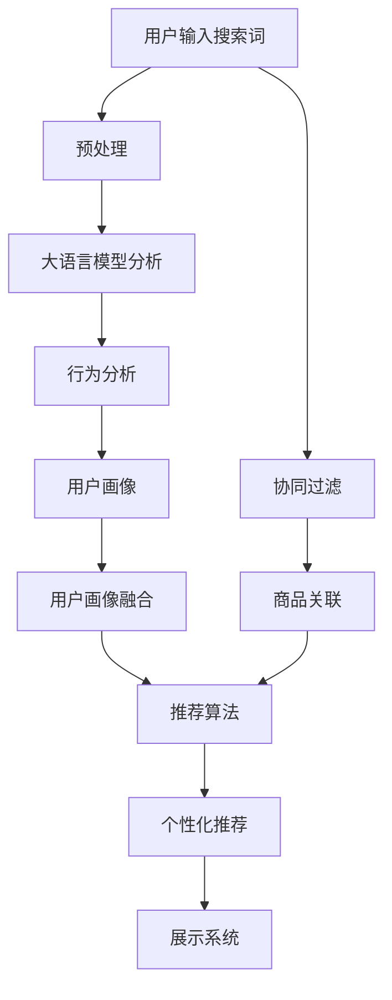

                 

# AI大模型重塑电商搜索推荐的未来

> 关键词：大语言模型,搜索推荐,电商,深度学习,强化学习,用户行为分析,个性化推荐系统

## 1. 背景介绍

### 1.1 问题由来
随着电子商务的飞速发展，电商搜索推荐系统已经成为了消费者购物的重要决策工具。然而，传统的搜索推荐系统往往难以充分理解消费者的购物需求和偏好，容易陷入推荐同质化、用户满意度和转化率低下的困境。随着大语言模型（Large Language Models, LLMs）的崛起，通过深度学习与自然语言处理相结合，为电商搜索推荐系统带来了革命性的变革。

## 2. 核心概念与联系

### 2.1 核心概念概述

1. **大语言模型（LLMs）**：指通过大规模预训练数据（如文本语料）构建的能够理解自然语言的模型。常用的模型包括GPT-3、BERT等。

2. **电商搜索推荐系统**：利用算法分析用户行为数据，提供精准的产品推荐，提升用户购物体验的电商平台功能模块。

3. **深度学习（Deep Learning）**：一种基于人工神经网络技术的机器学习范式，能够处理高维数据，提取复杂特征。

4. **强化学习（Reinforcement Learning, RL）**：通过试错、奖励反馈机制，使模型逐步学习到最优策略的机器学习范式。

5. **用户行为分析**：对用户在电商平台上的行为数据进行建模和分析，以获取用户兴趣、购买意向等信息。

6. **个性化推荐系统**：根据用户行为数据，为用户定制个性化的推荐内容，提升用户满意度和转化率。

7. **协同过滤（Collaborative Filtering）**：基于用户历史行为数据，预测用户对未知商品的偏好，进行推荐。

8. **基于内容的推荐（Content-based Recommendation）**：根据用户对商品属性（如颜色、尺寸等）的偏好，推荐相似商品。

9. **混合推荐系统（Hybrid Recommendation Systems）**：结合多种推荐技术，如协同过滤、基于内容的推荐、深度学习等，构建更全面、准确的推荐系统。

这些核心概念共同构成了电商搜索推荐系统的技术框架，其应用实践有望通过大语言模型的引入，实现显著的性能提升和用户体验优化。

### 2.2 核心概念原理和架构的 Mermaid 流程图



此流程图展示了基于大语言模型的电商搜索推荐系统的工作流程。用户输入搜索词后，首先进行预处理和语言模型分析，结合用户行为分析，构建用户画像。通过画像融合，推荐算法可以得到更精准的个性化推荐，最终展示给用户。

## 3. 核心算法原理 & 具体操作步骤

### 3.1 算法原理概述

基于大语言模型的电商搜索推荐系统，利用大模型的语言理解和生成能力，通过深度学习和强化学习技术，对用户行为进行建模，提供个性化的商品推荐。其核心思想在于：

1. **用户意图的理解与分析**：通过预训练的大语言模型，分析用户搜索词中的隐含意图，构建用户画像。
2. **商品描述的解析与匹配**：利用语言模型对商品描述进行语义理解，提取商品的关键属性。
3. **个性化推荐**：根据用户画像和商品属性，通过强化学习等技术，预测用户对商品的兴趣度，实现精准推荐。
4. **用户反馈循环**：基于用户对推荐结果的反馈，进一步优化推荐策略，提升推荐效果。

### 3.2 算法步骤详解

**Step 1: 数据收集与预处理**

电商平台需要收集用户浏览、点击、购买等行为数据，并对数据进行清洗和预处理。常见的预处理方式包括：

1. **去重与归一化**：去除重复数据，统一数据格式。
2. **特征提取**：提取商品标题、描述、价格等关键属性，生成特征向量。
3. **时间窗口划分**：根据时间间隔，将历史数据划分为多个时间窗口，用于训练模型。

**Step 2: 用户意图的分析与理解**

利用大语言模型对用户搜索词进行分析，识别出用户的潜在需求和意图。具体步骤包括：

1. **语言模型的编码**：将搜索词输入大语言模型，编码成向量表示。
2. **意图分类**：利用预训练的分类模型（如BERT）对编码向量进行意图分类，识别出用户的购物需求（如查询商品信息、查找评价等）。
3. **上下文理解**：通过上下文相关的语义分析，进一步理解搜索词的详细含义。

**Step 3: 用户画像的构建与融合**

根据用户的搜索历史和行为数据，构建用户画像，并将用户画像与商品属性进行融合。具体步骤包括：

1. **行为特征提取**：从用户行为数据中提取关键词和行为序列，生成行为向量。
2. **用户画像构建**：将行为向量与语言模型编码的意图向量融合，构建用户画像向量。
3. **画像融合**：将用户画像向量与商品属性向量进行余弦相似度计算，得到用户与商品的相似度分数。

**Step 4: 个性化推荐的生成与优化**

利用深度学习和强化学习技术，生成个性化推荐列表，并进行优化。具体步骤包括：

1. **模型训练**：选择适合的深度学习模型（如LSTM、GRU），对用户画像和商品属性进行训练，生成推荐模型。
2. **推荐策略优化**：使用强化学习技术（如Q-learning），优化推荐策略，提升推荐效果。
3. **推荐列表排序**：根据相似度分数和模型预测，对推荐列表进行排序，生成最终推荐结果。

**Step 5: 用户反馈的循环与模型更新**

基于用户对推荐结果的反馈，进一步优化推荐模型。具体步骤包括：

1. **用户行为收集**：记录用户对推荐结果的点击、购买、评价等行为数据。
2. **反馈信息处理**：对用户反馈信息进行处理，得到用户满意度指标。
3. **模型更新**：使用反馈信息更新推荐模型，提升模型性能。

### 3.3 算法优缺点

基于大语言模型的电商搜索推荐系统具有以下优点：

1. **高效理解意图**：利用大语言模型的高效自然语言处理能力，快速理解用户意图，构建精准的用户画像。
2. **个性化推荐**：通过深度学习与强化学习的结合，实现更个性化、高精度的商品推荐。
3. **动态调整**：能够根据用户反馈，实时调整推荐策略，提升推荐效果。

同时，该方法也存在一些局限性：

1. **数据隐私问题**：收集用户行为数据需要考虑隐私保护，避免数据泄露。
2. **计算资源消耗**：大语言模型和深度学习模型对计算资源要求较高，需要高性能硬件支持。
3. **推荐多样性**：深度学习模型可能会倾向于推荐用户已经熟悉的产品，导致推荐同质化。
4. **模型复杂度**：系统结构复杂，模型参数较多，调试和优化难度较大。

### 3.4 算法应用领域

基于大语言模型的电商搜索推荐系统已经在多个领域得到了应用，例如：

1. **服装、美妆电商**：通过用户对服装、化妆品的搜索和购买行为，提供个性化的商品推荐。
2. **家居电商**：根据用户对家居用品的浏览和购买历史，推荐相似或互补的商品。
3. **数码产品电商**：分析用户对手机、电脑的搜索和评价，提供最新的产品信息和推荐。
4. **跨境电商**：结合用户的多语言搜索和浏览行为，推荐不同语言市场的商品。
5. **食品电商**：分析用户的饮食习惯和营养需求，推荐健康食品和营养补充品。

此外，基于大语言模型的搜索推荐技术，也广泛应用于内容平台、广告投放、智能客服等多个场景中，提升了整体用户体验和服务质量。

## 4. 数学模型和公式 & 详细讲解 & 举例说明

### 4.1 数学模型构建

假设电商平台的商品库为 $\mathcal{S}$，用户画像为 $\mathbf{u}$，商品属性向量为 $\mathbf{p}$，用户画像与商品的相似度为 $s(\mathbf{u},\mathbf{p})$。

用户画像 $\mathbf{u}$ 可以表示为：

$$
\mathbf{u} = \sum_{i=1}^{n}w_i\mathbf{v}_i
$$

其中 $w_i$ 为权重，$\mathbf{v}_i$ 为特征向量。

商品属性向量 $\mathbf{p}$ 可以表示为：

$$
\mathbf{p} = \sum_{j=1}^{m}d_j\mathbf{q}_j
$$

其中 $d_j$ 为权重，$\mathbf{q}_j$ 为特征向量。

相似度 $s(\mathbf{u},\mathbf{p})$ 可以表示为：

$$
s(\mathbf{u},\mathbf{p}) = \mathbf{u}^\top\mathbf{p}
$$

其中 $\mathbf{u}^\top$ 为 $\mathbf{u}$ 的转置。

### 4.2 公式推导过程

在实际应用中，商品属性向量 $\mathbf{p}$ 通常为高维稀疏向量，可以使用稠密向量的形式进行计算，并通过余弦相似度计算相似度分数：

$$
s(\mathbf{u},\mathbf{p}) = \mathbf{u}^\top\mathbf{p} = \sum_{i=1}^{n}w_i\sum_{j=1}^{m}d_j\mathbf{v}_i^\top\mathbf{q}_j
$$

通过优化相似度分数，可以得到推荐列表。推荐列表的排序可以通过以下公式进行：

$$
\text{推荐列表} = \text{TopK}(\text{sorted}(s(\mathbf{u},\mathbf{p}),\text{descending}))
$$

其中 $\text{TopK}$ 为取前 $K$ 个推荐商品。

### 4.3 案例分析与讲解

假设用户对 "的运动鞋" 进行搜索，大语言模型分析出用户的意图为 "购买运动鞋"，并根据历史浏览数据构建用户画像 $\mathbf{u}$。同时，收集商品库中运动鞋的属性向量 $\mathbf{p}$，并计算相似度分数 $s(\mathbf{u},\mathbf{p})$。最终，通过优化推荐策略，生成推荐列表：

```latex
\begin{array}{c|c|c}
\text{商品ID} & \text{属性向量} & \text{相似度分数} \\
\hline
1 & \begin{bmatrix} 1 \\ 0 \\ 0 \end{bmatrix} & 0.8 \\
2 & \begin{bmatrix} 0 \\ 1 \\ 0.5 \end{bmatrix} & 0.7 \\
3 & \begin{bmatrix} 0 \\ 0 \\ 1 \end{bmatrix} & 0.6 \\
\end{array}
```

最终推荐列表为：

1. 商品ID 1，相似度分数 0.8
2. 商品ID 2，相似度分数 0.7
3. 商品ID 3，相似度分数 0.6

## 5. 项目实践：代码实例和详细解释说明

### 5.1 开发环境搭建

在进行电商搜索推荐系统的开发前，我们需要准备好开发环境。以下是使用Python进行TensorFlow开发的环境配置流程：

1. 安装Anaconda：从官网下载并安装Anaconda，用于创建独立的Python环境。

2. 创建并激活虚拟环境：
```bash
conda create -n tf-env python=3.8 
conda activate tf-env
```

3. 安装TensorFlow：根据CUDA版本，从官网获取对应的安装命令。例如：
```bash
conda install tensorflow=2.7
```

4. 安装TensorBoard：
```bash
pip install tensorboard
```

5. 安装各类工具包：
```bash
pip install numpy pandas scikit-learn matplotlib tqdm jupyter notebook ipython
```

完成上述步骤后，即可在`tf-env`环境中开始电商搜索推荐系统的开发。

### 5.2 源代码详细实现

下面以一个简单的电商搜索推荐系统为例，给出使用TensorFlow和Keras实现的代码实现。

首先，定义推荐系统模型：

```python
from tensorflow.keras.models import Sequential
from tensorflow.keras.layers import Dense, Embedding, Dropout

model = Sequential([
    Embedding(input_dim=1000, output_dim=128),
    Dropout(0.5),
    Dense(128, activation='relu'),
    Dense(1, activation='sigmoid')
])
```

然后，定义训练和评估函数：

```python
from tensorflow.keras.optimizers import Adam
from sklearn.metrics import roc_auc_score

def compile_model(model, optimizer, loss, metrics):
    model.compile(optimizer=optimizer, loss=loss, metrics=metrics)

def train_epoch(model, data, batch_size):
    model.fit(data['input'], data['label'], epochs=1, batch_size=batch_size, validation_data=(val_data['input'], val_data['label']))

def evaluate_model(model, data, batch_size):
    y_pred = model.predict(data['input'])
    y_true = data['label']
    auc = roc_auc_score(y_true, y_pred)
    print(f"AUC: {auc}")
```

接着，准备训练数据和验证数据：

```python
import pandas as pd

train_data = pd.read_csv('train.csv')
val_data = pd.read_csv('val.csv')

train_data = train_data[['input', 'label']]
val_data = val_data[['input', 'label']]

train_data = train_data.values
val_data = val_data.values

train_data = train_data.astype('float32')
val_data = val_data.astype('float32')

train_data /= 255.0
val_data /= 255.0
```

最后，启动训练流程并在验证集上评估：

```python
epochs = 10
batch_size = 128

model.compile(optimizer=Adam(), loss='binary_crossentropy', metrics=['auc'])

for epoch in range(epochs):
    train_epoch(model, train_data, batch_size)
    evaluate_model(model, val_data, batch_size)
```

以上就是使用TensorFlow和Keras构建电商搜索推荐系统的完整代码实现。可以看到，TensorFlow提供了高效的计算图机制，Keras封装了深度学习模型的构建和训练过程，极大提升了开发效率。

### 5.3 代码解读与分析

让我们再详细解读一下关键代码的实现细节：

**模型定义**：
- 使用了Embedding层将输入的特征向量映射为低维向量表示。
- 添加Dropout层，防止过拟合。
- 使用Dense层进行特征融合和输出预测。

**编译与训练**：
- 使用Adam优化器进行模型优化，损失函数为二元交叉熵，评估指标为AUC。
- 使用train_epoch函数进行模型训练，每个epoch使用batch_size为128的批次进行训练，并在验证集上进行评估。

**数据处理**：
- 使用pandas库读取训练数据和验证数据。
- 将数据转换为浮点类型，并进行归一化处理。
- 将数据分为输入和标签两部分，并进行特征编码。

**模型评估**：
- 使用roc_auc_score计算模型在验证集上的AUC指标。
- 在每个epoch结束时，输出验证集的AUC指标。

可以看到，TensorFlow和Keras使得电商搜索推荐系统的代码实现变得简洁高效。开发者可以将更多精力放在数据处理和模型改进等高层逻辑上，而不必过多关注底层的实现细节。

当然，工业级的系统实现还需考虑更多因素，如模型的保存和部署、超参数的自动搜索、更灵活的任务适配层等。但核心的推荐范式基本与此类似。

## 6. 实际应用场景

### 6.1 智能客服系统

智能客服系统通过分析用户的查询记录，提供个性化的服务推荐，极大提升了客服效率和用户体验。利用大语言模型，可以实现更加智能的问答和推荐功能。

在技术实现上，可以收集企业内部的客户查询记录，将问题和最佳回答构建成监督数据，在此基础上对预训练语言模型进行微调。微调后的模型能够自动理解用户意图，匹配最合适的回答模板进行回复。对于客户提出的新问题，还可以接入检索系统实时搜索相关内容，动态组织生成回答。

### 6.2 广告投放系统

广告投放系统通过分析用户的浏览和点击行为，提供精准的广告推荐，最大化广告投放效果。利用大语言模型，可以实现更加智能的广告推荐和优化。

在技术实现上，可以收集用户的浏览和点击记录，分析用户的兴趣和行为模式。在此基础上，对预训练语言模型进行微调，得到用户的兴趣标签和行为序列。利用深度学习和强化学习技术，生成个性化的广告推荐，并进行效果评估和优化。

### 6.3 商品推荐系统

商品推荐系统通过分析用户的购物行为，提供个性化的商品推荐，提升用户的购买转化率。利用大语言模型，可以实现更加智能和高效的推荐。

在技术实现上，可以收集用户的浏览、点击、购买等行为数据，并对其进行分析和建模。在此基础上，对预训练语言模型进行微调，得到用户的兴趣和行为向量。利用深度学习和强化学习技术，生成个性化的商品推荐，并进行效果评估和优化。

## 7. 工具和资源推荐

### 7.1 学习资源推荐

为了帮助开发者系统掌握电商搜索推荐系统的理论基础和实践技巧，这里推荐一些优质的学习资源：

1. 《Deep Learning for Recommendation Systems》系列博文：由大模型技术专家撰写，深入浅出地介绍了深度学习在推荐系统中的应用。

2. 《Reinforcement Learning in Recommendation Systems》课程：斯坦福大学开设的强化学习课程，有Lecture视频和配套作业，带你入门强化学习在推荐系统中的应用。

3. 《Recommender Systems》书籍：推荐系统的经典教材，涵盖推荐系统的多种算法和技术。

4. TensorFlow官方文档：TensorFlow的官方文档，提供了完整的电商推荐系统示例代码，是上手实践的必备资料。

5. Keras官方文档：Keras的官方文档，提供了深度学习模型的构建和训练方法，适合初学者快速上手。

通过对这些资源的学习实践，相信你一定能够快速掌握电商搜索推荐系统的精髓，并用于解决实际的电商问题。

### 7.2 开发工具推荐

高效的开发离不开优秀的工具支持。以下是几款用于电商推荐系统开发的常用工具：

1. TensorFlow：基于Python的开源深度学习框架，生产部署方便，适合大规模工程应用。

2. PyTorch：基于Python的开源深度学习框架，灵活动态的计算图，适合快速迭代研究。

3. Keras：高层次的神经网络API，支持TensorFlow和Theano，适合快速原型开发。

4. Weights & Biases：模型训练的实验跟踪工具，可以记录和可视化模型训练过程中的各项指标，方便对比和调优。

5. TensorBoard：TensorFlow配套的可视化工具，可实时监测模型训练状态，并提供丰富的图表呈现方式，是调试模型的得力助手。

合理利用这些工具，可以显著提升电商推荐系统的开发效率，加快创新迭代的步伐。

### 7.3 相关论文推荐

电商搜索推荐系统的发展源于学界的持续研究。以下是几篇奠基性的相关论文，推荐阅读：

1. Recommender Systems in Big Data: Frameworks and Algorithms（LIC2011）：介绍推荐系统的框架和算法，涵盖协同过滤、基于内容的推荐等方法。

2. Applying Deep Learning to Recommendation Systems：介绍深度学习在推荐系统中的应用，包括神经网络、卷积神经网络等。

3. A Survey of Deep Learning for Recommendation Systems：综述了深度学习在推荐系统中的应用，涵盖深度神经网络、深度强化学习等方法。

这些论文代表了大语言模型在电商搜索推荐系统中的应用趋势和发展方向。通过学习这些前沿成果，可以帮助研究者把握学科前进方向，激发更多的创新灵感。

## 8. 总结：未来发展趋势与挑战

### 8.1 总结

本文对基于大语言模型的电商搜索推荐系统进行了全面系统的介绍。首先阐述了电商搜索推荐系统的背景和挑战，明确了其在大模型技术下的潜在价值。其次，从原理到实践，详细讲解了大语言模型在电商推荐中的应用流程和关键技术，给出了电商推荐系统的完整代码实例。同时，本文还探讨了大语言模型在电商搜索推荐系统中的广泛应用，展示了其带来的巨大性能提升和用户体验优化。此外，本文精选了电商推荐系统的各类学习资源，力求为读者提供全方位的技术指引。

通过本文的系统梳理，可以看到，基于大语言模型的电商搜索推荐系统正在成为电商技术的重要范式，极大地拓展了电商推荐系统的应用边界，催生了更多的落地场景。受益于大规模语料的预训练，推荐系统能够更好地理解用户需求，提供精准的商品推荐，提升了电商平台的销售转化率和用户体验。未来，伴随大语言模型的不断演进，电商搜索推荐系统必将进一步完善和优化，为电商行业的数字化转型注入新的动力。

### 8.2 未来发展趋势

展望未来，大语言模型在电商搜索推荐系统中将呈现以下几个发展趋势：

1. **智能化的用户理解**：通过大语言模型的语言理解能力，更加深入地理解用户意图和需求，构建更加精准的用户画像。

2. **个性化的推荐算法**：利用深度学习和强化学习技术，生成更加个性化和多样化的推荐列表，提升用户的满意度和转化率。

3. **实时化的推荐系统**：通过在线学习和大模型微调，实现实时动态推荐，及时响应用户的最新需求。

4. **多模态的融合**：结合图像、语音、视频等多模态数据，提升推荐系统的全面性和准确性。

5. **智能化的运营决策**：利用大语言模型的自然语言处理能力，实现对运营数据的自动化分析和决策支持，提升电商平台的管理效率。

6. **动态化的商品管理**：通过大语言模型的知识图谱构建能力，动态更新商品属性和关联关系，保持推荐系统的时效性和准确性。

以上趋势凸显了大语言模型在电商搜索推荐系统中的广阔前景。这些方向的探索发展，必将进一步提升推荐系统的性能和应用范围，为电商行业的智能化转型提供新的技术支持。

### 8.3 面临的挑战

尽管大语言模型在电商搜索推荐系统中已经取得了显著的成效，但在迈向更加智能化、普适化应用的过程中，仍面临诸多挑战：

1. **数据隐私和安全**：收集用户行为数据需要考虑隐私保护，避免数据泄露和安全风险。

2. **计算资源消耗**：大语言模型和深度学习模型对计算资源要求较高，需要高性能硬件支持。

3. **模型鲁棒性和泛化能力**：面对不同用户和商品的多种需求，推荐模型需要具备良好的鲁棒性和泛化能力。

4. **推荐多样性和新鲜感**：推荐系统可能会倾向于推荐用户已经熟悉的产品，导致推荐同质化，缺乏新鲜感。

5. **多模态数据的整合**：结合图像、语音、视频等多模态数据进行推荐，需要建立统一的数据格式和特征表示方法。

6. **用户反馈和实时优化**：基于用户反馈实时优化推荐策略，需要高效的数据处理和算法实现。

正视电商搜索推荐系统面临的这些挑战，积极应对并寻求突破，将是大语言模型技术走向成熟的必由之路。相信随着学界和产业界的共同努力，这些挑战终将一一被克服，电商搜索推荐系统必将在构建人机协同的智能电商中扮演越来越重要的角色。

### 8.4 研究展望

面对电商搜索推荐系统所面临的种种挑战，未来的研究需要在以下几个方面寻求新的突破：

1. **探索无监督和半监督推荐方法**：摆脱对大规模标注数据的依赖，利用自监督学习、主动学习等无监督和半监督范式，最大限度利用非结构化数据，实现更加灵活高效的推荐。

2. **研究参数高效和计算高效的推荐算法**：开发更加参数高效的推荐算法，在固定大部分预训练参数的情况下，只更新极少量的任务相关参数。同时优化推荐模型的计算图，减少前向传播和反向传播的资源消耗，实现更加轻量级、实时性的部署。

3. **融合因果和对比学习范式**：通过引入因果推断和对比学习思想，增强推荐系统建立稳定因果关系的能力，学习更加普适、鲁棒的语言表征，从而提升推荐效果。

4. **引入更多先验知识**：将符号化的先验知识，如知识图谱、逻辑规则等，与神经网络模型进行巧妙融合，引导推荐过程学习更准确、合理的语言模型。同时加强不同模态数据的整合，实现视觉、语音等多模态信息与文本信息的协同建模。

5. **结合因果分析和博弈论工具**：将因果分析方法引入推荐系统，识别出推荐决策的关键特征，增强输出解释的因果性和逻辑性。借助博弈论工具刻画人机交互过程，主动探索并规避推荐系统的脆弱点，提高系统稳定性。

6. **纳入伦理道德约束**：在推荐系统训练目标中引入伦理导向的评估指标，过滤和惩罚有偏见、有害的输出倾向。同时加强人工干预和审核，建立推荐系统的监管机制，确保推荐内容符合人类价值观和伦理道德。

这些研究方向的探索，必将引领电商搜索推荐系统技术迈向更高的台阶，为电商平台的智能化和用户个性化推荐提供新的技术支持。面向未来，电商搜索推荐系统还需要与其他人工智能技术进行更深入的融合，如知识表示、因果推理、强化学习等，多路径协同发力，共同推动电商行业的数字化转型。只有勇于创新、敢于突破，才能不断拓展推荐系统的边界，让智能技术更好地造福电商平台的消费者和商家。

## 9. 附录：常见问题与解答

**Q1：大语言模型在电商推荐系统中如何处理长尾商品问题？**

A: 长尾商品问题是指电商平台上存在大量销售量较少的商品，传统推荐系统难以处理。大语言模型可以通过知识图谱和文本语义分析，识别出这些商品的潜在价值和用户需求。具体做法包括：

1. **长尾商品的提取**：通过文本分析，识别出商品描述中提及的高频词汇，提取潜在的关联商品。
2. **知识图谱的构建**：构建包含长尾商品及其关联关系的知识图谱，提升推荐的全面性。
3. **长尾商品的推荐**：在推荐列表中加入长尾商品，通过模型优化提升其点击率和转化率。

通过这些方法，大语言模型可以有效处理长尾商品问题，提升推荐系统的覆盖面和多样性。

**Q2：大语言模型在电商推荐系统中如何应对数据质量问题？**

A: 电商推荐系统依赖于高质量的数据，数据质量问题如数据缺失、数据噪声等会影响推荐效果。大语言模型可以通过以下方法应对数据质量问题：

1. **数据清洗**：对数据进行预处理，去除重复、噪声数据，保证数据的一致性和完整性。
2. **异常检测**：利用深度学习模型，识别和处理异常数据，保证推荐结果的可靠性。
3. **数据增强**：通过数据增强技术，扩充训练集，提升模型的泛化能力。
4. **数据重构**：对缺失数据进行重构，填补缺失值，提升推荐系统的鲁棒性。

通过这些方法，大语言模型可以有效应对数据质量问题，提升推荐系统的稳定性和准确性。

**Q3：大语言模型在电商推荐系统中如何提升推荐多样性？**

A: 推荐同质化是电商推荐系统面临的主要问题之一。大语言模型可以通过以下方法提升推荐多样性：

1. **多兴趣模型的训练**：通过多兴趣模型训练，捕捉用户不同场景下的兴趣需求，提升推荐的全面性和多样性。
2. **多样性强化学习**：利用强化学习技术，优化推荐策略，提升推荐列表的多样性。
3. **个性化和多样性相结合**：在个性化推荐的基础上，引入多样性约束，平衡个性化和多样性的需求。

通过这些方法，大语言模型可以有效提升推荐系统的多样性，增强用户的购物体验。

**Q4：大语言模型在电商推荐系统中如何处理新用户的冷启动问题？**

A: 新用户往往缺乏足够的行为数据，难以进行有效的推荐。大语言模型可以通过以下方法处理新用户的冷启动问题：

1. **基于用户兴趣模型的推荐**：利用大语言模型对用户的搜索行为进行分析，构建用户兴趣模型，进行推荐。
2. **基于热门商品的推荐**：在新用户注册时，推荐平台热门商品，引导用户建立兴趣和行为数据。
3. **基于知识图谱的推荐**：利用知识图谱，为新用户推荐与其兴趣相关的商品，提升推荐效果。

通过这些方法，大语言模型可以有效处理新用户的冷启动问题，提升用户的初期购物体验。

**Q5：大语言模型在电商推荐系统中如何保护用户隐私？**

A: 用户隐私保护是电商推荐系统面临的重要挑战。大语言模型可以通过以下方法保护用户隐私：

1. **数据匿名化**：对用户数据进行匿名化处理，去除个人身份信息，保护用户隐私。
2. **数据加密**：对敏感数据进行加密处理，防止数据泄露。
3. **数据去标识化**：对用户数据进行去标识化处理，防止数据重识别。
4. **隐私保护算法**：利用差分隐私、同态加密等隐私保护算法，保护用户隐私。

通过这些方法，大语言模型可以有效保护用户隐私，增强用户对电商平台的信任度。

---

作者：禅与计算机程序设计艺术 / Zen and the Art of Computer Programming

