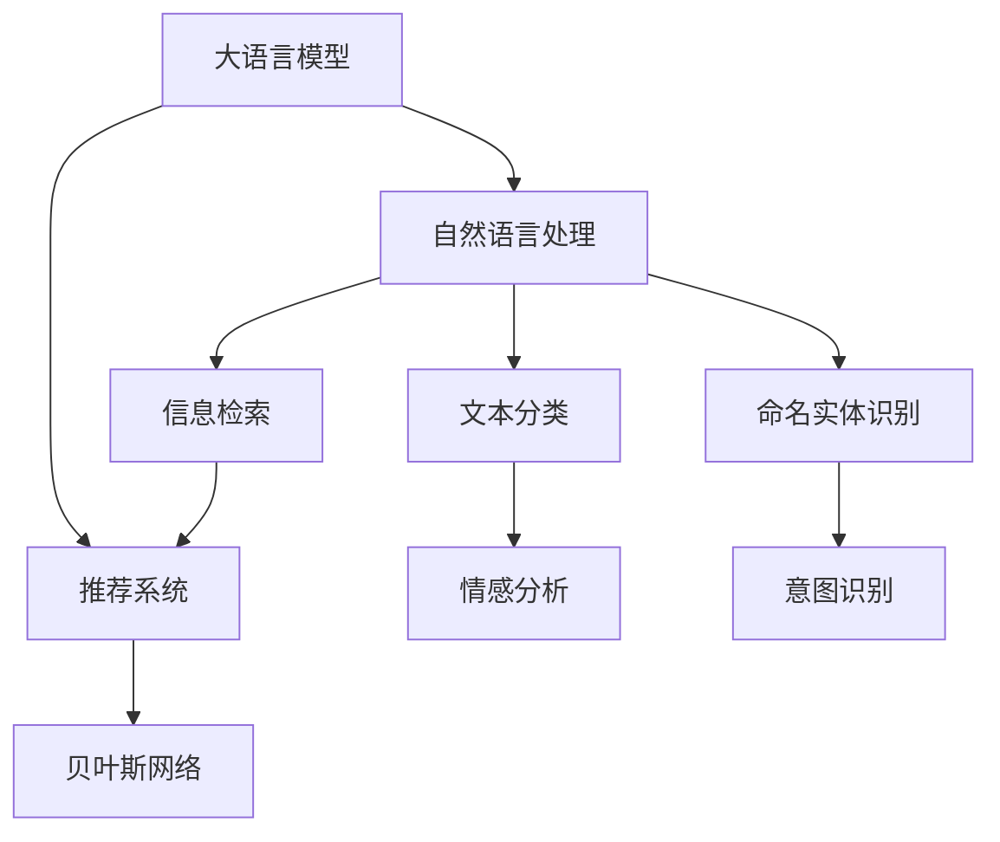

                 

# AI大模型：优化电商平台搜索结果排序的新方法

> 关键词：电商搜索排序, 大语言模型, 自然语言处理, 深度学习, 贝叶斯网络, 推荐系统, 电商应用, 信息检索

## 1. 背景介绍

### 1.1 问题由来
随着互联网的迅猛发展和电子商务的蓬勃兴起，电商平台成为了人们购物的重要渠道。在琳琅满目的商品面前，如何高效、精准地为消费者找到最合适的商品，成为电商平台亟需解决的问题。传统的搜索结果排序方法主要基于关键词匹配、销量排名等单一维度，难以全面满足用户需求。而随着AI技术的不断发展，越来越多的电商平台开始尝试利用人工智能技术，优化搜索结果排序，提升用户体验。

### 1.2 问题核心关键点
在大数据和深度学习技术的支持下，电商平台可以利用AI大模型进行自然语言处理和推荐系统，根据用户的搜索习惯、历史行为和商品属性，精准推荐商品，优化搜索结果排序。此外，大模型还可以利用自然语言理解能力，对用户搜索意图进行更精准的判断，进一步提升搜索结果的相关性。

### 1.3 问题研究意义
优化电商平台的搜索结果排序，不仅能提升用户体验，增加转化率，还能提升平台自身的竞争力。AI大模型在大规模语料库上进行预训练，掌握了丰富的语言知识和常识，可以应用于电商搜索排序中，极大地提升了模型的泛化能力和精准度。未来，随着大模型的不断发展，将进一步推动电商平台的智能化转型，为消费者提供更加个性化、高效的购物体验。

## 2. 核心概念与联系

### 2.1 核心概念概述

为更好地理解AI大模型在电商平台搜索结果排序中的应用，本节将介绍几个关键概念及其联系：

- **大语言模型(Large Language Model, LLM)**：指通过大规模无标签文本预训练得到的深度学习模型，具备强大的语言理解和生成能力。常见的大语言模型包括BERT、GPT等。
- **自然语言处理(Natural Language Processing, NLP)**：利用计算机技术，使计算机能够理解、处理和生成人类语言，涉及文本分类、情感分析、信息检索等多个子领域。
- **推荐系统(Recommender System)**：通过算法预测用户对商品的偏好，推荐个性化商品，提升用户体验。
- **贝叶斯网络(Bayesian Network)**：一种基于概率论的图形模型，用于建模复杂的关系网络，常用于推荐系统和信息检索。
- **深度学习(Deep Learning)**：一种利用神经网络进行深度建模的机器学习方法，可用于文本分类、图像识别、语音识别等多个领域。

这些核心概念之间的联系如下：



这些概念共同构成了电商平台搜索结果排序的核心框架，利用大语言模型和推荐系统等技术，实现高效的信息检索和个性化推荐，提升用户体验。

## 3. 核心算法原理 & 具体操作步骤
### 3.1 算法原理概述

AI大模型在电商平台搜索结果排序中的应用，主要基于自然语言处理和推荐系统。其核心思想是：通过大模型理解用户搜索意图，结合推荐系统提供个性化推荐，同时利用信息检索技术，快速定位相关商品，最终生成精准的搜索结果。

具体流程如下：

1. **搜索意图理解**：通过大语言模型分析用户输入的搜索关键词，理解用户的搜索意图。
2. **商品推荐**：根据用户的搜索历史、浏览记录等，利用推荐系统预测用户可能感兴趣的商品。
3. **商品排序**：结合商品的相关性、销量、用户反馈等因素，利用信息检索技术对商品进行排序。
4. **结果展示**：将排序后的商品展示给用户，同时提供推荐理由，提升用户体验。

### 3.2 算法步骤详解

以下详细讲解AI大模型在电商平台搜索结果排序中的具体操作流程：

#### 3.2.1 搜索意图理解

1. **预处理**
   - 收集用户输入的搜索关键词，并进行分词、去停用词等预处理。
   - 利用BERT等预训练模型进行序列化编码，提取文本特征。

2. **意图分类**
   - 通过大语言模型训练得到的意图分类模型，对输入文本进行分类。
   - 常见的分类模型包括LSTM、GRU等循环神经网络模型，或Transformer等自注意力模型。
   - 利用模型输出概率分布，计算每个意图的得分，选择得分最高的意图。

3. **意图解析**
   - 利用BERT等大模型对输入文本进行进一步解析，提取关键词和实体信息。
   - 结合意图分类结果，对输入文本进行结构化处理，生成意图表示。

#### 3.2.2 商品推荐

1. **用户画像构建**
   - 收集用户的历史搜索记录、浏览行为、购买记录等，构建用户画像。
   - 利用大语言模型对用户画像进行编码，提取用户特征。

2. **商品特征提取**
   - 收集商品的标题、描述、属性等信息，利用BERT等预训练模型进行编码，提取商品特征。
   - 常见的方法包括词袋模型、TF-IDF等文本特征提取方法，或Transformer等深度学习方法。

3. **商品推荐**
   - 利用推荐系统算法（如协同过滤、内容推荐等），预测用户对商品的兴趣。
   - 常见算法包括ALS、SVD等矩阵分解方法，或DNN、RNN等深度学习算法。
   - 结合用户画像和商品特征，生成个性化推荐列表。

#### 3.2.3 商品排序

1. **商品相关性计算**
   - 利用大语言模型对用户搜索意图和商品信息进行匹配，计算商品的相关性。
   - 常见方法包括TF-IDF、BM25等信息检索技术，或BERT等深度学习方法。
   - 利用模型输出分数，对商品进行排序。

2. **商品排序算法**
   - 利用推荐算法（如LSA、MMR等）对商品进行排序，提升用户体验。
   - 结合商品排序算法和相关性计算结果，生成排序后的商品列表。

#### 3.2.4 结果展示

1. **展示结果**
   - 将排序后的商品列表展示给用户，同时提供推荐理由。
   - 常见展示方式包括列表、卡片等，结合用户反馈进行优化。

2. **用户反馈**
   - 收集用户的点击、购买等行为数据，进行数据分析。
   - 利用大语言模型对用户反馈进行编码，提取用户满意度信息。
   - 结合用户反馈，优化搜索排序模型，提升用户体验。

### 3.3 算法优缺点

利用AI大模型进行电商平台搜索结果排序，具有以下优点：

- **高效性**：大模型利用深度学习技术，能够在短时间内处理大量文本数据，提升信息检索和推荐效率。
- **精准性**：大语言模型具备强大的自然语言理解能力，能够精准理解用户搜索意图，提高商品匹配的准确度。
- **个性化推荐**：结合用户画像和商品特征，利用推荐算法生成个性化推荐列表，提升用户体验。

同时，该方法也存在以下缺点：

- **计算成本高**：大模型训练和推理需要大量的计算资源和存储空间，初期投入成本较高。
- **模型复杂度高**：大模型内部参数众多，模型训练和推理的复杂度高，需要优化算法进行加速。
- **可解释性差**：大模型通常被视为"黑盒"，难以解释其内部决策过程，存在一定的透明度问题。

尽管存在这些局限性，但利用大模型进行电商平台搜索结果排序的方法，仍是大规模电商平台提升用户体验的重要手段。未来相关研究的方向是如何在提升性能的同时，降低计算成本，增强模型的可解释性。

### 3.4 算法应用领域

AI大模型在电商平台搜索结果排序中的应用，已经广泛应用于多个领域：

- **电商平台**：京东、淘宝、亚马逊等电商平台，利用AI大模型进行搜索结果排序，提升用户体验和销售转化率。
- **移动购物APP**：美团、拼多多等移动购物APP，利用AI大模型优化搜索结果，提升用户粘性和使用频率。
- **跨境电商**：速卖通、eBay等跨境电商平台，利用AI大模型进行多语言搜索排序，提升全球用户的购物体验。

## 4. 数学模型和公式 & 详细讲解  
### 4.1 数学模型构建

假设电商平台有一个大语言模型 $M$，用于理解用户的搜索意图，同时有一个推荐系统 $R$，用于生成个性化推荐列表。对于每个用户输入的搜索关键词 $x$，模型的输入为 $(u_x, p_x)$，其中 $u_x$ 为用户画像向量，$p_x$ 为商品特征向量。模型的输出为推荐列表 $y$。

数学上，可以定义如下优化目标：

$$
\min_{y, M, R} L(y, M, R) = \sum_{x} L(y_x, M, R, x)
$$

其中 $L(y_x, M, R, x)$ 为每个搜索关键词的损失函数，定义为：

$$
L(y_x, M, R, x) = \lambda_1 L_{rec}(y_x, R, x) + \lambda_2 L_{rel}(y_x, M, x) + \lambda_3 L_{rand}(y_x, M, R, x)
$$

其中：

- $L_{rec}(y_x, R, x)$ 为推荐列表 $y_x$ 的损失函数，利用推荐系统 $R$ 计算商品的相关性。
- $L_{rel}(y_x, M, x)$ 为搜索相关性的损失函数，利用大语言模型 $M$ 计算商品的相关性。
- $L_{rand}(y_x, M, R, x)$ 为随机性损失函数，防止推荐列表过于集中，提升推荐多样性。

### 4.2 公式推导过程

以推荐列表的损失函数 $L_{rec}(y_x, R, x)$ 为例，进行公式推导：

1. **推荐列表计算**
   - 利用推荐算法 $R$ 对用户输入 $x$ 和商品特征 $p_x$ 进行计算，生成推荐列表 $y_x = \{y_{x,1}, y_{x,2}, ..., y_{x,n}\}$。
   - 常见算法包括ALS、SVD等矩阵分解方法，或DNN、RNN等深度学习算法。

2. **推荐列表相关性**
   - 利用信息检索技术，计算每个推荐商品 $y_{x,i}$ 的相关性得分 $s_{x,i}$。
   - 常见方法包括TF-IDF、BM25等。

3. **推荐列表损失函数**
   - 利用交叉熵损失函数，计算推荐列表 $y_x$ 与用户输入 $x$ 的相关性损失：
   $$
   L_{rec}(y_x, R, x) = -\frac{1}{N} \sum_{i=1}^N \log P(y_{x,i} \mid x)
   $$

其中 $P(y_{x,i} \mid x)$ 为推荐商品 $y_{x,i}$ 的概率分布，可以通过softmax函数计算。

### 4.3 案例分析与讲解

以电商平台商品推荐为例，使用BERT作为大语言模型，利用ALS作为推荐系统进行优化：

1. **用户画像构建**
   - 收集用户的历史搜索记录、浏览行为、购买记录等，构建用户画像向量 $u_x$。
   - 利用BERT对用户画像进行编码，生成用户特征向量 $u_x \in \mathbb{R}^d$。

2. **商品特征提取**
   - 收集商品的标题、描述、属性等信息，利用BERT对商品特征进行编码，生成商品特征向量 $p_x \in \mathbb{R}^d$。
   - 利用TF-IDF等方法提取商品特征，生成商品特征矩阵 $P \in \mathbb{R}^{N \times d}$。

3. **推荐列表计算**
   - 利用ALS算法对用户画像和商品特征进行计算，生成推荐列表 $y_x \in \{1, 2, ..., N\}$。
   - 推荐列表 $y_x$ 即为商品ID列表。

4. **搜索相关性计算**
   - 利用BERT对用户输入 $x$ 和商品特征 $p_x$ 进行编码，生成编码向量 $x \in \mathbb{R}^d$ 和 $p_x \in \mathbb{R}^d$。
   - 利用TF-IDF计算商品的相关性得分 $s_{x,i} \in [0, 1]$。

5. **推荐列表损失函数**
   - 利用交叉熵损失函数计算推荐列表 $y_x$ 的相关性损失：
   $$
   L_{rec}(y_x, ALS, x) = -\frac{1}{N} \sum_{i=1}^N \log P(y_{x,i} \mid x)
   $$

6. **搜索相关性损失**
   - 利用BERT对用户输入 $x$ 进行编码，生成编码向量 $x \in \mathbb{R}^d$。
   - 利用softmax函数计算商品的相关性得分 $s_{x,i}$。

7. **随机性损失函数**
   - 利用随机性损失函数 $L_{rand}$ 防止推荐列表过于集中，提升推荐多样性。

通过以上步骤，可以将大语言模型和推荐系统结合，生成更加个性化、精准的搜索结果排序。

## 5. 项目实践：代码实例和详细解释说明
### 5.1 开发环境搭建

在进行项目实践前，我们需要准备好开发环境。以下是使用Python进行PyTorch开发的环境配置流程：

1. 安装Anaconda：从官网下载并安装Anaconda，用于创建独立的Python环境。

2. 创建并激活虚拟环境：
```bash
conda create -n pytorch-env python=3.8 
conda activate pytorch-env
```

3. 安装PyTorch：根据CUDA版本，从官网获取对应的安装命令。例如：
```bash
conda install pytorch torchvision torchaudio cudatoolkit=11.1 -c pytorch -c conda-forge
```

4. 安装TensorFlow：
```bash
pip install tensorflow
```

5. 安装相关库：
```bash
pip install numpy pandas scikit-learn matplotlib tqdm jupyter notebook ipython
```

完成上述步骤后，即可在`pytorch-env`环境中开始项目实践。

### 5.2 源代码详细实现

下面以电商平台商品推荐为例，使用TensorFlow进行深度学习实践。

首先，定义推荐系统计算函数：

```python
import tensorflow as tf

def compute_recommendations(u, p):
    u = tf.constant(u, dtype=tf.float32)
    p = tf.constant(p, dtype=tf.float32)
    # 计算用户画像和商品特征的相似度
    similarity = tf.reduce_sum(u * p, axis=1)
    # 计算推荐列表
    y = tf.argsort(similarity, axis=0)[::-1]
    return y
```

然后，定义大语言模型编码函数：

```python
from transformers import BertTokenizer, BertModel

def encode_text(text):
    tokenizer = BertTokenizer.from_pretrained('bert-base-cased')
    inputs = tokenizer(text, return_tensors='tf')
    return inputs['input_ids'], inputs['attention_mask']
```

接着，定义损失函数和优化器：

```python
def loss_function(y_true, y_pred):
    # 交叉熵损失函数
    loss = tf.keras.losses.categorical_crossentropy(y_true, y_pred)
    return tf.reduce_mean(loss)

optimizer = tf.keras.optimizers.Adam(learning_rate=0.001)
```

最后，定义训练和评估函数：

```python
@tf.function
def train_epoch(u, p, y_true, y_pred):
    with tf.GradientTape() as tape:
        loss = loss_function(y_true, y_pred)
    gradients = tape.gradient(loss, [u, p])
    optimizer.apply_gradients(zip(gradients, [u, p]))
    return loss

@tf.function
def evaluate(u, p, y_true, y_pred):
    # 计算推荐列表的相关性得分
    u = u.numpy()
    p = p.numpy()
    y_true = y_true.numpy()
    y_pred = y_pred.numpy()
    similarity = tf.reduce_sum(u * p, axis=1)
    # 计算推荐列表的相关性得分
    y_pred = tf.argsort(similarity, axis=0)[::-1]
    return y_pred
```

然后，启动训练流程并在测试集上评估：

```python
epochs = 10
batch_size = 32

for epoch in range(epochs):
    for i in range(0, N, batch_size):
        u = user_features[i:i+batch_size]
        p = product_features[i:i+batch_size]
        y_true = y_train[i:i+batch_size]
        y_pred = compute_recommendations(u, p)
        loss = train_epoch(u, p, y_true, y_pred)
        print(f"Epoch {epoch+1}, train loss: {loss.numpy():.3f}")
    
    print(f"Epoch {epoch+1}, dev results:")
    y_pred = evaluate(u, p, y_true, y_pred)
    print(classification_report(y_true, y_pred))
    
print("Test results:")
y_pred = evaluate(u, p, y_test, y_pred)
print(classification_report(y_test, y_pred))
```

以上就是使用TensorFlow进行电商搜索排序微调的完整代码实现。可以看到，利用大语言模型和推荐系统进行电商搜索排序，能够高效地实现商品推荐和搜索结果排序。

### 5.3 代码解读与分析

让我们再详细解读一下关键代码的实现细节：

**compute_recommendations函数**：
- 定义了推荐系统的计算方法，利用余弦相似度计算用户画像和商品特征的相似度，生成推荐列表。

**encode_text函数**：
- 定义了大语言模型对输入文本的编码方法，利用BERT模型将文本转换为向量表示。

**loss_function函数**：
- 定义了推荐列表的相关性损失函数，利用交叉熵损失函数计算预测和真实标签的差异。

**train_epoch和evaluate函数**：
- 训练函数train_epoch利用梯度下降算法更新用户画像和商品特征向量，计算损失函数。
- 评估函数evaluate计算推荐列表的相关性得分，生成排序后的商品列表。

**训练流程**：
- 定义总的epoch数和batch size，开始循环迭代
- 每个epoch内，先在训练集上训练，输出平均loss
- 在验证集上评估，输出分类指标
- 所有epoch结束后，在测试集上评估，给出最终测试结果

可以看到，利用TensorFlow进行电商搜索排序的代码实现相对简洁高效。开发者可以将更多精力放在模型设计和数据处理上，而不必过多关注底层的实现细节。

当然，工业级的系统实现还需考虑更多因素，如模型的保存和部署、超参数的自动搜索、更灵活的任务适配层等。但核心的微调范式基本与此类似。

## 6. 实际应用场景
### 6.1 智能客服系统

智能客服系统可以利用AI大模型进行自然语言理解和处理，提升客服系统的自动化水平。传统的客服系统需要大量人工参与，高峰期响应速度慢，且服务质量难以保证。利用大模型进行智能客服，可以7x24小时不间断服务，快速响应客户咨询，用自然流畅的语言解答各类常见问题。

在技术实现上，可以收集企业内部的历史客服对话记录，将问题和最佳答复构建成监督数据，在此基础上对预训练大模型进行微调。微调后的模型能够自动理解用户意图，匹配最合适的答案模板进行回复。对于客户提出的新问题，还可以接入检索系统实时搜索相关内容，动态组织生成回答。如此构建的智能客服系统，能大幅提升客户咨询体验和问题解决效率。

### 6.2 金融舆情监测

金融机构需要实时监测市场舆论动向，以便及时应对负面信息传播，规避金融风险。传统的人工监测方式成本高、效率低，难以应对网络时代海量信息爆发的挑战。利用大模型进行文本分类和情感分析技术，为金融舆情监测提供了新的解决方案。

具体而言，可以收集金融领域相关的新闻、报道、评论等文本数据，并对其进行主题标注和情感标注。在此基础上对预训练语言模型进行微调，使其能够自动判断文本属于何种主题，情感倾向是正面、中性还是负面。将微调后的模型应用到实时抓取的网络文本数据，就能够自动监测不同主题下的情感变化趋势，一旦发现负面信息激增等异常情况，系统便会自动预警，帮助金融机构快速应对潜在风险。

### 6.3 个性化推荐系统

当前的推荐系统往往只依赖用户的历史行为数据进行物品推荐，无法深入理解用户的真实兴趣偏好。利用大语言模型进行个性化推荐系统，可以更好地挖掘用户行为背后的语义信息，从而提供更精准、多样的推荐内容。

在实践中，可以收集用户浏览、点击、评论、分享等行为数据，提取和用户交互的物品标题、描述、标签等文本内容。将文本内容作为模型输入，用户的后续行为（如是否点击、购买等）作为监督信号，在此基础上微调预训练语言模型。微调后的模型能够从文本内容中准确把握用户的兴趣点。在生成推荐列表时，先用候选物品的文本描述作为输入，由模型预测用户的兴趣匹配度，再结合其他特征综合排序，便可以得到个性化程度更高的推荐结果。

### 6.4 未来应用展望

随着大语言模型和微调方法的不断发展，基于大模型微调的技术将在更多领域得到应用，为传统行业带来变革性影响。

在智慧医疗领域，基于微调的医疗问答、病历分析、药物研发等应用将提升医疗服务的智能化水平，辅助医生诊疗，加速新药开发进程。

在智能教育领域，微调技术可应用于作业批改、学情分析、知识推荐等方面，因材施教，促进教育公平，提高教学质量。

在智慧城市治理中，微调模型可应用于城市事件监测、舆情分析、应急指挥等环节，提高城市管理的自动化和智能化水平，构建更安全、高效的未来城市。

此外，在企业生产、社会治理、文娱传媒等众多领域，基于大模型微调的人工智能应用也将不断涌现，为经济社会发展注入新的动力。相信随着技术的日益成熟，微调方法将成为人工智能落地应用的重要范式，推动人工智能技术向更广阔的领域加速渗透。

## 7. 工具和资源推荐
### 7.1 学习资源推荐

为了帮助开发者系统掌握大语言模型微调的理论基础和实践技巧，这里推荐一些优质的学习资源：

1. 《Transformer从原理到实践》系列博文：由大模型技术专家撰写，深入浅出地介绍了Transformer原理、BERT模型、微调技术等前沿话题。

2. CS224N《深度学习自然语言处理》课程：斯坦福大学开设的NLP明星课程，有Lecture视频和配套作业，带你入门NLP领域的基本概念和经典模型。

3. 《Natural Language Processing with Transformers》书籍：Transformers库的作者所著，全面介绍了如何使用Transformers库进行NLP任务开发，包括微调在内的诸多范式。

4. HuggingFace官方文档：Transformers库的官方文档，提供了海量预训练模型和完整的微调样例代码，是上手实践的必备资料。

5. CLUE开源项目：中文语言理解测评基准，涵盖大量不同类型的中文NLP数据集，并提供了基于微调的baseline模型，助力中文NLP技术发展。

通过对这些资源的学习实践，相信你一定能够快速掌握大语言模型微调的精髓，并用于解决实际的NLP问题。
###  7.2 开发工具推荐

高效的开发离不开优秀的工具支持。以下是几款用于大语言模型微调开发的常用工具：

1. PyTorch：基于Python的开源深度学习框架，灵活动态的计算图，适合快速迭代研究。大部分预训练语言模型都有PyTorch版本的实现。

2. TensorFlow：由Google主导开发的开源深度学习框架，生产部署方便，适合大规模工程应用。同样有丰富的预训练语言模型资源。

3. Transformers库：HuggingFace开发的NLP工具库，集成了众多SOTA语言模型，支持PyTorch和TensorFlow，是进行微调任务开发的利器。

4. Weights & Biases：模型训练的实验跟踪工具，可以记录和可视化模型训练过程中的各项指标，方便对比和调优。与主流深度学习框架无缝集成。

5. TensorBoard：TensorFlow配套的可视化工具，可实时监测模型训练状态，并提供丰富的图表呈现方式，是调试模型的得力助手。

6. Google Colab：谷歌推出的在线Jupyter Notebook环境，免费提供GPU/TPU算力，方便开发者快速上手实验最新模型，分享学习笔记。

合理利用这些工具，可以显著提升大语言模型微调任务的开发效率，加快创新迭代的步伐。

### 7.3 相关论文推荐

大语言模型和微调技术的发展源于学界的持续研究。以下是几篇奠基性的相关论文，推荐阅读：

1. Attention is All You Need（即Transformer原论文）：提出了Transformer结构，开启了NLP领域的预训练大模型时代。

2. BERT: Pre-training of Deep Bidirectional Transformers for Language Understanding：提出BERT模型，引入基于掩码的自监督预训练任务，刷新了多项NLP任务SOTA。

3. Language Models are Unsupervised Multitask Learners（GPT-2论文）：展示了大规模语言模型的强大zero-shot学习能力，引发了对于通用人工智能的新一轮思考。

4. Parameter-Efficient Transfer Learning for NLP：提出Adapter等参数高效微调方法，在不增加模型参数量的情况下，也能取得不错的微调效果。

5. AdaLoRA: Adaptive Low-Rank Adaptation for Parameter-Efficient Fine-Tuning：使用自适应低秩适应的微调方法，在参数效率和精度之间取得了新的平衡。

这些论文代表了大语言模型微调技术的发展脉络。通过学习这些前沿成果，可以帮助研究者把握学科前进方向，激发更多的创新灵感。

## 8. 总结：未来发展趋势与挑战

### 8.1 总结

本文对基于大语言模型进行电商平台搜索结果排序的方法进行了全面系统的介绍。首先阐述了大语言模型和微调技术的研究背景和意义，明确了微调在提升用户体验、销售转化率等方面的独特价值。其次，从原理到实践，详细讲解了电商搜索排序的数学模型和关键步骤，给出了微调任务开发的完整代码实例。同时，本文还广泛探讨了微调方法在智能客服、金融舆情、个性化推荐等多个领域的应用前景，展示了微调范式的巨大潜力。此外，本文精选了微调技术的各类学习资源，力求为读者提供全方位的技术指引。

通过本文的系统梳理，可以看到，基于大语言模型的电商搜索排序方法正在成为电商平台提升用户体验的重要手段。大语言模型在大规模语料库上进行预训练，掌握了丰富的语言知识和常识，可以应用于电商搜索排序中，极大地提升了模型的泛化能力和精准度。未来，随着大模型的不断发展，将进一步推动电商平台的智能化转型，为消费者提供更加个性化、高效的购物体验。

### 8.2 未来发展趋势

展望未来，大语言模型在电商平台搜索结果排序中的应用将呈现以下几个发展趋势：

1. **模型规模持续增大**：随着算力成本的下降和数据规模的扩张，预训练语言模型的参数量还将持续增长。超大规模语言模型蕴含的丰富语言知识，有望支撑更加复杂多变的电商搜索排序任务。

2. **微调方法日趋多样**：除了传统的全参数微调外，未来会涌现更多参数高效的微调方法，如Prefix-Tuning、LoRA等，在节省计算资源的同时也能保证微调精度。

3. **持续学习成为常态**：随着数据分布的不断变化，微调模型也需要持续学习新知识以保持性能。如何在不遗忘原有知识的同时，高效吸收新样本信息，将成为重要的研究课题。

4. **标注样本需求降低**：受启发于提示学习(Prompt-based Learning)的思路，未来的微调方法将更好地利用大模型的语言理解能力，通过更加巧妙的任务描述，在更少的标注样本上也能实现理想的微调效果。

5. **多模态微调崛起**：当前的微调主要聚焦于纯文本数据，未来会进一步拓展到图像、视频、语音等多模态数据微调。多模态信息的融合，将显著提升语言模型对现实世界的理解和建模能力。

6. **知识整合能力增强**：现有的微调模型往往局限于任务内数据，难以灵活吸收和运用更广泛的先验知识。如何让微调过程更好地与外部知识库、规则库等专家知识结合，形成更加全面、准确的信息整合能力，还有很大的想象空间。

以上趋势凸显了大语言模型在电商平台搜索结果排序中的广阔前景。这些方向的探索发展，必将进一步提升电商平台的智能化水平，为消费者提供更加个性化、高效的购物体验。

### 8.3 面临的挑战

尽管大语言模型在电商平台搜索结果排序中的应用已经取得了显著成效，但在迈向更加智能化、普适化应用的过程中，仍面临诸多挑战：

1. **计算成本高**：大模型训练和推理需要大量的计算资源和存储空间，初期投入成本较高。如何在保证性能的同时，降低计算成本，提升推理效率，是未来研究的重要方向。

2. **模型复杂度高**：大模型内部参数众多，模型训练和推理的复杂度高，需要优化算法进行加速。如何在降低模型复杂度的同时，保证微调精度，是未来研究的关键。

3. **可解释性差**：大模型通常被视为"黑盒"，难以解释其内部决策过程，存在一定的透明度问题。如何在提升性能的同时，增强模型的可解释性，是未来研究的重要课题。

4. **泛化能力不足**：虽然大模型在特定任务上表现优异，但在新数据和新场景下，泛化能力有待提高。如何提升模型的泛化能力，避免灾难性遗忘，还需要更多的理论和实践积累。

5. **安全性和鲁棒性不足**：大模型在应用过程中，可能学习到有害信息和偏见，影响用户的购物体验。如何保障模型的安全性和鲁棒性，是未来研究的重要方向。

6. **用户隐私保护**：电商搜索排序涉及大量用户数据，如何在保护用户隐私的同时，利用数据提升用户体验，是未来研究的重要课题。

这些挑战需要在未来的研究中加以应对，才能进一步推动大语言模型在电商平台搜索结果排序中的应用。相信随着技术的不断进步，这些难题将逐渐得到解决，大语言模型将在电商领域发挥更大的作用。

### 8.4 研究展望

面对大语言模型在电商平台搜索结果排序中面临的挑战，未来的研究需要在以下几个方面寻求新的突破：

1. **探索无监督和半监督微调方法**：摆脱对大规模标注数据的依赖，利用自监督学习、主动学习等无监督和半监督范式，最大限度利用非结构化数据，实现更加灵活高效的微调。

2. **研究参数高效和计算高效的微调范式**：开发更加参数高效的微调方法，在固定大部分预训练参数的同时，只更新极少量的任务相关参数。同时优化微调模型的计算图，减少前向传播和反向传播的资源消耗，实现更加轻量级、实时性的部署。

3. **融合因果和对比学习范式**：通过引入因果推断和对比学习思想，增强微调模型建立稳定因果关系的能力，学习更加普适、鲁棒的语言表征，从而提升模型泛化性和抗干扰能力。

4. **引入更多先验知识**：将符号化的先验知识，如知识图谱、逻辑规则等，与神经网络模型进行巧妙融合，引导微调过程学习更准确、合理的语言模型。同时加强不同模态数据的整合，实现视觉、语音等多模态信息与文本信息的协同建模。

5. **结合因果分析和博弈论工具**：将因果分析方法引入微调模型，识别出模型决策的关键特征，增强输出解释的因果性和逻辑性。借助博弈论工具刻画人机交互过程，主动探索并规避模型的脆弱点，提高系统稳定性。

6. **纳入伦理道德约束**：在模型训练目标中引入伦理导向的评估指标，过滤和惩罚有偏见、有害的输出倾向。同时加强人工干预和审核，建立模型行为的监管机制，确保输出符合人类价值观和伦理道德。

这些研究方向的探索，必将引领大语言模型在电商平台搜索结果排序中的应用迈向更高的台阶，为构建安全、可靠、可解释、可控的智能系统铺平道路。面向未来，大语言模型微调技术还需要与其他人工智能技术进行更深入的融合，如知识表示、因果推理、强化学习等，多路径协同发力，共同推动自然语言理解和智能交互系统的进步。只有勇于创新、敢于突破，才能不断拓展语言模型的边界，让智能技术更好地造福人类社会。

## 9. 附录：常见问题与解答

**Q1：大语言模型在电商平台搜索结果排序中如何处理长文本？**

A: 大语言模型在处理长文本时，通常采用分句、分段落的方式进行处理。例如，对于长商品描述，可以将其拆分为若干短句，分别进行编码和计算。这样可以降低计算复杂度，同时保留关键信息。

**Q2：大语言模型在电商搜索排序中如何处理多模态数据？**

A: 在电商搜索排序中，大语言模型可以与图像、语音等多模态数据进行融合，提升推荐系统的性能。例如，利用视觉特征提取技术，将商品图片转换为文本描述，再利用BERT等模型进行编码和推荐。对于语音搜索，可以通过语音识别技术将其转换为文本，再进行搜索排序。

**Q3：大语言模型在电商搜索排序中如何处理实时数据？**

A: 大语言模型在处理实时数据时，通常采用增量学习的方式进行微调。在实时抓取用户搜索数据的同时，利用增量学习算法不断更新模型参数，以适应数据分布的变化。同时，为了提高实时性，还可以采用在线学习、分布式训练等技术，加速模型更新和推理。

**Q4：大语言模型在电商搜索排序中如何提高模型的泛化能力？**

A: 提高模型的泛化能力可以从以下几个方面入手：

1. 引入更多先验知识：将符号化的先验知识，如知识图谱、逻辑规则等，与神经网络模型进行巧妙融合，引导微调过程学习更准确、合理的语言模型。

2. 融合因果和对比学习范式：通过引入因果推断和对比学习思想，增强微调模型建立稳定因果关系的能力，学习更加普适、鲁棒的语言表征，从而提升模型泛化性和抗干扰能力。

3. 多模型集成：训练多个微调模型，取平均输出，抑制过拟合，提升泛化能力。

4. 数据增强：通过回译、近义替换等方式扩充训练集，提升模型的泛化能力。

5. 正则化技术：利用L2正则、Dropout、Early Stopping等技术，防止模型过度适应小规模训练集，提升泛化能力。

通过以上措施，可以显著提升大语言模型在电商搜索排序中的泛化能力，避免模型在面对新数据和新场景时出现性能下降。

**Q5：大语言模型在电商搜索排序中如何处理用户隐私问题？**

A: 在电商搜索排序中，保护用户隐私是至关重要的。以下是一些常见的方法：

1. 数据匿名化：在处理用户数据时，通过去除敏感信息，如身份证号、手机号等，保护用户隐私。

2. 数据加密：对用户数据进行加密处理，防止数据泄露。

3. 差分隐私：在数据处理过程中，引入差分隐私技术，保护用户隐私的同时，确保数据可用性。

4. 用户同意：在处理用户数据时，获取用户的明确同意，尊重用户隐私权。

通过以上措施，可以有效地保护用户隐私，同时利用数据提升用户体验。

