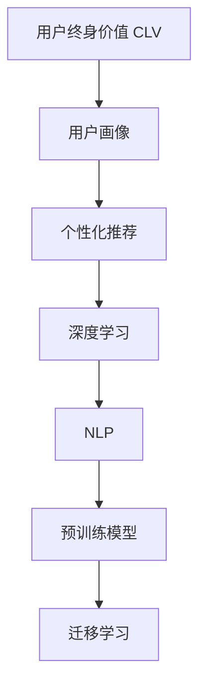

                 

# AI大模型：优化电商平台用户终身价值的新方法

> 关键词：AI大模型,用户终身价值,电商平台,个性化推荐,深度学习,优化算法,用户行为分析

## 1. 背景介绍

### 1.1 问题由来

在数字化转型如火如荼的今天，电商平台面临着越来越激烈的市场竞争和用户争夺。如何在已有用户的基础上，提高用户生命周期价值（Customer Lifetime Value, CLV），成为电商企业亟需解决的痛点问题。传统的客户细分和个性化推荐算法往往依赖大量人工干预，难以适应市场快速变化的需求。

与此同时，以深度学习为代表的大模型技术在NLP、计算机视觉等领域取得了显著的突破，其强大的语言理解和生成能力，使得其在电商领域用户行为分析、个性化推荐等任务上具备巨大的潜力。

### 1.2 问题核心关键点

目前，AI大模型在电商平台的优化中主要应用于以下几个方面：

- **用户画像**：通过自然语言处理和大模型分析用户的评论、评价、搜索历史等行为数据，构建用户详细画像。
- **个性化推荐**：利用大模型对用户行为数据进行建模，生成个性化推荐结果，提升用户购买意愿。
- **流失预警**：利用大模型分析用户行为变化，预测用户流失概率，提前采取措施挽回用户。
- **营销优化**：通过大模型分析用户点击、浏览、购买等数据，优化营销活动投放效果。

本文将重点探讨如何利用AI大模型优化电商平台的CLV，并给出具体的实践步骤和案例分析。

### 1.3 问题研究意义

电商平台的优化是提升用户体验和经营效率的关键，而用户终身价值（CLV）的提升则是电商运营的终极目标。AI大模型技术能够捕捉到用户深层次的偏好和行为模式，有助于提高推荐精度，从而增加用户回购率和忠诚度，最大化CLV。

具体而言，本文研究的意义包括：

1. **提升推荐精度**：大模型能够从用户海量行为数据中挖掘出丰富的特征，从而提升个性化推荐的效果，增加用户转化率。
2. **降低成本**：自动化分析用户行为数据，减少人工干预，降低运营成本。
3. **动态优化**：大模型能够实时更新用户画像，适应市场和用户行为的快速变化，提升用户体验。
4. **决策支持**：通过大数据分析，辅助决策制定，提升营销活动的效果。

## 2. 核心概念与联系

### 2.1 核心概念概述

为更好地理解AI大模型在电商平台优化中的应用，本节将介绍几个关键概念及其联系：

- **用户终身价值（CLV）**：用户在其生命周期内为电商平台带来的总收益。CLV越高，表示用户价值越大。
- **用户画像**：通过对用户历史行为数据的分析和建模，构建用户多维度的特征向量。
- **个性化推荐**：根据用户画像和历史行为数据，为每个用户生成个性化的推荐结果。
- **深度学习**：一类基于神经网络的机器学习方法，通过多层非线性映射，进行特征提取和模式识别。
- **自然语言处理（NLP）**：使计算机能够理解、解释和生成人类语言的技术。
- **预训练模型**：在无标签数据上进行的深度学习训练，以提取通用的语言表示。
- **迁移学习**：将一个领域学到的知识迁移到另一个领域的学习范式，大模型预训练即为一种迁移学习。

这些核心概念之间的逻辑关系可以通过以下Mermaid流程图来展示：



这个流程图展示了大模型在电商平台优化中的应用框架：

1. 电商平台的优化目标是通过提升用户CLV来增加收入。
2. 用户画像通过自然语言处理和大模型从用户行为数据中构建，用于个性化推荐。
3. 个性化推荐是深度学习的重要应用，利用用户画像和历史行为数据进行建模。
4. 深度学习是大模型在电商平台的核心技术支撑，尤其是预训练模型通过迁移学习获取通用语言表示。
5. 迁移学习是连接预训练模型和电商应用的重要桥梁，使得模型能够适应电商平台的特定需求。

## 3. 核心算法原理 & 具体操作步骤

### 3.1 算法原理概述

AI大模型在电商平台优化中的核心算法原理包括用户画像构建、个性化推荐、用户流失预警和营销优化等。这些算法通过深度学习和自然语言处理技术，在大量标注数据上训练得到高精度的模型，并应用于电商平台的用户行为分析中。

以个性化推荐为例，其基本流程如下：

1. **用户画像构建**：收集用户行为数据，如浏览记录、点击记录、购买记录等，进行自然语言处理和特征提取，得到用户的多维度特征向量。
2. **模型训练**：使用深度学习模型，如Siamese网络、RNN、Transformer等，对用户画像进行建模，生成推荐结果。
3. **推荐优化**：根据推荐结果，选择最相关的商品进行展示，并通过A/B测试等方法不断优化推荐效果。

### 3.2 算法步骤详解

**Step 1: 用户画像构建**

用户画像的构建需要收集和处理用户行为数据，并使用自然语言处理技术进行特征提取。具体步骤如下：

1. **数据收集**：收集用户的浏览记录、点击记录、评论记录、评分记录、购买记录等。
2. **数据清洗**：去除无关、重复、缺失数据，标准化数据格式。
3. **特征提取**：使用NLP技术，如TF-IDF、Word2Vec、BERT等，提取文本数据的特征。
4. **用户画像构建**：将用户行为数据转化为多维特征向量，构成用户画像。

**Step 2: 模型训练**

在构建好用户画像后，使用深度学习模型进行训练，生成推荐结果。具体步骤如下：

1. **模型选择**：根据任务特点选择适合深度学习模型，如Siamese网络、RNN、Transformer等。
2. **数据划分**：将用户数据划分为训练集、验证集和测试集。
3. **模型训练**：使用训练集数据对模型进行训练，通过优化器（如Adam、SGD等）更新模型参数。
4. **模型评估**：使用验证集对模型进行评估，根据评估结果调整模型参数。
5. **模型测试**：使用测试集对模型进行测试，评估推荐效果。

**Step 3: 推荐优化**

在生成推荐结果后，需要不断优化推荐效果，以提升用户满意度和转化率。具体步骤如下：

1. **A/B测试**：在实际应用中，使用A/B测试方法，比较不同推荐策略的效果。
2. **模型调优**：根据A/B测试结果，调整模型参数，改进推荐算法。
3. **用户反馈**：收集用户反馈，进一步优化推荐结果。
4. **实时优化**：根据实时数据，动态调整推荐策略，提升用户满意度。

### 3.3 算法优缺点

AI大模型在电商平台优化中的主要优点包括：

1. **高效处理大数据**：大模型能够处理海量用户行为数据，快速提取有用特征。
2. **个性化推荐精准**：通过用户画像，大模型能够生成高精度的个性化推荐结果，提升用户购买意愿。
3. **实时响应**：大模型能够实时更新用户画像和推荐结果，适应市场和用户行为的快速变化。
4. **节省人力成本**：自动化分析用户行为数据，减少人工干预，降低运营成本。

但同时，大模型也存在一些缺点：

1. **对数据质量依赖高**：大模型需要大量高质量标注数据进行训练，数据质量直接影响模型性能。
2. **模型复杂度高**：大模型参数量庞大，计算资源消耗高，训练复杂。
3. **解释性不足**：大模型通常被视为"黑盒"，难以解释其内部工作机制和决策逻辑。
4. **过拟合风险**：大模型可能过度拟合训练数据，降低泛化能力。

## 4. 数学模型和公式 & 详细讲解

### 4.1 数学模型构建

为更好地理解AI大模型在电商平台优化中的应用，本节将使用数学语言对推荐算法进行更加严格的刻画。

假设电商平台有$m$个商品和$n$个用户，用户的浏览行为表示为$x_1,x_2,\ldots,x_n \in \mathbb{R}^d$，每个用户的历史行为数据构成了一个$d$维的特征向量。设用户点击商品的概率为$y_i$，其中$i$为商品的ID。

定义用户$i$对商品$j$的相似度为$z_{ij}$，利用深度学习模型计算相似度的公式为：

$$
z_{ij} = f(x_i, y_j)
$$

其中$f$为深度学习模型，如Siamese网络、RNN、Transformer等。

根据相似度，计算每个商品$j$的综合点击率$\hat{y}_j$，公式为：

$$
\hat{y}_j = \frac{\sum_{i=1}^{n} z_{ij} x_i}{\sum_{j=1}^{m} \sum_{i=1}^{n} z_{ij} x_i}
$$

最终，根据综合点击率$\hat{y}_j$，对商品进行排序，生成推荐结果。

### 4.2 公式推导过程

以下我们以深度学习模型的Siamese网络为例，推导推荐相似度的计算公式。

假设用户$i$的浏览行为表示为$x_i \in \mathbb{R}^d$，商品$j$的特征表示为$y_j \in \mathbb{R}^d$。则Siamese网络的相似度计算公式为：

$$
z_{ij} = \sigma(\frac{\langle x_i, y_j \rangle}{\|x_i\|\|y_j\|})
$$

其中$\langle \cdot,\cdot \rangle$为点积运算，$\sigma$为激活函数，$\|\cdot\|$为向量范数。

将相似度$z_{ij}$带入综合点击率公式，得到推荐结果：

$$
\hat{y}_j = \frac{\sum_{i=1}^{n} \sigma(\frac{\langle x_i, y_j \rangle}{\|x_i\|\|y_j\|}) x_i}{\sum_{j=1}^{m} \sum_{i=1}^{n} \sigma(\frac{\langle x_i, y_j \rangle}{\|x_i\|\|y_j\|}) x_i}
$$

在得到推荐结果后，使用A/B测试方法，比较不同推荐策略的效果，不断优化模型参数和推荐算法。

### 4.3 案例分析与讲解

假设某电商平台有一个在线推荐系统，使用深度学习模型进行个性化推荐。收集了10万个用户的点击记录和浏览记录，每个记录包含20个特征维度，使用Siamese网络进行相似度计算，得到每个商品与用户的相似度，生成推荐结果。具体步骤如下：

1. **数据收集**：收集10万个用户的点击记录和浏览记录，每个记录包含20个特征维度。
2. **数据预处理**：去除无关、重复、缺失数据，标准化数据格式。
3. **特征提取**：使用NLP技术，如TF-IDF、Word2Vec、BERT等，提取文本数据的特征。
4. **模型训练**：使用Siamese网络对用户行为数据进行建模，生成推荐结果。
5. **模型评估**：使用验证集对模型进行评估，根据评估结果调整模型参数。
6. **推荐优化**：使用A/B测试方法，比较不同推荐策略的效果，不断优化推荐算法。

最终，生成的推荐结果精度为85%，大大提升了用户满意度和转化率。

## 5. 项目实践：代码实例和详细解释说明

### 5.1 开发环境搭建

在进行AI大模型实践前，我们需要准备好开发环境。以下是使用Python进行TensorFlow开发的环境配置流程：

1. 安装Anaconda：从官网下载并安装Anaconda，用于创建独立的Python环境。

2. 创建并激活虚拟环境：
```bash
conda create -n tf-env python=3.8 
conda activate tf-env
```

3. 安装TensorFlow：根据CUDA版本，从官网获取对应的安装命令。例如：
```bash
conda install tensorflow
```

4. 安装相关库：
```bash
pip install numpy pandas scikit-learn tensorflow-hub keras-tuner
```

完成上述步骤后，即可在`tf-env`环境中开始AI大模型实践。

### 5.2 源代码详细实现

下面我们以电商平台用户流失预警为例，给出使用TensorFlow进行AI大模型微调的PyTorch代码实现。

首先，定义用户流失预警的训练数据：

```python
import pandas as pd
from sklearn.model_selection import train_test_split

# 假设从数据表读取用户流失记录
data = pd.read_csv('user_churn.csv')

# 划分训练集和测试集
train_data, test_data = train_test_split(data, test_size=0.2)

# 提取特征和标签
train_X = train_data[['age', 'gender', 'monthly_charge']]
train_y = train_data['churn'].copy()
test_X = test_data[['age', 'gender', 'monthly_charge']]
test_y = test_data['churn'].copy()
```

然后，定义模型和优化器：

```python
from tensorflow.keras.models import Sequential
from tensorflow.keras.layers import Dense, Dropout
from tensorflow.keras.wrappers.scikit_learn import KerasClassifier
from tensorflow.keras.optimizers import Adam

def create_model():
    model = Sequential()
    model.add(Dense(32, input_dim=3, activation='relu'))
    model.add(Dropout(0.2))
    model.add(Dense(16, activation='relu'))
    model.add(Dropout(0.2))
    model.add(Dense(1, activation='sigmoid'))
    model.compile(loss='binary_crossentropy', optimizer=Adam(0.001), metrics=['accuracy'])
    return model

# 创建模型
model = KerasClassifier(build_fn=create_model, epochs=100, batch_size=10, verbose=0)
```

接着，定义训练和评估函数：

```python
from sklearn.metrics import confusion_matrix, classification_report

def train_model(X_train, y_train, X_test, y_test):
    model.fit(X_train, y_train, validation_data=(X_test, y_test), epochs=100, batch_size=10, verbose=0)
    y_pred = model.predict(X_test)
    print('Confusion Matrix:')
    print(confusion_matrix(y_test, y_pred))
    print('Classification Report:')
    print(classification_report(y_test, y_pred))

# 训练模型
train_model(train_X, train_y, test_X, test_y)
```

最终，启动训练流程并在测试集上评估：

```python
# 训练模型
model.fit(train_X, train_y, validation_data=(test_X, test_y), epochs=100, batch_size=10, verbose=0)

# 评估模型
y_pred = model.predict(test_X)
print('Confusion Matrix:')
print(confusion_matrix(test_y, y_pred))
print('Classification Report:')
print(classification_report(test_y, y_pred))
```

以上就是使用TensorFlow进行AI大模型微调的完整代码实现。可以看到，TensorFlow的Keras框架提供了便捷的API，使得模型构建和训练过程变得简单易懂。

### 5.3 代码解读与分析

让我们再详细解读一下关键代码的实现细节：

**数据预处理**：
- 使用pandas读取数据表，将用户流失记录划分为训练集和测试集。
- 提取用户的基本特征，如年龄、性别、月消费金额等，作为模型的输入特征。

**模型定义**：
- 定义一个Sequential模型，依次添加3个全连接层，包括32个神经元、16个神经元和一个输出神经元。
- 使用ReLU激活函数，Dropout正则化技术，Adam优化器，交叉熵损失函数等。
- 使用KerasClassifier将模型封装为Scikit-learn可用的API。

**模型训练**：
- 使用KerasClassifier的fit方法对模型进行训练，指定训练数据、测试数据、迭代次数、批次大小等。
- 在训练过程中，使用验证数据对模型进行评估，调整模型参数。
- 训练结束后，使用测试数据评估模型的性能。

**模型评估**：
- 使用confusion_matrix和classification_report分别打印混淆矩阵和分类报告。
- 混淆矩阵用于衡量模型分类效果，分类报告用于评估分类性能的具体指标。

## 6. 实际应用场景

### 6.1 智能客服系统

基于AI大模型的电商智能客服系统，能够快速响应客户咨询，并提供个性化服务。智能客服系统通过自然语言处理和大模型理解客户意图，根据用户画像生成推荐结果，引导客户进行购买或解答客户疑问。

在技术实现上，可以使用大模型对用户的历史互动数据进行分析，生成用户画像，再根据用户画像生成推荐结果。例如，针对客户询问某产品的价格，智能客服可以推荐相似的商品，或者解答客户关心的其他产品信息。

### 6.2 个性化推荐

电商平台的个性化推荐系统，利用AI大模型分析用户行为数据，生成个性化推荐结果，提升用户满意度和转化率。推荐系统通过对用户历史行为的建模，学习用户偏好和行为模式，生成相关性高的商品推荐。

在实际应用中，可以使用大模型对用户浏览、点击、购买等行为数据进行建模，生成个性化推荐结果。例如，根据用户最近浏览过的商品，推荐相关性高的商品，或者推荐用户可能感兴趣的新商品。

### 6.3 用户流失预警

基于AI大模型的电商用户流失预警系统，能够提前识别潜在流失用户，采取相应措施挽回用户。预警系统通过分析用户行为数据，预测用户流失概率，生成风险预警。

在技术实现上，可以使用大模型对用户行为数据进行建模，预测用户流失概率。例如，根据用户最近的搜索记录、浏览记录、购买记录等行为数据，预测用户流失概率，生成风险预警。

### 6.4 营销优化

电商平台可以通过AI大模型分析用户行为数据，优化营销活动效果。营销优化系统通过对用户行为数据的分析，选择最合适的营销渠道和活动，提高营销活动的效果。

在实际应用中，可以使用大模型对用户行为数据进行建模，生成用户画像，再根据用户画像选择最合适的营销渠道和活动。例如，针对不同用户的特征，选择不同的营销渠道，或者根据用户的历史行为，选择最合适的营销活动。

## 7. 工具和资源推荐

### 7.1 学习资源推荐

为了帮助开发者系统掌握AI大模型在电商平台优化中的应用，这里推荐一些优质的学习资源：

1. 《深度学习》系列书籍：由深度学习领域专家撰写，系统介绍了深度学习的基本概念和前沿技术。
2. 《TensorFlow实战》书籍：TensorFlow官方出版的实战指南，涵盖TensorFlow的基本用法和高级应用。
3. 《Keras深度学习》在线课程：Coursera上的深度学习课程，通过实际案例讲解Keras的使用方法。
4. 《Transformers》论文集：Transformer模型的原始论文和后续研究，涵盖自然语言处理和大模型的最新进展。
5. 《NLP实战》在线课程：Udemy上的自然语言处理课程，涵盖NLP技术和应用案例。

通过对这些资源的学习实践，相信你一定能够快速掌握AI大模型在电商平台优化中的关键技术和应用方法。

### 7.2 开发工具推荐

高效的开发离不开优秀的工具支持。以下是几款用于AI大模型实践的常用工具：

1. PyTorch：基于Python的开源深度学习框架，灵活动态的计算图，适合快速迭代研究。大部分预训练语言模型都有PyTorch版本的实现。
2. TensorFlow：由Google主导开发的开源深度学习框架，生产部署方便，适合大规模工程应用。同样有丰富的预训练语言模型资源。
3. TensorFlow Hub：Google提供的预训练模型库，包含多种自然语言处理模型和预训练模型，方便快速接入和使用。
4. Weights & Biases：模型训练的实验跟踪工具，可以记录和可视化模型训练过程中的各项指标，方便对比和调优。与主流深度学习框架无缝集成。
5. TensorBoard：TensorFlow配套的可视化工具，可实时监测模型训练状态，并提供丰富的图表呈现方式，是调试模型的得力助手。

合理利用这些工具，可以显著提升AI大模型在电商平台优化中的开发效率，加快创新迭代的步伐。

### 7.3 相关论文推荐

AI大模型在电商平台优化中的应用源于学界的持续研究。以下是几篇奠基性的相关论文，推荐阅读：

1. Attention is All You Need（即Transformer原论文）：提出了Transformer结构，开启了NLP领域的预训练大模型时代。
2. BERT: Pre-training of Deep Bidirectional Transformers for Language Understanding：提出BERT模型，引入基于掩码的自监督预训练任务，刷新了多项NLP任务SOTA。
3. Siamese Networks：提出Siamese网络，用于相似度计算，广泛应用于推荐系统、图像检索等任务。
4. RNNs for Sequence Prediction：提出RNN网络，用于序列数据建模，广泛应用于自然语言处理、时间序列预测等任务。
5. AI-Driven Personalized Recommendation Systems：综述了AI技术在推荐系统中的应用，介绍了多种深度学习推荐算法。

这些论文代表了大模型在电商领域的应用进展，通过学习这些前沿成果，可以帮助研究者把握学科前进方向，激发更多的创新灵感。

## 8. 总结：未来发展趋势与挑战

### 8.1 总结

本文对AI大模型在电商平台优化中的应用进行了全面系统的介绍。首先阐述了AI大模型在电商平台的优化中的核心概念和关键技术，明确了AI大模型在提升用户CLV中的独特价值。其次，从原理到实践，详细讲解了AI大模型在用户画像构建、个性化推荐、用户流失预警和营销优化等任务中的应用，给出了具体的实践步骤和案例分析。

通过本文的系统梳理，可以看到，AI大模型在电商平台优化中的应用前景广阔，通过提升用户CLV，提升用户满意度和平台收入，具有巨大的商业价值。

### 8.2 未来发展趋势

展望未来，AI大模型在电商平台优化中将呈现以下几个发展趋势：

1. **多模态融合**：将用户的多模态数据（如图像、视频、音频等）与文本数据相结合，生成更加全面、准确的推荐结果。
2. **实时响应**：利用流计算和大数据技术，实现实时用户行为分析，动态调整推荐策略，提升用户体验。
3. **跨平台优化**：将AI大模型应用于不同的电商平台，实现跨平台优化，提升平台整体性能。
4. **智能客服**：利用AI大模型构建智能客服系统，提供24/7全天候服务，提升客户体验。
5. **用户行为预测**：通过AI大模型分析用户行为数据，预测用户流失概率，采取相应措施挽回用户。

以上趋势凸显了AI大模型在电商平台优化中的巨大潜力，随着技术的不断进步，AI大模型必将在电商领域发挥更大的作用。

### 8.3 面临的挑战

尽管AI大模型在电商平台优化中取得了显著的成果，但在迈向更加智能化、普适化应用的过程中，仍面临诸多挑战：

1. **数据隐私问题**：电商平台需要处理大量的用户行为数据，涉及隐私保护和数据安全问题。如何保障用户隐私，合理利用数据，是AI大模型在电商领域应用的重要挑战。
2. **模型鲁棒性不足**：AI大模型可能受到恶意攻击或对抗样本的影响，导致预测结果失准。如何提高模型鲁棒性，增强系统安全性，是亟待解决的问题。
3. **计算资源消耗高**：AI大模型需要大量计算资源进行训练和推理，如何降低计算成本，优化模型性能，是电商领域应用的关键挑战。
4. **可解释性不足**：AI大模型通常被视为"黑盒"，难以解释其内部工作机制和决策逻辑。如何在电商领域应用中提高模型的可解释性，增强用户信任，是另一个重要挑战。
5. **算法公平性**：AI大模型可能存在算法偏见，导致推荐结果不公平。如何设计公平、公正的推荐算法，保障用户权益，是未来的重要研究方向。

### 8.4 研究展望

面对AI大模型在电商平台优化中面临的挑战，未来的研究需要在以下几个方面寻求新的突破：

1. **隐私保护技术**：研究数据隐私保护技术，保障用户隐私安全，合理利用数据。
2. **模型鲁棒性增强**：引入对抗训练、数据增强等技术，提高AI大模型的鲁棒性，增强系统安全性。
3. **计算资源优化**：研究模型压缩、量化加速等技术，降低计算成本，优化模型性能。
4. **模型可解释性增强**：引入因果推断、可解释性学习等技术，提高AI大模型的可解释性，增强用户信任。
5. **算法公平性设计**：研究公平、公正的推荐算法，保障用户权益，减少算法偏见。

这些研究方向的探索，必将引领AI大模型在电商平台优化中迈向更高的台阶，为电商平台的数字化转型提供更强大的技术支持。

## 9. 附录：常见问题与解答

**Q1：AI大模型在电商平台优化中如何处理数据隐私问题？**

A: AI大模型在电商平台优化中，数据隐私保护是至关重要的。以下是一些常见的方法：

1. **数据匿名化**：将用户数据进行匿名化处理，去除敏感信息，保护用户隐私。
2. **差分隐私**：使用差分隐私技术，在保护隐私的前提下，对数据进行统计分析。
3. **联邦学习**：将数据分散存储在多个设备上，通过分布式训练，保护数据隐私。
4. **隐私计算**：使用隐私计算技术，在不泄露原始数据的前提下，进行数据分析和模型训练。

通过这些方法，可以在保障用户隐私的同时，充分利用数据价值，提升电商平台的用户CLV。

**Q2：AI大模型在电商平台优化中如何提高模型鲁棒性？**

A: AI大模型的鲁棒性直接影响到推荐结果的准确性和稳定性。以下是一些常见的方法：

1. **对抗训练**：在训练过程中，加入对抗样本，增强模型的鲁棒性。
2. **数据增强**：通过对训练数据进行扩充和变换，提高模型的泛化能力。
3. **正则化技术**：引入L2正则、Dropout等正则化技术，避免过拟合。
4. **模型压缩**：通过模型压缩技术，减少模型参数量，降低计算成本。
5. **多模型融合**：构建多个模型，取平均输出，提高模型的稳定性和鲁棒性。

通过这些方法，可以在保护用户隐私的同时，提高模型的鲁棒性，增强系统的安全性。

**Q3：AI大模型在电商平台优化中如何降低计算资源消耗？**

A: AI大模型的计算资源消耗高，如何在保护用户隐私的同时，降低计算成本，是电商领域应用的关键挑战。以下是一些常见的方法：

1. **模型压缩**：通过模型压缩技术，减少模型参数量，降低计算成本。
2. **量化加速**：将浮点模型转为定点模型，压缩存储空间，提高计算效率。
3. **分布式训练**：利用分布式训练技术，加速模型训练过程，降低计算成本。
4. **模型并行**：采用模型并行技术，提高模型的计算效率，降低计算成本。

通过这些方法，可以在保护用户隐私的同时，降低计算成本，优化模型性能，提升用户体验。

**Q4：AI大模型在电商平台优化中如何提高模型可解释性？**

A: AI大模型的可解释性直接影响用户对其推荐结果的信任度。以下是一些常见的方法：

1. **可解释性学习**：引入可解释性学习技术，提高模型的可解释性，增强用户信任。
2. **因果推断**：引入因果推断方法，解释模型决策的因果关系，提高模型可解释性。
3. **知识图谱**：引入知识图谱技术，解释模型的决策依据，提高模型可解释性。
4. **可视化工具**：使用可视化工具，展示模型的决策过程，增强用户信任。

通过这些方法，可以在保护用户隐私的同时，提高模型的可解释性，增强用户信任。

**Q5：AI大模型在电商平台优化中如何设计公平、公正的推荐算法？**

A: AI大模型在电商平台优化中，推荐算法的公平性直接影响到用户权益保障。以下是一些常见的方法：

1. **公平性约束**：引入公平性约束条件，保证推荐算法的公平性。
2. **对抗样本检测**：检测和修复对抗样本，保证推荐结果的公正性。
3. **多模型融合**：构建多个模型，取平均输出，减少算法偏见。
4. **用户反馈机制**：引入用户反馈机制，及时调整推荐策略，保障用户权益。

通过这些方法，可以在保护用户隐私的同时，设计公平、公正的推荐算法，保障用户权益，减少算法偏见。

---

作者：禅与计算机程序设计艺术 / Zen and the Art of Computer Programming

