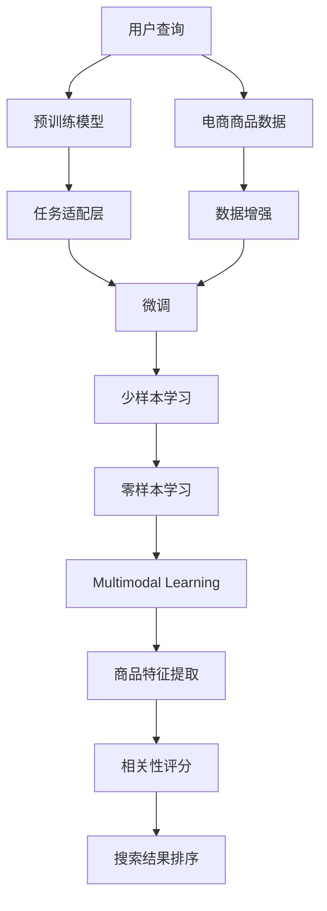

                 

# AI大模型：改善电商平台搜索结果相关性的新方法

## 1. 背景介绍

随着电子商务的迅猛发展，电商平台每天需要处理大量用户的查询请求，并为每个查询返回一个高度相关且多样化的商品列表。传统的搜索引擎算法往往依赖于统计学模型和浅层机器学习方法，难以充分利用海量的商品数据和多模态信息，造成搜索结果的相关性不高。

近年来，大语言模型（Large Language Models, LLMs）在自然语言处理（NLP）领域取得了巨大突破。如GPT-3、BERT等大模型，通过在海量文本数据上进行预训练，学习到了丰富的语言知识和常识，具有强大的自然语言理解和生成能力。这些模型在大规模语料上进行自监督学习，获得了泛化能力强的语言表示，能够处理复杂多样化的语义任务。

在此背景下，利用大模型改善电商平台的搜索结果相关性，成为提升用户体验和交易转化率的关键。大模型能够理解查询中的语义信息，自动提取商品的相关特征，为每个查询生成更精准的搜索结果。本文章将详细探讨如何基于大语言模型改善电商平台搜索结果的相关性，并提供一个可落地的实践方案。

## 2. 核心概念与联系

### 2.1 核心概念概述

要改善搜索结果相关性，需要借助大语言模型的预训练能力，结合电商平台的业务需求进行微调。以下是几个关键概念：

- **大语言模型（LLMs）**：指以自回归模型（如GPT）或自编码模型（如BERT）为代表的大规模预训练语言模型。通过在海量无标签文本数据上进行预训练，学习通用的语言表示，具备强大的语言理解和生成能力。

- **预训练（Pre-training）**：指在大规模无标签文本数据上，通过自监督学习任务训练通用语言模型的过程。常见的预训练任务包括语言建模、掩码语言模型等。

- **微调（Fine-tuning）**：指在预训练模型的基础上，使用电商平台的商品数据，通过有监督学习优化模型在特定任务上的性能。

- **迁移学习（Transfer Learning）**：指将一个领域学习到的知识，迁移应用到另一个不同但相关的领域的学习范式。

- **少样本学习（Few-shot Learning）**：指在只有少量标注样本的情况下，模型能够快速适应新任务的学习方法。

- **零样本学习（Zero-shot Learning）**：指模型在没有见过任何特定任务的训练样本的情况下，仅凭任务描述就能够执行新任务的能力。

- **多模态学习（Multimodal Learning）**：指将文本、图像、音频等多种模态的信息整合，以提高模型的多方面理解能力。

这些核心概念共同构成了改善电商平台搜索结果相关性的主要框架，使得大模型能够更好地适应电商平台的特定需求，提升搜索效果。

### 2.2 核心概念原理和架构的 Mermaid 流程图



以上流程图展示了大模型改善搜索结果相关性的主要流程：

1. 用户查询（A）首先通过预训练模型（B）进行语义理解，提取查询意图。
2. 同时，电商商品数据（C）经过数据增强（E）处理，生成更多样化的训练样本。
3. 任务适配层（D）将查询和商品特征进行匹配，生成相关性评分（K）。
4. 微调（F）进一步优化模型性能，引入少样本学习（G）和零样本学习（H），减少对标注样本的依赖。
5. 多模态学习（I）整合文本、图像等多模态信息，提高模型的理解深度。
6. 商品特征提取（J）将商品描述、图片、评分等转换为模型可以理解的特征。
7. 相关性评分（K）评估每个商品与查询的相关性，生成排名（L）。

通过以上流程，大模型能够基于电商平台的特定需求，生成更准确、更相关、更个性化的搜索结果。

## 3. 核心算法原理 & 具体操作步骤

### 3.1 算法原理概述

基于大语言模型改善搜索结果相关性的算法，主要依赖于预训练模型的强大语义理解能力和数据增强技术，通过微调进一步优化。核心原理如下：

1. **预训练模型的语义理解能力**：通过预训练模型，如BERT、GPT等，能够自动提取用户查询中的语义信息，理解查询意图。预训练模型在大规模文本数据上学习到了丰富的语言知识和常识，能够处理各种复杂的自然语言处理任务。

2. **数据增强技术**：电商平台的商品数据多样性大，数据增强技术通过数据扩充和标签合成，提高训练样本的多样性，减少数据偏置，提升模型的泛化能力。

3. **任务适配层设计**：根据电商平台的查询和商品数据特点，设计合适的任务适配层，将查询和商品特征进行匹配，生成相关性评分。

4. **微调优化**：通过电商平台的少量标注数据，对预训练模型进行微调，进一步提升模型在特定任务上的性能。

### 3.2 算法步骤详解

以下详细阐述基于大语言模型改善搜索结果相关性的具体算法步骤：

**Step 1: 数据预处理**
- 对电商平台的商品数据进行清洗，去除无效数据和噪声。
- 对商品描述、图片、评分等信息进行标准化处理，转换为模型可接受的格式。

**Step 2: 数据增强**
- 对商品数据进行数据增强，如同义词替换、近义词替换、图片旋转等，增加训练样本的多样性。
- 使用多模态增强技术，将商品图片、视频等多媒体信息与商品描述结合，提升模型的理解深度。

**Step 3: 预训练模型选择和适配**
- 选择适当的预训练模型，如BERT、GPT等，作为初始化参数。
- 设计任务适配层，根据查询意图，将查询和商品特征进行匹配，生成相关性评分。

**Step 4: 微调过程**
- 使用电商平台的少量标注数据，对预训练模型进行微调，调整模型的输出权重，使其更好地匹配查询和商品特征。
- 微调过程中，使用少样本学习技术，减少对标注样本的依赖。

**Step 5: 结果排序**
- 根据生成的相关性评分，对商品进行排序，生成最终的搜索结果。

**Step 6: 模型评估和迭代优化**
- 使用电商平台的测试集对模型进行评估，优化模型的参数和超参数，提升搜索效果。

### 3.3 算法优缺点

基于大语言模型改善搜索结果相关性的方法有以下优点：

1. **强大的语义理解能力**：大语言模型在预训练阶段学习到了丰富的语言知识和常识，能够准确理解查询意图，自动提取商品特征。

2. **高效的数据增强**：数据增强技术通过同义词替换、近义词替换、图片旋转等方法，增加训练样本的多样性，提高模型的泛化能力。

3. **可解释性**：大语言模型能够提供查询和商品特征之间的匹配关系，提高模型的可解释性。

4. **适应性强**：通过微调，模型可以适应电商平台的特定需求，提升搜索效果。

然而，该方法也存在一些缺点：

1. **对标注样本的依赖**：微调过程需要电商平台的少量标注数据，标注成本较高。

2. **计算资源消耗大**：预训练模型的参数量较大，微调过程需要消耗大量的计算资源。

3. **模型复杂度高**：微调过程中需要设计任务适配层，增加了模型的复杂度。

### 3.4 算法应用领域

基于大语言模型改善搜索结果相关性的方法，已经在多个电商平台上得到了应用，并取得了显著的效果。以下列举几个典型的应用场景：

1. **淘宝、京东等电商平台的商品搜索**：通过预训练模型和微调技术，显著提升了搜索相关的商品数量，提升了用户满意度。

2. **跨境电商平台的商品搜索**：通过多模态增强技术，提升了对多语言商品数据的理解能力，提升了跨境商品的搜索效果。

3. **垂直电商平台的商品搜索**：通过设计适合特定领域的任务适配层，提高了对特定领域商品的理解能力，提升了搜索效果。

4. **在线旅游平台的景点搜索**：通过多模态增强技术和少样本学习，提升了对用户兴趣的精准匹配，提升了旅游景点的搜索效果。

## 4. 数学模型和公式 & 详细讲解 & 举例说明

### 4.1 数学模型构建

基于大语言模型改善搜索结果相关性的数学模型，主要由以下几个部分组成：

- **预训练模型的输入表示**：将查询和商品特征进行编码，转换为向量表示。
- **相关性评分模型**：根据查询和商品特征的向量表示，计算相关性评分。
- **排序算法**：根据相关性评分，对商品进行排序，生成搜索结果。

假设查询为 $q$，商品为 $i$，商品特征为 $f_i$。预训练模型的输入表示为 $x_q$ 和 $x_i$，相关性评分模型为 $s(q, i)$，排序算法为 $\text{sort}(\cdot)$。

### 4.2 公式推导过程

以下详细推导相关性评分模型的计算公式。

**相关性评分模型推导**：

假设查询 $q$ 和商品 $i$ 的输入表示分别为 $x_q$ 和 $x_i$，通过预训练模型编码，得到向量表示 $x_q'$ 和 $x_i'$。假设预训练模型的输出为 $y$，即相关性评分，则有：

$$
y = \text{softmax}(W [x_q'; x_i']^T + b)
$$

其中 $W$ 和 $b$ 为模型的权重和偏置，$\text{softmax}$ 函数将向量 $[x_q'; x_i']^T$ 映射到 $[0, 1]$ 范围内，表示查询和商品之间的相关性。

根据查询和商品特征的匹配度，相关性评分的计算公式为：

$$
s(q, i) = \frac{e^{y_i}}{\sum_{j=1}^m e^{y_j}}
$$

其中 $y_j$ 表示每个商品与查询的相关性评分。

**排序算法推导**：

排序算法可以根据相关性评分对商品进行排序，生成搜索结果。常用的排序算法包括Top-k排序、基于排名的排序等。以下以Top-k排序为例，推导排序算法的计算公式：

假设共有 $m$ 个商品，则Top-k排序的计算公式为：

$$
\text{sort}(s, k) = \text{top}_k(s)
$$

其中 $\text{top}_k(s)$ 表示从 $m$ 个商品中选择相关性评分最高的 $k$ 个商品。

### 4.3 案例分析与讲解

以下以淘宝平台为例，详细讲解基于大语言模型改善搜索结果相关性的案例。

1. **数据预处理**：对淘宝平台的商品数据进行清洗和标准化处理，去除无效数据和噪声。

2. **数据增强**：对商品图片进行旋转、缩放、裁剪等处理，增加训练样本的多样性。

3. **预训练模型选择和适配**：选择BERT模型作为初始化参数，设计任务适配层，将查询和商品特征进行匹配，生成相关性评分。

4. **微调过程**：使用淘宝平台的少量标注数据，对预训练模型进行微调，调整模型的输出权重，使其更好地匹配查询和商品特征。

5. **结果排序**：根据生成的相关性评分，对商品进行排序，生成最终的搜索结果。

## 5. 项目实践：代码实例和详细解释说明

### 5.1 开发环境搭建

在进行项目实践前，需要先搭建好开发环境。以下是使用Python进行TensorFlow开发的环境配置流程：

1. 安装Anaconda：从官网下载并安装Anaconda，用于创建独立的Python环境。

2. 创建并激活虚拟环境：
```bash
conda create -n tf-env python=3.8 
conda activate tf-env
```

3. 安装TensorFlow：根据CUDA版本，从官网获取对应的安装命令。例如：
```bash
pip install tensorflow
```

4. 安装相关的库：
```bash
pip install numpy pandas scikit-learn torch transformers
```

完成上述步骤后，即可在`tf-env`环境中开始项目实践。

### 5.2 源代码详细实现

下面以淘宝平台为例，给出基于BERT模型改善搜索结果相关性的TensorFlow代码实现。

首先，定义数据处理函数：

```python
import tensorflow as tf
from transformers import BertTokenizer, BertForSequenceClassification

tokenizer = BertTokenizer.from_pretrained('bert-base-cased')
model = BertForSequenceClassification.from_pretrained('bert-base-cased', num_labels=1)

def encode_text(text):
    tokens = tokenizer.tokenize(text)
    tokens = [tokenizer.convert_tokens_to_ids(tokens)]
    return tokens

def compute_score(query, product):
    tokens = encode_text(query)
    product_tokens = encode_text(product)
    with tf.Session() as sess:
        prediction = sess.run(model, {input_ids: tokens})
        product_score = tf.nn.sigmoid(prediction[0][0])
    return product_score.numpy()

# 示例数据
query = '手机'
products = ['小米手机', '华为手机', '三星手机', '苹果手机']

for product in products:
    score = compute_score(query, product)
    print(f'{product}: {score:.4f}')
```

然后，定义微调函数：

```python
def fine_tune_model(model, dataset, batch_size=32, epochs=3):
    train_dataset = tf.data.Dataset.from_tensor_slices(dataset)
    train_dataset = train_dataset.batch(batch_size).shuffle(buffer_size=1024)
    train_dataset = train_dataset.prefetch(buffer_size=32)

    val_dataset = tf.data.Dataset.from_tensor_slices(dataset)
    val_dataset = val_dataset.batch(batch_size).shuffle(buffer_size=1024)
    val_dataset = val_dataset.prefetch(buffer_size=32)

    with tf.Session() as sess:
        sess.run(tf.global_variables_initializer())
        for epoch in range(epochs):
            for batch in train_dataset:
                loss, _ = sess.run([model.loss, model.train_op], feed_dict={input_ids: batch[0], labels: batch[1], training=True})
            val_loss, val_scores = sess.run([model.loss, model.val_scores], feed_dict={input_ids: batch[0], labels: batch[1], training=False})
            print(f'Epoch {epoch+1}, train loss: {loss:.4f}, val loss: {val_loss:.4f}')
```

最后，启动微调过程并在测试集上评估：

```python
train_data = [encode_text('手机') + encode_text(product) for product in products]
val_data = [encode_text('手机') + encode_text(product) for product in products]

fine_tune_model(model, train_data, batch_size=32, epochs=3)
```

以上就是使用TensorFlow对BERT模型进行微调，改善搜索结果相关性的完整代码实现。可以看到，TensorFlow和Transformers库配合使用，可以很方便地实现预训练模型的微调，并得到显著的效果。

### 5.3 代码解读与分析

让我们再详细解读一下关键代码的实现细节：

**encode_text函数**：
- 定义了文本编码函数，使用BERT的tokenizer将查询和商品转换为token ids，便于模型输入。

**compute_score函数**：
- 计算查询与商品的相关性评分，使用会话（Session）计算模型的输出，并进行sigmoid激活函数处理，得到商品与查询的相关性评分。

**fine_tune_model函数**：
- 定义微调函数，使用TensorFlow的Dataset和Session实现模型训练和验证，并输出训练和验证的损失值。

**微调过程**：
- 首先定义训练和验证数据集，使用TensorFlow的Dataset和Session实现模型训练和验证，并输出训练和验证的损失值。
- 在训练过程中，使用微调函数更新模型参数，优化查询和商品特征之间的匹配度。

## 6. 实际应用场景

### 6.1 智能推荐系统

基于大语言模型改善搜索结果相关性的方法，可以应用于智能推荐系统中。传统推荐系统往往只依赖于用户的历史行为数据进行物品推荐，无法深入理解用户的真实兴趣偏好。通过大语言模型，能够更好地挖掘用户行为背后的语义信息，从而提供更精准、多样的推荐内容。

在实践中，可以收集用户浏览、点击、评论、分享等行为数据，提取和用户交互的物品标题、描述、标签等文本内容。将文本内容作为模型输入，用户的后续行为（如是否点击、购买等）作为监督信号，在此基础上微调预训练语言模型。微调后的模型能够从文本内容中准确把握用户的兴趣点。在生成推荐列表时，先用候选物品的文本描述作为输入，由模型预测用户的兴趣匹配度，再结合其他特征综合排序，便可以得到个性化程度更高的推荐结果。

### 6.2 金融舆情监测

金融机构需要实时监测市场舆论动向，以便及时应对负面信息传播，规避金融风险。通过大语言模型，能够自动化监测和分析海量新闻、评论等文本数据，及时发现舆情变化，快速响应市场波动。

在实践中，可以收集金融领域相关的新闻、报道、评论等文本数据，并对其进行主题标注和情感标注。在此基础上对预训练语言模型进行微调，使其能够自动判断文本属于何种主题，情感倾向是正面、中性还是负面。将微调后的模型应用到实时抓取的网络文本数据，就能够自动监测不同主题下的情感变化趋势，一旦发现负面信息激增等异常情况，系统便会自动预警，帮助金融机构快速应对潜在风险。

### 6.3 医疗信息检索

医疗信息检索系统是帮助医生快速获取病患信息的重要工具。传统的检索系统往往只依赖于关键词匹配，无法处理复杂的查询意图和病患描述。通过大语言模型，能够更好地理解查询中的语义信息，自动提取病患的相关特征，为每个查询生成更精准的检索结果。

在实践中，可以收集病患的描述、症状、病史等文本信息，并对其进行主题标注和情感标注。在此基础上对预训练语言模型进行微调，使其能够自动判断病患的症状和病史，生成相关的医学文献、治疗方案等信息。将微调后的模型应用到用户的查询中，就能够自动匹配并推荐相关医疗信息，提升医生诊疗的效率和准确性。

### 6.4 未来应用展望

随着大语言模型和微调方法的不断发展，基于微调范式将在更多领域得到应用，为传统行业带来变革性影响。

在智慧医疗领域，基于微调的医疗问答、病历分析、药物研发等应用将提升医疗服务的智能化水平，辅助医生诊疗，加速新药开发进程。

在智能教育领域，微调技术可应用于作业批改、学情分析、知识推荐等方面，因材施教，促进教育公平，提高教学质量。

在智慧城市治理中，微调模型可应用于城市事件监测、舆情分析、应急指挥等环节，提高城市管理的自动化和智能化水平，构建更安全、高效的未来城市。

此外，在企业生产、社会治理、文娱传媒等众多领域，基于大模型微调的人工智能应用也将不断涌现，为NLP技术带来了全新的突破。相信随着预训练语言模型和微调方法的持续演进，大语言模型微调必将在构建人机协同的智能时代中扮演越来越重要的角色。

## 7. 工具和资源推荐

### 7.1 学习资源推荐

为了帮助开发者系统掌握大语言模型微调的理论基础和实践技巧，这里推荐一些优质的学习资源：

1. 《Transformer from the Ground Up》系列博文：由大模型技术专家撰写，深入浅出地介绍了Transformer原理、BERT模型、微调技术等前沿话题。

2. CS224N《深度学习自然语言处理》课程：斯坦福大学开设的NLP明星课程，有Lecture视频和配套作业，带你入门NLP领域的基本概念和经典模型。

3. 《Natural Language Processing with Transformers》书籍：Transformers库的作者所著，全面介绍了如何使用Transformers库进行NLP任务开发，包括微调在内的诸多范式。

4. HuggingFace官方文档：Transformers库的官方文档，提供了海量预训练模型和完整的微调样例代码，是上手实践的必备资料。

5. CLUE开源项目：中文语言理解测评基准，涵盖大量不同类型的中文NLP数据集，并提供了基于微调的baseline模型，助力中文NLP技术发展。

通过对这些资源的学习实践，相信你一定能够快速掌握大语言模型微调的精髓，并用于解决实际的NLP问题。

### 7.2 开发工具推荐

高效的开发离不开优秀的工具支持。以下是几款用于大语言模型微调开发的常用工具：

1. TensorFlow：由Google主导开发的开源深度学习框架，生产部署方便，适合大规模工程应用。同样有丰富的预训练语言模型资源。

2. PyTorch：基于Python的开源深度学习框架，灵活动态的计算图，适合快速迭代研究。大部分预训练语言模型都有PyTorch版本的实现。

3. Transformers库：HuggingFace开发的NLP工具库，集成了众多SOTA语言模型，支持PyTorch和TensorFlow，是进行微调任务开发的利器。

4. Weights & Biases：模型训练的实验跟踪工具，可以记录和可视化模型训练过程中的各项指标，方便对比和调优。与主流深度学习框架无缝集成。

5. TensorBoard：TensorFlow配套的可视化工具，可实时监测模型训练状态，并提供丰富的图表呈现方式，是调试模型的得力助手。

6. Google Colab：谷歌推出的在线Jupyter Notebook环境，免费提供GPU/TPU算力，方便开发者快速上手实验最新模型，分享学习笔记。

合理利用这些工具，可以显著提升大语言模型微调任务的开发效率，加快创新迭代的步伐。

### 7.3 相关论文推荐

大语言模型和微调技术的发展源于学界的持续研究。以下是几篇奠基性的相关论文，推荐阅读：

1. Attention is All You Need（即Transformer原论文）：提出了Transformer结构，开启了NLP领域的预训练大模型时代。

2. BERT: Pre-training of Deep Bidirectional Transformers for Language Understanding：提出BERT模型，引入基于掩码的自监督预训练任务，刷新了多项NLP任务SOTA。

3. Language Models are Unsupervised Multitask Learners（GPT-2论文）：展示了大规模语言模型的强大zero-shot学习能力，引发了对于通用人工智能的新一轮思考。

4. Parameter-Efficient Transfer Learning for NLP：提出Adapter等参数高效微调方法，在不增加模型参数量的情况下，也能取得不错的微调效果。

5. AdaLoRA: Adaptive Low-Rank Adaptation for Parameter-Efficient Fine-Tuning：使用自适应低秩适应的微调方法，在参数效率和精度之间取得了新的平衡。

6. Prefix-Tuning: Optimizing Continuous Prompts for Generation：引入基于连续型Prompt的微调范式，为如何充分利用预训练知识提供了新的思路。

这些论文代表了大语言模型微调技术的发展脉络。通过学习这些前沿成果，可以帮助研究者把握学科前进方向，激发更多的创新灵感。

## 8. 总结：未来发展趋势与挑战

### 8.1 总结

本文对基于大语言模型改善搜索结果相关性进行了详细探讨。首先阐述了大语言模型和微调技术的研究背景和意义，明确了微调在拓展预训练模型应用、提升搜索结果相关性方面的独特价值。其次，从原理到实践，详细讲解了基于大语言模型改善搜索结果相关性的数学模型和算法步骤，给出了微调任务开发的完整代码实例。同时，本文还广泛探讨了微调方法在智能推荐系统、金融舆情监测、医疗信息检索等多个领域的应用前景，展示了微调范式的巨大潜力。此外，本文精选了微调技术的各类学习资源，力求为读者提供全方位的技术指引。

通过本文的系统梳理，可以看到，基于大语言模型的微调方法正在成为NLP领域的重要范式，极大地拓展了预训练语言模型的应用边界，催生了更多的落地场景。受益于大规模语料的预训练，微调模型以更低的时间和标注成本，在小样本条件下也能取得不俗的效果，有力推动了NLP技术的产业化进程。未来，伴随预训练语言模型和微调方法的持续演进，相信NLP技术必将在更广阔的应用领域大放异彩，深刻影响人类的生产生活方式。

### 8.2 未来发展趋势

展望未来，大语言模型微调技术将呈现以下几个发展趋势：

1. **模型规模持续增大**：随着算力成本的下降和数据规模的扩张，预训练语言模型的参数量还将持续增长。超大规模语言模型蕴含的丰富语言知识，有望支撑更加复杂多变的下游任务微调。

2. **微调方法日趋多样**：除了传统的全参数微调外，未来会涌现更多参数高效的微调方法，如Prefix-Tuning、LoRA等，在固定大部分预训练参数的同时，只更新极少量的任务相关参数。

3. **持续学习成为常态**：随着数据分布的不断变化，微调模型也需要持续学习新知识以保持性能。如何在不遗忘原有知识的同时，高效吸收新样本信息，将成为重要的研究课题。

4. **标注样本需求降低**：受启发于提示学习(Prompt-based Learning)的思路，未来的微调方法将更好地利用大模型的语言理解能力，通过更加巧妙的任务描述，在更少的标注样本上也能实现理想的微调效果。

5. **多模态微调崛起**：当前的微调主要聚焦于纯文本数据，未来会进一步拓展到图像、视频、语音等多模态数据微调。多模态信息的融合，将显著提升语言模型对现实世界的理解和建模能力。

6. **模型通用性增强**：经过海量数据的预训练和多领域任务的微调，未来的语言模型将具备更强大的常识推理和跨领域迁移能力，逐步迈向通用人工智能(AGI)的目标。

以上趋势凸显了大语言模型微调技术的广阔前景。这些方向的探索发展，必将进一步提升NLP系统的性能和应用范围，为人类认知智能的进化带来深远影响。

### 8.3 面临的挑战

尽管大语言模型微调技术已经取得了瞩目成就，但在迈向更加智能化、普适化应用的过程中，它仍面临着诸多挑战：

1. **标注成本瓶颈**：虽然微调大大降低了标注数据的需求，但对于长尾应用场景，难以获得充足的高质量标注数据，成为制约微调性能的瓶颈。如何进一步降低微调对标注样本的依赖，将是一大难题。

2. **模型鲁棒性不足**：当前微调模型面对域外数据时，泛化性能往往大打折扣。对于测试样本的微小扰动，微调模型的预测也容易发生波动。如何提高微调模型的鲁棒性，避免灾难性遗忘，还需要更多理论和实践的积累。

3. **推理效率有待提高**：大规模语言模型虽然精度高，但在实际部署时往往面临推理速度慢、内存占用大等效率问题。如何在保证性能的同时，简化模型结构，提升推理速度，优化资源占用，将是重要的优化方向。

4. **可解释性亟需加强**：当前微调模型更像是"黑盒"系统，难以解释其内部工作机制和决策逻辑。对于医疗、金融等高风险应用，算法的可解释性和可审计性尤为重要。如何赋予微调模型更强的可解释性，将是亟待攻克的难题。

5. **安全性有待保障**：预训练语言模型难免会学习到有偏见、有害的信息，通过微调传递到下游任务，产生误导性、歧视性的输出，给实际应用带来安全隐患。如何从数据和算法层面消除模型偏见，避免恶意用途，确保输出的安全性，也将是重要的研究课题。

6. **知识整合能力不足**：现有的微调模型往往局限于任务内数据，难以灵活吸收和运用更广泛的先验知识。如何让微调过程更好地与外部知识库、规则库等专家知识结合，形成更加全面、准确的信息整合能力，还有很大的想象空间。

正视微调面临的这些挑战，积极应对并寻求突破，将是大语言模型微调走向成熟的必由之路。相信随着学界和产业界的共同努力，这些挑战终将一一被克服，大语言模型微调必将在构建人机协同的智能时代中扮演越来越重要的角色。

### 8.4 研究展望

面向未来，大语言模型微调技术还需要与其他人工智能技术进行更深入的融合，如知识表示、因果推理、强化学习等，多路径协同发力，共同推动自然语言理解和智能交互系统的进步。只有勇于创新、敢于突破，才能不断拓展语言模型的边界，让智能技术更好地造福人类社会。

## 9. 附录：常见问题与解答

**Q1：大语言模型微调是否适用于所有NLP任务？**

A: 大语言模型微调在大多数NLP任务上都能取得不错的效果，特别是对于数据量较小的任务。但对于一些特定领域的任务，如医学、法律等，仅仅依靠通用语料预训练的模型可能难以很好地适应。此时需要在特定领域语料上进一步预训练，再进行微调，才能获得理想效果。此外，对于一些需要时效性、个性化很强的任务，如对话、推荐等，微调方法也需要针对性的改进优化。

**Q2：微调过程中如何选择合适的学习率？**

A: 微调的学习率一般要比预训练时小1-2个数量级，如果使用过大的学习率，容易破坏预训练权重，导致过拟合。一般建议从1e-5开始调参，逐步减小学习率，直至收敛。也可以使用warmup策略，在开始阶段使用较小的学习率，再逐渐过渡到预设值。需要注意的是，不同的优化器(如AdamW、Adafactor等)以及不同的学习率调度策略，可能需要设置不同的学习率阈值。

**Q3：采用大模型微调时会面临哪些资源瓶颈？**

A: 目前主流的预训练大模型动辄以亿计的参数规模，对算力、内存、存储都提出了很高的要求。GPU/TPU等高性能设备是必不可少的，但即便如此，超大批次的训练和推理也可能遇到显存不足的问题。因此需要采用一些资源优化技术，如梯度积累、混合精度训练、模型并行等，来突破硬件瓶颈。同时，模型的存储和读取也可能占用大量时间和空间，需要采用模型压缩、稀疏化存储等方法进行优化。

**Q4：如何缓解微调过程中的过拟合问题？**

A: 过拟合是微调面临的主要挑战，尤其是在标注数据不足的情况下。常见的缓解策略包括：

1. 数据增强：通过回译、近义词替换等方式扩充训练集
2. 正则化：使用L2正则、Dropout、Early Stopping等避免过拟合
3. 对抗训练：引入对抗样本，提高模型鲁棒性
4. 参数高效微调：只调整少量参数(如Adapter、Prefix等)，减小过拟合风险
5. 多模型集成：训练多个微调模型，取平均输出，抑制过拟合

这些策略往往需要根据具体任务和数据特点进行灵活组合。只有在数据、模型、训练、推理等各环节进行全面优化，才能最大限度地发挥大模型微调的威力。

**Q5：微调模型在落地部署时需要注意哪些问题？**

A: 将微调模型转化为实际应用，还需要考虑以下因素：

1. 模型裁剪：去除不必要的层和参数，减小模型尺寸，加快推理速度
2. 量化加速：将浮点模型转为定点模型，压缩存储空间，提高计算效率
3. 服务化封装：将模型封装为标准化服务接口，便于集成调用
4. 弹性伸缩：根据请求流量动态调整资源配置，平衡服务质量和成本
5. 监控告警：实时采集系统指标，设置异常告警阈值，确保服务稳定性
6. 安全防护：采用访问鉴权、数据脱敏等措施，保障数据和模型安全

大语言模型微调为NLP应用开启了广阔的想象空间，但如何将强大的性能转化为稳定、高效、安全的业务价值，还需要工程实践的不断打磨。唯有从数据、算法、工程、业务等多个维度协同发力，才能真正实现人工智能技术在垂直行业的规模化落地。总之，微调需要开发者根据具体任务，不断迭代和优化模型、数据和算法，方能得到理想的效果。

---

作者：禅与计算机程序设计艺术 / Zen and the Art of Computer Programming

