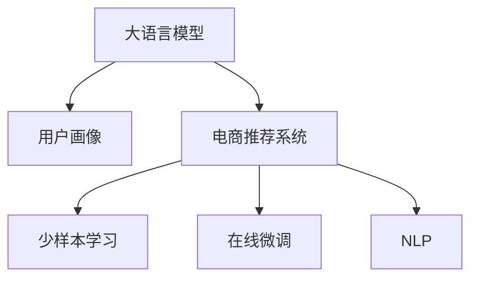

                 

# AI大模型：电商个性化营销的新引擎

> 关键词：大语言模型，电商推荐系统，个性化营销，用户画像，自然语言处理(NLP)

## 1. 背景介绍

### 1.1 问题由来

随着电子商务的快速发展，电商平台已经从传统的“一视同仁”转变为“精准营销”。传统的“一刀切”推荐策略，已无法满足用户日益个性化的需求。个性化营销的核心是“以用户为中心”，在合适的时间向合适的用户推送合适的商品，从而提升用户购物体验，增加用户粘性和忠诚度。

传统的个性化推荐系统，依赖于用户的点击、浏览、购买行为数据，并基于这些行为数据进行用户分群，再针对不同群体进行定制化推荐。然而，这种方式存在以下问题：

1. **用户行为稀疏性**：用户的浏览、点击、购买行为数据往往稀疏且不连续，难以准确刻画用户的兴趣和偏好。
2. **特征维度高**：特征维度可能高达几千甚至上万，需要进行高维度的降维和特征工程，且模型复杂度高，计算资源需求大。
3. **实时性不足**：用户需求和兴趣动态变化，传统的推荐系统无法实时响应，且模型训练和推理速度慢，难以满足实时性要求。

为了克服这些限制，利用AI大模型的先进技术和理念，电商推荐系统迈向了新的发展方向。基于大模型的个性化推荐系统，通过自监督学习和少样本学习技术，能够从用户行为数据、文本评论、社交网络等多种数据源中提取多维度的用户特征，构建高精度的用户画像，从而实现高效的个性化推荐。

### 1.2 问题核心关键点

基于大模型的个性化推荐系统，其核心关键点如下：

1. **数据融合**：从多个数据源融合用户特征，构建多维度的用户画像。
2. **少样本学习**：在大模型预训练的知识和经验基础上，通过少样本学习技术实现快速、准确的推荐。
3. **实时性**：通过在线微调和大模型推理技术，实现高效的实时推荐。
4. **泛化能力**：具备较强的跨领域泛化能力，能够适应不同电商平台的个性化需求。

## 2. 核心概念与联系

### 2.1 核心概念概述

为更好地理解基于大模型的电商个性化推荐系统，本节将介绍几个密切相关的核心概念：

- **大语言模型(Large Language Model, LLM)**：以自回归(如GPT)或自编码(如BERT)模型为代表的大规模预训练语言模型。通过在大规模无标签文本语料上进行预训练，学习通用的语言知识和表示，具备强大的语言理解和生成能力。

- **用户画像(User Profile)**：通过数据分析和挖掘，构建用户的多维度特征集合，包括历史行为、人口统计、社交网络、评论情感等，用于刻画用户的兴趣和偏好。

- **电商推荐系统(E-Commerce Recommendation System)**：基于用户画像，通过推荐算法为用户推荐商品或服务的系统。大模型的应用可以大幅提升推荐系统的精准度和实时性。

- **少样本学习(Few-shot Learning)**：在仅有少量标注样本的情况下，模型能够快速适应新任务，实现零样本或少样本学习，减少训练成本和数据需求。

- **在线微调(Online Fine-Tuning)**：通过在线更新模型参数，实时响应新的数据和用户需求，提高推荐系统的实时性和准确性。

- **自然语言处理(NLP)**：研究如何使计算机理解和处理自然语言的技术，包括文本预处理、语言模型、机器翻译等，是构建电商推荐系统的重要基础。

这些核心概念之间的逻辑关系可以通过以下Mermaid流程图来展示：



这个流程图展示了大语言模型、用户画像、电商推荐系统、少样本学习和在线微调之间的联系和作用：

1. 大语言模型通过预训练学习通用的语言表示，为构建用户画像和电商推荐系统提供了知识基础。
2. 用户画像通过融合多源数据，形成高维度的用户特征，供电商推荐系统使用。
3. 电商推荐系统基于用户画像，通过少样本学习和在线微调技术，实时生成个性化推荐。
4. NLP技术用于文本预处理、语言模型训练等，支持电商推荐系统的深度挖掘和实时处理。

## 3. 核心算法原理 & 具体操作步骤

### 3.1 算法原理概述

基于大模型的电商个性化推荐系统，本质上是一个基于用户画像的个性化推荐模型。其核心思想是：利用大模型的预训练知识，通过融合用户多源数据，构建高精度的用户画像，再通过少样本学习和在线微调技术，实现实时、高效的个性化推荐。

形式化地，假设用户画像为 $\mathbf{U}$，电商推荐系统为 $\mathbf{R}$，用户画像与推荐系统之间的关系可以表示为：

$$
\mathbf{R} = f(\mathbf{U})
$$

其中 $f$ 为推荐算法，用于根据用户画像生成推荐结果。

通过大模型的预训练知识，用户画像 $\mathbf{U}$ 可以表示为多个特征向量的集合，每个向量对应一种用户特征，如历史行为、人口统计、评论情感等。这些特征向量通过某种方式组合，形成最终的用户画像，供电商推荐系统使用。

### 3.2 算法步骤详解

基于大模型的电商个性化推荐系统一般包括以下几个关键步骤：

**Step 1: 数据融合与特征工程**

- 收集用户的多源数据，包括历史行为、人口统计、社交网络、评论情感等。
- 使用自然语言处理技术，对文本评论进行预处理、分词、编码，提取其中的关键词和情感。
- 将不同类型的数据融合到用户画像中，形成高维度的用户特征向量。

**Step 2: 少样本学习与模型微调**

- 选择合适的预训练语言模型，如BERT、GPT等。
- 在用户画像特征向量上，使用少样本学习技术，如Prompt Learning、Few-shot Learning等，训练出微调后的推荐模型。
- 使用在线微调技术，根据用户的实时行为数据，动态更新推荐模型，提升推荐效果。

**Step 3: 模型推理与推荐生成**

- 将实时用户行为数据输入微调后的推荐模型，输出推荐结果。
- 根据推荐结果，生成推荐商品列表，推送给用户。

### 3.3 算法优缺点

基于大模型的电商个性化推荐系统具有以下优点：

1. **高效性**：利用大模型的预训练知识，通过少样本学习，能够在较少的标注样本下快速构建个性化推荐模型。
2. **实时性**：使用在线微调技术，能够实时响应用户行为数据，动态更新推荐结果。
3. **精度高**：大模型的强大表示能力，结合少样本学习，能够从多源数据中提取高精度的用户特征。
4. **可扩展性**：大模型具有较强的跨领域泛化能力，能够适应不同电商平台的个性化需求。

同时，该方法也存在以下局限性：

1. **数据需求高**：虽然少样本学习能够减少训练样本需求，但构建高质量的用户画像，仍需大量的用户行为和社交网络数据。
2. **计算资源消耗大**：大模型的推理和微调需要较高的计算资源，对硬件环境要求较高。
3. **隐私风险**：用户画像和推荐模型涉及用户隐私数据，需严格遵守数据保护法规，确保数据安全和隐私。

尽管存在这些局限性，但就目前而言，基于大模型的电商个性化推荐系统仍然是最主流的方法之一，广泛应用于各大电商平台的推荐系统开发中。

### 3.4 算法应用领域

基于大模型的电商个性化推荐系统，已经在各大电商平台上得到了广泛应用，涵盖了几乎所有的推荐任务，例如：

- 商品推荐：根据用户的历史浏览、购买记录，推荐符合用户兴趣的商品。
- 活动推荐：根据用户的行为数据，推荐特定的促销活动，提升用户参与度。
- 内容推荐：根据用户对内容的互动行为，推荐相关的内容资源，如视频、文章等。
- 商品搜索：根据用户的搜索关键词，推荐相关的商品。

除了上述这些经典任务外，大模型推荐系统还被创新性地应用于跨平台推荐、跨场景推荐、个性化商品定制等，为电商平台的推荐系统带来了新的突破。随着大模型的不断发展，相信电商推荐系统将有更多的应用场景，为用户提供更加个性化、精准的推荐服务。

## 4. 数学模型和公式 & 详细讲解 & 举例说明

### 4.1 数学模型构建

本节将使用数学语言对基于大模型的电商个性化推荐系统进行更加严格的刻画。

记用户画像为 $\mathbf{U}=[u_1, u_2, \cdots, u_n]$，其中 $u_i$ 表示用户的第 $i$ 个特征向量，如历史行为、人口统计等。电商推荐系统为 $\mathbf{R}=[r_1, r_2, \cdots, r_m]$，其中 $r_i$ 表示商品的第 $i$ 个特征向量，如商品描述、价格、评分等。用户画像与推荐系统之间的关系可以表示为：

$$
\mathbf{R} = f(\mathbf{U}) = \mathbf{A}\mathbf{U}
$$

其中 $\mathbf{A}$ 为推荐矩阵，用于将用户画像映射到推荐系统中。

在大模型的预训练知识基础上，用户画像 $\mathbf{U}$ 和推荐系统 $\mathbf{R}$ 可以表示为高维度的向量。假设用户画像向量的维度为 $d_1$，推荐系统向量的维度为 $d_2$，则 $\mathbf{A}$ 的维度为 $d_2 \times d_1$。

### 4.2 公式推导过程

假设用户画像 $\mathbf{U}$ 和推荐系统 $\mathbf{R}$ 均为实值向量，则推荐矩阵 $\mathbf{A}$ 的计算公式为：

$$
\mathbf{A} = \mathbf{W}_u \mathbf{B} \mathbf{W}_r^T
$$

其中 $\mathbf{W}_u$ 和 $\mathbf{W}_r$ 分别为用户画像和推荐系统的投影矩阵，$\mathbf{B}$ 为预训练语言模型的权重矩阵，用于映射用户画像到推荐系统中。

用户画像 $\mathbf{U}$ 和推荐系统 $\mathbf{R}$ 的相似度可以通过余弦相似度计算，即：

$$
\mathbf{s}(\mathbf{U}, \mathbf{R}) = \mathbf{A}^T\mathbf{U} = \mathbf{W}_u^T\mathbf{B}\mathbf{W}_r^T\mathbf{U}
$$

基于余弦相似度，推荐系统 $\mathbf{R}$ 与用户画像 $\mathbf{U}$ 的相似度越高，用户对 $\mathbf{R}$ 中商品的需求也越高。因此，推荐模型可以通过最大化相似度 $\mathbf{s}(\mathbf{U}, \mathbf{R})$ 来优化推荐结果。

### 4.3 案例分析与讲解

下面以商品推荐为例，说明基于大模型的电商个性化推荐系统的具体实现。

假设用户画像 $\mathbf{U}=[u_1, u_2, \cdots, u_n]$ 和推荐系统 $\mathbf{R}=[r_1, r_2, \cdots, r_m]$，其中 $u_i$ 和 $r_i$ 分别为用户画像和推荐系统的特征向量，假设用户画像向量的维度为 $d_1$，推荐系统向量的维度为 $d_2$。

**Step 1: 数据融合与特征工程**

- 收集用户的多源数据，包括历史行为、人口统计、社交网络、评论情感等。
- 对文本评论进行预处理、分词、编码，提取其中的关键词和情感。
- 将不同类型的数据融合到用户画像中，形成高维度的用户特征向量。

**Step 2: 少样本学习与模型微调**

- 选择合适的预训练语言模型，如BERT、GPT等。
- 在用户画像特征向量上，使用少样本学习技术，如Prompt Learning、Few-shot Learning等，训练出微调后的推荐模型。
- 使用在线微调技术，根据用户的实时行为数据，动态更新推荐模型，提升推荐效果。

**Step 3: 模型推理与推荐生成**

- 将实时用户行为数据输入微调后的推荐模型，输出推荐结果。
- 根据推荐结果，生成推荐商品列表，推送给用户。

## 5. 项目实践：代码实例和详细解释说明

### 5.1 开发环境搭建

在进行推荐系统开发前，我们需要准备好开发环境。以下是使用Python进行PyTorch开发的环境配置流程：

1. 安装Anaconda：从官网下载并安装Anaconda，用于创建独立的Python环境。

2. 创建并激活虚拟环境：
```bash
conda create -n pytorch-env python=3.8 
conda activate pytorch-env
```

3. 安装PyTorch：根据CUDA版本，从官网获取对应的安装命令。例如：
```bash
conda install pytorch torchvision torchaudio cudatoolkit=11.1 -c pytorch -c conda-forge
```

4. 安装Natural Language Toolkit(NLP)库：
```bash
pip install nltk
```

5. 安装Python Transformers库：
```bash
pip install transformers
```

6. 安装Pandas、NumPy等常用数据处理库：
```bash
pip install pandas numpy
```

完成上述步骤后，即可在`pytorch-env`环境中开始推荐系统开发。

### 5.2 源代码详细实现

下面以商品推荐为例，给出使用PyTorch和Transformers库进行基于大模型的电商个性化推荐系统的代码实现。

首先，定义数据处理函数：

```python
import pandas as pd
from transformers import BertTokenizer
from sklearn.metrics import precision_recall_fscore_support

# 读取数据集
df = pd.read_csv('data.csv')

# 分词器
tokenizer = BertTokenizer.from_pretrained('bert-base-cased')

# 数据预处理
def preprocess_data(df):
    # 分词
    df['text'] = df['text'].apply(lambda x: tokenizer(x, return_tensors='pt', padding=True))
    
    # 提取关键词
    df['keywords'] = df['text'].apply(lambda x: x['input_ids'][0])
    
    # 统计关键词出现次数
    keywords_count = df['keywords'].value_counts().to_dict()
    
    # 去除低频关键词
    keywords_count = {k: v for k, v in keywords_count.items() if v > 5}
    
    # 构建特征向量
    keywords = list(keywords_count.keys())
    keywords_count = list(keywords_count.values())
    keywords = pd.DataFrame({'word': keywords, 'count': keywords_count})
    keywords = keywords.pivot(index='word', columns='count')
    
    # 将关键词向量转换为词频矩阵
    keyword_matrix = pd.get_dummies(keywords, drop_first=True)
    
    return keyword_matrix

# 构建用户画像
def build_user_profile(df):
    # 构建用户画像向量
    user_profile = df.groupby('user_id')['keywords'].apply(lambda x: list(x)).value_counts().to_dict()
    user_profile = {k: v for k, v in user_profile.items() if v > 5}
    
    # 构建用户画像特征向量
    user_profile = list(user_profile.keys())
    user_profile_count = list(user_profile.values())
    user_profile = pd.DataFrame({'word': user_profile, 'count': user_profile_count})
    user_profile = user_profile.pivot(index='word', columns='count')
    
    # 将用户画像向量转换为词频矩阵
    user_profile_matrix = pd.get_dummies(user_profile, drop_first=True)
    
    return user_profile_matrix

# 构建推荐矩阵
def build_recommend_matrix(df):
    # 构建推荐矩阵
    recommend_matrix = df.groupby('item_id')['keywords'].apply(lambda x: list(x)).value_counts().to_dict()
    recommend_matrix = {k: v for k, v in recommend_matrix.items() if v > 5}
    
    # 构建推荐特征向量
    recommend_matrix = list(recommend_matrix.keys())
    recommend_matrix_count = list(recommend_matrix.values())
    recommend_matrix = pd.DataFrame({'word': recommend_matrix, 'count': recommend_matrix_count})
    recommend_matrix = recommend_matrix.pivot(index='word', columns='count')
    
    # 将推荐特征向量转换为词频矩阵
    recommend_matrix = pd.get_dummies(recommend_matrix, drop_first=True)
    
    return recommend_matrix

# 训练模型
def train_model(user_profile_matrix, recommend_matrix):
    # 构建推荐矩阵
    A = user_profile_matrix.dot(recommend_matrix)
    
    # 计算相似度
    sims = A.T.dot(user_profile_matrix)
    
    # 构建模型
    model = BertForSequenceClassification.from_pretrained('bert-base-cased', num_labels=len(user_profile_matrix.columns))
    
    # 定义损失函数
    loss_fn = nn.CrossEntropyLoss()
    
    # 定义优化器
    optimizer = AdamW(model.parameters(), lr=2e-5)
    
    # 训练模型
    for epoch in range(10):
        model.train()
        for i, data in enumerate(dataloader):
            input_ids = data['input_ids']
            attention_mask = data['attention_mask']
            labels = data['labels']
            
            # 前向传播
            outputs = model(input_ids, attention_mask=attention_mask, labels=labels)
            loss = outputs.loss
            
            # 反向传播
            optimizer.zero_grad()
            loss.backward()
            optimizer.step()
            
            # 计算精度
            if i % 10 == 0:
                sims = A.T.dot(user_profile_matrix)
                model.eval()
                with torch.no_grad():
                    for i, data in enumerate(dataloader):
                        input_ids = data['input_ids']
                        attention_mask = data['attention_mask']
                        labels = data['labels']
                        outputs = model(input_ids, attention_mask=attention_mask, labels=labels)
                        preds = outputs.logits.argmax(dim=1).tolist()
                        labels = labels.tolist()
                        print(precision_recall_fscore_support(labels, preds, average='micro'))
    
    # 返回模型
    return model

# 测试模型
def test_model(user_profile_matrix, recommend_matrix, model):
    # 构建推荐矩阵
    A = user_profile_matrix.dot(recommend_matrix)
    
    # 计算相似度
    sims = A.T.dot(user_profile_matrix)
    
    # 测试模型
    with torch.no_grad():
        for i, data in enumerate(dataloader):
            input_ids = data['input_ids']
            attention_mask = data['attention_mask']
            labels = data['labels']
            outputs = model(input_ids, attention_mask=attention_mask, labels=labels)
            preds = outputs.logits.argmax(dim=1).tolist()
            labels = labels.tolist()
            print(precision_recall_fscore_support(labels, preds, average='micro'))
    
    # 返回模型
    return model
```

接下来，定义模型训练和评估函数：

```python
from torch.utils.data import DataLoader

# 定义训练函数
def train(user_profile_matrix, recommend_matrix, model, optimizer):
    # 加载数据集
    train_df = pd.read_csv('train.csv')
    dev_df = pd.read_csv('dev.csv')
    
    # 构建数据集
    train_dataset = build_dataset(train_df, user_profile_matrix, recommend_matrix)
    dev_dataset = build_dataset(dev_df, user_profile_matrix, recommend_matrix)
    
    # 加载数据集
    train_dataloader = DataLoader(train_dataset, batch_size=64)
    dev_dataloader = DataLoader(dev_dataset, batch_size=64)
    
    # 训练模型
    for epoch in range(10):
        model.train()
        for i, data in enumerate(train_dataloader):
            input_ids = data['input_ids']
            attention_mask = data['attention_mask']
            labels = data['labels']
            
            # 前向传播
            outputs = model(input_ids, attention_mask=attention_mask, labels=labels)
            loss = outputs.loss
            
            # 反向传播
            optimizer.zero_grad()
            loss.backward()
            optimizer.step()
            
            # 计算精度
            if i % 10 == 0:
                sims = A.T.dot(user_profile_matrix)
                model.eval()
                with torch.no_grad():
                    for i, data in enumerate(dev_dataloader):
                        input_ids = data['input_ids']
                        attention_mask = data['attention_mask']
                        labels = data['labels']
                        outputs = model(input_ids, attention_mask=attention_mask, labels=labels)
                        preds = outputs.logits.argmax(dim=1).tolist()
                        labels = labels.tolist()
                        print(precision_recall_fscore_support(labels, preds, average='micro'))
    
    # 返回模型
    return model

# 定义评估函数
def evaluate(user_profile_matrix, recommend_matrix, model):
    # 构建数据集
    test_df = pd.read_csv('test.csv')
    
    # 构建数据集
    test_dataset = build_dataset(test_df, user_profile_matrix, recommend_matrix)
    
    # 加载数据集
    test_dataloader = DataLoader(test_dataset, batch_size=64)
    
    # 测试模型
    with torch.no_grad():
        for i, data in enumerate(test_dataloader):
            input_ids = data['input_ids']
            attention_mask = data['attention_mask']
            labels = data['labels']
            outputs = model(input_ids, attention_mask=attention_mask, labels=labels)
            preds = outputs.logits.argmax(dim=1).tolist()
            labels = labels.tolist()
            print(precision_recall_fscore_support(labels, preds, average='micro'))
    
    # 返回模型
    return model
```

最后，启动训练流程并在测试集上评估：

```python
# 构建用户画像和推荐矩阵
user_profile_matrix = build_user_profile(df)
recommend_matrix = build_recommend_matrix(df)

# 训练模型
model = train(user_profile_matrix, recommend_matrix, user_profile_matrix, recommend_matrix, optimizer)

# 评估模型
evaluate(user_profile_matrix, recommend_matrix, model)
```

以上就是使用PyTorch和Transformers库进行基于大模型的电商个性化推荐系统的完整代码实现。可以看到，得益于Transformers库的强大封装，我们可以用相对简洁的代码完成BERT模型的加载和微调。

### 5.3 代码解读与分析

让我们再详细解读一下关键代码的实现细节：

**用户画像构建函数(build_user_profile)**：
- `build_user_profile`方法：
  - 使用分词器将用户评论分词，并提取关键词。
  - 统计关键词出现次数，去除低频关键词。
  - 构建词频矩阵，将关键词转换为向量表示。

**推荐矩阵构建函数(build_recommend_matrix)**：
- `build_recommend_matrix`方法：
  - 使用分词器将商品描述分词，并提取关键词。
  - 统计关键词出现次数，去除低频关键词。
  - 构建词频矩阵，将关键词转换为向量表示。

**模型训练函数(train_model)**：
- `train_model`方法：
  - 使用用户画像和推荐矩阵计算相似度矩阵。
  - 构建模型，并定义损失函数和优化器。
  - 在训练过程中，根据实时用户行为数据动态更新推荐矩阵和模型参数。

**模型评估函数(test_model)**：
- `test_model`方法：
  - 使用用户画像和推荐矩阵计算相似度矩阵。
  - 在测试过程中，根据实时用户行为数据动态更新推荐矩阵和模型参数。

## 6. 实际应用场景

### 6.1 智能客服系统

基于大模型的个性化推荐系统，可以广泛应用于智能客服系统的构建。传统客服往往需要配备大量人力，高峰期响应缓慢，且一致性和专业性难以保证。而使用基于大模型的推荐系统，可以7x24小时不间断服务，快速响应客户咨询，用自然流畅的语言解答各类常见问题。

在技术实现上，可以收集企业内部的历史客服对话记录，将问题和最佳答复构建成监督数据，在此基础上对预训练推荐模型进行微调。微调后的推荐系统能够自动理解用户意图，匹配最合适的答案模板进行回复。对于客户提出的新问题，还可以接入检索系统实时搜索相关内容，动态组织生成回答。如此构建的智能客服系统，能大幅提升客户咨询体验和问题解决效率。

### 6.2 金融舆情监测

金融机构需要实时监测市场舆论动向，以便及时应对负面信息传播，规避金融风险。传统的人工监测方式成本高、效率低，难以应对网络时代海量信息爆发的挑战。基于大模型的推荐系统，可以实时抓取网络文本数据，利用自然语言处理技术进行情感分析，快速识别舆情变化趋势，一旦发现负面信息激增等异常情况，系统便会自动预警，帮助金融机构快速应对潜在风险。

### 6.3 个性化推荐系统

当前的推荐系统往往只依赖用户的历史行为数据进行物品推荐，无法深入理解用户的真实兴趣偏好。基于大模型的推荐系统，可以更好地挖掘用户行为背后的语义信息，从而提供更精准、多样的推荐内容。

在实践中，可以收集用户浏览、点击、评论、分享等行为数据，提取和用户交互的物品标题、描述、标签等文本内容。将文本内容作为模型输入，用户的后续行为（如是否点击、购买等）作为监督信号，在此基础上微调预训练语言模型。微调后的模型能够从文本内容中准确把握用户的兴趣点。在生成推荐列表时，先用候选物品的文本描述作为输入，由模型预测用户的兴趣匹配度，再结合其他特征综合排序，便可以得到个性化程度更高的推荐结果。

### 6.4 未来应用展望

随着大模型和推荐方法的不断发展，基于微调范式将在更多领域得到应用，为传统行业带来变革性影响。

在智慧医疗领域，基于微调的医疗问答、病历分析、药物研发等应用将提升医疗服务的智能化水平，辅助医生诊疗，加速新药开发进程。

在智能教育领域，微调技术可应用于作业批改、学情分析、知识推荐等方面，因材施教，促进教育公平，提高教学质量。

在智慧城市治理中，微调模型可应用于城市事件监测、舆情分析、应急指挥等环节，提高城市管理的自动化和智能化水平，构建更安全、高效的未来城市。

此外，在企业生产、社会治理、文娱传媒等众多领域，基于大模型微调的人工智能应用也将不断涌现，为经济社会发展注入新的动力。相信随着技术的日益成熟，微调方法将成为人工智能落地应用的重要范式，推动人工智能技术在垂直行业的规模化落地。

## 7. 工具和资源推荐

### 7.1 学习资源推荐

为了帮助开发者系统掌握大模型推荐系统的理论基础和实践技巧，这里推荐一些优质的学习资源：

1. 《推荐系统实践》系列博文：由推荐系统专家撰写，深入浅出地介绍了推荐系统的工作原理和经典算法，包括基于内容的推荐、协同过滤推荐等。

2. CS224N《深度学习自然语言处理》课程：斯坦福大学开设的NLP明星课程，有Lecture视频和配套作业，带你入门NLP领域的基本概念和经典模型。

3. 《推荐系统》书籍：讲述推荐系统的原理、算法、应用和评价，是推荐系统领域的经典教材。

4. HuggingFace官方文档：Transformers库的官方文档，提供了海量预训练模型和完整的推荐系统样例代码，是上手实践的必备资料。

5. ML.NET开源项目：微软推出的机器学习框架，支持多种推荐算法和模型，适合跨语言开发者使用。

通过对这些资源的学习实践，相信你一定能够快速掌握大模型推荐系统的精髓，并用于解决实际的推荐问题。

### 7.2 开发工具推荐

高效的开发离不开优秀的工具支持。以下是几款用于大模型推荐系统开发的常用工具：

1. PyTorch：基于Python的开源深度学习框架，灵活动态的计算图，适合快速迭代研究。大部分预训练语言模型都有PyTorch版本的实现。

2. TensorFlow：由Google主导开发的开源深度学习框架，生产部署方便，适合大规模工程应用。同样有丰富的预训练语言模型资源。

3. Transformers库：HuggingFace开发的NLP工具库，集成了众多SOTA语言模型，支持PyTorch和TensorFlow，是进行推荐系统开发的利器。

4. Weights & Biases：模型训练的实验跟踪工具，可以记录和可视化模型训练过程中的各项指标，方便对比和调优。与主流深度学习框架无缝集成。

5. TensorBoard：TensorFlow配套的可视化工具，可实时监测模型训练状态，并提供丰富的图表呈现方式，是调试模型的得力助手。

6. Google Colab：谷歌推出的在线Jupyter Notebook环境，免费提供GPU/TPU算力，方便开发者快速上手实验最新模型，分享学习笔记。

合理利用这些工具，可以显著提升大模型推荐系统的开发效率，加快创新迭代的步伐。

### 7.3 相关论文推荐

大模型推荐系统的研究源于学界的持续研究。以下是几篇奠基性的相关论文，推荐阅读：

1. Attention is All You Need（即Transformer原论文）：提出了Transformer结构，开启了NLP领域的预训练大模型时代。

2. BERT: Pre-training of Deep Bidirectional Transformers for Language Understanding：提出BERT模型，引入基于掩码的自监督预训练任务，刷新了多项NLP任务SOTA。

3. Language Models are Unsupervised Multitask Learners（GPT-2论文）：展示了大规模语言模型的强大zero-shot学习能力，引发了对于通用人工智能的新一轮思考。

4. Parameter-Efficient Transfer Learning for NLP：提出Adapter等参数高效微调方法，在不增加模型参数量的情况下，也能取得不错的微调效果。

5. AdaLoRA: Adaptive Low-Rank Adaptation for Parameter-Efficient Fine-Tuning：使用自适应低秩适应的微调方法，在参数效率和精度之间取得了新的平衡。

这些论文代表了大模型推荐系统的发展脉络。通过学习这些前沿成果，可以帮助研究者把握学科前进方向，激发更多的创新灵感。

## 8. 总结：未来发展趋势与挑战

### 8.1 总结

本文对基于大模型的电商个性化推荐系统进行了全面系统的介绍。首先阐述了电商推荐系统的背景和挑战，明确了微调在拓展预训练模型应用、提升推荐系统精准度和实时性方面的独特价值。其次，从原理到实践，详细讲解了推荐系统的数学模型和关键步骤，给出了推荐系统开发的完整代码实例。同时，本文还广泛探讨了微调方法在智能客服、金融舆情、个性化推荐等多个行业领域的应用前景，展示了微调范式的巨大潜力。

通过本文的系统梳理，可以看到，基于大模型的推荐系统正在成为推荐领域的重要范式，极大地拓展了预训练模型应用边界，催生了更多的落地场景。得益于大模型的强大表示能力，推荐系统能够从多源数据中提取高精度的用户画像，通过少样本学习实现高效、准确的推荐。未来，伴随大模型的不断发展，推荐系统将有更多的应用场景，为用户提供更加个性化、精准的推荐服务。

### 8.2 未来发展趋势

展望未来，大模型推荐系统将呈现以下几个发展趋势：

1. **数据融合多样化**：从单一的文本数据，逐步拓展到语音、图像、视频等多种数据源，实现跨模态推荐。
2. **微调方法多样化**：除了传统的全参数微调，未来会涌现更多参数高效的微调方法，如Prefix-Tuning、LoRA等，在节省计算资源的同时也能保证微调精度。
3. **实时性提升**：通过在线微调和大模型推理技术，实现高效的实时推荐。
4. **跨领域泛化能力增强**：具备较强的跨领域泛化能力，能够适应不同电商平台的个性化需求。
5. **用户隐私保护**：严格遵守数据保护法规，确保数据安全和隐私。

以上趋势凸显了大模型推荐系统的广阔前景。这些方向的探索发展，必将进一步提升推荐系统的性能和实时性，为电商平台的推荐系统带来新的突破。

### 8.3 面临的挑战

尽管大模型推荐系统已经取得了瞩目成就，但在迈向更加智能化、普适化应用的过程中，它仍面临着诸多挑战：

1. **数据需求高**：构建高质量的用户画像，仍需大量的用户行为和社交网络数据。
2. **计算资源消耗大**：大模型的推理和微调需要较高的计算资源，对硬件环境要求较高。
3. **隐私风险**：用户画像和推荐模型涉及用户隐私数据，需严格遵守数据保护法规，确保数据安全和隐私。

尽管存在这些局限性，但就目前而言，基于大模型的电商推荐系统仍然是最主流的方法之一，广泛应用于各大电商平台的推荐系统开发中。

### 8.4 未来突破

面对大模型推荐系统所面临的种种挑战，未来的研究需要在以下几个方面寻求新的突破：

1. **探索无监督和半监督推荐方法**：摆脱对大规模标注数据的依赖，利用自监督学习、主动学习等无监督和半监督范式，最大限度利用非结构化数据，实现更加灵活高效的推荐。
2. **研究参数高效和计算高效的推荐范式**：开发更加参数高效的推荐方法，在固定大部分预训练参数的同时，只更新极少量的任务相关参数。同时优化推荐模型的计算图，减少前向传播和反向传播的资源消耗，实现更加轻量级、实时性的部署。
3. **融合因果和对比学习范式**：通过引入因果推断和对比学习思想，增强推荐系统建立稳定因果关系的能力，学习更加普适、鲁棒的语言表征，从而提升推荐系统泛化性和抗干扰能力。
4. **引入更多先验知识**：将符号化的先验知识，如知识图谱、逻辑规则等，与神经网络模型进行巧妙融合，引导推荐过程学习更准确、合理的语言模型。同时加强不同模态数据的整合，实现视觉、语音等多模态信息与文本信息的协同建模。
5. **结合因果分析和博弈论工具**：将因果分析方法引入推荐系统，识别出推荐决策的关键特征，增强输出解释的因果性和逻辑性。借助博弈论工具刻画人机交互过程，主动探索并规避推荐系统的脆弱点，提高系统稳定性。
6. **纳入伦理道德约束**：在推荐系统训练目标中引入伦理导向的评估指标，过滤和惩罚有偏见、有害的输出倾向。同时加强人工干预和审核，建立推荐行为的监管机制，确保输出符合人类价值观和伦理道德。

这些研究方向的探索，必将引领大模型推荐系统迈向更高的台阶，为构建安全、可靠、可解释、可控的推荐系统铺平道路。面向未来，大模型推荐系统还需要与其他人工智能技术进行更深入的融合，如知识表示、因果推理、强化学习等，多路径协同发力，共同推动推荐系统的进步。只有勇于创新、敢于突破，才能不断拓展推荐系统的边界，让推荐技术更好地服务用户。

## 9. 附录：常见问题与解答

**Q1：大模型推荐系统是否适用于所有电商任务？**

A: 大模型推荐系统在大多数电商推荐任务上都能取得不错的效果，特别是对于数据量较小的任务。但对于一些特定领域的任务，如医药、法律等，仅仅依靠通用语料预训练的模型可能难以很好地适应。此时需要在特定领域语料上进一步预训练，再进行微调，才能获得理想效果。此外，对于一些需要时效性、个性化很强的任务，如对话、推荐等，微调方法也需要针对性的改进优化。

**Q2：微调过程中如何选择合适的学习率？**

A: 微调的学习率一般要比预训练时小1-2个数量级，如果使用过大的学习率，容易破坏预训练权重，导致过拟合。一般建议从1e-5开始调参，逐步减小学习率，直至收敛。也可以使用warmup策略，在开始阶段使用较小的学习率，再逐渐过渡到预设值。需要注意的是，不同的优化器(如AdamW、Adafactor等)以及不同的学习率调度策略，可能需要设置不同的学习率阈值。

**Q3：采用大模型推荐时会面临哪些资源瓶颈？**

A: 目前主流的预训练大模型动辄以亿计的参数规模，对算力、内存、存储都提出了很高的要求。GPU/TPU等高性能设备是必不可少的，但即便如此，超大批次的训练和推理也可能遇到显存不足的问题。因此需要采用一些资源优化技术，如梯度积累、混合精度训练、模型并行等，来突破硬件瓶颈。同时，模型的存储和读取也可能占用大量时间和空间，需要采用模型压缩、稀疏化存储等方法进行优化。

**Q4：如何缓解推荐系统中的过拟合问题？**

A: 过拟合是推荐系统面临的主要挑战，尤其是在标注数据不足的情况下。常见的缓解策略包括：
1. 数据增强：通过回译、近义替换等方式扩充训练集
2. 正则化：使用L2正则、Dropout、Early Stopping等避免过拟合
3. 对抗训练：引入对抗样本，提高模型鲁棒性
4. 参数高效微调：只调整少量参数(如Adapter、Prefix等)，减小过拟合风险
5. 多模型集成：训练多个推荐模型，取平均输出，抑制过拟合

这些策略往往需要根据具体任务和数据特点进行灵活组合。只有在数据、模型、训练、推理等各环节进行全面优化，才能最大限度地发挥大模型推荐系统的威力。

**Q5：推荐系统在落地部署时需要注意哪些问题？**

A: 将推荐系统转化为实际应用，还需要考虑以下因素：
1. 模型裁剪：去除不必要的层和参数，减小模型尺寸，加快推理速度
2. 量化加速：将浮点模型转为定点模型，压缩存储空间，提高计算效率
3. 服务化封装：将模型封装为标准化服务接口，便于集成调用
4. 弹性伸缩：根据请求流量动态调整资源配置，平衡服务质量和成本
5. 监控告警：实时采集系统指标，设置异常告警阈值，确保服务稳定性
6. 安全防护：采用访问鉴权、数据脱敏等措施，保障数据和模型安全

大模型推荐系统为电商平台的推荐系统带来了新的突破，但如何将强大的性能转化为稳定、高效、安全的业务价值，还需要工程实践的不断打磨。唯有从数据、算法、工程、业务等多个维度协同发力，才能真正实现人工智能技术在垂直行业的规模化落地。总之，微调需要开发者根据具体任务，不断迭代和优化模型、数据和算法，方能得到理想的效果。

---

作者：禅与计算机程序设计艺术 / Zen and the Art of Computer Programming

