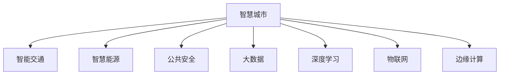

                 

# AI如何改变城市规划和智慧城市发展

> 关键词：人工智能(AI)、城市规划、智慧城市、智能交通、智慧能源、公共安全、大数据、深度学习、物联网(IoT)、边缘计算

## 1. 背景介绍

### 1.1 问题由来
随着人口增长、城市化进程加快，城市规划和管理面临越来越大的挑战。传统城市规划更多依赖于经验、直觉和人工调查，难以应对快速变化的城市环境。而人工智能(AI)技术的应用，特别是机器学习、深度学习等先进算法，正在为城市规划和管理带来新的可能性。

智慧城市(Wisdom City)，通过整合信息技术、物联网、大数据等技术手段，将城市基础设施与AI系统融合，提升城市运行效率和居民生活质量。智慧城市能够实时监测城市环境，智能调度公共资源，预测并解决潜在问题，实现城市运行智能化、高效化。

### 1.2 问题核心关键点
1. **数据驱动的决策制定**：城市规划和管理越来越依赖于大量数据，AI技术可以通过分析这些数据，为城市规划提供数据支撑。
2. **实时监控与预测**：AI可以实时监测城市环境，识别并预测潜在问题，提供及时响应方案。
3. **资源优化与调度**：AI技术可以通过优化算法，合理调度公共资源，提升城市运行效率。
4. **个性化服务**：AI技术可以提供个性化的城市服务，提升居民生活质量。
5. **模型自适应与迭代**：智慧城市AI系统需要具备自适应能力，能够根据实际情况动态调整模型参数，实现持续改进。

## 2. 核心概念与联系

### 2.1 核心概念概述

为更好地理解AI在城市规划和智慧城市发展中的应用，本节将介绍几个密切相关的核心概念：

- **智慧城市(Wisdom City)**：通过信息技术、物联网、大数据等技术手段，实现城市基础设施与AI系统的融合，提升城市运行效率和居民生活质量。
- **智能交通(Intelligent Transportation System, ITS)**：利用AI技术实现交通信号控制、车辆路径优化、智能停车等，提升交通系统效率和安全性。
- **智慧能源(Smart Energy)**：通过AI技术实现能源生产和消费的智能化管理，提升能源利用效率和环境保护。
- **公共安全(Security)**：利用AI技术进行视频监控、人脸识别、行为分析等，提升城市公共安全水平。
- **大数据(Big Data)**：城市运行产生的海量数据，通过AI技术进行分析和挖掘，为城市规划和管理提供决策依据。
- **深度学习(Deep Learning)**：一种AI算法，能够自动从数据中学习特征，识别模式，广泛应用于智慧城市中的各种任务。
- **物联网(IoT)**：通过各种传感器、设备将城市基础设施连接起来，实现数据共享和实时监控。
- **边缘计算(Edge Computing)**：将数据处理和分析放到靠近数据源的计算节点上进行，降低延迟，提升系统响应速度。

这些核心概念之间的逻辑关系可以通过以下Mermaid流程图来展示：



这个流程图展示了大语言模型的核心概念及其之间的关系：

1. 智慧城市通过整合多个子系统，实现城市运行智能化。
2. 智能交通、智慧能源、公共安全等子系统在智慧城市中扮演重要角色。
3. 大数据、深度学习、物联网、边缘计算等技术支撑着智慧城市的构建和运行。

## 3. 核心算法原理 & 具体操作步骤
### 3.1 算法原理概述

AI在城市规划和智慧城市发展中的应用，主要基于以下算法原理：

1. **数据采集与处理**：利用传感器、摄像头等设备收集城市运行数据，进行预处理，清洗和标准化。
2. **模型训练与优化**：通过深度学习、强化学习等算法，训练模型，优化参数，提升预测和决策的准确性。
3. **实时监控与预测**：部署模型于云端或边缘计算节点，实时监控城市运行状态，预测潜在问题，提供决策支持。
4. **资源调度与优化**：利用优化算法，合理调度公共资源，提升城市运行效率。
5. **个性化服务提供**：通过AI技术分析用户行为，提供个性化的城市服务，提升居民生活质量。

### 3.2 算法步骤详解

基于AI的城市规划和智慧城市建设通常包括以下几个关键步骤：

**Step 1: 数据收集与处理**
- 利用传感器、摄像头、GPS等设备收集城市基础设施运行数据，如交通流量、能源消耗、环境质量等。
- 数据预处理，包括数据清洗、归一化、去噪等，确保数据质量和一致性。

**Step 2: 模型训练与优化**
- 选择合适的深度学习模型，如卷积神经网络(CNN)、循环神经网络(RNN)、长短时记忆网络(LSTM)等。
- 划分数据集为训练集、验证集和测试集，进行模型训练。
- 利用超参数调优技术，如网格搜索、贝叶斯优化等，优化模型参数，提升模型性能。

**Step 3: 实时监控与预测**
- 将训练好的模型部署到云端或边缘计算节点上，实时监控城市运行状态。
- 利用模型对实时数据进行预测，识别潜在问题，如交通拥堵、能源浪费、环境污染等。
- 根据预测结果，提供及时响应策略，如调整交通信号灯、优化能源消耗、改善环境质量等。

**Step 4: 资源调度与优化**
- 利用优化算法，如线性规划、整数规划、遗传算法等，合理调度公共资源，如交通流量、能源分配等。
- 实时调整资源分配策略，提升城市运行效率。

**Step 5: 个性化服务提供**
- 利用AI技术分析用户行为，如出行习惯、能源需求、环境偏好等。
- 根据用户行为提供个性化的城市服务，如智能导航、定制化能源供应、个性化环境监测等。

### 3.3 算法优缺点

AI在城市规划和智慧城市发展中的应用具有以下优点：

1. **效率提升**：AI可以实时分析海量数据，快速识别潜在问题，提供及时响应策略，提升城市运行效率。
2. **资源优化**：AI技术可以通过优化算法，合理调度公共资源，提升资源利用效率。
3. **决策支持**：AI模型可以为城市规划和管理提供数据支撑和决策建议，提升决策科学性。
4. **个性化服务**：AI技术可以根据用户行为，提供个性化的城市服务，提升居民生活质量。

同时，AI在城市规划和智慧城市发展中也有以下局限性：

1. **数据依赖**：AI模型的效果很大程度上依赖于数据的质量和数量，数据获取和处理成本较高。
2. **隐私风险**：城市运行数据涉及个人隐私，数据采集和处理过程中需注意隐私保护。
3. **技术复杂性**：AI技术应用需要较强的技术背景和专业人才，实施成本较高。
4. **模型解释性**：AI模型的决策过程通常缺乏可解释性，难以对其内部工作机制进行分析和调试。

尽管存在这些局限性，但AI技术在城市规划和智慧城市中的应用前景广阔，未来仍需不断优化和改进，以充分发挥其潜力。

### 3.4 算法应用领域

AI在城市规划和智慧城市发展中的应用广泛，以下是几个典型的应用领域：

1. **智能交通**：通过AI技术实现交通信号控制、车辆路径优化、智能停车等，提升交通系统效率和安全性。
2. **智慧能源**：利用AI技术实现能源生产和消费的智能化管理，提升能源利用效率和环境保护。
3. **公共安全**：利用AI技术进行视频监控、人脸识别、行为分析等，提升城市公共安全水平。
4. **大数据分析**：通过AI技术进行城市运行数据的分析和挖掘，为城市规划和管理提供决策依据。
5. **智能建筑**：利用AI技术实现建筑物的智能管理，如能耗监测、照明控制等。
6. **环境监测**：利用AI技术进行环境质量的监测和预警，提升城市环境保护水平。

## 4. 数学模型和公式 & 详细讲解 & 举例说明

### 4.1 数学模型构建

为更好地理解AI在城市规划和智慧城市发展中的应用，本节将介绍几个常用的数学模型。

**线性回归模型**
城市交通流量预测是一个经典的线性回归问题，可以表示为：

$$
y = \beta_0 + \beta_1 x_1 + \beta_2 x_2 + \cdots + \beta_n x_n + \epsilon
$$

其中，$y$ 表示交通流量，$x_i$ 表示影响交通流量的因素，如天气、节假日等，$\beta_i$ 表示回归系数，$\epsilon$ 表示误差项。

**随机森林模型**
在城市能源管理中，可以利用随机森林模型进行能源需求预测和资源分配优化。随机森林模型的决策树可以表示为：

$$
y = \sum_{i=1}^{m} \sum_{j=1}^{k} T_{ij} f_{ij}(x)
$$

其中，$y$ 表示能源需求，$x$ 表示影响能源需求的因素，$f_{ij}$ 表示决策树的叶子节点，$T_{ij}$ 表示节点权重。

**强化学习模型**
在智慧城市中，可以利用强化学习模型进行交通信号灯控制。强化学习模型的Q值函数可以表示为：

$$
Q(s, a) = \sum_{s'} R(s', a) \prod_{t=0}^{\infty} \gamma^t p(s_{t+1} | s_t, a_t)
$$

其中，$s$ 表示状态，$a$ 表示动作，$R(s', a)$ 表示奖励函数，$p(s_{t+1} | s_t, a_t)$ 表示状态转移概率，$\gamma$ 表示折扣因子。

### 4.2 公式推导过程

以下我们以智慧能源管理为例，推导随机森林模型进行能源需求预测的计算过程。

设能源需求为 $y$，影响能源需求的因素为 $x_1, x_2, \cdots, x_n$，构建随机森林模型进行预测：

$$
y = f(x_1, x_2, \cdots, x_n)
$$

其中 $f$ 表示随机森林模型。利用训练集 $\{(x_i, y_i)\}_{i=1}^N$ 进行模型训练：

1. 将数据集随机分成 $m$ 个子集，每个子集训练一棵决策树。
2. 对每个子集，随机选取 $k$ 个特征，构建决策树。
3. 对每个子集，计算预测结果的平均值，作为最终预测结果。

使用预测结果与真实值计算均方误差：

$$
\text{MSE} = \frac{1}{N} \sum_{i=1}^N (y_i - \hat{y_i})^2
$$

其中 $\hat{y_i}$ 表示预测结果。

### 4.3 案例分析与讲解

**智能交通系统**
智能交通系统通过AI技术实现交通信号控制、车辆路径优化、智能停车等，提升交通系统效率和安全性。

**智慧能源管理**
智慧能源管理利用AI技术实现能源生产和消费的智能化管理，提升能源利用效率和环境保护。

**公共安全监控**
公共安全监控利用AI技术进行视频监控、人脸识别、行为分析等，提升城市公共安全水平。

## 5. 项目实践：代码实例和详细解释说明

### 5.1 开发环境搭建

在进行AI城市规划和智慧城市应用开发前，我们需要准备好开发环境。以下是使用Python进行TensorFlow开发的环境配置流程：

1. 安装Anaconda：从官网下载并安装Anaconda，用于创建独立的Python环境。

2. 创建并激活虚拟环境：
```bash
conda create -n ai-env python=3.8 
conda activate ai-env
```

3. 安装TensorFlow：根据CUDA版本，从官网获取对应的安装命令。例如：
```bash
conda install tensorflow -c pytorch -c conda-forge
```

4. 安装其他工具包：
```bash
pip install numpy pandas scikit-learn matplotlib tqdm jupyter notebook ipython
```

完成上述步骤后，即可在`ai-env`环境中开始AI城市规划和智慧城市应用开发。

### 5.2 源代码详细实现

这里我们以智慧能源管理为例，给出使用TensorFlow进行能源需求预测的代码实现。

首先，定义能源需求预测任务的数据处理函数：

```python
import pandas as pd
import numpy as np
from sklearn.model_selection import train_test_split
from sklearn.preprocessing import StandardScaler
from tensorflow.keras.models import Sequential
from tensorflow.keras.layers import Dense, RandomForestRegressor
from tensorflow.keras.callbacks import EarlyStopping

def preprocess_data(data, features, target):
    X = data[features].values
    y = data[target].values
    scaler = StandardScaler()
    X_scaled = scaler.fit_transform(X)
    return X_scaled, y

def train_model(X_train, y_train, X_test, y_test):
    model = Sequential()
    model.add(Dense(64, input_shape=(X_train.shape[1],), activation='relu'))
    model.add(Dense(64, activation='relu'))
    model.add(Dense(1, activation='linear'))
    model.compile(optimizer='adam', loss='mse', metrics=['mae'])
    early_stopping = EarlyStopping(patience=10, restore_best_weights=True)
    model.fit(X_train, y_train, epochs=100, batch_size=32, callbacks=[early_stopping], validation_split=0.2)
    return model

# 加载数据
data = pd.read_csv('energy_data.csv')
features = ['temp', 'humidity', 'wind_speed']
target = 'energy_consumption'

# 数据预处理
X, y = preprocess_data(data, features, target)

# 划分数据集
X_train, X_test, y_train, y_test = train_test_split(X, y, test_size=0.2, random_state=42)

# 模型训练与评估
model = train_model(X_train, y_train, X_test, y_test)
```

然后，定义模型评估函数：

```python
from sklearn.metrics import mean_squared_error, mean_absolute_error

def evaluate_model(model, X_test, y_test):
    y_pred = model.predict(X_test)
    mse = mean_squared_error(y_test, y_pred)
    mae = mean_absolute_error(y_test, y_pred)
    print('MSE:', mse)
    print('MAE:', mae)

# 模型评估
evaluate_model(model, X_test, y_test)
```

以上代码实现了利用随机森林模型对智慧能源管理中的能源需求进行预测的完整流程。可以看到，TensorFlow配合Scikit-learn库，使得能源需求预测的代码实现变得简洁高效。

### 5.3 代码解读与分析

让我们再详细解读一下关键代码的实现细节：

**preprocess_data函数**：
- 将数据集划分为特征和目标变量，并进行归一化处理。

**train_model函数**：
- 定义多层感知机模型，包含两个隐藏层和一个输出层，使用ReLU激活函数。
- 编译模型，使用均方误差损失函数和MAE评估指标。
- 训练模型，使用EarlyStopping回调函数，防止过拟合。

**evaluate_model函数**：
- 计算模型在测试集上的MSE和MAE，评估模型性能。

可以看到，TensorFlow提供了强大的框架和API，可以轻松实现复杂的深度学习模型，并通过Scikit-learn等工具进行评估和调优。这些工具和框架的配合使用，极大地降低了AI应用开发的难度，加速了模型的部署和迭代。

## 6. 实际应用场景

### 6.1 智能交通系统

智能交通系统通过AI技术实现交通信号控制、车辆路径优化、智能停车等，提升交通系统效率和安全性。

**交通信号控制**
利用AI模型进行交通信号灯控制，实现交通流量优化。例如，使用深度学习模型预测交通流量，动态调整信号灯时长，缓解交通拥堵。

**车辆路径优化**
利用AI技术优化车辆路径，减少行驶时间和燃料消耗。例如，使用Dijkstra算法结合深度学习模型，预测最优路径，减少交通拥堵和事故风险。

**智能停车**
利用AI技术实现智能停车管理，提高停车效率和安全性。例如，使用传感器监测停车位状态，利用深度学习模型进行停车推荐和收费管理。

### 6.2 智慧能源管理

智慧能源管理利用AI技术实现能源生产和消费的智能化管理，提升能源利用效率和环境保护。

**能源需求预测**
利用AI模型进行能源需求预测，合理调度能源生产和分配。例如，使用随机森林模型预测能源需求，优化能源生产和调度策略。

**能源损耗监测**
利用AI技术进行能源损耗监测，及时发现并处理能源浪费问题。例如，使用深度学习模型分析能源消耗数据，识别能耗异常行为。

**智能电网管理**
利用AI技术进行智能电网管理，提升电网稳定性和安全性。例如，使用强化学习模型优化电网调度策略，确保电力供应的可靠性。

### 6.3 公共安全监控

公共安全监控利用AI技术进行视频监控、人脸识别、行为分析等，提升城市公共安全水平。

**视频监控**
利用AI技术进行视频监控，实时识别潜在安全威胁。例如，使用深度学习模型检测异常行为，生成安全警报。

**人脸识别**
利用AI技术进行人脸识别，提升公共场所的安防水平。例如，使用卷积神经网络模型进行人脸检测和识别，增强安防监控效果。

**行为分析**
利用AI技术进行行为分析，实时监测人群动态，预防和应对安全事故。例如，使用循环神经网络模型分析人群行为数据，识别异常行为模式。

## 7. 工具和资源推荐

### 7.1 学习资源推荐

为了帮助开发者系统掌握AI在城市规划和智慧城市应用的技术基础和实践技巧，这里推荐一些优质的学习资源：

1. **《深度学习》课程**：斯坦福大学开设的深度学习经典课程，提供系统讲解深度学习基础和前沿应用的完整视频和讲义，适合入门和进阶学习。

2. **《TensorFlow实战》书籍**：详细介绍了TensorFlow的基本概念、API用法和实际案例，适合TensorFlow开发实战。

3. **《智能交通系统》课程**：北京大学开设的智能交通系统课程，涵盖了智能交通系统的基本概念、算法和应用，适合了解智能交通系统的基本原理和技术。

4. **《智慧城市》书籍**：介绍了智慧城市的基本概念、技术和应用案例，适合了解智慧城市的基本框架和实际应用。

5. **智慧城市开源项目**：如Cities of the Future、UrbanData等项目，提供了智慧城市应用开发的开源代码和资源，适合学习实践。

通过对这些资源的学习实践，相信你一定能够快速掌握AI在城市规划和智慧城市应用的技术基础和实践技巧，并用于解决实际的NLP问题。

### 7.2 开发工具推荐

高效的开发离不开优秀的工具支持。以下是几款用于AI城市规划和智慧城市开发常用的工具：

1. **TensorFlow**：由Google主导开发的深度学习框架，生产部署方便，适合大规模工程应用。

2. **TensorFlow Extended(TFE)**：TensorFlow的高级API，提供了高级层的深度学习模型，适合快速原型开发和模型部署。

3. **Keras**：基于TensorFlow的高级API，提供了简洁的接口和丰富的模型构建工具，适合快速原型开发和模型调优。

4. **PyTorch**：由Facebook主导开发的深度学习框架，灵活动态的计算图，适合快速迭代研究。

5. **Jupyter Notebook**：Jupyter生态系统中的笔记本工具，适合进行数据预处理、模型训练和结果展示。

6. **Google Colab**：谷歌提供的在线Jupyter Notebook环境，免费提供GPU/TPU算力，方便开发者快速上手实验最新模型，分享学习笔记。

合理利用这些工具，可以显著提升AI城市规划和智慧城市应用的开发效率，加速创新迭代的步伐。

### 7.3 相关论文推荐

AI在城市规划和智慧城市发展中的应用源于学界的持续研究。以下是几篇奠基性的相关论文，推荐阅读：

1. **《城市大数据与智慧城市》**：清华大学出版的著作，系统介绍了城市大数据和智慧城市的基本概念、技术和应用。

2. **《智能交通系统》**：Ersin Kayarli等著作，介绍了智能交通系统的基本概念、算法和应用案例。

3. **《智慧能源管理》**：Deepak Chakrabarti等著作，介绍了智慧能源管理的基本概念、技术和应用。

4. **《城市公共安全技术》**：Vladlen Kuznetsov等著作，介绍了城市公共安全技术的基本概念、算法和应用。

这些论文代表了大语言模型微调技术的发展脉络。通过学习这些前沿成果，可以帮助研究者把握学科前进方向，激发更多的创新灵感。

## 8. 总结：未来发展趋势与挑战

### 8.1 总结

本文对AI在城市规划和智慧城市发展中的应用进行了全面系统的介绍。首先阐述了AI技术在城市规划和管理中的重要性，明确了AI技术在提升城市运行效率、优化资源调度、提高公共安全水平等方面的独特价值。其次，从原理到实践，详细讲解了AI在智慧交通、智慧能源、公共安全等各个领域的应用，给出了实际应用的代码实例。同时，本文还广泛探讨了AI技术在城市规划和智慧城市发展中的应用前景，展示了AI技术的巨大潜力。

通过本文的系统梳理，可以看到，AI技术正在成为城市规划和智慧城市建设的重要工具，极大地拓展了城市规划和管理的可能性，推动了智慧城市的快速普及和发展。未来，伴随AI技术的不断进步和创新，智慧城市必将在更多领域得到广泛应用，为城市管理和居民生活带来更美好的前景。

### 8.2 未来发展趋势

展望未来，AI在城市规划和智慧城市发展中的应用将呈现以下几个发展趋势：

1. **数据驱动决策**：AI技术将成为城市规划和智慧城市管理中的重要决策工具，通过分析海量数据，提供科学、合理的决策建议。
2. **实时监控与预测**：智慧城市AI系统将具备实时监控和预测能力，及时识别并应对潜在问题，提升城市运行效率和安全性。
3. **资源优化与调度**：AI技术将通过优化算法，合理调度公共资源，提升城市运行效率和环境保护。
4. **个性化服务提供**：AI技术将根据用户行为，提供个性化的城市服务，提升居民生活质量。
5. **模型自适应与迭代**：智慧城市AI系统将具备自适应能力，能够根据实际情况动态调整模型参数，实现持续改进。

这些趋势凸显了AI技术在城市规划和智慧城市发展中的巨大潜力。未来的研究需要在数据获取、模型优化、用户行为分析等方面进行深入探索，不断提升AI系统的智能化和高效性。

### 8.3 面临的挑战

尽管AI在城市规划和智慧城市发展中的应用前景广阔，但在实际落地过程中，仍面临诸多挑战：

1. **数据获取与隐私保护**：城市运行数据涉及个人隐私，数据采集和处理过程中需注意隐私保护。
2. **技术复杂性与成本**：AI技术应用需要较强的技术背景和专业人才，实施成本较高。
3. **模型解释性与透明度**：AI模型的决策过程通常缺乏可解释性，难以对其内部工作机制进行分析和调试。
4. **模型鲁棒性与泛化能力**：AI模型在实际应用中，需要具备较强的鲁棒性和泛化能力，避免过拟合和模型崩溃。
5. **安全与伦理问题**：AI模型的应用需考虑安全与伦理问题，确保模型输出符合人类价值观和伦理道德。

尽管存在这些挑战，但未来的研究需要在技术、伦理、法律等方面进行全面优化和改进，以充分发挥AI在城市规划和智慧城市发展中的潜力。

### 8.4 研究展望

面对AI在城市规划和智慧城市发展中面临的挑战，未来的研究需要在以下几个方面寻求新的突破：

1. **数据获取与处理**：研究高效、隐私保护的数据采集和处理技术，解决数据获取瓶颈问题。
2. **模型优化与调优**：研究模型优化和调优技术，提升模型性能和泛化能力。
3. **个性化服务提供**：研究个性化服务提供技术，提升居民生活质量。
4. **安全与伦理问题**：研究安全与伦理问题的解决方案，确保AI模型的应用符合人类价值观和伦理道德。

这些研究方向的探索，必将引领AI在城市规划和智慧城市发展中的应用进入新的阶段，为构建更加智能、高效、安全的智慧城市提供技术保障。

## 9. 附录：常见问题与解答

**Q1：AI在城市规划和智慧城市中的应用主要涉及哪些领域？**

A: AI在城市规划和智慧城市中的应用主要涉及智慧交通、智慧能源、公共安全、大数据分析、智能建筑、环境监测等多个领域。

**Q2：AI在城市规划和智慧城市中的应用需要注意哪些问题？**

A: AI在城市规划和智慧城市中的应用需要注意数据获取和隐私保护、技术复杂性与成本、模型解释性与透明度、模型鲁棒性与泛化能力、安全与伦理问题等多个方面。

**Q3：AI在城市规划和智慧城市中的应用有哪些成功案例？**

A: 一些成功案例包括智能交通系统、智慧能源管理、公共安全监控、智能建筑管理等。

**Q4：AI在城市规划和智慧城市中的应用面临哪些技术挑战？**

A: AI在城市规划和智慧城市中的应用面临数据获取与隐私保护、技术复杂性与成本、模型解释性与透明度、模型鲁棒性与泛化能力、安全与伦理问题等多个技术挑战。

**Q5：AI在城市规划和智慧城市中的应用未来有哪些发展趋势？**

A: AI在城市规划和智慧城市中的应用未来将呈现数据驱动决策、实时监控与预测、资源优化与调度、个性化服务提供、模型自适应与迭代等发展趋势。

以上文章正文内容部分，为你提供了全面、系统的AI在城市规划和智慧城市发展中的介绍和应用案例。通过学习这些内容，你可以更好地理解AI在城市规划和智慧城市中的应用原理、实际案例和未来发展趋势，为未来的研究和工作提供重要参考。

---

作者：禅与计算机程序设计艺术 / Zen and the Art of Computer Programming

