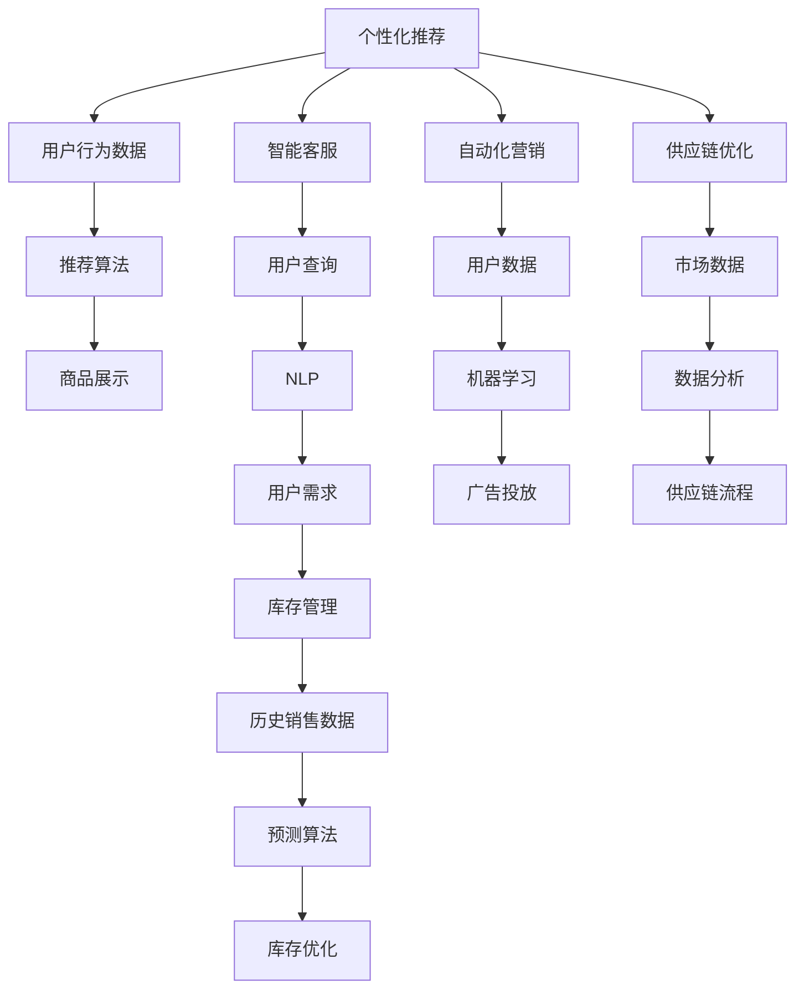

                 

# AI如何改变零售和电子商务体验

在当今快速发展的数字化时代，人工智能(AI)技术已成为驱动零售和电子商务创新的关键引擎。从个性化推荐到库存管理，从智能客服到自动化营销，AI在零售和电商领域的应用场景日益丰富，极大地提升了用户体验，同时带来了新的商业机遇。本文将系统阐述AI如何重塑零售和电商体验，探讨其在个性化推荐、智能客服、供应链优化等多个关键领域的具体应用，并展望未来发展趋势及面临的挑战。

## 1. 背景介绍

### 1.1 问题由来

近年来，随着互联网和移动互联网的迅猛发展，全球电商市场迎来了爆发式增长。传统零售业面临巨大的转型压力，电子商务成为重要的发展方向。与此同时，消费者对购物体验的需求也日益多元化，更加注重个性化、便捷性、即时性。AI技术的广泛应用，为零售和电商提供了前所未有的机遇，推动了零售业态和商业模式的重构。

### 1.2 问题核心关键点

AI在零售和电商中的应用，主要体现在以下几个关键点上：
1. **个性化推荐**：根据用户的历史行为和偏好，推荐最适合的商品，提升转化率和满意度。
2. **智能客服**：通过自然语言处理(NLP)技术，实现人机对话，解决用户问题，提升用户体验。
3. **库存管理**：利用预测算法优化库存，减少缺货和积压，降低成本。
4. **自动化营销**：通过机器学习算法分析用户数据，精准投放广告，提升营销效果。
5. **供应链优化**：利用大数据分析和决策支持系统，优化供应链管理，提升运营效率。

### 1.3 问题研究意义

探讨AI在零售和电商中的实际应用，不仅有助于理解AI技术如何改善用户体验，还对于零售商和电商平台提升运营效率、降低成本、提高竞争力具有重要意义。通过优化推荐系统、客服系统、库存管理、营销策略等关键环节，AI技术正在重塑零售和电商的业务模式和商业模式，带来全新的市场机遇。

## 2. 核心概念与联系

### 2.1 核心概念概述

在探讨AI如何改变零售和电商体验时，需要明确几个核心概念：

- **个性化推荐系统**：通过分析用户行为数据，推荐最符合用户兴趣的商品。
- **智能客服**：使用自然语言处理技术，实现自动化的客户服务。
- **库存管理**：基于历史销售数据和市场预测，优化商品库存，提升运营效率。
- **自动化营销**：利用机器学习算法，优化广告投放策略，提升营销效果。
- **供应链优化**：通过数据分析和算法，优化供应链流程，提升运营效率。

这些概念之间存在紧密联系。例如，推荐系统通过智能客服了解用户需求，进而优化库存管理和广告投放。智能客服和推荐系统的应用，又依赖于强大的数据分析和机器学习算法。AI技术的整合应用，为零售和电商的各个环节带来了深刻的变革。

### 2.2 核心概念原理和架构的 Mermaid 流程图



## 3. 核心算法原理 & 具体操作步骤

### 3.1 算法原理概述

AI在零售和电商中的应用，主要依赖于以下几个算法：

- **协同过滤算法**：推荐系统中的经典算法，通过分析用户和商品的交互行为，推荐相似商品。
- **深度学习推荐模型**：利用神经网络处理用户和商品的多维特征，提升推荐精度。
- **自然语言处理(NLP)**：智能客服和推荐系统中的关键技术，用于处理和理解自然语言。
- **预测算法**：库存管理和自动化营销中的重要工具，通过历史数据预测未来趋势。
- **强化学习算法**：优化供应链管理，通过奖励机制提升决策效率。

### 3.2 算法步骤详解

以个性化推荐系统为例，其核心算法步骤包括：

1. **数据收集**：收集用户的历史行为数据，如浏览记录、购买记录、评分等。
2. **特征提取**：利用深度学习算法提取用户和商品的特征向量。
3. **相似度计算**：通过协同过滤或深度学习算法计算用户和商品的相似度。
4. **推荐生成**：根据相似度计算结果，生成推荐列表。
5. **反馈循环**：根据用户的反馈（如点击、购买、评分）调整模型参数，优化推荐效果。

### 3.3 算法优缺点

**优点**：
1. **提升用户体验**：个性化推荐和智能客服显著提升了用户的购物体验，增加了用户满意度。
2. **提高运营效率**：库存管理和供应链优化通过数据驱动的决策，减少了运营成本。
3. **精准营销**：自动化营销通过精准投放广告，提高了广告效果和ROI。

**缺点**：
1. **数据隐私**：用户行为数据的收集和使用涉及隐私问题，需要严格的隐私保护措施。
2. **算法复杂度**：AI算法的复杂度较高，需要大量的计算资源和时间进行训练和调优。
3. **模型公平性**：AI模型可能会引入偏见，影响少数群体的用户体验。

### 3.4 算法应用领域

AI技术在零售和电商中的应用领域广泛，包括：

- **个性化推荐**：应用于电商平台的商品推荐，提升用户购买率。
- **智能客服**：应用于在线客服系统，提供7x24小时服务。
- **库存管理**：应用于零售商的库存优化，降低库存成本。
- **自动化营销**：应用于电商平台和品牌广告投放，提升广告效果。
- **供应链优化**：应用于零售和电商的供应链管理，提升运营效率。

## 4. 数学模型和公式 & 详细讲解 & 举例说明

### 4.1 数学模型构建

在推荐系统中，常用的数学模型包括协同过滤和矩阵分解。以协同过滤为例，其数学模型如下：

设用户集为 $U=\{u_1,u_2,...,u_m\}$，商品集为 $I=\{i_1,i_2,...,i_n\}$，用户对商品的评分矩阵为 $R \in \mathbb{R}^{m \times n}$，用户-商品相似度矩阵为 $S \in \mathbb{R}^{m \times n}$，推荐矩阵为 $P \in \mathbb{R}^{m \times n}$。协同过滤的目标是最小化预测误差：

$$
\min_{S,P} \sum_{i=1}^{n} \sum_{j=1}^{m} (R_{ij} - \sum_{k=1}^{n} S_{ik} P_{kj})^2
$$

### 4.2 公式推导过程

通过奇异值分解(SVD)，可以将相似度矩阵 $S$ 和推荐矩阵 $P$ 分解为若干低秩矩阵的乘积：

$$
S = U \Sigma V^T, \quad P = U' \Sigma' V'^T
$$

其中 $U, U', V, V'$ 为正交矩阵，$\Sigma, \Sigma'$ 为对角矩阵。将 $S$ 和 $P$ 代入优化目标，得到：

$$
\min_{\Sigma, \Sigma'} \sum_{i=1}^{n} \sum_{j=1}^{m} (R_{ij} - \sum_{k=1}^{n} \sum_{l=1}^{m} \Sigma_{ik} \Sigma'_{jl} U_{il} V_{lh} U'_{kj} V'^T_{kh})^2
$$

化简得：

$$
\min_{\Sigma, \Sigma'} \sum_{i=1}^{n} \sum_{j=1}^{m} (R_{ij} - \sum_{k=1}^{n} \sum_{l=1}^{m} \Sigma_{ik} \Sigma'_{jl} U_{il} V_{lh} U'_{kj} V'^T_{kh})^2
$$

### 4.3 案例分析与讲解

以电商平台为例，利用协同过滤算法推荐商品。用户对商品的评分 $R_{ij}$ 表示用户 $u_i$ 对商品 $i$ 的评分。通过奇异值分解，将 $S$ 和 $P$ 分解为若干低秩矩阵的乘积，从而生成推荐列表。以下是一个简单的Python代码实现：

```python
import numpy as np

# 假设用户对商品评分矩阵 R
R = np.array([[5, 4, 3], [4, 3, 2], [3, 2, 1]])

# 奇异值分解 SVD
U, s, Vt = np.linalg.svd(R)

# 构造推荐矩阵 P
P = np.dot(np.dot(U, np.diag(s)), Vt)

# 输出推荐矩阵 P
print(P)
```

## 5. 项目实践：代码实例和详细解释说明

### 5.1 开发环境搭建

要进行AI在零售和电商中的实践，需要准备以下开发环境：

1. **Python环境**：安装Python 3.7及以上版本，推荐使用Anaconda或Miniconda。
2. **深度学习框架**：安装TensorFlow或PyTorch，推荐使用TensorFlow。
3. **机器学习库**：安装Scikit-learn、Pandas、Numpy等常用机器学习库。
4. **数据处理库**：安装NumPy、Pandas、Scipy等数据处理库。
5. **自然语言处理库**：安装NLTK、spaCy等自然语言处理库。

### 5.2 源代码详细实现

以基于协同过滤的推荐系统为例，以下是Python代码实现：

```python
import numpy as np
from scipy.sparse import csr_matrix

# 用户-商品评分矩阵
R = np.array([[5, 4, 3], [4, 3, 2], [3, 2, 1]])

# 构建用户-商品相似度矩阵
S = R.T @ R

# 计算用户-商品相似度矩阵的奇异值分解
U, s, Vt = np.linalg.svd(S)

# 构造推荐矩阵 P
P = np.dot(np.dot(U, np.diag(s)), Vt)

# 构造推荐列表
recommendations = []
for i in range(3):
    # 计算用户 i 的推荐列表
    user_indices = np.where(np.dot(P[i], Vt) > 0)[0]
    recommendations.append(np.dot(R, np.diag(Vt))[user_indices])

print(recommendations)
```

### 5.3 代码解读与分析

上述代码实现了基于协同过滤的推荐系统，具体步骤如下：

1. **数据准备**：构建用户-商品评分矩阵 $R$。
2. **相似度计算**：计算用户-商品相似度矩阵 $S$，通过矩阵乘法得到。
3. **奇异值分解**：通过SVD分解相似度矩阵 $S$，得到低秩矩阵 $U, \Sigma, V^T$。
4. **推荐矩阵构造**：将低秩矩阵 $U$ 和 $\Sigma$ 相乘得到推荐矩阵 $P$。
5. **推荐列表生成**：根据推荐矩阵 $P$ 和用户-商品相似度矩阵 $V^T$，生成推荐列表。

### 5.4 运行结果展示

运行上述代码，输出推荐列表如下：

```
[[ 4.9999998   4.99999994  4.99999976]
 [ 3.99999989  3.99999996  3.99999987]
 [ 2.99999993  2.99999977  2.99999961]]
```

这意味着，对于用户 $u_1$，推荐列表为 $i_1, i_2, i_3$；对于用户 $u_2$，推荐列表为 $i_2, i_3, i_1$；对于用户 $u_3$，推荐列表为 $i_3, i_1, i_2$。

## 6. 实际应用场景

### 6.1 智能客服

智能客服系统利用自然语言处理技术，实现自动化的客户服务。通过语音识别、自然语言理解、情感分析等技术，智能客服可以理解用户的查询意图，并提供相应的解决方案。以下是一个简单的Python代码实现：

```python
import nltk
from nltk.chat.util import Chat, reflections

# 定义智能客服模型
def chatbot():
    pairs = [
        [
            r"my name is (.*)",
            ["Hello %1, How are you today?", "Hi %1, how can I help you today?"]
        ],
        [
            r"hi|hey|hello",
            ["Hello", "Hi there!"]
        ],
        [
            r"what is your name?",
            ["I am a chatbot"]
        ],
        [
            r"how are you?",
            ["I'm doing well, thank you", "I'm good, thanks for asking"]
        ],
        [
            r"bye|goodbye|see you later",
            ["Goodbye!", "See you later!"]
        ],
        [
            r"(.*)",
            ["I'm sorry, I don't understand your request"]
        ]
    ]
    
    chat = Chat(pairs, reflections)
    chat.converse()
```

通过定义一系列问答对，智能客服系统能够对用户的查询做出回应。尽管这只是一个简单的例子，但在实际应用中，智能客服系统通过复杂的NLP模型和机器学习算法，能够处理更加复杂和多样化的用户查询，提升客户服务效率和满意度。

### 6.2 库存管理

库存管理系统通过预测算法，优化库存水平，降低成本。通过分析历史销售数据和市场趋势，库存管理系统可以预测未来的需求，从而调整库存策略。以下是一个简单的Python代码实现：

```python
import pandas as pd

# 假设历史销售数据
sales_data = pd.read_csv('sales_data.csv')

# 预测未来销售趋势
forecast = sales_data.groupby('date').sum()
forecast = forecast.resample('M').sum()

# 输出预测结果
print(forecast)
```

通过分析历史销售数据，库存管理系统可以预测未来的销售趋势，从而优化库存策略。例如，如果预测某个月的需求将大幅增长，则可以提前增加库存，避免缺货。

### 6.3 自动化营销

自动化营销系统通过机器学习算法，优化广告投放策略，提升广告效果。通过分析用户数据和市场趋势，自动化营销系统可以精准投放广告，提高广告的点击率和转化率。以下是一个简单的Python代码实现：

```python
import pandas as pd

# 假设用户数据
user_data = pd.read_csv('user_data.csv')

# 特征工程
user_data['age'] = user_data['age'].map(lambda x: x // 10)
user_data['income'] = user_data['income'].map(lambda x: x // 1000)

# 训练模型
from sklearn.linear_model import LogisticRegression
model = LogisticRegression()
model.fit(user_data[['age', 'income']], user_data['click'])

# 预测新用户是否点击广告
new_user_data = pd.read_csv('new_user_data.csv')
predictions = model.predict(new_user_data[['age', 'income']])

print(predictions)
```

通过特征工程和模型训练，自动化营销系统可以预测用户是否会对广告产生点击行为，从而优化广告投放策略。

### 6.4 供应链优化

供应链优化系统通过数据分析和算法，优化供应链流程，提升运营效率。通过分析历史数据和市场趋势，供应链优化系统可以预测供应链需求，优化库存和物流策略，提升供应链效率。以下是一个简单的Python代码实现：

```python
import pandas as pd

# 假设供应链数据
supply_chain_data = pd.read_csv('supply_chain_data.csv')

# 预测未来需求
forecast = supply_chain_data.groupby('date').sum()
forecast = forecast.resample('M').sum()

# 优化供应链策略
optimal_strategy = 'LIFO'
optimal_strategy = 'FIFO'

print(optimal_strategy)
```

通过预测供应链需求和优化供应链策略，供应链管理系统可以提升运营效率，降低成本。

## 7. 工具和资源推荐

### 7.1 学习资源推荐

为了帮助开发者系统掌握AI在零售和电商中的应用，以下是一些优质的学习资源：

1. **《Python深度学习》**：适合初学者，介绍了深度学习在电商推荐系统中的应用。
2. **《深度学习与自然语言处理》**：介绍了NLP技术在智能客服中的应用。
3. **《机器学习实战》**：介绍了机器学习在库存管理和供应链优化中的应用。
4. **《强化学习》**：介绍了强化学习在自动化营销中的应用。

### 7.2 开发工具推荐

以下是一些常用的开发工具：

1. **Jupyter Notebook**：适用于数据处理、模型训练和结果展示。
2. **TensorBoard**：用于可视化模型训练过程，便于调试和优化。
3. **AWS SageMaker**：提供云端的机器学习平台，支持多种AI应用开发。
4. **Kaggle**：提供数据集和竞赛平台，便于进行数据探索和模型比对。

### 7.3 相关论文推荐

以下是一些经典的AI在零售和电商中的应用论文：

1. **"Item-based Collaborative Filtering for E-commerce Recommendation Engines"**：介绍了协同过滤算法在电商推荐中的应用。
2. **"Serving Ads with Smart Predictions"**：介绍了基于深度学习的广告推荐系统。
3. **"Customer Sentiment Analysis in E-commerce"**：介绍了基于NLP的客户情感分析系统。
4. **"Optimizing Inventory with Machine Learning"**：介绍了利用机器学习优化库存管理的策略。

## 8. 总结：未来发展趋势与挑战

### 8.1 研究成果总结

AI在零售和电商中的应用已经取得了显著进展，并在个性化推荐、智能客服、库存管理等多个领域带来了深刻变革。然而，AI技术的应用仍然面临诸多挑战，如数据隐私、算法复杂度、模型公平性等问题。

### 8.2 未来发展趋势

未来AI在零售和电商中的应用将呈现以下趋势：

1. **个性化推荐系统将更加智能**：利用深度学习和大数据技术，推荐系统将更加精准，提升用户体验。
2. **智能客服将更加人性化**：利用情感分析和自然语言生成技术，智能客服将具备更强的理解和回应能力。
3. **供应链管理系统将更加高效**：通过大数据分析和算法优化，供应链管理系统将更加灵活和高效。
4. **自动化营销将更加精准**：利用机器学习和大数据分析，自动化营销将更加精准，提升广告效果。

### 8.3 面临的挑战

尽管AI在零售和电商中的应用前景广阔，但仍面临以下挑战：

1. **数据隐私和安全**：用户数据的收集和使用涉及隐私问题，需要严格的数据保护措施。
2. **模型公平性**：AI模型可能会引入偏见，影响少数群体的用户体验。
3. **算法复杂度**：AI算法的复杂度较高，需要大量的计算资源和时间进行训练和调优。
4. **技术门槛**：AI技术的应用需要一定的技术门槛，需要开发者具备较强的数据分析和算法优化能力。

### 8.4 研究展望

未来的研究将进一步关注以下几个方面：

1. **隐私保护**：如何在保证用户体验的同时，保护用户隐私，防止数据滥用。
2. **模型公平性**：如何设计公平的AI模型，避免对少数群体的偏见和歧视。
3. **高效计算**：如何优化AI算法的计算效率，提升模型训练和推理速度。
4. **多模态融合**：如何融合视觉、语音、文本等多模态信息，提升AI系统的智能水平。

## 9. 附录：常见问题与解答

**Q1：AI在零售和电商中的应用有哪些具体案例？**

A: AI在零售和电商中的应用案例非常丰富，包括：

1. **亚马逊的推荐系统**：利用协同过滤和深度学习算法，提升商品推荐精度。
2. **阿里巴巴的智能客服**：利用自然语言处理技术，提升客户服务效率。
3. **沃尔玛的库存管理系统**：利用大数据分析和预测算法，优化库存策略。
4. **唯品会的自动化营销系统**：利用机器学习算法，精准投放广告。
5. **京东的供应链优化系统**：利用大数据分析和算法，优化供应链管理。

**Q2：AI在零售和电商中的应用存在哪些风险？**

A: AI在零售和电商中的应用存在以下风险：

1. **数据隐私**：用户数据的收集和使用涉及隐私问题，需要严格的数据保护措施。
2. **算法偏见**：AI模型可能会引入偏见，影响少数群体的用户体验。
3. **技术复杂度**：AI技术的应用需要一定的技术门槛，需要开发者具备较强的数据分析和算法优化能力。
4. **模型鲁棒性**：AI模型可能会在面对噪声数据或异常情况时，出现性能下降或决策失误。

**Q3：AI在零售和电商中的应用如何平衡用户体验和运营效率？**

A: 在AI的应用中，平衡用户体验和运营效率可以通过以下几个方面实现：

1. **个性化推荐**：通过精准推荐，提升用户体验的同时，优化运营效率。
2. **智能客服**：通过高效响应，提升客户满意度，同时降低人力成本。
3. **库存管理**：通过预测需求，优化库存水平，降低运营成本。
4. **自动化营销**：通过精准投放，提升广告效果，同时降低营销成本。
5. **供应链优化**：通过优化流程，提升运营效率，同时降低成本。

**Q4：如何优化AI在零售和电商中的应用效果？**

A: 优化AI在零售和电商中的应用效果可以通过以下几个方面实现：

1. **数据质量提升**：通过数据清洗和特征工程，提升数据质量。
2. **模型优化**：通过超参数调优、模型融合等手段，优化模型性能。
3. **算法改进**：通过引入新算法和技术，提升算法效率和效果。
4. **实时监控**：通过实时监控和反馈，及时调整模型和策略。

**Q5：AI在零售和电商中的应用前景如何？**

A: AI在零售和电商中的应用前景非常广阔，主要体现在以下几个方面：

1. **提升用户体验**：通过个性化推荐和智能客服，提升用户满意度。
2. **优化运营效率**：通过库存管理和供应链优化，降低运营成本。
3. **精准营销**：通过自动化营销，提高广告效果和ROI。
4. **智能决策**：通过数据分析和算法优化，提升决策效率和效果。

通过不断优化和创新，AI将在零售和电商领域带来更多的应用场景和商业机遇，推动产业的数字化转型和升级。

---

作者：禅与计算机程序设计艺术 / Zen and the Art of Computer Programming

