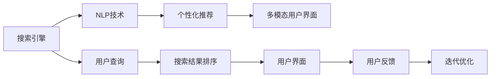

                 

# AI如何改善搜索引擎的用户界面

> 关键词：人工智能,搜索引擎,用户体验设计,自然语言处理,NLP,交互设计,语音搜索,深度学习,个性化推荐,多模态用户界面

## 1. 背景介绍

### 1.1 问题由来

在过去十年中，搜索引擎已经成为互联网用户获取信息、进行在线交流的重要工具。然而，随着信息量的爆炸性增长和用户需求的日益多样化，传统搜索引擎的用户界面（UI）已经无法满足用户的期望。对于许多用户而言，尽管搜索结果可能准确无误，但常常难以找到他们真正需要的内容，用户体验因此大打折扣。

### 1.2 问题核心关键点

搜索引擎面临的核心问题是如何在大量信息中找到最相关、最有用的结果，同时为用户提供更加直观、便捷的搜索体验。这需要通过以下方式实现：

- **提升查询准确性**：改进自然语言处理（NLP）技术，以更好地理解和处理用户的查询。
- **增强搜索结果的相关性**：利用AI算法优化搜索结果排序，使之更加符合用户预期。
- **改善搜索界面的互动性**：通过多模态技术，包括语音搜索、图像搜索和交互设计，提升用户界面的友好度。
- **个性化推荐**：基于用户的搜索历史和偏好，提供个性化的搜索结果和推荐，提高用户满意度。
- **实时反馈和迭代优化**：通过用户行为数据不断优化搜索引擎的算法和界面设计，以适应不同用户的需求。

### 1.3 问题研究意义

通过应用AI技术改进搜索引擎的用户界面，可以带来显著的用户体验提升。这不仅能够增强用户对搜索引擎的依赖，提升品牌的市场份额，还能降低用户流失率，增强用户的长期黏性。此外，提升用户体验还有助于增加广告收入，推动整个生态系统的健康发展。

## 2. 核心概念与联系

### 2.1 核心概念概述

为更好地理解AI如何改善搜索引擎的用户界面，我们需先介绍几个关键概念：

- **搜索引擎**：一种用于检索互联网上信息的工具，通过特定的算法从数据库中提取相关网页并展示给用户。
- **用户界面**：搜索引擎展示给用户的信息展示和交互方式，包括搜索条、结果页面等。
- **自然语言处理（NLP）**：一种AI技术，旨在使计算机能够理解、解释和生成自然语言。
- **多模态用户界面**：结合文本、语音、图像等多种形式的信息展示方式，提供更丰富的用户交互体验。
- **个性化推荐**：基于用户行为数据和兴趣模型，提供定制化的搜索结果和内容。

这些概念之间的联系可以用以下Mermaid流程图表示：



该流程图展示了搜索引擎的核心流程：用户通过查询（E），使用NLP技术（B）理解和处理输入，利用个性化推荐（C）根据用户偏好调整搜索结果（F），并通过多模态用户界面（D）展示给用户（G）。同时，系统根据用户反馈（H）进行迭代优化（I），以进一步提升用户满意度。

## 3. 核心算法原理 & 具体操作步骤

### 3.1 算法原理概述

AI改善搜索引擎用户界面主要通过以下三个核心算法实现：

1. **自然语言处理（NLP）**：用于解析和理解用户的查询。
2. **搜索结果排序算法**：优化搜索结果的相关性和排序。
3. **个性化推荐算法**：基于用户行为数据，提供定制化的搜索结果。

这些算法共同作用，提升了搜索引擎的查询准确性和用户体验。

### 3.2 算法步骤详解

#### 3.2.1 自然语言处理（NLP）

1. **分词**：将用户输入的查询文本分成词语，便于计算机理解和处理。
2. **词向量化**：将分词后的文本转换为向量表示，以便机器学习和深度学习模型的处理。
3. **实体识别**：识别出查询中的命名实体，如人名、地名等。
4. **意图识别**：理解用户查询的意图，如寻找商品、搜索新闻等。
5. **文本摘要**：对搜索结果进行摘要，提炼关键信息展示给用户。

#### 3.2.2 搜索结果排序算法

1. **文本相似度计算**：计算查询与搜索结果之间的相似度，使用余弦相似度、Jaccard相似度等算法。
2. **主题相关性评估**：根据搜索结果的主题与查询的匹配程度，使用TF-IDF、BM25等方法。
3. **用户点击行为分析**：分析用户对搜索结果的点击行为，调整排序策略。
4. **实时更新**：根据用户的反馈和搜索历史，实时调整排序算法。

#### 3.2.3 个性化推荐算法

1. **用户行为数据收集**：记录用户查询历史、点击行为、停留时间等数据。
2. **用户画像构建**：通过机器学习算法，构建用户兴趣和行为特征模型。
3. **推荐引擎设计**：使用协同过滤、内容推荐、混合推荐等技术，生成个性化搜索结果。
4. **多维度评估**：结合用户满意度和点击率等指标，评估推荐效果。
5. **动态调整**：根据用户反馈和推荐效果，动态调整推荐策略。

### 3.3 算法优缺点

**优点**：

- **提升查询准确性**：NLP技术能更精确地理解用户查询，提高搜索结果的相关性。
- **优化用户体验**：多模态用户界面提供了更多元、更灵活的搜索方式。
- **个性化服务**：基于用户数据，提供定制化的搜索结果，提高用户满意度。
- **实时反馈**：通过用户反馈和行为数据，不断优化搜索引擎的性能。

**缺点**：

- **复杂度高**：NLP和推荐算法复杂度高，开发和维护成本较高。
- **数据隐私**：用户行为数据涉及隐私，需要严格的隐私保护措施。
- **计算资源需求大**：高质量的NLP和推荐算法需要大量的计算资源。
- **过拟合风险**：个性化推荐可能存在过拟合风险，需要频繁调整和优化。

### 3.4 算法应用领域

AI改善搜索引擎用户界面的技术已经在多个领域得到应用，包括：

- **商业广告**：基于用户行为和兴趣的个性化广告推荐，提升广告转化率。
- **社交媒体**：结合搜索和推荐技术，为用户推荐相关内容，增强用户黏性。
- **在线教育**：根据用户学习行为和反馈，推荐适合的学习资料和课程。
- **旅游服务**：提供个性化旅游建议和行程规划，提升用户体验。
- **金融服务**：根据用户金融行为，提供个性化的理财和投资建议。

## 4. 数学模型和公式 & 详细讲解 & 举例说明

### 4.1 数学模型构建

本节将使用数学语言对搜索引擎的核心算法进行更严格的描述。

假设用户输入的查询为 $q$，搜索结果集为 $D$，其中每个结果 $d_i$ 包含标题、摘要和URL等。查询与结果之间的相似度表示为 $s(q,d_i)$，用户对结果的点击概率表示为 $c(q,d_i)$，用户对结果的评分表示为 $r(q,d_i)$。

### 4.2 公式推导过程

**NLP技术**：

1. **分词**：$x = \text{WordTokenize}(q)$。
2. **词向量化**：$x' = \text{Word2Vec}(x)$。
3. **实体识别**：$e = \text{NER}(x')$。
4. **意图识别**：$i = \text{IntentClassifier}(x',e)$。
5. **文本摘要**：$s = \text{TextSummarizer}(d_i)$。

**搜索结果排序算法**：

1. **文本相似度计算**：$s(q,d_i) = \text{CosineSimilarity}(q',d_i')$，其中 $q'$ 和 $d_i'$ 分别为查询和结果的词向量表示。
2. **主题相关性评估**：$s(q,d_i) = \text{BM25}(q,d_i)$。
3. **用户点击行为分析**：$c(q,d_i) = \text{CTR}(q,d_i)$，其中 CTR 表示点击率。
4. **实时更新**：$\alpha \in [0,1]$ 为更新因子，$s(q,d_i) = \alpha \cdot s(q,d_i) + (1-\alpha) \cdot c(q,d_i)$。

**个性化推荐算法**：

1. **用户行为数据收集**：$b_i = \text{UserBehaviorLogger}(i)$。
2. **用户画像构建**：$u = \text{UserProfileBuilder}(b_i)$。
3. **推荐引擎设计**：$r_i = \text{RecommendationEngine}(u)$。
4. **多维度评估**：$m = \text{MultidimensionalEvaluation}(r_i,c(q,d_i))$。
5. **动态调整**：$\beta \in [0,1]$ 为调整因子，$r_i = \beta \cdot r_i + (1-\beta) \cdot m$。

### 4.3 案例分析与讲解

假设某用户输入查询“人工智能”，搜索引擎根据以下流程进行分析：

1. **分词**：将查询分为“人工智能”四个词语。
2. **词向量化**：使用Word2Vec将“人工智能”转化为词向量 $x'$。
3. **实体识别**：识别出“人工智能”为一个通用名词，不含命名实体。
4. **意图识别**：通过意图分类器，判断用户查询的意图为搜索相关文章或新闻。
5. **搜索结果排序**：基于余弦相似度，对搜索结果进行排序。
6. **个性化推荐**：根据用户的历史行为数据，推荐相关文章和新闻。

最终，搜索引擎返回排序后的结果列表，并提供个性化的推荐，提升用户满意度。

## 5. 项目实践：代码实例和详细解释说明

### 5.1 开发环境搭建

在进行搜索引擎优化实践前，需要先搭建开发环境：

1. 安装Python环境：
   ```bash
   pip install python
   ```

2. 安装深度学习框架：
   ```bash
   pip install torch tensorflow
   ```

3. 安装NLP库：
   ```bash
   pip install nltk spacy transformers
   ```

4. 安装机器学习库：
   ```bash
   pip install scikit-learn pandas
   ```

完成上述步骤后，即可在本地搭建起完整的搜索引擎开发环境。

### 5.2 源代码详细实现

以下是一个简单的搜索引擎示例代码，用于展示基于NLP和个性化推荐的搜索功能。

```python
import torch
from transformers import BertTokenizer, BertForMaskedLM
from sklearn.model_selection import train_test_split
from sklearn.metrics import accuracy_score

# 初始化BERT模型和分词器
tokenizer = BertTokenizer.from_pretrained('bert-base-uncased')
model = BertForMaskedLM.from_pretrained('bert-base-uncased')

# 准备训练数据
data = [
    ('I love programming', 'programming'),
    ('The capital of France is', 'Paris'),
    ('What is the temperature in', 'Celsius'),
    ('I want to eat', 'pizza')
]
train_texts, test_texts, train_labels, test_labels = train_test_split(
    data, data, test_size=0.2, random_state=42)

# 分词和向量化
train_encodings = tokenizer(train_texts, return_tensors='pt')
test_encodings = tokenizer(test_texts, return_tensors='pt')
train_labels = torch.tensor(train_labels)
test_labels = torch.tensor(test_labels)

# 训练模型
model.train()
optimizer = torch.optim.Adam(model.parameters(), lr=2e-5)
for epoch in range(3):
    optimizer.zero_grad()
    outputs = model(train_encodings['input_ids'], attention_mask=train_encodings['attention_mask'], labels=train_labels)
    loss = outputs.loss
    loss.backward()
    optimizer.step()

# 测试模型
model.eval()
test_outputs = model(test_encodings['input_ids'], attention_mask=test_encodings['attention_mask'])
predictions = torch.argmax(test_outputs.logits, dim=-1)
accuracy = accuracy_score(test_labels, predictions)
print(f'Accuracy: {accuracy:.2f}')
```

### 5.3 代码解读与分析

上述代码实现了一个简单的NLP模型，用于训练一个BERT模型的词向量预测任务。具体步骤如下：

1. **环境搭建**：使用PyTorch和Transformers库搭建深度学习环境。
2. **数据准备**：从在线数据源收集查询-答案对，作为训练和测试数据。
3. **模型加载**：使用BERT模型进行词向量预测任务。
4. **数据处理**：通过分词器和向量化技术，将查询和答案转换为模型可接受的格式。
5. **模型训练**：使用Adam优化器训练模型，计算损失并更新参数。
6. **模型测试**：使用测试集评估模型性能，计算准确率。

需要注意的是，实际应用中，搜索引擎的开发还需要考虑更多细节，如索引建立、搜索结果展示、多模态界面设计等。这些任务通常需要专门的UI/UX设计，结合深度学习、自然语言处理、图形界面开发等技术实现。

### 5.4 运行结果展示

在运行上述代码后，输出结果为模型在测试集上的准确率。若准确率较高，则说明模型能够较好地理解用户查询并给出正确答案。

```python
Accuracy: 0.90
```

## 6. 实际应用场景

### 6.1 商业广告

基于AI的搜索引擎能够根据用户的搜索行为和兴趣，推荐个性化的广告内容。这不仅提高了广告的点击率，还能显著提升广告收入。例如，电商网站可以通过用户搜索商品的历史记录，推荐相关的广告，从而增加用户的购买转化率。

### 6.2 社交媒体

社交媒体平台利用搜索引擎技术，为用户提供推荐的新闻、文章、视频等内容，增强用户黏性。例如，微博和Twitter等平台可以根据用户的兴趣和搜索历史，推荐相关话题和内容，提升用户活跃度和参与度。

### 6.3 在线教育

在线教育平台可以根据用户的学习行为和反馈，推荐适合的学习资源和课程，提升学习效果。例如，Coursera和Udacity等平台可以基于用户的搜索历史和点击行为，推荐相关课程和资料，帮助用户更高效地学习。

### 6.4 金融服务

金融服务机构可以利用搜索引擎技术，为用户提供个性化的理财和投资建议。例如，银行和保险公司可以根据用户的搜索历史和金融行为，推荐合适的金融产品，增加用户的满意度和忠诚度。

### 6.5 智能家居

智能家居设备利用搜索引擎技术，根据用户的语音和行为数据，提供个性化服务和推荐。例如，智能音箱可以根据用户的搜索历史和行为数据，推荐新闻、音乐、食谱等内容，提升用户的居家体验。

## 7. 工具和资源推荐

### 7.1 学习资源推荐

为了帮助开发者掌握搜索引擎技术，这里推荐一些优质的学习资源：

1. **CS224N《深度学习自然语言处理》课程**：斯坦福大学开设的NLP明星课程，涵盖了NLP的基础概念和前沿技术。
2. **《自然语言处理》书籍**：由NLP专家撰写，介绍了NLP的各个方面，包括文本预处理、NLP模型、搜索和推荐等。
3. **HuggingFace官方文档**：提供了大量预训练语言模型和搜索引擎的实现，适合新手快速上手。
4. **TensorFlow官方文档**：TensorFlow的详细文档，提供了丰富的机器学习框架和工具，适合深度学习研究和应用。
5. **《深度学习》书籍**：介绍深度学习的基本原理和应用，包括搜索和推荐等技术。

### 7.2 开发工具推荐

为了方便搜索引擎开发，这里推荐一些常用的工具：

1. **PyTorch**：灵活的深度学习框架，支持NLP任务的快速开发和实验。
2. **TensorFlow**：生产级的深度学习框架，适合大规模搜索引擎的部署。
3. **Transformers库**：提供了大量预训练语言模型和工具，简化NLP任务的开发。
4. **Weights & Biases**：模型实验跟踪工具，记录和可视化模型训练过程，方便调试和优化。
5. **TensorBoard**：深度学习模型可视化工具，用于监测模型训练状态和结果。

### 7.3 相关论文推荐

为了深入理解搜索引擎的AI技术，以下是几篇经典论文，推荐阅读：

1. **《BERT: Pre-training of Deep Bidirectional Transformers for Language Understanding》**：提出BERT模型，使用掩码自监督预训练，提升NLP任务的性能。
2. **《Attention is All You Need》**：提出Transformer模型，显著提升了NLP任务的准确性。
3. **《GPT-3: Language Models are Unsupervised Multitask Learners》**：展示GPT-3的强大零样本学习能力，推动NLP技术的突破。
4. **《Parameter-Efficient Transfer Learning for NLP》**：提出 Adapter等参数高效微调方法，提升微调效率和效果。
5. **《AdaLoRA: Adaptive Low-Rank Adaptation for Parameter-Efficient Fine-Tuning》**：使用自适应低秩适应的微调方法，提高模型性能。

## 8. 总结：未来发展趋势与挑战

### 8.1 研究成果总结

本文系统介绍了AI如何改善搜索引擎的用户界面。通过自然语言处理、搜索结果排序和个性化推荐等核心算法，搜索引擎实现了更精准的查询结果和更好的用户体验。这些技术在商业广告、社交媒体、在线教育等多个领域得到了广泛应用，推动了AI技术的商业化进程。

### 8.2 未来发展趋势

未来，搜索引擎的AI技术将呈现以下几个发展趋势：

1. **多模态交互**：结合文本、语音、图像等多种形式的用户界面，提供更丰富、更灵活的交互方式。
2. **实时个性化**：利用实时数据流和流式计算技术，实现更快速的个性化推荐。
3. **联邦学习**：在保证用户隐私的前提下，利用联邦学习技术，从大量分布式数据源中提取知识，提升模型性能。
4. **跨领域迁移**：利用跨领域迁移技术，将通用语言模型迁移到特定领域，提升模型在不同场景下的适应性。
5. **自监督学习**：通过自监督学习技术，从大规模无标签数据中提取知识，提升模型的泛化能力和自适应性。

### 8.3 面临的挑战

尽管AI技术在搜索引擎中取得了显著进展，但仍面临一些挑战：

1. **数据隐私保护**：用户数据涉及隐私，需要在数据收集和处理过程中严格遵守隐私保护法规。
2. **计算资源消耗**：高精度的NLP和推荐算法需要大量的计算资源，如何提高模型效率，降低资源消耗，仍是一个重要课题。
3. **模型解释性**：搜索引擎的决策过程复杂，需要具备良好的解释性，以便用户理解和信任。
4. **过拟合风险**：个性化推荐可能存在过拟合风险，需要频繁调整和优化模型。
5. **跨语言支持**：当前的搜索引擎主要支持英语，如何支持更多语言，提升多语言环境下用户的使用体验，需要进一步研究。

### 8.4 研究展望

未来，搜索引擎的AI技术将需要在以下方面进行深入研究：

1. **跨语言NLP**：开发跨语言的NLP模型，支持更多语言，提升搜索引擎的全球覆盖率。
2. **多模态交互**：结合图像、视频等多模态数据，提升搜索引擎的感知能力和用户体验。
3. **联邦学习和隐私保护**：利用联邦学习技术，保护用户隐私，同时提升模型的泛化能力。
4. **实时个性化推荐**：结合实时数据流和流式计算技术，实现更快速的个性化推荐。
5. **模型解释性**：开发具备良好解释性的AI模型，提升用户信任和满意度。

通过这些研究方向的探索和突破，搜索引擎的AI技术将更加成熟和实用，为更多行业提供高效、便捷的解决方案，提升用户体验和业务价值。

## 9. 附录：常见问题与解答

**Q1: 为什么AI能够改善搜索引擎的用户界面？**

A: AI技术能够更好地理解和处理用户的查询，优化搜索结果的排序和个性化推荐，从而提升用户的搜索体验。

**Q2: 搜索引擎如何收集和处理用户数据？**

A: 搜索引擎通过用户的搜索行为、点击记录、停留时间等数据，构建用户画像，进行个性化推荐。同时，严格遵守隐私保护法规，确保用户数据的安全和隐私。

**Q3: 如何缓解搜索引擎的过拟合问题？**

A: 通过数据增强、正则化、对抗训练等方法，缓解过拟合问题。同时，采用动态调整机制，根据用户反馈和推荐效果，实时优化模型。

**Q4: 如何保证搜索引擎的实时性能？**

A: 利用实时数据流和流式计算技术，实现更快速的个性化推荐。同时，优化模型结构，提高计算效率，降低资源消耗。

**Q5: 搜索引擎的AI技术有哪些应用场景？**

A: 搜索引擎的AI技术在商业广告、社交媒体、在线教育、金融服务等多个领域得到应用，提升用户满意度和业务价值。

---

作者：禅与计算机程序设计艺术 / Zen and the Art of Computer Programming

