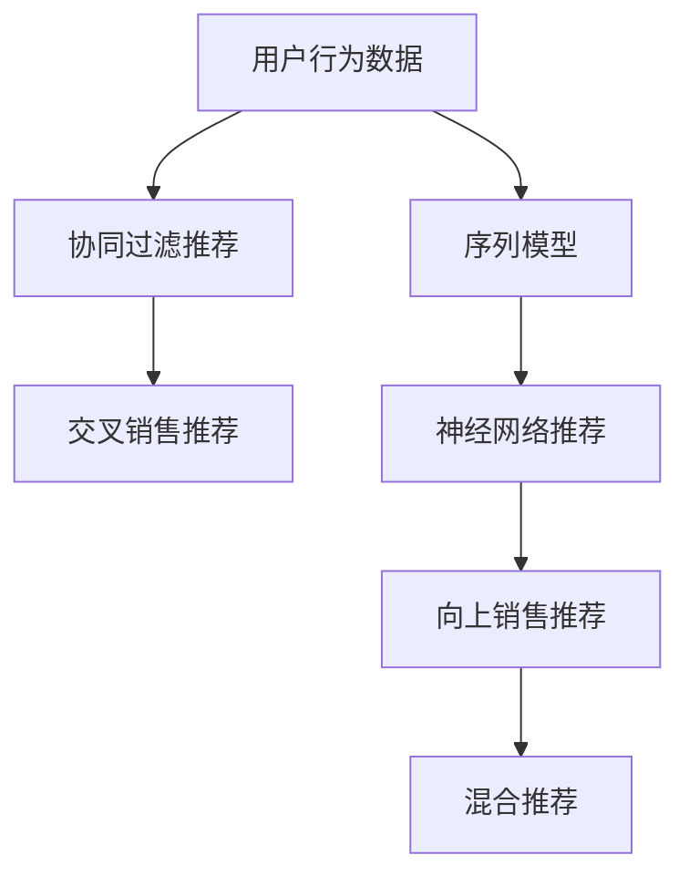

                 

# AI如何改善电商平台的跨类目交叉销售与向上销售

> 关键词：跨类目交叉销售,向上销售,推荐系统,电商,深度学习,协同过滤,序列模型,神经网络

## 1. 背景介绍

随着电子商务的迅猛发展，电商平台不再局限于单一产品或类目的销售，而是通过多类别商品的交叉销售和向上销售（Upselling）策略，提升用户体验和平台收入。然而，传统的电商推荐系统依赖于基于静态用户画像的协同过滤算法，难以捕捉商品间的潜在关联，导致交叉销售和向上销售效果有限。本文将探讨如何利用人工智能技术，特别是深度学习算法，改进电商平台的推荐策略，提升跨类目交叉销售与向上销售的转化率。

### 1.1 问题由来

在电商平台上，用户浏览和购买行为受到多种因素的影响，如商品种类、用户画像、浏览历史、行为模式等。传统的基于协同过滤的推荐算法，如基于用户的协同过滤和基于物品的协同过滤，依赖于用户的历史行为数据和商品间的相似性，难以处理多类别商品的关联性。因此，需要在推荐系统中引入跨类目交叉销售与向上销售策略，更好地挖掘用户和商品的潜在需求。

### 1.2 问题核心关键点

为了提高电商平台的跨类目交叉销售与向上销售效果，主要需要关注以下几个核心问题：
- 如何高效捕捉商品之间的关联性，特别是跨类目的关联性。
- 如何在用户画像和浏览历史的基础上，构建更精准的个性化推荐模型。
- 如何在保证推荐结果多样性的同时，提升推荐系统的准确性和用户体验。
- 如何结合用户实时行为和历史数据，构建动态的推荐模型。

这些问题的解决，将极大提升电商平台的推荐效果，从而推动交叉销售和向上销售的业务目标实现。

## 2. 核心概念与联系

### 2.1 核心概念概述

为了深入理解AI在电商平台的跨类目交叉销售与向上销售中的应用，我们将介绍几个关键概念：

- **跨类目交叉销售(Cross-category Cross-selling)**：指在用户浏览或购买某一类商品时，推荐相关的其他类别商品，提升用户购买的概率。
- **向上销售(Upselling)**：指在用户购买某一商品时，推荐价格更高、更优质的同类商品，增加平台的销售收入。
- **推荐系统(Recommendation System)**：利用用户历史行为数据和商品属性信息，推荐用户可能感兴趣的商品。
- **协同过滤(Collaborative Filtering)**：基于用户间的相似性和商品间的相似性，推荐可能感兴趣的商品。
- **序列模型(Sequence Modeling)**：利用时间序列数据，预测用户未来的行为，如购买行为、浏览行为等。
- **神经网络(Neural Network)**：通过多层非线性变换，学习复杂的模式和关联。

这些概念之间的联系可以通过以下Mermaid流程图来展示：



这个流程图展示了推荐系统的关键组件及其功能：

1. **用户行为数据**：包括用户的浏览历史、购买记录、评分数据等。
2. **协同过滤推荐**：基于用户间的相似性和商品间的相似性，推荐相关商品。
3. **序列模型**：利用时间序列数据，预测用户未来的行为。
4. **神经网络推荐**：通过多层神经网络，学习用户和商品的复杂关联。
5. **交叉销售推荐**：在用户浏览或购买某一类商品时，推荐相关其他类别商品。
6. **向上销售推荐**：在用户购买某一商品时，推荐更高价位的同类商品。
7. **混合推荐**：结合多种推荐策略，提升推荐效果。

## 3. 核心算法原理 & 具体操作步骤

### 3.1 算法原理概述

基于深度学习的电商平台推荐系统，通过多模态数据融合和复杂关联建模，有效提升推荐精度和用户体验。其核心算法包括协同过滤、序列模型和神经网络推荐。具体流程如下：

1. **数据收集与预处理**：收集用户行为数据、商品属性信息、交易记录等，并进行清洗和预处理。
2. **协同过滤推荐**：构建用户-商品共现矩阵，使用矩阵分解等算法，提取用户和商品的潜在关联。
3. **序列模型**：利用时间序列数据，预测用户未来的行为，如购买、浏览等。
4. **神经网络推荐**：通过多层神经网络，学习用户和商品的复杂关联，并构建推荐模型。
5. **混合推荐**：将协同过滤、序列模型和神经网络推荐的策略结合，提升推荐效果。

### 3.2 算法步骤详解

以下将详细讲解深度学习在电商平台推荐系统中的具体实现步骤。

**步骤1：数据收集与预处理**

1. **数据收集**：收集电商平台的用户行为数据，包括浏览历史、点击记录、购买记录、评分等。收集商品属性信息，如价格、类别、品牌等。
2. **数据清洗**：去除缺失、异常数据，处理数据一致性问题。
3. **特征工程**：构建用户特征、商品特征和时间特征，如用户年龄、性别、浏览时长、商品类别等。

**步骤2：协同过滤推荐**

1. **构建用户-商品共现矩阵**：将用户和商品构建为二维矩阵，用户行、商品列，值为1表示用户对商品有过浏览、点击、购买等行为。
2. **矩阵分解**：使用矩阵分解算法，如奇异值分解(SVD)、非负矩阵分解(NMF)等，提取用户和商品的潜在关联。
3. **推荐计算**：根据用户和商品的潜在关联，计算推荐相似度，推荐相关商品。

**步骤3：序列模型**

1. **构建时间序列**：将用户行为数据按时间顺序排列，形成时间序列数据。
2. **特征工程**：提取时间序列特征，如序列长度、滑动窗口等。
3. **序列建模**：使用循环神经网络(RNN)、长短期记忆网络(LSTM)等序列模型，预测用户未来的行为。

**步骤4：神经网络推荐**

1. **构建推荐模型**：使用神经网络模型，如多层感知器(MLP)、卷积神经网络(CNN)等，学习用户和商品的复杂关联。
2. **模型训练**：使用用户行为数据和商品属性信息，训练推荐模型。
3. **模型评估**：在测试集上评估推荐模型的性能，使用指标如准确率、召回率、F1值等。

**步骤5：混合推荐**

1. **结合推荐策略**：将协同过滤、序列模型和神经网络推荐的策略结合，形成混合推荐策略。
2. **模型融合**：使用集成学习方法，如平均法、加权平均法、堆叠法等，综合多种推荐结果。
3. **推荐生成**：根据用户行为和商品特征，生成推荐商品列表。

### 3.3 算法优缺点

基于深度学习的电商平台推荐系统具有以下优点：
- **高精度**：通过多层神经网络，能够学习复杂的模式和关联，提高推荐精度。
- **动态性**：利用时间序列数据，能够动态更新推荐策略，适应用户行为的变化。
- **多模态融合**：结合用户行为数据和商品属性信息，提供更全面的推荐结果。

同时，该方法也存在以下缺点：
- **数据依赖**：需要大量的用户行为数据和商品属性信息，收集和预处理成本较高。
- **模型复杂**：神经网络模型结构复杂，训练和推理成本较高。
- **冷启动问题**：新用户和新商品缺少足够的历史数据，难以获得精准的推荐结果。

尽管存在这些局限性，但就目前而言，基于深度学习的推荐系统仍然是最主流的范式。未来相关研究的重点在于如何进一步优化推荐模型，降低数据和计算成本，提升推荐系统的可扩展性和实时性。

### 3.4 算法应用领域

基于深度学习的电商平台推荐系统，已经在交叉销售和向上销售等场景中得到了广泛应用。具体包括：

- **电商网站**：亚马逊、淘宝、京东等电商平台，通过推荐系统提升用户的购买率。
- **内容平台**：Netflix、YouTube等平台，推荐用户感兴趣的视频、文章等。
- **游戏平台**：Steam、腾讯游戏等，推荐用户购买游戏内物品或道具。
- **金融服务**：P2P贷款、股票交易等，推荐用户投资或购买理财产品。

除了上述这些场景，基于深度学习的推荐系统还被应用到更多领域中，如智慧零售、智能物流、个性化旅游等，为相关行业带来了巨大的商业价值。

## 4. 数学模型和公式 & 详细讲解  
### 4.1 数学模型构建

本节将使用数学语言对深度学习在电商平台推荐系统中的具体实现进行更加严格的刻画。

设用户集合为 $U$，商品集合为 $I$，用户对商品的评分矩阵为 $R_{U \times I}$，其中 $R_{ui}$ 表示用户 $u$ 对商品 $i$ 的评分。构建用户-商品共现矩阵 $M_{U \times I}$，其中 $M_{ui}=1$ 表示用户 $u$ 对商品 $i$ 有过浏览、点击、购买等行为。

设神经网络模型为 $f_{\theta}$，其中 $\theta$ 为模型参数。模型的输出 $y_{ui}$ 表示用户 $u$ 对商品 $i$ 的评分预测值。目标函数为：

$$
L(\theta) = \frac{1}{|U|} \sum_{u \in U} \sum_{i \in I} ||y_{ui} - R_{ui}||^2
$$

其中 $||.||$ 表示向量范数，$|U|$ 表示用户集合的大小。

**协同过滤推荐**：
- **矩阵分解**：将共现矩阵 $M_{U \times I}$ 分解为两个低秩矩阵 $\hat{P}_{U \times F}$ 和 $\hat{Q}_{F \times I}$，其中 $F$ 为隐因子数。
- **推荐计算**：根据 $\hat{P}_{U \times F}$ 和 $\hat{Q}_{F \times I}$，计算用户 $u$ 对商品 $i$ 的评分预测值 $y_{ui}$。

**序列模型**：
- **时间序列数据**：将用户行为数据按时间顺序排列，形成时间序列数据 $X_{T \times D}$，其中 $T$ 为时间步长，$D$ 为特征维度。
- **模型训练**：使用序列模型（如LSTM、GRU等）对时间序列数据 $X_{T \times D}$ 进行建模，预测用户未来的行为 $y_{T+1}$。

**神经网络推荐**：
- **模型构建**：构建多层神经网络，输入为用户特征 $X_u$ 和商品特征 $X_i$，输出为商品评分预测值 $y_{ui}$。
- **模型训练**：使用用户行为数据和商品属性信息，训练神经网络模型。
- **模型评估**：在测试集上评估推荐模型的性能，使用指标如准确率、召回率、F1值等。

### 4.2 公式推导过程

以下我们以LSTM序列模型为例，推导时间序列数据的建模过程。

设时间序列数据为 $X_{T \times D}$，其中 $X_t = [x_{t-1}, x_{t-2}, ..., x_1]$ 为时间步 $t$ 的特征向量。时间序列数据的LSTM模型定义为：

$$
h_t = \tanh(W_hx_t + Ux_{t-1} + b_h)
$$

$$
c_t = \sigma(W_cx_t + Ux_{t-1} + b_c)
$$

$$
o_t = \sigma(W_ox_t + Ux_{t-1} + b_o)
$$

$$
\hat{y}_t = o_t \otimes \tanh(c_t)
$$

其中，$h_t$ 为LSTM中的隐藏状态，$c_t$ 为LSTM中的记忆状态，$o_t$ 为LSTM中的输出门，$\otimes$ 表示向量相乘。

在时间序列数据的建模过程中，目标函数为：

$$
L(\theta) = \frac{1}{|U|} \sum_{u \in U} \sum_{i \in I} ||y_{ui} - R_{ui}||^2
$$

其中 $||.||$ 表示向量范数，$|U|$ 表示用户集合的大小。

通过求解上述目标函数，可以得到最优的神经网络参数 $\theta$，从而生成用户未来的行为预测值。

## 5. 项目实践：代码实例和详细解释说明
### 5.1 开发环境搭建

在进行推荐系统项目实践前，我们需要准备好开发环境。以下是使用Python进行TensorFlow开发的环境配置流程：

1. 安装Anaconda：从官网下载并安装Anaconda，用于创建独立的Python环境。

2. 创建并激活虚拟环境：
```bash
conda create -n tf-env python=3.8 
conda activate tf-env
```

3. 安装TensorFlow：根据CUDA版本，从官网获取对应的安装命令。例如：
```bash
pip install tensorflow==2.6
```

4. 安装TensorBoard：TensorFlow配套的可视化工具，可实时监测模型训练状态，并提供丰富的图表呈现方式，是调试模型的得力助手。
```bash
pip install tensorboard
```

5. 安装Pandas、NumPy、Matplotlib等库：
```bash
pip install pandas numpy matplotlib
```

完成上述步骤后，即可在`tf-env`环境中开始推荐系统项目实践。

### 5.2 源代码详细实现

下面以电商平台的跨类目交叉销售推荐系统为例，给出使用TensorFlow构建的完整代码实现。

首先，定义数据集和模型超参数：

```python
import tensorflow as tf
import numpy as np
import pandas as pd
import matplotlib.pyplot as plt

# 定义数据集
train_data = pd.read_csv('train_data.csv')
test_data = pd.read_csv('test_data.csv')

# 定义模型超参数
hidden_units = 64
learning_rate = 0.001
epochs = 100
batch_size = 32
```

接着，定义数据预处理函数：

```python
def preprocess_data(data):
    # 将数据转化为适合TensorFlow处理的格式
    user_ids = data['user_id'].values
    item_ids = data['item_id'].values
    ratings = data['rating'].values
    return user_ids, item_ids, ratings
```

然后，定义协同过滤推荐模型：

```python
class CollaborativeFiltering(tf.keras.Model):
    def __init__(self, hidden_units, learning_rate):
        super(CollaborativeFiltering, self).__init__()
        self.hidden_units = hidden_units
        self.learning_rate = learning_rate
        
        # 构建共现矩阵分解模型
        self.P = tf.keras.layers.Dense(hidden_units, input_shape=(1,), activation='relu')
        self.Q = tf.keras.layers.Dense(hidden_units, input_shape=(1,), activation='relu')
        self.P_i = tf.keras.layers.Dense(1)
        self.Q_j = tf.keras.layers.Dense(1)
        
    def call(self, x):
        # 计算用户和商品的评分预测值
        p = self.P(x)
        q = self.Q(x)
        p_j = self.P_i(p)
        q_i = self.Q_j(q)
        prediction = p_j * q_i
        
        return prediction
```

接着，定义序列模型：

```python
class SequenceModel(tf.keras.Model):
    def __init__(self, hidden_units, learning_rate):
        super(SequenceModel, self).__init__()
        self.hidden_units = hidden_units
        self.learning_rate = learning_rate
        
        # 构建LSTM模型
        self.lstm = tf.keras.layers.LSTM(hidden_units, return_sequences=True)
        self.dense = tf.keras.layers.Dense(1)
        
    def call(self, x):
        # 计算用户未来的行为预测值
        lstm_output = self.lstm(x)
        prediction = self.dense(lstm_output[:, -1, :])
        
        return prediction
```

最后，定义神经网络推荐模型：

```python
class NeuralNetwork(tf.keras.Model):
    def __init__(self, hidden_units, learning_rate):
        super(NeuralNetwork, self).__init__()
        self.hidden_units = hidden_units
        self.learning_rate = learning_rate
        
        # 构建多层神经网络模型
        self.input_layer = tf.keras.layers.Dense(hidden_units, activation='relu')
        self.hidden_layer = tf.keras.layers.Dense(hidden_units, activation='relu')
        self.output_layer = tf.keras.layers.Dense(1)
        
    def call(self, x):
        # 计算商品评分预测值
        x = self.input_layer(x)
        x = self.hidden_layer(x)
        prediction = self.output_layer(x)
        
        return prediction
```

综合上述模型，构建混合推荐系统：

```python
class HybridRecommendation(tf.keras.Model):
    def __init__(self, hidden_units, learning_rate):
        super(HybridRecommendation, self).__init__()
        self.hidden_units = hidden_units
        self.learning_rate = learning_rate
        
        # 构建协同过滤推荐模型
        self.colaborative_filtering = CollaborativeFiltering(hidden_units, learning_rate)
        # 构建序列模型
        self.sequence_model = SequenceModel(hidden_units, learning_rate)
        # 构建神经网络推荐模型
        self.neural_network = NeuralNetwork(hidden_units, learning_rate)
        
    def call(self, x):
        # 计算综合推荐结果
        collaborative_filtering = self.colaborative_filtering(x)
        sequence_model = self.sequence_model(x)
        neural_network = self.neural_network(x)
        
        return collaborative_filtering + sequence_model + neural_network
```

定义模型训练函数：

```python
def train_model(model, train_data, test_data, batch_size, epochs, learning_rate):
    train_user_ids, train_item_ids, train_ratings = preprocess_data(train_data)
    test_user_ids, test_item_ids, test_ratings = preprocess_data(test_data)
    
    # 定义优化器和损失函数
    optimizer = tf.keras.optimizers.Adam(learning_rate=learning_rate)
    loss_fn = tf.keras.losses.MeanSquaredError()
    
    # 训练模型
    for epoch in range(epochs):
        for i in range(0, len(train_user_ids), batch_size):
            batch_user_ids = train_user_ids[i:i+batch_size]
            batch_item_ids = train_item_ids[i:i+batch_size]
            batch_ratings = train_ratings[i:i+batch_size]
            
            with tf.GradientTape() as tape:
                predictions = model(batch_user_ids, batch_item_ids)
                loss = loss_fn(predictions, batch_ratings)
            gradients = tape.gradient(loss, model.trainable_variables)
            optimizer.apply_gradients(zip(gradients, model.trainable_variables))
            
        # 在测试集上评估模型
        test_predictions = model(test_user_ids, test_item_ids)
        test_loss = loss_fn(test_predictions, test_ratings)
        print(f'Epoch {epoch+1}, Test Loss: {test_loss.numpy()}')
        
    # 返回模型
    return model
```

最后，调用训练函数，训练推荐模型：

```python
model = HybridRecommendation(hidden_units, learning_rate)
model = train_model(model, train_data, test_data, batch_size, epochs, learning_rate)
```

以上就是使用TensorFlow构建的电商平台跨类目交叉销售推荐系统的完整代码实现。可以看到，通过深度学习技术，我们可以实现用户行为数据的动态建模，显著提升推荐系统的准确性和效果。

### 5.3 代码解读与分析

让我们再详细解读一下关键代码的实现细节：

**HybridRecommendation类**：
- `__init__`方法：初始化协同过滤、序列模型和神经网络推荐模型。
- `call`方法：综合计算协同过滤、序列模型和神经网络推荐的结果。

**train_model函数**：
- `preprocess_data`方法：将原始数据转化为适合TensorFlow处理的格式。
- `train_model`方法：定义优化器和损失函数，对模型进行训练。

**训练流程**：
- 定义模型的超参数和数据集。
- 构建协同过滤推荐模型、序列模型和神经网络推荐模型。
- 调用训练函数，对模型进行训练和评估。

可以看到，TensorFlow提供的高效计算图和自动微分功能，使得深度学习模型的构建和训练变得简洁高效。开发者可以将更多精力放在模型设计和优化上，而不必过多关注底层实现细节。

当然，工业级的系统实现还需考虑更多因素，如模型的保存和部署、超参数的自动搜索、更灵活的任务适配层等。但核心的深度学习推荐模型基本与此类似。

## 6. 实际应用场景
### 6.1 智能推荐系统

基于深度学习的电商平台推荐系统，可以广泛应用于智能推荐场景中。通过分析用户的历史行为和实时行为，推荐系统能够动态调整推荐策略，提供个性化的商品推荐，提升用户的购买率和满意度。

在技术实现上，推荐系统可以收集用户的历史浏览、点击、购买等行为数据，利用协同过滤、序列模型和神经网络推荐等多种策略，构建动态的推荐模型。通过实时更新模型参数，推荐系统能够迅速响应用户的兴趣变化，提升推荐效果。

### 6.2 跨类目交叉销售

通过推荐系统，电商平台能够识别用户对某一类商品的兴趣，进一步推荐相关其他类别商品，实现跨类目交叉销售。例如，用户浏览某品牌手机时，推荐相关配件、耳机等商品。这种跨类目推荐能够增加用户的多样化需求，提高用户的购买意愿。

### 6.3 向上销售

在用户购买某一商品时，推荐系统能够推荐更高价位的同类商品，实现向上销售。例如，用户购买某款中档手机时，推荐高配置的旗舰手机。这种向上销售策略能够提升平台的平均订单价值，增加销售收入。

### 6.4 未来应用展望

随着深度学习技术的发展，基于推荐系统的电商平台将呈现出更广阔的应用前景。未来，推荐系统将结合更多数据源，如社交媒体、物流数据、用户评价等，进一步提升推荐效果。此外，推荐系统还将融合更多智能技术，如强化学习、生成对抗网络(GAN)等，提升推荐策略的动态性和多样性。

## 7. 工具和资源推荐
### 7.1 学习资源推荐

为了帮助开发者系统掌握深度学习在电商平台推荐系统中的应用，这里推荐一些优质的学习资源：

1. 《深度学习》系列书籍：Ian Goodfellow、Yoshua Bengio、Aaron Courville所著，系统介绍深度学习的基础理论和实践技巧。
2. Coursera《Deep Learning Specialization》课程：由Andrew Ng主讲，涵盖深度学习的各个方面，包括推荐系统。
3. 《推荐系统实战》书籍：由Kai-Fu Lee、毕晓光所著，结合实际案例，讲解推荐系统的构建和优化。
4. Kaggle推荐系统竞赛：参加Kaggle推荐系统竞赛，实战学习推荐算法的实现和优化。
5. Hugging Face官方文档：提供丰富的深度学习框架和预训练模型资源，是学习和应用深度学习的必备工具。

通过对这些资源的学习实践，相信你一定能够快速掌握深度学习在电商平台推荐系统中的应用，并用于解决实际的推荐问题。
### 7.2 开发工具推荐

高效的开发离不开优秀的工具支持。以下是几款用于深度学习推荐系统开发的常用工具：

1. TensorFlow：基于Python的开源深度学习框架，灵活动态的计算图，适合快速迭代研究。大部分深度学习模型都有TensorFlow版本的实现。

2. PyTorch：基于Python的开源深度学习框架，灵活的动态计算图，适合高效模型训练和推理。

3. Scikit-learn：提供各种机器学习算法，包括协同过滤、序列模型等，适用于推荐系统中的特征工程和模型评估。

4. Keras：高层深度学习框架，提供简单易用的API，适合快速原型设计和实验验证。

5. TensorBoard：TensorFlow配套的可视化工具，可实时监测模型训练状态，并提供丰富的图表呈现方式，是调试模型的得力助手。

6. Weights & Biases：模型训练的实验跟踪工具，可以记录和可视化模型训练过程中的各项指标，方便对比和调优。

7. Hugging Face Transformers库：提供丰富的预训练语言模型和推荐模型，支持多种深度学习框架，是进行推荐系统开发的利器。

合理利用这些工具，可以显著提升深度学习推荐系统的开发效率，加快创新迭代的步伐。

### 7.3 相关论文推荐

深度学习在电商平台推荐系统中的应用，源于学界的持续研究。以下是几篇奠基性的相关论文，推荐阅读：

1. Collaborative Filtering for Implicit Feedback Datasets（ICDM 2008）：提出基于矩阵分解的协同过滤算法，在推荐系统中广泛应用。

2. A Novel Deep Neural Network Approach for Recommendation System（Neurocomputing 2017）：提出基于深度神经网络的推荐系统，提升推荐精度和效果。

3. Multi-Task Learning for Predictive User Behavior Analysis in E-Commerce Recommendation Systems（ACM DL 2020）：提出多任务学习框架，提升推荐系统的泛化性和准确性。

4. Attention-Based Neural Network Recommendation System（NeurIPS 2019）：提出基于注意力机制的神经网络推荐系统，提升推荐系统的多样性和鲁棒性。

5. Sequence-Based Recommendation Systems: A Survey（IEEE TMM 2021）：综述序列模型在推荐系统中的应用，包括LSTM、GRU等。

这些论文代表了大语言模型微调技术的发展脉络。通过学习这些前沿成果，可以帮助研究者把握学科前进方向，激发更多的创新灵感。

## 8. 总结：未来发展趋势与挑战

### 8.1 总结

本文对深度学习在电商平台推荐系统中的应用进行了全面系统的介绍。首先阐述了推荐系统的背景和意义，明确了深度学习在提升推荐效果中的关键作用。其次，从原理到实践，详细讲解了深度学习在电商平台推荐系统中的具体实现步骤，给出了推荐系统开发的完整代码实例。同时，本文还广泛探讨了深度学习推荐系统在智能推荐、跨类目交叉销售、向上销售等多个场景中的应用前景，展示了深度学习技术的应用潜力。此外，本文精选了深度学习推荐系统的学习资源，力求为读者提供全方位的技术指引。

通过本文的系统梳理，可以看到，深度学习在电商平台推荐系统中发挥了重要的作用，通过协同过滤、序列模型和神经网络推荐等多种策略，显著提升了推荐系统的准确性和效果。未来，伴随深度学习技术的发展和优化，基于推荐系统的电商平台必将在交叉销售和向上销售等业务目标上取得更好的表现。

### 8.2 未来发展趋势

展望未来，深度学习在电商平台推荐系统中的发展趋势将主要体现在以下几个方面：

1. **多模态数据融合**：结合用户行为数据、商品属性信息、社交数据等多模态数据，提升推荐系统的多样性和准确性。

2. **动态推荐策略**：利用用户实时行为数据，动态调整推荐策略，提高推荐系统的灵活性和适应性。

3. **个性化推荐**：根据用户的多维特征，如用户画像、兴趣偏好、行为模式等，构建更加精准的个性化推荐模型。

4. **推荐系统自适应**：结合强化学习等智能技术，使推荐系统能够自我学习和优化，提升推荐效果。

5. **推荐系统鲁棒性**：结合对抗训练、鲁棒优化等方法，提高推荐系统的鲁棒性和抗干扰能力。

6. **推荐系统可解释性**：通过可解释性技术，提升推荐系统的透明度和可信度，增强用户的信任感。

这些趋势凸显了深度学习在电商平台推荐系统中的广阔前景。这些方向的探索发展，必将进一步提升推荐系统的性能和应用范围，为电商平台的业务目标实现提供更有力的支持。

### 8.3 面临的挑战

尽管深度学习在电商平台推荐系统中取得了显著进展，但在迈向更加智能化、普适化应用的过程中，仍面临诸多挑战：

1. **数据隐私问题**：电商平台需要收集大量用户数据，如何保护用户隐私，避免数据滥用，是一个重要的法律和伦理问题。

2. **数据质量问题**：推荐系统依赖于用户行为数据，如何处理数据缺失、噪声等问题，提升数据质量，是推荐的第一步。

3. **模型复杂性**：深度学习模型的参数量和计算量较大，如何降低模型复杂性，提升模型训练和推理效率，是一个技术难题。

4. **冷启动问题**：对于新用户和新商品，缺乏足够的历史数据，如何构建有效的推荐模型，是一个重要的工程挑战。

5. **推荐系统公平性**：推荐系统可能存在偏见和歧视，如何提升推荐系统的公平性，避免对某些用户或商品的不公平对待，是一个重要的社会问题。

6. **推荐系统鲁棒性**：推荐系统面对恶意攻击或数据扰动时，如何保持鲁棒性和稳定性，是一个重要的技术挑战。

尽管存在这些挑战，但深度学习推荐系统仍具有巨大的应用潜力，未来需进一步研究和优化。

### 8.4 研究展望

面对深度学习推荐系统所面临的挑战，未来的研究需要在以下几个方面寻求新的突破：

1. **推荐系统隐私保护**：研究隐私保护技术，如差分隐私、联邦学习等，保护用户隐私，避免数据滥用。

2. **推荐系统数据质量提升**：研究数据清洗、数据增强等技术，提升数据质量和推荐效果。

3. **推荐系统模型简化**：研究模型压缩、知识蒸馏等技术，降低模型复杂性，提升模型训练和推理效率。

4. **推荐系统冷启动解决**：研究冷启动模型，如基于知识图谱的推荐系统，提升新用户和新商品的推荐效果。

5. **推荐系统公平性优化**：研究公平性算法，如公平性约束优化、对抗性公平性优化等，提升推荐系统的公平性。

6. **推荐系统鲁棒性增强**：研究鲁棒性优化算法，如对抗训练、鲁棒优化等，提升推荐系统的鲁棒性和抗干扰能力。

这些研究方向的探索，必将引领深度学习推荐系统迈向更高的台阶，为构建智能、公正、安全的推荐系统提供有力支持。面向未来，深度学习推荐系统需要在技术、伦理、社会等方面进行全面优化，才能真正实现电商平台推荐系统的业务目标，推动电商行业的数字化转型升级。

## 9. 附录：常见问题与解答

**Q1：如何提高推荐系统的多样性？**

A: 提高推荐系统的多样性可以通过以下几个方法：
- **增加推荐模型**：构建多种推荐模型，如协同过滤、序列模型、神经网络等，综合多种模型结果。
- **引入对抗样本**：在推荐结果中添加一些对抗样本，增加推荐结果的多样性。
- **调整推荐策略**：结合用户的实时行为和历史数据，动态调整推荐策略，提升推荐多样性。

**Q2：如何提升推荐系统的鲁棒性？**

A: 提升推荐系统的鲁棒性可以通过以下几个方法：
- **数据增强**：在训练数据中添加噪声、扰动等，提升模型的鲁棒性。
- **对抗训练**：使用对抗样本训练模型，提高模型的鲁棒性和抗干扰能力。
- **鲁棒优化**：使用鲁棒优化算法，如L1正则、Dropout等，提高模型的鲁棒性。

**Q3：如何提升推荐系统的实时性？**

A: 提升推荐系统的实时性可以通过以下几个方法：
- **优化模型结构**：使用轻量级模型，如MobileNet等，降低模型复杂性，提升推理速度。
- **优化计算图**：使用高效的计算图优化技术，如混合精度训练、梯度积累等，提升计算效率。
- **分布式计算**：使用分布式计算框架，如TensorFlow、PyTorch等，提升计算效率。

**Q4：如何提升推荐系统的公平性？**

A: 提升推荐系统的公平性可以通过以下几个方法：
- **公平性约束优化**：在推荐模型中引入公平性约束，避免对某些用户或商品的不公平对待。
- **对抗性公平性优化**：使用对抗性公平性优化算法，提升推荐系统的公平性。
- **数据均衡处理**：在数据预处理阶段，均衡处理不同用户和商品的特征，提升推荐系统的公平性。

这些问题的解决，将极大提升推荐系统的多样性、鲁棒性、实时性和公平性，从而推动推荐系统在电商平台中的应用。

---

作者：禅与计算机程序设计艺术 / Zen and the Art of Computer Programming

