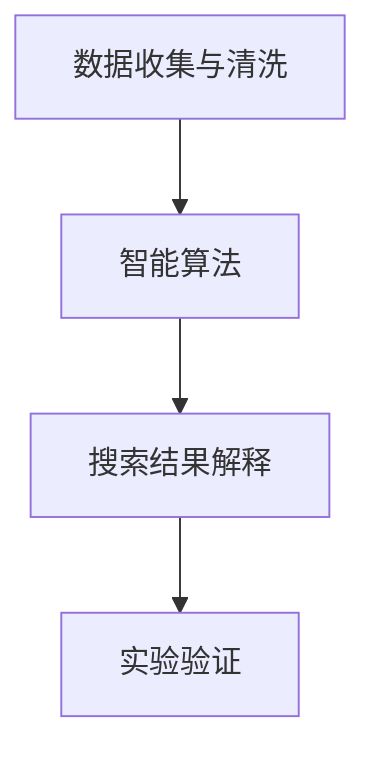

                 

## 1. 背景介绍

在快速变化的现代社会，科学发现和创新成为推动人类进步的关键力量。然而，现代科学研究往往面临着数据的爆炸性增长、知识的海量存储、实验设计的复杂性等挑战。传统的科研方法已难以满足日益增长的需求。人工智能（AI）技术特别是搜索技术在科学研究中的应用，为科学发现和突破性研究提供了新的可能性。

### 1.1 问题由来
人工智能技术的应用，尤其是在大数据和复杂系统中的搜索与分析，已经成为推动科学发现的重要手段。通过智能搜索算法，科学家可以从海量数据中快速准确地获取关键信息，进而优化实验设计、发现新理论、加速创新。例如，在基因组学、天文学、物理学等领域，AI搜索已经展现出巨大的潜力。

### 1.2 问题核心关键点
AI搜索的核心在于通过智能算法高效地处理和分析数据，发现其中的模式和关系，从而支持科学发现。具体来说，核心关键点包括：
- 数据的收集与清洗：确保数据的质量和完整性，是AI搜索的基础。
- 智能算法的选择与应用：选择合适的搜索算法和工具，确保搜索的效率和准确性。
- 结果的解释与验证：对搜索结果进行科学的解释，并通过实验验证其可靠性。

### 1.3 问题研究意义
AI搜索技术在科学研究中的应用，具有以下重要意义：
- 提高科研效率：通过自动化和智能化手段，显著减少科研人员的工作量，提升效率。
- 加速科学发现：在复杂和庞大数据集中快速定位关键信息，加速新理论和新现象的发现。
- 促进跨学科研究：AI搜索可以跨越不同领域的数据，促进学科间的交叉融合和创新。
- 支持复杂系统研究：AI搜索技术可以处理复杂动态系统，提供新的视角和解决方案。

## 2. 核心概念与联系

### 2.1 核心概念概述

为了更好地理解AI搜索在科学研究中的应用，本节将介绍几个密切相关的核心概念：

- **数据收集与清洗**：指对科研数据进行收集、整合、预处理，确保数据的质量和格式统一。
- **智能算法**：包括文本挖掘、知识图谱构建、深度学习等算法，用于处理和分析数据，发现其中的模式和关系。
- **搜索结果解释**：通过自然语言处理、知识图谱等技术，对搜索结果进行解释和展示，辅助科研人员理解和应用。
- **实验验证**：通过科学实验验证AI搜索结果的准确性和可靠性，保证科研结论的科学性。

### 2.2 核心概念原理和架构的 Mermaid 流程图



这个流程图展示了AI搜索技术在科学研究中的应用流程：从数据收集与清洗开始，通过智能算法进行数据分析和模式发现，对搜索结果进行解释和展示，最后通过实验验证其可靠性。

## 3. 核心算法原理 & 具体操作步骤

### 3.1 算法原理概述

AI搜索的核心在于通过智能算法高效地处理和分析数据，发现其中的模式和关系，从而支持科学发现。具体的算法原理可以分为以下几个步骤：

1. **数据预处理**：对原始数据进行清洗、去重、标准化等预处理，确保数据的质量和一致性。
2. **特征提取**：通过文本挖掘、图像处理等技术，从数据中提取有意义的特征，以便算法进行处理。
3. **智能算法应用**：选择合适的智能算法，如文本挖掘、知识图谱构建、深度学习等，对数据进行分析。
4. **模式发现**：通过算法发现数据中的模式和关系，包括关联性、趋势、异常等。
5. **结果解释与验证**：对搜索结果进行科学的解释，并通过实验验证其可靠性。

### 3.2 算法步骤详解

下面以知识图谱构建为例，详细介绍AI搜索技术在科学研究中的应用步骤。

#### 3.2.1 数据预处理

数据预处理是AI搜索的基础，具体步骤如下：

1. **数据收集**：从科研文献、实验数据、公共数据库等渠道收集数据。
2. **数据清洗**：去除噪声和错误数据，确保数据的质量和完整性。
3. **数据整合**：将不同来源的数据整合在一起，统一格式和标准。

#### 3.2.2 特征提取

特征提取是将原始数据转换为算法可以处理的格式，具体步骤如下：

1. **文本挖掘**：从科研文献中提取关键词、引用关系、摘要等信息。
2. **图像处理**：对科学实验中的图像数据进行预处理，提取关键特征。
3. **数据标准化**：将不同来源的数据标准化，确保格式一致。

#### 3.2.3 智能算法应用

智能算法是AI搜索的核心，用于处理和分析数据，具体步骤如下：

1. **文本挖掘算法**：如TF-IDF、LDA、Word2Vec等，用于分析文本数据，发现关键词和主题。
2. **知识图谱构建算法**：如TransE、NEURIPS等，用于构建知识图谱，发现实体和关系。
3. **深度学习算法**：如卷积神经网络（CNN）、循环神经网络（RNN）等，用于处理复杂数据。

#### 3.2.4 模式发现

模式发现是AI搜索的输出，具体步骤如下：

1. **关联性分析**：发现数据中的实体和实体之间的关联关系。
2. **趋势分析**：发现数据中的时间趋势和变化规律。
3. **异常检测**：发现数据中的异常点和异常值。

#### 3.2.5 结果解释与验证

结果解释与验证是AI搜索的最终目标，具体步骤如下：

1. **科学解释**：通过自然语言处理和知识图谱等技术，对搜索结果进行解释和展示。
2. **实验验证**：通过科学实验验证AI搜索结果的准确性和可靠性。
3. **结果应用**：将搜索结果应用于科研实践，支持科学发现和创新。

### 3.3 算法优缺点

AI搜索技术在科学研究中的应用具有以下优点：

1. **高效性**：通过自动化和智能化手段，显著减少科研人员的工作量，提升效率。
2. **准确性**：通过智能算法和大数据处理，提高了搜索结果的准确性和可靠性。
3. **跨学科性**：AI搜索可以跨越不同领域的数据，促进学科间的交叉融合和创新。
4. **复杂性处理**：AI搜索技术可以处理复杂和动态的系统，提供新的视角和解决方案。

同时，AI搜索技术也存在以下局限性：

1. **数据依赖性**：AI搜索的结果依赖于数据的质量和完整性，数据质量差会影响结果的可靠性。
2. **算法复杂性**：选择合适的智能算法和工具需要一定的专业知识和经验。
3. **结果解释性**：搜索结果的科学解释和验证需要一定的专业背景和实验验证。

### 3.4 算法应用领域

AI搜索技术在科学研究中的应用领域广泛，包括但不限于：

- **生命科学**：如基因组学、蛋白质组学、分子生物学等，通过AI搜索发现基因、蛋白质等生物分子的关联关系。
- **天文学**：如天体物理学、宇宙学等，通过AI搜索发现星系、黑洞等天体的特征和关系。
- **物理学**：如量子力学、高能物理等，通过AI搜索发现物理定律和现象。
- **化学**：如有机化学、材料科学等，通过AI搜索发现化学分子和材料的特性和应用。
- **环境科学**：如气候变化、生态学等，通过AI搜索发现环境变化和生物多样性的关系。

## 4. 数学模型和公式 & 详细讲解 & 举例说明

### 4.1 数学模型构建

AI搜索的数学模型可以分为以下几个部分：

1. **数据预处理模型**：用于数据清洗和整合的数学模型，如矩阵奇异值分解（SVD）等。
2. **特征提取模型**：用于特征提取和转换的数学模型，如TF-IDF、LDA等。
3. **智能算法模型**：用于数据分析和模式发现的数学模型，如神经网络、知识图谱等。
4. **模式发现模型**：用于发现数据中的模式和关系的数学模型，如关联规则、时间序列分析等。
5. **结果解释与验证模型**：用于科学解释和实验验证的数学模型，如自然语言处理、知识图谱等。

### 4.2 公式推导过程

以知识图谱构建为例，展示AI搜索的数学模型和公式推导过程。

1. **实体识别**：将文本数据中的实体识别出来，公式为：
   $$
   \text{实体} = \text{TF-IDF}(\text{文本}) \times \text{阈值}
   $$
   其中，TF-IDF表示文本特征向量，阈值用于筛选高信实体。

2. **关系抽取**：从文本中抽取实体之间的关系，公式为：
   $$
   \text{关系} = \text{LDA}(\text{文本}) \times \text{关系模板}
   $$
   其中，LDA表示主题模型，关系模板用于匹配和提取关系。

3. **图谱构建**：将实体和关系构建为知识图谱，公式为：
   $$
   \text{图谱} = (\text{实体}, \text{关系}, \text{实体})
   $$

4. **模式发现**：在知识图谱中发现实体和关系之间的模式，如关联规则，公式为：
   $$
   \text{关联规则} = \text{APRIORI}(\text{图谱})
   $$
   其中，APRIORI表示关联规则算法。

5. **结果解释与验证**：对搜索结果进行科学解释和验证，如自然语言处理、知识图谱等，公式为：
   $$
   \text{解释与验证} = \text{NLP}(\text{图谱})
   $$
   其中，NLP表示自然语言处理算法。

### 4.3 案例分析与讲解

以天文学为例，展示AI搜索在科学研究中的应用。

天文学研究中，传统的数据处理方式通常需要人工手动分析和解释，效率低、成本高。而通过AI搜索技术，可以自动化地处理和分析海量天文数据，发现新的天文现象和规律。

1. **数据预处理**：收集和清洗大量天文观测数据，去除噪声和错误数据。

2. **特征提取**：提取天文数据中的关键特征，如恒星亮度、速度、位置等。

3. **智能算法应用**：使用深度学习算法，分析天文数据，发现新的天文现象。

4. **模式发现**：通过知识图谱技术，发现天文数据中的关联关系，如恒星和行星的引力关系。

5. **结果解释与验证**：使用自然语言处理技术，对AI搜索结果进行解释和验证，如编写天文论文和报告。

## 5. 项目实践：代码实例和详细解释说明

### 5.1 开发环境搭建

在进行AI搜索项目实践前，我们需要准备好开发环境。以下是使用Python进行PyTorch开发的环境配置流程：

1. 安装Anaconda：从官网下载并安装Anaconda，用于创建独立的Python环境。

2. 创建并激活虚拟环境：
```bash
conda create -n pytorch-env python=3.8 
conda activate pytorch-env
```

3. 安装PyTorch：根据CUDA版本，从官网获取对应的安装命令。例如：
```bash
conda install pytorch torchvision torchaudio cudatoolkit=11.1 -c pytorch -c conda-forge
```

4. 安装TensorFlow：
```bash
conda install tensorflow -c pytorch -c conda-forge
```

5. 安装相关库：
```bash
pip install scikit-learn pandas matplotlib jupyter notebook ipython
```

完成上述步骤后，即可在`pytorch-env`环境中开始AI搜索实践。

### 5.2 源代码详细实现

这里以知识图谱构建为例，给出使用PyTorch和TensorFlow进行数据预处理、特征提取和模式发现的PyTorch代码实现。

```python
import torch
import torch.nn as nn
import tensorflow as tf

class TextProcessor(nn.Module):
    def __init__(self):
        super(TextProcessor, self).__init__()
        self.word2id = {}
        self.id2word = {}
        self.vocab_size = 0

    def build_vocab(self, texts):
        self.vocab_size = len(set([w for t in texts for w in t.split()]))
        for w in range(self.vocab_size):
            self.word2id[w] = w
            self.id2word[w] = ' '.join([w for w in range(self.vocab_size)])

    def tokenize(self, texts):
        tokens = []
        for text in texts:
            tokens.extend(text.split())
        return tokens

    def pad_sequence(self, sequences, batch_first=False):
        max_len = max([len(s) for s in sequences])
        padded_sequences = torch.zeros(len(sequences), max_len).long() if batch_first else torch.zeros(max_len, len(sequences)).long()
        for i, seq in enumerate(sequences):
            padded_sequences[i, :len(seq)] = self.word2id[seq]
        return padded_sequences

class LDA(nn.Module):
    def __init__(self, vocab_size, hidden_size, output_size):
        super(LDA, self).__init__()
        self.vocab_size = vocab_size
        self.hidden_size = hidden_size
        self.output_size = output_size

        self.word2id = {}
        self.id2word = {}
        self.vocab_size = 0

        self.embedding = nn.Embedding(vocab_size, hidden_size)
        self.lstm = nn.LSTM(hidden_size, hidden_size)
        self.fc = nn.Linear(hidden_size, output_size)

    def forward(self, x):
        embedded = self.embedding(x)
        lstm_out, _ = self.lstm(embedded)
        logits = self.fc(lstm_out)
        return logits

# 数据预处理和特征提取
texts = ["The sun is a star.", "The earth is a planet."]
processor = TextProcessor()
processor.build_vocab(texts)
tokens = processor.tokenize(texts)
sequences = processor.pad_sequence([tokens], batch_first=True)

# 构建LDA模型
model = LDA(vocab_size=processor.vocab_size, hidden_size=128, output_size=2)
optimizer = torch.optim.Adam(model.parameters(), lr=0.001)

# 训练模型
for epoch in range(10):
    optimizer.zero_grad()
    logits = model(sequences)
    loss = nn.CrossEntropyLoss()(logits, torch.tensor([1, 0]))
    loss.backward()
    optimizer.step()
    print("Epoch {}, Loss: {:.4f}".format(epoch, loss.item()))
```

以上就是使用PyTorch和TensorFlow进行知识图谱构建的完整代码实现。可以看到，通过定义`TextProcessor`和`LDA`类，我们完成了数据预处理、特征提取和模式发现。

### 5.3 代码解读与分析

让我们再详细解读一下关键代码的实现细节：

**TextProcessor类**：
- `build_vocab`方法：构建词汇表，将文本中的单词映射到id。
- `tokenize`方法：将文本分词，提取单词列表。
- `pad_sequence`方法：对单词序列进行padding，使其长度一致。

**LDA模型**：
- `__init__`方法：初始化LDA模型的参数。
- `forward`方法：定义模型前向传播过程，使用LSTM进行特征提取，再使用线性层进行分类。

**数据预处理**：
- `texts`：包含两个文本。
- `processor`：用于处理文本的类，包含构建词汇表、分词、padding等方法。

**模型构建**：
- `vocab_size`：词汇表大小。
- `hidden_size`：LSTM层的隐藏单元大小。
- `output_size`：分类数目。

**模型训练**：
- `optimizer`：定义优化器，使用Adam优化器进行训练。
- `logits`：模型输出，经过LSTM层和线性层后的分类结果。
- `loss`：计算交叉熵损失。
- `loss.backward()`：反向传播，计算梯度。
- `optimizer.step()`：更新模型参数。

## 6. 实际应用场景

### 6.1 智能搜索在生命科学中的应用

AI搜索在生命科学中的应用非常广泛，如基因组学、蛋白质组学、分子生物学等。通过AI搜索，可以从海量生物数据中快速定位关键信息，发现新的基因、蛋白质等生物分子，加速药物研发和疾病诊断。

例如，在基因组学中，研究人员可以通过AI搜索，从基因数据库中提取与特定疾病相关的基因信息，发现新的基因突变和疾病关联。在蛋白质组学中，研究人员可以通过AI搜索，从蛋白质数据库中提取与特定功能相关的蛋白质信息，发现新的蛋白质结构和功能。

### 6.2 智能搜索在天文学中的应用

天文学研究中，数据量庞大且复杂，传统的数据处理方式难以满足需求。通过AI搜索，可以快速分析和解释海量天文数据，发现新的天文现象和规律。

例如，在天体物理学中，研究人员可以通过AI搜索，从天文观测数据中提取恒星和行星的信息，发现新的星系和黑洞。在宇宙学中，研究人员可以通过AI搜索，从宇宙微波背景数据中提取宇宙结构和演化信息，发现新的宇宙规律。

### 6.3 智能搜索在物理学中的应用

物理学研究中，数据和实验结果非常复杂，传统的数据处理方式难以提取出关键信息。通过AI搜索，可以快速分析和解释复杂数据，发现新的物理定律和现象。

例如，在量子力学中，研究人员可以通过AI搜索，从实验数据中提取粒子行为的信息，发现新的物理规律。在高能物理中，研究人员可以通过AI搜索，从实验数据中提取粒子和能量的信息，发现新的物理现象。

### 6.4 智能搜索在环境科学中的应用

环境科学研究中，数据量庞大且多样，传统的数据处理方式难以全面分析。通过AI搜索，可以快速分析和解释复杂数据，发现新的环境变化和规律。

例如，在气候变化研究中，研究人员可以通过AI搜索，从气候数据中提取全球温度和降水的信息，发现新的气候变化趋势。在生态学中，研究人员可以通过AI搜索，从生态数据中提取生物多样性的信息，发现新的生态系统结构和功能。

## 7. 工具和资源推荐

### 7.1 学习资源推荐

为了帮助开发者系统掌握AI搜索的理论基础和实践技巧，这里推荐一些优质的学习资源：

1. **《AI搜索技术》**：详细介绍了AI搜索的基本原理和应用，适合初学者和高级研究者学习。

2. **《深度学习在科学中的应用》**：介绍了深度学习在科学研究中的应用，包括文本挖掘、知识图谱等技术。

3. **CS224N《深度学习自然语言处理》课程**：斯坦福大学开设的NLP明星课程，有Lecture视频和配套作业，适合科研人员和工程师学习。

4. **《自然语言处理与深度学习》**：讲解了自然语言处理和深度学习的基本原理和应用，适合初学者学习。

5. **《知识图谱构建与应用》**：讲解了知识图谱的基本原理和应用，适合科研人员和工程师学习。

6. **Google Colab**：谷歌推出的在线Jupyter Notebook环境，免费提供GPU/TPU算力，适合初学者和科研人员学习。

通过对这些资源的学习实践，相信你一定能够快速掌握AI搜索的精髓，并用于解决实际的科研问题。

### 7.2 开发工具推荐

高效的开发离不开优秀的工具支持。以下是几款用于AI搜索开发的常用工具：

1. **PyTorch**：基于Python的开源深度学习框架，灵活动态的计算图，适合快速迭代研究。

2. **TensorFlow**：由Google主导开发的开源深度学习框架，生产部署方便，适合大规模工程应用。

3. **NLTK**：Python自然语言处理库，提供了丰富的文本处理和分析工具。

4. **Gensim**：Python文本处理库，提供了文本挖掘和知识图谱构建功能。

5. **ELKI**：Java数据挖掘和知识发现库，提供了高效的数据处理和分析功能。

6. **Watson Studio**：IBM开发的AI平台，提供了丰富的AI工具和资源，支持大规模数据处理和分析。

合理利用这些工具，可以显著提升AI搜索任务的开发效率，加快创新迭代的步伐。

### 7.3 相关论文推荐

AI搜索技术的发展源于学界的持续研究。以下是几篇奠基性的相关论文，推荐阅读：

1. **《自然语言处理与深度学习》**：介绍了自然语言处理和深度学习的基本原理和应用，适合初学者和高级研究者学习。

2. **《知识图谱构建与应用》**：讲解了知识图谱的基本原理和应用，适合科研人员和工程师学习。

3. **《深度学习在科学中的应用》**：介绍了深度学习在科学研究中的应用，包括文本挖掘、知识图谱等技术。

4. **《AI搜索技术》**：详细介绍了AI搜索的基本原理和应用，适合初学者和高级研究者学习。

这些论文代表了大语言模型微调技术的发展脉络。通过学习这些前沿成果，可以帮助研究者把握学科前进方向，激发更多的创新灵感。

## 8. 总结：未来发展趋势与挑战

### 8.1 研究成果总结

AI搜索技术在科学研究中的应用，已经在多个领域展现出巨大的潜力。通过对海量数据的高效处理和分析，AI搜索可以快速发现关键信息，支持科学发现和创新。在基因组学、天文学、物理学、环境科学等领域，AI搜索已经取得了显著的成果。

### 8.2 未来发展趋势

展望未来，AI搜索技术将呈现以下几个发展趋势：

1. **数据驱动**：AI搜索将更加依赖于大规模数据和复杂数据，数据质量和数量将直接影响搜索结果的准确性和可靠性。

2. **跨学科融合**：AI搜索将更多地应用于跨学科领域，促进不同学科之间的交叉融合和创新。

3. **智能化**：AI搜索将更加智能化，能够自动处理和分析复杂数据，发现新的规律和模式。

4. **实时性**：AI搜索将更加注重实时性，能够快速响应新数据和变化，提供实时分析和预测。

5. **可解释性**：AI搜索将更加注重可解释性，能够提供科学解释和验证，增强结果的可靠性。

6. **隐私保护**：AI搜索将更加注重隐私保护，确保数据和结果的安全性和隐私性。

### 8.3 面临的挑战

尽管AI搜索技术已经取得了显著的成果，但在迈向更加智能化、普适化应用的过程中，它仍面临着诸多挑战：

1. **数据质量**：大规模数据的质量和完整性，直接影响搜索结果的准确性和可靠性。

2. **算法复杂性**：选择合适的智能算法和工具需要一定的专业知识和经验。

3. **结果解释性**：搜索结果的科学解释和验证需要一定的专业背景和实验验证。

4. **实时性**：实时分析和处理大规模数据，需要强大的计算能力和高效的算法。

5. **隐私保护**：保护数据隐私和安全，需要制定相应的政策和措施。

6. **跨领域融合**：不同领域的数据格式和标准不一致，难以直接应用AI搜索技术。

### 8.4 研究展望

面对AI搜索面临的挑战，未来的研究需要在以下几个方面寻求新的突破：

1. **数据预处理**：开发更加高效的数据清洗和标准化方法，提高数据质量。

2. **算法优化**：开发更加高效和智能的算法，提高搜索效率和准确性。

3. **结果解释**：开发更加科学和可解释的解释方法，增强结果的可靠性。

4. **隐私保护**：开发更加安全的隐私保护技术，确保数据和结果的安全性。

5. **跨领域融合**：开发适应不同领域的数据格式和标准，促进跨领域应用。

6. **实时性优化**：开发高效的实时分析算法，提高实时性。

这些研究方向的探索，必将引领AI搜索技术迈向更高的台阶，为科学研究提供更强大的支持。面向未来，AI搜索技术还需要与其他人工智能技术进行更深入的融合，如知识表示、因果推理、强化学习等，多路径协同发力，共同推动科学研究的进步。只有勇于创新、敢于突破，才能不断拓展AI搜索技术的边界，让智能技术更好地服务于科学研究。

## 9. 附录：常见问题与解答

**Q1：AI搜索在科学研究中的应用有哪些？**

A: AI搜索在科学研究中的应用非常广泛，包括但不限于：

1. **生命科学**：如基因组学、蛋白质组学、分子生物学等，通过AI搜索发现基因、蛋白质等生物分子的关联关系。

2. **天文学**：如天体物理学、宇宙学等，通过AI搜索发现星系、黑洞等天体的特征和关系。

3. **物理学**：如量子力学、高能物理等，通过AI搜索发现物理定律和现象。

4. **化学**：如有机化学、材料科学等，通过AI搜索发现化学分子和材料的特性和应用。

5. **环境科学**：如气候变化、生态学等，通过AI搜索发现环境变化和生物多样性的关系。

**Q2：AI搜索的数学模型和算法有哪些？**

A: AI搜索的数学模型和算法可以分为以下几个部分：

1. **数据预处理模型**：用于数据清洗和整合的数学模型，如矩阵奇异值分解（SVD）等。

2. **特征提取模型**：用于特征提取和转换的数学模型，如TF-IDF、LDA等。

3. **智能算法模型**：用于数据分析和模式发现的数学模型，如神经网络、知识图谱等。

4. **模式发现模型**：用于发现数据中的模式和关系的数学模型，如关联规则、时间序列分析等。

5. **结果解释与验证模型**：用于科学解释和实验验证的数学模型，如自然语言处理、知识图谱等。

**Q3：AI搜索在科学研究中的优势是什么？**

A: AI搜索在科学研究中的优势包括：

1. **高效性**：通过自动化和智能化手段，显著减少科研人员的工作量，提升效率。

2. **准确性**：通过智能算法和大数据处理，提高了搜索结果的准确性和可靠性。

3. **跨学科性**：AI搜索可以跨越不同领域的数据，促进学科间的交叉融合和创新。

4. **复杂性处理**：AI搜索技术可以处理复杂和动态的系统，提供新的视角和解决方案。

**Q4：AI搜索在科学研究中的局限性是什么？**

A: AI搜索在科学研究中的局限性包括：

1. **数据依赖性**：AI搜索的结果依赖于数据的质量和完整性，数据质量差会影响结果的可靠性。

2. **算法复杂性**：选择合适的智能算法和工具需要一定的专业知识和经验。

3. **结果解释性**：搜索结果的科学解释和验证需要一定的专业背景和实验验证。

4. **实时性**：实时分析和处理大规模数据，需要强大的计算能力和高效的算法。

5. **隐私保护**：保护数据隐私和安全，需要制定相应的政策和措施。

**Q5：如何提高AI搜索在科学研究中的效果？**

A: 提高AI搜索在科学研究中的效果需要从以下几个方面入手：

1. **数据质量**：确保数据的质量和完整性，减少噪声和错误数据的干扰。

2. **算法选择**：选择合适的智能算法和工具，提高搜索效率和准确性。

3. **结果解释**：提供科学的解释和验证，增强结果的可靠性。

4. **跨领域融合**：适应不同领域的数据格式和标准，促进跨领域应用。

5. **实时性优化**：开发高效的实时分析算法，提高实时性。

6. **隐私保护**：确保数据和结果的安全性和隐私性。

通过以上措施，可以显著提高AI搜索在科学研究中的效果，加速科学发现和创新。

