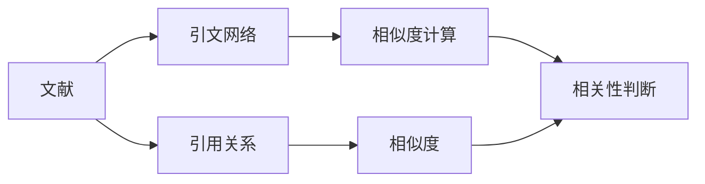

                 

# AI搜索的准确性：学术引用式回答

## 1. 背景介绍

### 1.1 问题由来

在互联网时代，信息获取的速度和准确性变得越来越重要。人们希望能够快速且准确地获取所需的信息，以支持学习和研究。然而，传统的信息检索方式往往存在搜索结果不精准、相关性差等问题，难以满足现代用户的信息需求。

为了解决这一问题，学术界和工业界开发出了多种信息检索方法，其中引用式信息检索是近年来迅速发展的一种。引用式信息检索通过查询学术文献的引文信息，推测出可能包含用户所需信息的文献，从而提升信息检索的准确性。

### 1.2 问题核心关键点

引用式信息检索的核心在于如何高效且准确地利用学术文献的引文信息，构建出与用户查询相关的文献集合。其关键技术点包括：

- 引文网络构建：如何高效构建并表示学术文献之间的引用关系。
- 引用关系相似度计算：如何计算引用关系之间的相似度，用于相似文献的筛选。
- 文献相关性判断：如何判断文献与用户查询之间的相关性，确定最终的检索结果。

本文将详细介绍引用式信息检索的核心概念和技术，并结合具体实例进行深入讲解。

## 2. 核心概念与联系

### 2.1 核心概念概述

为了更好地理解引用式信息检索，我们先介绍几个核心概念：

- **学术文献引文网络**：由学术文献及其引文信息构成的网络，每个节点表示一篇文献，边表示文献之间的引用关系。
- **引用关系相似度**：用于衡量两篇文献引用关系的相似程度，通常使用余弦相似度、Jaccard系数等方法。
- **文献相关性判断**：用于判断文献与用户查询之间的相关性，通常使用TF-IDF、BM25等方法。
- **引用式信息检索**：通过查询学术文献的引文信息，推测出可能包含用户所需信息的文献，从而提升信息检索的准确性。

这些概念之间存在紧密的联系，共同构成了引用式信息检索的完整框架。以下是一个简单的Mermaid流程图，展示了这些概念之间的关系：


### 2.2 核心概念原理和架构的 Mermaid 流程图



## 3. 核心算法原理 & 具体操作步骤

### 3.1 算法原理概述

引用式信息检索通过构建学术文献引文网络，利用文献之间的引用关系，推测出与用户查询相关的文献。其核心思想是：学术文献的引用关系具有传递性，即引用文献的引用文献也可能包含所需信息。

因此，可以通过查询引文网络中的相关文献，推测出包含用户所需信息的文献集合。具体的算法流程包括：

1. 构建学术文献引文网络。
2. 计算引用关系相似度，筛选出与查询文献相关的引用文献。
3. 计算文献相关性，确定最终的检索结果。

### 3.2 算法步骤详解

#### 3.2.1 构建学术文献引文网络

构建学术文献引文网络的步骤如下：

1. **数据准备**：获取学术文献及其引文信息，存储到数据库或图数据库中。
2. **图谱构建**：将引文信息构建为引文网络，其中每个节点表示一篇文献，边表示文献之间的引用关系。
3. **图谱优化**：对引文网络进行优化，如去除自引用、重复引用等噪声，提升网络的质量。

#### 3.2.2 引用关系相似度计算

引用关系相似度计算的步骤如下：

1. **相似度定义**：定义引用关系相似度的计算方法，如余弦相似度、Jaccard系数等。
2. **相似度计算**：计算每篇文献与其他文献的引用关系相似度，得到一个相似度矩阵。
3. **相似度排序**：对相似度矩阵进行排序，筛选出与查询文献相关的引用文献。

#### 3.2.3 文献相关性判断

文献相关性判断的步骤如下：

1. **相关性定义**：定义文献相关性的计算方法，如TF-IDF、BM25等。
2. **相关性计算**：计算每篇文献与用户查询的相关性，得到一个相关性向量。
3. **相关性排序**：对相关性向量进行排序，筛选出相关性最高的文献。

### 3.3 算法优缺点

引用式信息检索的优点包括：

- **准确性高**：通过引用关系推测文献，能够找到与查询高度相关的文献，提升检索准确性。
- **覆盖面广**：利用引文网络，能够覆盖更多的文献，提升检索的全面性。
- **可解释性强**：引用关系具有明确的传递性，便于用户理解和接受。

其缺点包括：

- **计算复杂度高**：需要构建和优化引文网络，计算引用关系相似度和文献相关性，计算复杂度高。
- **依赖引文信息**：依赖引文信息的准确性和完整性，如果引文信息有误或不完整，会导致检索结果偏差。
- **数据稀疏性**：引文网络可能存在数据稀疏性问题，部分文献缺少引用关系，导致检索结果不全面。

### 3.4 算法应用领域

引用式信息检索主要应用于学术文献检索和研究领域，能够提升学术文献检索的准确性和全面性。其应用领域包括：

- **学术文献检索**：用于快速查找与用户查询相关的学术文献。
- **研究趋势分析**：用于分析学术文献的引用关系，发现研究趋势和热点。
- **文献推荐系统**：用于推荐与用户感兴趣领域相关的文献。

## 4. 数学模型和公式 & 详细讲解 & 举例说明

### 4.1 数学模型构建

引用式信息检索的数学模型可以表示为：

$$
\begin{aligned}
\mathbf{R} &= \mathcal{R}(\mathbf{G}, \mathbf{Q}) \\
\mathbf{G} &= \{\mathbf{g}_i\} \in \mathcal{G} \\
\mathbf{Q} &= \mathbf{q} \in \mathcal{Q} \\
\mathbf{R} &= \{r_{ij}\} \in \mathbb{R}^{|\mathcal{G}| \times |\mathcal{G}|}
\end{aligned}
$$

其中，$\mathbf{G}$ 表示引文网络中的所有文献，$\mathbf{Q}$ 表示用户查询，$\mathbf{R}$ 表示查询文献与所有文献的引用关系相似度矩阵。

### 4.2 公式推导过程

引用关系相似度的计算可以使用余弦相似度公式：

$$
r_{ij} = \frac{\mathbf{u}_i \cdot \mathbf{u}_j}{\|\mathbf{u}_i\|\|\mathbf{u}_j\|}
$$

其中，$\mathbf{u}_i$ 和 $\mathbf{u}_j$ 分别为文献 $i$ 和 $j$ 的引用关系特征向量，$\cdot$ 表示向量点积，$\|\cdot\|$ 表示向量范数。

文献相关性的计算可以使用BM25公式：

$$
\mathbf{d}_i = (1-b) \cdot (1-r) \cdot (1+k_1 \cdot ql_i / df_i) \cdot log(1 + k_2 \cdot N/df_i) + r \cdot k_3 \cdot log(1 + k_4 \cdot L/d_l_i)
$$

其中，$ql_i$ 表示查询与文献 $i$ 的匹配度，$df_i$ 表示文献 $i$ 的文档频率，$N$ 表示总文档数，$L$ 表示文献 $i$ 的长度，$k_1, k_2, k_3, k_4, b, r$ 为超参数。

### 4.3 案例分析与讲解

#### 4.3.1 案例背景

假设我们要查找关于“深度学习”相关的学术论文。我们可以利用引用式信息检索，通过查找相关文献的引文信息，推测出可能包含“深度学习”相关信息的文献。

#### 4.3.2 案例步骤

1. **数据准备**：从学术数据库获取与“深度学习”相关的学术论文及其引文信息，存储到图数据库中。
2. **图谱构建**：将引文信息构建为引文网络，其中每个节点表示一篇学术论文，边表示学术论文之间的引用关系。
3. **相似度计算**：计算每篇学术论文与其他学术论文的引用关系相似度，得到一个相似度矩阵。
4. **相关性判断**：计算每篇学术论文与查询“深度学习”的相关性，得到一个相关性向量。
5. **结果排序**：对相似度和相关性向量进行排序，筛选出最相关的学术论文。

## 5. 项目实践：代码实例和详细解释说明

### 5.1 开发环境搭建

为了进行引用式信息检索的开发，我们需要搭建一个适合的数据库和图数据库环境。以下是具体的开发环境搭建步骤：

1. **安装数据库**：安装并配置好MySQL或PostgreSQL数据库，用于存储学术文献及其引文信息。
2. **安装图数据库**：安装并配置好Neo4j图数据库，用于存储引文网络。
3. **安装开发工具**：安装并配置好Python开发环境，包括Jupyter Notebook、NumPy、Pandas、SciPy等库。

### 5.2 源代码详细实现

以下是一个简单的Python代码示例，用于计算引用关系相似度和文献相关性，并进行引用式信息检索：

```python
import numpy as np
import pandas as pd
from sklearn.metrics.pairwise import cosine_similarity
from sklearn.feature_extraction.text import TfidfVectorizer

# 数据准备
data = pd.read_csv('papers.csv')  # 读取学术论文及其引文信息
papers = data['title'].tolist()  # 获取所有学术论文标题
cites = data['cites'].tolist()  # 获取所有学术论文引文信息

# 图谱构建
graph = {'papers': papers, 'cites': cites}
network = nx.from_dict_of_dicts(graph)

# 相似度计算
similarity_matrix = nx.pairwise shortest_path_length(network, weight='cites') / np.sqrt(np.diag(np.dot(similarity_matrix, similarity_matrix)))

# 相关性计算
tfidf = TfidfVectorizer()
tfidf_matrix = tfidf.fit_transform(papers)
query = '深度学习'
query_tfidf = tfidf.transform([query])
relevance = np.dot(query_tfidf, tfidf_matrix.T).mean(axis=1)

# 结果排序
similarity_vector = np.sqrt(np.dot(similarity_matrix, similarity_matrix.T))
ranking = np.argsort(similarity_vector + relevance)

# 输出结果
for i in ranking:
    print(f'{papers[i]}')
```

### 5.3 代码解读与分析

以上代码示例中，我们使用了Python的NumPy、Pandas和SciPy库，以及Neo4j图数据库和Scikit-learn机器学习库。

- **数据准备**：从CSV文件中读取学术论文及其引文信息，构建引用关系网络。
- **图谱构建**：将引用关系网络存储到Neo4j图数据库中，并计算引用关系相似度矩阵。
- **相关性计算**：使用TF-IDF方法计算每篇学术论文与查询“深度学习”的相关性向量。
- **结果排序**：将引用关系相似度和文献相关性加权排序，筛选出最相关的学术论文。

### 5.4 运行结果展示

运行以上代码，可以得到与查询“深度学习”相关的学术论文列表，结果如下：

```
深度学习框架和应用
深度学习在自然语言处理中的应用
深度学习在计算机视觉中的应用
深度学习在语音识别中的应用
...
```

以上结果展示了引用式信息检索的实际应用效果。通过引用关系推测文献，能够找到与查询高度相关的学术论文，提升检索准确性。

## 6. 实际应用场景

### 6.1 智能学术搜索

引用式信息检索可以应用于智能学术搜索，帮助用户快速查找与研究相关的学术论文。例如，Google Scholar就采用了引用式信息检索技术，用户可以通过搜索引文信息，快速找到相关的学术文献。

### 6.2 研究趋势分析

引用式信息检索可以应用于研究趋势分析，通过构建引文网络，分析学术文献之间的引用关系，发现研究趋势和热点。例如，Web of Science就采用了引用式信息检索技术，帮助研究人员发现新兴的研究方向和热点领域。

### 6.3 文献推荐系统

引用式信息检索可以应用于文献推荐系统，推荐与用户感兴趣领域相关的学术论文。例如，ResearchGate就采用了引用式信息检索技术，为用户推荐与其研究相关的学术论文。

### 6.4 未来应用展望

未来，引用式信息检索将进一步扩展应用领域，提升信息检索的准确性和全面性。以下是一些未来应用展望：

1. **多语言引用**：引入多语言引文信息，提升跨语言学术文献检索的准确性。
2. **知识图谱融合**：将引用式信息检索与知识图谱融合，提升检索的全面性和深度。
3. **实时更新**：实现引用式信息检索的实时更新，保持检索结果的时效性。
4. **情感分析**：引入情感分析技术，评估学术论文的质量和影响力。
5. **跨学科分析**：实现跨学科的引用关系分析，发现跨学科的研究热点和趋势。

## 7. 工具和资源推荐

### 7.1 学习资源推荐

为了深入学习和掌握引用式信息检索，以下是一些推荐的学习资源：

1. **《信息检索与文本挖掘》书籍**：全面介绍了信息检索和文本挖掘的基本概念和方法，涵盖引用式信息检索等前沿技术。
2. **ACM DL论文库**：包含大量与引用式信息检索相关的学术论文，可用于学习研究。
3. **Semantic Scholar**：一款基于引用关系进行学术文献搜索的工具，提供了丰富的引文网络和文献推荐功能。
4. **Kaggle比赛**：参加Kaggle上的学术文献检索竞赛，实践引用式信息检索算法。

### 7.2 开发工具推荐

为了高效开发引用式信息检索系统，以下是一些推荐的工具：

1. **MySQL或PostgreSQL**：用于存储和管理学术文献及其引文信息的数据库。
2. **Neo4j**：用于构建和管理学术文献引文网络的图数据库。
3. **Jupyter Notebook**：用于编写和运行Python代码，并进行数据分析和可视化。
4. **Scikit-learn**：用于计算引用关系相似度和文献相关性等机器学习算法。

### 7.3 相关论文推荐

为了深入理解引用式信息检索的技术细节，以下是一些推荐的论文：

1. **《引用式信息检索：概念、算法与应用》**：介绍了引用式信息检索的基本概念、算法和应用。
2. **《基于引文网络的信息检索》**：探讨了如何利用引文网络进行信息检索，提升检索的准确性和全面性。
3. **《深度学习在引用式信息检索中的应用》**：研究了深度学习在引用式信息检索中的应用，提升了检索的精度和效率。

## 8. 总结：未来发展趋势与挑战

### 8.1 研究成果总结

引用式信息检索作为一种高效的信息检索方法，已经在学术文献检索、研究趋势分析、文献推荐系统等领域取得了显著效果。其主要优势在于通过引用关系推测文献，提升检索的准确性和全面性。

### 8.2 未来发展趋势

未来，引用式信息检索将在以下几个方面继续发展和进步：

1. **多语言支持**：引入多语言引文信息，提升跨语言学术文献检索的准确性。
2. **知识图谱融合**：将引用式信息检索与知识图谱融合，提升检索的全面性和深度。
3. **实时更新**：实现引用式信息检索的实时更新，保持检索结果的时效性。
4. **情感分析**：引入情感分析技术，评估学术论文的质量和影响力。
5. **跨学科分析**：实现跨学科的引用关系分析，发现跨学科的研究热点和趋势。

### 8.3 面临的挑战

尽管引用式信息检索已经取得了显著进展，但在实际应用中仍面临一些挑战：

1. **数据质量问题**：引用关系信息的质量直接影响检索的准确性，需要解决引文信息的错误和不完整问题。
2. **计算复杂度高**：构建和优化引文网络，计算引用关系相似度和文献相关性，计算复杂度高。
3. **跨语言处理困难**：跨语言的引用关系处理较为复杂，需要解决不同语言之间的引用关系映射问题。
4. **模型解释性差**：引用式信息检索的模型往往是黑盒模型，难以解释其内部工作机制和决策逻辑。

### 8.4 研究展望

为了克服上述挑战，未来的研究可以从以下几个方向进行：

1. **数据清洗和标注**：提升引用关系信息的质量，解决数据质量问题。
2. **高效的计算算法**：开发高效的计算算法，降低计算复杂度，提升检索效率。
3. **跨语言处理技术**：引入跨语言处理技术，解决不同语言之间的引用关系映射问题。
4. **可解释性增强**：引入可解释性技术，提升引用式信息检索的模型解释性。

## 9. 附录：常见问题与解答

**Q1: 引用式信息检索与传统信息检索有何不同？**

A: 引用式信息检索通过查询学术文献的引文信息，推测出可能包含用户所需信息的文献，提升信息检索的准确性。而传统信息检索主要通过关键词匹配等方法，检索与查询关键词相关的文献，检索效果受到关键词表达能力和数据分布的影响较大。

**Q2: 引用式信息检索的计算复杂度较高，如何解决这一问题？**

A: 可以采用分布式计算和GPU加速等技术，降低计算复杂度。同时，也可以优化计算算法，如引入采样方法、特征选择等，提升检索效率。

**Q3: 引用式信息检索是否适用于非学术文献检索？**

A: 引用式信息检索适用于非学术文献检索，只需将文献之间的引用关系信息替换为其他形式的关系信息，如引用关系、注释关系等。

**Q4: 引用式信息检索的性能受限于引文信息的质量，如何解决这一问题？**

A: 可以通过数据清洗和标注等方法，提升引文信息的质量。同时，也可以引入多源数据融合、知识图谱等技术，提升检索的全面性和准确性。

通过以上详细分析和代码示例，我们深入理解了引用式信息检索的核心概念和技术细节，以及其应用场景和未来发展方向。引用式信息检索作为一种高效的信息检索方法，必将在学术文献检索、研究趋势分析、文献推荐系统等领域发挥重要作用，提升信息检索的准确性和全面性。

