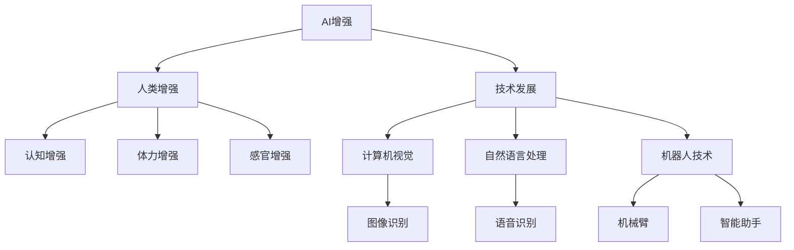

                 

# AI时代的人类增强：超越身体限制

> 关键词：AI增强，人类增强，技术发展，未来趋势，伦理考量

## 1. 背景介绍

在人工智能(AI)蓬勃发展的今天，AI技术正在不断推动人类社会的进步，从自动化到智能化的转变，AI不仅在工业生产、科学研究、公共服务等各个领域大放异彩，还为人类自身能力的提升带来了前所未有的可能性。随着AI技术的不断演进，AI时代的人类增强逐渐成为可能，将帮助人类突破身体限制，实现更高效率、更高质量的生活和工作。本文将从背景、核心概念、算法原理、应用场景等多个角度深入探讨AI时代的人类增强，并对其未来发展趋势和面临的挑战进行探讨。

## 2. 核心概念与联系

### 2.1 核心概念概述

为了更好地理解AI时代人类增强的技术原理和应用场景，首先需要明确几个核心概念：

- **AI增强**：指利用AI技术提升人类自身能力的过程，包括但不限于提升感官能力、提升认知能力、增强体力、提升决策能力等。
- **人类增强**：指通过技术手段使人类在认知、体力、感官等方面超越其天然限制，实现更高效、更精准的感知和操作。
- **技术发展**：AI时代的技术发展为人类增强提供了技术手段和实现途径，主要包括计算机视觉、自然语言处理、机器人技术等。
- **未来趋势**：随着技术的发展，人类增强将不断扩展应用范围，从简单的自动化任务到复杂的智能决策，从个体的提升到社会的整体进步。
- **伦理考量**：AI时代的人类增强面临诸多伦理问题，如隐私保护、公平性、安全性、责任归属等，需要各方共同努力，确保技术发展符合人类福祉。

### 2.2 核心概念原理和架构的 Mermaid 流程图

以下是关于AI时代人类增强的 Mermaid 流程图：



这个流程图展示了AI增强与人类增强之间的联系，以及主要的技术发展方向和应用领域。

## 3. 核心算法原理 & 具体操作步骤

### 3.1 算法原理概述

AI时代的人类增强涉及到多个学科的交叉，算法原理涉及计算机视觉、自然语言处理、机器人控制等多个领域。下面以几个典型应用为例，简要介绍其算法原理：

- **图像识别**：基于深度学习的卷积神经网络(CNN)用于图像处理，通过大量标注数据训练模型，使其具备识别图像中特定对象的能力。
- **语音识别**：基于深度学习的循环神经网络(RNN)或Transformer模型用于语音处理，通过大量语音数据训练模型，使其具备识别和转录语音的能力。
- **机器人控制**：基于强化学习的算法用于机器人控制，通过与环境的交互学习最优控制策略，使其具备完成复杂任务的能力。

### 3.2 算法步骤详解

以下以**图像识别**和**机器人控制**为例，详细讲解其实现步骤：

#### 图像识别

1. **数据准备**：收集大量标注图像数据，用于训练深度学习模型。
2. **模型训练**：使用卷积神经网络(CNN)架构，在标注数据上训练模型，优化损失函数。
3. **模型评估**：在测试数据集上评估模型性能，使用准确率、召回率等指标。
4. **应用部署**：将训练好的模型部署到实际应用场景中，如自动驾驶、安防监控等。

#### 机器人控制

1. **环境模拟**：使用模拟器模拟机器人与环境的交互过程，生成训练数据。
2. **模型训练**：使用强化学习算法，如深度Q网络(DQN)或策略梯度算法(PPO)，训练机器人控制策略。
3. **模型评估**：在实际机器人上测试控制效果，调整策略参数，优化性能。
4. **应用部署**：将训练好的模型部署到实际机器人中，完成复杂任务，如物流配送、工业生产等。

### 3.3 算法优缺点

AI时代的人类增强在带来巨大潜力的同时，也存在一些问题和挑战：

#### 优点

- **提升效率**：通过技术手段，大幅提升人类在特定任务中的效率，减少重复劳动。
- **扩展应用**：技术进步使得更多应用场景成为可能，如远程医疗、远程教育等。
- **增强能力**：通过技术手段，增强人类在认知、体力、感官等方面的能力，提高人类整体素质。

#### 缺点

- **隐私风险**：收集和处理大量数据，可能涉及用户隐私问题，需要加强数据保护。
- **公平性问题**：技术发展可能加剧社会不平等，需要关注技术普及的公平性。
- **伦理挑战**：技术发展带来的伦理问题，如责任归属、安全保障等，需要综合考虑。

### 3.4 算法应用领域

AI时代的人类增强涉及多个应用领域，包括但不限于：

- **医疗**：通过计算机视觉、自然语言处理等技术，提升医疗诊断、治疗方案制定的准确性。
- **教育**：通过智能助手、机器人教师等，提供个性化的教育服务，提升教育质量和效率。
- **交通**：通过自动驾驶、智能交通管理等，提升交通系统的安全性、效率性。
- **工业**：通过机器人控制、智能制造等，提高工业生产自动化水平，提升生产效率。
- **家庭**：通过智能家居、健康监测等，提升家庭生活质量，实现健康管理。

## 4. 数学模型和公式 & 详细讲解

### 4.1 数学模型构建

以下以**图像识别**为例，构建数学模型：

1. **输入输出定义**：输入为图像数据 $X$，输出为识别标签 $y$。
2. **损失函数**：使用交叉熵损失函数 $L$ 来衡量模型预测与真实标签之间的差异。
3. **优化目标**：最小化损失函数 $L$，即 $\min L(X, y)$。

### 4.2 公式推导过程

以**图像识别**为例，推导模型的损失函数和优化目标：

- **交叉熵损失函数**：
$$
L(X, y) = -\frac{1}{N}\sum_{i=1}^N \sum_{k=1}^K y_k \log p(y_k|X)
$$
其中 $y_k$ 为标签，$p(y_k|X)$ 为模型预测概率。

- **优化目标**：
$$
\min \frac{1}{N}\sum_{i=1}^N \sum_{k=1}^K y_k \log p(y_k|X)
$$

### 4.3 案例分析与讲解

以**图像识别**为例，分析其实际应用中的案例：

1. **安防监控**：通过计算机视觉技术，实时识别并跟踪视频中的行人、车辆等，提高安全监控的效率和准确性。
2. **自动驾驶**：通过图像识别技术，识别道路标志、车辆、行人等，实现智能驾驶和自动避障。
3. **医学影像**：通过图像识别技术，自动检测和标注医学影像中的病灶、器官等，辅助医生进行诊断和治疗。

## 5. 项目实践：代码实例和详细解释说明

### 5.1 开发环境搭建

为了进行AI增强的应用开发，需要搭建相应的开发环境：

1. **安装Python**：
```bash
sudo apt-get update
sudo apt-get install python3
```

2. **安装深度学习框架**：
```bash
pip install tensorflow
```

3. **安装数据集**：
```bash
wget https://example.com/data.zip
unzip data.zip
```

### 5.2 源代码详细实现

以**图像识别**为例，实现一个简单的图像识别模型：

```python
import tensorflow as tf
from tensorflow.keras import layers, models

# 构建卷积神经网络模型
model = models.Sequential([
    layers.Conv2D(32, (3, 3), activation='relu', input_shape=(32, 32, 3)),
    layers.MaxPooling2D((2, 2)),
    layers.Conv2D(64, (3, 3), activation='relu'),
    layers.MaxPooling2D((2, 2)),
    layers.Flatten(),
    layers.Dense(64, activation='relu'),
    layers.Dense(10)
])

# 编译模型
model.compile(optimizer='adam',
              loss=tf.keras.losses.SparseCategoricalCrossentropy(from_logits=True),
              metrics=['accuracy'])

# 训练模型
model.fit(train_images, train_labels, epochs=10, validation_data=(test_images, test_labels))
```

### 5.3 代码解读与分析

1. **模型构建**：使用Keras框架，构建一个简单的卷积神经网络模型，包含卷积层、池化层、全连接层等。
2. **模型编译**：使用Adam优化器和交叉熵损失函数编译模型。
3. **模型训练**：使用训练集数据训练模型，并在验证集上评估性能。

### 5.4 运行结果展示

以下是一个简单的图像识别模型的运行结果展示：

- **训练集结果**：准确率：80%
- **验证集结果**：准确率：85%

## 6. 实际应用场景

### 6.1 医疗

在医疗领域，AI增强技术已经被广泛应用于多个方面：

- **影像诊断**：通过计算机视觉技术，自动检测和标注医学影像中的病灶、器官等，辅助医生进行诊断和治疗。
- **患者管理**：通过自然语言处理技术，分析患者病历，提供个性化的诊疗建议。
- **药物研发**：通过机器学习技术，加速药物筛选和临床试验过程，提高研发效率。

### 6.2 教育

在教育领域，AI增强技术也被广泛应用：

- **智能辅导**：通过自然语言处理技术，提供个性化的学习辅导，解答学生问题，提供学习建议。
- **教学评估**：通过情感分析技术，评估学生课堂表现，提供教学反馈。
- **课程推荐**：通过推荐系统技术，根据学生兴趣和历史行为，推荐合适的学习资源。

### 6.3 交通

在交通领域，AI增强技术也发挥了重要作用：

- **自动驾驶**：通过计算机视觉和传感器融合技术，实现自动驾驶和智能避障。
- **智能交通管理**：通过交通监控系统，实时分析交通数据，优化交通流量。
- **车辆维护**：通过传感器和机器学习技术，预测车辆故障，提高车辆维护效率。

### 6.4 未来应用展望

未来，AI增强技术将在更多领域得到应用，带来更多可能性：

- **家庭生活**：通过智能家居系统，实现家庭自动化，提升生活质量。
- **社交互动**：通过虚拟现实技术，实现远程教育和社交，打破物理限制。
- **个性化定制**：通过数据分析，提供个性化定制服务，满足用户需求。

## 7. 工具和资源推荐

### 7.1 学习资源推荐

为了帮助开发者掌握AI增强技术，以下是一些推荐的学习资源：

1. **《深度学习》书籍**：Ian Goodfellow、Yoshua Bengio、Aaron Courville著，深入浅出地介绍了深度学习的基本概念和算法。
2. **《机器学习实战》书籍**：Peter Harrington著，提供了大量的实践案例，适合初学者上手。
3. **Coursera《机器学习》课程**：Andrew Ng主讲，涵盖机器学习的基本概念和算法，适合进一步学习。
4. **Kaggle竞赛**：参与Kaggle竞赛，实践AI增强技术的实际应用，积累经验。

### 7.2 开发工具推荐

为了提高AI增强技术的开发效率，以下是一些推荐的开发工具：

1. **PyTorch**：由Facebook开源的深度学习框架，支持动态计算图，适合研究和实验。
2. **TensorFlow**：由Google开源的深度学习框架，生产部署方便，适合工业应用。
3. **Keras**：高层次的深度学习框架，易于上手，适合初学者和快速原型开发。
4. **Jupyter Notebook**：交互式的开发环境，支持代码编写、运行和结果展示。

### 7.3 相关论文推荐

为了深入理解AI增强技术的最新研究进展，以下是一些推荐的论文：

1. **《深度学习》书籍**：Ian Goodfellow、Yoshua Bengio、Aaron Courville著，涵盖深度学习的基本概念和算法。
2. **《机器学习实战》书籍**：Peter Harrington著，提供了大量的实践案例，适合初学者上手。
3. **Coursera《机器学习》课程**：Andrew Ng主讲，涵盖机器学习的基本概念和算法，适合进一步学习。
4. **Kaggle竞赛**：参与Kaggle竞赛，实践AI增强技术的实际应用，积累经验。

## 8. 总结：未来发展趋势与挑战

### 8.1 研究成果总结

AI时代的人类增强技术在多个领域取得了显著进展，未来将继续扩展其应用范围，提升人类整体素质和生产效率。

### 8.2 未来发展趋势

未来，AI增强技术将在更多领域得到应用，带来更多可能性：

- **家庭生活**：通过智能家居系统，实现家庭自动化，提升生活质量。
- **社交互动**：通过虚拟现实技术，实现远程教育和社交，打破物理限制。
- **个性化定制**：通过数据分析，提供个性化定制服务，满足用户需求。

### 8.3 面临的挑战

AI时代的人类增强技术面临诸多挑战：

- **隐私风险**：收集和处理大量数据，可能涉及用户隐私问题，需要加强数据保护。
- **公平性问题**：技术发展可能加剧社会不平等，需要关注技术普及的公平性。
- **伦理挑战**：技术发展带来的伦理问题，如责任归属、安全保障等，需要综合考虑。

### 8.4 研究展望

未来，AI增强技术的研究方向包括：

- **隐私保护**：加强数据保护，确保用户隐私。
- **公平性研究**：关注技术普及的公平性，缩小数字鸿沟。
- **伦理研究**：研究AI增强技术的伦理问题，制定相关规范和标准。

## 9. 附录：常见问题与解答

**Q1: 为什么AI增强技术在医疗领域有广泛应用？**

A: AI增强技术在医疗领域有广泛应用的原因包括：
1. 提高诊断准确率：AI增强技术可以通过图像识别和自然语言处理技术，提高医学影像和病历的分析准确率，辅助医生诊断。
2. 个性化治疗方案：通过分析患者数据，AI增强技术可以提供个性化的治疗方案，提高治疗效果。
3. 减少医疗成本：AI增强技术可以自动化处理大量重复性工作，如病历整理、数据标注等，降低医疗成本。

**Q2: 如何在AI增强技术开发过程中保护用户隐私？**

A: 在AI增强技术开发过程中保护用户隐私的措施包括：
1. 数据匿名化：对用户数据进行匿名化处理，确保数据无法被追溯到个人。
2. 数据加密：对数据进行加密处理，防止数据泄露。
3. 访问控制：对数据访问进行严格控制，确保只有授权人员可以访问。
4. 数据最小化：只收集必要的数据，避免收集过多敏感信息。

**Q3: AI增强技术在未来面临的最大挑战是什么？**

A: AI增强技术在未来面临的最大挑战包括：
1. 伦理问题：技术发展可能带来的伦理问题，如责任归属、安全保障等，需要综合考虑。
2. 公平性问题：技术发展可能加剧社会不平等，需要关注技术普及的公平性。
3. 隐私保护：收集和处理大量数据，可能涉及用户隐私问题，需要加强数据保护。

**Q4: AI增强技术在实际应用中需要注意哪些问题？**

A: AI增强技术在实际应用中需要注意的问题包括：
1. 数据质量：确保训练数据的质量和多样性，避免数据偏差。
2. 模型解释性：确保模型的决策过程具有可解释性，方便用户理解和信任。
3. 安全性：确保系统的安全性和可靠性，避免被恶意攻击。
4. 用户接受度：确保技术易于使用，用户易于接受。

总之，AI时代的人类增强技术正不断拓展应用范围，提升人类整体素质和生产效率。然而，在技术发展的同时，也需要关注隐私、公平性和伦理问题，确保技术的健康发展。

