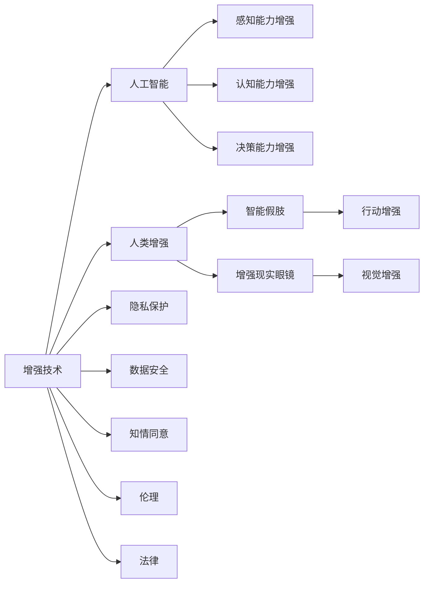

                 

# AI时代的人类增强：道德考虑与身体增强技术的未来趋势预测

## 1. 背景介绍

### 1.1 问题由来

随着人工智能（AI）技术的迅猛发展，人类增强技术正成为新一代科技革命的前沿领域。特别是近年来，生物技术和AI技术的融合，使得基于AI的智能增强设备如智能假肢、增强现实眼镜等逐渐进入大众视野，激发了全社会对于人体增强的广泛关注和热切期待。

人类增强技术的飞速发展，不仅满足了人们对健康、安全、效率等生活品质的更高追求，也提出了诸多伦理、法律、社会等问题。这些问题涉及到隐私保护、数据安全、个人自由和社会公平等诸多方面，需要跨学科团队合作、政策制定者和社会各界的共同参与，以期实现技术进步与社会价值的双重提升。

### 1.2 问题核心关键点

本文聚焦于AI时代人类增强技术，尤其是身体增强技术的未来趋势预测。围绕三个核心问题：
1. 人类增强技术的未来发展路径和趋势。
2. 技术带来的伦理和法律挑战。
3. 社会如何应对与引导这一变革。

通过这些问题，探讨AI时代人类增强技术的深度、广度和复杂性，为未来科技发展和社会治理提供可行的策略与建议。

## 2. 核心概念与联系

### 2.1 核心概念概述

为更好地理解人类增强技术，本文介绍几个关键概念：

- **增强技术（Augmentation Technology）**：指通过技术手段对人的能力进行增强，包括身体机能、认知能力、感知能力等。
- **人工智能（Artificial Intelligence, AI）**：指通过算法和计算技术模拟人类智能，实现机器的感知、理解、决策等功能。
- **人类增强（Human Enhancement）**：指利用生物医学、人工智能等技术，提升人类身体机能、认知能力等，改善生活质量，提高生产效率。
- **伦理与法律**：指涉及增强技术应用过程中可能产生的道德和法律问题，如隐私保护、数据安全、知情同意等。

这些概念之间的逻辑关系可通过以下Mermaid流程图来展示：



这个流程图展示增强技术的多个维度：

1. 增强技术通过AI能力提升，包括感知、认知和决策能力的增强。
2. 具体的增强技术应用，如智能假肢和增强现实眼镜。
3. 应用过程中涉及的伦理和法律问题。

这些核心概念共同构成了人类增强技术的框架，指导未来技术研发和伦理法律的建设。

## 3. 核心算法原理 & 具体操作步骤

### 3.1 算法原理概述

人类增强技术涉及多学科领域的知识，包括生物医学、计算机科学和人工智能等。其中，基于AI的增强技术主要通过以下两种方式实现：

- **计算机视觉**：利用机器学习算法，处理和分析图像、视频等视觉数据，实现视觉增强。
- **神经网络**：通过深度学习模型，模拟人类神经网络，实现对视觉、听觉、触觉等感官的增强。

增强技术的基本算法流程包括：

1. 数据收集与预处理：通过传感器收集人体数据，并对数据进行清洗和预处理。
2. 特征提取：利用计算机视觉和神经网络技术，提取关键特征。
3. 算法训练与优化：使用机器学习算法进行模型训练，并不断优化提升模型性能。
4. 技术应用与反馈：将模型应用到具体场景，收集用户反馈，迭代优化模型。

### 3.2 算法步骤详解

人类增强技术的实现步骤如下：

1. **数据收集**：使用传感器如加速度计、陀螺仪、摄像头等，实时收集人体的动作、位置、视觉数据等。

2. **特征提取**：通过算法将收集到的数据转换为机器可以理解的特征向量，如时间序列、空间位置等。

3. **模型训练**：使用机器学习模型，如卷积神经网络（CNN）、递归神经网络（RNN）等，对特征数据进行训练。

4. **实时应用**：将训练好的模型应用到增强设备中，实时处理用户动作，进行增强功能的输出。

5. **用户反馈与优化**：收集用户反馈，对模型进行优化和调整，以提升用户体验。

### 3.3 算法优缺点

增强技术基于AI实现，具有以下优点：

1. **高效性**：通过算法处理数据，可以实时分析用户动作，提供即时反馈。
2. **灵活性**：可以根据用户需求，定制化增强功能，如辅助行走、视觉矫正等。
3. **广泛应用**：应用于运动、视觉、听觉等多个领域，满足不同人群的需求。

同时，该技术也存在以下缺点：

1. **依赖数据**：对数据质量和数据量要求较高，数据收集和处理成本较高。
2. **隐私问题**：数据隐私和安全性成为主要挑战，需要强大的数据保护机制。
3. **技术复杂性**：算法复杂度高，实现难度大，需要跨学科的合作。

### 3.4 算法应用领域

增强技术在多个领域具有广泛的应用前景，例如：

- **医疗领域**：通过增强设备辅助手术、辅助诊断、辅助康复等。
- **体育运动**：增强运动员的感知和决策能力，提升运动表现。
- **工业生产**：增强工人的肢体能力，提高生产效率。
- **教育培训**：通过虚拟现实和增强现实技术，提升学习体验和效果。

未来，增强技术有望在更多领域得到应用，为各行各业带来新的变革。

## 4. 数学模型和公式 & 详细讲解 & 举例说明

### 4.1 数学模型构建

基于增强技术的数据处理和特征提取过程，本文以智能假肢为例，构建数学模型。

假设智能假肢收集到的加速度和陀螺仪数据为 $a(t), \omega(t)$，时间步长为 $\Delta t$，则数据可表示为：

$$
\begin{align*}
x_1(t) &= a(t) \\
x_2(t) &= \omega(t)
\end{align*}
$$

对于时间序列数据，可以构建时间序列模型，如自回归模型（AR）、差分自回归模型（ARIMA）等，用于处理和预测人体动作数据。

### 4.2 公式推导过程

假设智能假肢的动作数据经过预处理后，得到时间序列 $X = (x_1, x_2, ..., x_T)$，其中 $T$ 为样本数量。使用ARIMA模型进行建模，可表示为：

$$
X_t = \phi(X_{t-1}, X_{t-2}, ..., X_{t-p}) + \epsilon_t
$$

其中，$\epsilon_t$ 为随机误差项，$p$ 为模型阶数。

通过最小化均方误差，可得模型参数 $\theta$ 的估计值，用于预测未来数据：

$$
\theta^* = \mathop{\arg\min}_{\theta} \sum_{t=1}^T (X_t - f(X_{t-1}, ..., X_{t-p}; \theta))^2
$$

### 4.3 案例分析与讲解

以增强现实眼镜为例，其通过计算机视觉技术增强用户的视觉感知能力。

通过摄像头收集环境图像，使用CNN模型进行特征提取和分类，可以实时识别环境中的物体，并预测用户视线方向。

设图像数据 $I$ 和视角数据 $v$，通过模型预测环境物体 $O$ 和视线方向 $V$，公式表示如下：

$$
O = f(I; \theta) \\
V = g(I; \theta)
$$

通过模型训练，使得 $O$ 和 $V$ 与真实数据 $O'$ 和 $V'$ 一致。

## 5. 项目实践：代码实例和详细解释说明

### 5.1 开发环境搭建

进行增强技术开发，需要搭建相应的开发环境。以下是使用Python进行深度学习开发的示例：

1. 安装Anaconda：从官网下载并安装Anaconda，用于创建独立的Python环境。

2. 创建并激活虚拟环境：
```bash
conda create -n pytorch-env python=3.8 
conda activate pytorch-env
```

3. 安装PyTorch：根据CUDA版本，从官网获取对应的安装命令。例如：
```bash
conda install pytorch torchvision torchaudio cudatoolkit=11.1 -c pytorch -c conda-forge
```

4. 安装OpenCV：
```bash
pip install opencv-python-headless opencv-contrib-python-headless
```

5. 安装其他依赖库：
```bash
pip install numpy scipy matplotlib scipy torch
```

完成上述步骤后，即可在`pytorch-env`环境中开始增强技术开发。

### 5.2 源代码详细实现

以下是使用PyTorch进行智能假肢动作预测的示例代码：

```python
import torch
import torch.nn as nn
import torch.optim as optim
import torchvision.transforms as transforms
from torch.autograd import Variable

# 定义动作预测模型
class ActionPredictor(nn.Module):
    def __init__(self):
        super(ActionPredictor, self).__init__()
        self.lstm = nn.LSTM(2, 256, 2, batch_first=True)
        self.fc = nn.Linear(256, 2)

    def forward(self, x):
        lstm_out, _ = self.lstm(x)
        return self.fc(lstm_out[:, -1, :])

# 加载数据
data = torch.load('actions.pkl')

# 定义模型和优化器
model = ActionPredictor()
optimizer = optim.Adam(model.parameters(), lr=0.01)
criterion = nn.MSELoss()

# 训练模型
for epoch in range(100):
    for i in range(len(data)):
        x = Variable(data[i]).float()
        y = Variable(data[i+1]).float()
        optimizer.zero_grad()
        y_pred = model(x)
        loss = criterion(y_pred, y)
        loss.backward()
        optimizer.step()

    print('Epoch [{}/{}], Loss: {:.4f}'.format(epoch+1, 100, loss.item()))

# 保存模型
torch.save(model.state_dict(), 'action_predictor.pkl')
```

这段代码展示了如何使用PyTorch实现简单的动作预测模型。

### 5.3 代码解读与分析

让我们详细解读上述代码中的关键部分：

**ActionPredictor类**：
- `__init__`方法：定义模型的LSTM层和全连接层。
- `forward`方法：进行前向传播，返回模型预测结果。

**数据加载**：
- 使用`torch.load`方法加载预处理好的动作数据，方便训练和推理。

**模型训练**：
- 定义训练过程，通过`for`循环迭代数据集，进行前向传播和反向传播。
- `Adam`优化器和`MSELoss`损失函数用于模型训练。

**模型保存**：
- 使用`torch.save`方法保存模型参数，便于后续推理应用。

通过这段代码，可以看出基于AI的增强技术开发的基本流程和实现细节。

## 6. 实际应用场景

### 6.1 智能假肢

智能假肢技术已开始广泛应用于医疗康复领域，能够辅助残障人士进行行走和日常活动。其通过传感器收集残肢的动作数据，并利用增强技术提升假肢的响应速度和控制精度。

### 6.2 增强现实眼镜

增强现实眼镜通过计算机视觉技术，实时分析环境数据，为佩戴者提供增强的视觉体验。例如，可以通过眼镜识别并标注环境中的物体，提供导航和信息提示。

### 6.3 工业生产

在工业生产中，增强技术可以提升工人的肢体能力和感知能力，改善工作环境，提高生产效率和安全性。例如，利用增强现实眼镜进行设备维护，通过图像识别和信息提示，快速定位和解决问题。

### 6.4 未来应用展望

未来，增强技术有望在更多领域得到应用，为各行各业带来新的变革。例如：

- **医疗健康**：增强医疗设备，提高诊断和康复效果。
- **教育培训**：提供增强现实和虚拟现实学习环境，提升学习体验。
- **娱乐体验**：通过增强现实和虚拟现实技术，提供沉浸式娱乐体验。

增强技术的应用前景广阔，能够有效提升人类生活质量和生产效率，推动社会进步。

## 7. 工具和资源推荐

### 7.1 学习资源推荐

为了帮助开发者系统掌握增强技术，这里推荐一些优质的学习资源：

1. 《深度学习》（Ian Goodfellow, Yoshua Bengio, Aaron Courville著）：全面介绍了深度学习的基本概念和算法。
2. 《机器学习实战》（Peter Harrington著）：详细讲解了机器学习算法的实现和应用。
3. 《计算机视觉：算法与应用》（Richard Szeliski著）：介绍了计算机视觉的基本理论和技术。
4. 《增强现实技术基础》（Larry R. Arsenault著）：讲解了增强现实技术的基本原理和实现方法。
5. Coursera上的深度学习课程：由斯坦福大学和密歇根大学开设的深度学习课程，涵盖深度学习的基本概念和实践。

通过对这些资源的学习实践，相信你一定能够快速掌握增强技术的基础知识和实现方法。

### 7.2 开发工具推荐

高效的开发离不开优秀的工具支持。以下是几款用于增强技术开发的常用工具：

1. PyTorch：基于Python的开源深度学习框架，灵活动态的计算图，适合快速迭代研究。
2. TensorFlow：由Google主导开发的开源深度学习框架，生产部署方便，适合大规模工程应用。
3. OpenCV：开源计算机视觉库，提供了丰富的图像处理和计算机视觉算法。
4. Ubuntu：Linux操作系统，广泛用于深度学习和计算机视觉项目。
5. ROS（Robot Operating System）：开源机器人操作系统，支持机器人视觉和运动控制。

合理利用这些工具，可以显著提升增强技术的开发效率，加快创新迭代的步伐。

### 7.3 相关论文推荐

增强技术的研究源于学界的持续研究。以下是几篇奠基性的相关论文，推荐阅读：

1. "Human-Centered Machine Learning" by Pedro Domingos：介绍了机器学习在人机交互中的应用。
2. "Human Augmentation with Electronic Brain Implants" by Ken A. Smith：探讨了脑机接口技术在人类增强中的应用。
3. "Human Machine Systems: Concepts, Methodologies, Applications, and Research Directions" by Joseph Wang, Anne L. Y. Wang：介绍了人机交互技术的发展和应用。
4. "Towards Predictive Models of Human Behavior" by Tom Mitchell：探讨了机器学习在预测人类行为中的应用。

这些论文代表增强技术的发展脉络。通过学习这些前沿成果，可以帮助研究者把握学科前进方向，激发更多的创新灵感。

## 8. 总结：未来发展趋势与挑战

### 8.1 总结

本文对基于AI的增强技术进行了全面系统的介绍。首先阐述了增强技术的未来发展路径和趋势，明确了技术在各行业的应用前景。其次，介绍了增强技术的算法原理和操作步骤，提供了基于PyTorch的代码示例，帮助读者理解实现细节。最后，探讨了增强技术带来的伦理和法律挑战，提出了相关建议和展望。

通过本文的系统梳理，可以看到，AI时代的人类增强技术正在成为新一代科技革命的前沿领域，具有广阔的应用前景和发展空间。未来，伴随技术的不断演进和社会的共同努力，增强技术必将在更多领域得到应用，为人类生活和社会进步带来新的变革。

### 8.2 未来发展趋势

展望未来，增强技术的发展将呈现以下几个趋势：

1. **多模态增强**：结合视觉、听觉、触觉等多模态信息，实现更加全面的人体增强。
2. **深度学习融合**：将深度学习技术引入增强技术中，提升模型性能和应用效果。
3. **实时增强**：通过边缘计算等技术，实现实时数据处理和反馈，提升用户体验。
4. **智能交互**：结合自然语言处理和计算机视觉技术，实现智能的人机交互。
5. **个性化增强**：根据用户需求和行为，定制化增强功能，提升用户体验。

这些趋势将进一步推动增强技术的广泛应用和深入发展。

### 8.3 面临的挑战

尽管增强技术已经取得了诸多进展，但在实现过程中仍面临诸多挑战：

1. **数据质量问题**：增强技术依赖大量高质量数据，数据收集和处理成本较高。
2. **隐私保护**：数据隐私和安全问题成为主要挑战，需要强大的数据保护机制。
3. **技术复杂性**：算法复杂度高，实现难度大，需要跨学科的合作。
4. **伦理法律问题**：增强技术的应用涉及伦理和法律问题，需要政策和法规的规范。

### 8.4 研究展望

面对增强技术面临的挑战，未来的研究需要在以下几个方面寻求新的突破：

1. **数据质量提升**：探索高效的数据采集和处理技术，降低数据成本和复杂度。
2. **隐私保护机制**：设计隐私友好的增强技术方案，保障用户数据安全。
3. **技术融合创新**：结合多种技术手段，提升增强技术的性能和应用效果。
4. **伦理法律规范**：建立健全伦理法律体系，规范增强技术的应用。
5. **社会接受度**：加强公众教育和宣传，提升社会对增强技术的理解和接受度。

这些研究方向的探索，将引领增强技术的发展方向，为未来科技发展和社会治理提供可行的策略与建议。相信通过多方努力，能够实现技术与社会的协同发展，共同推动增强技术的普及和应用。

## 9. 附录：常见问题与解答

**Q1：增强技术是否会改变人类的自然属性？**

A: 增强技术通过技术手段增强人体能力，但不改变人类的自然属性。例如，智能假肢只是提供了一种辅助手段，增强用户的行走能力，而不是改变用户的基因或身体结构。

**Q2：增强技术是否会引发社会不平等？**

A: 增强技术的应用需要考虑社会公平性。如果技术应用门槛过高，可能导致资源分配不均，引发社会不平等。因此，需要政策制定者和社会各界的共同努力，确保技术应用的公平性。

**Q3：增强技术是否会对人类健康造成损害？**

A: 增强技术的应用需要严格遵守伦理和法律规范，确保其安全性和有效性。未经充分验证和测试，不得应用于人类健康领域。

**Q4：增强技术的应用是否需要用户知情同意？**

A: 是的，增强技术的应用需要用户知情同意，并尊重用户的隐私权。用户在应用增强技术前，需要详细了解技术原理、应用场景和潜在风险，做出自主决策。

**Q5：增强技术的应用是否需要跨学科合作？**

A: 是的，增强技术的应用需要计算机科学、生物医学、心理学等多个学科的合作，才能实现技术应用的科学性和安全性。

通过回答这些问题，我们进一步理解了增强技术的复杂性和挑战，认识到未来科技发展和社会治理需要多方协同合作，共同推动这一领域的健康发展。

---

作者：禅与计算机程序设计艺术 / Zen and the Art of Computer Programming

