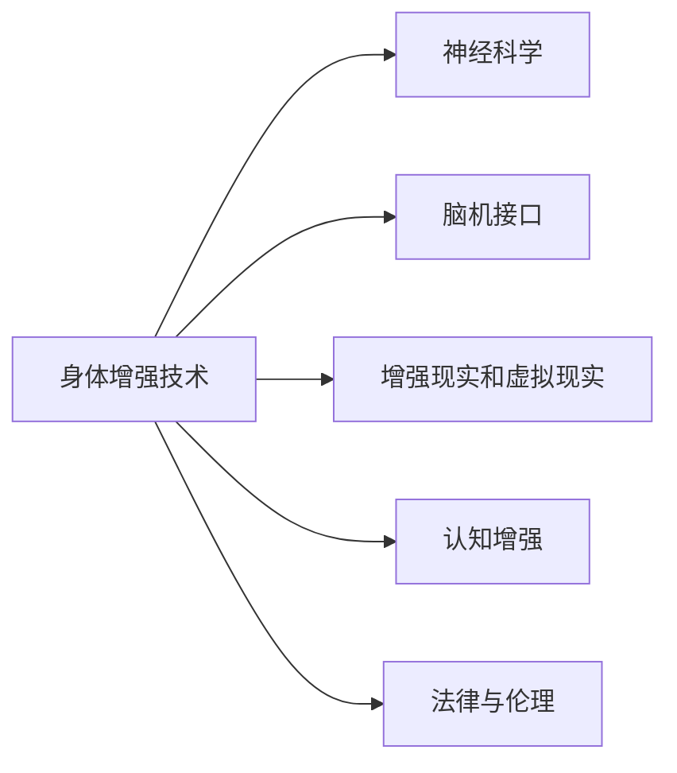

                 

## 1. 背景介绍

### 1.1 问题由来
随着人工智能(AI)技术的迅猛发展，AI时代的到来已是大势所趋。AI不仅在算法和计算能力上取得了显著突破，还正在深刻改变人类社会生活的方方面面。其中，身体增强技术作为AI时代的重要组成部分，正逐步引领人体性能和能力的提升，引发了广泛的关注和讨论。

身体增强，或称增强型智能体(Enhanced Intelligent Agents, EIA)，是指通过人工智能技术对人体进行的一系列改造，包括大脑、身体、感官等，以提升人类的认知能力、运动能力、感知能力等。其目标是通过技术手段优化人类自身，提升其适应环境的能力，甚至打破自然进化的限制。

### 1.2 问题核心关键点
身体增强技术涉及的领域广泛，涵盖神经科学、生物医学工程、材料科学、AI算法等多个学科，其发展与应用涉及伦理、法律、隐私保护等多重考量。如何在技术进步的同时，平衡人类的伦理需求、法律规制和社会价值观，是当前和未来需重点关注的问题。

核心问题包括：
- 如何确保增强技术的安全性和可靠性？
- 如何在技术普及中保护用户的隐私与伦理？
- 如何制定合理的法律法规来规范身体增强技术的应用？
- 如何促进身体增强技术的公平性与普惠性？
- 如何平衡科技与人类伦理、道德的边界？

### 1.3 问题研究意义
研究身体增强技术，对于推动AI技术在医疗、运动、娱乐等领域的创新应用，提升人类生活质量，具有重要意义：

1. **医疗领域**：通过脑机接口(Brain-Machine Interface, BMI)、神经调控等技术，增强病患的恢复能力和生活质量，促进神经退行性疾病、帕金森病等疾病的治疗。
2. **运动领域**：通过植入芯片、肌肉增强等技术，提高运动员的训练效率和比赛表现，优化人类体态和体能。
3. **娱乐领域**：通过虚拟现实(VR)、增强现实(AR)、脑增强等技术，提升游戏体验和娱乐体验，丰富人类的精神生活。
4. **职场与生产**：通过提升人类的智力、体力和感知能力，优化工作流程，提高生产效率，适应复杂的现代工作环境。
5. **教育与学习**：通过脑神经科学、认知神经调控技术，提升人类的学习能力和知识获取效率，改善教育效果。

## 2. 核心概念与联系

### 2.1 核心概念概述

在研究身体增强技术时，有几个核心概念需要明确：

- **身体增强技术(Enhanced Technology)**：通过AI技术对人体进行改造，提升人类的身体性能和认知能力。
- **神经科学(Neuroscience)**：研究神经系统和神经元的行为、结构、功能等。
- **脑机接口(Brain-Machine Interface, BMI)**：通过技术手段实现大脑与计算机或外部设备的直接交互。
- **增强现实(AR)和虚拟现实(VR)**：通过视觉、听觉、触觉等感官增强，模拟沉浸式体验。
- **认知增强(Cognitive Enhancement)**：通过AI技术提升人类的学习、记忆、决策等认知能力。
- **法律与伦理(Legal and Ethical Consideration)**：在增强技术应用中，需考虑相关法律、伦理和社会价值观的限制和影响。

这些核心概念间的逻辑关系可以用以下Mermaid流程图表示：



该流程图展示了身体增强技术与其相关领域间的关系：

1. 身体增强技术的实现需基于神经科学的研究成果。
2. BMI、AR/VR等技术为身体增强提供了具体的实现手段。
3. 认知增强增强了人类的认知能力，与身体增强技术紧密相连。
4. 法律与伦理问题对技术的应用和普及具有重要影响。

## 3. 核心算法原理 & 具体操作步骤

### 3.1 算法原理概述

身体增强技术主要分为两类：生物学增强和非生物学增强。生物学增强通过生物医学技术改造人体；非生物学增强则通过电子设备、算法等技术手段，提升人类性能。

本文重点讨论非生物学增强中，AI技术在身体增强中的应用。通过以下几个关键步骤：

1. **数据收集与处理**：收集人类生理数据、行为数据和环境数据，提取特征。
2. **模型训练与优化**：使用AI算法训练增强模型，优化性能。
3. **增强应用**：将模型应用于人体，提升相应性能。
4. **反馈与调整**：通过反馈机制，不断优化和调整模型。

### 3.2 算法步骤详解

1. **数据收集与预处理**：
   - 收集生理数据（如脑电信号、肌电信号、心率、血压等）。
   - 收集行为数据（如动作、表情、语音等）。
   - 收集环境数据（如气温、光线等）。
   - 数据预处理，包括清洗、去噪、归一化等。

2. **模型训练与优化**：
   - 选择合适的AI模型（如深度学习、强化学习、神经网络等）。
   - 使用监督学习、无监督学习或半监督学习方法进行训练。
   - 引入正则化、损失函数优化等技术，提升模型性能。
   - 进行模型调参，选择最优模型。

3. **增强应用**：
   - 将训练好的模型应用于人体增强设备中。
   - 在脑增强、肌肉增强、视力增强等方面进行应用。
   - 实现增强效果，提升人类的认知、运动和感知能力。

4. **反馈与调整**：
   - 收集用户反馈，评估增强效果。
   - 根据反馈调整模型参数和增强设备。
   - 不断迭代，提升增强效果。

### 3.3 算法优缺点

**优点**：
- **高性能**：AI算法在数据处理和模式识别上的优势，使其在增强技术中能够实现高性能应用。
- **智能化**：通过不断学习，AI模型可以适应复杂多变的环境，实现动态增强。
- **泛化性强**：在大量数据上训练的模型，具有较好的泛化能力，适用于多种场景。

**缺点**：
- **复杂度高**：AI增强模型的设计和训练过程复杂，对技术要求高。
- **成本高**：增强技术的开发和应用成本较高，普通用户难以负担。
- **隐私和安全问题**：收集和处理人体数据涉及隐私和安全问题，需严格遵守相关法律法规。
- **伦理争议**：增强技术的伦理问题复杂，需进行深入讨论。

### 3.4 算法应用领域

身体增强技术在多个领域得到广泛应用：

1. **医疗健康**：
   - 通过BMI技术，帮助病患进行康复训练，改善生活质量。
   - 通过神经调控技术，治疗神经系统疾病。
   - 通过认知增强技术，提高手术准确性和手术效率。

2. **运动领域**：
   - 通过肌肉增强芯片，提高运动员训练效果和比赛表现。
   - 通过视觉增强技术，提升运动员的视力和反应速度。

3. **娱乐教育**：
   - 通过VR/AR技术，创造沉浸式游戏体验和教育内容。
   - 通过认知增强技术，提升学习效率和记忆力。

4. **职场生产**：
   - 通过增强认知，提高工作效率和决策能力。
   - 通过增强体力，优化工作流程和劳动强度。

## 4. 数学模型和公式 & 详细讲解

### 4.1 数学模型构建

为更好地理解AI在身体增强中的应用，我们将基于数学模型对其进行详细阐述。

**生理信号处理模型**：
- 设 $x(t)$ 为人体生理信号（如脑电信号、肌电信号），其中 $t$ 为时间。
- 设 $y(t)$ 为增强系统的输出信号， $g(x(t))$ 为模型映射函数。

**认知增强模型**：
- 设 $z(t)$ 为人类认知能力（如学习记忆、决策能力）， $h(x(t), y(t))$ 为认知增强模型。

**行为增强模型**：
- 设 $w(t)$ 为人类行为（如动作、表情、语音等）， $f(x(t), z(t))$ 为行为增强模型。

**增强效果评估模型**：
- 设 $e(t)$ 为增强效果， $p(w(t))$ 为效果评估模型。

### 4.2 公式推导过程

**生理信号处理公式**：
- 设 $x(t)$ 为原始信号， $f(x(t))$ 为滤波器， $g(x(t))$ 为增强系统输出。
- 滤波器形式为 $f(x(t)) = \sum_i a_i x(t-i)$，其中 $a_i$ 为滤波器系数。
- 增强系统输出为 $g(x(t)) = h(x(t))$。

**认知增强公式**：
- 设 $z(t)$ 为认知能力， $h(x(t), y(t)) = x(t) * y(t)$，表示认知能力与生理信号的乘积。

**行为增强公式**：
- 设 $w(t)$ 为行为输出， $f(x(t), z(t)) = x(t) + z(t)$，表示行为输出由生理信号和认知能力共同决定。

**增强效果评估公式**：
- 设 $e(t)$ 为增强效果， $p(w(t)) = \sum_i \omega_i w(t-i)$，其中 $\omega_i$ 为权重系数， $i$ 为时间序列。

### 4.3 案例分析与讲解

**认知增强案例分析**：
- 实例：阿尔茨海默病（AD）患者认知功能退化，通过认知增强技术改善记忆能力。
- 模型：使用神经网络对患者脑电信号进行分析，学习记忆相关特征。
- 应用：将分析结果转化为刺激信号，通过植入设备传递给大脑，增强记忆力。
- 效果：通过长期训练，患者记忆能力得到显著提升。

**视觉增强案例分析**：
- 实例：视力损伤患者通过视觉增强技术恢复视力。
- 模型：收集患者视网膜信号，使用深度学习算法学习视觉特征。
- 应用：将学习结果应用于光遗传学技术，刺激视网膜细胞，恢复视力。
- 效果：患者视力明显提升，生活质量得到改善。

## 5. 项目实践：代码实例和详细解释说明

### 5.1 开发环境搭建

要开展身体增强技术的研究，需搭建一个合适的开发环境。以下是一个基本框架：

1. **硬件设备**：
   - 高性能计算机：用于数据处理和模型训练。
   - 神经调控设备：如脑电采集设备、肌肉增强芯片。
   - 可视化设备：如头显、虚拟现实设备。

2. **软件环境**：
   - 操作系统：如Linux、Windows。
   - 编程语言：如Python、C++。
   - 数据处理工具：如Matplotlib、Scikit-learn。
   - AI框架：如TensorFlow、PyTorch。

3. **开发工具**：
   - 版本控制：如Git。
   - 文档工具：如Markdown。
   - 协作工具：如Jupyter Notebook。

### 5.2 源代码详细实现

以下是一个简单的代码示例，演示如何使用TensorFlow实现一个基本的认知增强模型。

```python
import tensorflow as tf

# 定义认知增强模型
class CognitiveEnhancement(tf.keras.Model):
    def __init__(self):
        super(CognitiveEnhancement, self).__init__()
        self.dense1 = tf.keras.layers.Dense(64, activation='relu')
        self.dense2 = tf.keras.layers.Dense(1, activation='sigmoid')

    def call(self, inputs):
        x = self.dense1(inputs)
        x = self.dense2(x)
        return x

# 准备数据
inputs = tf.random.normal([100, 10])
labels = tf.random.normal([100, 1])

# 构建模型
model = CognitiveEnhancement()

# 编译模型
model.compile(optimizer=tf.keras.optimizers.Adam(0.01), loss='binary_crossentropy', metrics=['accuracy'])

# 训练模型
model.fit(inputs, labels, epochs=10)
```

### 5.3 代码解读与分析

**代码解读**：
- 定义了一个简单的神经网络模型，包含两个密集层。
- 使用TensorFlow的高级API构建和训练模型。
- 准备了一个简单的数据集，并使用模型进行训练。

**代码分析**：
- TensorFlow提供了一站式的机器学习解决方案，使用方便，适合快速迭代。
- 神经网络模型的构建通过Keras API完成，简化了模型的搭建过程。
- 通过调用compile()和fit()方法，即可完成模型的训练。

## 6. 实际应用场景

### 6.1 医疗健康

**脑机接口在康复中的应用**：
- 实例：中风患者通过BMI技术进行康复训练。
- 模型：收集患者脑电信号，通过深度学习模型识别运动意图。
- 应用：将识别结果转化为控制信号，驱动机械臂或轮椅，辅助患者训练。
- 效果：显著提升患者运动恢复速度，改善生活质量。

**神经调控在治疗中的应用**：
- 实例：抑郁症患者通过神经调控技术改善情绪。
- 模型：收集患者脑电信号，使用强化学习算法学习情绪调节模式。
- 应用：将学习结果应用于脑刺激设备，调节患者情绪。
- 效果：抑郁症状得到缓解，患者生活质量提升。

### 6.2 运动领域

**肌肉增强芯片在运动员中的应用**：
- 实例：田径运动员通过肌肉增强芯片提升爆发力。
- 模型：收集运动员肌肉信号，使用深度学习模型分析爆发力特征。
- 应用：将分析结果应用于芯片，实时调节肌肉强度。
- 效果：运动员爆发力显著提升，比赛成绩提高。

**视觉增强技术在运动员中的应用**：
- 实例：高尔夫球手通过视觉增强技术提高击球精准度。
- 模型：收集运动员视觉信号，使用计算机视觉算法学习击球姿势。
- 应用：将学习结果应用于眼镜设备，实时反馈击球信息。
- 效果：击球精准度提高，比赛成绩提升。

### 6.3 娱乐教育

**虚拟现实在娱乐中的应用**：
- 实例：游戏玩家通过VR设备沉浸式体验游戏。
- 模型：收集玩家动作和表情数据，使用深度学习算法生成沉浸式场景。
- 应用：将生成的场景应用到VR设备中，增强游戏体验。
- 效果：玩家沉浸感增强，游戏体验提升。

**增强现实在教育中的应用**：
- 实例：学生通过AR设备学习历史场景。
- 模型：收集学生行为数据，使用计算机视觉算法识别场景变化。
- 应用：将识别结果应用到AR设备中，生成历史场景。
- 效果：学生学习兴趣提升，理解能力增强。

### 6.4 未来应用展望

未来，身体增强技术将迎来更多突破和发展：

1. **全脑增强**：通过脑神经调控技术，实现全脑增强，提升人类整体认知能力。
2. **多感官融合**：将视觉、听觉、触觉等多感官增强技术相结合，提升人类的感知能力。
3. **个性化增强**：根据个体差异，实现个性化增强，提升用户体验。
4. **实时增强**：实现实时增强，提升用户体验和反应速度。
5. **跨界应用**：结合AI、AR/VR、脑科学等领域，拓展应用场景。

## 7. 工具和资源推荐

### 7.1 学习资源推荐

1. **《深度学习入门：基于TensorFlow的理论与实现》**：该书深入浅出地介绍了深度学习理论、算法和实现方法，适合初学者入门。
2. **《神经科学与人工智能的交互》**：该书探讨了神经科学和AI的结合，为身体增强技术提供了理论基础。
3. **《人类增强：科技与伦理的挑战》**：该书探讨了身体增强技术的伦理问题，为未来的研究提供了思考。
4. **《增强型智能体：AI时代的人类新形态》**：该书介绍了身体增强技术的发展历史和未来趋势。
5. **《未来大脑：如何通过AI实现认知增强》**：该书探讨了认知增强技术的最新进展和未来应用。

### 7.2 开发工具推荐

1. **TensorFlow**：Google开发的深度学习框架，功能丰富，适合大规模深度学习任务。
2. **PyTorch**：Facebook开发的深度学习框架，灵活易用，适合学术研究和实验。
3. **Caffe**：由伯克利开发的深度学习框架，优化良好，适合计算机视觉任务。
4. **Keras**：基于TensorFlow的高级API，简化深度学习模型的搭建和训练。
5. **OpenAI Gym**：Python环境下的模拟环境，支持多种AI算法的测试和实验。

### 7.3 相关论文推荐

1. **《增强型智能体：从认知增强到身体增强》**：探讨了认知增强和身体增强技术的结合，为身体增强技术提供了理论支持。
2. **《脑机接口的最新进展》**：介绍了脑机接口技术的研究现状和未来方向。
3. **《神经调控在神经退行性疾病中的应用》**：介绍了神经调控技术在神经退行性疾病治疗中的应用。
4. **《多感官融合技术在增强现实中的应用》**：探讨了多感官融合技术的发展和应用前景。
5. **《增强认知的伦理考量》**：探讨了认知增强技术的伦理问题，为技术应用提供了思考。

## 8. 总结：未来发展趋势与挑战

### 8.1 研究成果总结

本文详细介绍了身体增强技术在AI时代的未来发展趋势和挑战。通过分析不同领域的应用案例和未来前景，探讨了身体增强技术的理论基础和实现方法。在理论和实践上，身体增强技术为AI技术在医疗、运动、娱乐等领域的创新应用提供了新的思路和方向。

### 8.2 未来发展趋势

未来，身体增强技术将持续向智能化、多样化、个性化方向发展。结合AI技术，实现全脑增强、多感官融合等突破，将进一步提升人类的感知和认知能力。

1. **全脑增强**：通过全脑调控技术，实现整体认知能力的提升。
2. **多感官融合**：结合视觉、听觉、触觉等，提升感知能力。
3. **个性化增强**：根据个体差异，实现个性化增强，提升用户体验。
4. **实时增强**：实现实时增强，提升用户体验和反应速度。
5. **跨界应用**：结合AI、AR/VR、脑科学等领域，拓展应用场景。

### 8.3 面临的挑战

尽管身体增强技术在多个领域取得显著进展，但仍面临诸多挑战：

1. **安全性与可靠性**：增强技术的安全性和可靠性需进一步提高，避免技术风险。
2. **隐私保护**：增强技术涉及大量人体数据，隐私保护问题需严格把控。
3. **伦理争议**：增强技术的伦理问题复杂，需深入讨论。
4. **法律法规**：需制定相应的法律法规，规范技术应用。
5. **成本问题**：技术开发和应用成本较高，需探索成本降低途径。

### 8.4 研究展望

未来，需从技术、伦理、法律法规等多个维度进行深入研究：

1. **技术创新**：推动技术创新，实现更高性能的增强效果。
2. **伦理研究**：探讨技术伦理问题，建立伦理指导原则。
3. **法律法规**：制定相应的法律法规，规范技术应用。
4. **跨学科合作**：推动跨学科合作，实现技术突破。

## 9. 附录：常见问题与解答

**Q1：身体增强技术有哪些应用场景？**

A: 身体增强技术在医疗、运动、娱乐、教育、职场等多个领域都有广泛应用。例如，在医疗领域，通过脑机接口技术帮助病患进行康复训练；在运动领域，通过肌肉增强芯片提升运动员的训练效果；在娱乐领域，通过虚拟现实技术增强游戏体验；在教育领域，通过增强现实技术提升学习效果。

**Q2：如何确保增强技术的安全性和可靠性？**

A: 增强技术的安全性和可靠性需从多方面进行保障：
1. 数据安全：严格控制数据收集和使用，确保数据隐私和安全。
2. 模型验证：通过大规模实验验证模型的可靠性和鲁棒性。
3. 实时监控：实时监控增强设备的使用情况，及时发现问题。
4. 用户反馈：通过用户反馈不断优化模型和设备。

**Q3：如何平衡增强技术与伦理道德的边界？**

A: 增强技术与伦理道德的平衡需通过以下途径实现：
1. 伦理考量：在技术设计和应用过程中，始终遵循伦理原则。
2. 法规制定：通过制定相关法律法规，规范增强技术的应用。
3. 社会讨论：通过社会各界讨论，形成共识。

**Q4：未来增强技术的发展方向是什么？**

A: 未来增强技术的发展方向主要集中在以下几个方面：
1. 全脑增强：通过脑神经调控技术，实现整体认知能力的提升。
2. 多感官融合：结合视觉、听觉、触觉等，提升感知能力。
3. 个性化增强：根据个体差异，实现个性化增强，提升用户体验。
4. 实时增强：实现实时增强，提升用户体验和反应速度。
5. 跨界应用：结合AI、AR/VR、脑科学等领域，拓展应用场景。

作者：禅与计算机程序设计艺术 / Zen and the Art of Computer Programming

