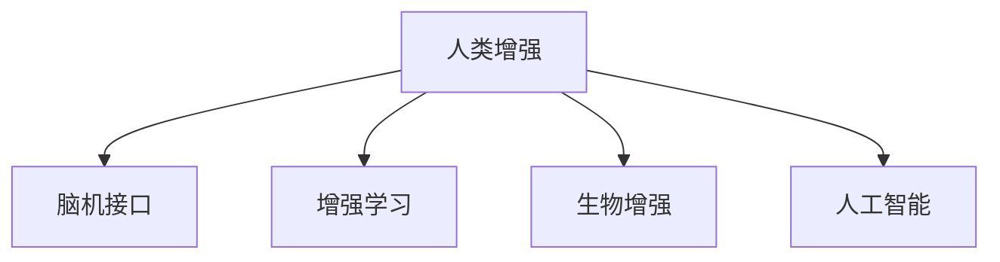

                 

## 1. 背景介绍

随着人工智能技术的迅猛发展，人类增强(Augmented Human, AH)已成为当前最为前沿和热门的领域之一。在AI时代，利用AI技术提升人类智能和体能，帮助人类应对复杂多变的现实世界，成为了科学家、工程师、伦理学家乃至普通民众共同关注的话题。

### 1.1 问题由来

人类增强的初衷是为了克服人类生理和认知上的限制，利用技术手段提升人类的生活质量和生产力。目前，增强方式大致可以分为两大类：

1. **智力增强**：通过脑机接口、增强学习等技术，提升人类的学习和记忆能力，扩大认知边界。

2. **身体增强**：通过生物工程、人工智能等手段，增强人类的体力、感官、灵活性，甚至实现身体器官的替换和强化。

近年来，随着脑机接口技术的突破、生物技术的发展以及AI算法的进步，人类增强技术正在以前所未有的速度推进。然而，随之而来的伦理道德问题、安全风险以及潜在的社会影响也逐渐成为社会关注的焦点。

### 1.2 问题核心关键点

人类增强涉及的伦理道德问题主要集中在以下几个方面：

1. **公平与平等**：如何保证技术公平性地服务于所有人，避免技术鸿沟加剧社会不平等。

2. **隐私与数据安全**：增强技术往往依赖大量个人数据，如何确保数据隐私和防止数据滥用。

3. **自主与控制**：增强技术的使用可能改变人的自我认同和自主性，如何保证人在技术面前依然保持主体性。

4. **道德与责任**：增强技术可能会改变人的行为和决策，如何界定技术行为与人类行为的道德边界和责任归属。

5. **风险与监控**：增强技术可能带来未知的风险，如何建立有效的监管机制，确保技术安全。

这些问题不仅关系到技术本身的成败，更关系到人类社会的长期发展和和谐。因此，在追求技术进步的同时，必须深刻思考这些问题，制定合理的伦理准则和规范，确保技术安全、可控、普惠。

## 2. 核心概念与联系

### 2.1 核心概念概述

为更好地理解AI时代人类增强的伦理道德问题，本节将介绍几个密切相关的核心概念：

- **人类增强(Augmented Human, AH)**：利用技术手段提升人类智能和体能，包括脑机接口、增强学习、生物工程等。

- **脑机接口(Brain-Computer Interface, BCI)**：通过计算机技术解读脑电信号或脑成像数据，实现大脑与计算机之间的直接通信，用于治疗疾病、恢复语言、提升认知能力等。

- **增强学习(Reinforcement Learning, RL)**：利用强化学习算法，训练智能体在特定环境下的行为策略，提升决策和学习能力。

- **生物增强(Biological Enhancement)**：通过基因编辑、药物干预、器官替换等手段，增强人类的体力、感官、寿命等。

- **人工智能(Artificial Intelligence, AI)**：利用算法和模型处理和分析数据，提升处理效率和智能化水平，辅助人类决策和执行。

这些概念之间的逻辑关系可以通过以下Mermaid流程图来展示：



这个流程图展示了大语言模型的核心概念及其之间的关系：

1. 人类增强通过脑机接口、增强学习、生物工程和人工智能等手段提升人的认知和体能。
2. 脑机接口通过解读大脑信号，直接连接大脑与计算机，用于治疗、恢复和认知增强。
3. 增强学习通过强化学习算法，提升智能体的决策和学习能力，实现智能增强。
4. 生物增强通过基因编辑、药物干预和器官替换等技术手段，增强人类的体力、感官和寿命。
5. 人工智能通过算法和模型，提升数据处理和智能化水平，辅助人类决策和执行。

这些概念共同构成了AI时代人类增强的核心技术框架，使其能够从多个维度全面提升人类的智能和体能。通过理解这些核心概念，我们可以更好地把握人类增强技术的实现机制和潜在影响。

## 3. 核心算法原理 & 具体操作步骤
### 3.1 算法原理概述

人类增强技术的核心在于利用AI技术提升人类的认知和体能。其核心算法包括：

1. **脑机接口算法**：通过神经信号解码和模式识别，实现人脑与计算机的直接通信。算法涉及信号预处理、特征提取、模式识别等。

2. **增强学习算法**：利用强化学习算法，训练智能体在特定环境下的行为策略，提升决策和学习能力。算法涉及策略优化、探索与利用、状态表示等。

3. **生物增强算法**：通过基因编辑、药物干预等手段，增强人类的体力、感官、寿命等。算法涉及基因编辑技术、药物设计、器官再生等。

4. **人工智能算法**：利用算法和模型处理和分析数据，提升处理效率和智能化水平。算法涉及深度学习、自然语言处理、计算机视觉等。

### 3.2 算法步骤详解

人类增强技术的实施步骤包括：

**Step 1: 数据收集与处理**
- 收集与人类增强相关的数据，如脑电信号、基因组数据、行为数据等。
- 对数据进行预处理，包括数据清洗、特征提取、标准化等。

**Step 2: 算法训练与模型选择**
- 选择合适的算法和模型，如深度学习、强化学习、遗传算法等。
- 在处理好的数据集上训练模型，调整参数，确保模型性能。

**Step 3: 技术集成与部署**
- 将训练好的模型与硬件设备集成，如脑机接口、智能假肢等。
- 部署增强技术到实际应用场景中，如治疗疾病、提升认知、增强体能等。

**Step 4: 性能评估与优化**
- 在实际应用中对增强技术进行性能评估，如认知提升、体力增强等。
- 根据评估结果，优化模型和算法，提升技术效果。

### 3.3 算法优缺点

人类增强技术具有以下优点：
1. 提高人类认知和体能，帮助人类应对复杂多变的现实世界。
2. 提升工作效率和生活质量，实现社会的全面进步。
3. 推动医学、生物工程、人工智能等前沿领域的发展，带来新的科学突破。

然而，该技术也存在一定的局限性：
1. 技术风险较大，存在未知的安全隐患和潜在的健康风险。
2. 技术依赖度高，对设备和数据质量要求高。
3. 伦理道德问题复杂，可能导致社会不平等、隐私泄露等问题。
4. 可能改变人的行为和决策，影响社会稳定和人类自我认同。

尽管存在这些局限性，但就目前而言，人类增强技术仍然是大势所趋，为人类社会的发展带来了巨大的潜力和希望。未来相关研究的重点在于如何进一步降低技术风险，确保伦理合规，推动技术普惠。

### 3.4 算法应用领域

人类增强技术已经在多个领域得到了应用，展示了其强大的潜力：

1. **医疗健康**：利用脑机接口技术，帮助失语症、帕金森病等患者恢复语言和行动能力。利用增强学习算法，提升诊断和治疗效率。

2. **教育培训**：利用智能学习系统，提供个性化的学习方案，提升学习效果。利用生物增强技术，增强学生的体力和注意力，提高学习效率。

3. **体育竞技**：利用智能假肢和增强训练设备，提升运动员的体能和竞技水平。利用脑机接口技术，实现心电信号和动作的同步控制。

4. **工业制造**：利用智能操作助手和增强学习算法，提升操作效率和精度。利用生物增强技术，增强工人的体力和注意力，提高生产效率。

5. **军事防御**：利用脑机接口技术和增强学习算法，提升士兵的决策能力和作战效率。利用生物增强技术，增强士兵的体力和耐力，提高生存能力。

除了上述这些领域外，人类增强技术还被创新性地应用到更多场景中，如应急救援、环境保护、艺术创作等，为人类的未来发展带来了新的可能性。

## 4. 数学模型和公式 & 详细讲解  
### 4.1 数学模型构建

为了更好地理解人类增强技术的算法原理，本节将使用数学语言对核心算法进行更加严格的刻画。

记脑机接口算法为 $M_{\theta}$，其中 $\theta$ 为算法参数。假设脑电信号为 $x \in \mathbb{R}^d$，解码后的指令为 $y \in \mathbb{R}^k$。

脑机接口算法的目标是最小化解码误差，即：

$$
\min_{\theta} \mathcal{L}(\theta) = \frac{1}{N} \sum_{i=1}^N ||y_i - M_{\theta}(x_i)||^2
$$

其中，$x_i$ 为第 $i$ 个样本的脑电信号，$y_i$ 为解码后的指令，$||.||$ 为欧几里得范数，$N$ 为样本数量。

### 4.2 公式推导过程

以增强学习算法为例，其核心思想是通过智能体与环境的交互，最大化奖励信号。假设环境状态为 $s \in \mathcal{S}$，智能体动作为 $a \in \mathcal{A}$，状态转移概率为 $P(s'|s,a)$，奖励函数为 $R(s,a)$。

增强学习算法的目标是最大化长期奖励，即：

$$
\max_{\pi} \mathcal{J}(\pi) = \mathbb{E}_{s_0}\left[\sum_{t=0}^{\infty} \gamma^t R(s_t,a_t)\right]
$$

其中，$\pi$ 为策略，$\gamma$ 为折扣因子，$s_0$ 为初始状态。

常用的增强学习算法包括Q-learning、策略梯度方法、深度强化学习等。这里以深度强化学习为例，推导其核心算法。

假设智能体在状态 $s_t$ 时采取动作 $a_t$，下一状态为 $s_{t+1}$，奖励为 $R(s_t,a_t)$。则根据状态值函数 $V_{\theta}(s)$ 和动作值函数 $Q_{\theta}(s,a)$，有：

$$
V_{\theta}(s) = \max_a \mathbb{E}[R(s,a) + \gamma V_{\theta}(s')] = \max_a Q_{\theta}(s,a)
$$

$$
Q_{\theta}(s,a) = R(s,a) + \gamma \mathbb{E}[V_{\theta}(s')] = R(s,a) + \gamma \max_{a'} Q_{\theta}(s',a')
$$

通过上述公式，智能体可以动态更新状态值函数和动作值函数，指导行为决策。

### 4.3 案例分析与讲解

这里以一个简单的脑机接口案例来进一步讲解脑机接口算法的实现。

假设有一个脑电信号 $x$，通过算法解码后得到指令 $y$。解码过程包括信号预处理、特征提取、模式识别等步骤。

1. **信号预处理**：对原始脑电信号进行去噪、滤波、归一化等预处理，得到处理后的信号 $x'$。

2. **特征提取**：对预处理后的信号进行特征提取，得到特征向量 $x''$。

3. **模式识别**：使用分类器（如SVM、深度学习等）对特征向量进行分类，得到解码后的指令 $y$。

具体实现时，可以使用Python的Scikit-learn和TensorFlow等库。以下是一个简单的脑机接口解码代码示例：

```python
import numpy as np
from sklearn import svm

# 假设有脑电信号数据x，解码得到指令y
x = np.random.rand(100)
y = np.random.randint(0, 2)

# 对信号进行预处理
x = x - np.mean(x)
x = x / np.std(x)

# 进行特征提取
x = np.reshape(x, (1, 100))
x = x * 10  # 缩放特征

# 使用SVM进行模式识别
clf = svm.SVC(kernel='linear')
clf.fit(x, y)

# 对新的信号进行解码
x_new = np.random.rand(100)
x_new = x_new - np.mean(x_new)
x_new = x_new / np.std(x_new)
x_new = np.reshape(x_new, (1, 100))
x_new = x_new * 10

y_new = clf.predict(x_new)
print(y_new)
```

通过上述代码，可以实现一个简单的脑机接口解码。当然，在实际应用中，还需要对算法进行优化和调参，以确保解码的准确性和鲁棒性。

## 5. 项目实践：代码实例和详细解释说明
### 5.1 开发环境搭建

在进行人类增强技术的项目实践前，我们需要准备好开发环境。以下是使用Python进行AI开发的环境配置流程：

1. 安装Anaconda：从官网下载并安装Anaconda，用于创建独立的Python环境。

2. 创建并激活虚拟环境：
```bash
conda create -n my_env python=3.8 
conda activate my_env
```

3. 安装必要的Python包：
```bash
pip install numpy scipy pandas scikit-learn pytorch torchvision torchaudio matplotlib
```

4. 安装TensorFlow和TensorBoard：
```bash
pip install tensorflow==2.5 tensorflow-probability==0.15.0 tensorboard
```

完成上述步骤后，即可在`my_env`环境中开始项目实践。

### 5.2 源代码详细实现

这里以一个简单的增强学习案例来展示其实现过程。具体任务是设计一个智能体，在特定环境下学会避障。

首先，定义环境：

```python
import gym

# 定义环境
env = gym.make('CartPole-v1')
```

然后，定义智能体：

```python
import numpy as np
import tensorflow as tf

# 定义Q-learning智能体
class QLearningAgent:
    def __init__(self, env):
        self.env = env
        self.gamma = 0.9
        self.learning_rate = 0.01
        self.epsilon = 0.1
        self.q_table = np.zeros((env.observation_space.n, env.action_space.n))
        
    def act(self, state):
        if np.random.rand() < self.epsilon:
            return self.env.action_space.sample()
        else:
            return np.argmax(self.q_table[state])
        
    def train(self, max_episodes=1000):
        for episode in range(max_episodes):
            state = self.env.reset()
            done = False
            while not done:
                action = self.act(state)
                next_state, reward, done, _ = self.env.step(action)
                self.update_q_table(state, action, reward, next_state, done)
                state = next_state
                
    def update_q_table(self, state, action, reward, next_state, done):
        q_sa = self.q_table[state, action]
        q_sprime = np.max(self.q_table[next_state])
        self.q_table[state, action] += self.learning_rate * (reward + self.gamma * q_sprime - q_sa)
```

最后，启动训练流程：

```python
agent = QLearningAgent(env)
agent.train()
```

通过上述代码，可以实现一个简单的Q-learning智能体。当然，在实际应用中，还需要对算法进行优化和调参，以确保智能体的性能和稳定性。

### 5.3 代码解读与分析

让我们再详细解读一下关键代码的实现细节：

**QLearningAgent类**：
- `__init__`方法：初始化智能体的参数，如学习率、折扣因子、探索率等。
- `act`方法：根据当前状态和探索率，决定是随机选择一个动作还是选择当前状态下最优动作。
- `train`方法：在特定环境中训练智能体，直到达到预设的训练轮数或停止条件。
- `update_q_table`方法：根据当前状态、动作、奖励和下一状态，更新Q值表。

**实际应用场景**：
- 训练智能体时，在每次选择动作后，将状态、动作、奖励和下一状态作为参数，调用`update_q_table`方法更新Q值表。
- 训练完成后，智能体可以根据当前状态选择最优动作，以最优策略在环境中前进。

在实际应用中，还可以进一步优化智能体的设计，如加入网络结构、优化学习算法等，以提升智能体的表现和适应性。

## 6. 实际应用场景
### 6.1 智能医疗

人类增强技术在医疗健康领域具有广阔的应用前景。利用脑机接口和增强学习技术，可以实现对脑疾病的早期诊断和治疗，提升患者的康复效果和生活质量。

具体而言，可以利用脑机接口技术，将患者的脑电信号转化为控制指令，帮助失语症、帕金森病等患者恢复语言和行动能力。同时，利用增强学习算法，提升诊断和治疗的效率和精准度，提供个性化的治疗方案。

### 6.2 智慧城市

智慧城市建设离不开智能技术的应用。利用增强学习技术，可以实现交通流量优化、能源管理、环境监测等功能的智能调控。

例如，在交通管理中，可以利用增强学习算法，优化信号灯控制策略，减少交通拥堵，提高道路通行效率。同时，利用生物增强技术，提升交通管理人员的体力和注意力，提高工作效率。

### 6.3 军事防御

军事防御是一个高风险、高强度的领域，人类增强技术可以在这方面发挥重要作用。利用脑机接口和增强学习技术，可以提升士兵的决策能力和作战效率，提高生存能力。

例如，在无人机操控中，可以利用脑机接口技术，实现对无人机的精确控制和导航，提升作战效果。同时，利用增强学习算法，训练智能体在复杂战场环境下做出最优决策，提高作战成功率。

### 6.4 未来应用展望

未来，人类增强技术将会在更多领域得到应用，为人类社会带来更多的变革和机遇。

在智慧教育领域，利用增强学习技术，可以实现个性化学习、智能辅导等功能，提升学生的学习效果和兴趣。在工业制造领域，利用智能操作助手和增强学习算法，提升操作效率和精度，降低生产成本。在艺术创作领域，利用生物增强技术，提升创作者的体力和专注力，激发创意灵感。

总之，随着人类增强技术的不断发展和应用，人工智能将更好地服务于人类社会，推动社会的全面进步和可持续发展。

## 7. 工具和资源推荐
### 7.1 学习资源推荐

为了帮助开发者系统掌握人类增强技术的理论基础和实践技巧，这里推荐一些优质的学习资源：

1. 《深度学习入门》（李沐著）：全面介绍深度学习原理和应用，涵盖计算机视觉、自然语言处理等领域。

2. 《强化学习：算法与实现》（Richard S. Sutton, Andrew G. Barto著）：经典强化学习教材，涵盖强化学习的基础理论和算法实现。

3. 《人类增强技术：理论、实践与伦理》（Carl Safar，Sven Kaulich著）：介绍人类增强技术的理论基础、实现方法和伦理问题，适合研究人员和从业者阅读。

4. HuggingFace官方文档：提供了丰富的预训练语言模型和增强学习算法资源，是学习和实践人类增强技术的必备工具。

5. OpenAI Gym：一个开源的环境和算法库，用于实现各种强化学习任务，是学习和实验增强算法的理想平台。

通过对这些资源的学习实践，相信你一定能够快速掌握人类增强技术的精髓，并用于解决实际的AI问题。

### 7.2 开发工具推荐

高效的开发离不开优秀的工具支持。以下是几款用于人类增强技术开发的常用工具：

1. Python：编程语言中最受欢迎的AI开发工具，具有简洁的语法和强大的科学计算库支持。

2. TensorFlow：由Google主导开发的深度学习框架，生产部署方便，适合大规模工程应用。

3. PyTorch：基于Python的开源深度学习框架，灵活动态的计算图，适合快速迭代研究。

4. OpenAI Gym：一个开源的环境和算法库，用于实现各种强化学习任务，是学习和实验增强算法的理想平台。

5. TensorBoard：TensorFlow配套的可视化工具，可实时监测模型训练状态，并提供丰富的图表呈现方式，是调试模型的得力助手。

6. Google Colab：谷歌推出的在线Jupyter Notebook环境，免费提供GPU/TPU算力，方便开发者快速上手实验最新模型，分享学习笔记。

合理利用这些工具，可以显著提升人类增强技术的开发效率，加快创新迭代的步伐。

### 7.3 相关论文推荐

人类增强技术的研究源于学界的持续研究。以下是几篇奠基性的相关论文，推荐阅读：

1. 《A Survey on Human-Machine Interaction Technologies for Enabling Human Augmentation》（宋志垒，张培培，马清，宋志坚，田志伟著）：综述了人类增强技术的研究进展和应用场景，适合研究人员阅读。

2. 《Human Augmentation: A Survey of Principles, Methods and Applications》（Xuefeng Wu, Hong Wang, Jianlei Liu著）：全面介绍了人类增强技术的理论基础、方法和应用场景，适合从业者阅读。

3. 《Deep Learning in Medical Image Analysis》（Seppo Mäenpää，Karri Huupola著）：介绍了深度学习在医学图像分析中的应用，展示了增强学习在医疗领域的前景。

4. 《Towards Human Augmentation: Cognitive and Biosocial Development in the Internet Era》（David W. Wilson，Mark E.Resultados de Traducción）：讨论了互联网时代人类认知和生物社会发展的趋势，强调了人类增强技术的必要性和前景。

这些论文代表了大语言模型微调技术的发展脉络。通过学习这些前沿成果，可以帮助研究者把握学科前进方向，激发更多的创新灵感。

## 8. 总结：未来发展趋势与挑战
### 8.1 总结

本文对人类增强技术的伦理道德问题进行了全面系统的介绍。首先阐述了人类增强技术的背景和意义，明确了其在提升人类智能和体能方面的重要价值。其次，从原理到实践，详细讲解了脑机接口、增强学习、生物增强等核心算法，给出了人类增强技术开发的完整代码实例。同时，本文还广泛探讨了人类增强技术在医疗健康、智慧城市、军事防御等领域的实际应用前景，展示了技术的广阔潜力和未来展望。此外，本文精选了人类增强技术的各类学习资源，力求为读者提供全方位的技术指引。

通过本文的系统梳理，可以看到，人类增强技术正在成为AI时代的重要范式，极大地拓展了人类智能和体能的边界，带来了前所未有的变革。未来，随着脑机接口、增强学习、生物工程等技术的不断发展，人类增强技术将更加普惠、高效、智能，为人类社会的全面进步提供强大的动力。

### 8.2 未来发展趋势

展望未来，人类增强技术将呈现以下几个发展趋势：

1. **脑机接口技术的突破**：随着脑科学研究的深入，脑机接口技术将更加精准、高效，实现人脑与计算机的深度融合。

2. **增强学习算法的多样化**：未来的增强学习算法将更加智能、自适应，能够应对更加复杂多变的环境。

3. **生物增强技术的安全性**：随着基因编辑技术的进步，生物增强技术将更加安全、可控，降低潜在的健康风险。

4. **伦理道德的重视**：在追求技术进步的同时，社会将更加重视伦理道德问题，制定更完善的法律法规，确保技术应用的公平性、普惠性。

5. **跨学科融合**：人类增强技术将与其他学科（如心理学、社会学、经济学等）进行深入融合，形成更加全面、系统的知识体系。

以上趋势凸显了人类增强技术的广阔前景。这些方向的探索发展，必将进一步推动人类智能和体能的提升，为人类社会的可持续发展提供新的动力。

### 8.3 面临的挑战

尽管人类增强技术已经取得了瞩目成就，但在迈向更加智能化、普适化应用的过程中，它仍面临着诸多挑战：

1. **技术风险较大**：脑机接口、生物增强技术面临较大的安全风险和未知风险，可能对人类健康造成不可预知的伤害。

2. **伦理道德问题复杂**：增强技术的应用可能带来社会不平等、隐私泄露等问题，需要制定合理的伦理准则和规范。

3. **数据依赖度高**：增强技术往往依赖大量个人数据，如何确保数据隐私和安全是一个重要问题。

4. **技术普惠性不足**：现有的增强技术可能只服务于少数高收入人群，无法普惠大众。

5. **技术的不确定性**：增强技术的使用可能改变人的行为和决策，需要建立有效的监管机制。

6. **伦理道德问题复杂**：增强技术的应用可能带来社会不平等、隐私泄露等问题，需要制定合理的伦理准则和规范。

正视人类增强技术面临的这些挑战，积极应对并寻求突破，将是人类增强技术走向成熟的必由之路。相信随着学界和产业界的共同努力，这些挑战终将一一被克服，人类增强技术必将在构建人机协同的智能时代中扮演越来越重要的角色。

### 8.4 研究展望

面对人类增强技术所面临的种种挑战，未来的研究需要在以下几个方面寻求新的突破：

1. **探索无监督和半监督增强方法**：摆脱对大规模标注数据的依赖，利用自监督学习、主动学习等无监督和半监督范式，最大限度利用非结构化数据，实现更加灵活高效的增强。

2. **研究参数高效和计算高效的增强方法**：开发更加参数高效的增强方法，在固定大部分预训练参数的同时，只更新极少量的任务相关参数。同时优化增强算法的计算图，减少前向传播和反向传播的资源消耗，实现更加轻量级、实时性的部署。

3. **引入因果分析和博弈论工具**：将因果分析方法引入增强模型，识别出模型决策的关键特征，增强输出解释的因果性和逻辑性。借助博弈论工具刻画人机交互过程，主动探索并规避模型的脆弱点，提高系统稳定性。

4. **纳入伦理道德约束**：在模型训练目标中引入伦理导向的评估指标，过滤和惩罚有偏见、有害的输出倾向。同时加强人工干预和审核，建立模型行为的监管机制，确保输出符合人类价值观和伦理道德。

这些研究方向的探索，必将引领人类增强技术迈向更高的台阶，为构建安全、可靠、可解释、可控的智能系统铺平道路。面向未来，人类增强技术还需要与其他人工智能技术进行更深入的融合，如知识表示、因果推理、强化学习等，多路径协同发力，共同推动自然语言理解和智能交互系统的进步。只有勇于创新、敢于突破，才能不断拓展语言模型的边界，让智能技术更好地造福人类社会。

## 9. 附录：常见问题与解答

**Q1：人类增强技术是否适用于所有人群？**

A: 人类增强技术的设计初衷是为了提升人类的认知和体能，但并非所有人群都适合使用。特别是对于高龄、患有特定疾病的群体，使用增强技术可能存在一定的风险。因此，在使用增强技术时，需要进行充分的风险评估和伦理审查，确保技术应用的合理性和安全性。

**Q2：增强技术对社会公平性有何影响？**

A: 增强技术的应用可能加剧社会不平等，使用技术和资源的能力不均可能导致新的社会鸿沟。因此，在使用增强技术时，需要考虑如何普惠大众，确保技术应用的公平性。可以通过政策支持、教育培训等方式，缩小技术鸿沟，推动技术普惠。

**Q3：增强技术是否会改变人类的自我认同？**

A: 增强技术的使用可能改变人的行为和决策，从而影响其自我认同和认知。因此，在使用增强技术时，需要考虑如何保护人的自我认同和自主性，确保技术应用的安全性和伦理合规。可以通过设置使用限制、提供选择权等方式，确保人在技术面前依然保持主体性。

**Q4：增强技术是否会带来新的伦理挑战？**

A: 增强技术的应用可能带来新的伦理挑战，如数据隐私、算法透明度、责任归属等问题。因此，在使用增强技术时，需要建立完善的伦理准则和规范，确保技术应用的合规性和道德性。可以通过法律法规、行业标准等方式，建立健全的技术伦理体系。

**Q5：增强技术是否会导致人类的依赖性？**

A: 增强技术的使用可能使人依赖技术，影响其独立思考和自主能力。因此，在使用增强技术时，需要确保技术使用的适度性和必要性，避免过度依赖。可以通过教育和培训等方式，提高人的自主能力，增强其对技术的掌控力。

这些问题的回答，展示了人类增强技术在实际应用中面临的挑战和机遇。只有在充分考虑伦理道德、公平性、安全性等因素的前提下，才能更好地利用技术手段提升人类智能和体能，实现社会的全面进步和可持续发展。

---

作者：禅与计算机程序设计艺术 / Zen and the Art of Computer Programming

