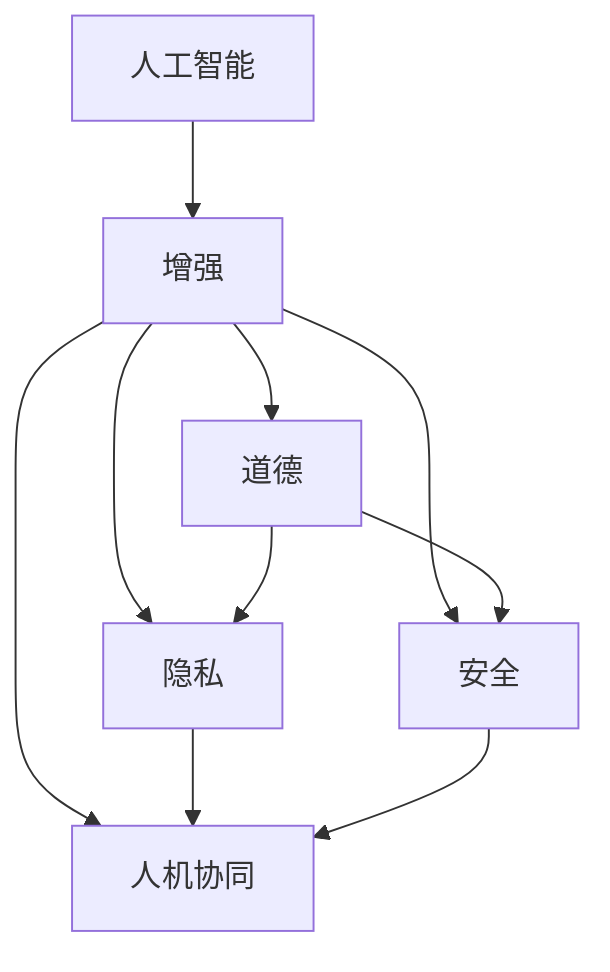

                 

# AI时代的人类增强：道德、隐私和安全的平衡

> 关键词：人工智能(AI)、增强（augmentation）、道德（ethics）、隐私（privacy）、安全（security）、人机协同（Human-AI Collaboration）

## 1. 背景介绍

### 1.1 问题由来

随着人工智能技术的迅猛发展，AI系统在医疗、教育、金融、交通、娱乐等诸多领域的应用已经深入到人类生活的方方面面。AI系统通过复杂的算法和大规模数据的训练，能够在推理、决策、预测、生成等任务上超越人类，极大提升了生产效率和服务质量。然而，AI技术的快速发展也带来了道德、隐私和安全方面的严峻挑战，引发了广泛的公众关注和讨论。

AI时代的人类增强，是指通过AI技术的辅助，扩展或提升人类的认知能力、感知能力、决策能力、行为能力等，从而改善人类的生活品质和工作效率。人类增强不仅仅是技术问题，更是一个复杂的社会、伦理、法律问题。

### 1.2 问题核心关键点

1. **道德困境**：AI增强技术的广泛应用，使得人类面临前所未有的道德挑战。如何在提升人类能力的同时，避免机器行为违背人类伦理和价值观？
2. **隐私保护**：AI系统在处理大量个人数据时，如何保证用户隐私不被侵犯？如何平衡数据利用和隐私保护？
3. **安全保障**：AI系统在执行关键任务时，如何确保系统的鲁棒性和安全性，避免造成人身财产损害？
4. **人机协同**：如何构建人机协同的合作框架，充分发挥AI与人类各自的优势，提升系统效能？

这些核心问题相互关联，构成了AI时代人类增强的复杂性。本文将深入探讨这些问题，并提出解决方案，以期为人机协同的未来发展提供有益的参考。

## 2. 核心概念与联系

### 2.1 核心概念概述

为更好地理解AI时代的人类增强，本节将介绍几个密切相关的核心概念：

- **人工智能（AI）**：以数据和算法为基础，可以执行复杂任务的智能系统。
- **增强（augmentation）**：通过技术手段提升人类能力，包括认知、感知、决策、行为等。
- **道德（ethics）**：指导人类行为和决策的价值原则，如公正、诚实、责任、尊重等。
- **隐私（privacy）**：个人信息的保护，避免未经授权的获取、使用和泄露。
- **安全（security）**：系统和数据的保护，避免非法攻击、篡改和泄露。
- **人机协同（Human-AI Collaboration）**：人与AI系统协作完成复杂任务的合作模式。

这些核心概念之间的逻辑关系可以通过以下Mermaid流程图来展示：



这个流程图展示了大语言模型的核心概念及其之间的关系：

1. AI技术提供增强能力，但需要在道德、隐私、安全框架下进行。
2. 道德、隐私、安全相互联系，共同构建AI系统的社会责任。
3. 人机协同是AI增强的目标模式，需要在道德、隐私、安全保障下实现。

## 3. 核心算法原理 & 具体操作步骤

### 3.1 算法原理概述

AI时代的人类增强，核心在于通过AI技术提升人类的能力，同时确保这些能力的应用符合道德、隐私和安全的原则。主要包括以下几个关键算法：

1. **增强算法**：基于机器学习和深度学习，开发提升人类认知、感知、决策、行为等能力的AI系统。
2. **道德算法**：设计AI系统的道德规范和行为准则，确保其行为符合人类伦理和价值观。
3. **隐私保护算法**：在AI系统中引入隐私保护机制，避免数据泄露和滥用。
4. **安全保障算法**：构建AI系统的安全机制，确保系统的鲁棒性和安全性。
5. **人机协同算法**：设计人机协作模式，充分发挥AI与人类各自的优势，提升系统效能。

### 3.2 算法步骤详解

1. **数据收集与预处理**：收集与增强目标相关的数据，如健康数据、教育数据、交通数据等，并进行清洗、归一化等预处理。
2. **模型训练与优化**：使用增强算法对预处理后的数据进行模型训练，优化模型的性能和泛化能力。
3. **道德审查与规范**：在模型设计阶段进行道德审查，确保模型行为符合伦理和价值观。
4. **隐私保护设计**：引入隐私保护算法，如差分隐私、联邦学习、同态加密等，保护用户隐私。
5. **安全测试与加固**：进行系统安全测试，加固模型的鲁棒性和安全性，避免攻击和漏洞。
6. **人机协作设计**：设计人机协同的交互界面和控制逻辑，确保人类能够有效使用AI系统。

### 3.3 算法优缺点

AI时代的人类增强，具有以下优点：

1. **提升效率**：通过AI技术的辅助，可以显著提升人类的生产效率和服务质量，降低工作强度。
2. **增强能力**：AI技术可以扩展人类在认知、感知、决策、行为等方面的能力，弥补人类能力的不足。
3. **创新突破**：AI技术推动了科技创新和社会进步，带来新的发展机遇。

但同时，也存在以下缺点：

1. **道德风险**：AI系统的决策过程可能违背人类伦理和价值观，造成社会道德风险。
2. **隐私泄露**：AI系统在处理大量个人数据时，存在隐私泄露的风险。
3. **安全威胁**：AI系统的鲁棒性和安全性不足，可能造成人身财产损害。
4. **人机冲突**：人机协作过程中，可能出现人类和AI系统之间的认知冲突和行为冲突。

### 3.4 算法应用领域

AI时代的人类增强，已经在医疗、教育、金融、交通、娱乐等多个领域得到广泛应用，具体如下：

- **医疗**：通过AI技术辅助诊断、治疗、药物研发等，提升医疗服务的质量和效率。
- **教育**：通过AI技术个性化教学、智能辅导、考试测评等，提升教育质量和教学效果。
- **金融**：通过AI技术风险预测、智能投顾、欺诈检测等，提升金融服务的精准度和安全性。
- **交通**：通过AI技术交通管理、自动驾驶、智能导航等，提升交通系统的运行效率和安全性。
- **娱乐**：通过AI技术内容推荐、智能创作、虚拟现实等，提升娱乐体验的丰富性和沉浸感。

## 4. 数学模型和公式 & 详细讲解 & 举例说明

### 4.1 数学模型构建

本节将使用数学语言对AI时代的人类增强模型进行更加严格的刻画。

设增强任务为 $T$，AI系统的输入为 $x$，输出为 $y$。设增强算法的损失函数为 $\ell(\theta)$，其中 $\theta$ 为模型参数。增强模型的训练目标为最小化损失函数 $\ell(\theta)$，即：

$$
\theta^* = \mathop{\arg\min}_{\theta} \ell(\theta)
$$

其中，$\ell(\theta)$ 通常为交叉熵损失函数，衡量模型输出与真实标签之间的差异。

### 4.2 公式推导过程

以二分类任务为例，推导交叉熵损失函数及其梯度的计算公式。

设模型 $M_{\theta}$ 在输入 $x$ 上的输出为 $\hat{y}=M_{\theta}(x) \in [0,1]$，表示样本属于正类的概率。真实标签 $y \in \{0,1\}$。则二分类交叉熵损失函数定义为：

$$
\ell(M_{\theta}(x),y) = -[y\log \hat{y} + (1-y)\log (1-\hat{y})]
$$

将其代入经验风险公式，得：

$$
\mathcal{L}(\theta) = -\frac{1}{N}\sum_{i=1}^N [y_i\log M_{\theta}(x_i)+(1-y_i)\log(1-M_{\theta}(x_i))]
$$

根据链式法则，损失函数对参数 $\theta_k$ 的梯度为：

$$
\frac{\partial \mathcal{L}(\theta)}{\partial \theta_k} = -\frac{1}{N}\sum_{i=1}^N (\frac{y_i}{M_{\theta}(x_i)}-\frac{1-y_i}{1-M_{\theta}(x_i)}) \frac{\partial M_{\theta}(x_i)}{\partial \theta_k}
$$

其中 $\frac{\partial M_{\theta}(x_i)}{\partial \theta_k}$ 可进一步递归展开，利用自动微分技术完成计算。

### 4.3 案例分析与讲解

以医疗影像增强为例，假设有N张医疗影像数据 $D=\{x_i\}_{i=1}^N$，每张影像的标签 $y_i \in \{Normal, Disease\}$。使用卷积神经网络（CNN）作为增强算法，对数据进行训练，最小化交叉熵损失函数。具体步骤如下：

1. 数据预处理：对医疗影像进行归一化、旋转、裁剪等预处理。
2. 模型设计：设计卷积神经网络模型，输入为医疗影像，输出为二分类结果。
3. 训练优化：使用反向传播算法和随机梯度下降法（SGD），最小化交叉熵损失函数。
4. 道德审查：设计模型行为准则，确保模型预测符合医疗伦理。
5. 隐私保护：使用差分隐私技术，保护患者隐私。
6. 安全加固：进行系统漏洞扫描和攻击测试，确保模型安全性。
7. 人机协同：设计医生与AI系统交互界面，确保医生能够有效使用AI系统。

## 5. 项目实践：代码实例和详细解释说明

### 5.1 开发环境搭建

在进行增强算法实践前，我们需要准备好开发环境。以下是使用Python进行TensorFlow开发的环境配置流程：

1. 安装Anaconda：从官网下载并安装Anaconda，用于创建独立的Python环境。

2. 创建并激活虚拟环境：
```bash
conda create -n tf-env python=3.8 
conda activate tf-env
```

3. 安装TensorFlow：根据CUDA版本，从官网获取对应的安装命令。例如：
```bash
conda install tensorflow=2.6 cudatoolkit=11.1 -c conda-forge -c pytorch
```

4. 安装TensorFlow Addons：额外库，用于增强算法。
```bash
pip install tensorflow-addons
```

5. 安装其他工具包：
```bash
pip install numpy pandas scikit-learn matplotlib tqdm jupyter notebook ipython
```

完成上述步骤后，即可在`tf-env`环境中开始增强算法实践。

### 5.2 源代码详细实现

这里我们以医疗影像增强为例，给出使用TensorFlow对卷积神经网络进行二分类任务增强的代码实现。

首先，定义数据预处理函数：

```python
import tensorflow as tf
from tensorflow.keras.preprocessing.image import ImageDataGenerator

def preprocess_data(data_dir, batch_size=32, img_height=256, img_width=256):
    datagen = ImageDataGenerator(
        rescale=1./255,
        shear_range=0.2,
        zoom_range=0.2,
        horizontal_flip=True
    )
    train_generator = datagen.flow_from_directory(
        data_dir,
        target_size=(img_height, img_width),
        batch_size=batch_size,
        class_mode='binary'
    )
    return train_generator
```

然后，定义模型和优化器：

```python
from tensorflow.keras import layers

model = tf.keras.Sequential([
    layers.Conv2D(32, 3, activation='relu', input_shape=(256, 256, 3)),
    layers.MaxPooling2D(),
    layers.Conv2D(64, 3, activation='relu'),
    layers.MaxPooling2D(),
    layers.Flatten(),
    layers.Dense(1, activation='sigmoid')
])

optimizer = tf.keras.optimizers.Adam()
```

接着，定义训练和评估函数：

```python
def train_epoch(model, dataset, batch_size, optimizer):
    model.compile(optimizer=optimizer, loss='binary_crossentropy', metrics=['accuracy'])
    model.fit(dataset, epochs=1, batch_size=batch_size)
    
def evaluate(model, dataset, batch_size):
    loss, accuracy = model.evaluate(dataset, batch_size=batch_size)
    print(f'Loss: {loss:.4f}, Accuracy: {accuracy:.4f}')
```

最后，启动训练流程并在测试集上评估：

```python
train_data_dir = '/path/to/train_data'
test_data_dir = '/path/to/test_data'

train_generator = preprocess_data(train_data_dir)
test_generator = preprocess_data(test_data_dir)

epochs = 5
batch_size = 16

for epoch in range(epochs):
    train_epoch(model, train_generator, batch_size, optimizer)
    evaluate(model, test_generator, batch_size)
```

以上就是使用TensorFlow对卷积神经网络进行医疗影像增强的完整代码实现。可以看到，TensorFlow提供了强大的深度学习框架，使得模型设计和训练过程变得简便高效。

### 5.3 代码解读与分析

让我们再详细解读一下关键代码的实现细节：

**preprocess_data函数**：
- `ImageDataGenerator`：对输入数据进行归一化、旋转、缩放等预处理，生成标准化数据集。
- `flow_from_directory`：从目录中读取图像，自动进行分类。

**模型定义**：
- `Sequential`：定义线性堆叠的神经网络模型。
- `Conv2D`：卷积层，提取图像特征。
- `MaxPooling2D`：池化层，减少特征图大小。
- `Flatten`：将特征图展开成一维向量。
- `Dense`：全连接层，进行分类。

**训练和评估函数**：
- `compile`：配置优化器、损失函数和评估指标。
- `fit`：进行模型训练，指定训练数据集、批次大小和迭代次数。
- `evaluate`：进行模型评估，输出损失和精度。

**训练流程**：
- 定义数据集和批次大小。
- 循环迭代训练过程，每次训练一个epoch，评估模型性能。

可以看到，TensorFlow提供了一系列工具和函数，方便开发者快速构建和训练增强算法模型。

## 6. 实际应用场景

### 6.1 智能医疗系统

基于AI技术的医疗影像增强，可以在医疗影像分析、疾病预测、治疗辅助等方面发挥巨大作用。传统医疗影像分析依赖人工识别，耗时耗力且误差率高。通过AI系统，可以实现自动化、高效的影像增强，显著提升医疗服务质量和效率。

具体而言，可以收集大量的医疗影像数据，进行预处理和标注。在此基础上，对预训练的卷积神经网络进行微调，使其适应特定的医学影像增强任务。微调后的模型能够自动识别影像中的病变区域，提取关键特征，为医生提供辅助诊断和建议。

### 6.2 智能教育系统

AI技术在教育领域的应用，主要体现在个性化教学和智能辅导等方面。通过AI系统，可以实时分析学生的学习行为，提供个性化的学习方案，提升教学效果和学习效率。

具体实现方式包括：
- 收集学生的学习数据，如考试成绩、作业完成情况、课堂互动等。
- 使用深度学习算法，如推荐系统、情感分析等，分析学生的学习状态和行为模式。
- 根据分析结果，生成个性化的学习建议和辅导方案，引导学生有效学习。

### 6.3 智能金融系统

AI技术在金融领域的应用，主要体现在风险预测、智能投顾、欺诈检测等方面。通过AI系统，可以实时监控金融市场，预测市场走势，优化投资策略，防范欺诈行为。

具体实现方式包括：
- 收集金融市场的各种数据，如股票价格、交易量、新闻评论等。
- 使用深度学习算法，如时间序列分析、情感分析等，分析金融市场动态。
- 根据分析结果，预测市场走势，优化投资组合，检测异常交易行为。

### 6.4 未来应用展望

伴随AI技术的不断发展，AI时代的人类增强将在更多领域得到应用，为人类带来新的变革和机遇。

在智慧城市治理中，AI系统可以通过交通监测、环境监测、灾害预警等，提升城市管理效率和安全性。

在智能农业中，AI系统可以通过图像识别、智能灌溉、病虫害预测等，提升农业生产效率和质量。

在智能制造中，AI系统可以通过预测维护、智能调度、质量检测等，提升制造业的智能化水平。

此外，在智慧教育、智能交通、智能娱乐等多个领域，AI技术也将持续深化应用，为人类生活和工作带来更多的便利和提升。

## 7. 工具和资源推荐

### 7.1 学习资源推荐

为了帮助开发者系统掌握AI时代的人类增强理论基础和实践技巧，这里推荐一些优质的学习资源：

1. 《人工智能伦理导论》系列博文：由AI伦理专家撰写，深入浅出地介绍了AI伦理的基础知识，涵盖数据隐私、算法公正、人类安全等方面。

2. 《机器学习：原理、算法与应用》课程：由斯坦福大学开设的机器学习经典课程，涵盖深度学习、强化学习等前沿内容，是学习AI算法的入门必选。

3. 《人工智能：一部进化史》书籍：详细介绍了AI技术的演进历史和前沿进展，涵盖多个应用领域和技术方向，适合AI研究者全面了解。

4. 《AI时代的人类增强》论文：发表于顶级会议和期刊，系统探讨了AI增强的伦理、隐私、安全等方面的研究，提供了很多创新思路和实践建议。

5. 《人机协同的未来》报告：由AI产业联盟发布，深入分析了人机协同的未来趋势和发展路径，为AI技术的未来应用提供了指导。

通过对这些资源的学习实践，相信你一定能够快速掌握AI时代的人类增强的精髓，并用于解决实际的AI问题。

### 7.2 开发工具推荐

高效的开发离不开优秀的工具支持。以下是几款用于AI开发和增强算法开发的常用工具：

1. TensorFlow：由Google主导开发的开源深度学习框架，功能丰富，支持分布式训练和推理，适合大规模工程应用。

2. PyTorch：基于Python的开源深度学习框架，灵活高效，支持动态计算图，适合快速迭代研究。

3. TensorFlow Addons：TensorFlow的扩展库，提供更多深度学习算法的实现，支持增强算法开发。

4. Keras：基于TensorFlow的高级神经网络API，简单易用，适合初学者快速上手。

5. Jupyter Notebook：交互式开发环境，支持Python代码的编写、执行和共享，适合科学计算和数据处理。

6. Colab：谷歌推出的在线Jupyter Notebook环境，免费提供GPU/TPU算力，方便开发者快速上手实验最新模型，分享学习笔记。

合理利用这些工具，可以显著提升AI开发和增强算法的效率，加快创新迭代的步伐。

### 7.3 相关论文推荐

AI时代的人类增强，涉及多学科交叉，涵盖了计算机科学、伦理、隐私、安全等多个方向。以下是几篇具有代表性的相关论文，推荐阅读：

1. A Survey on Ethics in AI: Ethical, Legal, and Social Challenges（JCI 2021）：系统回顾了AI伦理领域的研究现状和挑战，为AI伦理研究提供了全面的视角。

2. Privacy-Preserving AI: A Survey of Techniques and Challenges（IEEE 2021）：深入探讨了AI隐私保护的技术和挑战，为AI系统设计提供了参考。

3. Safe and Reliable AI: Issues and Recommendations（Science 2020）：提出了AI安全性的重要性和建议，为AI系统设计提供了指导。

4. Human-AI Collaboration: Enhancing Human Capabilities with AI（AI Magazine 2022）：讨论了人机协同的机制和应用，为AI增强提供了理论支撑。

这些论文代表了大语言模型微调技术的发展脉络。通过学习这些前沿成果，可以帮助研究者把握学科前进方向，激发更多的创新灵感。

## 8. 总结：未来发展趋势与挑战

### 8.1 总结

本文对AI时代的人类增强进行了全面系统的介绍。首先阐述了AI增强技术的广泛应用及其带来的道德、隐私和安全挑战，明确了这些挑战在构建人机协同系统中的重要性。其次，从原理到实践，详细讲解了增强算法的设计和实现，给出了增强算法任务开发的完整代码实例。同时，本文还广泛探讨了增强算法在智能医疗、智能教育、智能金融等多个行业领域的应用前景，展示了AI增强技术的巨大潜力。此外，本文精选了增强算法的各类学习资源，力求为读者提供全方位的技术指引。

通过本文的系统梳理，可以看到，AI增强技术在提升人类能力、改善人类生活和工作质量方面具有重要意义。然而，伴随技术的发展，也带来了新的伦理、隐私和安全挑战。唯有在这些挑战中找到平衡，才能真正实现AI增强技术的社会价值。

### 8.2 未来发展趋势

展望未来，AI时代的人类增强技术将呈现以下几个发展趋势：

1. **多模态增强**：AI系统将逐步拓展到语音、视觉、触觉等多种模态，实现多感官增强。
2. **协作增强**：AI系统将更加注重与人类协作，发挥各自优势，提升系统效能。
3. **泛在增强**：AI系统将渗透到人类生活的方方面面，实现无处不在的增强。
4. **伦理性增强**：AI系统将更加注重伦理道德，确保其行为符合人类价值观。
5. **隐私保护增强**：AI系统将更加注重隐私保护，避免数据泄露和滥用。
6. **安全性增强**：AI系统将更加注重安全性，避免系统攻击和漏洞。

这些趋势凸显了AI增强技术的广阔前景。这些方向的探索发展，必将进一步提升AI系统的性能和应用范围，为人类生活和工作带来更多的便利和提升。

### 8.3 面临的挑战

尽管AI时代的人类增强技术已经取得了瞩目成就，但在迈向更加智能化、普适化应用的过程中，它仍面临着诸多挑战：

1. **伦理困境**：AI系统的决策过程可能违背人类伦理和价值观，造成社会道德风险。
2. **隐私泄露**：AI系统在处理大量个人数据时，存在隐私泄露的风险。
3. **安全威胁**：AI系统的鲁棒性和安全性不足，可能造成人身财产损害。
4. **人机冲突**：人机协作过程中，可能出现人类和AI系统之间的认知冲突和行为冲突。

这些挑战需要多方协同应对，从技术、社会、法律等多个维度共同努力，才能确保AI增强技术的健康发展。

### 8.4 研究展望

面对AI增强技术面临的种种挑战，未来的研究需要在以下几个方面寻求新的突破：

1. **伦理算法设计**：设计AI系统的道德规范和行为准则，确保其行为符合伦理和价值观。
2. **隐私保护机制**：引入隐私保护算法，如差分隐私、联邦学习、同态加密等，保护用户隐私。
3. **安全性提升**：构建AI系统的安全机制，确保系统的鲁棒性和安全性，避免攻击和漏洞。
4. **人机协同框架**：设计人机协同的交互界面和控制逻辑，确保人类能够有效使用AI系统。
5. **多模态融合**：将符号化的先验知识与神经网络模型进行融合，增强模型的多感官能力和泛化能力。
6. **伦理教育**：开展AI伦理教育，提升公众对AI技术的理解和接受度，促进社会共识的形成。

这些研究方向将推动AI增强技术的持续进步，为构建安全、可靠、可解释、可控的智能系统铺平道路。面向未来，AI增强技术需要在技术、伦理、社会等多个维度进行全面考量，方能真正实现其社会价值。

## 9. 附录：常见问题与解答

**Q1：AI增强技术是否适用于所有领域？**

A: AI增强技术在大多数领域都能取得不错的效果，特别是对于数据量较小的领域。但对于一些特定领域的任务，如医疗、法律等，AI增强的效果可能受到限制。此时需要在特定领域语料上进一步预训练，再进行微调，才能获得理想效果。

**Q2：如何平衡AI增强技术的伦理、隐私和安全？**

A: 平衡AI增强技术的伦理、隐私和安全需要从多个层面进行考量：
1. **伦理审查**：在设计AI系统时进行伦理审查，确保其行为符合伦理和价值观。
2. **隐私保护**：引入隐私保护算法，如差分隐私、联邦学习、同态加密等，保护用户隐私。
3. **安全加固**：进行系统漏洞扫描和攻击测试，确保模型的鲁棒性和安全性。
4. **伦理培训**：对AI系统开发人员进行伦理培训，提升其伦理意识和责任意识。
5. **伦理标准**：制定和推广AI伦理标准，指导AI系统的设计和应用。

**Q3：AI增强技术在实际应用中需要注意哪些问题？**

A: 将AI增强技术转化为实际应用，还需要考虑以下因素：
1. **模型裁剪**：去除不必要的层和参数，减小模型尺寸，加快推理速度。
2. **量化加速**：将浮点模型转为定点模型，压缩存储空间，提高计算效率。
3. **服务化封装**：将模型封装为标准化服务接口，便于集成调用。
4. **弹性伸缩**：根据请求流量动态调整资源配置，平衡服务质量和成本。
5. **监控告警**：实时采集系统指标，设置异常告警阈值，确保服务稳定性。
6. **安全防护**：采用访问鉴权、数据脱敏等措施，保障数据和模型安全。

这些因素在实际应用中都需要综合考虑，才能充分发挥AI增强技术的效能。

---

作者：禅与计算机程序设计艺术 / Zen and the Art of Computer Programming

