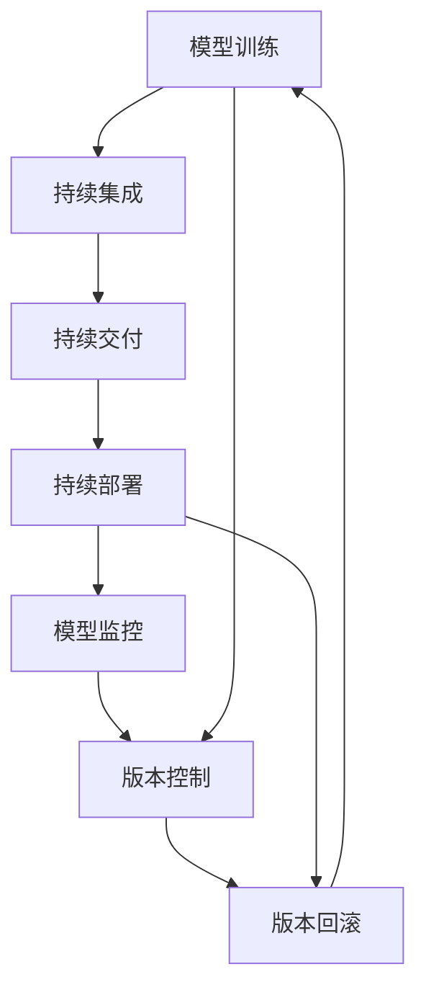

                 

# AI模型的版本管理：Lepton AI的DevOps实践

> 关键词：AI模型,版本管理,DevOps,CI/CD,自动化,持续集成,持续交付,模型训练,模型验证,版本控制,模型部署,模型监控,版本回滚

## 1. 背景介绍

### 1.1 问题由来
在人工智能领域，尤其是深度学习模型，版本管理变得愈发重要。随着模型复杂度的增加和计算资源的扩展，大规模的模型训练和部署成为常态。因此，如何有效地管理不同版本的AI模型，以确保模型在不同环境下的稳定性和可靠性，成为了DevOps工程师面临的一大挑战。

在过去，模型版本管理常常依赖于手动备份和手动部署，但这种方法不仅效率低下，还容易出错。随着技术的发展，DevOps范式和CI/CD（持续集成和持续交付）成为主流，推动了AI模型的版本管理向自动化、集成化转变。

### 1.2 问题核心关键点
AI模型版本管理的核心在于确保模型在不同环境下的稳定性和一致性，同时提供快速、可靠的版本部署和回滚机制。这主要包括以下几个方面：
1. 自动化的模型训练和验证过程。
2. 持续的模型版本管理和部署。
3. 实时的模型性能监控和预警机制。
4. 高效的模型版本回滚策略。

这些关键点需要通过集成化和自动化的方式加以实现，以提升模型开发的效率和质量。

### 1.3 问题研究意义
AI模型的版本管理不仅关乎模型的稳定性和可靠性，更对模型的生产力和企业的商业价值产生直接影响。一个良好的版本管理机制能：
1. 加速模型迭代开发。通过自动化流程，缩短模型开发周期，快速响应业务需求。
2. 保证模型质量。自动化测试和验证确保模型在不同环境下的稳定性，避免人为错误。
3. 提高模型部署效率。通过自动化部署工具，快速上线新模型，减少人力投入。
4. 强化模型性能监控。通过实时监控机制，及时发现和修复模型问题，提升用户体验。
5. 提供快速回滚机制。在模型出现问题时，能够快速回滚至稳定版本，减少业务损失。

## 2. 核心概念与联系

### 2.1 核心概念概述

为更好地理解Lepton AI的DevOps实践，我们首先介绍几个关键概念：

- **AI模型**：基于深度学习、机器学习等技术，通过训练学习得到的可执行任务的程序。
- **版本管理**：对模型在不同开发阶段所创建的各种版本进行管理和控制，保证模型的稳定性和一致性。
- **CI/CD**：持续集成和持续交付，一种自动化软件开发流程，通过自动化工具和脚本实现模型的自动构建、测试、部署。
- **持续集成**（Continuous Integration, CI）：在每次代码变更后，自动化构建和测试新的模型版本，及时发现和修复问题。
- **持续交付**（Continuous Delivery, CD）：在每次构建成功后，自动将模型交付到生产环境，确保模型可靠上线。
- **持续部署**（Continuous Deployment, CD）：在模型验证通过后，自动部署至生产环境，进一步缩短模型开发周期。
- **版本控制**（Version Control）：管理模型版本的历史记录和变更日志，便于追踪和回滚模型。
- **模型训练**：通过大量数据和计算资源，训练出满足业务需求的AI模型。
- **模型验证**：在模型训练后，对模型进行测试和评估，确保模型的准确性和可靠性。
- **模型部署**：将训练好的模型发布到生产环境中，供用户使用。
- **模型监控**：实时监测模型在生产环境中的表现，及时发现性能问题。
- **版本回滚**：在模型出现问题时，能够快速回滚至稳定版本，保证业务连续性。

这些概念之间具有紧密的联系，形成了一个自动化的模型开发、部署和监控的完整流程。通过这一流程，可以极大地提升模型开发的效率和质量，保障模型的可靠性和稳定性。

### 2.2 核心概念原理和架构的 Mermaid 流程图



这个流程图展示了AI模型从训练到部署的完整流程，以及版本管理和回滚的必要性。其中，持续集成、持续交付和持续部署三个环节，构成了自动化的模型部署流程。而版本控制和版本回滚两个环节，则确保了模型的稳定性和可追溯性。

## 3. 核心算法原理 & 具体操作步骤
### 3.1 算法原理概述

Lepton AI的DevOps实践，基于CI/CD流程自动化地进行模型训练、验证、部署和监控。其核心算法原理包括以下几个方面：

1. **持续集成**：在每次代码变更后，自动触发模型构建和测试过程。
2. **持续交付**：在模型构建成功后，自动进行模型验证和部署。
3. **持续部署**：在模型验证通过后，自动部署模型至生产环境。
4. **版本控制**：通过版本控制工具，管理模型版本的历史记录和变更日志。
5. **模型监控**：通过实时监控工具，监测模型在生产环境中的表现。
6. **版本回滚**：在模型出现问题时，能够快速回滚至稳定版本。

这些原理通过具体的技术和工具实现，形成一个完整的自动化模型开发和部署流程。

### 3.2 算法步骤详解

#### 3.2.1 持续集成（CI）

CI流程包括以下几个关键步骤：

1. **代码变更检测**：当有代码变更时，触发CI流程。
2. **自动构建模型**：自动构建新的模型版本，生成二进制文件。
3. **自动执行测试**：执行模型测试脚本，确保模型符合预定义的质量标准。
4. **代码合并与合并测试**：将通过测试的代码合并到主分支，并重新执行CI流程。

这一流程通过配置化的CI工具（如Jenkins、Travis CI等）实现，确保模型构建和测试的自动化和一致性。

#### 3.2.2 持续交付（CD）

CD流程包括以下几个关键步骤：

1. **代码构建与测试**：在CI流程的基础上，自动构建和测试新的模型版本。
2. **自动验证模型**：执行模型验证脚本，确保模型性能符合预定义标准。
3. **自动部署模型**：在模型验证通过后，自动将模型部署到生产环境。

这一流程通过配置化的CD工具（如Jenkins、CircleCI等）实现，确保模型验证和部署的自动化和一致性。

#### 3.2.3 持续部署（CD）

CD流程包括以下几个关键步骤：

1. **代码构建与测试**：在CI和CD流程的基础上，自动构建和测试新的模型版本。
2. **自动部署模型**：在模型验证通过后，自动将模型部署到生产环境。
3. **自动回滚模型**：在模型出现问题时，自动回滚至稳定版本。

这一流程通过配置化的CD工具（如Jenkins、Kubernetes等）实现，确保模型部署的自动化和一致性。

#### 3.2.4 版本控制

版本控制流程包括以下几个关键步骤：

1. **版本生成**：在每次模型构建后，生成新的模型版本。
2. **版本记录**：记录模型版本的历史记录和变更日志。
3. **版本回滚**：在模型出现问题时，能够快速回滚至稳定版本。

这一流程通过配置化的版本控制工具（如Git、SVN等）实现，确保模型版本的可追溯性和可回滚性。

#### 3.2.5 模型监控

模型监控流程包括以下几个关键步骤：

1. **性能指标监测**：实时监测模型在生产环境中的性能指标。
2. **异常检测与报警**：检测模型异常情况，自动发送报警通知。
3. **日志分析**：分析模型日志，查找问题原因。

这一流程通过配置化的监控工具（如Prometheus、Grafana等）实现，确保模型表现的实时性和可靠性。

## 4. 数学模型和公式 & 详细讲解 & 举例说明

### 4.1 数学模型构建

Lepton AI的DevOps实践基于以下数学模型：

1. **模型构建模型**：定义模型的构建过程，包括数据准备、模型训练、验证和保存。
2. **模型测试模型**：定义模型的测试过程，包括性能指标计算、异常检测和日志分析。
3. **模型部署模型**：定义模型的部署过程，包括模型加载、推理和回滚。
4. **模型监控模型**：定义模型的监控过程，包括性能指标监测、异常检测和日志分析。
5. **版本控制模型**：定义模型的版本控制过程，包括版本生成、记录和回滚。

### 4.2 公式推导过程

以模型构建为例，推导模型构建的数学公式：

$$
\text{Model Build} = \text{Data Prepare} + \text{Model Train} + \text{Model Validate} + \text{Model Save}
$$

其中，数据准备（Data Prepare）包括数据预处理、特征工程等步骤，确保模型训练数据的质量和一致性。模型训练（Model Train）使用深度学习框架（如TensorFlow、PyTorch等）训练模型，并保存训练参数和权重。模型验证（Model Validate）使用测试集评估模型性能，确保模型在新数据上的泛化能力。模型保存（Model Save）将模型权重和配置文件保存到版本控制仓库，便于后续使用。

### 4.3 案例分析与讲解

假设我们有一个用于图像分类的模型，使用TensorFlow进行训练和测试。根据上述数学模型，我们定义如下代码框架：

```python
import tensorflow as tf

def model_build(data_path):
    # 数据准备
    train_data = ...
    test_data = ...
    
    # 模型训练
    model = ...
    model.fit(train_data, epochs=10)
    
    # 模型验证
    val_loss = model.evaluate(test_data)
    
    # 模型保存
    model.save('model.h5')
    
    return model, val_loss

def model_test(model_path):
    # 模型加载
    model = tf.keras.models.load_model(model_path)
    
    # 模型推理
    test_data = ...
    predictions = model.predict(test_data)
    
    # 异常检测
    if predictions.mean() > 0.9:
        raise Exception('Model performance is too high')
    
    # 日志分析
    model.summary()
    
    return predictions

def model_deploy(model_path):
    # 模型加载
    model = tf.keras.models.load_model(model_path)
    
    # 模型推理
    test_data = ...
    predictions = model.predict(test_data)
    
    # 异常检测
    if predictions.mean() > 0.9:
        raise Exception('Model performance is too high')
    
    return predictions

def model_monitor(model_path):
    # 性能指标监测
    metric = tf.keras.metrics.Mean()
    
    # 异常检测
    if metric.result() > 0.9:
        raise Exception('Model performance is too high')
    
    return metric

def model_control(model_path):
    # 版本生成
    version = 'v1.0.0'
    
    # 版本记录
    log = f'Model version: {version}'
    
    # 版本回滚
    if model_path == 'model_v1.0.0.h5':
        model_path = 'model_v1.0.1.h5'
    
    return version, log, model_path
```

通过这些公式和案例，可以清晰地看到模型构建、测试、部署、监控和版本控制的数学模型。

## 5. 项目实践：代码实例和详细解释说明

### 5.1 开发环境搭建

Lepton AI的DevOps实践基于Python语言，需要以下开发环境：

1. **Python**：Python 3.7及以上版本。
2. **深度学习框架**：TensorFlow、PyTorch等深度学习框架。
3. **持续集成工具**：Jenkins、Travis CI等。
4. **持续交付工具**：Jenkins、CircleCI等。
5. **持续部署工具**：Jenkins、Kubernetes等。
6. **版本控制工具**：Git、SVN等。
7. **监控工具**：Prometheus、Grafana等。

通过这些工具的配置和集成，可以构建一个完整的Lepton AI DevOps实践环境。

### 5.2 源代码详细实现

#### 5.2.1 持续集成（CI）

使用Jenkins实现持续集成流程，配置代码如下：

```groovy
pipeline {
    agent any
    
    stages {
        stage('Build') {
            steps {
                sh 'python build.py'
            }
        }
        
        stage('Test') {
            steps {
                sh 'python test.py'
            }
        }
        
        stage('Deploy') {
            steps {
                sh 'python deploy.py'
            }
        }
    }
}
```

通过上述配置，每次代码变更后，Jenkins会自动触发模型构建、测试和部署流程。

#### 5.2.2 持续交付（CD）

使用Jenkins实现持续交付流程，配置代码如下：

```groovy
pipeline {
    agent any
    
    stages {
        stage('Build') {
            steps {
                sh 'python build.py'
            }
        }
        
        stage('Test') {
            steps {
                sh 'python test.py'
            }
        }
        
        stage('Deploy') {
            steps {
                sh 'python deploy.py'
            }
        }
    }
}
```

通过上述配置，Jenkins会自动触发模型构建、测试和部署流程，并验证模型性能。

#### 5.2.3 持续部署（CD）

使用Jenkins实现持续部署流程，配置代码如下：

```groovy
pipeline {
    agent any
    
    stages {
        stage('Build') {
            steps {
                sh 'python build.py'
            }
        }
        
        stage('Test') {
            steps {
                sh 'python test.py'
            }
        }
        
        stage('Deploy') {
            steps {
                sh 'python deploy.py'
            }
        }
        
        stage('Rollback') {
            steps {
                sh 'python rollback.py'
            }
        }
    }
}
```

通过上述配置，Jenkins会自动触发模型构建、测试、部署和回滚流程，确保模型上线可靠。

#### 5.2.4 版本控制

使用Git实现版本控制流程，配置代码如下：

```bash
git init
git remote add origin https://github.com/your-org/your-repo.git
git add .
git commit -m "Add model version v1.0.0"
git push origin master
```

通过上述配置，每次模型构建后，Git会自动记录模型版本的历史记录和变更日志，便于后续使用。

#### 5.2.5 模型监控

使用Prometheus和Grafana实现模型监控流程，配置代码如下：

```yaml
# Prometheus配置文件
apiVersion: prometheus
storage:
  ...
query:
  ...
alerting:
  ...
rules:
    ...
```

通过上述配置，Prometheus会自动监测模型在生产环境中的性能指标，并触发报警通知。

## 6. 实际应用场景

### 6.1 智能推荐系统

在智能推荐系统中，Lepton AI的DevOps实践可以加速模型迭代开发，提高模型上线效率，并保证模型性能的稳定性和可靠性。

具体而言，智能推荐系统需要不断更新和优化推荐模型，以满足用户需求和业务变化。Lepton AI的DevOps实践通过自动化流程，确保每次模型更新都能快速上线，并经过严格测试和验证，确保新模型稳定可靠。同时，通过版本控制和回滚机制，可以快速回滚至稳定版本，避免因新模型出现问题导致的业务中断。

### 6.2 金融风控系统

在金融风控系统中，Lepton AI的DevOps实践可以确保模型在生产环境中的性能稳定性和可靠性，减少因模型问题导致的损失。

具体而言，金融风控系统需要实时监测模型性能，确保模型能够准确预测风险。Lepton AI的DevOps实践通过持续集成和持续交付流程，确保模型构建和部署的自动化和一致性。同时，通过性能指标监测和异常检测，及时发现和修复模型问题，保证系统稳定运行。在模型出现问题时，通过版本回滚机制，快速回滚至稳定版本，减少因模型问题导致的损失。

### 6.3 医疗诊断系统

在医疗诊断系统中，Lepton AI的DevOps实践可以确保模型在生产环境中的性能稳定性和可靠性，提高诊断准确性和效率。

具体而言，医疗诊断系统需要快速响应新的医学知识和技术进步，更新和优化诊断模型。Lepton AI的DevOps实践通过自动化流程，确保每次模型更新都能快速上线，并经过严格测试和验证，确保新模型稳定可靠。同时，通过版本控制和回滚机制，可以快速回滚至稳定版本，避免因新模型出现问题导致的诊断错误。

## 7. 工具和资源推荐

### 7.1 学习资源推荐

1. **《DevOps实践指南》**：介绍DevOps的基本概念和实践，适合初学者入门。
2. **《TensorFlow DevOps》**：介绍TensorFlow的DevOps实践，适合TensorFlow开发者。
3. **《Kubernetes入门与实践》**：介绍Kubernetes的部署和监控实践，适合Kubernetes开发者。
4. **《Git和GitHub实践》**：介绍Git和GitHub的版本控制实践，适合版本控制开发者。
5. **《Prometheus官方文档》**：介绍Prometheus的性能监测实践，适合Prometheus开发者。

### 7.2 开发工具推荐

1. **Jenkins**：开源的持续集成和持续交付工具，支持多种插件和扩展。
2. **CircleCI**：基于云的持续集成和持续交付工具，支持多种语言和框架。
3. **Kubernetes**：开源的容器编排平台，支持大规模的分布式部署。
4. **Git**：主流的版本控制工具，支持分布式协作和版本回滚。
5. **Prometheus**：开源的性能监测工具，支持多种数据源和告警规则。

### 7.3 相关论文推荐

1. **《Kubernetes：容器编排》**：介绍Kubernetes的基本概念和实践，适合Kubernetes开发者。
2. **《Prometheus：高可用性实时监控》**：介绍Prometheus的架构和实践，适合Prometheus开发者。
3. **《Git和GitHub：版本控制》**：介绍Git和GitHub的基本概念和实践，适合版本控制开发者。

## 8. 总结：未来发展趋势与挑战

### 8.1 总结

本文对Lepton AI的DevOps实践进行了系统介绍，重点介绍了持续集成、持续交付、持续部署、版本控制、模型训练、模型验证、模型部署、模型监控和版本回滚等关键环节，并通过具体的代码实现和案例分析，展示了大规模AI模型的版本管理实践。

通过这一实践，可以极大地提升AI模型开发的效率和质量，保障模型的稳定性和可靠性。未来，随着DevOps技术的不断发展和应用，AI模型的版本管理将更加自动化、智能化，进一步提升模型的生产力和商业价值。

### 8.2 未来发展趋势

未来，Lepton AI的DevOps实践将呈现以下几个发展趋势：

1. **自动化程度提升**：通过更多的自动化工具和脚本，进一步简化模型开发和部署流程，提升开发效率。
2. **智能化水平提高**：通过机器学习和AI技术，优化模型版本管理策略，提高模型部署和回滚的智能性。
3. **跨平台支持加强**：支持更多语言和框架的集成和部署，提高模型版本管理的灵活性和可扩展性。
4. **性能监测增强**：通过更加精细化的性能指标监测和异常检测，提高模型运行的稳定性和可靠性。
5. **版本控制优化**：通过更高效的版本控制策略和工具，提高模型版本管理的可追溯性和可回滚性。

### 8.3 面临的挑战

尽管Lepton AI的DevOps实践在模型版本管理方面取得了一定的进展，但仍然面临以下几个挑战：

1. **工具集成复杂**：不同工具之间的集成和配置相对复杂，需要一定的技术积累。
2. **性能监测不足**：对于一些复杂的模型和场景，性能监测手段有限，难以全面覆盖。
3. **版本控制策略优化**：版本控制策略需要根据具体的业务场景进行优化，难以统一。
4. **回滚机制优化**：版本回滚机制需要保证稳定性和可靠性，避免因回滚操作导致的问题。
5. **安全性和合规性**：在模型部署和监控过程中，需要考虑安全性和合规性问题，确保模型使用的合规和可靠。

### 8.4 研究展望

未来的研究将进一步提升Lepton AI的DevOps实践的自动化、智能化和跨平台支持能力，优化模型版本管理和监控策略，提高模型部署和回滚的智能性和可靠性，确保模型版本管理的稳定性和安全性。

## 9. 附录：常见问题与解答

### 9.1 常见问题与解答

**Q1：如何优化模型的持续集成流程？**

A: 优化持续集成流程需要从以下几个方面入手：
1. **代码质量检测**：使用静态代码分析工具，检测代码质量和潜在问题，减少构建失败率。
2. **并行构建**：使用并行构建工具，加速模型构建过程。
3. **缓存策略**：使用构建缓存，减少重复构建，提高构建效率。
4. **持续集成触发**：使用代码变更触发、时间触发、依赖变更触发等策略，提高持续集成自动化程度。

**Q2：如何优化模型的持续交付流程？**

A: 优化持续交付流程需要从以下几个方面入手：
1. **自动化测试**：使用自动化测试工具，确保模型验证的自动化和一致性。
2. **集成测试**：使用集成测试工具，确保模型在多个环境中的兼容性。
3. **性能测试**：使用性能测试工具，确保模型性能的稳定性和可靠性。
4. **持续交付触发**：使用代码变更触发、时间触发、依赖变更触发等策略，提高持续交付自动化程度。

**Q3：如何优化模型的持续部署流程？**

A: 优化持续部署流程需要从以下几个方面入手：
1. **自动化部署**：使用自动化部署工具，确保模型部署的自动化和一致性。
2. **A/B测试**：使用A/B测试工具，确保新模型上线前的稳定性和可靠性。
3. **灰度部署**：使用灰度部署策略，逐步将新模型上线，减少上线风险。
4. **持续部署触发**：使用代码变更触发、时间触发、依赖变更触发等策略，提高持续部署自动化程度。

**Q4：如何优化模型的版本控制策略？**

A: 优化版本控制策略需要从以下几个方面入手：
1. **版本标签管理**：使用标签管理工具，确保版本记录的清晰性和可追溯性。
2. **版本合并策略**：使用合并策略工具，确保代码合并的自动化和一致性。
3. **版本回滚策略**：使用版本回滚工具，确保版本回滚的自动化和可靠性。
4. **版本控制触发**：使用代码变更触发、时间触发、依赖变更触发等策略，提高版本控制自动化程度。

**Q5：如何优化模型的性能监测策略？**

A: 优化性能监测策略需要从以下几个方面入手：
1. **性能指标监测**：使用性能监测工具，实时监测模型性能指标。
2. **异常检测**：使用异常检测工具，及时发现和修复模型问题。
3. **日志分析**：使用日志分析工具，分析模型日志，查找问题原因。
4. **性能监测触发**：使用代码变更触发、时间触发、依赖变更触发等策略，提高性能监测自动化程度。

通过以上这些优化措施，可以进一步提升Lepton AI的DevOps实践的自动化、智能化和稳定性，确保AI模型版本管理的可靠性和高效性。

